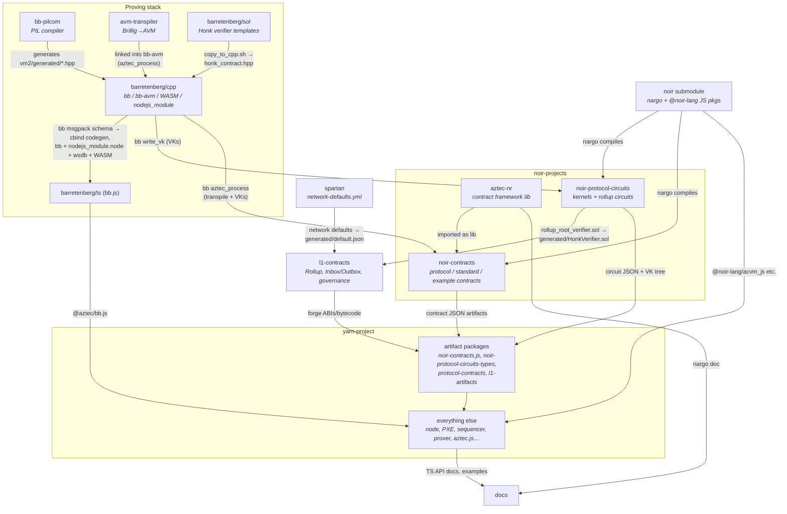
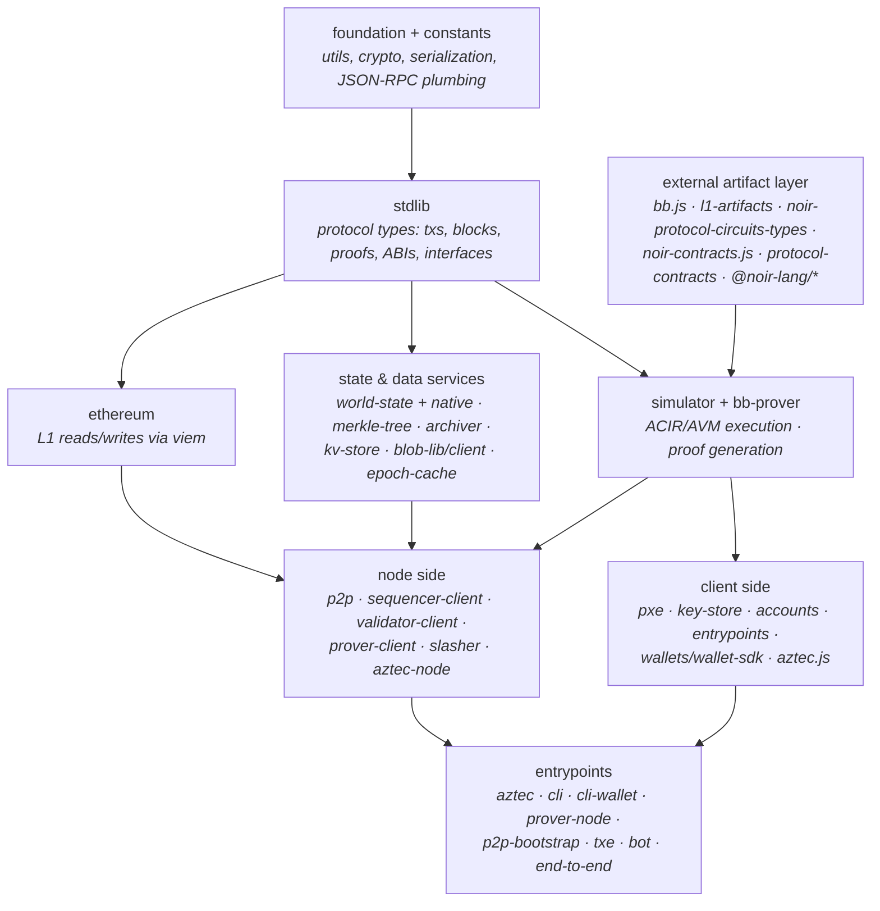
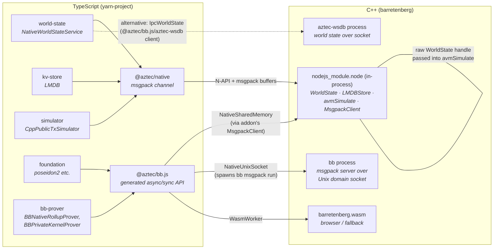
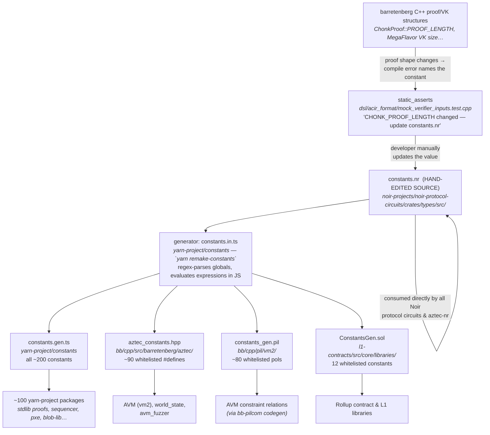
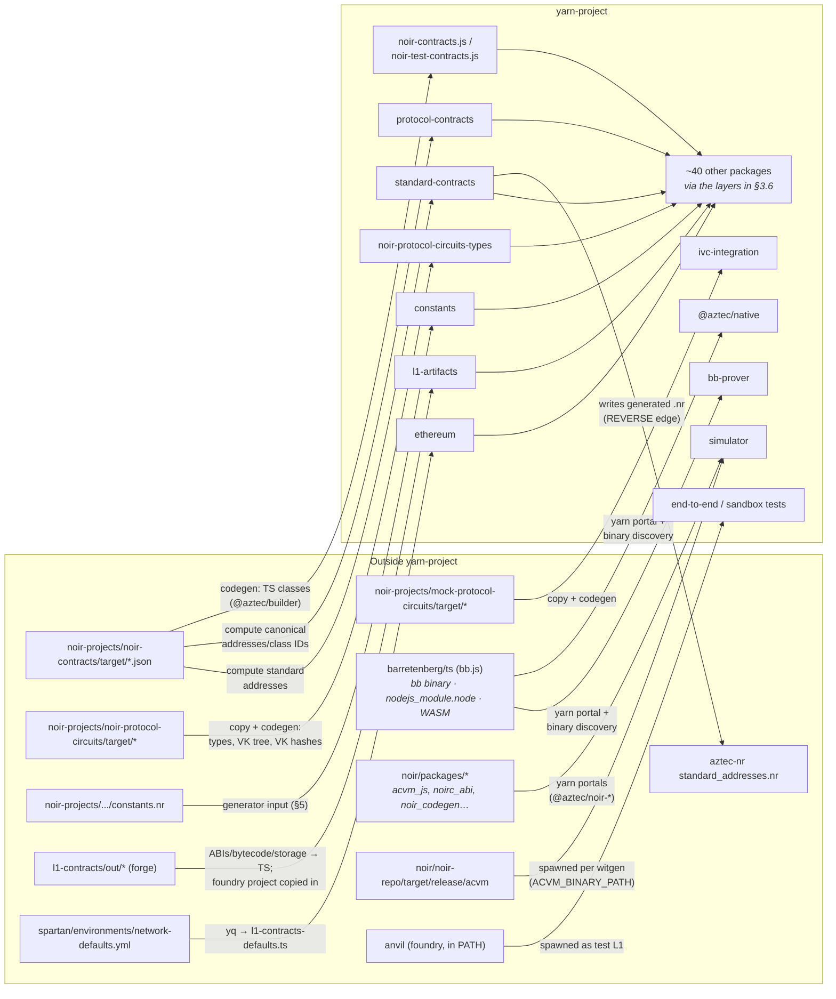
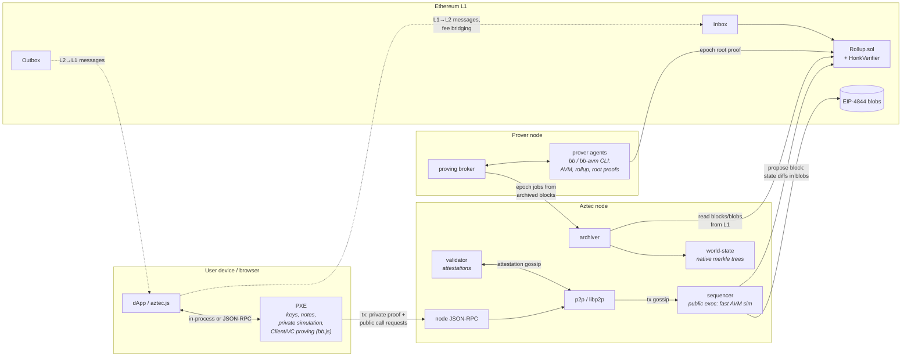
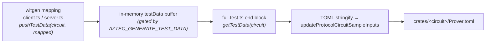
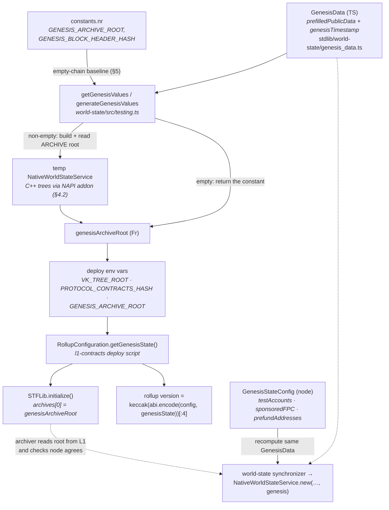

# aztec-packages: components, dependencies and interactions

A high-level map of the monorepo: what each component is, what it needs at **build time**, and how the pieces talk at **runtime**. Details on sub-components are included only where they are needed to explain a dependency.

The repo is a vertically integrated zkRollup stack:
**cryptography (barretenberg) → circuit language (noir) → circuits & contracts (noir-projects) → L1 settlement (l1-contracts) → client/node software (yarn-project) → docs & deployment.**

## Contents

1. [Component overview](#1-component-overview)
2. [Build-time dependency graph](#2-build-time-dependency-graph)
   - [Why the edges exist (the non-obvious ones)](#why-the-edges-exist-the-non-obvious-ones)
   - [Cross-cutting constant synchronization](#cross-cutting-constant-synchronization)
3. [Component details](#3-component-details)
   - [3.1 noir/](#31-noir)
   - [3.2 barretenberg — four sub-components](#32-barretenberg--four-sub-components)
   - [3.3 avm-transpiler/](#33-avm-transpiler)
   - [3.4 noir-projects/](#34-noir-projects)
   - [3.5 l1-contracts/](#35-l1-contracts)
   - [3.6 yarn-project/ — the TS stack](#36-yarn-project--the-ts-stack)
   - [3.7 docs/, spartan/, ci3/](#37-docs-spartan-ci3)
4. [Deep dive: the TypeScript ↔ C++ boundary](#4-deep-dive-the-typescript--c-boundary)
   - [4.1 Build time: everything ships through bb.js](#41-build-time-everything-ships-through-bbjs)
   - [4.2 Channel 1 — the in-process NAPI addon (@aztec/native)](#42-channel-1--the-in-process-napi-addon-aztecnative)
   - [4.3 Channel 2 — the bb.js msgpack API (proving & crypto)](#43-channel-2--the-bbjs-msgpack-api-proving--crypto)
   - [4.4 Channel 3 — aztec-wsdb: world state as a separate process](#44-channel-3--aztec-wsdb-world-state-as-a-separate-process)
   - [4.5 Contrast: where TS does not use barretenberg](#45-contrast-where-ts-does-not-use-barretenberg)
5. [Deep dive: protocol constants (constants.\*)](#5-deep-dive-protocol-constants-constants)
   - [5.1 The source: constants.nr](#51-the-source-constantsnr)
   - [5.2 The generator and its four outputs](#52-the-generator-and-its-four-outputs)
   - [5.3 Drift protection — and the reverse flow from barretenberg](#53-drift-protection--and-the-reverse-flow-from-barretenberg)
6. [Deep dive: yarn-project and its external boundary](#6-deep-dive-yarn-project-and-its-external-boundary)
   - [6.1 Internal shape, measured](#61-internal-shape-measured)
   - [6.2 The boundary, in one picture](#62-the-boundary-in-one-picture)
   - [6.3 Install-time: portals into sibling components](#63-install-time-portals-into-sibling-components)
   - [6.4 Codegen-time: the artifact packages](#64-codegen-time-the-artifact-packages)
   - [6.5 Runtime: external binaries and processes](#65-runtime-external-binaries-and-processes)
7. [Runtime architecture](#7-runtime-architecture)
8. [Deep dive: testing — dependencies and flows](#8-deep-dive-testing--dependencies-and-flows)
   - [8.1 What re-runs what: the hash recipes](#81-what-re-runs-what-the-hash-recipes)
   - [8.2 TXE: nargo test depends on the TS stack](#82-txe-nargo-test-depends-on-the-ts-stack)
   - [8.3 Tests that reach into bb / bb.js / the AVM](#83-tests-that-reach-into-bb--bbjs--the-avm)
   - [8.4 Tests that depend on contract artifacts](#84-tests-that-depend-on-contract-artifacts)
   - [8.5 Tests that depend on L1 contracts](#85-tests-that-depend-on-l1-contracts)
9. [Deep dive: the release process](#9-deep-dive-the-release-process)
   - [9.1 Where release tags come from](#91-where-release-tags-come-from)
   - [9.2 What ci-release runs](#92-what-ci-release-runs)
   - [9.3 make release vs make fast: cross-compiles](#93-make-release-vs-make-fast-cross-compiles)
   - [9.4 The publish fan-out](#94-the-publish-fan-out)
   - [9.5 Versions are stamped at publish time](#95-versions-are-stamped-at-publish-time)
10. [Deep dive: code generation](#10-deep-dive-code-generation)
    - [10.1 The codegen map: eight pipelines](#101-the-codegen-map-eight-pipelines)
    - [10.2 AVM relations: PIL to C++ (bb-pilcom)](#102-avm-relations-pil-to-c-bb-pilcom)
    - [10.3 Prover.toml: two generators](#103-provertoml-two-generators)
    - [10.4 Test-driven codegen: the AZTEC_GENERATE_TEST_DATA harness](#104-test-driven-codegen-the-aztec_generate_test_data-harness)
    - [10.5 Build-time codegen: the artifact packages](#105-build-time-codegen-the-artifact-packages)
    - [10.6 When to regenerate (cheat-sheet)](#106-when-to-regenerate-cheat-sheet)
11. [Deep dive: chain genesis state](#11-deep-dive-chain-genesis-state)
    - [11.1 What genesis state is](#111-what-genesis-state-is)
    - [11.2 Computing the genesis archive root](#112-computing-the-genesis-archive-root)
    - [11.3 Anchoring genesis on L1](#113-anchoring-genesis-on-l1)
    - [11.4 Keeping the running node in agreement](#114-keeping-the-running-node-in-agreement)
12. [Quick reference: artifact flows](#12-quick-reference-artifact-flows)

---

## 1. Component overview

| Component                        | Language           | One-liner                                                                                                                                                   |
| -------------------------------- | ------------------ | ----------------------------------------------------------------------------------------------------------------------------------------------------------- |
| `noir/`                          | Rust (submodule)   | The Noir compiler (`nargo`) and its JS packages. Pinned submodule of `noir-lang/noir`.                                                                      |
| `barretenberg/cpp` ("bare bb")   | C++                | The ZK proving system: UltraHonk, ClientIVC ("Chonk"), Goblin/ECCVM, crypto primitives. Produces the `bb` CLI, a Node.js native module, and WASM builds.    |
| `barretenberg/cpp/.../vm2` (AVM) | C++                | The Aztec Virtual Machine: simulates public execution and proves it with a Honk circuit. Built into the `bb-avm` binary (gated by the `AVM=ON` CMake flag). |
| `barretenberg/ts` (bb.js)        | TypeScript         | TS bindings over bb (native module, WASM, or spawned CLI). Published as `@aztec/bb.js`.                                                                     |
| `barretenberg/sol`               | Solidity           | Hand-written Honk verifier contracts; the source templates for `bb write_solidity_verifier`.                                                                |
| `bb-pilcom/`                     | Rust               | PIL → C++ compiler that generates the AVM's constraint relations.                                                                                           |
| `avm-transpiler/`                | Rust               | Transpiles Brillig bytecode (Noir's unconstrained VM format) to AVM bytecode for public functions.                                                          |
| `noir-projects/`                 | Noir               | Protocol circuits (kernels, rollup), the Aztec.nr contract framework, and example/protocol/standard contracts.                                              |
| `l1-contracts/`                  | Solidity (Foundry) | The L1 side of the rollup: `Rollup.sol`, `Inbox`/`Outbox` message bridge, governance, staking/slashing, fee juice portal.                                   |
| `yarn-project/`                  | TypeScript         | Everything else: the node, sequencer, prover, archiver, p2p, PXE, `aztec.js` SDK, wallets, TXE, CLI, e2e tests (~60 packages).                              |
| `docs/`                          | Docusaurus         | Developer docs site; pulls live code snippets and generated API references from the rest of the repo.                                                       |
| `spartan/`                       | Helm/Terraform     | Kubernetes deployment of networks (nodes, validators, prover stacks, bots). Also the source of network default configs.                                     |
| `ci3/`                           | Shell              | CI infrastructure: content-hash based build caching, parallel test running, EC2 orchestration.                                                              |

---

## 2. Build-time dependency graph

The canonical order (enforced by the root `bootstrap.sh` / `Makefile`) is
**barretenberg → noir → noir-projects → l1-contracts → yarn-project**, with `avm-transpiler` and `bb-pilcom` feeding into the bb build.



Each component's `bootstrap.sh` computes a content hash of its sources **plus the hashes of its upstream dependencies** (e.g. l1-contracts' hash includes noir-projects'), which drives the `ci3` S3-backed build cache: a hash hit skips the build entirely.

### Why the edges exist (the non-obvious ones)

- **bb-pilcom → barretenberg/cpp**: AVM constraints are written in PIL (`barretenberg/cpp/pil/vm2/*.pil`). `bb_pil` compiles them into checked-in generated C++ (`vm2/generated/`: columns, flavor, relations). This is a manual codegen step (`avm2_gen.sh`), not part of every build.
- **avm-transpiler → barretenberg/cpp**: the transpiler is linked into `bb-avm` so that `bb aztec_process` can transpile a contract's public (Brillig) functions to AVM bytecode in one pass.
- **barretenberg/cpp → barretenberg/ts**: bb.js's API surface is **generated from the built `bb` binary** — codegen runs `bb msgpack schema` and emits TS (and Rust) bindings from the returned JSON schema. The build then packages the native binaries (`bb`, `nodejs_module.node`, `aztec-wsdb`) and WASM builds inside the npm package. C++ API changes therefore force a bb rebuild _before_ a bb.js regen. See §4 for the full TS↔C++ boundary.
- **barretenberg/sol ↔ barretenberg/cpp**: the Solidity verifier sources are concatenated into C++ headers (`honk_contract.hpp` etc.), which `bb write_solidity_verifier` later emits as concrete verifier contracts. So Solidity is an _input_ to the C++ build, and verifier contracts are an _output_ of the `bb` binary.
- **bb → noir-projects**: compiling circuits is not enough; `bb write_vk` (UltraHonk or Chonk scheme depending on the circuit) generates verification keys that get embedded into the circuit JSON artifacts. For contracts, `bb aztec_process` additionally transpiles public functions to AVM bytecode.
- **noir-projects → l1-contracts**: the `rollup_root` circuit (the only Keccak-flavored Honk circuit, chosen for cheap on-chain verification) produces a generated Solidity verifier that l1-contracts compiles as `generated/HonkVerifier.sol`. L1 can only verify the proof if this verifier matches the circuit's VK — this is the hard link between circuit changes and L1.
- **spartan → l1-contracts**: `spartan/environments/network-defaults.yml` is extracted into `l1-contracts/generated/default.json` (protocol timing/threshold defaults), which then flows into `yarn-project/ethereum` as generated TS constants.
- **everything → yarn-project**: four "artifact packages" are the entry points for foreign build outputs:
  - `l1-artifacts` — TS wrappers of forge-compiled ABIs/bytecode/storage layouts;
  - `noir-contracts.js` (and `noir-test-contracts.js`) — TS classes codegen'd from contract JSON artifacts;
  - `noir-protocol-circuits-types` — circuit type bindings plus the **VK tree** (Merkle tree of all protocol circuit VKs, a protocol-level commitment);
  - `protocol-contracts` — the canonical contracts deployed at fixed protocol addresses.
    bb.js and the `@noir-lang/*` JS packages enter via yarn resolutions/portals.

### Cross-cutting constant synchronization

Protocol constants (tree heights, max side-effects per tx, proof lengths like `CHONK_PROOF_LENGTH`) have a single hand-edited source — `constants.nr` in noir-protocol-circuits — from which checked-in TypeScript, C++, PIL and Solidity files are generated by `yarn remake-constants`. Proof/VK-length constants flow the _other_ way: they are facts about barretenberg, pinned by C++ `static_assert`s that fail the build when they drift. See §5 for the full pipeline.

---

## 3. Component details

### 3.1 noir/

A shallow git submodule of `noir-lang/noir`. Its `bootstrap.sh` builds:

- **`nargo`** — the compiler CLI (at `noir/noir-repo/target/release/nargo`; downstream build scripts default `$NARGO` to this path — never substitute a globally installed nargo).
- **ACVM/Brillig** — Noir compiles each function to ACIR (the constrained circuit IR, what gets proved) and/or Brillig (an unconstrained bytecode VM format). This split matters downstream: _private_ contract functions ship as ACIR circuits, _public_ contract functions ship as Brillig and get transpiled to AVM bytecode.
- **JS packages** — `@noir-lang/acvm_js`, `noirc_abi`, `noir_codegen`, etc., consumed by yarn-project (the simulator executes ACIR via `acvm_js`).

### 3.2 barretenberg — four sub-components

**(a) Bare bb (`barretenberg/cpp`).** The proving engine. Key proving systems:

- **UltraHonk** — the general-purpose SNARK; used for rollup circuits (with a Keccak-transcript flavor for the single circuit verified on L1).
- **ClientIVC / "Chonk"** — incremental verifiable computation for the client side: folds the chain of private function circuits + kernels into one compact proof, cheap enough to run in a browser (WASM).
- **Goblin / ECCVM / Translator** — deferred elliptic-curve computation machinery backing ClientIVC.

Build outputs: the `bb` CLI (and `bb-avm`, the AVM-enabled variant that downstream tooling selects by default via `find-bb`), a `nodejs_module` native addon, single- and multi-threaded WASM builds, and `libbb-external.a` for FFI (the `barretenberg/rust` bindings). `crs/` downloads the trusted-setup SRS. Default local CMake builds have `AVM=0` for speed — a frequent gotcha is a stale `bb-avm` after C++ changes.

**(b) AVM (`barretenberg/cpp/src/barretenberg/vm2`).** The public-execution VM, structurally its own component:

- **simulation/** — executes AVM bytecode; a _fast_ mode (no event emission, used for block building via the Node.js module) and a _witgen_ mode (emits events for proving).
- **tracegen/** — turns execution events into trace matrices.
- **constraining/** — the Honk prover/verifier over the PIL-generated relations.
- **generated/** — output of bb-pilcom; do not hand-edit.

Consumed two ways at runtime: fast simulation in-process from TypeScript (via the native module), and proving via the spawned `bb-avm` CLI.

**(c) bb.js (`barretenberg/ts`).** One TS API over multiple execution backends: shared-memory NAPI, spawned `bb` over a Unix socket, or WASM (browser). The sync/async API surface is codegen'd from the `bb` binary's msgpack schema. Published as `@aztec/bb.js` (consumed inside the monorepo as a yarn portal); it is the single distribution channel for _all_ native C++ artifacts used by TS — see §4.

**(d) barretenberg/sol.** Hand-written + hand-optimized Honk verifiers in Solidity, kept in lockstep with the C++ verifier (forge tests compare the two). Serves as the template source embedded into `bb`, which then emits circuit-specific verifiers — notably the rollup root verifier used by l1-contracts.

### 3.3 avm-transpiler/

Small Rust tool: reads a `nargo`-compiled contract JSON, rewrites each public function's Brillig bytecode into AVM bytecode (marking `transpiled: true`), leaves everything else intact. Available standalone and as a static library linked into `bb-avm`. Its version is hash-coupled to the noir submodule (bytecode format compatibility).

### 3.4 noir-projects/

- **`noir-protocol-circuits/`** — the protocol's ZK circuits:
  - _Private kernels_ (`init`/`inner`/`reset`/`tail`/`tail-to-public`) — proved **client-side** in the PXE via ClientIVC; they recursively verify each private function call and accumulate the transaction's side effects.
  - _Rollup circuits_ (`tx-base-private`/`tx-base-public`/`tx-merge`, `block-root`/`block-merge`, `checkpoint-*`, `root`, `parity`, `blob`) — proved **server-side** by prover nodes, aggregating transactions → blocks → epochs into the single root proof verified on L1.
  - Build: `nargo compile` → `bb write_vk` (chonk scheme for kernels, ultra_honk for rollup) → VKs embedded in artifacts; `rollup_root` additionally emits the Solidity verifier. A pinning mechanism (`pinned-build.tar.gz`) lets CI skip recompilation.
- **`aztec-nr/`** — the Aztec.nr framework (state, notes, nullifiers, events, messaging, auth). A library, not built standalone; imported by all contracts. Its macros split a contract into private functions (→ ACIR), public functions (→ Brillig → AVM), and a "utility" simulation surface.
- **`noir-contracts/`** — contracts grouped as `protocol/` (canonical, deployed at fixed addresses: contract-class registry, fee juice…), `standard/`, `account/`, `app/` (examples), `test/`. Built with `nargo compile` + `bb aztec_process`.
- **`mock-protocol-circuits/`**, **`contract-snapshots/`**, **`protocol-fuzzer/`** — simulated kernel variants for fast tests, artifact-regression snapshots, and a protocol fuzzer.

### 3.5 l1-contracts/

A Foundry project; the trust root of the system on Ethereum:

- **`Rollup.sol` / `RollupCore.sol`** — holds the L2 archive/state roots, accepts block proposals from sequencers, verifies epoch proofs (via the generated `HonkVerifier`), advances finalized state. Also the staking/validator-set entry point.
- **`Inbox.sol` / `Outbox.sol`** — L1→L2 and L2→L1 message bridge (the parity circuits commit to inbox messages inside the rollup proof).
- **`FeeJuicePortal`** — bridges the fee asset; **Governance / Registry / CoinIssuer / Slasher / RewardDistributor** — governance, versioning, and economics.

Build inputs: the generated rollup verifier (from noir-protocol-circuits) and network defaults (from spartan). Outputs: forge ABIs/bytecode/storage layouts consumed by `yarn-project/l1-artifacts`.

### 3.6 yarn-project/ — the TS stack

Roughly nine layers, from most-depended-upon to entrypoints (§6 is a deep dive on this workspace and its external boundary):



Notable packages and roles:

- **`pxe`** (Private eXecution Environment) — the user's private runtime: stores keys/notes (encrypted), simulates private functions (ACIR via the simulator), runs the private-kernel ClientIVC prover (bb.js), and decrypts notes from synced blocks. Runs in-process with `aztec.js`, in the browser, or as a JSON-RPC server.
- **`aztec.js`** — the dApp SDK: contract interaction, tx building, fee payment; talks to a PXE/wallet and to a node.
- **`aztec-node`** — the composed server: archiver (indexes L1 → reconstructs L2 chain from blobs), world-state (Merkle trees implemented in C++, called in-process through the NAPI addon — see §4), p2p (libp2p tx/block/attestation gossip), sequencer + validator clients, and the public JSON-RPC API.
- **`sequencer-client`** — pulls txs from the p2p pool, executes public functions (fast C++ AVM simulation, §4), builds blocks, collects committee attestations, publishes block + blob data to L1.
- **`prover-node` / `prover-client` / `bb-prover`** — the epoch-proving stack: a broker distributes proving jobs to agents; `bb-prover` invokes bb (native CLI or bb.js) per circuit; the resulting root proof is submitted to `Rollup.sol`.
- **`txe`** (Testing eXecution Environment) — an oracle-resolver server that lets _Noir_ contract tests (`nargo test`) execute against a real simulated state: fast contract-level testing without proving or a full network.
- **`aztec`** — the `aztec start` entrypoint that can run any subset: full local sandbox, node, PXE host, prover broker/agents, TXE, p2p bootstrap, bot.

### 3.7 docs/, spartan/, ci3/

- **docs/** — multi-instance Docusaurus (developers / operators / participate). Build-time it extracts live code snippets from across the repo (`#include_code` macros), runs example projects, and embeds generated API references (TypeDoc for TS, `nargo doc` for Aztec.nr) — so it depends on nearly everything.
- **spartan/** — Helm charts (`aztec-node`, `aztec-validator`, `aztec-prover-stack`, postgres for HA signing, bots) + Terraform for cluster deployment. Doubles as the _source of truth for network default parameters_ consumed at build time by l1-contracts.
- **ci3/** — the shell-script CI fabric: per-component content hashing, S3 artifact cache, parallel test execution, EC2 runners. It's what makes the deep build DAG tolerable.

---

## 4. Deep dive: the TypeScript ↔ C++ boundary

The TS stack leans on C++ for four things: **proving**, **fast public (AVM) execution**, **the world-state Merkle trees**, and **crypto primitives**. All of it is distributed through one package — `@aztec/bb.js` — but reaches C++ over three distinct runtime channels.

### 4.1 Build time: everything ships through bb.js

`barretenberg/cpp` produces four deliverables for the TS world, and the bb.js build (`barretenberg/ts/scripts/copy_native.sh` + `copy_wasm.sh`) packages all of them under `build/<platform>/` inside the npm package:

| Artifact                                 | What it is                                                                        | Used for                                                |
| ---------------------------------------- | --------------------------------------------------------------------------------- | ------------------------------------------------------- |
| `bb`                                     | CLI binary that can also run as a msgpack server (`bb msgpack run`)               | proving (rollup, AVM, ClientIVC), VK generation         |
| `nodejs_module.node`                     | N-API addon (CMake target `nodejs_module`, links `world_state`, `vm2_sim`, `ipc`) | in-process world-state, LMDB store, fast AVM simulation |
| `aztec-wsdb`                             | standalone world-state DB server binary                                           | out-of-process world state over a socket (§4.4)         |
| `barretenberg.wasm` (+ threaded variant) | WASM build of the proving stack                                                   | browser execution, Node fallback                        |

Three build-time facts:

- **The NAPI addon is a plain CMake target with a stable ABI — no node-gyp.** `nodejs_module` is a `SHARED` library (`PREFIX "" SUFFIX ".node"`) compiled against Node-API version 9 (`NAPI_VERSION=9`, [CMakeLists.txt](barretenberg/cpp/src/barretenberg/nodejs_module/CMakeLists.txt)). Its only JS-world inputs are headers from `node-addon-api`/`node-api-headers`, fetched by a `yarn install` in the addon's source dir that _CMake itself runs at configure time_ (the root Makefile's `bb-cpp-yarn` target runs it up front so parallel presets don't race on it). It links the `world_state`, `ipc` and `vm2_sim` C++ libraries, and N-API symbols resolve from the running `node` binary at load time (`-undefined dynamic_lookup` on macOS) — so one `.node` file works across Node versions, with no per-version rebuilds. Release builds cross-compile it alongside `bb` for arm64-linux and both macOS targets, but **not** Windows (the Windows preset excludes ipc/lmdb/world_state); `copy_cross.sh` strips the binaries and re-signs the macOS ones (`ldid`) before packaging.
- **The TS API is generated from the binary, not from headers.** `barretenberg/ts/src/cbind/generate.ts` executes `bb msgpack schema`, parses the returned JSON schema of all commands/responses, and emits `src/cbind/generated/{api_types,sync,async}.ts` (and Rust bindings). So the C++ native build must complete before bb.js codegen, and any `bbapi` command change flows into TS types mechanically. The same script also runs a _second_ bb command, `bb msgpack curve_constants`, and turns its msgpack output into `src/cbind/generated/curve_constants.ts` (curve generator points and field moduli for bn254/grumpkin/secp256k1/secp256r1). That command is backed by hand-written C++ — [bb/curve_constants.{hpp,cpp}](barretenberg/cpp/src/barretenberg/bb/curve_constants.hpp) (`get_curve_constants_msgpack()`) — which is _source_, not generated; only the `.ts` is an output.
- **yarn-project never downloads bb.** It consumes bb.js as a yarn portal (`"@aztec/bb.js": "portal:../barretenberg/ts"` in [yarn-project/package.json](yarn-project/package.json)), i.e. a symlink into the monorepo. At runtime, binaries are located by `findBbBinary()` / `findNapiBinary()` ([platform.ts](barretenberg/ts/src/bb_backends/node/platform.ts)): explicit path → `BB_BINARY_PATH` env var (the `bb` binary only — the addon has no env override) → the packaged `build/<platform>/` copy. `yarn-project/native` is a thin wrapper that calls `findNapiBinary()` and `require()`s the addon.

In every channel below, the wire format is the same: **msgpack-encoded buffers**, with mirrored type definitions on both sides (generated on TS, `SERIALIZATION_FIELDS` macros on C++, dispatched by message-type ID through `barretenberg/.../messaging/dispatcher.hpp`).



### 4.2 Channel 1 — the in-process NAPI addon (`@aztec/native`)

`nodejs_module/init_module.cpp` exposes a small surface: `WorldState`, `LMDBStore`, `MsgpackClient`/`MsgpackClientAsync`, `avmSimulate`, `avmSimulateWithHintedDbs`, and cancellation tokens. `@aztec/native` loads the addon once per process (`require(findNapiBinary())` in [native_module.ts](yarn-project/native/src/native_module.ts)) and re-exports these.

The class wrappers (`WorldState`, `LMDBStore`, …) each expose a single JS-visible method: `call(msgpackBuffer) → Promise<Buffer>`. On the TS side, `MsgpackChannel` encodes a `TypedMessage` (message-type ID + request-ID header + body) with `msgpackr`; on the C++ side a `MessageDispatcher` routes the decoded message to the right handler. Two threading models coexist behind those Promises:

- **World-state and LMDB calls** wrap the work in `AsyncOperation` (a `Napi::AsyncWorker`, [async_op.hpp](barretenberg/cpp/src/barretenberg/nodejs_module/util/async_op.hpp)): the request buffer is copied into C++-owned memory, the work runs **on the libuv thread pool**, and the result is copied back and the Promise settled on the JS main thread — off-thread code never touches the JS environment.
- **AVM simulations** each run on a **dedicated `std::thread`**, deliberately _not_ the libuv pool: their callbacks into TS (contract lookups, logging) are `ThreadSafeFunction` blocking calls serviced by the JS event loop, which may itself need libuv threads for I/O — running simulations on the pool could exhaust it and deadlock. Since each simulation costs an OS thread, the TS side gates concurrency with a semaphore (`AVM_MAX_CONCURRENT_SIMULATIONS`, default 4).

**World state.** The Merkle trees are entirely C++ (`barretenberg/cpp/src/barretenberg/world_state/`): the five protocol trees (nullifier and public-data as _indexed_ trees, note-hash, L1-to-L2-message and archive as append-only), persisted in LMDB (`lmdblib/`), with forking, checkpointing (nested, for AVM revert semantics), block sync/unwind and finalization. The TS side (`world-state`'s `NativeWorldStateService` → `@aztec/native`'s `MsgpackChannel`) is a typed RPC client speaking ~30 message types (`world_state_message.hpp` ↔ `world-state/src/native/message.ts`); tree contents never cross into TS except as query results (sibling paths, leaf preimages, roots). The TS `merkle-tree` package remains for a few non-world-state trees built in TS.

**Fast AVM simulation (the C++ public simulator).** Production block building — sequencer and validator re-execution alike (`createPublicTxSimulatorForBlockBuilding` in [factories.ts](yarn-project/simulator/src/public/public_tx_simulator/factories.ts)) — uses `CppPublicTxSimulator`, which calls the addon's `avmSimulate(inputs, contractProvider, worldStateHandle, logLevel, cancellationToken)`:

- `inputs` is a msgpack `AvmFastSimulationInputs` buffer; the result comes back as a msgpack `TxSimulationResult`.
- `worldStateHandle` is the interesting part: an **external (raw pointer) handle to the same in-process C++ `WorldState`** that the node's world-state service owns. The C++ simulator reads and writes the trees directly, in process — no per-storage-access hop back through JS. This is why world-state and the AVM simulator ship in the _same_ addon.
- Only contract-related lookups call back into TS (`getContractInstance` / `getContractClass` / bytecode commitments), since contract artifacts live in the node's TS-side database.
- The `avmSimulateWithHintedDbs` variant takes pre-collected hints instead of callbacks/world-state — fully self-contained inputs, which is exactly the form the AVM _prover_ consumes.

The older **pure-TS AVM interpreter** (`PublicTxSimulator`, `avm_simulator.ts`) still exists and matters: it backs the TXE and is kept honest by differential and circuit-QA testing against the C++ side (§8.3).

**LMDB.** The addon's `LMDBStore` also backs the generic TS `kv-store` package on Node — so even the node's misc key-value data goes through C++ LMDB.

### 4.3 Channel 2 — the bb.js msgpack API (proving & crypto)

The generated `AsyncApi`/`SyncApi` speak the same msgpack command protocol over pluggable transports (`barretenberg/ts/src/bb_backends/`):

- **`NativeSharedMemory`** — through the addon's `MsgpackClient` over a shared-memory ring buffer (`ipc/`).
- **`NativeUnixSocket`** — spawns the packaged `bb` binary as a msgpack server and talks over a Unix domain socket. One spawned bb per instance; `bb-prover` pools them (`BBJsFactory`).
- **`Wasm` / `WasmWorker`** — the WASM build; the only option in browsers, the fallback on Node when no native binary is found.

Who uses it for what:

- **Server-side proving** (`bb-prover`): `BBNativeRollupProver` proves all rollup/parity/blob circuits and AVM proofs through bb.js (`api.avmProve` / `avmVerify` / `avmCheckCircuit`, UltraHonk commands per flavor) over `NativeUnixSocket` — i.e. proving runs in separate bb _processes_, isolated from the node's event loop, but driven entirely through the bb.js API rather than hand-rolled CLI invocations. Witness generation for those circuits uses the native `acvm` binary (see §4.5).
- **Client-side proving** (PXE): `BBPrivateKernelProver` uses bb.js's `AztecClientBackend` (ClientIVC/Chonk) — WASM in the browser, native binary on Node.
- **Crypto primitives**: `foundation`'s `poseidon2Hash` & co. call a process-wide `Barretenberg`/`BarretenbergSync` singleton — sync WASM in the browser, async (native if available) on Node. So even hashing a note commitment in TS is a C++/WASM call.

### 4.4 Channel 3 — `aztec-wsdb`: world state as a separate process

bb.js ships an `aztec-wsdb` server binary plus a dedicated generated client (`@aztec/bb.js/aztec-wsdb`). On the TS side, `IpcWorldState` ([ipc_world_state_instance.ts](yarn-project/world-state/src/native/ipc_world_state_instance.ts)) implements the same `NativeWorldStateInstance` interface as the NAPI version, but over the socket — and exposes `getSocketPath()` instead of an in-process handle, so _other processes_ (e.g. a simulator or prover outside the node) can reach the same world state. As of now this is an alternative backend; the default factory path still instantiates the in-process NAPI service.

### 4.5 Contrast: where TS does _not_ use barretenberg

Private-function and circuit _simulation_ (executing ACIR to produce witnesses) never touches bb: the PXE's default `WASMSimulator` runs `@noir-lang/acvm_js` (WASM built from the noir submodule), and the server-side prover uses `NativeACVMSimulator`, which spawns the native `acvm` CLI binary with temp witness files. Barretenberg enters only after witnesses exist (proving) — plus the crypto and state machinery above.

---

## 5. Deep dive: protocol constants (`constants.*`)

Protocol constants — tree heights, per-tx side-effect limits, gas parameters, proof and VK lengths, protocol contract addresses, AVM opcodes — must agree across **five languages**. The repo solves this with one hand-edited source file, one generator, and a compile-time backstop for the constants that aren't really "chosen" but _measured_ from barretenberg.



### 5.1 The source: `constants.nr`

[constants.nr](noir-projects/noir-protocol-circuits/crates/types/src/constants.nr) is the only hand-edited file. It is simultaneously _real Noir code_ — every protocol circuit and aztec-nr imports these globals directly, no generation step — and the _input_ to the cross-language generator. It holds, roughly by category:

- **Protocol parameters someone chose**: tree heights (`NOTE_HASH_TREE_HEIGHT = 42`, `ARCHIVE_HEIGHT = 30`), per-tx/per-call side-effect limits (`MAX_NOTE_HASHES_PER_TX = 64`), blob/DA shape (`FIELDS_PER_BLOB = 4096`, `BLOBS_PER_CHECKPOINT`), gas/fee parameters, canonical protocol contract addresses (`FEE_JUICE_ADDRESS = 3`), genesis values (`GENESIS_ARCHIVE_ROOT`, `GENESIS_BLOCK_HEADER_HASH`).
- **Derived values written as expressions**: e.g. `MAX_PUBLIC_DATA_UPDATE_REQUESTS_PER_TX = MAX_TOTAL_... - PROTOCOL_...`, AVM public-input row offsets, `CHONK_PROOF_LENGTH` as a sum of its component proof segments. Noir evaluates these natively; the generator re-evaluates them in JS.
- **Facts about barretenberg, mirrored here**: proof lengths (`RECURSIVE_PROOF_LENGTH = 410`, `CHONK_PROOF_LENGTH = 1349`, `ULTRA_KECCAK_PROOF_LENGTH`, `IPA_PROOF_LENGTH = 64`), VK lengths (`MEGA_VK_LENGTH_IN_FIELDS = 143`). These are commented as "pinned to bb via static_asserts" — see §5.3.
- **AVM machine definitions**: execution opcode IDs (`AVM_EXEC_OP_ID_*`), subtrace and dynamic-gas IDs, memory tags (`MEM_TAG_U8`…) — shared between the TS/C++ simulators, tracegen, and the PIL constraints.
- **Domain separators**: `DOM_SEP__*` constants, special-cased by the generator into enums/generator macros.

### 5.2 The generator and its four outputs

`yarn remake-constants` (in `yarn-project/constants`) runs [constants.in.ts](yarn-project/constants/src/scripts/constants.in.ts), which **regex-parses** `constants.nr` (`global NAME: type = expr;`), strips Noir-isms (`as u32` casts, `AztecAddress::from_field(...)`), evaluates each expression as a JS BigInt, then writes four checked-in, `GENERATED FILE - DO NOT EDIT` files:

| Output                                                                             | Scope                                                | Consumers                                                                                                                           |
| ---------------------------------------------------------------------------------- | ---------------------------------------------------- | ----------------------------------------------------------------------------------------------------------------------------------- |
| [constants.gen.ts](yarn-project/constants/src/constants.gen.ts)                    | everything (~200 constants + `DomainSeparator` enum) | virtually all of yarn-project via `@aztec/constants` — e.g. `stdlib`'s proof classes size their buffers from `CHONK_PROOF_LENGTH`   |
| [aztec_constants.hpp](barretenberg/cpp/src/barretenberg/aztec/aztec_constants.hpp) | whitelist (~90 `#define`s + generator macros)        | the AVM (`vm2/common/constants.hpp`, gas, IO), the C++ `world_state` (tree heights/genesis must match the circuits), the AVM fuzzer |
| [constants_gen.pil](barretenberg/cpp/pil/vm2/constants_gen.pil)                    | whitelist (~80 `pol` constants)                      | the AVM's PIL constraint sources — so the _circuit relations_ see the same opcode IDs and limits as the simulators                  |
| [ConstantsGen.sol](l1-contracts/src/core/libraries/ConstantsGen.sol)               | minimal whitelist (12)                               | the Rollup contract and L1 libraries (tree/epoch/fee parameters L1 must agree on)                                                   |

Things to note:

- **Generated files are committed**, not produced during the build. Nothing in any component's build re-runs the generator; correctness depends on developers re-running it. The languages are deliberately decoupled at build time — C++ does not need node, Solidity does not need Noir.
- The whitelists (`CPP_CONSTANTS`, `PIL_CONSTANTS`, `SOLIDITY_CONSTANTS` arrays inside the generator) keep each language's surface minimal; only TS gets everything.
- This is the same one-source-many-targets pattern used elsewhere in the repo (PIL → C++ relations, `bb msgpack schema` → TS/Rust, §4.1), but here the source of truth is _Noir_ because the circuits are the protocol's definition.
- One Rust exception: the AVM opcode enum in [avm-transpiler/src/opcodes.rs](avm-transpiler/src/opcodes.rs) is maintained **by hand** in parallel (with a keep-in-sync comment), not emitted by the generator.

### 5.3 Drift protection — and the reverse flow from barretenberg

Two mechanisms keep the copies honest:

1. **A precommit warning** ([yarn-project/constants/precommit.sh](yarn-project/constants/precommit.sh)): staging `constants.nr` without the derived files prints a loud warning ("lots of hours lost to people forgetting to regenerate"). It does not regenerate or block.
2. **C++ `static_assert`s** in [mock_verifier_inputs.test.cpp](barretenberg/cpp/src/barretenberg/dsl/acir_format/mock_verifier_inputs.test.cpp): `static_assert(ChonkProof::PROOF_LENGTH == 1349, "CHONK_PROOF_LENGTH changed - update constants.nr")` and ~a dozen siblings for IPA/Translator/ECCVM/Mega-VK sizes. This is the interesting one, because it breaks an apparent circular dependency:

   Proof and VK lengths are not _decided_ in `constants.nr` — they are consequences of barretenberg's flavor/proof structures. But Noir circuits (recursive verifiers take proofs as fixed-size field arrays) and TS (buffer layouts) need them as literals. So the flow is: a bb change alters a proof shape → the **bb build fails at compile time** with a message naming the Noir constant → the developer hand-updates `constants.nr` → reruns `yarn remake-constants` → TS/PIL/Sol follow. The C++ side never _reads_ the mirrored value except to assert it; bb itself remains independent of the generator.

If the chain is skipped, failures appear downstream as size mismatches: circuit compilation errors in noir-protocol-circuits (wrong proof array sizes), deserialization failures in TS, or on-chain verification failures — which is exactly why the static_asserts catch it at the earliest possible point.

---

## 6. Deep dive: yarn-project and its external boundary

yarn-project is ~50 workspace packages. This section maps its internal shape (measured from the actual `package.json` dependency graph) and, in detail, every edge that crosses out of `yarn-project/` — at install time, at codegen time, and at runtime.

### 6.1 Internal shape, measured

In-degree (how many sibling packages depend on each) makes the layering from §3.6 concrete:

| Package                                                 | Depended on by                    | Role                                                                                                              |
| ------------------------------------------------------- | --------------------------------- | ----------------------------------------------------------------------------------------------------------------- |
| `foundation`                                            | 43                                | utils, crypto wrappers, serialization, JSON-RPC plumbing — everything uses it                                     |
| `stdlib`                                                | 37                                | the protocol's TS type system (txs, blocks, proofs, ABIs, interfaces)                                             |
| `constants`                                             | 27                                | generated protocol constants (§5)                                                                                 |
| `ethereum`                                              | 23                                | L1 clients/deployment (viem) — note how high this sits: most services touch L1                                    |
| `kv-store`, `protocol-contracts`                        | 19                                | storage abstraction; canonical contract data                                                                      |
| `telemetry-client`                                      | 18                                | metrics/tracing, injected nearly everywhere                                                                       |
| `noir-protocol-circuits-types`                          | 14, `l1-artifacts` 13, `bb.js` 11 | the artifact layer                                                                                                |
| `aztec.js`                                              | 12                                | notable: the "client SDK" is also mid-stack infrastructure — server packages (e2e, bot, txe, wallets) build on it |
| top-level entrypoints (`aztec`, `txe`, `p2p-bootstrap`) | 1                                 | composed, not depended upon                                                                                       |

Essentially every package is **published to npm** under `@aztec/*` (only internal tooling like `scripts` is private) — so the external boundary below is also the boundary between the monorepo build and what npm consumers receive.

### 6.2 The boundary, in one picture



### 6.3 Install-time: portals into sibling components

yarn-project never downloads its own cross-component dependencies from npm during development. The root [yarn-project/package.json](yarn-project/package.json) resolves them as portals (symlinks) into the monorepo:

- `@aztec/bb.js → portal:../barretenberg/ts` — all native C++ artifacts arrive through this one package (§4.1).
- `@aztec/noir-acvm_js`, `noir-types`, `noir-noirc_abi`, `noir-noir_codegen`, `noir-noir_js` → `../noir/packages/*` — the Noir compiler's JS packages (ACIR execution in WASM, ABI encoding, TS codegen), re-namespaced from `@noir-lang/*` to `@aztec/noir-*`.

This is why the build order matters: those directories must have been built (bb.js's `dest/`, noir's packages) before `yarn install`/`tsc` in yarn-project can work.

### 6.4 Codegen-time: the artifact packages

Eight packages exist only to pull a _foreign_ build output — a compiled contract, a circuit and its VK, forge ABIs, or the network-defaults YAML — across the boundary and re-emit it as plain TypeScript, each via a `generate` script run by bootstrap. Because that is fundamentally code generation, these packages are catalogued alongside the repo's other generators in **§10.5**, which carries the per-package table and the two richer fan-outs hiding inside it (network defaults and the reset-circuit variant family).

### 6.5 Runtime: external binaries and processes

At runtime the TS stack reaches outside itself in a handful of well-defined ways (the C++ mechanics are in §4):

| What                 | Discovery                                     | Default (dev)                                       | Used by                                                                                  |
| -------------------- | --------------------------------------------- | --------------------------------------------------- | ---------------------------------------------------------------------------------------- |
| `bb` binary          | `BB_BINARY_PATH`, else bb.js's packaged copy  | `barretenberg/cpp/build/bin/bb-avm` in e2e fixtures | `bb-prover` (rollup + AVM proving via spawned msgpack servers), PXE native proving       |
| `nodejs_module.node` | bb.js `findNapiBinary()`                      | packaged in bb.js                                   | `@aztec/native` → world-state, kv-store, C++ AVM simulation                              |
| `acvm` binary        | `ACVM_BINARY_PATH` + `ACVM_WORKING_DIRECTORY` | `noir/noir-repo/target/release/acvm`                | `simulator`'s `NativeACVMSimulator` (server-side witgen); WASM `acvm_js` needs no binary |
| `anvil`              | foundry toolchain in `PATH`                   | spawned by `ethereum/src/test/start_anvil.ts`       | sandbox & every e2e test as the L1 chain                                                 |
| Docker images        | `AZTEC_DOCKER_IMAGE`                          | —                                                   | e2e tests against spartan-deployed networks                                              |

Beyond processes, the remaining runtime boundary is the network: L1 RPC (viem), the libp2p mesh, and JSON-RPC between aztec.js ↔ PXE ↔ node — covered in §7.

---

## 7. Runtime architecture

Two proving domains exist at runtime: **client-side** (privacy — the user proves their own private execution; nobody else sees the inputs) and **server-side** (scaling — provers compress a whole epoch into one proof for L1).



Transaction lifecycle, end to end:

1. **Private phase (client).** `aztec.js` asks the PXE to execute the private functions of a tx. The PXE simulates each ACIR circuit, then proves the chain with ClientIVC (the private kernels recursively verify each call). Output: a Chonk proof, the tx's side effects (new note hashes, nullifiers, logs), and _requests_ for any public function calls — private inputs never leave the device.
2. **Submission & gossip.** The tx goes to a node over JSON-RPC and is gossiped through the p2p layer into every sequencer's mempool (nodes verify the client proof on arrival).
3. **Sequencing (public phase).** The elected sequencer executes the tx's public calls on the AVM (fast simulation, no proving), builds a block, gets committee attestations, and publishes the block — with state diffs as EIP-4844 blob data — to `Rollup.sol`. The block is now _pending_ (economically secured, not yet proved).
4. **Proving.** A prover node's broker decomposes the epoch into a proof tree: AVM proofs per public execution, base/merge/block-root/checkpoint/root rollup circuits, parity circuits for inbox messages, blob circuits for DA. Agents prove them with `bb`/`bb-avm`; the final root proof goes to `Rollup.sol`, whose generated `HonkVerifier` checks it and finalizes the epoch.
5. **Sync.** Every node's archiver watches L1, re-derives the chain from blob data, and updates world-state; PXEs sync from nodes and trial-decrypt notes addressed to their accounts.

Other runtime paths:

- **L1↔L2 messaging:** portals deposit messages in `Inbox` (consumed on L2; the parity rollup circuits commit to them); L2→L1 messages exit via `Outbox` after the epoch is proven. Fee juice is bridged this way.
- **Dev loop:** the **sandbox** (`aztec start --local-network`) runs node + PXE + anvil in one process with proofs mocked. Test flows (TXE, e2e) are covered in §8.

---

## 8. Deep dive: testing — dependencies and flows

Tests are not run by their components' builds. Every component's `bootstrap.sh test_cmds` _emits_ one line per test — `<hash>[:KEY=val…] <command>` — and the Makefile's `*-tests` targets append those lines to `/tmp/test_cmds`. The root `build_and_test` starts a **test engine** next to `make` that streams this file into a parallel executor, so a component's tests start running as soon as that component (and its Makefile dependencies) finish building, while the rest of the build continues.

Test dependencies therefore live in two distinct places:

1. **the Makefile dependency graph** decides _when a test can be emitted_ (e.g. `bb-acir-tests: noir bb-cpp-native bb-ts`);
2. **each component's hash recipe** decides _when a test re-runs_: the hash prefix is the test-cache key. `filter_test_cmds` drops tests quarantined in `.test_patterns.yml` and — with `USE_TEST_CACHE=1`, the CI default — tests whose exact hash has already passed.

Prefix modifiers tune execution: `ISOLATE=1` runs the command in a Docker container with `--net=none`, a tmpfs `/tmp`, and CPU/MEM quotas (required for anything that touches the network stack — p2p, anvil, every e2e test); `TIMEOUT`, `CPUS`/`MEM`, and `NAME` do what they say. e2e tests are emitted per-file (per test case for `.parallel.test.ts` files), all isolated; "composed" e2e tests run real services via docker-compose instead.

### 8.1 What re-runs what: the hash recipes

| Test family                                                                | Hash composition — re-runs when any of these change                                                                         |
| -------------------------------------------------------------------------- | --------------------------------------------------------------------------------------------------------------------------- |
| noir-protocol-circuits (`nargo test` + `nargo execute` per rollup circuit) | noir + the circuit crates. **Not bb** — these are witness-level tests, no proving.                                          |
| aztec-nr (TXE)                                                             | noir + aztec-nr sources                                                                                                     |
| noir-contracts (TXE)                                                       | per contract: noir + barretenberg (cpp & ts) + avm-transpiler + that contract's sources + aztec-nr + protocol-circuit types |
| yarn-project                                                               | noir + all of barretenberg + avm-transpiler + noir-projects + l1-contracts + yarn-project — i.e. everything upstream        |
| l1-contracts                                                               | l1-contracts + its inputs, including the generated verifier — so a protocol-circuit change re-runs the L1 test suite        |

Note the asymmetry: yarn-project tests re-run on any upstream change, but the Noir contract suites deliberately **exclude yarn-project** from their hashes — a TXE implementation change does not re-run them (the trade-off: TXE regressions surface through yarn-project's own tests and e2e, not through the Noir suites they serve).

### 8.2 TXE: `nargo test` depends on the TS stack

For aztec-nr and noir-contracts, `nargo test` runs with `--oracle-resolver http://127.0.0.1:<port>` ([run_test.sh](noir-projects/scripts/run_test.sh)): every oracle call a contract test makes becomes a foreign-call HTTP request to a **TXE server** (`yarn-project/txe`), which executes it against real machinery — the C++ world-state trees (via the NAPI addon), the TS simulators, real protocol contracts. So Noir contract tests **invert the build DAG**: noir-projects builds _before_ yarn-project, but its tests need the _built_ yarn-project.

The bootstrap handles the inversion explicitly. `noir-projects-txe-tests` is excluded from the Makefile dependency tree; `build_and_test` waits for the whole `make` to complete, starts a pool of TXE servers (`NUM_TXES`, on fixed ports below the Linux ephemeral range) plus a dedicated resolver for oracle-roundtrip tests, emits the TXE-backed tests sharded round-robin across the pool, and only then appends the `STOP` sentinel that tells the test engine no more commands are coming. Standalone runs (`noir-projects/aztec-nr/bootstrap.sh test`) spawn their own TXE. The protocol-circuit tests have no such dependency — plain `nargo test` plus `nargo execute` smoke-runs, needing only the compiler.

### 8.3 Tests that reach into bb / bb.js / the AVM

Almost every yarn-project test touches barretenberg incidentally (hashing goes through bb.js, §4.3) — hence the everything-hash above. The deliberate cases:

- **Proving is faked by default.** Standard PR CI sets `FAKE_PROOFS=1` for the prover-client integration tests and the e2e prover test; `CI_FULL` (merge queue, `ci-full` label) runs them for real against the freshly built `bb`, with boosted quotas (`CPUS=16:MEM=96g`). The ivc-integration, AVM-proving and rollup-IVC tests similarly get large quotas.
- **Simulation:** simulator tests exercise the C++ AVM through the NAPI addon, including a differential TS-vs-C++ public-tx-simulator test (`cpp_vs_ts_public_tx_simulator.ts`).
- **AVM circuit QA without per-PR proving:** nightly jobs (`ci-avm-inputs-collection` / `ci-avm-check-circuit`) re-run e2e suites with `DUMP_AVM_INPUTS_TO_DIR` set — block building switches to a dumping simulator variant that captures real proving inputs — then run `bb avm check-circuit` over each captured input.
- **bb is tested against its consumers, too:** `bb-acir-tests` run bb over noir-compiled ACIR programs (hence their `noir` + `bb-ts` Makefile deps); bb's native tests consume pinned Chonk input fixtures downloaded from cache; noir-contracts emits a `bb aztec_process` smoke test keyed on bb's hash; and barretenberg/sol's forge tests compare the Solidity verifier against the C++ one.

### 8.4 Tests that depend on contract artifacts

Compiled contract JSONs are fixtures for most of the TS suite: tests import generated classes from `noir-test-contracts.js`/`noir-contracts.js` and canonical data from `protocol-contracts`, and the TXE serves protocol contracts to the Noir suites. This is why yarn-project tests cannot be emitted before noir-projects compiles, and why a contract change re-runs the TS tests (both via §8.1's hashes). The release pipeline adds a twist: the backwards-compat e2e suite (§9.2) re-runs e2e tests against _old published_ contract artifacts from every prior stable release — treating contract artifacts as a compatibility surface, not just a fixture.

### 8.5 Tests that depend on L1 contracts

- **l1-contracts' own suite** is `solhint`, `forge fmt --check`, `forge test` (including an `--ffi` Merkle cross-check) and an isolated rollup-upgrade script test. Because the build embeds the generated `HonkVerifier`, circuit changes re-run it (§8.1).
- **TS tests touching L1** (`ethereum`, prover-node, p2p, stdlib's l1-contracts tests, all e2e) spawn a throwaway **anvil** and deploy the forge bytecode shipped in `l1-artifacts` — these are exactly the tests marked `ISOLATE=1`, since anvil needs a (containerized) network stack. The composed e2e `integration_proof_verification` test closes the loop by verifying a real proof against the deployed verifier.
- **Branch-gated extras:** `ScreamAndShoutTest` runs only when targeting `master`/`staging`, and testnet/mainnet compatibility tests are emitted only on release-line target branches.

---

## 9. Deep dive: the release process

A release is not a special build mode of the repo — it is a **semver git tag** plus a publish pass. Pushing a `v*` tag triggers [ci3.yml](.github/workflows/ci3.yml) (under the `master` GitHub environment, which holds the publishing secrets), which runs `ci.sh release`: two EC2 instances, amd64 and arm64, each executing `./bootstrap.sh ci-release` from a fresh clone. The arm64 instance exists only to build and push the arm64 `release-image`; everything else is published from amd64.

### 9.1 Where release tags come from

| Tag shape                         | Created by                                                                                                                     | Purpose                                                                            |
| --------------------------------- | ------------------------------------------------------------------------------------------------------------------------------ | ---------------------------------------------------------------------------------- |
| `v5.3.2` (stable) / `v5.3.2-rc.1` | manually (GitHub UI / tag push) on a release branch                                                                            | real releases                                                                      |
| `v5.3.2-nightly.20260611`         | [nightly-release-tag.yml](.github/workflows/nightly-release-tag.yml) cron, on `next`, `v5-next` and `v4-next`                  | nightly channel                                                                    |
| `v0.0.1-commit.<sha>`             | the `ci-release-pr` PR label ([ci3.sh](.github/ci3.sh) pushes the tag); also `ci.sh merge-queue-ci` with `DRY_RUN=1`           | exercising the release pipeline from a PR                                          |
| private-fork tags                 | [private-fork-release.yml](.github/workflows/private-fork-release.yml) (Releases API, deliberately does _not_ trigger ci3.yml) | releasing from `aztec-packages-private` with the public repo's publishing identity |

The version itself lives in [.release-please-manifest.json](.release-please-manifest.json) — the version registry (a release-please leftover; there is no release-please automation). Nightly tagging reads it, and [create-release-branch.yml](.github/workflows/create-release-branch.yml) cuts a `v<major>` branch from `next` and bumps the manifest on `next` to the next major.

The **prerelease portion of the tag selects the channel**: `ci3/dist_tag` takes its first dot-component (`nightly`, `commit`, …) or `latest` for a bare semver. That string becomes S3 aliases (aztec-up, playground), mirror-repo branch names, and docker tags. npm is simpler: `deploy_npm` uses only two dist-tags — `latest` for stable, `prerelease` for everything else (prereleases are installed by exact version).

### 9.2 What `ci-release` runs

From [bootstrap.sh](bootstrap.sh) (`ci-release`):

1. **Semver gate** — `REF_NAME` must be a valid semver or the job exits.
2. **Backwards-compat e2e** (`release_compat_e2e`) — runs e2e tests against contract artifacts from _every prior stable release_ since 4.2.0. Blocking for stable/RC tags; observational (Slack alert only) for nightlies. This is the only testing in the release job.
3. **`./bootstrap.sh build release`** → `make release`.
4. **`./bootstrap.sh release`** → the publish fan-out (§9.4).

Notably absent: the normal test suite. The release job runs plain `build`, which never starts the test engine (§8) — a release trusts that the tagged commit already passed CI on its branch. Conversely, the tree-hash short-circuit in [.github/ci3.sh](.github/ci3.sh) (which lets a whole PR CI run exit early on a previously-green tree) deliberately excludes release mode, so a release always runs end to end and produces versioned artifacts — though the per-component ci3 S3 _build_ cache still applies, so unchanged components are restored rather than rebuilt.

### 9.3 `make release` vs `make fast`: cross-compiles

```make
release: fast bb-cpp-release-dir bb-ts-cross-copy
```

The release build is the development build **plus barretenberg cross-compilation**. `fast` builds bb only for the host platform; `release` additionally builds, with matching `avm-transpiler` cross builds linked in:

- `bb` binaries and `nodejs_module.node` NAPI addons for arm64-linux, amd64-macos and arm64-macos, plus a `bb.exe` for amd64-windows (the Windows preset excludes the addon — no ipc/lmdb/world_state support there);
- `libbb-external.a` static libraries (for FFI / `barretenberg-rs`) for those platforms plus arm64-ios, ios-sim, and arm64/x86_64-android.

`bb-cpp-release-dir` (`build_release_dir`) tars all of these — native bb/bb-avm, both WASM builds, every cross bb, every static lib — into `barretenberg/cpp/build-release/`, which is exactly what gets uploaded as GitHub release assets. `bb-ts-cross-copy` then copies the cross `bb` + `nodejs_module.node` binaries into bb.js's `build/<platform>/` dirs (stripped, with the macOS ones re-signed after stripping) so the published `@aztec/bb.js` npm package contains native binaries for every supported platform, not just the build host's.

### 9.4 The publish fan-out

`./bootstrap.sh release` first ensures a GitHub release exists for the tag in **AztecProtocol/barretenberg** (`release_bb_github`), then calls each project's own `release` verb in order:

| Project                  | Publishes                                                                                                                                                      | Where                                                                                                                                                                                    |
| ------------------------ | -------------------------------------------------------------------------------------------------------------------------------------------------------------- | ---------------------------------------------------------------------------------------------------------------------------------------------------------------------------------------- |
| `barretenberg/cpp`       | `build-release/*` tarballs                                                                                                                                     | GitHub release assets on `AztecProtocol/barretenberg` (later copied onto the aztec-packages release by [copy-bb-release-artifacts.yml](.github/workflows/copy-bb-release-artifacts.yml)) |
| `barretenberg/ts`        | `@aztec/bb.js` (with cross binaries)                                                                                                                           | npm                                                                                                                                                                                      |
| `barretenberg/rust`      | `barretenberg-rs`                                                                                                                                              | crates.io                                                                                                                                                                                |
| `noir`                   | the `@noir-lang/*` JS packages, re-versioned to the aztec tag                                                                                                  | npm                                                                                                                                                                                      |
| `l1-contracts`           | `git archive` of the sources + the generated `HonkVerifier.sol` baked in                                                                                       | git push to the **AztecProtocol/l1-contracts** mirror (branch = dist_tag, `master` for stable)                                                                                           |
| `noir-projects/aztec-nr` | `git archive`, with relative `Nargo.toml` paths to noir-protocol-circuits rewritten to git refs pinned at the monorepo tag                                     | git push to the **AztecProtocol/aztec-nr** mirror                                                                                                                                        |
| `yarn-project`           | every `@aztec/*` package, in topological order, followed by an `npm install` smoke test of each                                                                | npm                                                                                                                                                                                      |
| `boxes`                  | the vanilla starter box                                                                                                                                        | git push to **AztecProtocol/aztec-starter-vanilla**                                                                                                                                      |
| `aztec-up`               | versioned install scripts + channel aliases (`latest`, `v4-nightly`, …)                                                                                        | S3 `install.aztec.network`                                                                                                                                                               |
| `playground`             | static site under `/<dist_tag>` and `/<version>`                                                                                                               | S3 `play.aztec.network`                                                                                                                                                                  |
| `release-image`          | `aztecprotocol/aztec` and `aztecprotocol/aztec-prover-agent`, `<version>-<arch>`; the arm64 job waits for the amd64 push and assembles the multi-arch manifest | Docker Hub                                                                                                                                                                               |

So a release is also how the standalone mirror repos (barretenberg releases, l1-contracts, aztec-nr, the starter box) get their content — they are write-only projections of the monorepo at a tag, not independently maintained.

### 9.5 Versions are stamped at publish time

No version appears in the source tree: workspace `package.json`s carry placeholders (e.g. `0.1.0`), and `Cargo.toml`/install scripts likewise. Every `release` verb derives the version from the tag (`${REF_NAME#v}`) at publish time. For npm, `deploy_npm` runs `npm pack`, then `release_prep_package_json` rewrites `workspace:^` and portal dependencies to the concrete version inside the tarball — the repo itself is never mutated. `yarn-project`'s release also strips the platform-specific `solc` binary from `l1-artifacts` so end users' foundry downloads its own.

Every publish step is **idempotent** (existing npm versions / git tags / GitHub releases are detected and skipped, so a failed release can be re-run) and **dry-runnable**: `DRY_RUN=1` threads through every `do_or_dryrun` call, and `ci.sh merge-queue-ci` runs the entire release flow with `DRY_RUN=1` on merge-train/ci PRs — the release pipeline is itself under CI.

---

## 10. Deep dive: code generation

A surprising amount of this repo is generated code — some committed, much of it regenerated on every build. Most is covered in passing elsewhere; this section pulls every generator into one map, then deep-dives the ones not documented anywhere else: the AVM's PIL → C++ compilation (the manual step you hit when editing AVM constraints), the test-driven generation of `Prover.toml` fixtures and inline Noir constants (the "codegen hidden in tests"), and the build-time artifact packages that re-emit foreign build outputs as TypeScript — including two easy-to-overlook fan-outs hiding inside them, network defaults and the reset-circuit variant family.

### 10.1 The codegen map: eight pipelines

| Pipeline                           | Source → output                                                                                                                                             | Trigger                                                                                       | Committed?                     |
| ---------------------------------- | ----------------------------------------------------------------------------------------------------------------------------------------------------------- | --------------------------------------------------------------------------------------------- | ------------------------------ |
| **bb API bindings** (§4.1)         | `generate.ts` runs `bb msgpack schema` → `ts/src/cbind/generated/{api_types,sync,async}.ts` + Rust, and `bb msgpack curve_constants` → `curve_constants.ts` | bb.js build, after the C++ native build                                                       | no (regenerated each build)    |
| **Protocol constants** (§5)        | `constants.nr` → `constants.gen.ts`, `aztec_constants.hpp`, `constants_gen.pil`, `ConstantsGen.sol`                                                         | manual: `yarn remake-constants`                                                               | yes                            |
| **AVM relations** (§10.2)          | `pil/vm2/*.pil` → `vm2/generated/*` (relations, lookups, perms, columns, flavor)                                                                            | manual: `barretenberg/cpp/scripts/avm2_gen.sh`                                                | yes                            |
| **Artifact packages** (§10.5)      | contract/circuit JSON, forge out → TS classes/bindings                                                                                                      | each package's `generate` script, run by its bootstrap                                        | no (emitted into the package)  |
| **Network defaults** (§10.5)       | `spartan/.../network-defaults.yml` → `l1-contracts/generated/default.json` + ethereum/slasher/cli TS                                                        | `generate` scripts (bootstrap), via `yq`/`jq`                                                 | no                             |
| **Reset-circuit variants** (§10.5) | reset template + `private_kernel_reset_config.json` → autogenerated Noir crates, workspace `Nargo.toml`, dimensions JSON, TS data                           | noir-projects + npc-types `generate` (bootstrap)                                              | no                             |
| **Solidity verifier** (§3.2d, §2)  | `rollup_root` VK + `barretenberg/sol` templates (embedded as `honk_contract.hpp`) → `generated/HonkVerifier.sol`                                            | `bb write_solidity_verifier` (noir-projects build)                                            | no (emitted into l1-contracts) |
| **Test data** (§10.3–10.4)         | TS/C++ test runs → `Prover.toml` fixtures, inline Noir `global`s, jest snapshots, cross-language serde binaries                                             | manual: run the owning test with `AZTEC_GENERATE_TEST_DATA=1` (or C++ `AZTEC_WRITE_TESTDATA`) | yes                            |

Two axes cut across these. **Build-time vs manual:** the bb bindings, artifact packages, network defaults, reset variants and Solidity verifier are regenerated as part of a normal build and their outputs are git-ignored (or emitted into another component) — the _generator_ is the source of truth, so there is nothing to forget. Constants, AVM relations and test data are _manual_ and their outputs are _committed_ — the committed file is the source of truth, and CI trusts that whoever changed the input also re-ran the generator. **What catches drift:** the build-time outputs are simply overwritten each build (and fail to compile, or fail on-chain verification, if a struct or VK moved out from under them), but the manual ones rely on softer guards — a precommit warning for constants (§5.3), C++ `static_assert`s for proof lengths (§5.3), `nargo execute` smoke tests for `Prover.toml` (§8.1), the AVM serde deserialization test (§10.4), and the standard-contracts drift test (§10.5).

Note the Solidity-verifier row's _input_ is itself a near-codegen step in the other direction: `barretenberg/sol`'s hand-written verifier sources are concatenated into the `honk_contract.hpp` C++ header (`copy_to_cpp.sh`, §3.2d) that `bb` then specializes per circuit. Two flows are deliberately _out_ of this map because they emit data/docs rather than source: `bb write_vk` embedding verification keys into circuit JSON artifacts, and the TypeDoc / `nargo doc` documentation generation (§3.7).

A recurring counterpoint: not everything that _looks_ generated is. The AVM **opcode tables** are hand-maintained in three parallel copies that must be kept in sync by hand — [opcodes.rs](avm-transpiler/src/opcodes.rs) (`AvmOpcode`, Rust transpiler), [opcodes.hpp](barretenberg/cpp/src/barretenberg/vm2/common/opcodes.hpp) (`WireOpCode`/`ExecutionOpCode`, C++), and [instruction_serialization.ts](yarn-project/simulator/src/public/avm/serialization/instruction_serialization.ts) (`Opcode`, the TS simulator) — as are the AVM instruction specs and gas tables in [instruction_spec.cpp](barretenberg/cpp/src/barretenberg/vm2/common/instruction_spec.cpp). Each carries a "keep in sync" comment; none is emitted by a generator.

### 10.2 AVM relations: PIL to C++ (bb-pilcom)

The AVM's constraints are written in **PIL** (Polygon's Polynomial Identity Language) under [pil/vm2/](barretenberg/cpp/pil/vm2/), and the C++ that the AVM prover/verifier actually compiles is _generated_ from them. The compiler is `bb-pilcom`: a Rust workspace wrapping a vendored copy of Polygon's `powdr` PIL analyzer plus a barretenberg backend ([bb-pilcom/bb-pil-backend/src/vm_builder.rs](bb-pilcom/bb-pil-backend/src/vm_builder.rs)). Its [bootstrap.sh](bb-pilcom/bootstrap.sh) does `cargo build --workspace --release` to produce the `bb_pil` binary; the default `use_optimized` cargo feature also emits hand-tuned variants of the hottest relations alongside the mechanically-generated ones.

The driver is the seven-line [avm2_gen.sh](barretenberg/cpp/scripts/avm2_gen.sh):

```bash
../../bb-pilcom/target/release/bb_pil pil/vm2/tx.pil \
    --name Avm2 -y -o src/barretenberg/vm2/generated \
    && ./format.sh changed
```

[tx.pil](barretenberg/cpp/pil/vm2/tx.pil) is the root of an `include` tree spanning effectively the whole VM — execution, ALU, memory, bitwise, gas, the crypto gadgets (poseidon2, sha256, keccakf1600, ecc), the tree-check and bytecode subsystems, and the precomputed tables. `bb_pil` analyzes the combined constraint system and writes into [vm2/generated/](barretenberg/cpp/src/barretenberg/vm2/generated/) (~300 files, every one headed `// AUTOGENERATED FILE`, none hand-editable):

- **relations** — `<name>.hpp` / `<name>_impl.hpp` / `<name>.cpp` per relation, plus `relations_impls.hpp` bundling them;
- **lookups** — `lookups_<name>.hpp` / `.cpp` (settings for each lookup argument);
- **permutations** — `perms_<name>.hpp`;
- **`columns.hpp`** — the full list of precomputed/witness/shifted/inverse trace columns;
- **`flavor_variables.hpp`** — the flavor definition tying relations, lookups and permutations together.

This is a **manual** step — it is _not_ wired into CMake, so editing a `.pil` file has no effect until you re-run it. The workflow ([pil/vm2/CLAUDE.md](barretenberg/cpp/pil/vm2/CLAUDE.md)): build `bb-pilcom` once, edit PIL, run `avm2_gen.sh`, then rebuild the AVM (`bb-avm` / `vm2_tests`, which requires `AVM=ON`). Note the coupling to §5: the constants a relation references come from `constants_gen.pil`, itself generated from `constants.nr` — so changing a constant _used in a constraint_ is a two-generator regen (`yarn remake-constants` then `avm2_gen.sh`).

### 10.3 Prover.toml: two generators

`Prover.toml` is Noir's convention for the input file `nargo` reads to supply values to a circuit's `main` when executing or proving. Two unrelated mechanisms write these files in this repo:

1. **The upstream template** — `nargo check` writes a `Prover.toml` skeleton with type-correct defaults (`0` / `false` / `"_"`, recursing into arrays and structs) for `main`'s parameters ([check_cmd.rs](noir/noir-repo/tooling/nargo_cli/src/cli/check_cmd.rs) `create_input_toml_template`). This is a developer convenience for hand-authoring inputs; it is not how the repo's fixtures are maintained.

2. **The committed protocol-circuit fixtures** — [noir-protocol-circuits](noir-projects/noir-protocol-circuits/) ships a `Prover.toml` checked in under `crates/<circuit>/`, one per kernel and rollup circuit. These are the witness-level inputs the `nargo execute` smoke tests run against (§8.1), and they are **not hand-written** — they are regenerated by running the prover e2e tests with test-data generation enabled (§10.4). Because they encode the exact field-array shapes of each circuit's inputs, a barretenberg proof-shape change makes them stale, and `nargo execute --program-dir <crate>` then fails with `Type Array { length: N, typ: Field } is expected to have length N but value Vec(...)`. This is the downstream half of the proof-length story in §5.3: bump `CHONK_PROOF_LENGTH`, regenerate constants, _and_ regenerate these fixtures.

### 10.4 Test-driven codegen: the AZTEC_GENERATE_TEST_DATA harness

A single environment gate — `AZTEC_GENERATE_TEST_DATA=1`, read by `isGenerateTestDataEnabled()` ([test_data.ts](yarn-project/foundation/src/testing/test_data.ts)) — turns ~30 otherwise-ordinary TypeScript tests into generators that write _back into the source tree_. Three helpers in [foundation/src/testing](yarn-project/foundation/src/testing/files/index.ts) do the writing, all no-ops unless the gate is set:

- **`pushTestData` / `getTestData`** — a per-test in-memory buffer. The witness-generation code pushes the Noir-shaped input object as a side effect of mapping inputs for the ACVM: client-side kernels in [client.ts](yarn-project/noir-protocol-circuits-types/src/execution/client.ts) (`pushTestData('private-kernel-init', mapped)` etc.), the reset circuit in `private_kernel_reset.ts`, and server-side rollup circuits in [server.ts](yarn-project/noir-protocol-circuits-types/src/execution/server.ts). A later block in the test retrieves and serializes them.
- **`updateInlineTestData`** — regex-replaces a named `let` / `pub global` assignment inside a Noir file with a TS-computed value, keeping Noir-side literal constants equal to what TypeScript computes (empty-hash values, key hashes, blob-proof fixtures, contract fixtures). Targets include [public_keys.nr](noir-projects/noir-protocol-circuits/crates/types/src/public_keys.nr), `abis/block_header.nr`, the rollup-lib blob tests, and the `protocol-test-utils` contract fixtures. (The regex-rather-than-magic-comment design is deliberate — `nargo fmt` erases comments, per the note in the source.)
- **`writeTestData`** — raw golden-file output.

**The `Prover.toml` flow specifically.** The end-to-end prover test [full.test.ts](yarn-project/end-to-end/src/e2e_prover/full.test.ts) has a case titled _"generates sample Prover.toml files if generate test data is on"_: after proving a deliberately-shaped set of transactions (a 3-tx chain crafted to exercise the `init`/`inner` kernel variants and to span enough blocks to hit merge/block-merge), it iterates the circuit names, calls `getTestData(name)`, and writes `TOML.stringify(...)` (via `@iarna/toml`) into each crate through `updateProtocolCircuitSampleInputs` ([files/index.ts](yarn-project/foundation/src/testing/files/index.ts)):



The canonical command (also in [barretenberg/cpp/CLAUDE.md](barretenberg/cpp/CLAUDE.md)) is `AZTEC_GENERATE_TEST_DATA=1 FAKE_PROOFS=1 yarn workspace @aztec/end-to-end test full.test` — `FAKE_PROOFS=1` skips real proving so it runs in ~2 min (orchestrator + witgen only, which is all that's needed since `pushTestData` fires during witgen). `full.test.ts` covers the kernels plus a subset of rollup circuits; the ones it can't reach (`rollup-tx-merge`, `rollup-block-root`, `rollup-block-root-single-tx`, `rollup-block-merge`, `rollup-checkpoint-root`, `rollup-block-root-first-empty-tx` — left commented in its circuit list) are generated by running `orchestrator_single_checkpoint.test.ts` in `prover-client` with the same gate.

**Cross-language serde fixtures.** The `writeTestData` helper, in its `raw=true` binary mode, pins the **AVM serialization contract** between TypeScript and C++. [avm.test.ts](yarn-project/stdlib/src/avm/avm.test.ts)'s _"serialization sample for avm2"_ builds a fixed-seed `AvmCircuitInputs`, MessagePack-serializes it, and writes the bytes to `barretenberg/cpp/src/barretenberg/vm2/testing/avm_inputs.testdata.bin` — a ~2 MB binary checked into the _C++_ tree. The C++ side reads it back in [avm_io.test.cpp](barretenberg/cpp/src/barretenberg/vm2/common/avm_io.test.cpp) (`AvmInputsTest.Deserialization` → `AvmProvingInputs::from(data)`); that test asserts only that deserialization doesn't _crash_, because its real job is structural — change the TS input layout without regenerating the fixture and updating the matching C++ structs, and the C++ test fails to parse it. So one language's test _generates_ a fixture the other's test _consumes_, keeping the two MessagePack schemas in lockstep (the serialization-shape analogue of §5.3's proof-length `static_assert`s). The reverse direction exists too: per the same test file, the C++ public-tx simulator emits `tx_result_*.testdata.bin` fixtures (gated by its own `AZTEC_WRITE_TESTDATA` env var) that a TS benchmark deserializes back into a `PublicTxResult`. A separate checked-in `minimal_tx.testdata.bin` is a shared AVM proving-inputs fixture for C++ tests ([fixtures.cpp](barretenberg/cpp/src/barretenberg/vm2/testing/fixtures.cpp)'s `get_minimal_trace_with_pi`, `hinting_dbs.test.cpp`).

**The umbrella script.** [yarn-project/update-snapshots.sh](yarn-project/update-snapshots.sh) sets the gate and runs the suites that need it, including jest's own `-u` snapshot updates (vanilla `toMatchSnapshot` regeneration) for `stdlib`, `noir-protocol-circuits-types` and `protocol-contracts`, then re-formats the touched Noir with `noir-projects/scripts/format.sh`. Separately, the **standard-contracts** generator (§10.5) is a related but _always-on_ drift generator rather than a gated one: it writes `standard_contract_data.ts` and the `standard_addresses.nr` files and fails the build if the committed copies are stale.

### 10.5 Build-time codegen: the artifact packages

The largest cluster of generators is the set of yarn-project packages whose whole job is to pull a _foreign_ build output across the boundary and re-emit it as plain TypeScript. Each has a `generate` script run by bootstrap (the root `yarn generate` runs them in topological order); the output is git-ignored or emitted into the package, so the generator — not a committed file — is the source of truth. The pattern is uniform: **cross-component data crosses the boundary exactly once, at codegen, into a dedicated package**, so no other yarn-project package reads sibling directories directly.

| Package                                        | Reads (outside yarn-project)                                                                          | Produces                                                                                                                                                                                                                                                                                                                                                                                                                       |
| ---------------------------------------------- | ----------------------------------------------------------------------------------------------------- | ------------------------------------------------------------------------------------------------------------------------------------------------------------------------------------------------------------------------------------------------------------------------------------------------------------------------------------------------------------------------------------------------------------------------------ |
| `noir-contracts.js` / `noir-test-contracts.js` | `noir-projects/noir-contracts/target/*.json` (+ `Nargo.toml` for the contract list)                   | one TS class per contract (typed methods from the ABI) via `@aztec/builder`; artifacts copied into the package                                                                                                                                                                                                                                                                                                                 |
| `noir-protocol-circuits-types`                 | `noir-projects/noir-protocol-circuits/target/*` (circuit JSONs + VKs), reset-dimensions JSON          | typed circuit input/output bindings (via `noir_codegen`), **the VK tree** (`generate_vk_tree.ts` — the Merkle root over all protocol-circuit VKs that circuits and L1 treat as the protocol version commitment), VK hashes, a lazy client-artifact loader, and the reset-variant artifact tables (see below)                                                                                                                   |
| `protocol-contracts`                           | `noir-projects/noir-contracts/target/*.json` (protocol contracts only)                                | `protocol_contract_data.ts`: precomputed canonical addresses, class IDs, artifact hashes and bytecode commitments — computed once at codegen so no client hashes contract artifacts at runtime                                                                                                                                                                                                                                 |
| `standard-contracts`                           | same target dir (standard contracts)                                                                  | `standard_contract_data.ts` with a drift check (generation fails if committed data is stale) — **and it writes back outside the workspace**: the generated `standard_addresses.nr` files in `aztec-nr` and the protocol contracts, so Noir code can reference the canonical standard-contract addresses. This is the one place TS codegen feeds _into_ the Noir source tree, making noir-projects ↔ yarn-project bidirectional |
| `l1-artifacts`                                 | `l1-contracts/out/*` (ABIs, bytecode, link references, `storage.json` layouts for Rollup/EscapeHatch) | `<Contract>Abi.ts` / `<Contract>Bytecode.ts`; it also copies the entire foundry project (sources, `foundry.toml`, deploy scripts) into the package so that _runtime_ L1 deployment (sandbox, tests, `aztec deploy-l1-contracts`) is self-contained without the monorepo                                                                                                                                                        |
| `ethereum`                                     | `spartan/environments/network-defaults.yml` (via `yq`)                                                | `src/generated/l1-contracts-defaults.ts` — typed network defaults (block times, epoch/proof windows…), the same values l1-contracts bakes into its `generated/default.json`. This is only one of four consumers of that YAML — see the network-defaults fan-out below                                                                                                                                                          |
| `constants`                                    | `noir-projects/.../constants.nr`                                                                      | `constants.gen.ts` — plus the C++/PIL/Solidity outputs described in §5 (another package whose generator writes outside the workspace)                                                                                                                                                                                                                                                                                          |
| `ivc-integration`                              | `noir-projects/mock-protocol-circuits/target/*`                                                       | typed bindings + webpack browser bundles for ClientIVC benchmarking/testing                                                                                                                                                                                                                                                                                                                                                    |

Two of these fan a single source out across several components, and are worth a closer look.

**Network defaults: one YAML, four outputs.** [spartan/environments/network-defaults.yml](spartan/environments/network-defaults.yml) is the source of truth for protocol/network default parameters. Beyond the `ethereum` row above, tiny `yq`+`jq` scripts fan it out further, each reading a different top-level section:

| Generator                                                                                            | YAML section   | Output                                                                                 |
| ---------------------------------------------------------------------------------------------------- | -------------- | -------------------------------------------------------------------------------------- |
| `l1-contracts` bootstrap ([load_network_defaults.sh](l1-contracts/scripts/load_network_defaults.sh)) | `l1-contracts` | `l1-contracts/generated/default.json` (baked into the Rollup deployment)               |
| [ethereum/scripts/generate.sh](yarn-project/ethereum/scripts/generate.sh)                            | `l1-contracts` | `ethereum/src/generated/l1-contracts-defaults.ts`                                      |
| [slasher/scripts/generate.sh](yarn-project/slasher/scripts/generate.sh)                              | `slasher`      | `slasher/src/generated/slasher-defaults.ts`                                            |
| [cli/scripts/generate.sh](yarn-project/cli/scripts/generate.sh)                                      | `networks`     | `cli/src/config/generated/networks.ts` (one `const <network>Config` per named network) |

So a change to a single default in the YAML propagates to L1 (via JSON) and to three TS packages at once.

**Reset-circuit variants: one template, 82 circuits.** The private-kernel **reset** circuit is not one circuit but a generated family, and it is the rich story behind the `noir-protocol-circuits-types` row's "reset-dimensions JSON" input. [generate_variants.js](noir-projects/noir-protocol-circuits/scripts/generate_variants.js) reads the template [crates/private-kernel-reset/src/main.nr](noir-projects/noir-protocol-circuits/crates/private-kernel-reset/src/main.nr) plus [private_kernel_reset_config.json](noir-projects/noir-protocol-circuits/private_kernel_reset_config.json) — which defines tunable "dimensions" (how many note-hash read requests, nullifier read requests, key validations, … a variant clears, and each dimension's relative cost) — and emits, all git-ignored:

- one Noir crate per variant under `crates/autogenerated/private-kernel-reset-<tag>/`, the template's `main.nr` with the dimension globals substituted; the `<tag>` encodes the per-dimension sizes (e.g. `16_16_16_16_16_16_16_16_16`);
- the workspace `Nargo.toml` (from `Nargo.template.toml`) listing every variant so one `nargo compile` builds them all (the autogenerated reset family alone is 82 crates, on top of the base kernel/rollup crates);
- `private_kernel_reset_dimensions.json` — the list of generated combinations (the Cartesian product of configured sizes, plus single-dimension "standalone" variants).

On the TypeScript side, [generate_private_kernel_reset_data.ts](yarn-project/noir-protocol-circuits-types/src/scripts/generate_private_kernel_reset_data.ts) — the `noir-protocol-circuits-types` step flagged in the table above — emits the matching `private_kernel_reset_{data,types,vks}.ts` (artifact imports, types and VK references). At proving time, [find_private_kernel_reset_dimensions.ts](yarn-project/stdlib/src/kernel/hints/find_private_kernel_reset_dimensions.ts) picks the smallest variant whose dimensions cover a transaction's actual reset workload — trading a larger circuit zoo for cheaper proofs, since each tx proves only as much reset logic as it needs.

### 10.6 When to regenerate (cheat-sheet)

| You changed…                                           | Run                                                                                                           | Regenerates                                                                        | Caught if skipped by                                                    |
| ------------------------------------------------------ | ------------------------------------------------------------------------------------------------------------- | ---------------------------------------------------------------------------------- | ----------------------------------------------------------------------- |
| `pil/vm2/*.pil`                                        | `barretenberg/cpp/scripts/avm2_gen.sh`, then rebuild `bb-avm`                                                 | `vm2/generated/*`                                                                  | AVM won't compile / wrong constraints                                   |
| `constants.nr`                                         | `yarn remake-constants` (in `yarn-project/constants`)                                                         | `constants.gen.ts`, `aztec_constants.hpp`, `constants_gen.pil`, `ConstantsGen.sol` | precommit warning (§5.3); downstream size mismatches                    |
| a barretenberg proof/VK shape                          | update `constants.nr` + `yarn remake-constants`, **then** regen `Prover.toml` (below)                         | proof-length constants + stale fixtures                                            | C++ `static_assert`s (§5.3); `nargo execute` length-mismatch            |
| protocol-circuit input layout                          | `AZTEC_GENERATE_TEST_DATA=1 FAKE_PROOFS=1 yarn … full.test` (+ `orchestrator_single_checkpoint` for the rest) | `crates/<circuit>/Prover.toml`                                                     | `nargo execute` smoke tests (§8.1)                                      |
| a hashed protocol type (keys, headers, tx_request…)    | run the owning TS test with `AZTEC_GENERATE_TEST_DATA=1`, or `yarn-project/update-snapshots.sh`               | inline Noir `global`s + jest snapshots                                             | the test's own assertions                                               |
| the AVM input/result struct layout (TS↔C++ serde)      | `stdlib` `avm.test.ts` with `AZTEC_GENERATE_TEST_DATA=1` (reverse: C++ sim with `AZTEC_WRITE_TESTDATA`)       | `vm2/testing/avm_inputs.testdata.bin` (+ `tx_result_*`)                            | C++ `AvmInputsTest.Deserialization` fails to parse                      |
| `bbapi` C++ commands                                   | rebuild `bb`, then bb.js bootstrap                                                                            | `ts/src/cbind/generated/*.ts`                                                      | bb.js won't compile (§4.1)                                              |
| contract / circuit / forge sources                     | the relevant package's bootstrap (`generate`)                                                                 | artifact-package TS (§10.5)                                                        | downstream TS build                                                     |
| a `network-defaults.yml` value                         | `yarn generate` in the owning package (or just bootstrap)                                                     | `default.json` + ethereum/slasher/cli TS defaults (§10.5)                          | n/a — git-ignored, regenerated each build                               |
| a reset dimension / `private_kernel_reset_config.json` | re-run noir-projects bootstrap (runs `generate_variants.js`)                                                  | autogenerated reset crates + workspace `Nargo.toml` + dimensions + TS data (§10.5) | n/a — git-ignored, regenerated each build                               |
| the `rollup_root` circuit / its VK                     | rebuild noir-protocol-circuits (runs `bb write_solidity_verifier`)                                            | `l1-contracts/.../generated/HonkVerifier.sol`                                      | n/a — regenerated each build; on-chain verification fails if mismatched |
| `barretenberg/sol` verifier sources                    | rerun `copy_to_cpp.sh`, rebuild bb                                                                            | `honk_contract.hpp` (template embedded into `bb`)                                  | forge tests compare C++ vs Solidity verifier                            |

---

## 11. Deep dive: chain genesis state

The **genesis state** is the L2 state that exists at block 0, before any transaction — and it is anchored on Ethereum as a single 32-byte commitment (the _genesis archive root_) baked into the Rollup contract at deployment. Like the protocol constants (§5) it has to agree across Noir, C++, TypeScript and Solidity, but the flow runs the _opposite_ way: a Noir constant supplies the empty-chain baseline, TypeScript optionally augments it, the **C++ world-state** computes the resulting root (§4.2), and Solidity stores it. Two separate consumers must then arrive at the same root — the L1 contract (which only ever sees the root) and every node's world-state (which must build trees that _hash_ to it).



### 11.1 What genesis state is

[`GenesisData`](yarn-project/stdlib/src/world-state/genesis_data.ts) is the whole input: a list of `prefilledPublicData` leaves and a `genesisTimestamp`. The five world-state trees (§4.2) all start **empty** at genesis; the only thing a deployment can seed is the **public data tree**, via prefilled leaves — in practice initial fee-juice balances so that bootstrap accounts can pay for their first transactions. `EMPTY_GENESIS_DATA` (no prefill, timestamp `0n`) is the canonical production genesis.

The empty-chain roots themselves are not computed at deploy time — they are the `GENESIS_ARCHIVE_ROOT` and `GENESIS_BLOCK_HEADER_HASH` globals in [constants.nr](noir-projects/noir-protocol-circuits/crates/types/src/constants.nr) (the comment there notes they are lifted from a C++ world-state test, `WorldStateTest.GetInitialTreeInfoForAllTrees`). They flow through the §5 generator into [`constants.gen.ts`](yarn-project/constants/src/constants.gen.ts) and [`ConstantsGen.sol`](l1-contracts/src/core/libraries/ConstantsGen.sol), so the empty baseline is identical in TS, C++ and Solidity. The `genesisArchiveRoot` is the root of the archive tree holding a single entry — the genesis block header (`GENESIS_BLOCK_HEADER_HASH`), which in turn commits to those five initial tree roots.

### 11.2 Computing the genesis archive root

[`getGenesisValues()`](yarn-project/world-state/src/testing.ts) is the single place a concrete chain's genesis root is derived. It turns the requested initial accounts into fee-juice `PublicDataTreeLeaf`s (slot from `computeFeePayerBalanceLeafSlot`, value `defaultInitialAccountFeeJuice`), appends any caller-supplied public data, and then:

- if the genesis is empty, returns the `GENESIS_ARCHIVE_ROOT` constant directly — no computation;
- otherwise spins up a **throwaway `NativeWorldStateService`** seeded with the prefilled leaves, reads the real `ARCHIVE` tree root out of the C++ trees, and tears it down.

That second branch is the reason genesis lives partly in C++: the prefilled public data tree must be inserted with exactly the same indexed-tree logic the protocol uses, which only the C++ world-state implements (§4.2). The CLI surface is [`compute_genesis_values.ts`](yarn-project/cli/src/cmds/l1/compute_genesis_values.ts), which prints the trio a deployment needs — `vkTreeRoot` (the protocol-circuit VK-tree root from §10.5), `protocolContractsHash` (from `protocol-contracts`), and `genesisArchiveRoot`.

### 11.3 Anchoring genesis on L1

On deployment, [`deploy_aztec_l1_contracts.ts`](yarn-project/ethereum/src/deploy_aztec_l1_contracts.ts) packs those three values as the `VK_TREE_ROOT`, `PROTOCOL_CONTRACTS_HASH` and `GENESIS_ARCHIVE_ROOT` env vars. The Foundry deploy script reads them back in [`RollupConfiguration.getGenesisState()`](l1-contracts/script/deploy/RollupConfiguration.sol) into the [`GenesisState`](l1-contracts/src/core/interfaces/IRollup.sol) struct (`{vkTreeRoot, protocolContractsHash, genesisArchiveRoot}`), which [`STFLib.initialize()`](l1-contracts/src/core/libraries/rollup/STFLib.sol) writes into rollup storage — crucially `archives[0] = genesisArchiveRoot`, the block-0 anchor against which the first real block's proof is checked. A companion `writeGenesisFeeHeader()` seeds checkpoint 0's fee state.

Genesis is also part of the chain's **identity**: the same deploy script computes the rollup `version` as the first 4 bytes of `keccak256(abi.encode(config, genesisState))`. Two otherwise-identical deployments with different genesis state are therefore different chains — which is what stops a transaction or message built for one from being replayed on another.

### 11.4 Keeping the running node in agreement

L1 only stores the root; a node has to reconstruct trees that hash to it. Nodes are configured with a [`GenesisStateConfig`](yarn-project/ethereum/src/config.ts) — `testAccounts`, `sponsoredFPC`, `prefundAddresses` — i.e. the _recipe_ for the prefill, not the leaves themselves. The world-state startup path ([synchronizer factory](yarn-project/world-state/src/synchronizer/factory.ts)) reconstructs the same `GenesisData` and passes it to `NativeWorldStateService.new(…, genesis)`, which hands the prefilled leaves and timestamp down to the C++ addon at tree-creation time ([native_world_state_instance.ts](yarn-project/world-state/src/native/native_world_state_instance.ts)). The archiver independently reads `genesisArchiveRoot` from the on-chain L1 constants ([archiver.ts](yarn-project/archiver/src/archiver.ts)); if a node's locally-built genesis trees disagree with the L1 root, its very first sync step will mismatch. So the same `getGenesisValues` computation is run at deploy time (to fix the L1 anchor) and re-run at node startup (to rebuild matching state) — and §5's constant-sync is what guarantees the empty baseline they start from is the same number on both sides.

---

## 12. Quick reference: artifact flows

| Producer                                            | Artifact                                                                           | Consumer                                                                         |
| --------------------------------------------------- | ---------------------------------------------------------------------------------- | -------------------------------------------------------------------------------- |
| bb-pilcom (`bb_pil`)                                | `vm2/generated/*.hpp` (relations, columns)                                         | barretenberg/cpp AVM build                                                       |
| barretenberg/cpp                                    | `bb` / `bb-avm` CLI                                                                | noir-projects builds, bb-prover (runtime)                                        |
| barretenberg/cpp                                    | `nodejs_module.node`, `aztec-wsdb`, WASM                                           | packaged inside bb.js (§4.1)                                                     |
| `bb msgpack schema` (run at build)                  | `ts/src/cbind/generated/*.ts`                                                      | bb.js API surface                                                                |
| barretenberg/sol                                    | `honk_contract.hpp` (embedded templates)                                           | `bb write_solidity_verifier`                                                     |
| noir submodule                                      | `nargo`, `@noir-lang/*` JS                                                         | noir-projects, yarn-project simulator                                            |
| avm-transpiler                                      | AVM bytecode in contract JSONs                                                     | AVM (simulation + proving)                                                       |
| noir-protocol-circuits                              | circuit JSONs + VKs, VK tree, `rollup_root_verifier.sol`                           | noir-protocol-circuits-types, l1-contracts                                       |
| prover e2e tests (`AZTEC_GENERATE_TEST_DATA=1`)     | `crates/<circuit>/Prover.toml` fixtures, inline Noir `global`s                     | `nargo execute` smoke tests, Noir source (§10.4)                                 |
| noir-contracts                                      | contract JSONs (ACIR + AVM bytecode + VKs)                                         | noir-contracts.js, protocol-contracts                                            |
| l1-contracts (forge)                                | ABIs, bytecode, storage layouts                                                    | l1-artifacts → ethereum                                                          |
| spartan                                             | `network-defaults.yml`                                                             | l1-contracts `generated/default.json` + ethereum/slasher/cli TS defaults (§10.5) |
| reset template + `private_kernel_reset_config.json` | autogenerated reset crates, workspace `Nargo.toml`, dimensions JSON, reset TS data | noir-protocol-circuits compile, npc-types, PXE variant selection (§10.5)         |
| `constants.nr` (via `yarn remake-constants`)        | `constants.gen.ts`, `aztec_constants.hpp`, `constants_gen.pil`, `ConstantsGen.sol` | all of yarn-project, AVM + world_state, AVM relations, Rollup contract (§5)      |
| yarn-project + noir-projects                        | TypeDoc / `nargo doc` output, code snippets                                        | docs                                                                             |
