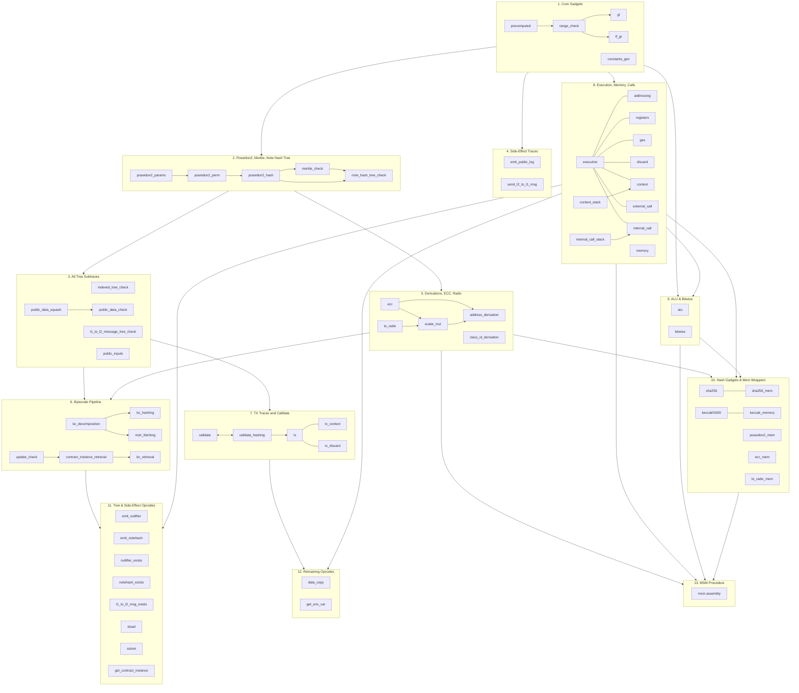

# AVM Circuit Audit Scope Overview

## Scope Boundaries

The audit covers:
- **PIL constraint files** (`.pil`) -- the source of truth for all relation constraints. These define what constitutes a valid trace.
- **Hand-optimized C++ relations** -- only where they replace auto-generated code (currently `poseidon2_perm`). These must be audited for semantic equivalence to their PIL source.
- **Hand-written AVM assembly** (scope 13) -- the MSM transpiler procedure (`avm-transpiler/src/procedures/`). This is executable code whose correctness the circuit faithfully proves; a bug here means wrong results, not a constraint bypass.

The audit does **not** cover:
- **Test files** (`.test.cpp`) -- listed in each scope doc for reference. These are not auditable artifacts but provide useful context for understanding expected behavior and edge cases.
- **Auto-generated C++ relations** -- these are mechanically produced from PIL by `bb-pilcom`. Each scope doc lists the generated files and asks auditors to confirm they directly reflect the PIL. Full line-by-line review of generated code is not expected; the check is that the generation is faithful.
- **Trace generation** (`tracegen/`) -- the C++ code that populates the trace. Tracegen is the prover's witness generation; bugs here cannot produce invalid proofs (they can only cause valid executions to fail to prove). Tracegen is covered by internal audit.
- **Simulation** (`simulation/`) -- the C++ code that simulates AVM execution and emits events consumed by tracegen. Same reasoning as tracegen.

## Audit Scopes

The AVM circuit audit is organized into 13 layered scopes, each building on prerequisites from earlier scopes. The table below shows the order, scope name, file reference, PIL file count, and approximate PIL line count.

| # | Scope | File | PIL | ~Lines of PIL |
|---|-------|------|-----|---------------|
| 1 | Core Gadgets | [`audit_scope_avm_core.md`](audit_scope_avm_core.md) | 5 | 620 |
| 2 | Poseidon2, Merkle Trees, and Note Hash Tree | [`audit_scope_avm_poseidon_merkle_note_hash.md`](audit_scope_avm_poseidon_merkle_note_hash.md) | 5 | 1,880 + 470 (C++) |
| 3 | All Tree Subtraces | [`audit_scope_avm_all_trees.md`](audit_scope_avm_all_trees.md) | 5 | 670 |
| 4 | Side-Effect Traces | [`audit_scope_avm_side_effects.md`](audit_scope_avm_side_effects.md) | 3 | 300 |
| 5 | Derivations, ECC, and Radix Decomposition | [`audit_scope_avm_derivations_and_ecc.md`](audit_scope_avm_derivations_and_ecc.md) | 5 | 560 |
| 6 | Bytecode Pipeline | [`audit_scope_avm_bytecode.md`](audit_scope_avm_bytecode.md) | 6 | 1,070 |
| 7 | TX Traces and Calldata | [`audit_scope_avm_tx.md`](audit_scope_avm_tx.md) | 5 | 1,090 |
| 8 | Execution, Memory, and Calls | [`audit_scope_avm_execution_and_calls.md`](audit_scope_avm_execution_and_calls.md) | 11 | 1,840 |
| 9 | ALU and Bitwise | [`audit_scope_avm_alu_and_bitwise.md`](audit_scope_avm_alu_and_bitwise.md) | 2 | 500 |
| 10 | Hash Gadgets and Memory-Aware Wrappers | [`audit_scope_avm_hash_gadgets_and_mem_wrappers.md`](audit_scope_avm_hash_gadgets_and_mem_wrappers.md) | 7 | 2,460 |
| 11 | Tree and Side-Effect Opcode Wrappers | [`audit_scope_avm_tree_and_side_effect_opcodes.md`](audit_scope_avm_tree_and_side_effect_opcodes.md) | 8 | 510 |
| 12 | Remaining Opcodes (Data Copy, GetEnvVar) | [`audit_scope_avm_remaining_opcodes.md`](audit_scope_avm_remaining_opcodes.md) | 2 | 390 |
| 13 | MSM Transpiler Procedure | [`audit_scope_avm_msm_procedure.md`](audit_scope_avm_msm_procedure.md) | 0 | 57 instructions |

**Total: 64 PIL files, ~11,900 lines of PIL** across all scopes (some PIL files like `public_inputs.pil` appear in limited scope in multiple audits). Scope 13 covers hand-written AVM assembly (Rust, not PIL). Line counts exclude comments and blank lines.

## Dependency Diagram

The diagram below shows all 64 PIL files organized into their audit scopes, with intra-scope dependencies shown as arrows. Inter-scope dependencies are documented in the [Prerequisite Chains](#prerequisite-chains) table below.

**Legend:** Solid arrows (`-->`) indicate a dependency (target depends on source). Undirected links (`---`) indicate virtual gadgets that share rows with the same trace. Bidirectional arrows (`<-->`) indicate mutual lookups between traces. Arrows between scope boxes show inter-scope prerequisites.

## Prerequisite Chains

Each scope lists its direct prerequisites. The full prerequisite chains are:

| Scope | Direct Prerequisites |
|-------|---------------------|
| **1. Core Gadgets** | None |
| **2. Poseidon2, Merkle, NHT** | 1 |
| **3. All Tree Subtraces** | 1, 2 |
| **4. Side-Effect Traces** | 1 |
| **5. Derivations, ECC, Radix** | 1, 2 |
| **6. Bytecode Pipeline** | 1, 2, 3, 5 |
| **7. TX Traces and Calldata** | 1, 2, 3 |
| **8. Execution, Memory, Calls** | 1 |
| **9. ALU and Bitwise** | 1, 8 |
| **10. Hash Gadgets & Mem Wrappers** | 1, 2, 5, 8, 9 |
| **11. Tree & Side-Effect Opcodes** | 1, 2, 3, 6, 8 |
| **12. Remaining Opcodes** | 1, 3, 7, 8 |
| **13. MSM Transpiler Procedure** | 5, 8, 9, 10 |

## Recommended Audit Order

The scopes are numbered in a valid topological order. However, there is parallelism available:

- **Phase 1** (no dependencies): Scope 1
- **Phase 2** (depends on 1): Scopes 2, 4, 8 (can be done in parallel)
- **Phase 3** (depends on 1+2): Scopes 3, 5
- **Phase 4** (depends on 1-3+8): Scopes 6, 7, 9
- **Phase 5** (depends on many): Scopes 10, 11, 12 (can be done in parallel)
- **Phase 6** (depends on 5+8+9+10): Scope 13

## PIL File Coverage

Every PIL file under `barretenberg/cpp/pil/vm2` is covered by exactly one audit scope:

| Scope | PIL Files |
|-------|-----------|
| 1 | `precomputed`, `constants_gen`, `range_check`, `gt`, `ff_gt` |
| 2 | `poseidon2_hash`, `poseidon2_perm`, `poseidon2_params`, `trees/merkle_check`, `trees/note_hash_tree_check`, `public_inputs` (limited) |
| 3 | `trees/indexed_tree_check`, `trees/public_data_check`, `trees/public_data_squash`, `trees/l1_to_l2_message_tree_check`, `public_inputs` |
| 4 | `opcodes/emit_public_log`, `opcodes/send_l2_to_l1_msg`, `public_inputs` (limited) |
| 5 | `ecc`, `scalar_mul`, `to_radix`, `bytecode/class_id_derivation`, `bytecode/address_derivation` |
| 6 | `bytecode/bc_decomposition`, `bytecode/bc_hashing`, `bytecode/instr_fetching`, `bytecode/bc_retrieval`, `bytecode/update_check`, `bytecode/contract_instance_retrieval`, `public_inputs` (limited) |
| 7 | `tx`, `tx_context`, `tx_discard`, `calldata`, `calldata_hashing`, `public_inputs` (limited) |
| 8 | `execution`, `execution/addressing`, `execution/registers`, `execution/gas`, `execution/discard`, `memory`, `context`, `context_stack`, `opcodes/external_call`, `internal_call_stack`, `opcodes/internal_call` |
| 9 | `alu`, `bitwise` |
| 10 | `sha256`, `sha256_mem`, `keccakf1600`, `keccak_memory`, `poseidon2_mem`, `ecc_mem`, `to_radix_mem` |
| 11 | `opcodes/emit_nullifier`, `opcodes/emit_notehash`, `opcodes/nullifier_exists`, `opcodes/notehash_exists`, `opcodes/l1_to_l2_message_exists`, `opcodes/sload`, `opcodes/sstore`, `opcodes/get_contract_instance` |
| 12 | `data_copy`, `opcodes/get_env_var`, `public_inputs` (limited) |
| 13 | _(no PIL files -- covers hand-written AVM assembly in `avm-transpiler/src/procedures/`)_ |

## Reference Documentation

For all scopes, the following reference documentation applies:

1. **[AVM Reference Documentation](../../../../../yarn-project/simulator/docs/avm/README.md)** -- The primary reference for the Aztec Virtual Machine: its purpose, execution model, instruction set, memory model, gas metering, and error handling.

2. **[AVM Circuit Guide](../docs/README.md)** -- Comprehensive guide to the AVM circuit architecture, trace structure, subtraces, and the proving system.

3. **[VM Circuit Recipes](../docs/recipes.md)** -- Standard algebraic patterns and recipes used throughout PIL files (boolean checks, conditional assignment, accumulators, comparisons, etc.).
