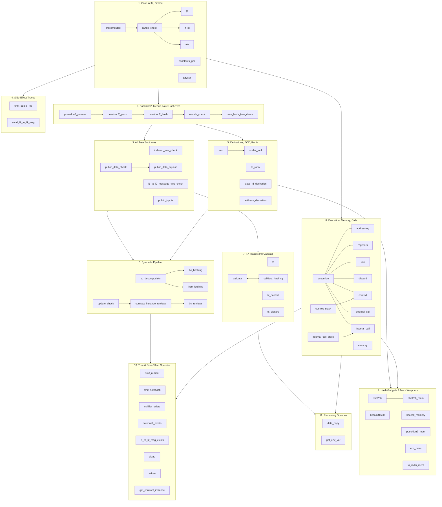

# AVM Circuit Audit Scope Overview

Repository: https://github.com/AztecProtocol/aztec-packages
Commit hash: `ab47a6e7754a0cc86278fe9d47c9c8884ca6d363` ([link](https://github.com/AztecProtocol/aztec-packages/tree/ab47a6e7754a0cc86278fe9d47c9c8884ca6d363))

## Audit Scopes

The AVM circuit audit is organized into 11 layered scopes, each building on prerequisites from earlier scopes. The table below shows the order, scope name, file reference, PIL file count, C++ item count, and test file count.

| # | Scope | File | PIL | C++ Items | Tests |
|---|-------|------|-----|-----------|-------|
| 1 | Core Components, ALU, and Bitwise | `audit_scope_avm_core_alu_bitwise.md` | 7 | 51 | 22 |
| 2 | Poseidon2, Merkle Trees, and Note Hash Tree | `audit_scope_avm_poseidon_merkle_note_hash.md` | 5 | — | — |
| 3 | All Tree Subtraces | `audit_scope_avm_all_trees.md` | 5 | — | — |
| 4 | Side-Effect Traces | `audit_scope_avm_side_effects.md` | 3 | 14 | 4 |
| 5 | Derivations, ECC, and Radix Decomposition | `audit_scope_avm_derivations_and_ecc.md` | 5 | 36 | 14 |
| 6 | Bytecode Pipeline | `audit_scope_avm_bytecode.md` | 6 | 29 | 14 |
| 7 | TX Traces and Calldata | `audit_scope_avm_tx.md` | 5 | 20 | 8 |
| 8 | Execution, Memory, and Calls | `audit_scope_avm_execution_and_calls.md` | 11 | 45 | 18 |
| 9 | Hash Gadgets and Memory-Aware Wrappers | `audit_scope_avm_hash_gadgets_and_mem_wrappers.md` | 7 | 21 | 7 |
| 10 | Tree and Side-Effect Opcode Wrappers | `audit_scope_avm_tree_and_side_effect_opcodes.md` | 8 | 17 | 8 |
| 11 | Remaining Opcodes (Data Copy, GetEnvVar) | `audit_scope_avm_remaining_opcodes.md` | 2 | 9 | 5 |

**Total: 64 PIL files** across all scopes (some PIL files like `public_inputs.pil` appear in limited scope in multiple audits).

## Dependency Diagram

The diagram below shows all 64 PIL files organized into their audit scopes, with intra-scope dependencies shown as arrows. Inter-scope dependencies are documented in the [Prerequisite Chains](#prerequisite-chains) table below.

**Legend:** Solid arrows (`-->`) indicate a dependency (target depends on source). Undirected links (`---`) indicate virtual gadgets that share rows with the same trace. Bidirectional arrows (`<-->`) indicate mutual lookups between traces. Arrows between scope boxes show inter-scope prerequisites.

## Prerequisite Chains

Each scope lists its direct prerequisites. The full prerequisite chains are:

| Scope | Direct Prerequisites |
|-------|---------------------|
| **1. Core, ALU, Bitwise** | None |
| **2. Poseidon2, Merkle, NHT** | 1 |
| **3. All Tree Subtraces** | 1, 2 |
| **4. Side-Effect Traces** | 1 |
| **5. Derivations, ECC, Radix** | 1, 2 |
| **6. Bytecode Pipeline** | 1, 2, 3, 4 |
| **7. TX Traces and Calldata** | 1, 2, 3 |
| **8. Execution, Memory, Calls** | 1 |
| **9. Hash Gadgets & Mem Wrappers** | 1, 2, 5, 8 |
| **10. Tree & Side-Effect Opcodes** | 1, 2, 3, 6, 8 |
| **11. Remaining Opcodes** | 1, 3, 7, 8 |

## Recommended Audit Order

The scopes are numbered in a valid topological order. However, there is parallelism available:

- **Phase 1** (no dependencies): Scope 1
- **Phase 2** (depends on 1): Scopes 2, 4, 8 (can be done in parallel)
- **Phase 3** (depends on 1+2): Scopes 3, 5
- **Phase 4** (depends on 1-3): Scopes 6, 7
- **Phase 5** (depends on many): Scopes 9, 10, 11 (can be done in parallel)

## PIL File Coverage

Every PIL file under `barretenberg/cpp/pil/vm2` is covered by exactly one audit scope:

| Scope | PIL Files |
|-------|-----------|
| 1 | `precomputed`, `constants_gen`, `range_check`, `gt`, `ff_gt`, `alu`, `bitwise` |
| 2 | `poseidon2_hash`, `poseidon2_perm`, `poseidon2_params`, `trees/merkle_check`, `trees/note_hash_tree_check` |
| 3 | `trees/indexed_tree_check`, `trees/public_data_check`, `trees/public_data_squash`, `trees/l1_to_l2_message_tree_check`, `public_inputs` |
| 4 | `opcodes/emit_public_log`, `opcodes/send_l2_to_l1_msg`, `public_inputs` (limited) |
| 5 | `ecc`, `scalar_mul`, `to_radix`, `bytecode/class_id_derivation`, `bytecode/address_derivation` |
| 6 | `bytecode/bc_decomposition`, `bytecode/bc_hashing`, `bytecode/instr_fetching`, `bytecode/bc_retrieval`, `bytecode/update_check`, `bytecode/contract_instance_retrieval` |
| 7 | `tx`, `tx_context`, `tx_discard`, `calldata`, `calldata_hashing` |
| 8 | `execution`, `execution/addressing`, `execution/registers`, `execution/gas`, `execution/discard`, `memory`, `context`, `context_stack`, `opcodes/external_call`, `internal_call_stack`, `opcodes/internal_call` |
| 9 | `sha256`, `sha256_mem`, `keccakf1600`, `keccak_memory`, `poseidon2_mem`, `ecc_mem`, `to_radix_mem` |
| 10 | `opcodes/emit_nullifier`, `opcodes/emit_notehash`, `opcodes/nullifier_exists`, `opcodes/notehash_exists`, `opcodes/l1_to_l2_message_exists`, `opcodes/sload`, `opcodes/sstore`, `opcodes/get_contract_instance` |
| 11 | `data_copy`, `opcodes/get_env_var` |

## Reference Documentation

For all scopes, the following reference documentation applies:

1. **[AVM Reference Documentation](https://github.com/AztecProtocol/aztec-packages/blob/ab47a6e7754a0cc86278fe9d47c9c8884ca6d363/yarn-project/simulator/docs/avm/README.md)** -- The primary reference for the Aztec Virtual Machine: its purpose, execution model, instruction set, memory model, gas metering, and error handling.

2. **[AVM Circuit Guide](https://github.com/AztecProtocol/aztec-packages/blob/ab47a6e7754a0cc86278fe9d47c9c8884ca6d363/barretenberg/cpp/pil/vm2/docs/README.md)** -- Comprehensive guide to the AVM circuit architecture, trace structure, subtraces, and the proving system.

3. **[VM Circuit Recipes](https://github.com/AztecProtocol/aztec-packages/blob/ab47a6e7754a0cc86278fe9d47c9c8884ca6d363/barretenberg/cpp/pil/vm2/docs/recipes.md)** -- Standard algebraic patterns and recipes used throughout PIL files (boolean checks, conditional assignment, accumulators, comparisons, etc.).
