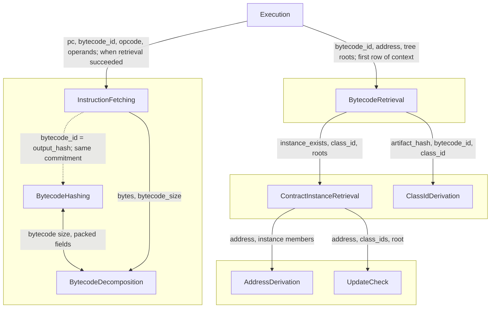
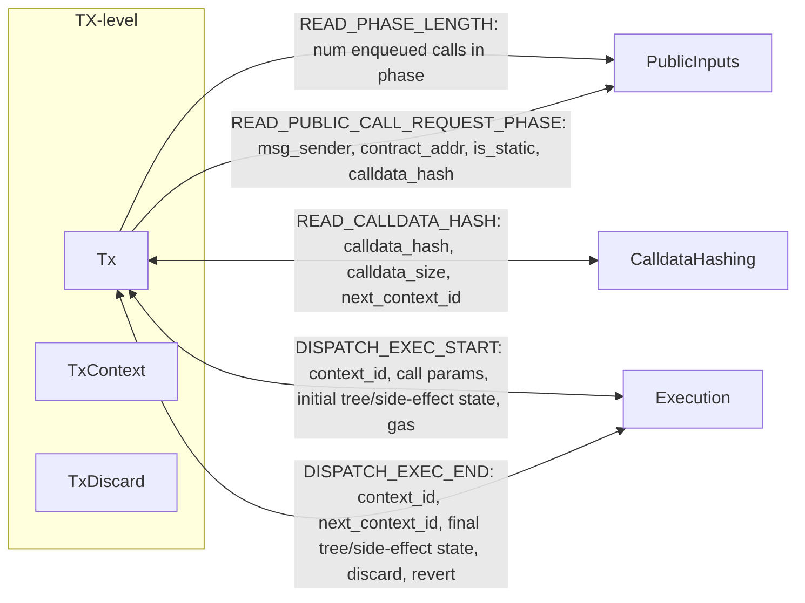
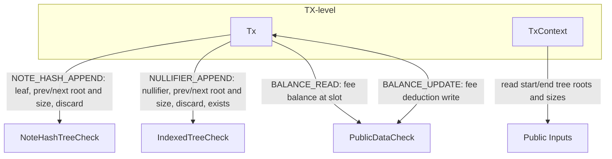

# AVM Circuit Guide

The objective of this document is to give a short introduction to the AVM “circuit”, which is the part of the AVM that is responsible for generating proofs of correct execution. This document assumes basic familiarity with SNARKs and zk-rollups.

## Table of contents

- [Introduction](#introduction)
- [The AVM circuit in the protocol](#the-avm-circuit-in-the-protocol)
  - [From private execution to rollup](#from-private-execution-to-rollup)
  - [TXs with public components](#txs-with-public-components)
  - [Flow for a Transaction With Public Functions](#flow-for-a-transaction-with-public-functions)
- [Simulation, tracegen and proving](#simulation-tracegen-and-proving)
  - [Simulation](#simulation)
  - [Tracegen](#tracegen)
  - [Constraints and proving](#constraints-and-proving)
  - [The PIL specification language](#the-pil-specification-language)
  - [The proving system](#the-proving-system)
- [Circuit Architecture](#circuit-architecture)
  - [Overview](#overview)
  - [Special subtraces: precomputed and public inputs](#special-subtraces-precomputed-and-public-inputs)
  - [Connecting subtraces](#connecting-subtraces)
  - [Bytecode subtraces](#bytecode-subtraces)
  - [TX-level traces and execution](#tx-level-traces-and-execution)
  - [TX-level traces and tree state](#tx-level-traces-and-tree-state)
- [Appendix](#appendix)
  - [Public Inputs Layout](#public-inputs-layout)
  - [Generated C++ files](#generated-c-files)
  - [The `accumulate` function](#the-accumulate-function)
  - [Optimized Poseidon2](#optimized-poseidon2)
  - [Skippable mechanism](#skippable-mechanism)

# Introduction

The Aztec Virtual Machine (AVM) circuit has the following responsibilities

- It should encode and characterize the semantics of [AVM simulation](https://github.com/AztecProtocol/aztec-packages/blob/next/yarn-project/simulator/docs/avm/README.md).
- Given a TX and a set of public inputs (think of it as “state before, and state after the execution of the TX”) it should generate a proof stating that the AVM execution of the TX advances the state in such a way.

NOTE: The AVM (and the circuit) is much more than just an opcode interpreter. It enshrines many parts of the Aztec protocol.

# The AVM circuit in the protocol

All Aztec transactions start from private (that is, client-side). While there are private-only transactions, there are no public-only transactions. Private transactions that wish to execute public functions can “enqueue” them so that they get executed by the sequencer at the tip of the chain. For more information on how AVM **simulation** fits in the protocol see “[AVM simulation](https://github.com/AztecProtocol/aztec-packages/blob/next/yarn-project/simulator/docs/avm/README.md)”. In this section (and document) we focus on the proving side of the AVM.

## From private execution to rollup

When a user sends a TX to a sequencer, it will include a CHONK proof (and a list of outputs like nullifiers, notes, etc). The sequencer will process a set of transactions and ask for further proving. The end goal is to “roll up” all those proofs into one final proof. This proof is eventually sent to the L1 contract which verifies it and updates the tree states (among other things). For details on the rollup process see “[Rollups](https://docs.aztec.network/developers/docs/foundational-topics/advanced/circuits/rollup_circuits)”.

If the TX does not enqueue any public function, it is handled by the “Private Base” circuit. This is a Noir circuit that verifies the CHONK proof and other things from private. The proof generated by the Private Base continues the flow and is rolled up with other proofs.

## TXs with public components

The sequencer uses the AVM simulator to execute all **public** functions for a transaction. It processes the public call requests queued during private execution, and performs tree updates and fee accumulation. For the purposes of this document, you can think that the sequencer “sends a proof request” to a prover, to generate an AVM circuit proof. In reality, things are more complicated: provers follow the “unproven” chain (by polling) and choose to prove when they see work is available. They then send the final (rollup) proof to L1 and collect fees.

Transactions with public components are handled by the “Public Base” circuit. This is a Noir circuit that verifies both the CHONK proof from private and the AVM proof from public (using the “AVM recursive verifier”). From there, the rollup process goes on basically as before.

**Important**: As explained in “[Public TX Simulation](https://github.com/AztecProtocol/aztec-packages/blob/next/yarn-project/simulator/docs/avm/public-tx-simulation.md)”, if the TX has a public part, it is the job of the simulator and circuit to insert side effects _produced by private_ (e.g., nullifiers, notes, etc) and also execute fee payment.

## Flow for a Transaction With Public Functions

For a transaction that has public function calls, the high-level flow is:

1. **Private Kernel** – Processes private functions and queues public call requests.
2. **Hiding Kernel** – Makes the client-side proof ZK.
3. **AVM proving** – Proves AVM execution (this document).
4. **TX Base Public** – Verifies both proofs, validates consistency and outputs transaction rollup data.
5. **Rest of rollup** – TX Merge, Block Root, Checkpoint Root/Merge, Root Rollup, as in the [Rollup Circuits](https://docs.aztec.network/developers/docs/foundational-topics/advanced/circuits/rollup_circuits) hierarchy.

See also: docs for [Transaction](https://docs.aztec.network/developers/docs/foundational-topics/transactions).

# Simulation, tracegen and proving

In order to generate a proof, some preparation steps are needed. We first simulate the TX, construct a trace, and then proceed to prove that the trace satisfies a set of constraints.

## Simulation

The first step is to simulate the TX, starting with the state at a given block. Simulation will

- Execute the protocol and opcode steps according to the AVM simulation semantics.
- Generate a set “events” (e.g., memory accesses, alu operations, etc).
- Record the initial and final states, which will be used to build the public inputs (PIs).

When we talk about “state” we mostly refer to the state of the merkle trees. The set of events is a compact representation of what will become the trace. We call this version of simulation (the one done by the prover at the moment of proving) “[simulation for witgen](https://github.com/AztecProtocol/aztec-packages/blob/next/barretenberg/cpp/src/barretenberg/vm2/simulation_helper.cpp#L614)”.

**Implementation note**: You can imagine that to be able to access the initial state, advance the trees and create a final state, the prover would need access to the merkle tree DB. This would make the prover workers stateful and in practice they would have to basically be a full node. Since this is undesirable, the proving process manages this in two steps: (1) the prover “broker”, which is a full node, pre-simulates each of the transactions and generates “DB hints” for each of them (we call this “[simulation for hint collection](https://github.com/AztecProtocol/aztec-packages/blob/next/barretenberg/cpp/src/barretenberg/vm2/simulation_helper.cpp#L576)”). (2) each proving request is sent to a worker along with the DB hints that contain exactly the information they need to fulfill their DB requests. Workers therefore transparently use a “seeded DB”, keeping them stateless.

There are therefore 3 flavors of simulation

- [Fast simulation](https://github.com/AztecProtocol/aztec-packages/blob/next/barretenberg/cpp/src/barretenberg/vm2/simulation_helper.cpp#L556): Used by the sequencer during block building, and by the committee when re-executing. It requires access to the world state DB and its job is to go from initial to final state as quickly as possible.
- [Simulation for hint collection](https://github.com/AztecProtocol/aztec-packages/blob/next/barretenberg/cpp/src/barretenberg/vm2/simulation_helper.cpp#L576): Used by the prover broker to generate DB hints for the workers.
- [Simulation for witgen](https://github.com/AztecProtocol/aztec-packages/blob/next/barretenberg/cpp/src/barretenberg/vm2/simulation_helper.cpp#L614): Used by the prover workers to generate events (and later the trace). Requires DB hints.

Source code folder: [vm2/simulation](https://github.com/AztecProtocol/aztec-packages/tree/next/barretenberg/cpp/src/barretenberg/vm2/simulation).

## Tracegen

The next step towards proving is to create a trace. You can think of a trace as a glorified spreadsheet. Conceptually, the tracegen creates the “model” for the execution of a TX. In principle, there could be many different ways to model such execution. Tracegen settles for a concrete one.

In the case of the AVM, the trace has 3500+ columns and up to 2^21 (\~2 million) rows. Each cell is a field element (BN254 scalar field) and each column has a name. We group the columns in logical sets that we call “subtraces”. These have no meaning for the proving system and are only meant to help us understand the system more easily. For example, all columns related to Poseidon2 processing would be called “the Poseidon2” subtrace.

From simulation, we will have received a set of events of different types. To name a few: ALU, execution, memory, poseidon2, etc. These events state that “something happened” and needs to be proved. The job of the tracegen step is to lay down the actual values in the trace, and complete any missing witnesses. For example, we could have a hypothetical “division” event with the values: `{a: 20, b: 2, result: 10}`. The processor for this event would add the values from that event in the trace, but will also probably have to compute `remainder` and add it as well, since that’s the standard way to prove a division by stating that `a = b * result + remainder`.

Note that this step is highly parallelizable since each event will only touch a subset of the columns. Also note that while generally 1 event will correspond to 1 row, there are traces where 1 event will generate several rows. In the next section we will discuss the constraints imposed on these columns and rows.

Source code folder: [vm2/tracegen](https://github.com/AztecProtocol/aztec-packages/tree/next/barretenberg/cpp/src/barretenberg/vm2/tracegen).

## Constraints and proving

The main job of the AVM is to correctly characterize the traces that correspond to valid AVM simulation. This is done via “constraints” between cells. The constraints should satisfy

- **Soundness**: Traces that do not correspond to a valid AVM simulation (e.g., by a malicious prover) should not generate a valid proof (e.g., they should fail some constraint).
- **Completeness**: Every valid simulation (e.g., by an honest sequencer) should generate a trace via our tracegen process and result in the generation of a proof that correctly verifies (i.e., satisfies all constraints).

Each subtrace, in some sense, states that something is true, and sets up the auxiliary columns needed to prove it. Following the division example that we saw before we can imagine a “division subtrace” (which does not exist in the AVM) that has columns `a, b, remainder, result` and has the following constraints:

1. `a = b * result + remainder`.
2. `remainder` is less than `b`.

### **The PIL specification language**

The AVM uses Polygon’s [Polynomial Identity Language](https://github.com/0xPolygon/pilcom) (PIL) to specify constraints. The PIL files can be found in the [barretenberg/cpp/pil/vm2](https://github.com/AztecProtocol/aztec-packages/tree/next/barretenberg/cpp/pil/vm2) directory.

The PIL language is very restricted. In a nutshell you can only specify constraints using: column names, constant numbers, `+`, `-`, `*`, `=`, and the `’` operator where `column’` means the value of the `column` at the next row. This is useful to specify things like `counter’ = counter + 1`. This operator can’t be stacked. That is, `counter’’` is not a valid expression. (The PIL language supports this, but Barretenberg doesn’t.)

Constraints can be “named” by writing `#[NAME_OF_CONSTRAINT]` before it. For example

```
#[COUNTER_INCREASE]
counter' = counter + 1;
```

**Important**: For a proof to be valid, all written constraints will have to be valid for **every row** of the 2^21 rows. Constraints are global. They are _not_ restricted to a particular subtrace.

### **The proving system**

The AVM uses Aztec’s [Barretenberg](https://barretenberg.aztec.network/docs/) proving system which is a SNARK based on the BN254 elliptic curve. The PIL files are [preprocessed](https://github.com/AztecProtocol/aztec-packages/tree/next/bb-pilcom) and C++ files are generated in the [barretenberg/cpp/src/barretenberg/vm2/generated](https://github.com/AztecProtocol/aztec-packages/tree/next/barretenberg/cpp/src/barretenberg/vm2/generated) directory. These files are called “relations” and are compatible with Barretenberg.

_Note_: strictly speaking, Barretenberg uses the term “relation” for a logical grouping of constraints. These constraints are then called subrelations. We use the terms relation, subrelation and constraint interchangeably when it’s clear from context.

When generating a proof, the proving system will “input” the trace as a whole, and generate a proof for it. As we mentioned earlier, Barretenberg does not have a concept of subtraces.

Proofs can then be verified either

- Natively using the verifier class (see [example](https://github.com/AztecProtocol/aztec-packages/blob/next/barretenberg/cpp/src/barretenberg/vm2/constraining/verifier.test.cpp)).
- Natively using the `bb-avm` binary with the `verify_avm` subcommand (see [cli](https://github.com/AztecProtocol/aztec-packages/blob/next/barretenberg/cpp/src/barretenberg/bb/cli.cpp#L594)).
- Recursively via a Noir circuit (via `std::verify_proof_with_type()`, see [here](https://github.com/AztecProtocol/aztec-packages/blob/next/noir-projects/noir-protocol-circuits/crates/types/src/proof/proof_data.nr#L28)).

Source code folder: [vm2/constraining](https://github.com/AztecProtocol/aztec-packages/tree/next/barretenberg/cpp/src/barretenberg/vm2/constraining).

# Circuit Architecture

Some ZK virtual machines (e.g., many RISC-based ones) are mostly opcode interpreters. In that case, chain-specific concepts are not enshrined and are usually written in higher-level languages and compiled into a sequence of opcodes. Many times, this is also the case for constructs like Keccak or other hashes. The advantage of that approach is that you can have a rather minimal VM (which is good for development time and for security). The disadvantage is that the overhead you pay is quite high. The result is a narrow but rather long trace. Many VMs try to find a middle ground by extending such an architecture with “gadgets” or “precompiles”. That is, special subtraces for things like Poseidon2. Many times, this strikes a good balance.

The AVM is **not** like that. For reasons that are beyond the scope of this document, the AVM

- Enshrines everything needed from the Aztec protocol
- Has a “precompile” for every supported opcode and protocol concept

This results in a short but very wide trace. You could say that (fixing the underlying proving system) this is the “most efficient” approach. There is no runtime overhead but you pay for it in complexity (sadge). It also means that in order to understand, judge, or audit the AVM you need to understand the source of truth. That is, the protocol (resource: [High Level Overview of Aztec](https://docs.aztec.network/developers/docs/foundational-topics)).

_Note on the AVM vs Honk/Plonk-like circuits_: Standard circuits and RISC-based VMs are similar in the sense that their traces are sequences of “rather uniform” operations (gates in circuits, opcodes in RISC VMs). This is not the case for the AVM and not the right mental model. In the AVM you should think of subtraces and connections. Each subtrace, however, is mostly uniform.

**Pure vs Stateful subtraces**: We say that a subtrace is “pure” when the statement to prove only depends on the inputs. For example, if you prove that “a \+ b \= c” with three columns `a, b, c` (similar to what the ALU does). In contrast, the (execution) subtrace implementing the ADD **opcode** will not be pure, since it interacts with memory. Executing `ADD /*a_addr=*/0x10, /*b_addr=*/0x20, /*c_addr=*/0x30` will not yield the same result if you do it under different memory configurations. This also often happens with opcodes related to tree state. A nice property of pure subtraces is that you can deduplicate events. If you already proved (i.e., have a row) that `2 + 3 = 5`, you don’t need to do it again. We take advantage of this when possible.

**Error handling**: In standard circuits it is common to `assert` the statements that you want to prove. If the user did not generate the right witnesses (or if you are trying to trick the prover) the proof will simply not be generated (technically it will, but it will not be valid). In a VM, that will not cut it. For most operations, errors need to be handled so that the proof produced states that either (1) everything went well, or (2) an error occurred. In both cases, a valid proof should be generated, so that the sequencer and prover are properly remunerated. This is arguably one of the most challenging aspects of writing a VM. When you approach a subtrace, it will specify if it is “infallible” (does not do error handling) or if it handles errors. This should be clear from the documentation in the PIL file.

## Overview

We present a grouping of the AVM subtraces. Each subtrace links to its PIL file, which contains further documentation.

**TX level Subtraces**

Just like simulation starts by handling a TX, the TX subtrace is, in some sense, the “entry point” or highest-level subtrace. It handles phases, insertions from private and fee payment among others. It ensures that the enqueued calls that are executed are the right ones, and it communicates with the “execution subtraces” (opcode execution). Note: docs for [Public TX simulation](https://github.com/AztecProtocol/aztec-packages/blob/next/yarn-project/simulator/docs/avm/public-tx-simulation.md) might help.

- [Tx](https://github.com/AztecProtocol/aztec-packages/blob/next/barretenberg/cpp/pil/vm2/tx.pil): Top-level transaction trace; handles phases, insertions from private, reverts, and fee payment.
- [TxContext](https://github.com/AztecProtocol/aztec-packages/blob/next/barretenberg/cpp/pil/vm2/tx_context.pil): Tree and side-effect state across the transaction; continuity and revert snapshots.
- [TxDiscard](https://github.com/AztecProtocol/aztec-packages/blob/next/barretenberg/cpp/pil/vm2/tx_discard.pil): Logic for dropping side effects and tree state on revert in the TX context.

**Bytecode Subtraces**

These traces contain the logic to prove that the instruction that you are executing is the one in the actual deployed contract at the requested address. This involves many steps, from computing the “hash” of the bytecode to computing its class id, then address (considering possible updates) and finally proving deployment via the (nullifier) tree. Note: docs for [Contract Deployment](https://docs.aztec.network/developers/docs/foundational-topics/contract_creation) might help.

- [ClassIdDerivation](https://github.com/AztecProtocol/aztec-packages/blob/next/barretenberg/cpp/pil/vm2/bytecode/class_id_derivation.pil): Derives class ID from artifact hash, function roots, and bytecode commitment.
- [AddressDerivation](https://github.com/AztecProtocol/aztec-packages/blob/next/barretenberg/cpp/pil/vm2/bytecode/address_derivation.pil): Derives a contract address from its members.
- [BytecodeRetrieval](https://github.com/AztecProtocol/aztec-packages/blob/next/barretenberg/cpp/pil/vm2/bytecode/bc_retrieval.pil): Orchestrates loading bytecode for a contract address and validates it against the tree.
- [BytecodeDecomposition](https://github.com/AztecProtocol/aztec-packages/blob/next/barretenberg/cpp/pil/vm2/bytecode/bc_decomposition.pil): Sliding window over bytecode; range-checks bytes and packs chunks for hashing.
- [BytecodeHashing](https://github.com/AztecProtocol/aztec-packages/blob/next/barretenberg/cpp/pil/vm2/bytecode/bc_hashing.pil): Computes bytecode commitment by hashing packed field elements with Poseidon2.
- [ContractInstanceRetrieval](https://github.com/AztecProtocol/aztec-packages/blob/next/barretenberg/cpp/pil/vm2/bytecode/contract_instance_retrieval.pil): Proves a deployed instance exists at an address and matches the given contract class.
- [UpdateCheck](https://github.com/AztecProtocol/aztec-packages/blob/next/barretenberg/cpp/pil/vm2/bytecode/update_check.pil): Ensures current class ID reflects contract updates using public data and timestamps.
- [InstructionFetching](https://github.com/AztecProtocol/aztec-packages/blob/next/barretenberg/cpp/pil/vm2/bytecode/instr_fetching.pil): Fetches and decodes an instruction at a given PC from bytecode.

**Execution Subtraces**

The execution subtraces handle the main interpreter loop. It is the part of the AVM that most resembles a standard VM. However, it’s still more than that since we handle “blockchain specific” concepts like “external calls” and, most importantly, reverts (and rollback of state).

- [Execution](https://github.com/AztecProtocol/aztec-packages/blob/next/barretenberg/cpp/pil/vm2/execution.pil): Main opcode execution trace: fetch, decode, execute, and dispatch to subtraces.
- [Memory](https://github.com/AztecProtocol/aztec-packages/blob/next/barretenberg/cpp/pil/vm2/memory.pil): Global memory trace; sorted by (space, address, clk, rw) with consistency constraints.
- [Context](https://github.com/AztecProtocol/aztec-packages/blob/next/barretenberg/cpp/pil/vm2/context.pil): Execution state (pc, sender, contract, bytecode, gas, trees).
- [Calldata](https://github.com/AztecProtocol/aztec-packages/blob/next/barretenberg/cpp/pil/vm2/calldata.pil): Calldata column per context; values checked by calldata_hashing.
- [Context Stack](https://github.com/AztecProtocol/aztec-packages/blob/next/barretenberg/cpp/pil/vm2/context_stack.pil): Stack of call contexts for nested external calls.
- [Internal Call Stack](https://github.com/AztecProtocol/aztec-packages/blob/next/barretenberg/cpp/pil/vm2/internal_call_stack.pil): Return-address stack for internal calls.
- [Addressing](https://github.com/AztecProtocol/aztec-packages/blob/next/barretenberg/cpp/pil/vm2/execution/addressing.pil): Resolves instruction operands to immediates or memory addresses.
- [Discard](https://github.com/AztecProtocol/aztec-packages/blob/next/barretenberg/cpp/pil/vm2/execution/discard.pil): Logic for dropping side effects and tree state on revert.
- [Gas](https://github.com/AztecProtocol/aztec-packages/blob/next/barretenberg/cpp/pil/vm2/execution/gas.pil): L2/DA gas accounting and out-of-gas detection per instruction.
- [Registers](https://github.com/AztecProtocol/aztec-packages/blob/next/barretenberg/cpp/pil/vm2/execution/registers.pil): Register read/write and tag checks; interfaces with memory trace.

**Opcode-specific Subtraces**

These subtraces contain the logic for the opcodes. Note: docs for [Instruction Set](https://github.com/AztecProtocol/aztec-packages/blob/next/yarn-project/simulator/docs/avm/avm-isa-quick-reference.md) might help.

- [EmitNullifier](https://github.com/AztecProtocol/aztec-packages/blob/next/barretenberg/cpp/pil/vm2/opcodes/emit_nullifier.pil): Inserts a nullifier into the nullifier tree.
- [EmitNotehash](https://github.com/AztecProtocol/aztec-packages/blob/next/barretenberg/cpp/pil/vm2/opcodes/emit_notehash.pil): Inserts a note hash into the note hash tree.
- [EmitPublicLog](https://github.com/AztecProtocol/aztec-packages/blob/next/barretenberg/cpp/pil/vm2/opcodes/emit_public_log.pil): Emits a public log entry.
- [ExternalCall](https://github.com/AztecProtocol/aztec-packages/blob/next/barretenberg/cpp/pil/vm2/opcodes/external_call.pil): CALL/STATICCALL constraints.
- [GetContractInstance](https://github.com/AztecProtocol/aztec-packages/blob/next/barretenberg/cpp/pil/vm2/opcodes/get_contract_instance.pil): Proves contract instance at address; uses contract_instance_retrieval.
- [GetEnvVar](https://github.com/AztecProtocol/aztec-packages/blob/next/barretenberg/cpp/pil/vm2/opcodes/get_env_var.pil): Reads environment vars from public inputs.
- [InternalCall](https://github.com/AztecProtocol/aztec-packages/blob/next/barretenberg/cpp/pil/vm2/opcodes/internal_call.pil): Internal call/return stack and context ID constraints.
- [L1ToL2MessageExists](https://github.com/AztecProtocol/aztec-packages/blob/next/barretenberg/cpp/pil/vm2/opcodes/l1_to_l2_message_exists.pil): Proves an L1→L2 message exists in the message tree (or not).
- [NotehashExists](https://github.com/AztecProtocol/aztec-packages/blob/next/barretenberg/cpp/pil/vm2/opcodes/notehash_exists.pil): Proves a note hash exists in the note hash tree (or not).
- [NullifierExists](https://github.com/AztecProtocol/aztec-packages/blob/next/barretenberg/cpp/pil/vm2/opcodes/nullifier_exists.pil): Proves a nullifier exists (or not).
- [SendL2ToL1Msg](https://github.com/AztecProtocol/aztec-packages/blob/next/barretenberg/cpp/pil/vm2/opcodes/send_l2_to_l1_msg.pil): Sends an L2→L1 message (public inputs).
- [SLoad](https://github.com/AztecProtocol/aztec-packages/blob/next/barretenberg/cpp/pil/vm2/opcodes/sload.pil): Reads a value from the public data tree at (contract, slot).
- [SStore](https://github.com/AztecProtocol/aztec-packages/blob/next/barretenberg/cpp/pil/vm2/opcodes/sstore.pil): Writes a value to the public data tree; tracks written slots for gas refund.
- [EccMem](https://github.com/AztecProtocol/aztec-packages/blob/next/barretenberg/cpp/pil/vm2/ecc_mem.pil): Opcode logic for ECADD; curve checks and result write.
- [KeccakMem](https://github.com/AztecProtocol/aztec-packages/blob/next/barretenberg/cpp/pil/vm2/keccak_memory.pil): Opcode logic for KECCAKF1600; Uses KeccakF1600 gadget internally.
- [Poseidon2Mem](https://github.com/AztecProtocol/aztec-packages/blob/next/barretenberg/cpp/pil/vm2/poseidon2_mem.pil): Opcode logic for POSEIDON2PERM; Uses Poseidon2Perm gadget internally.
- [Sha256Mem](https://github.com/AztecProtocol/aztec-packages/blob/next/barretenberg/cpp/pil/vm2/sha256_mem.pil): Opcode logic for SHA256 compression; Uses Sha256 gadget internally.
- [ToRadixMem](https://github.com/AztecProtocol/aztec-packages/blob/next/barretenberg/cpp/pil/vm2/to_radix_mem.pil): Opcode logic for TORADIXBE; Uses ToRadix gadget internally.
- [Calldata Hashing](https://github.com/AztecProtocol/aztec-packages/blob/next/barretenberg/cpp/pil/vm2/calldata_hashing.pil): Binds calldata hash and size to the calldata trace for public inputs and execution.
- [DataCopy](https://github.com/AztecProtocol/aztec-packages/blob/next/barretenberg/cpp/pil/vm2/data_copy.pil): CALLDATACOPY and RETURNDATACOPY.

**Merkle Trees / Tree State**

Subtraces that handle the different trees and squashing logic. Note: See [State Management](https://docs.aztec.network/developers/docs/foundational-topics/state_management) and [Indexed Trees](https://docs.aztec.network/developers/docs/foundational-topics/advanced/storage/indexed_merkle_tree).

- [L1ToL2MessageTreeCheck](https://github.com/AztecProtocol/aztec-packages/blob/next/barretenberg/cpp/pil/vm2/trees/l1_to_l2_message_tree_check.pil): Merkle proof for L1→L2 message tree reads.
- [MerkleCheck](https://github.com/AztecProtocol/aztec-packages/blob/next/barretenberg/cpp/pil/vm2/trees/merkle_check.pil): Generic Merkle read/write; one path node per row, Poseidon2 hashes.
- [NoteHashTreeCheck](https://github.com/AztecProtocol/aztec-packages/blob/next/barretenberg/cpp/pil/vm2/trees/note_hash_tree_check.pil): Note hash tree membership and insertions.
- [IndexedTreeCheck](https://github.com/AztecProtocol/aztec-packages/blob/next/barretenberg/cpp/pil/vm2/trees/indexed_tree_check.pil): Generic indexed tree membership and insertions (nullifier tree, retrieved bytecodes tree, written public data slots tree, etc.). Callers provide tree height and optional siloing / public inputs parameters.
- [PublicDataCheck](https://github.com/AztecProtocol/aztec-packages/blob/next/barretenberg/cpp/pil/vm2/trees/public_data_check.pil): Public data tree read/write with siloed slots; uses public_data_squash.
- [PublicDataSquash](https://github.com/AztecProtocol/aztec-packages/blob/next/barretenberg/cpp/pil/vm2/trees/public_data_squash.pil): Squashes public data writes by leaf slot for public inputs.

**Gadgets**

The lowest level subtraces. You can think of them as pure, independent subtraces that are used by other subtraces.

- [ALU](https://github.com/AztecProtocol/aztec-packages/blob/next/barretenberg/cpp/pil/vm2/alu.pil): Arithmetic and comparison over tagged values (field and integers).
- [Bitwise](https://github.com/AztecProtocol/aztec-packages/blob/next/barretenberg/cpp/pil/vm2/bitwise.pil): AND, OR, XOR via 8-bit lookup table.
- [FieldGt](https://github.com/AztecProtocol/aztec-packages/blob/next/barretenberg/cpp/pil/vm2/ff_gt.pil): Field comparison (a \> b) and 128-bit limb decomposition.
- [Gt](https://github.com/AztecProtocol/aztec-packages/blob/next/barretenberg/cpp/pil/vm2/gt.pil): Integer greater-than (up to 128 bits) via range-checked subtraction.
- [KeccakF1600](https://github.com/AztecProtocol/aztec-packages/blob/next/barretenberg/cpp/pil/vm2/keccakf1600.pil): Keccak-f\[1600\] permutation (24 rounds).
- [Poseidon2Hash](https://github.com/AztecProtocol/aztec-packages/blob/next/barretenberg/cpp/pil/vm2/poseidon2_hash.pil): Full Poseidon2 hash over chunked inputs with chained permutation.
- [Poseidon2Perm](https://github.com/AztecProtocol/aztec-packages/blob/next/barretenberg/cpp/pil/vm2/poseidon2_perm.pil), [Poseidon2Params](https://github.com/AztecProtocol/aztec-packages/blob/next/barretenberg/cpp/pil/vm2/poseidon2_params.pil): Poseidon2 round function and BN254 round constants.
- [RangeCheck](https://github.com/AztecProtocol/aztec-packages/blob/next/barretenberg/cpp/pil/vm2/range_check.pil): Proves a value fits in a given bit width via limb decomposition.
- [ScalarMul](https://github.com/AztecProtocol/aztec-packages/blob/next/barretenberg/cpp/pil/vm2/scalar_mul.pil): Grumpkin scalar multiplication via double-and-add.
- [Sha256](https://github.com/AztecProtocol/aztec-packages/blob/next/barretenberg/cpp/pil/vm2/sha256.pil): SHA-256 compression (64 rounds).
- [ToRadix](https://github.com/AztecProtocol/aztec-packages/blob/next/barretenberg/cpp/pil/vm2/to_radix.pil): Field-to-limb decomposition in a given radix.

**Other**

- [Precomputed](https://github.com/AztecProtocol/aztec-packages/blob/next/barretenberg/cpp/pil/vm2/precomputed.pil): Shared constants and lookup tables (instruction specs, phases, round constants, etc.).
- [Public Inputs](https://github.com/AztecProtocol/aztec-packages/blob/next/barretenberg/cpp/pil/vm2/public_inputs.pil): TX info \+ initial and final state; see next section.

## Special subtraces: precomputed and public inputs

Most columns are derived from events. However, there are two classes of columns that are not.

### **Precomputed columns**

File: [precomputed.pil](https://github.com/AztecProtocol/aztec-packages/blob/next/barretenberg/cpp/pil/vm2/precomputed.pil).

These columns do not depend on the TX or any input. They are usually columns that are used by other subtraces. Typical use cases are precomputed tables like bitwise operations, and static parameters of the AVM (gas values, etc). For example:

- `sel_range_8` is `1` in the first 256 rows of the trace
- `first_row` is `1` only in the first row (row 0\)
- `exec_opcode_opcode_gas` has the L2 gas cost of an opcode as value (where row=opcode)

Precomputed columns are filled in the trace by tracegen, but the proving step does not need to commit to them, since the commitment is already known at compile time (they are precomputed and [saved](https://github.com/AztecProtocol/aztec-packages/blob/next/barretenberg/cpp/src/barretenberg/vm2/constraining/avm_fixed_vk.hpp)). In terms of columns, only changes to the precomputed columns will alter the verification key (VK) of the AVM. Changes to relations, or to other columns will not change the VK. (However, changes to column structure or relations will change the VK of the AVM recursive verifier.) This is different from standard circuits where usually any change affects its VK (since operations translate to gates and gates translate to precomputed selectors).

### **Public inputs**

Just as with any circuit, the public inputs (PIs) are known public information that is passed both to the prover and the verifier. For a structural description of the AVM public inputs you can look at either the [Noir](https://github.com/AztecProtocol/aztec-packages/blob/next/noir-projects/noir-protocol-circuits/crates/types/src/abis/avm_circuit_public_inputs.nr) or [TypeScript](https://github.com/AztecProtocol/aztec-packages/blob/next/yarn-project/stdlib/src/avm/avm_circuit_public_inputs.ts) structures.

You will notice there are two sections inside the public inputs: inputs and outputs. Conceptually, inputs are the initial state \+ TX information, and outputs are the state after the TX has been executed.

Circuits, however, do not take structures as inputs. They only take in columns (or arrays) of field elements. It is the simulator’s job to collect enough information so that tracegen can construct the public inputs in their column form. The AVM uses [4 public input columns](https://github.com/AztecProtocol/aztec-packages/blob/next/barretenberg/cpp/pil/vm2/public_inputs.pil). The mapping from structure to columns can be found in the Noir [source file](https://github.com/AztecProtocol/aztec-packages/blob/next/noir-projects/noir-protocol-circuits/crates/types/src/abis/avm_circuit_public_inputs.nr). This is a summary

| Column    | Contents                                                                                                                                                                                                                                                                                                          |
| :-------- | :---------------------------------------------------------------------------------------------------------------------------------------------------------------------------------------------------------------------------------------------------------------------------------------------------------------- |
| **Col 0** | Scalars (chain_id, version, block_number, …), protocol_contracts, tree snapshot **roots**, gas **da_gas**, fee_payer, prover_id, array lengths, public call **msg_sender**, note_hashes arrays, L2→L1 **recipient**, public logs (header \+ payload), public_data_writes **leaf_slot**, transaction_fee, reverted |
| **Col 1** | Tree snapshot **next_available_leaf_index**, gas **l2_gas**, gas_fees, public call **contract_address**, L2→L1 **content**, public_data_writes **value**                                                                                                                                                          |
| **Col 2** | Public call **is_static_call**, L2→L1 **contract_address**                                                                                                                                                                                                                                                        |
| **Col 3** | Public call **calldata_hash**                                                                                                                                                                                                                                                                                     |

For more detail see [`public_inputs.pil`](../public_inputs.pil).

## Connecting subtraces

Subtraces don’t just work in isolation. You can think of them as components that can “call” each other. For example, if the ALU needs to prove that a column `result` is a 64 bit number, it can “call” the range-check subtrace. The call is actually done during simulation, and it would emit a range-check event. However, the circuit needs a way to constrain this expectation between the ALU and the range-check subtrace. This is an example of a **lookup** between subtraces.

Sometimes, you need a stronger guarantee. You might want that two parts of two traces are connected in such a way that the number of elements on each trace needs to be the same. This is known as a **permutation**.

It is important to note that lookups and permutations will **not** usually connect all columns of one table with the columns of another. In general a subtrace will have a subset of columns that can be thought of as “input/output” while others are auxiliary. For example, going back to our hypothetical “division subtrace”, a caller would probably connect to `a, b, result` but state nothing about `remainder`. That’s an implementation detail of the division subtrace.

**Virtual subtraces**: In general two distinct subtraces need either a lookup or a permutation to communicate. You could think of it as the traces not being “aligned”. For example you could have the execution trace needing to prove `a + b = c` at row 100 but the ALU has `alu.a = alu.b + alu.c` at row 5\. If you wanted to use a standard relation, you would only be able to establish relationships between the columns at the same given row. In contrast, we sometimes use what we call “virtual subtraces”. These are, again, groupings of columns for organizational purposes, but that are actually aligned and don’t use lookups or permutations (interactions). An example would be the Addressing and the Execution subtraces.

### **Lookups**

Lookups are one-sided connections from a source subtrace (or table) to a destination subtrace (or table). The PIL syntax is as follows

```
#[NAME_OF_LOOKUP]  // required for lookups
source.selector { source.a, source.b, ..., source.n }
in
dest.selector { dest.x, dest.y, ..., dest.z }
```

where the tuples should be of the same length.

The interpretation is as follows: for every row (index n) that has `source.selector=1`, there should be a row (index n’) such that `dest.selector=1` and `row[n].source.a = row[n’].dest.x`, …, for every element in the tuple.

Note that the selectors work as filters. Another important point is that selectors should be constrained to be binary (i.e., either `0` or `1`), however, this construction does not enforce that constraint itself.

### **Permutations**

Permutations are two-sided connections, but we still usually call one the source and other the destination. The PIL syntax looks like this

```
#[NAME_OF_PERMUTATION]  // required for permutations
source.selector { source.a, source.b, ..., source.n }
is
dest.selector { dest.x, dest.y, ..., dest.z }
```

where the tuples should be of the same length.

The interpretation is: define the following two **multi-sets**

$$
S = \lbrace (\mathrm{row[i].source.a}, \mathrm{row[i].source.b}, \ldots, \mathrm{row[i].source.n}) \mid \mathrm{row[i].source.selector} = 1 \rbrace
$$

$$
D = \lbrace (\mathrm{row[i].dest.x}, \mathrm{row[i].dest.y}, \ldots, \mathrm{row[i].dest.z}) \mid \mathrm{row[i].dest.selector} = 1 \rbrace
$$

Then there should be a bijection between $S$ and $D$.

In other words, when considering the rows filtered by selectors and including repetitions, the elements should basically be the same.

As with lookups, the selectors should separately be constrained to be binary.

## Bytecode subtraces

The diagram below shows these subtraces and how they connect via **lookups** and **permutations**. **Single-headed arrows** (→) denote lookups: the arrow goes from the trace that performs the lookup to the trace that is looked up; the label indicates the data passed (e.g. bytecode id/size, packed fields, instance data). **Double-headed arrows** (↔) denote permutations.



- **Execution** ([execution.pil](https://github.com/AztecProtocol/aztec-packages/blob/next/barretenberg/cpp/pil/vm2/execution.pil)) ties the two halves together: on the first row of a call context it looks up **BytecodeRetrieval** (obtaining `bytecode_id`, contract address, tree roots); when retrieval succeeded it looks up **InstructionFetching** (same `bytecode_id`, pc, opcode, operands). The same `bytecode_id` therefore flows from BR into Execution and from Execution into IF, linking the retrieval path to the hashing path.
- **Connection between the two sides:** **BytecodeRetrieval**’s `bytecode_id` (passed into **ClassIdDerivation** as `public_bytecode_commitment`) must equal the commitment produced by **BytecodeHashing** (`output_hash`). **Execution** enforces that the same `bytecode_id` is used when it looks up **BytecodeRetrieval** and when it looks up **InstructionFetching**; InstructionFetching and BytecodeHashing both read from **BytecodeDecomposition**, and BytecodeHashing constrains `bytecode_id = output_hash` on its rows. So the same `bytecode_id`/commitment value ties the retrieval path (EX → BR → CID) to the hashing path (EX → IF ↔ BCD ↔ BCH).

## TX-level traces and execution

The diagram below shows how the TX-level subtraces connect to the Execution subtrace and public inputs during enqueued call processing. **Single-headed arrows** (→) denote **lookups** (Tx is the source). **Double-headed arrows** (↔) denote **permutations**: both sides agree on the same multi-set of tuples. The TX trace is the entry point for the transaction; it drives phases (insertions, setup, app logic, teardown, fee, etc.) and, for public-call phases, dispatches each enqueued call to Execution and later retrieves the results.



- **Tx** ([tx.pil](https://github.com/AztecProtocol/aztec-packages/blob/next/barretenberg/cpp/pil/vm2/tx.pil)) is the top-level transaction trace. At the start of each public-call phase (setup, app logic, teardown), Tx performs **READ_PHASE_LENGTH**: a lookup into [public_inputs.pil](https://github.com/AztecProtocol/aztec-packages/blob/next/barretenberg/cpp/pil/vm2/public_inputs.pil) to read how many enqueued calls the phase contains (`remaining_phase_counter`). For each call request row (`should_process_call_request = 1`), Tx performs **READ_PUBLIC_CALL_REQUEST_PHASE**: a lookup into public inputs to bind `msg_sender`, `contract_addr`, `is_static`, and `calldata_hash` for that call. It then performs **READ_CALLDATA_HASH**: a permutation with [calldata_hashing.pil](https://github.com/AztecProtocol/aztec-packages/blob/next/barretenberg/cpp/pil/vm2/calldata_hashing.pil) that ties the `calldata_hash` read from public inputs to a verified `calldata_size` and the derived `next_context_id`. Finally, the same row is matched via permutation **DISPATCH_EXEC_START** to exactly one Execution row with `enqueued_call_start = 1`, binding all call inputs: `next_context_id`, `msg_sender`, `contract_address`, tree roots and sizes, side-effect counts, and gas limits.
- **Execution** ([execution.pil](https://github.com/AztecProtocol/aztec-packages/blob/next/barretenberg/cpp/pil/vm2/execution.pil)) runs the opcodes for each enqueued call. The same Tx row (same public call request) is matched again via permutation **DISPATCH_EXEC_END** to an Execution row with `enqueued_call_end = 1`, so Tx receives the call's outputs: updated tree roots/sizes, side-effect counts, gas used, and `discard`/revert information.
- **TxContext** ([tx_context.pil](https://github.com/AztecProtocol/aztec-packages/blob/next/barretenberg/cpp/pil/vm2/tx_context.pil)) and **TxDiscard** ([tx_discard.pil](https://github.com/AztecProtocol/aztec-packages/blob/next/barretenberg/cpp/pil/vm2/tx_discard.pil)) are virtual subtraces of the TX trace (same rows as Tx). They maintain tree and side-effect state and revert/discard logic; the values passed to and from Execution at DISPATCH_EXEC_START/END are the same tree and discard state that TxContext and TxDiscard constrain.
- The permutations together enforce that (1) every enqueued call has exactly one start and one end in Execution, (2) the ordering of calls is fixed by `context_id` / `next_context_id`, (3) the calldata hash committed in public inputs is consistent with the actual calldata size and content, and (4) the state that Tx uses for the next phase (or for public inputs) is exactly the state Execution produced at `enqueued_call_end`.

## TX-level traces and tree state

The TX trace (with TxContext) holds and propagates tree state (roots and sizes) across the transaction. It reads initial and final state from the public inputs, drives insertions from private (note hashes, nullifiers) and the fee payment via the tree-check subtraces, and constrains continuity and immutability. The diagram below shows these interactions. **Single-headed arrows** (→) denote **lookups** (Tx is the source). **Double-headed arrows** (↔) denote **permutations**.



- **TxContext** ([tx_context.pil](https://github.com/AztecProtocol/aztec-packages/blob/next/barretenberg/cpp/pil/vm2/tx_context.pil)) owns the `prev_*` and `next_*` tree root/size columns for note hash, nullifier, public data, written public data slots, L1→L2 message, and retrieved bytecodes trees. It **reads** initial state from the public inputs at `start_tx` and end state at `is_cleanup` (lookups into [public_inputs.pil](https://github.com/AztecProtocol/aztec-packages/blob/next/barretenberg/cpp/pil/vm2/public_inputs.pil)). It constrains **continuity** (e.g. `next_note_hash_tree_root` → `prev_note_hash_tree_root'` on the next row) and **immutability** when the current phase does not mutate a given tree. On revert, it **restores** tree state to the snapshot at the end of the setup phase (RESTORE_STATE_ON_REVERT).

- **Note hash and nullifier insertions (from private):** In the non-revertible and revertible insertion phases, Tx matches each insertion row to the corresponding tree-check subtrace. **NOTE_HASH_APPEND** is a **lookup** from `should_note_hash_append` into [note_hash_tree_check.write](https://github.com/AztecProtocol/aztec-packages/blob/next/barretenberg/cpp/pil/vm2/trees/note_hash_tree_check.pil): Tx supplies leaf value, prev root/size, next root, and discard; the tree check proves the Merkle update. **NULLIFIER_APPEND** is a **lookup** from `should_nullifier_append` into [indexed_tree_check.write](https://github.com/AztecProtocol/aztec-packages/blob/next/barretenberg/cpp/pil/vm2/trees/indexed_tree_check.pil): Tx supplies the nullifier, prev/next root and size, `discard`, `public_inputs_index` (used for public input indexing), `tree_height`, and `sel_silo` with `address` for optional siloing; the gadget returns `exists` (whether the nullifier was already present, which can force a revert) and `write_root` (unchanged if `exists = 1`, updated otherwise). Internally the gadget distinguishes a successful write (`sel_insert = write ∧ ¬exists`) from a failing write (`exists = 1`) — on a failing write no Merkle update occurs and the root is passed through unchanged.

- **Fee payment (public data tree):** In the collect-fee phase, Tx derives the fee-payer balance slot (via [Poseidon2](https://github.com/AztecProtocol/aztec-packages/blob/next/barretenberg/cpp/pil/vm2/poseidon2_hash.pil)), then **looks up** [public_data_check.sel](https://github.com/AztecProtocol/aztec-packages/blob/next/barretenberg/cpp/pil/vm2/trees/public_data_check.pil) (**BALANCE_READ**) to bind the current balance at that slot and root. It enforces fee ≤ balance (via [ff_gt](https://github.com/AztecProtocol/aztec-packages/blob/next/barretenberg/cpp/pil/vm2/ff_gt.pil)) and then **permutes** with **public_data_check.protocol_write** (**BALANCE_UPDATE**) to prove the fee deduction write (new balance, root/size update, discard).

- **Tree padding:** In the tree-padding phase, Tx only constrains that note hash and nullifier tree **sizes** advance to the padded maximum (using `prev_*` and `next_*` from TxContext); no lookup to the tree-check subtraces is needed for the padding rows themselves.

- **Execution and trees:** Tree state is passed into and out of Execution via the DISPATCH_EXEC_START/END permutations (see [TX-level traces and execution](#tx-level-traces-and-execution)). Within Execution, opcodes (e.g. EMIT_NOTEHASH, EMIT_NULLIFIER, SSTORE) perform their own lookups/permutations to the same tree-check subtraces; the resulting roots/sizes are then returned to Tx at `enqueued_call_end`.

# Appendix

## Public Inputs Layout

The detailed row layout (row index, column contents, and interaction references) is documented in [`public_inputs.pil`](../public_inputs.pil).

## Generated C++ files

The PIL-to-C++ compilation step (via [bb-pilcom](https://github.com/AztecProtocol/aztec-packages/tree/next/bb-pilcom)) generates one C++ file per PIL namespace. These files live in [`barretenberg/cpp/src/barretenberg/vm2/generated/relations/`](https://github.com/AztecProtocol/aztec-packages/tree/next/barretenberg/cpp/src/barretenberg/vm2/generated/relations) and each implements a _relation_ — Barretenberg's term for a named group of constraint polynomials (subrelations). For example, the `gt` namespace in `gt.pil` produces `gt.hpp` / `gt_impl.hpp`.

### The `accumulate` function

The heart of every relation is its `accumulate` method. This is the function that Barretenberg calls during the **Sumcheck** protocol in order to evaluate all constraint polynomials at many intermediate points. Its signature is:

```cpp
template <typename ContainerOverSubrelations, typename AllEntities>
void accumulate(ContainerOverSubrelations& evals,
                const AllEntities& in,
                const RelationParameters<FF>&,
                const FF& scaling_factor);
```

**Parameters**:

- `ContainerOverSubrelations& evals` — A tuple-like container with one entry per subrelation. Each entry accumulates the value of one constraint polynomial. The function _adds_ to these entries rather than assigning them; hence the name "accumulate". Barretenberg batches multiple sumcheck rounds into a single call, so the running total in `evals` may already be nonzero on entry.
- `AllEntities& in` — Provides read access to all column values (and shifted values, i.e., the same column at the next row) at the current evaluation point. Columns are accessed by name through the `ColumnAndShifts` enum (aliased as `C`) via `in.get(C::column_name)`.
- `RelationParameters` — Carries global parameters (e.g., lookup-argument challenges). Most polynomial constraints ignore this; it is used by permutation and lookup subrelations.
- `scaling_factor` — A batching field element. Every contribution is multiplied by it before being accumulated, so that distinct sumcheck sub-rounds can be combined in one pass.

**Structure of the body**: The body is a sequence of scoped blocks, one per subrelation. Each block:

1. Declares a `View` type, which is Barretenberg's univariate-polynomial abstraction used during sumcheck (at the proving stage, column values are short univariate polynomials rather than single field elements).
2. Evaluates the constraint expression (`tmp`) at the current row.
3. Multiplies by `scaling_factor`.
4. Adds the result into `std::get<N>(evals)`, where `N` is the index of this subrelation.

For example, the boolean constraint `sel * (1 - sel) = 0` from PIL becomes:

```cpp
{
    using View = typename std::tuple_element_t<0, ContainerOverSubrelations>::View;
    auto tmp = static_cast<View>(in.get(C::gt_sel)) * (FF(1) - static_cast<View>(in.get(C::gt_sel)));
    std::get<0>(evals) += (tmp * scaling_factor);
}
```

On a valid trace, `tmp` is zero on every row, contributing nothing to the sum. An invalid trace produces a nonzero contribution, which causes the Sumcheck verifier check to fail.

**Intermediate witnesses**: PIL also supports intermediate ("virtual") columns declared with `pol X = expr`. These are not committed columns — they compile into local C++ variables computed once and reused across multiple blocks. In `gt_impl.hpp`, for instance, `gt_A_LTE_B` and `gt_A_GT_B` are such locals: they encode the two candidate absolute differences and are shared by the `GT_RESULT` subrelation block.

### Optimized Poseidon2

For most relations the generated code is the most convenient thing to audit: every PIL constraint corresponds to an identifiable block. There is one important exception.

The [Poseidon2 permutation](https://github.com/AztecProtocol/aztec-packages/blob/next/barretenberg/cpp/pil/vm2/poseidon2_perm.pil) has 64 rounds, each with 4 state elements, producing a large number of nearly identical subrelation blocks in the generated file. The verbosity slows down compilation significantly without changing any semantics. For this reason the `accumulate` function for Poseidon2 is **hand-written** rather than generated; it lives in [`barretenberg/cpp/src/barretenberg/vm2/optimized/relations/poseidon2_perm_impl.hpp`](https://github.com/AztecProtocol/aztec-packages/blob/next/barretenberg/cpp/src/barretenberg/vm2/optimized/relations/poseidon2_perm_impl.hpp) and replaces the generated version at link time.

## Skippable mechanism

- Documented here: [https://github.com/AztecProtocol/aztec-packages/blob/next/barretenberg/cpp/pil/vm2/docs/skippable.md](https://github.com/AztecProtocol/aztec-packages/blob/next/barretenberg/cpp/pil/vm2/docs/skippable.md)

## Recipes

- For common recipes and idioms used in the PIL files see: [https://github.com/AztecProtocol/aztec-packages/blob/next/barretenberg/cpp/pil/vm2/docs/recipes.md](https://github.com/AztecProtocol/aztec-packages/blob/next/barretenberg/cpp/pil/vm2/docs/recipes.md)
