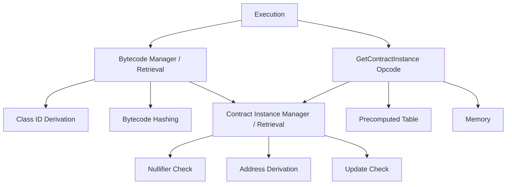

# GetContractInstance Opcode Design Document

## Overview

The `GetContractInstance` opcode allows contracts to query whether a contract instance exists at a given address and retrieve specific members from that instance. Its core operation is to retrieve a specified contract instance and write the selected instance member to memory.

This implementation introduces two new C++ simulation components to the AVM: a `GetContractInstance` opcode component and a shared `ContractInstanceManager` component for contract instance retrieval. Each component corresponds to a PIL gadget that it generates events for `get_contract_instance.pil` and `contract_instance_retrieval.pil` respectively.

The core contract instance retrieval operation is a nullifier existence check, address derivation, and an update check. This retrieval is performed today by the `BytecodeManager` (and its `bc_retrieval.pil`) inline. Since this document proposes a new dedicated component for contract instance retrieval, the existing `BytecodeManager` simulation component can be modified (and simplified) to use this new `ContractInstanceManager`. Likewise, `bc_retrieval.pil` can be simplified via a consolidated interaction with `contract_instance_retrieval.pil`.

## Architecture

### Architectural Overview

The `GetContractInstance` implementation introduces a layered architecture that promotes code reuse and clear separation of concerns:

#### New Components

1. **`GetContractInstance` Opcode Component** (`get_contract_instance.cpp` / `get_contract_instance.pil`)
    - **NEW OPCODE COMPONENT**: Main entry point for the `GETCONTRACTINSTANCE` instruction
    - Validates inputs (bounds checking, member enum validation)
    - Orchestrates contract instance retrieval via the shared manager
    - Writes results to memory with proper tagging
    - Handles opcode-specific error conditions

2. **`ContractInstanceManager` / `ContractInstanceRetrieval`** (`contract_instance_manager.cpp` / `contract_instance_retrieval.pil`)
    - **NEW SHARED COMPONENT**: Centralizes contract instance retrieval logic
    - Performs core validation: nullifier checking, address derivation, update validation
    - Provides caching to avoid duplicate lookups within the same execution context
    - Used by both `GetContractInstance` opcode and bytecode retrieval system
    - Emits events for PIL trace generation

#### Modified Components

1. **`BytecodeManager` / `BytecodeRetrieval`** (`bytecode_manager.cpp` / `bc_retrieval.pil`)
    - **SIMPLIFIED**: No longer directly interacts with nullifier checking, address derivation, or update validation
    - Now delegates contract instance validation to the shared `ContractInstanceManager`
    - Still performs other bytecode-related concerns (class ID derivation, bytecode hashing)
    - Simplified in both simulation and PIL

2. **Precomputed Tables** (`precomputed_trace.cpp` / `precomputed.pil`)
    - **EXTENDED**: New table for `GetContractInstance`
    - Enables member enum validation and decomposition into boolean flags
    - Follows existing patterns used by other opcodes (e.g., `GetEnvVar`)

#### Relevant Unchanged Components

This section lists a few components that are unchanged here, but are referenced in this document.

**Used by opcode component and gadget**:
    - **Memory**: Used by the memory-aware opcode component to write the opcode results to memory.
        - _Note_: this opcode relies on `Execution` to perform address resolution, tag checking and memory reads.
**Used during core contract instance retrieval**:
    - **Nullifier Check**: Validates deployment nullifier existence. Used during contract instance retrieval.
    - **Address Derivation**: Ensures contract addresses match their constituent parts.
    - **Update Check**: Validates contract class ID updates

### Why a Shared Core Component for Contract Instance Retrieval?

Why make the choice to have a single core component for contract instance retrieval for use by bytecode retrieval and by the `GetContractInstance` opcode? The primary motivation is to simplify the bytecode retrieval and `GetContractInstance` opcode components so that they do not need to directly interact with Nullifier Checking, Address Derivation, and Update checking themselves. This simplification also reduces column count because we don't need to duplicate all of the columns for interacting with these inner components, especially address derivation which has a wide interface. At first, we thought we'd be able to de-duplicate contract instance retrievals, but that proved to be less useful than we originally envisioned because de-duplication would depend on the current nullifier tree root and public data tree root. See [Appendix A - Deduplication of Bytecode and Contract Instance Retrievals](#appendix-a---deduplication-of-bytecode-and-contract-instance-retrievals) for more information on de-duplication.

### Component Interaction Diagram



## Opcode Interface and Errors

```
GETCONTRACTINSTANCE addressOffset, dstOffset, memberEnum
```

**Parameters:**
- `addressOffset`: Memory offset containing the contract address to query (must be tagged FF)
- `dstOffset`: Memory offset where results will be written
- `memberEnum`: Enum value specifying which instance member to retrieve:
  - 0 = DEPLOYER
  - 1 = CLASS_ID
  - 2 = INIT_HASH

**Memory Operations:**
- `M[addressOffset]`: Input contract address (FF) - Read and tag-checking performed by **execution**!
- `M[dstOffset]`: Output existence flag (U1) - Write and tag-assignment performed by opcode component and gadget
- `M[dstOffset+1]`: Output member value (FF) - Write and tag-assignment performed by opcode component and gadget

**Errors:**
1. **Out of bounds write**: `dstOffset == 2^32 - 1` implies that a write to `dstOffset+1` is out-of-bounds
2. **Invalid member enum**: `memberEnum > 2`

## Supporting Types

```cpp
struct ContractInstance {
    FF salt;
    AztecAddress deployer_addr;
    ContractClassId current_class_id;
    ContractClassId original_class_id;
    FF initialisation_hash;
    PublicKeys public_keys;
};

enum class ContractInstanceMember {
    DEPLOYER = 0,
    CLASS_ID = 1,
    INIT_HASH = 2,
    MAX = INIT_HASH,
};
```

## Component Design

### GetContractInstance Opcode Component

#### Overview
The main opcode component that handles the `GETCONTRACTINSTANCE` instruction. It validates inputs, handles errors, retrieves contract instance data via the shared core retrieval component, and writes results to memory.

#### Simulation Interface
```cpp
class GetContractInstanceInterface {
public:
    virtual ~GetContractInstanceInterface() = default;
    virtual void get_contract_instance(
        MemoryInterface& memory,
        AztecAddress contract_address,
        MemoryAddress dst_offset,
        uint8_t member_enum
    ) = 0;
};

struct GetContractInstanceEvent {
    // Interface
    uint32_t execution_clk;
    AztecAddress contract_address;
    MemoryAddress dst_offset;
    uint8_t member_enum;
    uint32_t space_id;
    FF nullifier_tree_root;
    FF public_data_tree_root;

    // Instance retrieval results
    bool instance_exists;
    FF retrieved_deployer_addr;
    FF retrieved_class_id;
    FF retrieved_init_hash;
};
```

#### PIL Interface
- **Used by:** `execution.pil` (opcode dispatch)
- **Uses:** `contract_instance_retrieval.pil`,  precomputed table, memory

**Usage:**
```
sel_execute_get_contract_instance {
    // inputs
    precomputed.clk,
    register[0],
    rop[1],
    rop[2],
    context_id,
    context_stack.nullifier_tree_root,
    context_stack.public_data_tree_root,
    // outputs/errors
    sel_opcode_error
} is get_contract_instance.sel {
    // inputs
    get_contract_instance.clk,
    get_contract_instance.contract_address,
    get_contract_instance.dst_offset,
    get_contract_instance.member_enum,
    get_contract_instance.space_id,
    get_contract_instance.nullifier_tree_root,
    get_contract_instance.public_data_tree_root,
    // outputs/errors
    get_contract_instance.error
};
```

#### Implementation
**Simulation (`get_contract_instance.cpp`):**
1. Validates bounds (`dst_offset + 1` must not exceed `AVM_HIGHEST_MEM_ADDRESS`)
2. Validates member enum (`enum < MAX`)
3. Calls `ContractInstanceManager` for instance retrieval
4. Extracts requested member based on enum (`deployer/class_id/init_hash`)
5. Writes exists flag (`U1`) and member value (`FF`) to memory
6. `GetContractInstanceEvent` emission for trace generation of `get_contract_instance.pil`

_Note_: reading of contract address from memory (along with address resolution and tag checking) is performed by execution.

**PIL (`get_contract_instance.pil`) constraints:**
1. Bounds checking: `dst_offset + 1 < 2^32`
2. Member enum validation and decomposition via precomputed table lookup
3. Aggregation of errors into a single selector to return to execution and drive `sel_opcode_error`
4. Writes exists flag (`U1`) and member value (`FF`) to memory
5. Instance retrieval lookup to `contract_instance_retrieval` gadget

### Core Component - ContractInstanceManager (for Contract Instance Retrieval)

#### Overview
Central component for contract instance retrieval, shared between `GetContractInstance` opcode and bytecode retrieval. Handles nullifier checking, address validation, and contract update verification.

#### Simulation Interface
```cpp
class ContractInstanceManagerInterface {
public:
    virtual ~ContractInstanceManagerInterface() = default;
    virtual std::optional<ContractInstance> get_contract_instance(
        const FF& contract_address
    ) = 0;
};

struct ContractInstanceRetrievalEvent {
    AztecAddress address;
    ContractInstance contract_instance;

    // Tree context
    FF nullifier_tree_root;
    FF public_data_tree_root;

    // Nullifier info
    FF deployment_nullifier;
    bool nullifier_exists;
    AztecAddress deployer_protocol_contract_address;

    bool error;
};
```

#### PIL Interface
- **Used by:** `get_contract_instance.pil`, `bc_retrieval.pil`
- **Uses:** `nullifier_check`, `address_derivation`, `update_check`

**Usage:**
```pil
sel {
     // inputs
     execution_or_bc_retrieval.address,
     execution_or_bc_retrieval.nullifier_tree_root,
     execution_or_bc_retrieval.public_data_tree_root,
     // outputs
     execution_or_bc_retrieval.exists,
     execution_or_bc_retrieval.deployer_addr, // situational
     execution_or_bc_retrieval.current_class_id,
     execution_or_bc_retrieval.init_hash // situational
 } in contract_instance_retrieval.sel {
     // inputs
     contract_instance_retrieval.address,
     contract_instance_retrieval.nullifier_tree_root,
     contract_instance_retrieval.public_data_tree_root,
     // outputs
     contract_instance_retrieval.exists,
     contract_instance_retrieval.deployer_addr, // situational
     contract_instance_retrieval.current_class_id,
     contract_instance_retrieval.init_hash // situational
 };
```

**NOTE:** bytecode instance retrieval does not need to use `deployer_addr` and `init_hash` in its lookup to contract instance retrieval. It is enough that internally contract instance retrieval enforces that its instance member columns can be used to derive the provided address. Bytecode retrieval does not actually use those members in any of its own constraints.

#### Implementation
**Simulation (`contract_instance_manager.cpp`):**
1. Nullifier existence checking via `merkle_db`
2. Contract instance retrieval from `contract_db`
3. Update validation via `UpdateCheck` component
4. `ContractInstanceRetrievalEvent` emission for trace generation of `contract_instance_retrieval.pil`

**PIL (`contract_instance_retrieval.pil`):**
1. Retrieval: Given a contract address and context, returns contract instance data and existence flag
2. Nullifier check: Validates deployment nullifier exists
3. Address derivation: Ensures address matches its components
4. Update check: Validates current class ID is valid
5. No errors: This gadget does not have any errors

### Precomputed Table Component

#### Overview
For member enum validation and decomposition to boolean flags.

#### Table Structure
| member_enum | is_valid_member_enum | is_deployer | is_class_id | is_init_hash |
|-------------|---------------------|-------------|-------------|--------------|
| 0           | 1                   | 1           | 0           | 0            |
| 1           | 1                   | 0           | 1           | 0            |
| 2           | 1                   | 0           | 0           | 1            |
| 3-255       | 0                   | 0           | 0           | 0            |

#### PIL Interface
**Used by:** `get_contract_instance.pil`

```pil
// Input
/*clk=*/ member_enum,
// Outputs
is_valid_member_enum,
is_deployer,
is_class_id,
is_init_hash
```

#### Implementation
Similar to `PhaseTable` and `GetEnvVarSpec`, tracegen can reuse a single spec here for the precomputed table and the `GetContractInstance` tracegen.

## Pre-existing components

### Bytecode Manager (for Bytecode Retrieval)
**MODIFIED!** This component no longer interacts with address derivation, nullifier checking and update checking itself, and instead just interacts with the `ContractInstanceManager` (or `contract_instance_retrieval.pil` in PIL).

#### PIL Interface
**Used here by:** `execution.pil`
**Uses:** `contract_instance_retrieval.pil` and `class_id_derivation.pil` (previously used `address_derivation.pil`, `nullifier_check.pil`, `update_check.pil`)

```pil
sel {
    bytecode_id, contract_address, sel_bytecode_retrieval_failure
} in bc_retrieval.sel {
    bc_retrieval.bytecode_id, bc_retrieval.address, bc_retrieval.error
};
```

### Memory
**NOT NEW!** Just here for reference.

#### PIL Interface
**Used here by:** `get_contract_instance.pil`

```pil
clk,                       // Input: execution clock
address,                   // Input: memory address
value,                     // Input/Output: memory value
tag,                       // Input: value tag (U1, FF, etc.)
rw,                        // Input: read(0) or write(1)
space_id                   // Input: memory space identifier
```

### Nullifier Check
**NOT NEW!** Just here for reference.

#### PIL Interface
**Used here by:** `contract_instance_retrieval.pil` (previously by `bc_retrieval.pil`)

```pil
exists,                    // Output: whether nullifier exists
nullifier,                 // Input: nullifier value to check (contract address in our case)
root,                      // Input: nullifier tree root
address,                   // Input: contract address for siloing
should_silo                // Input: whether to silo the nullifier
```

### Address Derivation Component
**NOT NEW!** Just here for reference.

#### PIL Interface
**Used by:** `contract_instance_retrieval.pil` (previously by `bc_retrieval.pil`)

```pil
address,
salt, // HINTED
deployer_addr,
class_id,
init_hash,
nullifier_key_x,
nullifier_key_y,
// other inputs...
```

### Update Check Component
**NOT NEW!** Just here for reference.

#### PIL Interface
**Used by:** `contract_instance_retrieval.pil` (previously by `bc_retrieval.pil`)

```pil
address,
current_class_id,
original_class_id,
public_data_tree_root,
timestamp
```

## Alternative Approaches

We can consider _not_ having a core component for contract instance retrieval, and instead repeat its component interactions (to address derivation, nullifier checking, and update checking) in both bytecode retrieval and the `GetContractInstance` opcode. This removes one level of indirection, but increases the responsibilities of bytecode retrieval and of the `GetContractInstance` opcode components. It certainly reduces readability of those components, especially because of the many extra columns needed for address derivation.


## Appendix A - Deduplication of Bytecode and Contract Instance Retrievals

Today, the Bytecode Manager deduplicates retrievals based solely on contract address. This means that if a contract is invoked multiple times (via enqueued or nested calls) bytecode retrieval is performed once and generates only an event for the first retrieval.

This works in simulation, but creates a problem in circuit land. The issue is that **nullifier checks and update checks rely on the *current* tree roots**. The PIL interface to bytecode retrieval today omits tree roots, but it must be modified to include the nullifier and public data tree roots to forward to nullifier and update checking. Specifically, both the **Bytecode Retrieval Gadget** and the newly proposed **Contract Instance Retrieval Gadget** must include the **Nullifier Tree Root** and **Public Data Tree Root** as part of their interface.

In other words, when performing a lookup, the input tuple must include the current tree roots. The execution trace must provide those roots in its lookup tuple to bytecode retrieval. The first time a bytecode retrieval is performed for a given contract address, this should be fine. But in subsequent interactions from execution, the roots may have changed. Execution will provide latest tree roots in the lookup tuple to bytecode retrieval, but (today) the bytecode retrieval trace will only include the first retrieval for that address with old roots because simulation only emitted one event for the very first retrieval of that bytecode.

So, our current deduplication scheme is broken for bytecode retrieval.

### **Options**

We see two viable paths forward:

1. **Option 1: Always use “start” roots from public inputs**
   Always perform bytecode and contract instance retrievals using the **AVM’s PI start roots**. This would introduce ugliness in simulation and PIL, but would accomplish deduplication.

2. **Option 2: Stop deduplicating at the “Manager/Retrieval” level**
   Stop deduplicating bytecode and contract instance retrievals. Instead, rely on deduplication within the stateless inner gadgets (address derivation, bytecode hashing, and class ID derivation). I believe this is where we get the most gains for deduplication anyway\!
