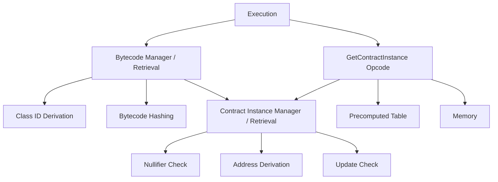

# GetContractInstance Opcode Design Document

## Overview

The `GetContractInstance` opcode allows contracts to query whether a contract instance exists at a given address and retrieve specific members from that instance. Its core operation is to retrieve a specified contract instance and write the selected instance member to memory.

This implementation introduces two new C++ simulation components to the AVM: a `GetContractInstance` opcode component and a shared `ContractInstanceManager` component for contract instance retrieval. Each component corresponds to a PIL gadget that it generates events for `get_contract_instance.pil` and `contract_instance_retrieval.pil` respectively.

The core contract instance retrieval operation is a nullifier existence check, address derivation, and an update check. This retrieval is performed today by the `BytecodeManager` (and its `bc_retrieval.pil`) inline. Since this document proposes a new dedicated component for contract instance retrieval, the existing `BytecodeManager` simulation component can be modified (and simplified) to use this new `ContractInstanceManager`. Likewise, `bc_retrieval.pil` can be simplified via a consolidated interaction with `contract_instance_retrieval.pil`.

## Architecture

### Architectural Overview

The `GetContractInstance` implementation introduces a layered architecture that promotes code reuse and clear separation of concerns:

#### New Components

1. **`GetContractInstance` Opcode Component** (`get_contract_instance.cpp` / `get_contract_instance.pil`)
    - **NEW OPCODE COMPONENT**: Main entry point for the `GETCONTRACTINSTANCE` instruction
    - Validates inputs (bounds checking, member enum validation)
    - Orchestrates contract instance retrieval via the shared manager
    - Writes results to memory with proper tagging
    - Handles opcode-specific error conditions

2. **`ContractInstanceManager` / `ContractInstanceRetrieval`** (`contract_instance_manager.cpp` / `contract_instance_retrieval.pil`)
    - **NEW SHARED COMPONENT**: Centralizes contract instance retrieval logic
    - Performs core validation: nullifier checking, address derivation, update validation
    - Provides caching to avoid duplicate lookups within the same execution context
    - Used by both `GetContractInstance` opcode and bytecode retrieval system
    - Emits events for PIL trace generation

#### Modified Components

1. **`BytecodeManager` / `BytecodeRetrieval`** (`bytecode_manager.cpp` / `bc_retrieval.pil`)
    - **SIMPLIFIED**: No longer directly interacts with nullifier checking, address derivation, or update validation
    - Now delegates contract instance validation to the shared `ContractInstanceManager`
    - Still performs other bytecode-related concerns (class ID derivation, bytecode hashing)
    - Simplified in both simulation and PIL

2. **Precomputed Tables** (`precomputed_trace.cpp` / `precomputed.pil`)
    - **EXTENDED**: New table for `GetContractInstance`
    - Enables member enum validation and decomposition into boolean flags
    - Follows existing patterns used by other opcodes (e.g., `GetEnvVar`)

#### Relevant Unchanged Components

This section lists a few components that are unchanged here, but are referenced in this document.

**Used by opcode component and gadget**:
    - **Memory**: Used by the memory-aware opcode component to write the opcode results to memory.
        - _Note_: this opcode relies on `Execution` to perform address resolution, tag checking and memory reads.
**Used during core contract instance retrieval**:
    - **Nullifier Check**: Validates deployment nullifier existence. Used during contract instance retrieval.
    - **Address Derivation**: Ensures contract addresses match their constituent parts. 
    - **Update Check**: Validates contract class ID updates

### Why a Shared Core Component for Contract Instance Retrieval?

Why make the choice to have a single core component for contract instance retrieval for use by bytecode retrieval and by the `GetContractInstance` opcode? The two primary reasons are:
1. To simplify the bytecode retrieval and `GetContractInstance` opcode components so that they do not need to directly interact with Nullifier Checking, Address Derivation, and Update checking themselves.
2. To de-duplicate contract instance retrievals. An important caveat here is that de-duplication will depend on the nullifier tree root and public data tree root.
    - **TODO:** Deduplicating based on contract address in simulation does not work if we need to generate unique events for the same address if tree roots have changed. Needs more thinking.

### Component Interaction Diagram


```mermaid
graph TD

%% Entry point
Execution --> BytecodeManagerRetrieval
Execution --> GetContractInstanceOpcode

%% Bytecode Manager / Retrieval paths
BytecodeManagerRetrieval --> ClassIDDerivation
BytecodeManagerRetrieval --> BytecodeHashing
BytecodeManagerRetrieval --> ContractInstanceManager

%% GetContractInstanceOpcode paths
GetContractInstanceOpcode --> PrecomputedTable
GetContractInstanceOpcode --> Memory
GetContractInstanceOpcode --> ContractInstanceManager

%% Contract Instance Manager paths
ContractInstanceManager --> NullifierCheck
ContractInstanceManager --> AddressDerivation
ContractInstanceManager --> UpdateCheck

%% Node labels
Execution["Execution"]
BytecodeManagerRetrieval["Bytecode Manager / Retrieval"]
GetContractInstanceOpcode["GetContractInstance Opcode"]
ClassIDDerivation["Class ID Derivation"]
BytecodeHashing["Bytecode Hashing"]
ContractInstanceManager["Contract Instance Manager / Retrieval"]
PrecomputedTable["Precomputed Table"]
Memory["Memory"]
NullifierCheck["Nullifier Check"]
AddressDerivation["Address Derivation"]
UpdateCheck["Update Check"]
```

## Opcode Interface and Errors

```
GETCONTRACTINSTANCE addressOffset, dstOffset, memberEnum
```

**Parameters:**
- `addressOffset`: Memory offset containing the contract address to query (must be tagged FF)
- `dstOffset`: Memory offset where results will be written
- `memberEnum`: Enum value specifying which instance member to retrieve:
  - 0 = DEPLOYER
  - 1 = CLASS_ID
  - 2 = INIT_HASH

**Memory Operations:**
- `M[addressOffset]`: Input contract address (FF) - Read and tag-checking performed by **execution**!
- `M[dstOffset]`: Output existence flag (U1) - Write and tag-assignment performed by opcode component and gadget
- `M[dstOffset+1]`: Output member value (FF) - Write and tag-assignment performed by opcode component and gadget

**Errors:**
1. **Out of bounds write**: `dstOffset == 2^32 - 1` implies that a write to `dstOffset+1` is out-of-bounds
2. **Invalid member enum**: `memberEnum > 2`

## Component Design

### GetContractInstance Opcode Component

#### Overview
The main opcode component that handles the `GETCONTRACTINSTANCE` instruction. It validates inputs, handles errors, retrieves contract instance data via the shared core retrieval component, and writes results to memory.

#### Simulation Interface
```cpp
class GetContractInstanceInterface {
public:
    virtual void get_contract_instance(
        MemoryInterface& memory,
        AztecAddress contract_address,
        MemoryAddress dst_offset,
        uint8_t member_enum
    ) = 0;
};

struct GetContractInstanceEvent {
    uint32_t execution_clk;
    uint32_t timestamp;
    AztecAddress contract_address;
    MemoryAddress dst_offset;
    uint8_t member_enum;
    uint32_t space_id;

    // Validation flags
    bool dst_out_of_bounds;
    bool member_enum_error;

    // Instance data
    bool instance_exists;
    FF retrieved_deployer_addr;
    FF retrieved_class_id;
    FF retrieved_init_hash;
    FF selected_member;
};
```

#### PIL Interface
- **Used by:** `execution.pil` (opcode dispatch)
- **Uses:** `contract_instance_retrieval.pil`,  precomputed table, memory

**Usage:**
```
sel_get_contract_instance {
    // inputs
    precomputed.clk,
    /*contract_address=*/ register[0],
    /*dst_offset=*/ rop[1], // TODO(dbanks12): how do we ensure that address resolution happens for dst?
    /*member_enum=*/ rop[2],
    /*space_id=*/ context_id,
    // outputs/errors
    sel_opcode_error
} is get_contract_instance.sel {
    // inputs
    get_contract_instance.clk,
    get_contract_instance.contract_address,
    get_contract_instance.dst_offset,
    get_contract_instance.member_enum,
    get_contract_instance.space_id,
    // outputs/errors
    get_contract_instance.error
};
```

#### Implementation
**Simulation (`get_contract_instance.cpp`):**
1. Validates bounds (`dst_offset + 1` must not exceed `AVM_HIGHEST_MEM_ADDRESS`)
2. Validates member enum (`enum < MAX`)
4. Calls `ContractInstanceManager` for instance retrieval
5. Extracts requested member based on enum (`deployer/class_id/init_hash`)
6. Writes exists flag (`U1`) and member value (`FF`) to memory
7. `GetContractInstanceEvent` emission for trace generation of `get_contract_instance.pil`

_Note_: reading of contract address from memory (along with address resolution and tag checking) is performed by execution.

**PIL (`get_contract_instance.pil`) constraints:**
1. Bounds checking: `dst_offset + 1 < 2^32`
2. Member enum validation and decomposition via precomputed table lookup
3. Aggregation of errors into a single selector to return to execution and drive `sel_opcode_error`
4. Writes exists flag (`U1`) and member value (`FF`) to memory
5. Instance retrieval lookup to `contract_instance_retrieval` gadget

### Core Component - ContractInstanceManager (for Contract Instance Retrieval)

#### Overview
Central component for contract instance retrieval, shared between `GetContractInstance` opcode and bytecode retrieval. Handles nullifier checking, address validation, and contract update verification.

#### Simulation Interface
```cpp
class ContractInstanceManagerInterface {
public:
    virtual std::optional<ContractInstance> get_contract_instance(
        const FF& contract_address
    ) = 0;
};

struct ContractInstanceRetrievalEvent {
    AztecAddress address;
    ContractInstance contract_instance;
    FF nullifier_tree_root;
    FF public_data_tree_root;
    uint64_t timestamp;
    FF deployment_nullifier;
    bool nullifier_exists;
    AztecAddress deployer_protocol_contract_address;
    bool error;
};
```

#### PIL Interface
- **Used by:** `get_contract_instance.pil`, `bc_retrieval.pil`
- **Uses:** `nullifier_check`, `address_derivation`, `update_check`

**Usage:**
```pil
sel {
     // inputs
     execution_or_bc_retrieval.address,
     execution_or_bc_retrieval.timestamp
     execution_or_bc_retrieval.public_data_tree_root
     execution_or_bc_retrieval.nullifier_tree_root,
     // outputs
     execution_or_bc_retrieval.exists
     execution_or_bc_retrieval.deployer_address,
     execution_or_bc_retrieval.current_class_id,
     execution_or_bc_retrieval.init_hash
 } in contract_instance_retrieval.sel {
     // inputs
     contract_instance_retrieval.address,
     contract_instance_retrieval.timestamp,
     contract_instance_retrieval.public_data_tree_root,
     contract_instance_retrieval.nullifier_tree_root,
     // outputs
     contract_instance_retrieval.exists,
     contract_instance_retrieval.deployer_address,
     contract_instance_retrieval.current_class_id,
     contract_instance_retrieval.init_hash
 };
```

#### Implementation
**Simulation (`contract_instance_manager.cpp`):**
1. Caches instance retrievals via `retrieved_addresses` map (**TODO**: might not work)
2. Nullifier existence checking via `merkle_db`
3. Contract instance retrieval from `contract_db`
4. Update validation via `UpdateCheck` component
5. `ContractInstanceRetrievalEvent` emission for trace generation of `contract_instance_retrieval.pil`

**PIL (`contract_instance_retrieval.pil`):**
1. Retrieval: Given a contract address and context, returns contract instance data and existence flag
2. Nullifier check: Validates deployment nullifier exists
3. Address derivation: Ensures address matches its components
4. Update check: Validates current class ID is valid
5. No errors: This gadget does not have any errors

### Precomputed Table Component

#### Overview
For member enum validation and decomposition to boolean flags.

#### Table Structure
| member_enum | is_valid_member_enum | is_deployer | is_class_id | is_init_hash |
|-------------|---------------------|-------------|-------------|--------------|
| 0           | 1                   | 1           | 0           | 0            |
| 1           | 1                   | 0           | 1           | 0            |
| 2           | 1                   | 0           | 0           | 1            |
| 3-255       | 0                   | 0           | 0           | 0            |

#### PIL Interface
**Used by:** `get_contract_instance.pil`

```pil
// Input
/*clk=*/ member_enum,
// Outputs
is_valid_member_enum,
is_deployer,
is_class_id,
is_init_hash
```

#### Implementation
Similar to `PhaseTable` and `GetEnvVarSpec`, tracegen can reuse a single spec here for the precomputed table and the `GetContractInstance` tracegen.

## Pre-existing components

### Bytecode Manager (for Bytecode Retrieval)
**MODIFIED!** This component no longer interacts with address derivation, nullifier checking and update checking itself, and instead just interacts with the `ContractInstanceManager` (or `contract_instance_retrieval.pil` in PIL).

#### PIL Interface
**Used here by:** `execution.pil`
**Uses:** `contract_instance_retrieval.pil` and `class_id_derivation.pil` (previously used `address_derivation.pil`, `nullifier_check.pil`, `update_check.pil`)

```pil
sel {
    bytecode_id, contract_address, sel_bytecode_retrieval_failure
} in bc_retrieval.sel {
    bc_retrieval.bytecode_id, bc_retrieval.address, bc_retrieval.error
};
```

### Memory
**NOT NEW!** Just here for reference.

#### PIL Interface
**Used here by:** `get_contract_instance.pil`

```pil
clk,                       // Input: execution clock
address,                   // Input: memory address
value,                     // Input/Output: memory value
tag,                       // Input: value tag (U1, FF, etc.)
rw,                        // Input: read(0) or write(1)
space_id                   // Input: memory space identifier
```

### Nullifier Check
**NOT NEW!** Just here for reference.

#### PIL Interface
**Used here by:** `contract_instance_retrieval.pil` (previously by `bc_retrieval.pil`)

```pil
exists,                    // Output: whether nullifier exists
nullifier,                 // Input: nullifier value to check (contract address in our case)
root,                      // Input: nullifier tree root
address,                   // Input: contract address for siloing
should_silo                // Input: whether to silo the nullifier
```

### Address Derivation Component
**NOT NEW!** Just here for reference.

#### PIL Interface
**Used by:** `contract_instance_retrieval.pil` (previously by `bc_retrieval.pil`)

```pil
address,
salt, // HINTED
deployer_addr,
class_id,
init_hash,
nullifier_key_x,
nullifier_key_y,
// other inputs...
```

### Update Check Component
**NOT NEW!** Just here for reference.

#### PIL Interface
**Used by:** `contract_instance_retrieval.pil` (previously by `bc_retrieval.pil`)

```pil
address,
current_class_id,
original_class_id,
public_data_tree_root,
timestamp
```

## Alternative Approaches

We can consider _not_ having a core component for contract instance retrieval, and instead repeat its component interactions (to address derivation, nullifier checking, and update checking) in both bytecode retrieval and the `GetContractInstance` opcode. This removes one level of indirection, but increases the responsibilities of bytecode retrieval and of the `GetContractInstance` opcode components. It certainly reduces readability of those components, especially because of the many extra columns needed for address derivation.

