# Witness duplicate detection

This document describes the witness duplicate detection mechanism in
`boomerang_value_detection`.

The analyzer flags witness values that repeat without a circuit-level reason. It
collects every repeated value, removes the ones that a known relation explains,
and reports whatever survives. Most of that work happens in the
[candidate filtering pipeline](#candidate-filtering-pipeline). Two terms recur
throughout:

- **Provenance** is a structured tag a producer attaches to a derived witness at
  construction time, identifying what produced the witness so the analyzer can
  group witnesses that constraints genuinely force equal. See
  [Construction-time provenance](#construction-time-provenance).
- **Materialization** is the deterministic placement of a derived value into
  known circuit rows or table slots, such as a Straus table cell or an `ecc_op`
  limb. A duplicate confined to such rows is expected. See
  [Materialization filters](#materialization-filters).

## Contents

- [What the analyzer looks for](#what-the-analyzer-looks-for)
- [Graph model](#graph-model)
- [Candidate filtering pipeline](#candidate-filtering-pipeline)
- [Structural overlays](#structural-overlays)
- [Construction-time provenance](#construction-time-provenance)
- [Provenance soundness rule](#provenance-soundness-rule)
- [Provenance categories](#provenance-categories)
- [Rerun-varying filters](#rerun-varying-filters)
- [Materialization filters](#materialization-filters)
- [Suggested review order](#suggested-review-order)
- [Adding or reviewing a suppression](#adding-or-reviewing-a-suppression)
- [Appendix: how duplicate witnesses arise for each overlay](#appendix-how-duplicate-witnesses-arise-for-each-overlay)

## What the analyzer looks for

The analyzer searches for repeated witness values that the circuit doesn't
explain. A repeated value is suspicious when two real witness variables have the
same assigned field value but aren't forced equal by copy constraints, gate
constraints, table consistency, or a known deterministic materialization rule.

The report is value-first: the analyzer groups real witness indices by
`builder.get_variable(idx)`. The analyzer ignores a value with only one
occurrence. A value with several occurrences stays visible until one of the
explanation mechanisms proves that all occurrences are non-problematic.

The safe default is to report. A duplicate must not be hidden only because its
value resembles a common gadget constant or table output.

## Graph model

The analyzer builds a graph over real witness indices. Edges in the main graph
represent ordinary constraint dependencies: if a gate ties several wires
together, their real witness indices are connected. Copy constraints are already
encoded through `real_variable_index`, so two copy-equal witness indices
collapse to one real index before duplicate detection.

Duplicate suppression also uses duplicate-search overlays. These overlays are
separate from the main graph. They don't change circuit semantics and serve only
to decide whether a repeated value is already explained by a known structural
relation.

A structural overlay suppresses a duplicate value only when all occurrences of
that value are in the same duplicate component. If only some occurrences touch an
overlay, the value remains visible. The analyzer treats a partial explanation as
incomplete evidence.

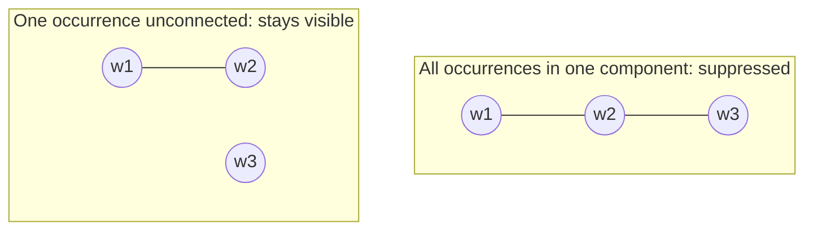

The circles are witnesses holding the same value; the lines are overlay edges.

## Candidate filtering pipeline

`StaticAnalyzer::fill_witness_duplicate_map` applies the following pipeline. Each
stage removes the values it can explain and passes the rest on; whatever survives
is reported.

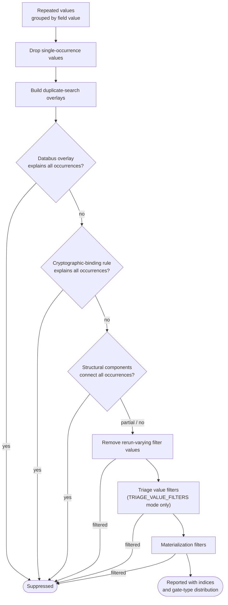

1. Build `filtered_witness_value_map` from witness value to the set of real
   witness indices carrying that value. Candidate construction doesn't drop
   values just because they're common constants, table values, or
   caller-provided mock-proof values.
2. Remove values with a single occurrence.
3. Build duplicate-search overlays for known relations.
4. Remove a value if the databus overlay connects all its occurrences.
5. Remove a value if the narrow cryptographic-binding rule for the batch-merge
   ECC-op hash rehash explains all its occurrences.
6. Remove a value if the combined structural overlay components connect all its
   occurrences.
7. Keep values that only partially intersect the databus, cryptographic-binding,
   or structural overlays.
8. Remove caller-supplied rerun-varying filter values (see
   [Rerun-varying filters](#rerun-varying-filters)). To compute these values,
   the analyzer rebuilds the same circuit shape with randomized inputs and
   compares the original duplicate witness slots against the rerun witness slots.
9. In `TRIAGE_VALUE_FILTERS` mode only, remove common high-volume values and
   caller-provided filter values after source-aware checks. `EXPLANATION_ONLY`
   mode skips this value-only step.
10. Apply narrow materialization filters for MSM, ECC-op, elliptic, modulus
    arithmetic, constants, and fixed witnesses (see
    [Materialization filters](#materialization-filters)).
11. Print any remaining repeated values with their indices and gate-type
    distribution.

The gate-type distribution in the output is intentionally part of triage. A
remaining duplicate in ordinary arithmetic rows is more interesting than one
isolated to expected materialization rows.

## Structural overlays

The overlay set includes these explanation sources:

- ROM/RAM memory table structure
- databus reads
- non-native-field derivations
- arithmetic derivations
- elliptic operation derivations
- ECC-op table structure
- lookup table structure
- Straus table structure
- construction-time duplicate provenance groups
- a cryptographic-binding duplicate explanation for the batch-merge ECC-op hash
  rehash

The layout-based overlays recognize established gate and table layouts. They
stay narrow and source-aware: each one must explain only values whose repeated
occurrences come from the same structural relation. For how each source produces
duplicate witnesses in the first place, see the
[appendix](#appendix-how-duplicate-witnesses-arise-for-each-overlay).

`build_provenance_duplicate_adjacency` produces the construction-time provenance
overlay. It groups real witness indices by provenance key and connects all
indices in each group.

## Construction-time provenance

Some producers have more information than the analyzer can recover from
selectors after the fact. Those producers tag derived witnesses at construction
time using the analyzer-only channel on `CircuitBuilderBase`:

```cpp
std::unordered_map<uint32_t, DuplicateProvenance> witness_duplicate_provenance;
```

You can find producer-side integrations with this search tag:

```text
BOOMERANG_DUPLICATE_PROVENANCE
```

Every piece of code outside `boomerang_value_detection/` that reads, writes,
propagates, or supports this construction-time duplicate provenance channel must
carry that tag near the integration point and point back to this file.

The map key is a real variable index. The value is a structured group key:

```cpp
struct DuplicateProvenance {
    DuplicateProvenanceCategory category;
    std::vector<uint64_t> local_id;
};
```

`category` identifies the producer family. `local_id` is a producer-scoped
sequence of identity words. Build producer-local ids with
`duplicate_provenance_local_id`, `append_duplicate_provenance_identity`, and the
builder-local interned provenance identity helper, so that nested provenance and
raw witness identities encode consistently without recursively expanding large
keys. The builder assigns interned ids by exact `DuplicateProvenance` equality;
the hash table is only an implementation detail for lookup. Use named enums or
constants for producer-local discriminator words, not unexplained literals.

The public API is:

```cpp
static DuplicateProvenance make_duplicate_provenance(DuplicateProvenanceCategory category,
                                                     DuplicateProvenanceLocalId local_id);
static DuplicateProvenance make_duplicate_provenance(DuplicateProvenanceCategory category,
                                                     std::initializer_list<uint64_t> local_id);
static DuplicateProvenance make_duplicate_provenance(DuplicateProvenanceCategory category, uint64_t local_id);
void tag_duplicate_provenance(uint32_t witness_index, const DuplicateProvenance& group_key);
const std::unordered_map<uint32_t, DuplicateProvenance>& get_duplicate_provenance() const;
uint64_t get_duplicate_provenance_id(const DuplicateProvenance& group_key);
DuplicateProvenanceLocalId get_duplicate_provenance_interned_identity(const DuplicateProvenance& group_key);
```

`tag_duplicate_provenance` canonicalizes the witness through
`real_variable_index`. The channel isn't serialized and takes no part in
proving.

`assert_equal` propagates provenance across copy constraints. If the canonical
representative lacks a key and the merged witness has one, `assert_equal` copies
the key to the canonical real index. If both sides have different keys,
`assert_equal` rewrites the old key to the canonical key throughout the map,
because the new copy constraint forces those groups equal.

This normal provenance overlay deliberately excludes
`POSEIDON2_CRYPTOGRAPHIC_BINDING`. That category marks a different kind of
evidence, described in the following section, and the analyzer must not treat it
as constraint-forced equality.

## Provenance soundness rule

A producer can assign the same duplicate provenance group key to two witnesses
only if the circuit constraints force those two witnesses to hold equal values
on every satisfying assignment.

Good local ids are based on witness identity and the deterministic operation
that created the output. Use real variable indices, operation discriminators,
table ids, row or column slots, and fixed-width parameters. Don't base them on
runtime values alone.

Two independently assigned witnesses with equal values must receive different
provenance keys unless a constraint forces them equal.

Prefer under-tagging to over-tagging. Untagged duplicates are noisy. Incorrectly
grouped duplicates can hide real bugs.

## Provenance categories

`BIGFIELD_REDUCTION`

Covers deterministic reduction intermediates:

- double-width limb decomposition outputs
- `self_reduce` quotient and remainder limbs
- `unsafe_evaluate_multiply_add` carry limbs

Keys include an operation discriminator, relevant input limb identities, width
parameters where needed, and an output slot.

`MSM_TABLE`

Covers deterministic group-operation and table materializations:

- `cycle_group` double outputs
- `cycle_group` add/subtract outputs
- Straus ROM table cell coordinates
- Straus ROM read outputs
- Straus plookup read outputs

Keys include operation discriminators, affine field identities, table identity,
selected table slot, and coordinate slot. The x and y coordinates of one point
use distinct coordinate slots.

`POSEIDON2_PERMUTATION`

Covers Poseidon2 round intermediates. The key derives from the identity of the
four input-state elements before the initial linear layer mutates the state,
plus the exact generated-state slot (initial layer, external/internal round, and
state element). Different slots in one permutation use different keys.

`POSEIDON2_CRYPTOGRAPHIC_BINDING`

Covers the single intended Chonk/batch-merge rehash pattern. The hiding kernel
first computes the running ECC-op commitment hash from
`witness_commitments.get_ecc_op_wires()`. The batch-merge recursive verifier
then recomputes the same hash as the transcript challenge `HASH_i` over the
proof-supplied `COLUMN_0_i` through `COLUMN_3_i` commitments.

This category isn't a normal provenance group:
`BatchMergeVerifier::check_hash_consistency` binds the two computations by
comparing the selected transcript hash with `split_challenge(running_hash)[0]`,
and carries the existing 2^-127 collision caveat. The analyzer suppresses
duplicates in this category only when every duplicate occurrence is in the same
cryptographic-binding group and the group contains both roles: `RUNNING_HASH`
and `TRANSCRIPT_HASH`. A same-role duplicate remains visible.

`DATABUS_READ`

Covers fixed-slot databus materializations and variable-index read outputs.
Appended bus entries and constant/fixed-index reads use a `(bus_idx, slot)`
identity. Non-fixed index reads use `(bus_idx, index witness identity)` and
deliberately don't share the source slot key merely because the current index
value selects that slot.

`ECC_OP_TABLE`

Covers the four point limbs materialized into Mega's `ecc_op` block. The key is
based on opcode, per-circuit serialization slot, and limb slot. The analyzer
doesn't tag random ops. The four limbs of one op must not share one key, because
they aren't forced equal to each other.

`LOOKUP_TABLE`

Covers generic lookup accumulator witnesses. Keys include table identity,
one-key or two-key mode, key witness identities, column, and row. If a key
witness already has duplicate provenance, the lookup key identity includes that
key. Distinct key witnesses that merely hold the same field value must not share
a lookup provenance key.

`RANGE_DECOMPOSITION`

Covers limbed range-decomposition outputs. Keys include the input real variable
identity, total bit length, target limb width, and limb slot.

## Rerun-varying filters

Some gadgets, notably AES lookup-heavy circuits, can produce repeated witness
values that are tied to runtime inputs rather than to a fixed reused witness. The
analyzer supports an opt-in rerun filter for these cases:

1. Build the baseline circuit and call `fill_witness_duplicate_map` in
   `EXPLANATION_ONLY` mode.
2. Rebuild the same circuit shape with randomized inputs one or more times.
3. Call `get_rerun_varying_duplicate_values` on the baseline analyzer with the
   rerun builders.
4. Rebuild or re-analyze the baseline circuit with those values passed as
   `rerun_varying_filter_values`.

The comparison is slot-based. For each remaining duplicate value in the baseline
map, the helper checks the same real witness indices in each rerun builder. If
any corresponding rerun witness has a different value, the baseline value counts
as input-dependent and the analyzer can filter it. This catches small values as
well as high-entropy values, because the decision doesn't depend on the numeric
magnitude of the field element.

This isn't a default suppression, by design. Use it for known noisy diagnostics
where the circuit shape is stable across reruns. Don't use it to replace
provenance or structural overlays for a relation that constraints can explain
directly.

## Materialization filters

After structural overlays, the analyzer applies narrow use-site filters. These
remove values only when every occurrence stays within a known non-problematic
materialization pattern:

- `MSM_TABLE` provenance mixed only with memory-only ROM/RAM copies
- every occurrence has `ECC_OP_TABLE` provenance and appears only in `ecc_op`
  plus fixed/modulus or Poseidon materialization rows
- elliptic outputs mixed only with fixed/modulus materialization rows
- fixed witnesses and BN254 modulus-arithmetic rows
- ordinary constants and `fix_witness` rows

These filters check where a witness is used, not just what value it holds. A
provenance category by itself isn't enough to suppress a duplicate; the
occurrences must still be explained by a precise key or component, or by a narrow
use-site pattern.

## Suggested review order

For a human review, the diff is easiest to audit in this order:

1. `duplicate_provenance.hpp` and the `CircuitBuilderBase` API, including
   `assert_equal` propagation.
2. Producer tags, one category at a time: bigfield, databus, Poseidon2, ECC-op,
   MSM/Straus, lookup, and range decomposition.
3. Analyzer consumption in `graph.cpp`: provenance overlay, structural overlays,
   then materialization filters in `fill_witness_duplicate_map`.
4. Focused provenance tests in `graph_description_provenance.test.cpp` and
   producer-specific tests.
5. Slow recursive duplicate tests, which are the integration signal that the
   analyzer considers no remaining duplicate dangerous.

## Adding or reviewing a suppression

When adding a new suppression mechanism, answer these questions:

1. What exact constraint or table relation forces all grouped witnesses equal?
2. Does the grouping key use witness identity rather than runtime value?
3. Which operation, table, row, column, coordinate, or limb slot prevents
   unrelated outputs from sharing a key?
4. Can key construction add gates? If yes, it isn't acceptable.
5. What happens when two distinct witnesses happen to carry the same field
   value?
6. Is partial-overlay contact kept visible?
7. Is there a positive test for the intended suppression and a negative test for
   a same-valued but unrelated duplicate?

If any answer is unclear, keep the duplicate visible.

## Appendix: how duplicate witnesses arise for each overlay

Each structural overlay exists because a specific circuit construct legitimately
produces the same field value on several independent witnesses. Without the
overlay, those witnesses would all surface as unexplained duplicates. The entries
below describe, for each source, how the repeated witnesses are created and what
forces them equal. Every overlay except the last derives its equality from circuit
constraints; the cryptographic-binding overlay is the sole exception.

Every entry shares the same shape: one value the circuit reuses spreads across
several fresh witnesses through a construct, and the overlay reconnects them so
the repeat is explained rather than reported.

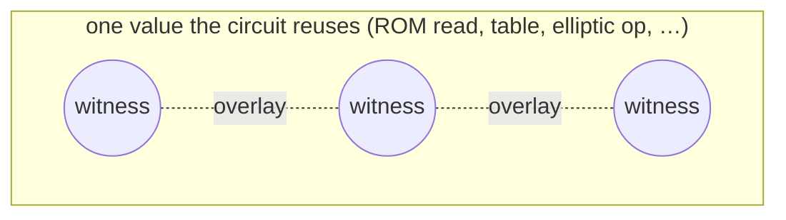

**Reading the diagrams below.** A solid arrow means the circuit writes that
witness. A dotted line is the equality the overlay adds — those witnesses collapse
into one component and the duplicate is suppressed. A red outline marks a witness
that deliberately stays visible, because no constraint forces it equal.

### ROM/RAM memory table structure

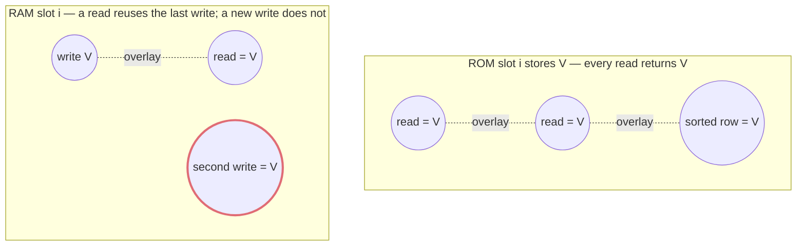

_All reads of a ROM slot, plus its sorted row, hold the stored value and collapse.
In RAM a read can reuse the previous write, but a second independent write of the
same value stays visible (red)._

A ROM or RAM table compiles to read/write gates plus a sorted, finalized copy of
the memory transcript. One stored value therefore appears as several witnesses:
the value written into the slot, each unsorted read output, and the matching
sorted memory row. Every read of the same ROM slot returns the same value, so the
read outputs duplicate each other and the stored value. The memory-consistency
argument — record tags linked through `tau` to the sorted rows — forces them
equal, so the overlay connects the outputs that belong to one table and slot. RAM
is more restrictive: a read may reuse only the value established by the
immediately previous access to that slot. Two writes of the same value stay
independent, and visible, because nothing forces them equal.

### Databus reads

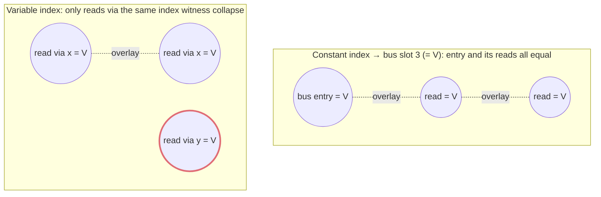

_A fixed index ties the appended entry and all its reads together. With a variable
index, only reads made through the same index witness collapse; a different index
witness that happens to select the same slot stays visible (red)._

On Mega, a databus read gate copies one entry of a bus vector (for example
calldata or return data) into a fresh output witness. Reading a fixed index more
than once, or appending an entry and later reading it, produces several witnesses
that the databus relation forces equal to that bus slot. For a constant index the
overlay connects the appended entry and every read output for that slot. For a
variable index it connects only the reads made through the same index witness;
distinct index witnesses that merely hold the same value stay visible, because
their equality is a runtime coincidence rather than a constraint.

### Non-native-field derivations

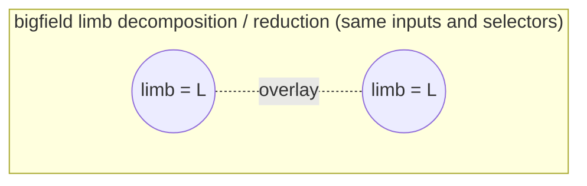

_Deterministic limb and reduction outputs recur across the gate wires; the gate
relation forces the equal wires together._

Non-native (bigfield) arithmetic lowers to prime-limb arithmetic gates and
dedicated non-native-field custom gates that deterministically build limb
decompositions and reduction intermediates. The same limb value recurs across the
wires of these gates. For each such gate the overlay connects the wires carrying
equal values, which the gate's own relation forces equal.

### Arithmetic derivations

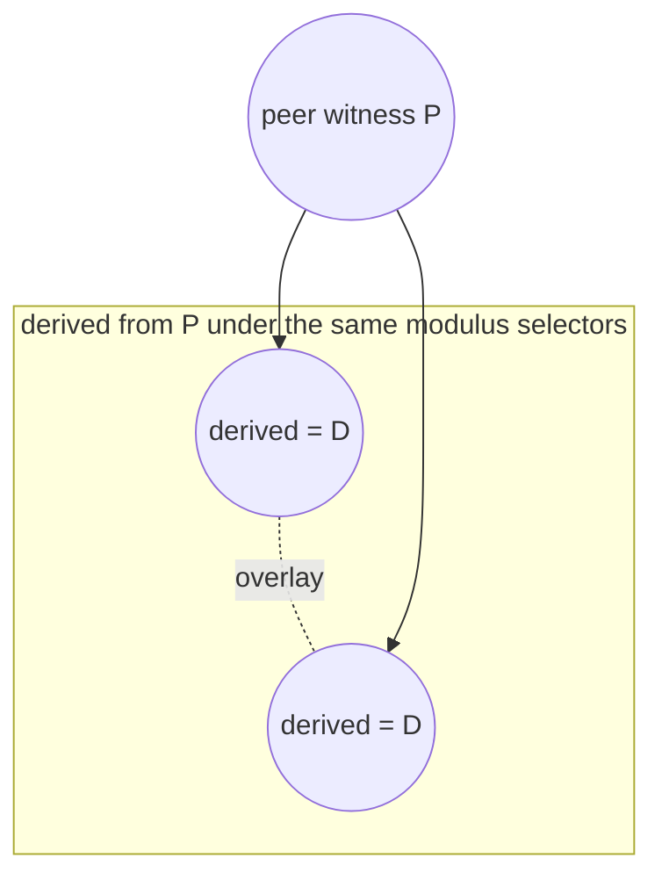

_The same peer and modulus selectors fix the derived value, so it is recomputed
identically. Only the derived witnesses collapse — never the peer._

Some stdlib helpers emit the same derived witness more than once from the same
peer witness under identical BN254 base-field modulus selectors — for example the
multiply-add identity `q_m·peer·derived + q_c = 0`. Because the gate fixes
`derived` deterministically from `peer` and the selectors, repeating the operation
produces duplicate derived witnesses. The overlay connects derived witnesses that
share the same peer and selector signature (both orientations for the commutative
product) and never connects a derived witness to its peer.

### Elliptic operation derivations

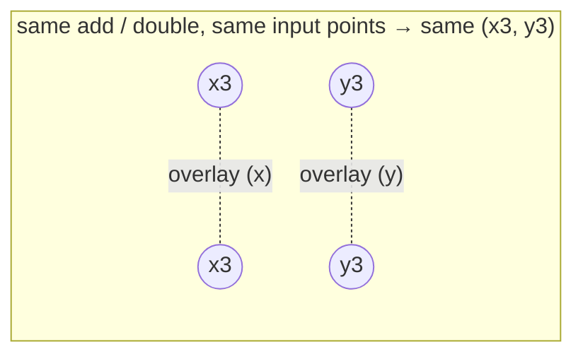

_Repeating the operation reproduces x3 and y3. The x-outputs and y-outputs form
separate components, so an accidental x == y stays visible._

The elliptic gate computes an add or double and writes the output coordinates
`(x3, y3)`. Repeating the same operation with copied input witnesses reproduces
the same outputs, so `x3` and `y3` recur as fresh witnesses. The overlay connects
outputs that share an operation signature — operation type, sign or double flag,
and input coordinate values — and keeps the x-output and y-output components
separate so an accidental `x == y` equality stays visible.

### ECC-op table structure

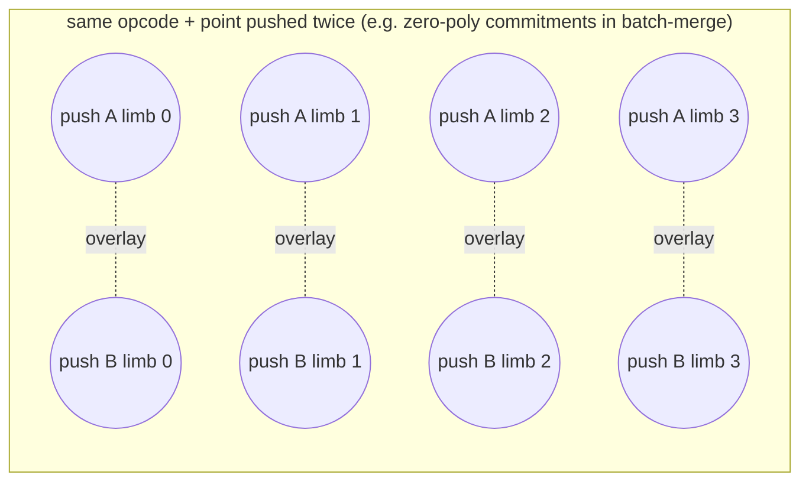

_When the same op and point are pushed twice, their four limbs repeat. Only
corresponding limbs collapse; the four limbs of one op are never joined to each
other._

On Mega, points pushed to the Goblin ECC-op queue are serialized into four limb
witnesses per op in the `ecc_op` block. When the same opcode and point tuple is
pushed more than once, its four limbs repeat. This happens structurally in
batch-merge proofs, where inactive subtable commitments are commitments to the
zero polynomial and so coincide. The overlay connects corresponding limbs only
when the full opcode-and-point tuple repeats and every limb also has a
materialization gate outside the `ecc_op` block. The four limbs of one op are
never connected to each other, because constraints don't force them equal.

### Lookup table structure

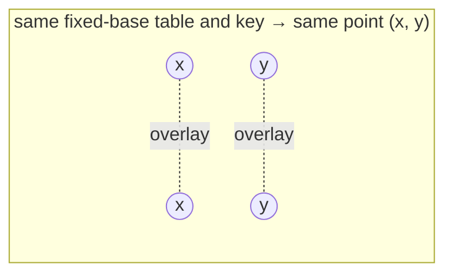

_Re-reading the same table with the same key returns the same point coordinates.
Distinct key witnesses that merely share a value are not collapsed._

`STRAUS_EC_POINT` lookup tables are deterministic fixed-base MSM tables:
re-reading the same table with the same key returns the same point coordinates,
but each read emits fresh output witnesses that otherwise look like unexplained
duplicates. The overlay connects the x-outputs, and separately the y-outputs, of
reads that share a table index and key identity. Distinct key witnesses that
merely hold the same value aren't collapsed.

### Straus table structure

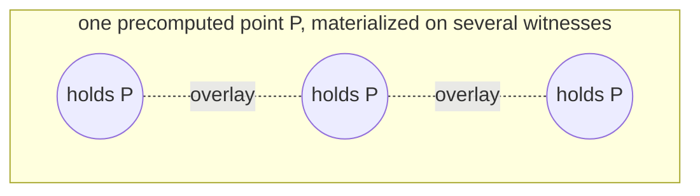

_While the table is built, one point is materialized on several fresh witnesses;
the overlay ties them back to the same point._

Straus MSM helpers build point tables by routing fixed-base lookup outputs and
variable-base addends through ROM and memory rows. While the table is
constructed, the same point coordinate is materialized on several of these fresh
witnesses. The overlay connects the witnesses that the table construction ties to
one point, rather than treating each materialization as an independent duplicate.

### Construction-time duplicate provenance groups

Some producers have information the analyzer can't recover from selectors after
the fact. Those producers tag the witnesses at construction time (see
[Construction-time provenance](#construction-time-provenance)), and this overlay
connects all real indices that share a provenance key.
`POSEIDON2_CRYPTOGRAPHIC_BINDING` is excluded here and handled by the
cryptographic-binding overlay instead.

### Cryptographic-binding rehash

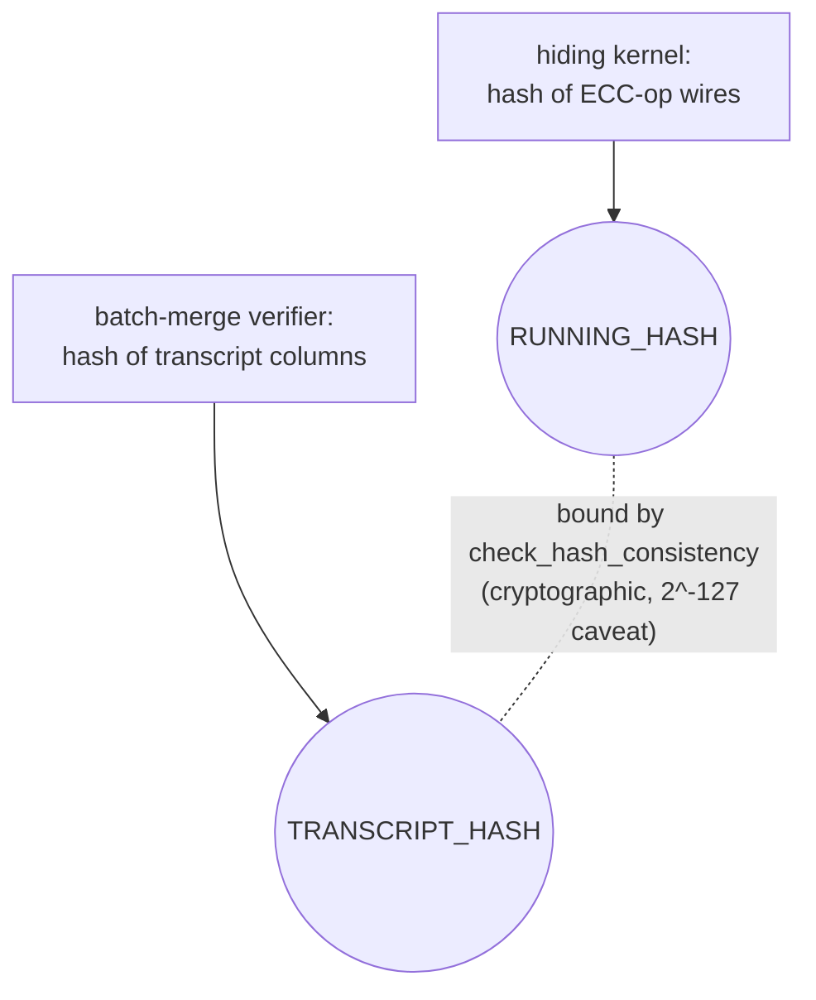

_Two different computations produce the same hash value. The equality is
cryptographic, not constraint-forced, so the duplicate is suppressed only when
both roles are present._

This is the one overlay whose equality comes from a cryptographic argument rather
than circuit constraints. The hiding kernel and the batch-merge recursive verifier
compute the same running ECC-op commitment hash by two different routes, so the
two hash witnesses hold the same value. `BatchMergeVerifier::check_hash_consistency`
binds them, carrying the existing 2^-127 collision caveat. The overlay suppresses
the duplicate only when the group holds both the `RUNNING_HASH` and
`TRANSCRIPT_HASH` roles; a same-role duplicate stays visible. See the
[`POSEIDON2_CRYPTOGRAPHIC_BINDING`](#provenance-categories) category for the full
rule.
