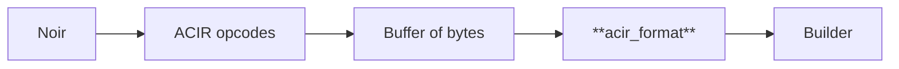

# ACIR format

The code in this folder handles the interaction between Noir and barretenberg. On a high level, we have the following flow of information:

ACIR is the backend agnostic representation used by Noir to encode all the constraints a Noir program represents. It is composed of `opcode`s, which are the building blocks the backend uses to reconstruct the constraints written in Noir. The `opcode`s are the common language shared by Noir and the backend.

From now on, we focus only on the case in which the backend is barretenberg.

## `Opcode`

The following is the list of opcodes (see [`Opcode`](https://github.com/AztecProtocol/aztec-packages/blob/795cd3ae80ba971a6d018b6d31e563c2fec870d3/barretenberg/cpp/src/barretenberg/dsl/acir_format/serde/acir.hpp#L3224)):

- [`AssertZero`](https://github.com/AztecProtocol/aztec-packages/blob/795cd3ae80ba971a6d018b6d31e563c2fec870d3/barretenberg/cpp/src/barretenberg/dsl/acir_format/serde/acir.hpp#L3226)
- [`MemoryInit`](https://github.com/AztecProtocol/aztec-packages/blob/795cd3ae80ba971a6d018b6d31e563c2fec870d3/barretenberg/cpp/src/barretenberg/dsl/acir_format/serde/acir.hpp#L3281)
- [`MemoryOp`](https://github.com/AztecProtocol/aztec-packages/blob/795cd3ae80ba971a6d018b6d31e563c2fec870d3/barretenberg/cpp/src/barretenberg/dsl/acir_format/serde/acir.hpp#L3258)
- [`BrilligCall`](https://github.com/AztecProtocol/aztec-packages/blob/795cd3ae80ba971a6d018b6d31e563c2fec870d3/barretenberg/cpp/src/barretenberg/dsl/acir_format/serde/acir.hpp#L3307)
- [`BlackBoxFuncCall`](https://github.com/AztecProtocol/aztec-packages/blob/795cd3ae80ba971a6d018b6d31e563c2fec870d3/barretenberg/cpp/src/barretenberg/dsl/acir_format/serde/acir.hpp#L3242)

**Note:** There is another opcode: [`Call`](https://github.com/AztecProtocol/aztec-packages/blob/795cd3ae80ba971a6d018b6d31e563c2fec870d3/barretenberg/cpp/src/barretenberg/dsl/acir_format/serde/acir.hpp#L3336), which was meant to be used to expose folding to Noir. We are not supporting this functionality, so barretenberg fails the reconstruction of a serialized Noir program if it encounters a `Call` opcode.

### [`AssertZero`](https://github.com/AztecProtocol/aztec-packages/blob/795cd3ae80ba971a6d018b6d31e563c2fec870d3/barretenberg/cpp/src/barretenberg/dsl/acir_format/serde/acir.hpp#L3226)

[`AssertZero`](https://github.com/AztecProtocol/aztec-packages/blob/795cd3ae80ba971a6d018b6d31e563c2fec870d3/barretenberg/cpp/src/barretenberg/dsl/acir_format/serde/acir.hpp#L3226) opcodes represent expressions of the following form:

$$
\sum_{i, j} c_{i,j} \cdot w_i  w_j + \sum_i c_i \cdot w_i + c = 0
$$

where $w_i, w_j$ are witnesses and $c_{i,j}, c_j, c$ are constants.

### [`MemoryInit`](https://github.com/AztecProtocol/aztec-packages/blob/795cd3ae80ba971a6d018b6d31e563c2fec870d3/barretenberg/cpp/src/barretenberg/dsl/acir_format/serde/acir.hpp#L3281)

[`MemoryInit`](https://github.com/AztecProtocol/aztec-packages/blob/795cd3ae80ba971a6d018b6d31e563c2fec870d3/barretenberg/cpp/src/barretenberg/dsl/acir_format/serde/acir.hpp#L3281) opcodes represent the initialization of a memory table. This can be either a `ROM` table, a `RAM` table, a `Calldata` databus column, or a `Returndata` databus column.

A [`MemoryInit`](https://github.com/AztecProtocol/aztec-packages/blob/795cd3ae80ba971a6d018b6d31e563c2fec870d3/barretenberg/cpp/src/barretenberg/dsl/acir_format/serde/acir.hpp#L3281) opcode contains a list of witness indices representing the indices of the data with which to initialize the table.

### [`MemoryOp`](https://github.com/AztecProtocol/aztec-packages/blob/795cd3ae80ba971a6d018b6d31e563c2fec870d3/barretenberg/cpp/src/barretenberg/dsl/acir_format/serde/acir.hpp#L3258)

[`MemoryOp`](https://github.com/AztecProtocol/aztec-packages/blob/795cd3ae80ba971a6d018b6d31e563c2fec870d3/barretenberg/cpp/src/barretenberg/dsl/acir_format/serde/acir.hpp#L3258) opcodes represent operations on a memory table. `ROM` and `Calldata` tables only support read operations, `RAM` supports both read and write operations, `Returndata` doesn't support any type of operation.

A [`MemoryOp`](https://github.com/AztecProtocol/aztec-packages/blob/795cd3ae80ba971a6d018b6d31e563c2fec870d3/barretenberg/cpp/src/barretenberg/dsl/acir_format/serde/acir.hpp#L3258) opcode contains the type of the operation, the index of the element of the table on which to perform the operation, and the value to be read or written.

**Note:** [`MemoryOp`](https://github.com/AztecProtocol/aztec-packages/blob/795cd3ae80ba971a6d018b6d31e563c2fec870d3/barretenberg/cpp/src/barretenberg/dsl/acir_format/serde/acir.hpp#L3258) use [`Acir::Expression`](https://github.com/AztecProtocol/aztec-packages/blob/795cd3ae80ba971a6d018b6d31e563c2fec870d3/barretenberg/cpp/src/barretenberg/dsl/acir_format/serde/acir.hpp#L2959)s to represent the operation type, the index, and the value. Barretenberg enforces that the expressions encode the data type they are supposed to represent. For example, the type of the operation is supposed to be represented by and expression with no multiplication terms, no linear terms, and with a constant term equal to either one or zero. When converting the expression to a memory operation type, barretenberg asserts that these assumptions are satisfied.

### [`BrilligCall`](https://github.com/AztecProtocol/aztec-packages/blob/795cd3ae80ba971a6d018b6d31e563c2fec870d3/barretenberg/cpp/src/barretenberg/dsl/acir_format/serde/acir.hpp#L3307)

[`BrilligCall`](https://github.com/AztecProtocol/aztec-packages/blob/795cd3ae80ba971a6d018b6d31e563c2fec870d3/barretenberg/cpp/src/barretenberg/dsl/acir_format/serde/acir.hpp#L3307) opcodes are no-ops in barretenberg. They are unconstrained functions in Noir that add witnesses without adding constraints for them.

### [`BlackBoxFuncCall`](https://github.com/AztecProtocol/aztec-packages/blob/795cd3ae80ba971a6d018b6d31e563c2fec870d3/barretenberg/cpp/src/barretenberg/dsl/acir_format/serde/acir.hpp#L3242)

[`BlackBoxFuncCall`](https://github.com/AztecProtocol/aztec-packages/blob/795cd3ae80ba971a6d018b6d31e563c2fec870d3/barretenberg/cpp/src/barretenberg/dsl/acir_format/serde/acir.hpp#L3242) opcodes represent calls from Noir to functions that are implemented in barretenberg. An example is recursive verification: to perform recursive verification from Noir, we call `std::verify_with_type`, which adds a [`BlackBoxFuncCall`](https://github.com/AztecProtocol/aztec-packages/blob/795cd3ae80ba971a6d018b6d31e563c2fec870d3/barretenberg/cpp/src/barretenberg/dsl/acir_format/serde/acir.hpp#L3242) opcode for recursive verification. Then, when barretenberg parses this opcode, it adds the constraints for recursive verification using the witness indices passed by Noir.

## Bytes to `Builder`

The conversion from a buffer of bytes to a `Builder` object happens in two steps. The buffer of bytes is first converted into an instance of the [`AcirFormat`](https://github.com/AztecProtocol/aztec-packages/blob/795cd3ae80ba971a6d018b6d31e563c2fec870d3/barretenberg/cpp/src/barretenberg/dsl/acir_format/acir_format.hpp#L82) struct. Then, this struct is used to construct a `Builder`.

### Bytes to `AcirFormat`

Instances of the [`AcirFormat`](https://github.com/AztecProtocol/aztec-packages/blob/795cd3ae80ba971a6d018b6d31e563c2fec870d3/barretenberg/cpp/src/barretenberg/dsl/acir_format/acir_format.hpp#L82) struct contain a record of all the constraints written in Noir. Barretenberg's role is to take this record and construct a builder out of it. The `Builder` object can then be used to generate a Honk proof, a verification key, or accumulated during the generation of a Chonk proof.

The single entrypoint for the conversion from a buffer of bytes into an instance of [`AcirFormat`](https://github.com/AztecProtocol/aztec-packages/blob/795cd3ae80ba971a6d018b6d31e563c2fec870d3/barretenberg/cpp/src/barretenberg/dsl/acir_format/acir_format.hpp#L82) is the function [`circuit_buf_to_acir_format`](https://github.com/AztecProtocol/aztec-packages/blob/795cd3ae80ba971a6d018b6d31e563c2fec870d3/barretenberg/cpp/src/barretenberg/dsl/acir_format/acir_to_constraint_buf.hpp#L109). This function deserializes the buffer according to the msgpack serialization format. The result of the deserialization is an instance of the [`Acir::Circuit`](https://github.com/AztecProtocol/aztec-packages/blob/795cd3ae80ba971a6d018b6d31e563c2fec870d3/barretenberg/cpp/src/barretenberg/dsl/acir_format/serde/acir.hpp#L3705) struct, which the opcodes representing the Noir program.

The [`Acir::Circuit`](https://github.com/AztecProtocol/aztec-packages/blob/795cd3ae80ba971a6d018b6d31e563c2fec870d3/barretenberg/cpp/src/barretenberg/dsl/acir_format/serde/acir.hpp#L3705) is passed to [`circuit_serde_to_acir_format`](https://github.com/AztecProtocol/aztec-packages/blob/795cd3ae80ba971a6d018b6d31e563c2fec870d3/barretenberg/cpp/src/barretenberg/dsl/acir_format/acir_to_constraint_buf.hpp#L96), which processes all of the opcodes and adds them to an instance of [`AcirFormat`](https://github.com/AztecProtocol/aztec-packages/blob/795cd3ae80ba971a6d018b6d31e563c2fec870d3/barretenberg/cpp/src/barretenberg/dsl/acir_format/acir_format.hpp#L82). This step is simply converting one representation ([`Acir::Circuit`](https://github.com/AztecProtocol/aztec-packages/blob/795cd3ae80ba971a6d018b6d31e563c2fec870d3/barretenberg/cpp/src/barretenberg/dsl/acir_format/serde/acir.hpp#L3705)) into another ([`AcirFormat`](https://github.com/AztecProtocol/aztec-packages/blob/795cd3ae80ba971a6d018b6d31e563c2fec870d3/barretenberg/cpp/src/barretenberg/dsl/acir_format/acir_format.hpp#L82)).

### [`AcirFormat`](https://github.com/AztecProtocol/aztec-packages/blob/795cd3ae80ba971a6d018b6d31e563c2fec870d3/barretenberg/cpp/src/barretenberg/dsl/acir_format/acir_format.hpp#L82) to `Builder`

The instance of [`AcirFormat`](https://github.com/AztecProtocol/aztec-packages/blob/795cd3ae80ba971a6d018b6d31e563c2fec870d3/barretenberg/cpp/src/barretenberg/dsl/acir_format/acir_format.hpp#L82) is then passed to the function [`create_circuit`](https://github.com/AztecProtocol/aztec-packages/blob/795cd3ae80ba971a6d018b6d31e563c2fec870d3/barretenberg/cpp/src/barretenberg/dsl/acir_format/acir_format.hpp#L156), which constructs a `Builder` object with all the required constraints. This step is where barretenberg's handling of opcodes comes into play: the gates added to the builder depend on the internals of barretenberg and they would be different if we used a different backend.
