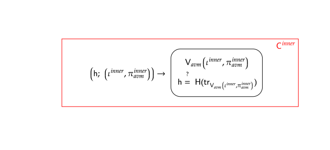
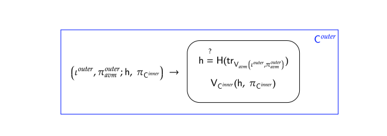

# Goblin AVM recursive verifier

The AVM has a trace with a large number of columns. This means that verifying a proof of the AVM requires an MSM of large size. Such an MSM, when computed in-circuit, is extremely costly. To amortize the the cost of recursively verifying the AVM we construct a 2 step verification mechanism.

## The inner circuit

Write $\mathsf{V}_{avm}$ for the verifier of the AVM. Then, we construct a circuit that verifies a proof $\pi^{inner}_{avm}$ of the AVM. We call this circuit $\mathsf{C}^{inner}$:

The circuit takes two witnesses: $\iota^{inner}$ and $\pi^{inner}_{avm}$, one public input: $\mathsf{h}$, and verifies that:
1. $\pi^{inner}_{avm}$ is a valid proof of the AVM for the public inputs $\iota^{inner}_{avm}$
2. $\mathsf{h}$ is the challenge obtained by hashing the transcript $\mathsf{tr}_{\mathsf{V}_{avm}}$ of the AVM verifier $\mathsf{V}_{avm}$. We write this as $\mathsf{h} = \mathsf{Hash}(\mathsf{tr}_{\mathsf{V}_{avm}(\iota^{inner}, \pi^{inner})})$

Note that $\mathsf{V}_{avm}$ is hard-coded in $\mathsf{C}^{inner}$. In particular, then vk of the AVM is hard-coded in $\mathsf{C}^{inner}$. The vk of the AVM is a witness in $\mathsf{C}^{inner}$ that is recorded in the selectors.

A proof $\pi_{\mathsf{C}^{inner}}$ for public input $\mathsf{h}$ attests to the knowledge of a witness $(\iota^{inner}, \pi_{avm}^{inner})$  such that $\pi^{inner}_{avm}$ is a valid proof of the AVM for the public inputs $\iota^{inner}_{avm}$, and $\mathsf{h} = \mathsf{Hash}(\mathsf{tr}_{\mathsf{V}_{avm}(\iota^{inner}, \pi^{inner})})$

## The outer circuit

Write $\mathsf{V}_{\mathsf{C}^{inner}}$ for the verifier of $\mathsf{C}^{inner}$. We now construct a circuit that verifies a proof $\pi_{\mathsf{C}^{inner}}$ of $\mathsf{C}^{inner}$ and that ensures the proof of validity of $\mathsf{C}^{inner}$ is tied to a specific AVM proof. We call this circuit $\mathsf{C}^{outer}$:

The circuit takes two witnesses: a hash $\mathsf{h}$ and a proof $\pi_{\mathsf{C}^{inner}}$, two public inputs: $\iota^{outer}$, $\pi_{avm}^{outer}$, and verifies that:
1. $\pi_{\mathsf{C}^{inner}}$ is a valid proof of $\mathsf{C}^{inner}$ for public input $\mathsf{h}$
2. $\mathsf{h}$ is the challenge obtained by hashing the transcript of an AVM verifier that verified the proof $\pi_{avm}^{outer}$ for the public inputs $\iota^{outer}$

Note that $\mathsf{V}_{\mathsf{C}^{inner}}$ is hard-coded in $\mathsf{C}^{outer}$. Hence, the vk of $\mathsf{C}^{inner}$ is hard-coded in $\mathsf{C}^{outer}$.

A proof $\pi_{\mathsf{C}^{outer}}$ for public input $(\iota^{outer}$, $\pi_{avm}^{outer})$ attests to the knoweldge of witness $(\mathsf{h}, \pi_{\mathsf{C}^{inner}})$ such that:
1. $\mathsf{h} = \mathsf{Hash}(\mathsf{tr}_{\mathsf{V}_{avm}(\iota^{outer}, \pi^{outer})})$
2. $\pi_{\mathsf{C}^{inner}}$ is a valid proof of $\mathsf{C}^{inner}$ for public input $\mathsf{h}$

Point 2 above attests to the knowledge of a witness $(\iota^{inner}, \pi_{avm}^{inner})$ such that:
* $\mathsf{h} = \mathsf{Hash}(\mathsf{tr}_{\mathsf{V}_{avm}(\iota^{inner}, \pi^{inner})})$
* $(\iota^{inner}, \pi_{avm}^{inner})$ is a valid proof of the AVM

So:
$$
\mathsf{Hash}(\mathsf{tr}_{\mathsf{V}_{avm}(\iota^{inner}, \pi^{inner})}) = \mathsf{h} = \mathsf{Hash}(\mathsf{tr}_{\mathsf{V}_{avm}(\iota^{outer}, \pi^{outer})})
$$ that by the property of $\mathsf{Hash}$ implies $(\iota^{outer}, \pi_{avm}^{outer}) = (\iota^{inner}, \pi_{avm}^{inner})$, and therefore $\pi^{outer}_{avm}$ is a valid proof of the AVM for the public inputs $\iota^{outer}_{avm}$.

## Why is this useful?

The circuit whose proof will be verified in-circuit (in the public base rollup) is $\mathsf{C}^{outer}$, and in $\mathsf{C}^{outer}$ we have the verifier for $\mathsf{C}^{inner}$, not the one of the AVM. Hence, if the cost of verifying $\mathsf{C}^{inner}$ in-circuit plus the cost of generating a proof for $\mathsf{C}^{inner}$ is smaller than the cost of generating a proof for a circuit that recursively verifying the AVM, then the 2-step recursive verification is more efficient than a single recursive verification.

We arithmetize $\mathsf{C}^{inner}$ using `MegaBuilder`. In this way the large MSM required by $\mathsf{V}_{avm}$ is performed using `Goblin`, which means it doesn't have a direct impact on $\mathsf{C}^{inner}$, but rather its impact is split over different components, making it more manageable.
