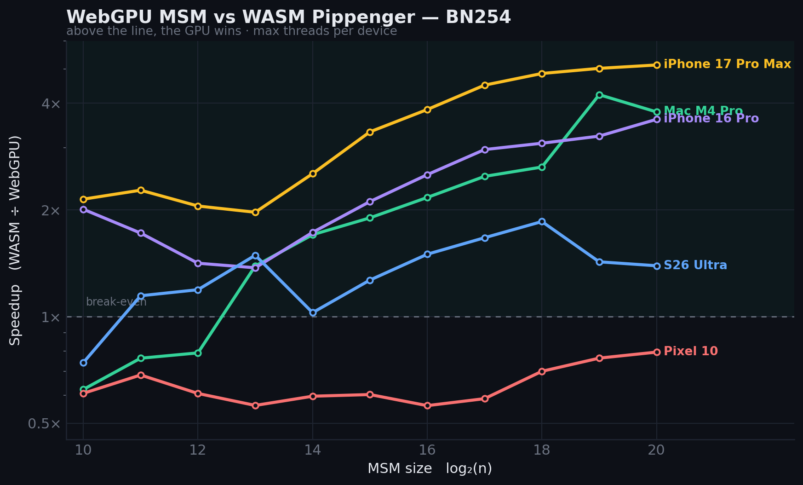
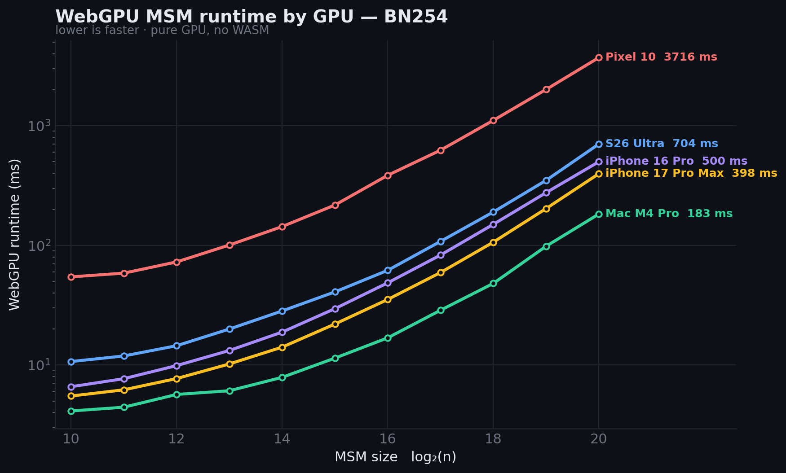

# WebGPU MSM — The Implementation

State of the WebGPU MSM work: what is built, how it performs, how it is
integrated into the Chonk (client-IVC) browser prover, everything **tried
and parked or never attempted** (§7), the **future-work ledger** (§9), and
how to build, run, test and profile it (§8). The companion
[MSM_ALGO.md](MSM_ALGO.md) covers the mathematics — read it first; this
doc assumes it.

Checked against the tree on `sb/integrate-wgpu-msm` (last full audit
2026-07-07; perf figures dated where they matter). Code references use
symbol names, not line numbers — line anchors rot.

---

## 1. TL;DR — the honest verdict

| Claim | Evidence |
| --- | --- |
| **The kernel is genuinely fast in isolation** | `MsmV2` beats multithreaded-WASM Pippenger **2–4×** at $n \in \{2^{18}..2^{20}\}$ on Apple Metal/iPhone, ~1.4× on Adreno (S26U); break-even ~$2^{13}$ (§5.1) |
| **The win does not transfer to Chonk e2e** | Chonk MSMs sit at $n = 16k$–$131k$ (below GPU saturation) and the prove is ~80% sequential — Amdahl caps MSM offload at ~15–20% even if free. Mac = **parity**, S26U ≈ parity, Pixel 10 ≈ 2× slower (§5.2) |
| **Correctness is solid** | **33/33** Chonk WebGPU proofs verify with **byte-identical VKs** across Mac/S26U/Pixel 10 (2026-06-25); known exceptions are gated off, not silently wrong (§6) |
| **Where the GPU honestly pays** | MSM-bound / large-$n$ workloads, strong-GPU-weak-CPU devices, freeing CPU cores, thermal headroom (WASM degrades ~16% under sustained load; WebGPU stays flat) |
| **GPU sumcheck** | **NO-GO standalone** (Fr montmul ~14× below the GPU's ALU roofline), **conditional GO** inside a GPU-resident pipeline (§7.9) |

---

## 2. What exists — branches and layout

Zac Williamson wrote the original WebGPU MSM experiments; Suyash ported
them into `aztec-packages`, rewrote the pipeline as `MsmV2`/`BatchMsmV2`,
integrated it into the Chonk browser prover, and explored GPU sumcheck.
**The canonical branch is `sb/integrate-wgpu-msm`.**

| Branch | Author | Purpose |
| --- | --- | --- |
| **`sb/integrate-wgpu-msm`** ★ | suyash | **Canonical.** Full `MsmV2`/`BatchMsmV2` stack wired into the Chonk browser prover + the multi-device bench harness. |
| `sb/webgpu-msm-fresh` | suyash | Clean, PR-ready **6-commit spine** (hook → pipeline+bridge → bb.js opt-in flag → BN254 batch route → chonk harness) on a fresh `merge-train/spartan` base. |
| `sb/msm-webgpu` | suyash | The **original port** the whole family forks from: WebGPU BN254 bridge + bb.js binding + MSM dev page. |
| `sb/investigate-wgpu-static` | suyash | M8 **static level-plan**. Correct but a net e2e wash; **parked** (§7.3). |
| `worktree-batch-msm-webgpu` | suyash | **BatchMsmV2** dev line; now an ancestor of the canonical branch. |
| `wip/move-bucket-walk-to-gpu` | suyash | **PARKED / BROKEN** — the `f2cc` commit breaks MSM correctness (§7.7); kept as a marker. |
| `zw/webgpu-msm` | zac | Zac's clean squashed v2 — bucket-reduction pipeline, addition-schedule combine, CPU/GPU work-split planner. |
| `zw/msm-webgpu-experiments-v2`, `zw/webgpu-compilation`, `zw/msm-webgpu-{experiments-backup, mont-mul-bench}` | zac | Experiment lines: addition-schedule combine, shader codegen / field arithmetic (`pk` inverse, Karatsuba/Yuval montmul microbench), per-pass dump drivers. |
| `sb/sumcheck-webgpu`, `sb/multipass-sumcheck-opt`, `sb/skipping-sumcheck-webgpu` | suyash | **GPU sumcheck** (§7.9). ⚠ the *skipping* branch is **local-only** (checkout `sumcheck-webgpu-skipping`, never pushed). |


**Layout** (this directory, `barretenberg/ts/src/msm_webgpu/`, plus the C++ side):

| Path | Contents |
| --- | --- |
| `msm_v2.ts`, `batch_msm.ts` | The `MsmV2`/`MsmV2Pool` pipeline (§3); the Tier-2 `BatchMsmV2` wrapper. |
| `bridge/` | Worker↔main bridge: `protocol.ts` (control SAB), `main.ts` (`WebGpuMsmHost`, batch routing, SRS/masking state), `worker_stub.ts` (WASM env imports). |
| `cuzk/` | Host plumbing from the cuZK port: `shader_manager.ts` (WGSL template rendering), `gpu.ts` (device/buffers, timestamp opt-in), `bn254.ts`, `curve_config.ts`, `utils.ts`. |
| `wgsl/` | Shader templates (`cuzk/`, `field/`, `montgomery/`, `bigint/`, `struct/`). `wgsl/_generated/shaders.ts` is the bundle — rerun `yarn generate:wgsl` after any template edit. |
| `setup.ts` | `setupWebGpuMsmBridge` — the one-stop browser wiring. |
| `docs/` | This doc, [MSM_ALGO.md](MSM_ALGO.md), [SUMCHECK_ALGO.md](SUMCHECK_ALGO.md), `diagrams/` (figures + generators). |
| `…/cpp/…/ecc/scalar_multiplication/` | `webgpu_msm_hook.{hpp,cpp}` (batch driver + gate), `webgpu_msm_marshalling.hpp` (form contract, `combine_windows`), the delegation gate in `scalar_multiplication.cpp` (BN254 `MSM::batch_multi_scalar_mul`). |

---

## 3. The `MsmV2` pipeline as built

### 3.1 Stages and kernels

The conceptual six-stage pipeline is in
[MSM_ALGO.md §2](MSM_ALGO.md#2-from-math-to-gpu-passes). As dispatched
(the encode order in `MsmV2.encodeIntoBatch`):

| # | Kernel(s) (WGSL template) | Stage | Dispatch shape | Notes |
| --- | --- | --- | --- | --- |
| 0 | `convert_points_only` | SRS pool (once/session) | tiered 2-D grid over srsN | Barrett-multiply each coord by $R$ into 8×u32 Montgomery; the **only** Barrett use in production. |
| 0′ | `mask_scalars` | prepare, opt-in | $\lceil n/\mathrm{wg}\rceil$ | Only when `MsmConfig.maskBuf` is set (§7.1). |
| 0″ | `bucket_histogram` | prepare | $(\lceil n/\mathrm{wg}\rceil, T)$ | GPU level-0 histogram + ~2 MB readback feeding the host plan walk. Host mirror `buildInitCounts` survives only as the `useHostHistogram` diagnostic bypass. |
| 1 | `decompose_scalars_booth` | decompose | $(\lceil n/\mathrm{wg}\rceil, T_{batch})$ | One u32 per (point, window): bucket in bits $[0,c)$, sign at bit 31 (literal shift — Adreno compiler workaround). |
| 2 | `transpose_count_tiled` → `transpose_reduce_tiled` → `transpose_parallel_scan` → `transpose_scatter_tiled` | transpose | point-tiles × windows; scan is 1 wg/window | Tiled counting sort, workgroup-shared atomics only in count/scatter; `TILE = min(B_W, 8192)`. |
| 3 | `csr_to_v2_active_sums` + `csr_to_v2_meta` | layout convert | $\lceil \mathrm{slots}/\mathrm{wg}\rceil$ | **Index-mode only** (the materialising variant is dead code): level-0 slots are 4-byte `(index \| sign)` handles with `srs_offset` baked in; levels ≥ 1 are 64-byte. |
| 4 | per level: `ba_planner_v2_offsets` → `ba_planner_v2_emit` → `ba_fused_super_bench` (×tiles) → `ba_carry_copy_bench` → `ba_finalize_copy_bench` | pair-tree accumulate | planner: 1 wg/window; fused: **direct**, host-sized from the level plan | One inversion per $S$-pair block. The planner's indirect-dispatch args are vestigial — never consumed. No $P = \pm Q$ fallback. |
| 5 | `ba_reduce_init_bench`, `ba_reduce_level_bench` (3 kinds) | bucket reduction | 1 wg/window | Branchless (`select`, never a data-dependent `if`) 4-phase suffix-sum recursion. |
| 6 | staging copies → `mapAsync` → decode → native `combine_windows` | combine | — | De-Montgomery on the host via $R^{-1}$; Horner fold in Jacobian on the CPU ($T \le 64$). |

Per-window memory is bounded by `MEM_BUDGET` (a module constant,
248 MiB): when the $T$-window working set exceeds it, windows run in
batches (the "Lever G" outer loop) reusing the same scratch.

### 3.2 Field arithmetic

$\mathbb{F}_q$ is **20 limbs × 13 bits** — the widest limb whose schoolbook
partial products fit a u32 accumulator ($2w + \lceil\log_2 L\rceil \le 32$)
while $L\cdot w \ge 254$ — so the Montgomery radix is $R = 2^{260} \bmod q$.
A single field multiply costs ~an order of magnitude more integer muls
than native 4×64 (16) or WASM 9×29 (81): the GPU pays in ALU per op and
wins by running one independent field op per thread.

| Operation | Implementation | Where |
| --- | --- | --- |
| Hot Montgomery multiply | **Karatsuba + Yuval** grouped sub-products, register-light; ~27% faster than runtime-loop CIOS on Apple | `renderKaratYuvalMont`, `cuzk/shader_manager.ts` |
| Barrett `field_mul` (400 inner muls) | schoolbook; survives **only** in the SRS convert path | `convert_points_only` |
| Residue in hot kernels | 8×u32 **"live form"** (`field8` helpers); pack/unpack only at the montmul boundary | fused / reduce kernels |
| Inversion | **Bernstein–Yang safegcd**; default `'pk'` packs 2×13-bit limbs per u32 — same divstep count as `'loop'`, half the private memory → higher Adreno occupancy | `wgsl/field/by_inverse_loop.template.wgsl` |
| f32-FMA multiply (radix $2^{264}$) | ships in-tree, **unused** — the mobile lever, blocked by a full-stack radix rewrite | §7.12 |

### 3.3 Lifecycle and knobs

Three objects keep the SRS resident and amortise compilation:

- `MsmV2Pool.create(device, srsBytes)` — one-shot GPU-converted SRS pool
  + `PipelineCache` (keyed by rendered WGSL, as Promises so concurrent
  compiles collapse) + doubling-grown shared scratch.
- `MsmV2.create(device, n, pool, config)` — data-independent: compile
  ~20 pipelines (17 stages + 3 `reduce_level` kinds, +1 with `maskBuf`),
  build the reduction schedule.
- `MsmV2.prepare(scalars, srsOffset)` — **untimed**, cached on
  (scalar-buffer identity, `srsOffset`): opt-in `mask_scalars`, GPU
  histogram → readback → host plan walk, then ~1 ms fast path (rewrite
  uniforms) or ~150 ms slow path (grow scratch ×`OVERSIZE_FACTOR = 1.3`,
  rebuild bind groups).
- `MsmV2.run()` / `encodeIntoBatch()` — **timed**: encode everything,
  one `submit`, await `mapAsync`, decode. `encodeIntoBatch` only encodes
  — submit/readback belong to the caller (the bridge batch path).

`MsmConfig` ([msm_v2.ts](../msm_v2.ts)): $c = \mathrm{pickC}(n)$ (4–5
tiny, 8–13 across the Chonk band, 15 at $2^{18}$–$2^{20}$),
$S = \mathrm{pickS}(n) \in \{2,4,8\}$ pairs/inversion, `wgi = 128`,
`invVariant` (`'pk'`/`'loop'`), `addsub` (`'native'`/`'unpack'`),
`maskBuf`, `batchSize` (Tier-2).

### 3.4 Batch modes for same-N groups

| Mode | How | When it runs | Perf |
| --- | --- | --- | --- |
| **Same-N serial ("solo")** | B MSMs through one instance; `encodeIntoBatch` collapses them into one submit + one `mapAsync` | Fallback when a same-N group fails the Tier-2 gate | baseline |
| **Tier-2 `BatchMsmV2`** | One `MsmV2` runs B MSMs as **B·W virtual windows**; only `decompose` + `bucket_histogram` know the $(b,w)$ split (`windows_per_msm` template constant) — the rest of the pipeline is oblivious | `__bridge_batch_enabled` ∧ uniform-$N$ ∧ $B \ge$ `min_b` ∧ $n \le 2^{17}$ ∧ equal `srsOffset`. Off at the bridge; **the Chonk page arms it by default with `min_b = 3`**, so the $W_L/W_R/W_O$ triplets route here | **1.78–4.13×** vs WASM-batch, 1.07–1.17× vs solo at B=10 translator sizes; **regresses 0.74× at $2^{18}$** (§7.8) |

Tier-2 instances are LRU-cached per $(n, B)$ — key `n*65536 + B`, a plain
integer product, deliberately not `(n<<16)|B` (JS `<<` is 32-bit signed
and overflows).

---

## 4. Integration into barretenberg and the browser

### 4.1 The two-layer gate

The WebGPU path is off unless **both** layers agree, so published bb.js
is byte-for-byte unaffected:

1. **Compile** — the hook TU `#ifdef`s to nothing without
   `-DBBERG_WEBGPU_MSM_HOOK=ON` (WASM builds only; in practice the
   `wasm-threads` preset — the bridge needs threads). No separate wasm
   filename; the hook artifact drops in over the standard threaded one.
2. **Runtime** — `bb_set_webgpu_msm_enabled(1)` must be called from JS.

With both on, delegation is per-MSM inside the BN254
`MSM::batch_multi_scalar_mul` (`!handle_edge_cases &&
webgpu_msm_runtime_enabled()`), then each MSM is filtered in
`webgpu_msm_hook.cpp`. Anything filtered out stays on the multithreaded
affine Pippenger — same result, no bridge.

| Filter | Rule | Knob |
| --- | --- | --- |
| Size | $n \ge 2^{14}$ | `-DWEBGPU_MSM_THRESHOLD` |
| Points | must be an **SRS prefix** (range-checked) | — |
| Label | not on the block-list (`LABEL@N` entries) | `bb_set_webgpu_msm_blocklist` / bb.js `webgpuMsmBlocklist`. The shipped `DEFAULT_WEBGPU_BLOCKLIST` lives page-side in `ivc-integration/src/serve.ts`: the §6 correctness entries + perf-wash `W_L/W_R/W_O/W_4 @ N` entries. |

### 4.2 The C++ ↔ GPU bridge

One `batch_multi_scalar_mul` is a synchronous round-trip: the worker
marshals a request and parks on `Atomics.wait`; the main thread runs the
GPU and `Atomics.notify`s it awake. The prover WASM is the **threaded**
build, but commit MSMs are issued serially from one worker, so exactly
one thread ever touches the bridge — blocking it stalls only the prover,
never the UI thread that owns the `GPUDevice`. (`NO_MULTITHREADING`
comments mean "single bridge caller", not a single-threaded build.)


**Control block** (`bridge/protocol.ts`) — a 16-slot Int32 SAB:

| Slot | Name | Carries |
| --- | --- | --- |
| 0 | `SLOT_STATE` | `IDLE / REQUEST / DONE / ERROR` (the `Atomics.wait` target) |
| 1 | `SLOT_OPCODE` | `OP_MSM = 1`, `OP_PUBLISH_SRS = 2`, `OP_BATCH_MSM = 3` |
| 2–5 | `SLOT_N`, `SLOT_POINTS_PTR`, `SLOT_SCALARS_PTR`, `SLOT_RESULT_PTR` | size + byte-offsets into the WASM heap |
| 6 | `SLOT_ERROR_CODE` | `ERR_GENERIC = 1`, `ERR_NO_HOST = 2` on `STATE_ERROR` |
| 7, 8 | `SLOT_NUM_WINDOWS`, `SLOT_C` | host's return values ($T$, $c$) for `OP_MSM` |
| 9 | `SLOT_SRS_OFFSET` | in the protocol, but C++ only sends 0 — batched MSMs carry per-MSM offsets in descriptors |
| 10, 11 | `SLOT_BATCH_META_PTR`, `SLOT_BATCH_LABELS_PTR` | batch meta array + optional telemetry labels |

The payload never travels in the SAB — the WASM heap is itself a SAB
under the threaded build. Scalars are read zero-copy (safe: the worker is
parked, so `memory.grow()` cannot detach the view); points, descriptors
(5×u32: `n, srs_offset, scalars_off, result_off, reserved`), and labels
are copied out. Any host failure → `STATE_ERROR` → the worker stub throws
(`WebGPU MSM bridge error code N`) → WASM trap; C++ never silently emits
a wrong commit.

**Form contract** (`webgpu_msm_marshalling.hpp`): everything crossing the
boundary is **little-endian, non-Montgomery**; C++ strips Montgomery out
and re-wraps on return. Point at infinity = 64 zero bytes; an empty
bucket sum marshals to $(0,0)$, which `read_affine_le` maps back to
infinity (else the Horner fold would `invert(0)`). The GPU returns $T$
per-window sums; $S = \sum_j 2^{jc} W_j$ runs natively in
`combine_windows`.

**Coordinate-form cheat sheet** — the most common source of confusion:

| Boundary | Form | Encoded as |
| --- | --- | --- |
| Scalars in WASM heap / GPU input | canonical LE | $n \times 32$ B |
| SRS points C++ → bridge | canonical LE | $n \times 64$ B |
| SRS pool (`poolX`, `poolY`) | Montgomery 8×u32 | $n \times 32$ B / plane |
| `active_sums` level 0 | index + sign bit | 4 B / slot |
| `active_sums` level ≥ 1, `bucket_result`, `red_buf` | Montgomery 8×u32, 2-plane SoA | 64 B / point |
| Window sums in staging | Montgomery 8×u32 | $T \times 64$ B |
| Window sums → C++ | canonical LE (de-Mont'd) | $T \times 64$ B |
| Combined result $S$ | `AffineElement` (Montgomery internally) | — |

### 4.3 SRS lifecycle

`webgpu_register_full_srs_bn254` (called from
`CommitmentKey::batch_commit`; no-op until the runtime flag is on)
records the monomial table and publishes an initial $2^{18}$-point prefix
(larger than the biggest Chonk commit, ~88.9k), GPU-Montgomery-converted
once; the dispatcher doubles the prefix on demand ($O(\log N)$
re-uploads). Every commit is then a **prefix-with-offset** of one pool —
`srs_offset` rides the batch descriptor and is baked into level-0
handles. Worth ~**80 s → ~6 s** e2e vs re-shipping the SRS per MSM (~91
MSMs).

### 4.4 Batch dispatch routing

A `batch_commit` issues ~10 MSMs at once (`OP_BATCH_MSM`);
`WebGpuMsmHost.runBatchMsm` routes:

| Case | Route |
| --- | --- |
| All distinct $n$ | One encoder, one staging buffer at distinct offsets, one `submit`, one `mapAsync` — the cheap path. |
| ≥ 2 share an $n$ | They can't share one instance's scalar buffer: **Tier-2 `BatchMsmV2`** if the §3.4 gate passes, else per-MSM submit + `Promise.all` of `mapAsync`s. |
| ~~Slot pools~~ | K instances per $n$, round-robin — tried and reverted (§7.6). |

### 4.5 Browser wiring

The handshake, in order:

1. bb.js created with `webgpuMsm: true` (+ `navigator.gpu`) calls
   `setupWebGpuMsmBridge(worker)`: allocate the control SAB, construct
   `WebGpuMsmHost` (owns device + SRS pool + masking state), post the
   SAB to the worker.
2. The worker installs the stub env imports (`bb_external_msm_bn254`,
   `bb_external_batch_msm_bn254`, `bb_publish_srs_bn254`) **before**
   `wasm.init()` so the C++ hooks bind.
3. After init, the main thread publishes the worker's WASM memory and
   calls `bb_set_webgpu_msm_enabled(1)`.
4. `setup.ts` installs `__bridge_reset` (`WebGpuMsmHost.reset()`) —
   tears down instance caches, keeps the SRS pool; **required between
   differently-shaped flows on a warm backend** (§6).

### 4.6 Soundness and side-channel notes

Correctness risk is bounded by construction: any bridge failure is a WASM
trap, never a silent wrong commitment, and the path is validated by
byte-identical VKs across devices (§1). What it does *not* attempt is
timing uniformity: prepare histogram, level plan and pair-tree depth all
depend on the scalar *distribution*, so wall-time and memory traffic are
witness-dependent. Accepted threat model for local client-side proving
(the skip-aware WASM sumcheck shares it) — worth stating for an upstream
reviewer.

---

## 5. Performance

*Median of 5 reps/size; each device at its thread ceiling; GPU results
cross-checked vs WASM + noble at every size. Speedup = WASM ÷ WebGPU
(> 1 ⇒ GPU wins). Measured 2026-06-25/26. Reproduce via the bench harness
(§8.1); the scalar-shape data comes from the §8.2 workload-shape hooks.*

### 5.1 Isolated MSM — the real GPU win

| Device | GPU | @ $2^{20}$ WebGPU | @ $2^{20}$ WASM | Speedup | Break-even |
| --- | --- | ---: | ---: | ---: | --- |
| Mac M4 Pro | Apple Metal-3 | 183 ms | 692 ms | **3.78×** (peak 4.23× @ $2^{19}$) | ~$2^{13}$ |
| iPhone 16 Pro | A18 Pro / Safari | 500 ms | 1804 ms | **3.60×** (inflated by slow iOS WASM) | wins all sizes |
| Galaxy S26 Ultra | Adreno (SD) | 704 ms | 980 ms | **1.39×** | ~$2^{13}$ |
| Pixel 10 | Imagination / Tensor G5 | 3716 ms | 2951 ms | **0.79×** | never crosses 1× |





The speedup view flatters a slow WASM baseline (iPhone's 3.6× is partly
iOS Safari's slow threaded WASM); the pure-GPU runtime plot is the honest
hardware ranking.

### 5.2 Chonk end-to-end — parity/loss, and why

| Device | GPU | Chonk WebGPU ÷ WASM | Read |
| --- | --- | --- | --- |
| Mac M4 Pro | Metal-3 | **parity** vs MT Pippenger; ~1.2–1.3× slower vs the newest *fast* Pippenger | no win |
| Galaxy S26 Ultra | Adreno | ~0.86–1.01× | parity |
| Pixel 10 | Imagination | ~0.50× | **~2× slower** |
| iPhone / iOS | Safari | WASM-only (bridge needs cross-origin-isolated SAB; `?nocoi=1` falls back) | n/a |

**Why the 2–4× doesn't transfer** — three independent proofs on the Mac:

1. **GPU MSM ≈ WASM MSM at Chonk sizes.** Trace: GPU compute ~1000 ms ≈
   host-blocked ~1054 ms (the bridge is pipelined; only ~260 ms
   recoverable); 16-thread WASM does the same MSMs in ~1200 ms. Chonk's
   MSMs are $16k$–$131k$ — below GPU saturation (~$2^{18}$) — and
   *structured*, not the uniform-random $2^{20}$ shape the kernel wins
   on ([MSM_ALGO.md §3.1](MSM_ALGO.md#31-origin-and-shape-of-the-msms)).
2. **MSM is only ~15–20% of the prove** (WASM slows just ~7% from 16→4
   threads). Amdahl caps offload there even if MSM were free.
3. **Sequential floor.** Fitting Amdahl: $T_{seq} \approx 5871$ ms; a
   25%-faster target of 4805 ms is *below the floor*.

Two corollaries: a faster WASM Pippenger makes WebGPU lose by *more*, and
the synchronous bridge *regresses* in weak-CPU regimes (−41% at 4
threads; §7.10 is the fix). One real upside: under sustained thermal load
WASM degrades ~+16% while WebGPU stays flat — parity swings to ~+9% GPU.

### 5.3 Device correctness and perf class

| Device | GPU | Correct? | Perf class | Root cause |
| --- | --- | --- | --- | --- |
| **Mac M4 Pro** | Metal-3 | ✅ 11/11 flows, VK-match | fastest, e2e parity | Reference device; fast field-mul, register-insensitive. |
| **S26 Ultra** | Adreno 8xx | ✅ 11/11, VK-match | mobile-best, ~parity | **Register/occupancy-bound**: `inv='loop'` costs +60% on `fused`; the `pk` inverse exists for this. |
| **Pixel 10** | Imagination G5 | ✅ 11/11, VK-match | ~2× slow | **Raw u32×u32 throughput** — *leading hypothesis, not settled* (5.6× Adreno's per-point cost, register-insensitive; an occupancy/memory-pressure explanation remains live). Needs `chrome://flags` unsafe-webgpu. |
| **S23** | Adreno 740 | ❌ device-lost | WASM-only | **Android TDR watchdog (~2 s/submit)** kills the device on the first dispatch; even fixed, it would lose to its own 8-core WASM. |
| **iPhone 16 Pro** | A18 / Safari | ✅ (isolated MSM) | WASM-only for Chonk | iOS Safari cross-origin-isolation / SAB limits — the isolated page fits, the full bridge doesn't. |

Data-handling was empirically ruled out on all devices. Tuning
`wgi`/`c`/`S`/`inv`/reduce-wg is a measured dead end; the identified
decisive mobile lever is the f32-FMA field multiply (§7.12).

**Routing as committed**: GPU runs wherever bb.js has `webgpuMsm: true`;
the only per-MSM routing is the §4.1 gate. A device-adaptive layer
(mobile-vendor detection, auto compaction §7.5, a
`__bridge_gpu_msm_gate='force-cpu'` escape) was built and validated but
never committed.

---

## 6. Bugs and gotchas

| Issue | Status | Note |
| --- | --- | --- |
| **n=131071 ($2^{17}{-}1$) translator-poly miscompute** | **open, gated off** | Wrong commitments at exactly n=131071 (`CONCATENATED_*` / `ORDERED_RANGE_*` / translator `Z_PERM`); broke private_fpc/AMM/storage verify. `DEFAULT_WEBGPU_BLOCKLIST` routes them to CPU. Cross-check: `__bridge_verify_msms`. |
| **Hostile-label MSMs** (`LOOKUP_READ_COUNTS`, `LOOKUP_READ_TAGS`, `VK_PRECOMPUTED_POLY`) | open, gated off | Wrong on GPU for a reason that is *not* scalar structure (masking doesn't fix them — §7.1); degenerate single-bucket distributions and/or large `srsOffset`. CPU at all sizes. |
| **Even-warm-prove verify failure on Metal** | **resolved** | Every *even* warm prove failed: timestamp-`QuerySet` pool exhaustion silently invalidated a command buffer → dropped MSM → bad commit. Fix: timestamps opt-in (`__webgpu_profile_timestamps`), default **off**. |
| **Cross-flow warm-backend reuse corrupts commitments** | **resolved** | Reuse across a differently-shaped flow → wrong commitments. `__bridge_reset` tears down instance caches between flows (keeps the SRS pool). |
| **BatchMsmV2 LRU key 32-bit overflow** | **resolved** | `(n<<16) \| B` overflowed for n ≥ 32768 → size collisions on one cached instance. Fixed to `n*65536 + B`. |
| **bb.js bundle / webpack-chunk coupling** | workaround | Importing a bridge-shared bb.js module into the Chonk page's `serve.ts` reshuffles the async chunk → wrong commitments from an inert-looking diff. Keep `serve.ts` decoupled; inline a local copy. |

| Gotcha | Rule |
| --- | --- |
| Cold start | First prove pays SRS→GPU upload + shader compile + pool alloc (~9.7 s vs 6.1 s warm). Bench paths run a discarded warm-up prove and clip the trace. |
| `initSingleton` is config-blind | Caches the first backend; later `webgpuMsm`/blocklist/mask options are ignored until `destroySingleton`. Dispose the warm backend before switching modes. |
| Backgrounding | A hidden tab throttles WebGPU ~5× (main-thread bridge + `Atomics.wait` worker); pure WASM is immune (Web Workers), headless CDP is immune. |
| `build:browser` deletes `.wasm.gz` | It inlines wasm as base64 then removes the gz — re-copy the `.wasm.gz` before *each* `build:browser` or you ship empty wasm. |
| Software adapters | SwiftShader is not BN254 bit-exact — proofs won't verify. The Chonk page detects and skips. |

### Triage — when a proof stops verifying

The procedure that cracked every §6 bug, in the order that wastes the
least time:

1. **Reproduce in isolation**: dev page `?autorun=msm-cross-check` (GPU
   vs WASM vs noble, across sizes *and* scalar shapes) — this caught the
   `f2cc` and $2^{17}{-}1$ bugs before any prover was involved.
2. **If only e2e reproduces**: arm `__bridge_verify_msms = true` — the
   bridge CPU-cross-checks every commitment and logs the offending
   `label @ n`, capturing the failing MSM's exact inputs.
3. **Replay captured inputs**, not synthetic: `__replayCapturedMsm()`.
   Several bugs were *shape-dependent* — random scalars passed while the
   real column failed.
4. **Gate while investigating**: add the `LABEL@N` blocklist entry;
   bisecting the blocklist is also the fastest family isolator.
5. **If failure depends on run parity / flow order / warm state, suspect
   lifecycle, not math** — both lifecycle bugs above looked like kernel
   bugs and were neither.

Perf triage is §8.2's ladder.

---

## 7. Tried, parked, and not taken

The record of every approach built and shelved, reverted, or deliberately
skipped — so nobody re-treads a dead end without knowing why. Summary,
then detail per entry:

| § | Lever | Verdict | Where it lives |
| --- | --- | --- | --- |
| 7.1 | Additive scalar masking | built, correct, **not beneficial** | in-tree, `__bridge_mask_msms` (default off) |
| 7.2 | Skewed-scalar 3-tier split | built, e2e-invisible | uncommitted |
| 7.3 | Static level-plan (M8) | correct, net e2e **wash** | `sb/investigate-wgpu-static` |
| 7.4 | Same-N host histogram | 7× regression, reverted | `useHostHistogram` diagnostic only |
| 7.5 | Sparse-MSM compaction | validated, mobile-only win, ~flat e2e | uncommitted |
| 7.6 | Same-N slot pools | 0.78×→0.58× regression, reverted | dead code + comment in `bridge/main.ts` |
| 7.7 | Bucket-walk on GPU (`f2cc`) | **broken** — wrong for all inputs | `wip/move-bucket-walk-to-gpu` |
| 7.8 | BatchMsmV2 @ $2^{18}$ | 0.74× regression, **open** | in-tree |
| 7.9 | GPU sumcheck | NO-GO standalone / **GO resident** | 3 `sb/*sumcheck*` branches |
| 7.10 | Non-blocking bridge | **never attempted** — the known next lever | — |
| 7.11 | GPU SRS decompression | works, dev-page only | `dev/msm-webgpu/gpu_decompress.ts` |
| 7.12 | f32-FMA montmul | in-tree, **unused** — the mobile lever | `wgsl/montgomery/`, blocked on radix rewrite |
| 7.13 | GLV, multi-GPU, WASM SIMD, GPU-resident prove | explicitly out of scope | — |

### 7.1 Additive scalar masking — built, correct, **not beneficial**

**What.** The GPU miscomputes *structured* scalars (small, sparse,
repeated — the translator range-constraint shape). Masking removes the
structure: with a per-SRS-position random vector $R$, compute
$C' = \sum [(s_i + R_i) \bmod r]\,P_i = C + O$ and subtract the cached
offset $O = \sum [R_i]\,P_i$. Masked scalars are uniform full-width — the
known-good case — and since `MsmV2` always runs full 254-bit windows,
the cost is only a sub-ms O(n) pre-pass (`mask_scalars`), one cached
offset MSM per $(srsOffset, n)$, and a host point-subtract.

**Result.** Validated (`mask_scalars.test.ts` in CI; real GPUs compute
the structured translator MSMs correctly) but **not beneficial**: the
unblocked MSMs are wash-or-worse at their sizes, so e2e landed within
noise of the blocklisted baseline — the blocklist already gives the same
correctness for free. Masking does **not** fix the hostile-label class
(`VK_PRECOMPUTED_POLY @ 17455` still mismatched — not scalar structure,
§6); those stay on `MASKING_RESIDUAL_BLOCKLIST`.

**State.** In-tree, opt-in `__bridge_mask_msms` at SRS-publish time,
default off. Bridge side in `bridge/main.ts`; pipeline side
`MsmConfig.maskBuf`. **Composes with Tier-2**: `runBatchMsm` threads
`maskBuf` into `BatchMsmV2.create` and subtracts $O$ per combined result.

**Revival.** The prize is Tier-2 on the translator B=10 group (the only
thing that could pay for masking). Plumbing is done — what's left is the
$2^{17}{-}1$ fix (§6) and a masked-batch e2e re-measure.

### 7.2 Skewed-scalar 3-tier split — built, e2e-invisible, **uncommitted**

Split an MSM by scalar magnitude so small-λ rows run fewer windows.
Unit-proven (exact vs noble), but real translator data is 3-tier — 96.6%
< $2^{25}$, ~3.4% mid-tier to ~77 bits, 564 full-width ZK-masking rows.
The masking rows force `maxbits = 254` for a global split; the safe
hybrid cuts only ~3.3× of window work on a whole-prove-negligible slice.
**Never committed** — none of it (`windowsPerMsm` override, `skew_split`
module + tests, `__bridge_skew_split`, page toggle) is in the tree.

### 7.3 Static MSM level-plan (M8) — committed, default-off wash

Kill `prepare`'s histogram + readback round-trip: size every level's
dispatches from the closed-form pair-tree recurrence
($s_{k+1} \le \lfloor 2 s_k / 3 \rfloor$-style bounds). Correct (after a
c=15 mod-r top-window fix) but it **over-provisions the deep pair-tree**
post-knee — the run-phase cost cancels the prepare saving; net wash. The
bounds are empirical, not proven; structured scalars could
under-provision silently. On `sb/investigate-wgpu-static`, default off.
Revival: tighten the post-knee fused over-provision with GPU timing, or
prove the bound.

Context: the GPU `bucket_histogram` (the "move prepare to the GPU" step
that *did* land) replaced a flat O(n·T) host Booth walk; its known cost
is ~15 ms (10% of `fused`) at $2^{20}$ from system-level-cache eviction
(34 MB touched). Never tried: a workgroup-shared histogram (shared memory
too small at c≥15 without a split) and a cache warm-up dispatch (fragile)
— see §9.3. What M8 chased: the ~1 ms warm host plan-walk + the
`mapAsync` readback latency.

### 7.4 Same-N host histogram — reverted

`buildInitCounts` on the host for same-N batches: flat O(n·windows), a
**7× regression** on sparse structured columns. Only a selective `'auto'`
mode ever beat WASM (~90 ms) — not worth it. Survives as the
`useHostHistogram` diagnostic bypass.

### 7.5 Sparse-MSM compaction — built + validated, **uncommitted**

Skip zero scalars before decompose (~24% of delegated Chonk MSM work is
zeros; the CPU Pippenger skips them free). Host nonzero-scan → compacted
scalars + `orig_idx` remap threaded through the per-point dispatches
(`effectiveN`), one `{{#compact}}` line in `csr_to_v2_active_sums`;
B=1-only, off under masking. **Validated bit-exact** (Mac e2e verified;
`__bridge_verify_msms` 30/30). Result: ~13–23% of the mobile GPU-MSM
phase but only ~6% e2e — doesn't flip either device (S26U 0.90×, Pixel 10
0.50×) — and **Mac regresses** (host scan costs more than it saves), so
mobile-only by design. **Not in the tree** — the implementation, its
knobs (`MsmConfig.compact`, `__bridge_msm_compact`, `?compact=1`) and
the vendor auto-enable were never committed.

### 7.6 Same-N slot pools — reverted regression

K distinct `MsmV2` instances per $n$ sharing one command buffer: ~80–100
ms per fresh instance × ~30 slots ≈ 3 s upfront, and the GPU still runs
the passes sequentially — **0.78× → 0.58×**. Reverted; vestigial
`slotPools`/`getOrCreateMsmSlot` remain dead in `bridge/main.ts` with the
experiment recorded in a comment. The lesson — multiple single-MSM
instances ≠ multi-MSM-per-shader — is what led to `BatchMsmV2`.

### 7.7 Bucket-walk on GPU (`f2cc`) — broken, parked

Moving the per-level bucket walk (the host plan loop) onto the GPU
produces **wrong results for all inputs including random** — it was the
real cause of the original Chonk verify failure. Parked on
`wip/move-bucket-walk-to-gpu` as a marker; any re-attempt must pass the
dev-page noble cross-check first.

### 7.8 BatchMsmV2 large-n regression — open

Tier-2 regresses to 0.74× at $n = 2^{18}$ (working set exceeds cache) —
an unfixed WGSL regression. Fixing it plus the $2^{17}{-}1$ miscompute
unlocks the clean storage_proof win (concatenated prepare + solo-kernel
speed). Design history: `BATCH_MSM_DESIGN.md` (git history).

### 7.9 GPU sumcheck — built, NO-GO standalone / conditional GO resident

The natural next GPU target (~8–10% of e2e, 100% CPU today). A **working
prototype** exists on the three sumcheck branches (§2 table — note the
local-only *skipping* branch):

- The `Fr`-vs-`Fq` blocker was solved: `ShaderManager` is
  field-parametric; the Fr generator family covers **all 14 Mega
  relations** plus engine kernels (`fr_ops`/`fr_pow`, fold/reduce/batch,
  gate-separator, Poseidon2 transcript).
- Two engines — **multi-pass** (`gpu_pipeline.ts`: one encoder/round,
  ~0.7 MB readback/round, host draws the challenge) and
  **single-submission** (`single_submit.ts`: the whole d-round protocol
  incl. on-GPU Poseidon2 Fiat–Shamir in one command buffer) — plus a
  hybrid (GPU front, threaded-WASM tail for the last ~9 latency-bound
  rounds). Verified on M4 Pro with a telescoping-oracle check
  (`suite_rounds.ts`).

**Verdict (adversarially reviewed): NO-GO standalone.** The BN254-Fr
Montgomery product, emulated as 8×u32 limbs, runs **~14× below the GPU's
integer-ALU roofline** — a serial carry/reduce chain, not data movement
or occupancy. Against the *real skip-aware* WASM baseline (Mega applies
~2 of 14 relations per active row; ECCVM row-blocks 82% skipped) there is
**no crossover at any n**. **Conditional GO** inside a GPU-resident
pipeline where the witness is already on-GPU from the MSM commitments:
upload is free and a 2–3×-slower sumcheck is a small adder that frees
CPU — that residency argument is *why* GPU MSM was built first.

Docs: algorithm/design/optimisations in
[SUMCHECK_ALGO.md](SUMCHECK_ALGO.md); detail reports on the branches
under `ts/dev/sumcheck-webgpu/` (`DESIGN_REPORT.html`,
`OPTIMIZATION_REPORT.md`, `MEMORY_REPORT.md`). Skip-number provenance:
the native `SkipProfiler` was never committed; the skip
model is reproduced benchmark-side (`skip_inject.ts` + `sparsity.ts`,
mirrored bit-for-bit in the C++ `SumcheckBench`) so both engines are
compared on provably equal work.

### 7.10 Non-blocking bridge — not attempted (the known next lever)

The bridge is synchronous: the prover worker parks per batch. That is
what makes WebGPU *regress* in weak-CPU regimes (−41% at 4 threads) —
exactly the devices where the GPU should win. Making commit dispatch
async (defer commit reads so the GPU pipelines across batches) touches
the commit-key path and prover stages, not just MSM. Never started; the
prerequisite for the honest win case. See §9.3.

### 7.11 GPU SRS decompression — dev-page only

`gpuDecompressG1` (`dev/msm-webgpu/gpu_decompress.ts` +
`decompress_g1_bn254` template): one closed-form Fq sqrt per point (~260
squarings + ~126 mults), parallel across threads — low seconds on a dGPU
vs ~30 s of single-threaded JS at $2^{21}$ points. Dev-page SRS loader
only; production receives already-decompressed bytes from C++. Revival
would target cold-start UX, not prove time.

### 7.12 f32-FMA Montgomery multiply — in-tree, unused: **the mobile lever**

**What.** MSM GPU time is ~79% field multiplies (`fused` ~62% +
`reduce_level` ~17%) and mobile loses on exactly that ALU cost (§5.3).
An alternative multiply from Zac's montmul-microbench line ships in-tree:
`mont_pro_product_f32_22_sos3uv3` — 12×22-bit limbs in f32, FMA-based,
two-accumulator `(tlo, thi)` carry-chain break — plus `BigIntF32` helpers
and the `gen_montgomery_product_f32_22_sos3uv3_shader` render path. f32
FMA is the op-class mobile GPUs are actually fast at, unlike 32-bit
integer multiply.

**Why unused.** Blocked as a drop-in: different element type **and** a
different radix ($R = 2^{264} = 2^{12 \cdot 22}$ vs the stack's
$2^{260}$) — adopting it means re-rendering the *entire* field stack
(SRS convert, scalars, add/sub, safegcd inverse, `field8`) in radix
$2^{264}$. Major and risky; never safe to land blind.

**Revival.** The identified decisive lever for beating WASM on mobile
(all tuning knobs are measured dead ends): render the full pipeline at
radix $2^{264}$ behind a config switch, noble cross-check on the dev
page, re-bench S26U/Pixel 10. Caveat: the Imagination ALU-throughput
diagnosis is leading-but-unsettled (§5.3) — re-establish the baseline
before investing the rewrite.

### 7.13 Explicitly out of scope

- **GLV / endomorphism** — halves λ but is a kernel re-architecture
  (§9.3), not an integration task.
- **Browser multi-GPU** — not exposed by `navigator.gpu`.
- **WASM SIMD in bb.js** — orthogonal to GPU work.
- **GPU-resident prove** (MSM + sumcheck + fold, witness never leaves
  the GPU) — the only path past the sequential floor; multi-month,
  from-scratch. §7.9's verdict is designed around it.

---

## 8. Getting started — build, run, test

- **Build** (the hook compiles only into WASM builds and only with the
  flag; use `wasm-threads` — the bridge needs threads):

  ```bash
  cd barretenberg/cpp && cmake --preset wasm-threads -DBBERG_WEBGPU_MSM_HOOK=ON \
    && cmake --build --preset wasm-threads --target barretenberg.wasm
  gzip -kf build-wasm-threads/bin/barretenberg.wasm
  cd ../ts && yarn build:browser \
    && cp ../cpp/build-wasm-threads/bin/barretenberg.wasm.gz dest/browser/barretenberg_wasm/barretenberg-threads.wasm.gz \
    && cp ../cpp/build-wasm-threads/bin/barretenberg.wasm.gz dest/browser/barretenberg_wasm/barretenberg.wasm.gz \
    && ./scripts/browser_postprocess.sh
  cd ../../yarn-project/ivc-integration && yarn webpack
  ```

  After editing any WGSL template: `yarn generate:wgsl`.

- **Serve.** Pages must be **cross-origin isolated** (COOP/COEP) — the
  bridge throws without `SharedArrayBuffer`.

  | Page | Command | Autoruns | URL knobs |
  | --- | --- | --- | --- |
  | MSM dev page (`dev/msm-webgpu/`, Vite :5173) — WebGPU vs WASM (1t/Nt) vs noble, $n \in 2^{10}$–$2^{20}$ | `yarn dev:msm-webgpu` (barretenberg/ts) | `?autorun=msm-cross-check` (the correctness **ground truth** — caught the `f2cc` and $2^{17}{-}1$ bugs), `msm-bench` (+`&trace=1`), `msm-trace` (§8.2) | pipeline: `?c= ?s= ?wgi= ?reducewg= ?inv=pk\|loop ?l0log= ?hostHist=1 ?scalar_seed=`; autorun: `?logn= ?reps= ?gap= ?target=` |
  | Chonk e2e page (:8080, static server `scripts/serve-chonk-webgpu.mjs` in `ivc-integration`) | `yarn serve:chonk-webgpu` | `?autorun=chonk-bench` with `?mode=off-on\|on-only\|off-only\|paired-sweep` | `?threads= ?flow= ?levels= ?target=`; `?nocoi=1` (iOS — handled by the serve script) |

- **Test.** Node-side jest (no GPU): `mask_scalars.test.ts`,
  `bridge/protocol.test.ts`, `batch_msm.test.ts`,
  `batch_msm_shader.test.ts`; C++ `webgpu_msm_marshalling.test.cpp`.
  Substantive GPU correctness runs in a real browser (pages above).
  Native verify of a page proof: `ivc-integration/src/native_verify.ts`
  + `native_chonk_verify.test.ts` (`bb verify --scheme chonk`).

- **Changing a kernel.** Edit the template → `yarn generate:wgsl` → dev
  page noble cross-check (across sizes *and* scalar shapes) → full Chonk
  prove + verify → **re-validate on Adreno specifically**: several
  constructs exist purely as Adreno-compiler workarounds (the
  `bucket | sign << 31` literal shift, the all-`select` reduction, the
  unrolled masking loop). A shader that passes on Metal proves nothing
  about Qualcomm. Each workaround is documented in its shader's header —
  treat those headers as constraints, not history.

- **Runtime knobs:**

  | Knob | Effect |
  | --- | --- |
  | `bb_set_webgpu_msm_enabled(1)` | Master runtime gate. |
  | `webgpuMsmBlocklist` bb.js option / `bb_set_webgpu_msm_blocklist` | `LABEL@N` entries — force MSMs back to WASM. |
  | `-DWEBGPU_MSM_THRESHOLD=<n>` | Compile-time delegation floor (default $2^{14}$). |
  | `__bridge_reset` | Reset bridge state between flows on a warm backend (**required** for multi-flow sessions). `__bridge_reset_keep_pool = false` also rebuilds the SRS pool. |
  | `__bridge_batch_enabled`, `__bridge_batch_max_n`, `__bridge_batch_min_b` | Tier-2 `BatchMsmV2` gate + thresholds (§3.4). |
  | `__bridge_mask_msms` | Additive masking (§7.1), read at SRS-publish time. |
  | `__bridge_verify_msms` | Per-MSM CPU cross-check (triage step 2). |
  | `__webgpu_profile_timestamps` | GPU timestamp queries, default **off** (QuerySet bug, §6). |
  | ~~`__bridge_skew_split`~~, ~~`__bridge_gpu_msm_gate`~~ | Named in older notes — never committed, not in the tree. |

### 8.1 Multi-device e2e benchmarking — quick setup

One command benches every device — the Mac (real GPU, over CDP) and
USB-attached Android phones (over adb) — from a headless dev box. Full
runbook: **`yarn-project/ivc-integration/scripts/SETUP.md`**; channel
bring-up + SSH traps: the `multi-device-bench` skill
(`barretenberg/.claude/skills/`).

![Multi-device bench topology: the headless dev box serves the chonk (:8080) and MSM (:5173) pages and runs bench.mjs plus an adb client; the Mac runs debug Chrome (:9222) and the adb server (:5037) with S23/S26U/Pixel10 phones on USB. One SSH invocation from the Mac carries all four channels — -L 8080/5173 so Mac Chrome and the phones (via adb reverse) load pages from the box, -R 9222 for CDP, -R 5037 for adb. Devices open ?autorun= URLs and POST results back to the box's /results sink. Use 127.0.0.1 everywhere — localhost can resolve to ::1 and hang.](diagrams/wgpu_bench_topology.svg)

```bash
# all four channels, one SSH invocation FROM the Mac:
ssh -N <box> -L 8080:localhost:8080 -L 5173:localhost:5173 \
             -R 9222:localhost:9222 -R 5037:localhost:5037

# then, from yarn-project/ivc-integration on the box (page servers up per §8):
node scripts/bench.mjs devices          # channel check: mac ✅ + phones ✅
node scripts/bench.mjs probe            # capability matrix (--mode gpu-smoke = TDR ladder)
node scripts/bench.mjs chonk            # chonk e2e WASM-vs-WebGPU on every device
node scripts/bench.mjs msm --logn 16    # isolated-MSM cross-check
```

Reports land in `/tmp/zac-webgpu/bench-*.md` (+ `bench-history.jsonl`);
`PAGE_HOST`/`PAGE_PORT` override where devices fetch the page.

| One-time setup | Detail (copy-paste in `SETUP.md`) |
| --- | --- |
| Mac: debug Chrome :9222 | Anti-occlusion flags are **mandatory** — macOS throttles hidden windows otherwise. |
| Mac: `brew install android-platform-tools` | Phones: enable USB debugging, accept the adb prompt. |
| Box: version-matched adb client | Point `bench.mjs` at it via `ADB_BIN`. |
| `devices.json` registry | Friendly ids matched by model-name regex (no hard-coded serials). Per-device: `threads` (phones **must not** run 16-thread WASM — pthread startup races crash them; 4–6 safe) and `caps.webgpuMsm` (`device-lost` devices like the S23 are skipped on GPU runs unless `--force`). |

| Trap (each burned a session) | Rule |
| --- | --- |
| IPv6 | `127.0.0.1`, never `localhost` — forwards are IPv4; `localhost` can resolve to `::1` and **hang**, not refuse. |
| Stale reverse tunnel | Also **hangs** rather than refuses — kill the old holder on the Mac before re-opening. |
| Dev-server restart | Drops the `-L` forwards — re-run the SSH command. |
| Phone screens | Keep phones awake and unlocked; a locked screen throttles WebGPU. |

Lower-level headless drivers (single-device, tracing, medians): the
`cdp-*.mjs` scripts next to `bench.mjs`.

### 8.2 Profiling — from e2e traces down to GPU hardware counters

![Profiling ladder, coarse to fine: level 1 e2e phase trace (perfetto_trace.ts, cdp-trace/attribution, ui.perfetto.dev — which phase?), level 2 per-pass GPU nanoseconds (?autorun=msm-trace passTimes on the GPU clock, needs timestamp-query — which kernel?), level 3 workload shape (MSM_PROFILE=1 native and [msm-dist] hook-mode bucket-histogram stats — what inputs?), level 4 hardware counters (Zac's webgpu-gpu-trace via AGI/gapit, Mac-side, Adreno/Mali only — WHY is it slow?). Descend a level only when the one above has localised the question. Level-1 trap: WASM trace clocks can dilate — check that the span matches the prove time.](diagrams/wgpu_profiling_ladder.svg)

| Level | Question | Tool | Caveats |
| --- | --- | --- | --- |
| 1 · e2e phase trace | which phase costs what? | Chonk page trace capture + [perfetto_trace.ts](../perfetto_trace.ts) → `ui.perfetto.dev`; `cdp-trace.mjs` headless; `chonk-trace-attribution.mjs` for rigorous *paired* WebGPU-vs-WASM decomposition | One trace pair ≠ the median win — cross-check `cdp-median.mjs`. WASM trace clocks can **dilate** (~7 s prove spanning ~30 s) — check the span first. |
| 2 · per-pass GPU ns | which kernel inside one MSM? | `?autorun=msm-trace`: 3 warm-ups + `reps` profiled MSMs, POSTs `results.samples[].passTimes` (absolute GPU-clock ns, `readProfilePassTimelineRaw()`) | Needs `timestamp-query` (`--enable-unsafe-webgpu`). In-prover timestamps stay behind `__webgpu_profile_timestamps` (QuerySet bug, §6). |
| 3 · workload shape | what do the MSMs look like? | `MSM_PROFILE=1` native (`[msm-profile]`) and the hook-side distribution mode (`[msm-dist]`, `set_msm_distribution_mode`) — per-MSM Booth-recoded bucket-histogram stats | Source of the §5 / [MSM_ALGO.md §3.1](MSM_ALGO.md#31-origin-and-shape-of-the-msms) scalar-shape data. |
| 4 · HW counters | **why** is a pass slow (registers vs ALU vs memory)? | [zac-williamson/webgpu-gpu-trace](https://github.com/zac-williamson/webgpu-gpu-trace) — driver-level Perfetto traces + hardware counters (ALU util, occupancy, % compute) via AGI/gapit, labelled back to our MSM passes | **Adreno/Mali only** (no Apple Metal, no Pixel 10 IMG). **Runs Mac-side** — `adb forward` binds on the adb-server host, so AGI's agent can't ride the §8.1 tunnels. Page contract = `msm-trace` (known gap: `calib` posted empty). Labeler is tuned to the MSM page's rep structure — full-Chonk captures get counters but misaligned labels. |

The §5.3/§7.3 kernel-cost claims (histogram SLC eviction, Adreno register
pressure, the `fused`/`reduce_level` ~80% split) all came from levels
2–4.

---

## 9. Future work — where to pick up next

§7 is what was *tried*; this is the forward view.

### 9.1 Highest-impact next steps

In rough order of impact on the e2e number:

1. **Fix the n=131071 miscompute** (§6) + the **BatchMsmV2 $2^{18}$
   regression** (§7.8) — unlocks the clean storage_proof win.
2. **Non-blocking bridge dispatch** (§7.10, §9.3) — prerequisite to win
   on the real target (strong-GPU / weak-CPU devices).
3. **GPU sumcheck only inside a resident-witness pipeline** (§7.9).
4. **Mobile: the f32-FMA field-multiply rewrite** (§7.12) — the only
   measured path to beating WASM on Adreno/IMG.

First, though: push the local-only `sb/skipping-sumcheck-webgpu` branch.

### 9.2 Started, showed promise, not finished

Each has working code and a measured signal; what's missing is the last
mile.

| Lever | Promise shown | What's left | Where |
| --- | --- | --- | --- |
| **Masking × Tier-2 batch** (§7.1) | BatchMsmV2 1.78–4.13× vs WASM-batch at translator sizes; masking makes those MSMs correct; `maskBuf` batch plumbing done | Fix $2^{17}{-}1$, re-measure masked-batch e2e on the B=10 group | in-tree + §6 bug |
| **Sparse-MSM compaction** (§7.5) | Bit-exact; ~13–23% of the mobile GPU-MSM phase | Rebuild per §7.5, re-validate; mobile-only gate; pair with the f32 multiply | uncommitted |
| **Static level-plan M8** (§7.3) | Correct; kills the prepare round-trip (the same-N serialization tax) | Tighten post-knee over-provision with GPU timing, or prove the bound | `sb/investigate-wgpu-static` |
| **f32-FMA montmul** (§7.12) | Microbenched body in-tree; the op-class mobile GPUs are fast at | Re-render the field stack at radix $2^{264}$ behind a config; noble cross-check; mobile re-bench | in-tree, unused |
| **GPU sumcheck, resident** (§7.9) | Working prototype, telescoping-oracle verified; upload free once the witness is GPU-resident | The resident-witness pipeline itself (§9.3) | 3 sumcheck branches |
| **GPU SRS decompression** (§7.11) | Seconds vs ~30 s single-threaded JS at $2^{21}$ | Integrate into production cold-start (UX, not prove time) | dev page |

### 9.3 Never explored

Plausible mechanism, zero measurement — ordered by expected value:

| Lever | Mechanism | Why it could pay | Notes |
| --- | --- | --- | --- |
| **Non-blocking / pipelined bridge** (§7.10) | Defer commit reads so the GPU pipelines across `batch_commit`s instead of parking the worker per batch | ~260 ms host-blocked recoverable on Mac; the −41% weak-CPU regression is caused by exactly this synchrony | Touches commit-key path + prover stages — the largest untouched integration lever. |
| **GLV / endomorphism split** (§7.13) | λ → two 128-bit halves ⇒ ~half the windows $T$, halving decompose/transpose/tree work | The standard next step in every fast MSM | Kernel re-architecture: new decompose, per-half signs, endomorphism-scaled SRS plane. |
| **Same-N prepare on the GPU** | Plan on-GPU, indirect-dispatch the tree | Prepare serializes same-N groups (~590 ms ≈ 17% of the MSM phase on S26U); M8 attacked it statically — the dynamic variant is untried | The broken `f2cc` (§7.7) was the bucket *walk*, not the planner; the planner's indirect-dispatch args are already written, never consumed (§3.1). |
| **Workgroup-shared histogram** (§7.3) | Keep level-0 counts in shared memory | Cuts the `bucket_histogram` SLC-eviction cost (~15 ms at $2^{20}$) | Needs a $c \ge 15$ split to fit shared memory. |
| **Cache warm-up dispatch** (§7.3) | Pre-touch the histogram working set | Same target as above | Judged fragile / device-tunable — measure before building. |
| **GPU-resident prove** (§7.13) | MSM + sumcheck + fold; witness never leaves the GPU | The **only** path past the sequential floor; turns §7.9 into a GO | Multi-month, from-scratch; everything above is a stepping stone. |

**Reality check:** a 25%-faster Chonk on M-series is excluded by the
sequential floor (§5.2) — nothing above changes that except the
GPU-resident prove. The GPU MSM's honest home is MSM-bound workloads and
strong-GPU/weak-CPU clients, plus freeing CPU and thermal headroom.

**Upstreaming:** start from **`sb/webgpu-msm-fresh`** (the clean 6-commit
spine on a fresh `merge-train/spartan` base), not the canonical branch —
`sb/integrate-wgpu-msm` carries months of bench harnesses and experiment
scaffolding a reviewer should never see. The PR is inert by default (the
two-layer gate, §4.1) — the main argument to lead with.
