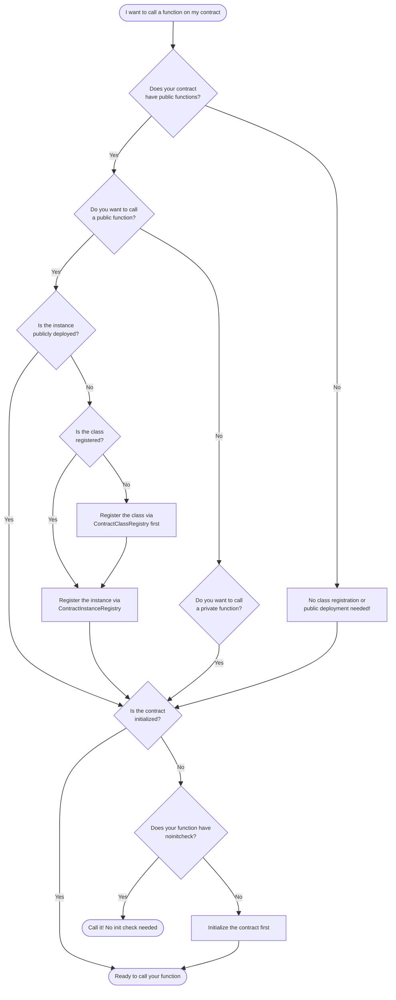

This guide helps you quickly determine which deployment steps your contract needs. For conceptual background on how contract deployment works, see [Contract Deployment](../foundational-topics/contract_creation.md).

## What Do I Need to Do?

Use this decision tree to determine which steps your contract needs.

:::tip No initializer?
If your contract has no `#[initializer]` function and was deployed with `without_initializer()`, it's considered initialized immediately. Skip the initialization checks above.
:::

## Checking Contract State Programmatically

Use `wallet.getContractMetadata(contractAddress)` to check whether a contract is registered, published, and initialized. See [Verify deployment](../aztec-js/how_to_deploy_contract.md#verify-deployment) for usage examples and details on what the PXE checks automatically versus what you need to verify manually.

## When Can You Skip States?

| Contract Type             | Class Registration | Instance Creation | Initialization | Public Deployment |
| ------------------------- | ------------------ | ----------------- | -------------- | ----------------- |
| Private-only              | Optional           | Required          | Depends        | Skip              |
| Public-only               | Required           | Required          | Depends        | Required          |
| Hybrid (private + public) | Required           | Required          | Depends        | Required          |
| Stateless helper          | Optional           | Required          | Skip           | Depends           |

"Depends" means it depends on whether your contract has a constructor marked with `#[initializer]`.

## When Functions Become Callable

| State                               | Private Functions     | Public Functions |
| ----------------------------------- | --------------------- | ---------------- |
| Address computed only               | With `#[noinitcheck]` | No               |
| Class registered                    | With `#[noinitcheck]` | No               |
| Instance deployed (not initialized) | With `#[noinitcheck]` | No               |
| Initialized                         | Yes                   | No               |
| Publicly deployed                   | Yes                   | Yes              |

Private functions marked with `#[noinitcheck]` can be called as soon as you know the address, even before initialization. This enables patterns like pre-funded accounts.

:::note Contracts without initializers
If your contract has no initializer and is deployed with `without_initializer()`, it's considered initialized immediately. Private functions are callable right after instance creation without needing `#[noinitcheck]`. Public functions still require public deployment.
:::

## Further Reading

- [Contract Deployment](../foundational-topics/contract_creation.md) - Conceptual foundation of classes, instances, and lifecycle states
- [Deploying Contracts](../aztec-js/how_to_deploy_contract.md) - TypeScript deployment guide
- [Defining Initializer Functions](./framework-description/functions/how_to_define_functions.md#define-initializer-functions) - How to use `#[initializer]` and `#[noinitcheck]`
- [Communicating Cross-Chain](./framework-description/ethereum_aztec_messaging.md) - Portal contracts and L1/L2 messaging
