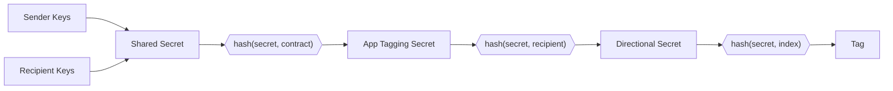

Note discovery refers to the process of a user identifying and decrypting [notes](../../state_management.md#notes) that belong to them.

## Alternative approaches

Other protocols have explored different note discovery mechanisms. **Brute force** approaches download all notes and trial-decrypt each one, but this becomes prohibitively expensive as networks grow. **Offchain communication** has the sender share note content directly with recipients, avoiding onchain costs but introducing reliance on side channels. Aztec apps can use offchain communication if they wish, but the default mechanism is note tagging.

## Note tagging

Aztec uses note tagging as its default discovery mechanism. When creating a note, the sender _tags_ the log with a value that only the sender and recipient can identify. This allows recipients to efficiently query for relevant logs without downloading and attempting to decrypt everything.

### How it works

#### Every log has a tag

In Aztec, each emitted log is an array of fields, eg `[x, y, z]`. The first field (`x`) is a _tag_ field used to index and identify logs. The Aztec node exposes an API `getLogsByTags()` that can retrieve logs matching specific tags.

#### Tag generation

The sender and recipient share a predictable scheme for generating tags. The tag is derived from a shared secret and an index (a shared counter that increments each time the sender creates a note for the recipient).

Both parties derive the same shared secret via Diffie-Hellman key exchange, then hash in the contract address, recipient, and index to produce identical tags.

#### The sender in note tagging

The "sender" in note tagging is **not necessarily the transaction sender**. It's the **sender for tags**, which account contracts set by calling `set_sender_for_tags(account_address)` before making calls to other contracts. This is typically the account contract address itself.

This sender address is used along with the recipient address to compute the shared secret via Diffie-Hellman key exchange, which is then used to derive the tag.

#### Discovering notes in Aztec contracts

Note discovery is implemented in contract code rather than by the PXE. The `#[aztec]` macro automatically injects the necessary discovery logic, so developers don't need to implement it manually. However, this approach means users can customize or replace the discovery mechanism to suit their needs.

### Limitations and Solutions

#### You cannot receive tagged notes from an unknown sender

Without knowing the sender's address, you cannot create the shared secret needed to derive the note tag. This is a fundamental limitation of the current tagging scheme.

There are three broad families of solutions to this problem:

**a) Brute force search** - Scan every single log and test if it decrypts. This has obvious performance issues as the network grows and becomes prohibitively expensive.

**b) Tagging with known sender** (current implementation) - You know who will send you messages and search for those specifically. This is very fast and allows you to remove senders who spam you. However, we don't currently have a mechanism for constraining this (i.e., guaranteeing that the recipient will find the message).

**c) Tagging with handshaking** - An intermediate solution where you can be notified of new senders. A handshake occurs onchain that lets the recipient discover a new sender, and from that point on there's regular tagging. This design either:
- Is fast but leaks privacy (e.g., a public event with "new handshake for Alice!")
- Is slow but doesn't leak (you brute force scan all logs from a handshake contract, testing if any handshakes are for you)

The handshaking design space is large - for example, you could set up infrastructure where a server searches handshakes for you, trading off infrastructure requirements for performance.

**Handshaking is not currently implemented in Aztec.nr.** For now, if you need to receive notes from unknown senders, potential workarounds include:
- Having senders register themselves in a contract first, allowing recipients to search for note tags from all registered senders
- Using offchain communication to share sender addresses with recipients
- Implementing a custom discovery mechanism in your contract

See the [Note Delivery](../../../aztec-nr/framework-description/note_delivery.md) documentation for more details on how the sender is used when delivering notes.

## Advanced Cryptography Techniques

Beyond the tagging system described above, there are more advanced cryptographic techniques for note discovery:

- **Oblivious message retrieval (OMR)**: Allows retrieving messages without the server knowing which messages were accessed
- **Private information retrieval (PIR)**: Enables querying a database without revealing which records you're interested in

These techniques would solve a privacy leak that exists with the current tagging system: when your PXE queries an Aztec node for logs with specific tags, the node can observe your IP address and correlate it with which tags (and therefore which transactions) you're interested in. Even though the logs are encrypted, this network-level metadata can leak information about your activity.

OMR and PIR would eliminate this issue by allowing you to retrieve your logs without the node knowing which ones you requested. However, these methods are currently impractical in production due to computational costs. They represent a long-term goal for achieving stronger privacy guarantees.
