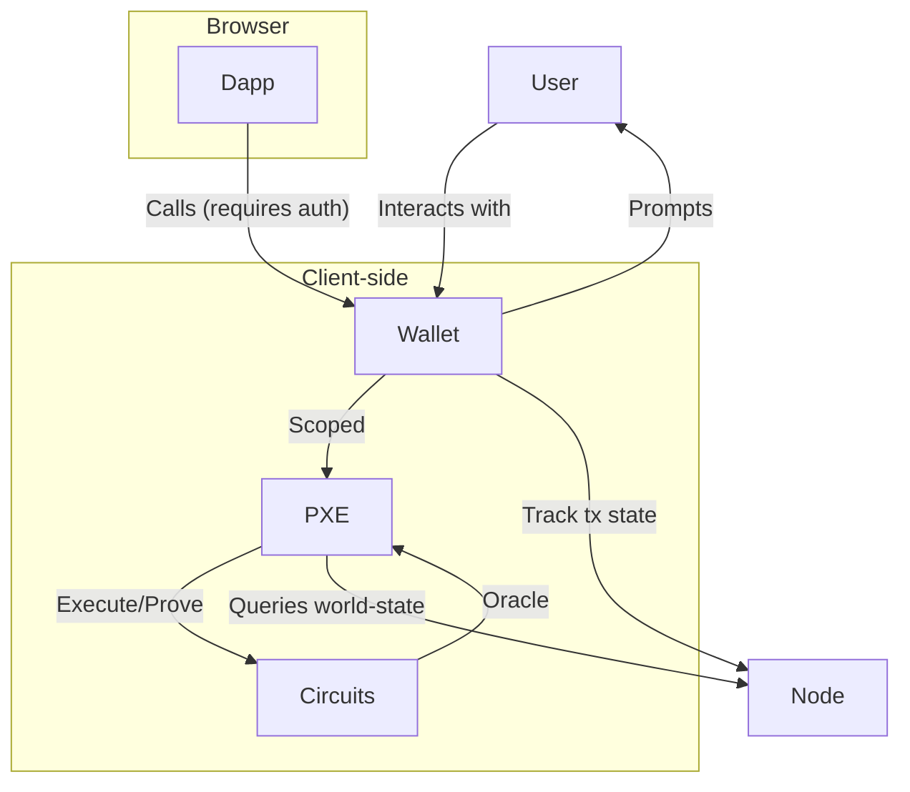

This page describes the Private Execution Environment (PXE, pronounced "pixie"), a client-side library for the execution of private operations. It is a TypeScript library that can be run within Node.js, inside wallet software or a browser.

The PXE generates proofs of private function execution, and sends these proofs along with public function execution requests to the sequencer. Private inputs never leave the client-side PXE.

The PXE is responsible for:

- storing secrets (e.g. encryption keys, notes, tagging secrets for note discovery) and exposing an interface for safely accessing them
- orchestrating private function (circuit) execution and proof generation, including implementing [oracles](../../aztec-nr/framework-description/advanced/protocol_oracles.md) needed for transaction execution
- syncing users' relevant network state, obtained from an Aztec node
- safely handling multiple accounts with siloed data and permissions

One PXE can handle data and secrets for multiple accounts, while also providing isolation between them as required.

## System architecture

:::note[Privacy consideration]
When the PXE queries the node for world state (e.g., to check if a nullifier exists), the node learns which data the user is interested in. This is a known tradeoff—users can mitigate this by running their own node.
:::

## Components

### Contract Function Simulator

An application prompts the user's PXE to execute a transaction (e.g. execute function X with arguments Y from account Z). The application or wallet may handle gas estimation.

The contract function simulator handles execution of smart contract functions by simulating transactions. It generates the required data and inputs for these functions, including partial witnesses and public inputs.

Until simulated simulations are implemented ([#9133](https://github.com/AztecProtocol/aztec-packages/issues/9133)), authentication witnesses are required for simulation before proving.

### Proof Generation

After simulation, the wallet calls `proveTx` on the PXE with all of the data generated during simulation and any [authentication witnesses](../advanced/authwit.md) (for allowing contracts to act on behalf of the user's account contract).

Once proven, the wallet sends the transaction to the network and sends the transaction hash back to the application.

### Database

The PXE database stores various types of data locally:

- **Notes**: Data representing users' private state. Notes are stored onchain as encrypted logs. Once discovered via [note tagging](../advanced/storage/note_discovery.md), notes are decrypted and stored locally in the PXE.
- **Authentication Witnesses**: Data used to approve others for executing transactions on your behalf. The PXE provides this data to transactions on-demand during transaction simulation via oracles.
- **Capsules**: Per-contract non-volatile local storage for caching computation results and persisting data across transactions. See [Using Capsules](../../aztec-nr/framework-description/advanced/how_to_use_capsules.md) for more details.
- **Address Book**: Complete addresses (address + public keys) for registered accounts and known senders. This enables the PXE to sync private logs tagged with registered sender addresses.

Note discovery is handled by Aztec contracts, not the PXE. This allows users to customize or update their note discovery mechanism as needed.

### Contract management

Applications can add contract code required for a user to interact with the application to the user's PXE. The PXE will check whether the required contracts have already been registered. There are no getters to check whether a contract has been registered, as this could leak privacy (e.g. a dapp could check whether specific contracts have been registered in a user's PXE and infer information about their interaction history).

### Keystore

The keystore securely stores cryptographic keys for registered accounts, including:

- **Nullifier keys**: Used to create nullifiers that invalidate notes when spent
- **Incoming viewing keys**: Used to decrypt notes sent to the account
- **Outgoing viewing keys**: Used to decrypt notes sent by the account
- **Tagging keys**: Used for note discovery via the tagging protocol

### Oracles

Oracles are pieces of data that are injected into a smart contract function from the client side. Learn more about [how oracles work](../../aztec-nr/framework-description/advanced/protocol_oracles.md).

## For developers

To learn how to develop on top of the PXE, refer to these guides:

- [Using capsules for local storage](../../aztec-nr/framework-description/advanced/how_to_use_capsules.md)
- [Using oracles in smart contracts](../../aztec-nr/framework-description/advanced/protocol_oracles.md)
- [Authentication witnesses](../advanced/authwit.md)

## Next steps

- [Wallets](../wallets.md) - Learn how wallets interact with the PXE
- [State management](../state_management.md) - Understand how private state is managed
- [Note discovery](../advanced/storage/note_discovery.md) - Learn how notes are discovered and synced
