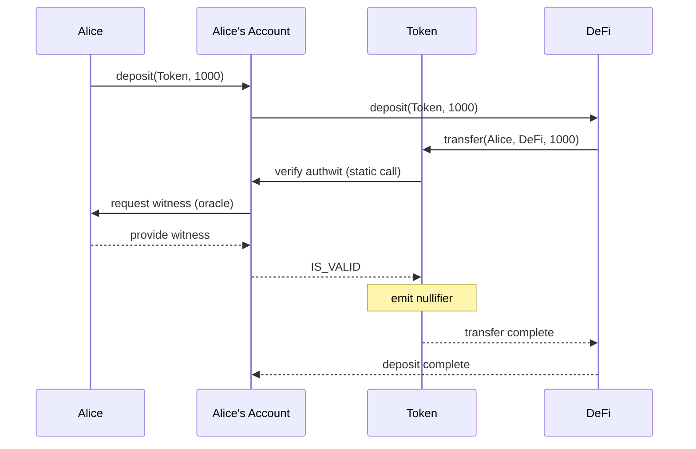
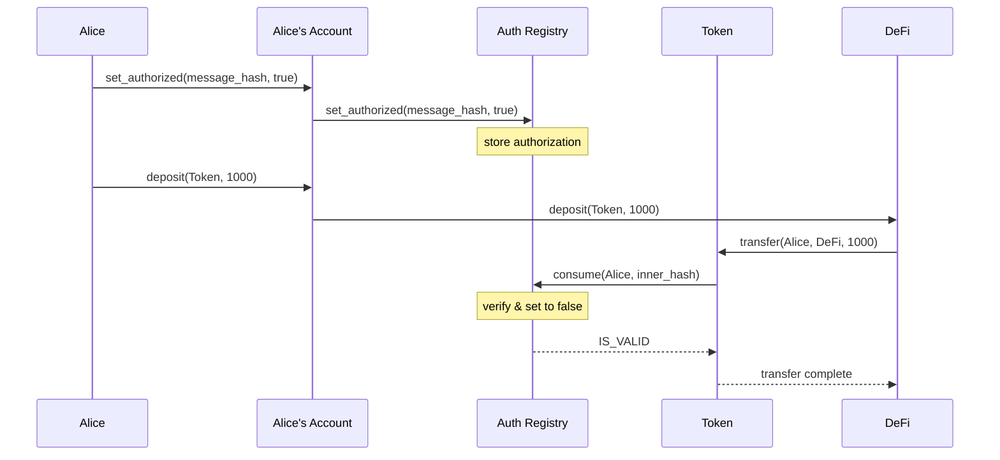

Authentication Witness is a scheme for authenticating actions on Aztec, allowing users to authorize third-parties (protocols or other users) to execute actions on their behalf.

## Summary

- **Authwits authorize specific actions**, not blanket allowances like ERC20 approvals
- **Two-level hash structure**: inner hash (caller, selector, args) wrapped in message hash (consumer, chain_id, version, inner_hash)
- **Private authwits** are verified via static calls to the account contract, with witnesses provided through oracles
- **Public authwits** use a shared registry where authorizations are stored and consumed
- **Single-use enforcement** through nullifiers prevents replay attacks
- **Implementation**: Use the `#[authorize_once]` macro in your contracts (see [implementation guide](../../guides/smart_contracts/how_to_use_authwit.md))

## Background

In traditional EVM contracts, users authorize third-party actions through `approve` (setting allowances) or `permit` (signed approvals). Both approaches have drawbacks: infinite approvals create security risks, two-transaction flows hurt UX, and smart contract wallets struggle with signature-based permits.

Aztec's private state model makes traditional approvals even more problematic. Even if you approve an allowance, the recipient can't spend your private tokens without knowing the note secrets. See [Hybrid State model](../storage/state_model.md) and [keys](../accounts/keys.md) for more on private state.

Authwits solve this by authorizing specific actions rather than blanket allowances, with verification happening through account contracts.

## How authwits work

Since private execution happens on the user's device, we can use oracles to provide authorization data mid-execution. The user provides a "witness" (proof of authorization) that the account contract validates.

:::info Witness vs signature
We use "witness" instead of "signature" because authorization doesn't require a cryptographic signature. Depending on the account contract implementation, it could be a password or other mechanism.
:::

### Hash structure

Authwits use a two-level hash structure:

**Inner hash** encodes the specific action being authorized:

```rust
inner_hash = H(caller, selector, args_hash)
```

**Message hash** wraps the inner hash with context to prevent cross-chain replay attacks:

```rust
message_hash = H(consumer, chain_id, version, inner_hash)
```

Where

- `caller` is the address attempting the action (e.g., a DeFi contract)
- `selector` is the function selector being called
- `args_hash` is the hash of the function arguments
- `consumer` is the contract verifying the authorization (e.g., the token contract)
- `chain_id` and `version` prevent cross-chain replay attacks

**Example:** Authorizing a DeFi contract to transfer tokens:

```rust
inner_hash = H(defi, transfer_selector, H(alice_account, defi, 1000));
message_hash = H(token, chain_id, version, inner_hash);
```

This reads as "defi is allowed to call the token's transfer function with arguments (alice_account, defi, 1000) on this specific chain".

### Private authwit flow

In private execution, the Token contract asks Alice's account contract to verify the authwit. The account contract requests the witness from Alice via an oracle, validates it, and returns the result.



:::info Static calls for security
The authwit verification uses a static call to the account contract. This prevents the account from re-entering the flow and modifying state during verification.
:::

### Public authwit flow

In public execution, oracles aren't available since the sequencer runs the code. Instead, authorizations are stored in a shared registry before use.



The registry approach has a gas optimization: if authorization is set and consumed in the same transaction, the state changes cancel out, saving gas.

### Replay prevention

Each authwit can only be used once. The consuming contract emits a nullifier for the action, preventing reuse. This is similar to how notes work.

To allow the same action multiple times (e.g., repeated transfers of the same amount), include a nonce in the arguments:

```rust
inner_hash = H(defi, transfer_selector, H(alice_account, defi, 1000, nonce));
```

The account contract cannot emit the nullifier (it's called via static call), so the consuming contract handles this. The authwit library manages this automatically.

### Cancelling authwits

You can cancel an authwit before it's used by emitting its nullifier directly. This invalidates the authwit without executing the authorized action:

```rust
fn cancel_authwit(inner_hash: Field) {
    let on_behalf_of = context.msg_sender();
    let nullifier = compute_authwit_nullifier(on_behalf_of, inner_hash);
    context.push_nullifier(nullifier);
}
```

## Differences from ERC20 approvals

| Aspect | ERC20 Approve | Authwit |
|--------|---------------|---------|
| Scope | Blanket allowance | Specific action |
| User awareness | Often unclear amounts | Exact action visible |
| Revocation | Requires transaction | Can cancel with nullifier |
| Private state | Cannot work (need note secrets) | Works via account contract |

:::note Private authwits and note secrets
While authwits authorize a contract to perform an action, spending private notes still requires knowledge of the note secrets. For private tokens, the note owner must be involved in the transaction&mdash;they cannot simply give another user an authwit and have that user spend the notes independently.
:::

## Use cases

Authwits work for any function requiring third-party authorization:

- Token transfers and burns
- DeFi deposits and withdrawals
- Governance voting
- Bridge operations (public to private transfers)
- Any contract interaction requiring user approval

## Implementation

Use the `#[authorize_once]` macro to add authwit verification to your contract functions:

```rust
#[authorize_once("from", "authwit_nonce")]
#[external("private")]
fn transfer_in_private(
    from: AztecAddress,
    to: AztecAddress,
    amount: u128,
    authwit_nonce: Field,
) {
    // Transfer logic here
}
```

The macro handles authwit verification and nullifier emission automatically.

For complete implementation details, see the [developer documentation](../../guides/smart_contracts/how_to_use_authwit.md).
