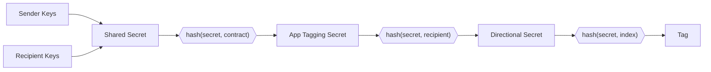

Note discovery refers to the process of a user identifying and decrypting [notes](../../storage/state_model.md#notes) that belong to them.

## Alternative approaches

Other protocols have explored different note discovery mechanisms. **Brute force** approaches download all notes and trial-decrypt each one, but this becomes prohibitively expensive as networks grow. **Offchain communication** has the sender share note content directly with recipients, avoiding onchain costs but introducing reliance on side channels. Aztec apps can use offchain communication if they wish, but the default mechanism is note tagging.

## Note tagging

Aztec uses note tagging as its default discovery mechanism. When creating a note, the sender _tags_ the log with a value that only the sender and recipient can identify. This allows recipients to efficiently query for relevant logs without downloading and attempting to decrypt everything.

### How it works

#### Every log has a tag

In Aztec, each emitted log is an array of fields, eg `[x, y, z]`. The first field (`x`) is a _tag_ field used to index and identify logs. The Aztec node exposes an API `getLogsByTags()` that can retrieve logs matching specific tags.

#### Tag generation

The sender and recipient share a predictable scheme for generating tags. The tag is derived from a shared secret and an index (a shared counter that increments each time the sender creates a note for the recipient).

Both parties derive the same shared secret via Diffie-Hellman key exchange, then hash in the contract address, recipient, and index to produce identical tags.

#### Discovering notes in Aztec contracts

Note discovery is implemented in contract code rather than by the PXE. The `#[aztec]` macro automatically injects the necessary discovery logic, so developers don't need to implement it manually. However, this approach means users can customize or replace the discovery mechanism to suit their needs.

### Limitations

- **You cannot receive notes from an unknown sender**. Without knowing the sender's address, you cannot create the shared secret needed to derive the note tag. Potential workarounds include having senders register themselves in a contract, allowing recipients to search for note tags from all registered senders.

- **Index synchronization can be complicated**. If transactions are reverted or mined out of order, the recipient may stop searching after receiving a tag with the latest expected index, potentially missing notes. Reusing the same index after a revert would create identical tags, linking the transactions and leaking privacy. This is mitigated by widening the search window and limiting how many notes a user can send from the same contract to the same recipient within a short time frame.
