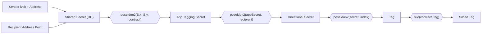

Note discovery refers to the process of a user identifying and decrypting [notes](../../state_management.md#notes) that belong to them.

## Alternative approaches

Other protocols have explored different note discovery mechanisms. **Brute force** approaches download all notes and trial-decrypt each one, but this becomes prohibitively expensive as networks grow. **Offchain communication** has the sender share note content directly with recipients, avoiding onchain costs but introducing reliance on side channels. Aztec apps can use offchain communication if they wish, but the default mechanism is note tagging.

## Note tagging

Aztec uses note tagging as its default discovery mechanism. When creating a note, the sender _tags_ the log with a value that only the sender and recipient can identify. This allows recipients to efficiently query for relevant logs without downloading and attempting to decrypt everything.

### How it works

#### Every log has a tag

In Aztec, each emitted log is an array of fields, e.g. `[tag, x, y, z]`. The first field is a _tag_ used to index and identify logs. The Aztec node indexes logs by their tag and exposes an API (`getPrivateLogsByTags()`) that retrieves logs matching specific tags.

#### Tag derivation

The sender and recipient share a predictable scheme for generating tags. Tags are derived through a layered hashing process that makes them specific to a particular sender-recipient pair, contract, and sequence number.



The derivation has four stages:

1. **Shared secret**: The sender and recipient compute the same shared secret via Diffie-Hellman key exchange on the Grumpkin curve. Each party uses their [incoming viewing secret key](../../accounts/keys.md#incoming-viewing-keys) (`ivsk`) and the other party's address point: `S = (preaddress + ivsk) × AddressPoint`.

2. **App tagging secret**: The shared secret is hashed with the contract address to produce a per-contract secret: `poseidon2(S.x, S.y, contract_address)`. This ensures tags from different contracts cannot be linked.

3. **Directional secret**: The app secret is hashed with the recipient address: `poseidon2(appSecret, recipient)`. This makes the secret asymmetric — tags from Alice to Bob differ from tags from Bob to Alice.

4. **Tag**: The directional secret is hashed with an index (a counter that increments for each log the sender emits to this recipient in this contract): `poseidon2(directionalSecret, index)`.

When the log is emitted, the protocol kernel **siloes** the tag with the contract address before it appears onchain. This siloed tag is what the node stores and indexes. Both the sender and recipient can independently compute the siloed tags and use them to query the node.

#### The sender in note tagging

The "sender" in note tagging is **not necessarily the transaction sender**. It's the **sender for tags**, which account contracts set by calling `set_sender_for_tags(account_address)` before making calls to other contracts. This is typically the account contract address itself.

This sender address is used along with the recipient address to compute the shared secret via Diffie-Hellman key exchange, which is then used to derive the tag.

#### Registering known senders

To discover notes from a particular sender, the recipient's PXE must know the sender's address in advance so it can compute the shared tagging secret. Register senders using the wallet API:

```typescript
// Register a sender so your PXE can discover notes from them
await wallet.registerSender(senderAddress);
```

Notes sent to yourself are always discoverable — the PXE automatically adds all local accounts as implicit senders.

### The sync process

The `#[aztec]` macro automatically injects an unconstrained `sync_state` utility function into every contract. This function is invoked by the PXE during note syncing to orchestrate discovery via oracles; manual execution is forbidden by the PXE to prevent inconsistencies. The process works as follows:

1. **Fetch tagged logs**: The contract calls the `fetchTaggedLogs` oracle. The PXE computes tags for every (sender, recipient) pair it knows about, queries the node for matching logs, and returns them to the contract.

2. **Decrypt**: For each log, the contract strips the tag and attempts AES-128 decryption using a symmetric key derived from the recipient's private key (via ECDH). Logs that don't decrypt are silently discarded (they were not intended for this recipient).

3. **Parse message type**: Successfully decrypted messages are dispatched by type — private notes, partial notes, or private events.

4. **Nonce discovery** (for notes): To confirm a decrypted note is valid, the system must match it against the unique note hashes emitted in the same transaction. It iterates the note hashes in the transaction, computes candidate nonces using `compute_note_hash_nonce(first_nullifier, note_index)` (a domain-separated Poseidon2 hash), and checks whether recomputing the unique note hash with each candidate nonce produces a match. A match confirms the note was emitted in this transaction and provides the nonce needed to later nullify it. (Note hash tree inclusion is validated separately.)

5. **Store**: Validated notes are added to the PXE database, making them available for use in future transactions.

Developers don't need to implement any of this manually — the `#[aztec]` macro handles it. However, since the discovery logic lives in contract code (called via oracles to the PXE), users can customize or replace the discovery mechanism to suit their needs.

#### The sliding window algorithm

The PXE doesn't scan all possible tag indexes — it uses a window-based approach to efficiently find new logs:

- It tracks the **highest aged index**: the highest tag index seen in a block at least 24 hours old (`MAX_TX_LIFETIME`). Once a block is this old, no new transactions can reference it as an anchor, so no new logs can appear at or below that index.
- It tracks the **highest finalized index**: the highest tag index seen in any finalized block.
- It scans from the aged index to 20 indexes beyond the finalized index, covering both recent and in-flight logs.

This means there's a practical limit on how many logs a single sender can emit to the same recipient in the same contract within a short time period. For most applications this limit is not a concern.

### Limitations and solutions

#### You cannot receive tagged notes from an unknown sender

Without knowing the sender's address, you cannot create the shared secret needed to derive the note tag. This is a fundamental limitation of the current tagging scheme.

There are three broad families of solutions to this problem:

**a) Brute force search** - Scan every single log and test if it decrypts. This has obvious performance issues as the network grows and becomes prohibitively expensive.

**b) Tagging with known sender** (current implementation) - You know who will send you messages and search for those specifically. This is very fast and allows you to remove senders who spam you. However, we don't currently have a mechanism for constraining this (i.e., guaranteeing that the recipient will find the message).

**c) Tagging with handshaking** - An intermediate solution where you can be notified of new senders. A handshake occurs onchain that lets the recipient discover a new sender, and from that point on there's regular tagging. This design either:
- Is fast but leaks privacy (e.g., a public event with "new handshake for Alice!")
- Is slow but doesn't leak (you brute force scan all logs from a handshake contract, testing if any handshakes are for you)

The handshaking design space is large — for example, you could set up infrastructure where a server searches handshakes for you, trading off infrastructure requirements for performance.

**Handshaking is not currently implemented in Aztec.nr.** For now, if you need to receive notes from unknown senders, potential workarounds include:
- Having senders register themselves in a contract first, allowing recipients to search for note tags from all registered senders
- Using offchain communication to share sender addresses with recipients, who then call `wallet.registerSender(address)` to enable discovery
- Implementing a custom discovery mechanism in your contract

See the [Note Delivery](../../../aztec-nr/framework-description/note_delivery.md) documentation for more details on how the sender is used when delivering notes.

## Advanced cryptography techniques

Beyond the tagging system described above, there are more advanced cryptographic techniques for note discovery:

- **Oblivious message retrieval (OMR)**: Allows retrieving messages without the server knowing which messages were accessed
- **Private information retrieval (PIR)**: Enables querying a database without revealing which records you're interested in

These techniques would solve a privacy leak that exists with the current tagging system: when your PXE queries an Aztec node for logs with specific tags, the node can observe your IP address and correlate it with which tags (and therefore which transactions) you're interested in. Even though the logs are encrypted, this network-level metadata can leak information about your activity.

OMR and PIR would eliminate this issue by allowing you to retrieve your logs without the node knowing which ones you requested. However, these methods are currently impractical in production due to computational costs. They represent a long-term goal for achieving stronger privacy guarantees.
