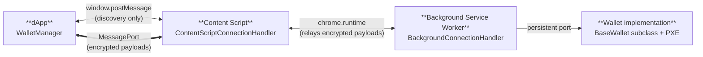

The `@aztec/wallet-sdk` package defines the protocol that dApps and wallet extensions use to talk to each other on Aztec. It is analogous to EIP-1193 on Ethereum, with built-in encryption and visual MITM verification.

This section covers both sides of the integration:

- [Connecting a dApp to a wallet](./dapp_integration.md): discovery, secure channel, capabilities, and using the `Wallet` proxy.
- [Building a wallet extension](./wallet_integration.md): implementing discovery, sessions, message routing, and `BaseWallet`.

For a complete API listing, see the [`@aztec/wallet-sdk` reference](pathname:///typescript-api/mainnet/wallet-sdk.md).

## What the SDK provides

| Feature | Description |
|---|---|
| Wallet discovery | dApps broadcast via `window.postMessage`; extensions respond after user approval |
| ECDH key exchange | P-256 ephemeral key pairs derive a shared secret per session |
| AES-256-GCM encryption | All wallet method calls and responses are encrypted after key exchange |
| Emoji verification | A 9-emoji grid (72-bit security) lets the user confirm there is no man-in-the-middle |
| Capability permissions | dApps declare what they need; wallets grant or deny each capability |
| Trusted origin reconnect | Wallets may remember origins they have approved before and streamline later reconnects (wallet-managed policy, not framework state) |
| `BaseWallet` | Abstract class that wallet extensions extend to get `sendTx`, `simulateTx`, `batch`, and more |

## Architecture

Discovery uses `window.postMessage` (unencrypted, public). When the user approves the request, the content script creates a `MessageChannel` and transfers one port to the page. The dApp and the content script share the encrypted channel directly; the content script relays payloads to the background service worker over `chrome.runtime`. Encryption keys live on the dApp and the background, so the content script and `chrome.runtime` only see ciphertext.

## Security model

The protocol has three phases with increasing trust.

1. **Discovery (public).** The dApp broadcasts a request. Extensions only respond after the user explicitly approves the connection in their extension popup. No cryptographic material is exchanged.
2. **Key exchange (authenticated).** Both sides generate ephemeral ECDH P-256 key pairs. The shared secret is expanded via HKDF into an AES-256-GCM encryption key and an HMAC verification key. A 2-second timeout limits the window for interception.
3. **Verified channel (encrypted).** The HMAC verification key produces a hash that both sides convert to a 9-emoji grid. The user visually confirms the emojis match on both the dApp and the wallet, defending against man-in-the-middle attacks. After confirmation, all messages are encrypted with AES-256-GCM.

## Where to start

- Building a dApp that needs to connect to a wallet → [Connecting a dApp to a wallet](./dapp_integration.md).
- Building a browser extension wallet → [Building a wallet extension](./wallet_integration.md).
- Need a quick conceptual primer on what wallets do → [Wallets foundational topic](../../foundational-topics/wallets.md).
