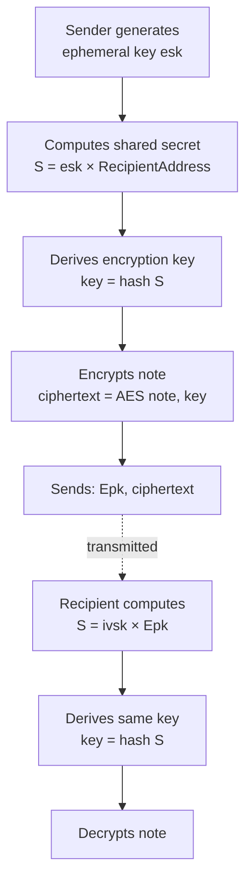

## Account Keys in Aztec

Unlike traditional blockchains where accounts use a single key pair, Aztec accounts use **multiple specialized key pairs**, each serving a distinct cryptographic purpose. This separation is fundamental to Aztec's privacy model and enables powerful security features that aren't possible with single-key systems.

## Why Multiple Keys?

The separation of keys in Aztec serves critical purposes:

- **Privacy isolation**: Different keys for different operations prevent correlation attacks
- **Selective disclosure**: Share viewing access without compromising spending ability
- **Damage limitation**: If one key is compromised, others remain secure
- **Flexible authorization**: Choose any authentication method without affecting core protocol keys
- **Per-application security**: Keys can be scoped to specific contracts to minimize exposure

This multi-key architecture is what enables Aztec to provide strong privacy guarantees while maintaining flexibility and security.

## Key Types

Each Aztec account uses multiple key pairs:

| Key Type | Purpose | Protocol Managed | Rotatable |
|----------|---------|-----------------|-----------|
| **Nullifier Keys** (`Npk_m`) | Spending notes (destroying private state) | Yes | No |
| **Incoming Viewing Keys** (`Ivpk_m`) | Decrypting received notes | Yes | No |
| **Outgoing Viewing Keys** (`Ovpk_m`) | Reserved — not currently used | Yes | No |
| **Tagging Keys** (`Tpk_m`) | Reserved — not currently used | Yes | No |
| **Message-Signing Keys** (`Mspk_m`) | Reserved — slot for future protocol-level message signing | Yes | No |
| **Fallback Keys** (`Fbpk_m`) | Reserved — slot for future account-recovery / fallback flows | Yes | No |
| **Signing Keys** | Transaction authorization | No (app-defined) | Yes |

Protocol keys are embedded into the protocol and cannot be changed once an account is created. The signing key is abstracted to the account contract developer, allowing complete flexibility in authentication methods.

### Nullifier Keys

**Purpose**: Spending notes (private state consumption)

Nullifier keys enable spending private notes. When using a note (like spending a token), the spender must prove they have the right to nullify it - essentially marking it as "spent" without revealing which note is being spent.

**How it works:**

1. Each account has a master nullifier key pair (`Npk_m`, `nhk_m`)
2. For each application, an **app-siloed** key is derived: `nhk_app = hash(nhk_m, app_contract_address)`
3. To spend a note, compute its nullifier using the note hash and app-siloed key
4. The protocol verifies the app-siloed key comes from your master key and that your master public key is in your address

This ensures only the rightful owner can spend notes, while the app-siloing provides additional security isolation between contracts.

:::tip

This last point could be confusing for most developers: how could a protocol verify a secret key is derived from another secret key without knowing it? Well, _you_ make that derivation, generating a ZK proof for it. The protocol just verifies that ZK proof!

:::

#### Accessing nullifier keys in code

The nullifier hiding key (`nhk`) — sometimes referred to in older documentation as the "nullifier secret key" (`nsk`) — is the secret scalar used to compute nullifiers. You should **never** derive or construct this key manually. Use the framework-provided functions:

| Context | Function | Import / Access |
|---------|----------|----------------|
| Private (constrained) | `context.request_nhk_app(owner_npk_m_hash)` | Called on `&mut PrivateContext` |
| Unconstrained | `get_nhk_app(owner_npk_m_hash)` | `use aztec::keys::getters::get_nhk_app` |
| TypeScript (master key) | `deriveMasterNullifierHidingKey(secretKey)` | `import { deriveMasterNullifierHidingKey } from '@aztec/aztec.js/keys'` |
| TypeScript (app-siloed) | `computeAppNullifierHidingKey(nhkM, app)` | `import { computeAppNullifierHidingKey } from '@aztec/aztec.js/keys'` |

To get the owner's master nullifier public key hash (needed as input):

```rust
let owner_npk_m_hash = get_public_keys(owner).npk_m_hash;
```

`PublicKeys` exposes the nullifier, outgoing-viewing, and tagging keys directly as their hashes; only `ivpk_m` is held as a Grumpkin point (it is required as a point for address derivation and encrypt-to-address).

:::warning
Do not compute nullifier keys by hand or derive custom blinding factors. The protocol kernel validates that `nhk_app` derives correctly from the master key — a hand-rolled value will fail verification.
:::

### Incoming Viewing Keys

**Purpose**: Receiving and decrypting private notes

Incoming viewing keys enable private information to be shared with recipients. The sender uses the recipient's public viewing key (`Ivpk`) to encrypt notes, and the recipient uses their secret viewing key (`ivsk`) to decrypt them.

**The encryption flow:**



This uses elliptic curve Diffie-Hellman: both parties compute the same shared secret `S`, but only the recipient has the private key needed to decrypt.

### Signing Keys

**Purpose**: Transaction authorization (optional, application-defined)

Unlike nullifier and incoming viewing keys which are protocol-mandated, signing keys are **completely abstracted** - thanks to [native account abstraction](./index.md), any authorization method can be implemented:

- **Signature-based**: ECDSA, Schnorr, BLS, multi-signature
- **Biometric**: Face ID, fingerprint
- **Web2 credentials**: Google OAuth, passkeys
- **Custom logic**: Time locks, spending limits, multi-party authorization

**Traditional signature approach:**

When using signatures, the account contract validates the signature against a stored public key. Here's an example from the Schnorr account contract:

```rust title="is_valid_impl" showLineNumbers 
// Load public key from storage
let storage = Storage::init(context);
let public_key = storage.signing_public_key.get_note();

// Safety: The witness is only used as a "magical value" that makes the signature verification below pass.
// Hence it's safe.
let limbs: [Field; 4] = unsafe { get_auth_witness(outer_hash) };
let signature = (
    std::embedded_curve_ops::EmbeddedCurveScalar::new(limbs[0], limbs[1]),
    std::embedded_curve_ops::EmbeddedCurveScalar::new(limbs[2], limbs[3]),
);

let pub_key = std::embedded_curve_ops::EmbeddedCurvePoint { x: public_key.x, y: public_key.y };
// Verify signature of the payload bytes
schnorr::verify_signature(pub_key, signature, outer_hash)
```
> <sup><sub><a href="https://github.com/AztecProtocol/aztec-packages/blob/v5.0.0-rc.2/noir-projects/noir-contracts/contracts/account/schnorr_account_contract/src/main.nr#L67-L83" target="_blank" rel="noopener noreferrer">Source code: noir-projects/noir-contracts/contracts/account/schnorr_account_contract/src/main.nr#L67-L83</a></sub></sup>


The flexibility of signing key storage and rotation is entirely up to your account contract implementation.

## Address Derivation

Your Aztec address is deterministically computed from your public keys and account contract. This enables anyone to encrypt notes to your address without needing additional information.


:::note
The diagram above is being updated to reflect the new key-hashing scheme described below. Treat the text formulas as authoritative until a refresh lands.
:::

```text
pre_address = hash(public_keys_hash, partial_address)

where:
  public_keys_hash = hash(npk_m_hash, ivpk_m_hash, ovpk_m_hash, tpk_m_hash,
                          mspk_m_hash, fbpk_m_hash)
  ivpk_m_hash      = hash(Ivpk_m.x, Ivpk_m.y)        // computed in-circuit
  npk_m_hash, ovpk_m_hash, tpk_m_hash,               // computed off-circuit (PXE)
  mspk_m_hash, fbpk_m_hash                           // computed off-circuit (PXE)
  partial_address  = hash(contract_class_id, salted_initialization_hash)
  contract_class_id = hash(artifact_hash, fn_tree_root, public_bytecode_commitment)
  salted_initialization_hash = hash(salt, constructor_hash, deployer_address, immutables_hash)
```

The final address is derived as `address = (pre_address * G + Ivpk_m).x` - only the x-coordinate of the resulting elliptic curve point. Note that `Ivpk_m` (the master incoming viewing key) is the only public key still represented as an elliptic curve point: address derivation needs it as a point so that anyone can encrypt to the address without further information. The other five master keys are exposed only as their hashes.

This derivation ensures:

- Your address is deterministic (can be computed before deployment)
- Keys and contract code are cryptographically bound to the address
- The address proves ownership of the nullifier key needed to spend notes

:::note
The `Ovpk` (outgoing viewing key) and `Tpk` (tagging key) exist in the protocol's `PublicKeys` struct but are not currently used. They're reserved for future protocol upgrades.
:::

:::note
The `Mspk` (master message-signing key) and `Fbpk` (master fallback key) hash slots exist in `PublicKeys` and participate in the address derivation above, but there is **no canonical derivation path for them yet**. `deriveKeys(secretKey)` stamps the canonical default hashes (`DEFAULT_MSPK_M_HASH`, `DEFAULT_FBPK_M_HASH`) into every account, so today they contribute no per-account entropy. When a real derivation lands in a future release, the address derived from the same secret will change — see the migration notes.
:::

## Key Management

### Key Generation and Derivation

Protocol keys (nullifier and incoming viewing) are automatically generated by the [Private Execution Environment (PXE)](../pxe/index.md) when creating an account. The PXE handles:

- Initial key pair generation
- App-siloed key derivation
- Secure key storage and oracle access
- Key material never leaves the client

All keys use elliptic curve cryptography on the Grumpkin curve:

- Secret keys are scalars
- Public keys are elliptic curve points (secret × generator point)

Signing keys are application-defined and managed by your account contract logic.

### App-Siloed Keys

Nullifier keys are **app-siloed** - scoped to each contract that uses them. This provides crucial security isolation:

**How it works:**

```text
nhk_app = hash(nhk_m, app_contract_address)
```

**Security benefits:**

1. **Damage containment**: If a nullifier key for one app leaks, other apps remain secure
2. **Privacy preservation**: Activity in different apps cannot be correlated via nullifier keys

### Key Rotation

**Protocol keys (nullifier, incoming viewing):** Cannot be rotated. They are embedded in the address, which is immutable. If compromised, a new account must be deployed.

**Signing keys:** Fully rotatable, depending on the account contract implementation. Options include:

- Change keys on a schedule
- Rotate after suspicious activity
- Implement time-delayed rotation for security

## Summary

Aztec's multi-key architecture is fundamental to its privacy and security model:

| Key Type | Purpose | App-Siloed | Rotatable | Managed By |
|----------|---------|------------|-----------|------------|
| **Nullifier** (`Npk_m`) | Spend notes | Yes | No | Protocol (PXE) |
| **Incoming Viewing** (`Ivpk_m`) | Decrypt received notes | No | No | Protocol (PXE) |
| **Outgoing Viewing** (`Ovpk_m`) | Reserved | N/A | No | Protocol (PXE) |
| **Tagging** (`Tpk_m`) | Reserved | N/A | No | Protocol (PXE) |
| **Message-Signing** (`Mspk_m`) | Reserved | N/A | No | Protocol (PXE) |
| **Fallback** (`Fbpk_m`) | Reserved | N/A | No | Protocol (PXE) |
| **Signing** | Transaction authorization | N/A | Yes | Application |

**Key takeaways:**

- **Separation enables privacy**: Different keys for different operations prevent correlation and limit damage from compromise
- **App-siloing adds security**: Per-contract nullifier keys isolate risk
- **Flexibility in authorization**: Signing keys are completely abstracted - use any authentication method
- **Protocol keys are permanent**: Nullifier and viewing keys are embedded in your address and cannot be changed
- **Client-side security**: All key material is generated and managed in the PXE, never exposed to the network

This architecture allows Aztec to provide strong privacy guarantees while maintaining the flexibility needed for various security models and use cases.
