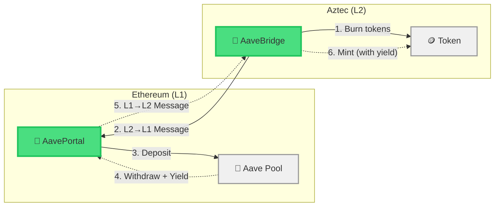
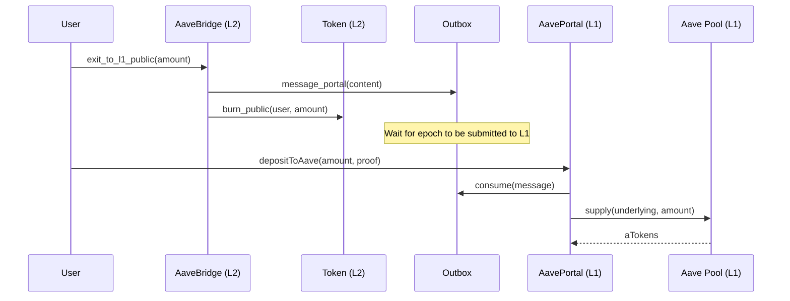
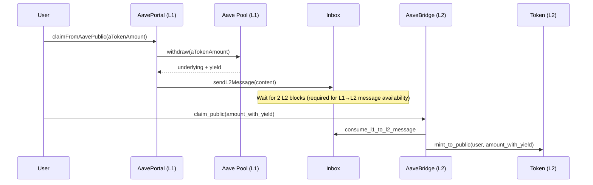

## Why DeFi from Aztec?

Imagine you hold DAI on Aztec L2. Gas is cheap, transactions are private, but your tokens are just sitting there. What if you could deposit them into Aave on Ethereum, earn yield, and then bring those yield-bearing tokens back to Aztec?

In this tutorial, you'll build exactly that: a **cross-chain DeFi bridge** that moves tokens between Aztec and Aave's lending pool on Ethereum. By the end, you'll understand how to compose L1 DeFi protocols with Aztec's cross-chain messaging system.

## What You'll Build

The diagram below shows the full round-trip, starting from tokens the user already holds on L2:



You'll create:

- **AaveBridge (L2)** — A Noir contract that burns/mints tokens and sends/consumes cross-chain messages
- **AavePortal (L1)** — A Solidity contract that interacts with Aave and handles L1↔L2 messaging
- **Mock Aave contracts** — Simplified mocks of Aave's lending pool for local testing
- **Integration script** — A TypeScript script that deploys everything and runs the full flow

## Prerequisites

- [Aztec local network running at version v5.0.1](../../../getting_started_on_local_network.md) (includes Aztec CLI and Node.js v24+)
- [Hardhat](https://hardhat.org/getting-started) installed for Solidity compilation and deployment
- Familiarity with the [Token Bridge tutorial](./token_bridge.md) (recommended)
- Basic understanding of [cross-chain messaging](../../foundational-topics/ethereum-aztec-messaging/index.md)

## Understanding the Flow

The bridge has two directions: **depositing** tokens from L2 into Aave on L1, and **claiming** them back (with yield) on L2.

### Deposit Flow (L2 → Aave)



### Claim Flow (Aave → L2)



## Project Setup

Start with the Hardhat + Aztec template. This provides a pre-configured Hardhat project with Aztec dependencies and Solidity compilation settings:

:::note

This template is a community-maintained starter. If the repository is unavailable, you can set up a Hardhat project manually and add the `@aztec/*` Solidity remappings from the [cross-chain messaging docs](../../foundational-topics/ethereum-aztec-messaging/index.md).

You may need to update the `@aztec/l1-contracts` tag in the template's `package.json` to match your Aztec version, e.g.:

```json
"@aztec/l1-contracts": "git+https://github.com/AztecProtocol/l1-contracts.git#v5.0.1"
```

:::

```bash
git clone https://github.com/critesjosh/hardhat-aztec-example
cd hardhat-aztec-example
```

When complete, your project will have this structure:

```
hardhat-aztec-example/
  contracts/                     # Solidity contracts (Hardhat default)
    MockERC20.sol
    MockAToken.sol
    MockAavePool.sol
    AavePortal.sol
  contracts/aztec/               # Noir contracts
    aave_bridge/
      contract/src/main.nr
      contract/src/config.nr
      contract/Nargo.toml
    aave_bridge_test/
      src/Nargo.toml
      src/lib.nr
  scripts/
    index.ts                     # Integration script
  artifacts/                     # Generated by aztec codegen
```

Add the Aztec dependencies:

```bash
yarn add @aztec/aztec.js@5.0.1 @aztec/accounts@5.0.1 @aztec/wallets@5.0.1 @aztec/stdlib@5.0.1 @aztec/foundation@5.0.1 @aztec/ethereum@5.0.1 @aztec/noir-contracts.js@5.0.1 @aztec/viem@2.38.2 tsx
```

Start the local network in another terminal:

```bash
aztec start --local-network
```

## Part 1: The L2 Bridge Contract

The L2 bridge is the simpler side. It doesn't know anything about Aave — it just burns/mints tokens and passes messages. All the Aave-specific logic lives on L1.

:::note
The L2 bridge is intentionally protocol-agnostic — it just burns/mints tokens and relays messages. All Aave-specific logic lives on L1. This means you can compose with any L1 protocol without changing your L2 contract. If you've completed the [Token Bridge tutorial](./token_bridge.md), you'll recognize the pattern and can skim to [Part 2](#part-2-the-ethereum-side).
:::

Create the bridge contract:

```bash
aztec new contracts/aztec/aave_bridge
cd contracts/aztec/aave_bridge
```

The `aztec new` command creates a workspace with a `contract` crate and a `test` crate. Replace the generated test file at `test/src/lib.nr` with a basic constructor test:

```rust
use aztec::protocol::address::{AztecAddress, EthAddress};
use aztec::protocol::traits::FromField;
use aztec::test::helpers::test_environment::TestEnvironment;
use aave_bridge::AaveBridge;

#[test]
unconstrained fn test_constructor() {
    let mut env = TestEnvironment::new();
    let deployer = env.create_light_account();

    let token = AztecAddress::from_field(1);
    let portal = EthAddress::from_field(2);

    let initializer = AaveBridge::interface().constructor(token, portal);
    let _contract_address =
        env.deploy("@aave_bridge/AaveBridge").with_public_initializer(deployer, initializer);
}
```

The bridge reuses the existing `Token` contract and the `token_portal_content_hash_lib` for content hash functions. Add these dependencies to `contracts/aztec/aave_bridge/aave_bridge_contract/Nargo.toml`:

```toml
[dependencies]
aztec = { git="https://github.com/AztecProtocol/aztec-packages", tag = "v5.0.1", directory = "noir-projects/aztec-nr/aztec" }
token_portal_content_hash_lib = { git="https://github.com/AztecProtocol/aztec-packages", tag = "v5.0.1", directory = "noir-projects/noir-contracts/contracts/libs/token_portal_content_hash_lib" }
token = { git="https://github.com/AztecProtocol/aztec-packages", tag = "v5.0.1", directory = "noir-projects/noir-contracts/contracts/app/token_contract" }
```

### Bridge Storage

The bridge stores two things: the L2 token address and the L1 portal address. First, create the config module at `contracts/aztec/aave_bridge/aave_bridge_contract/src/config.nr`:

```rust title="config" showLineNumbers 
use aztec::protocol::{
    address::{AztecAddress, EthAddress},
    traits::{Deserialize, Packable, Serialize},
};
use std::meta::derive;

#[derive(Deserialize, Eq, Packable, Serialize)]
pub struct Config {
    pub token: AztecAddress,
    pub portal: EthAddress,
}
```
> <sup><sub><a href="https://github.com/AztecProtocol/aztec-packages/blob/v5.0.1/docs/examples/contracts/aave_bridge/src/config.nr#L1-L13" target="_blank" rel="noopener noreferrer">Source code: docs/examples/contracts/aave_bridge/src/config.nr#L1-L13</a></sub></sup>


Then replace `contracts/aztec/aave_bridge/aave_bridge_contract/src/main.nr`:

<!-- wrapped in a code block to add a "}" at the end -->

```rust
mod config;

// A bridge contract that allows users to deposit tokens into Aave on L1 from Aztec L2,
// and claim yield-bearing tokens back on L2. The bridge mirrors TokenBridge's pattern:
// all Aave-specific logic lives on L1, while L2 simply burns/mints tokens and passes messages.

use aztec::macros::aztec;
#[aztec]
pub contract AaveBridge {
    use crate::config::Config;

    use aztec::{protocol::address::{AztecAddress, EthAddress}, state_vars::PublicImmutable};

    use token_portal_content_hash_lib::{
        get_mint_to_private_content_hash, get_mint_to_public_content_hash,
        get_withdraw_content_hash,
    };

    use token::Token;

    use aztec::macros::{functions::{external, initializer, view}, storage::storage};

    #[storage]
    struct Storage<Context> {
        config: PublicImmutable<Config, Context>,
    }

    #[external("public")]
    #[initializer]
    fn constructor(token: AztecAddress, portal: EthAddress) {
        self.storage.config.initialize(Config { token, portal });
    }

    #[external("private")]
    #[view]
    fn get_config() -> Config {
        self.storage.config.read()
    }
}
```

:::warning Assembling the Contract
The code above shows the contract opening — imports, storage, constructor, and a getter — followed by a closing `}`. In the sections below, you'll add more functions **inside** this contract body. Place them before the final `}` so they are part of `pub contract AaveBridge { ... }`.
:::

### Public Claim and Exit

Add the following functions inside the `AaveBridge` contract body (before the closing `}`). `claim_public` consumes an L1→L2 message and mints tokens. `exit_to_l1_public` burns tokens and sends an L2→L1 message:

```rust title="claim_public" showLineNumbers 
/// Consume an L1->L2 message and mint tokens publicly.
/// Called after the L1 AavePortal withdraws from Aave and sends a message.
#[external("public")]
fn claim_public(to: AztecAddress, amount: u128, secret: Field, message_leaf_index: Field) {
    let content_hash = get_mint_to_public_content_hash(to, amount);
    let config = self.storage.config.read();

    // Consume message and emit nullifier
    self.context.consume_l1_to_l2_message(
        content_hash,
        [secret],
        config.portal,
        message_leaf_index,
    );

    // Mint tokens (including any yield from Aave)
    self.call(Token::at(config.token).mint_to_public(to, amount));
}
```
> <sup><sub><a href="https://github.com/AztecProtocol/aztec-packages/blob/v5.0.1/docs/examples/contracts/aave_bridge/src/main.nr#L42-L61" target="_blank" rel="noopener noreferrer">Source code: docs/examples/contracts/aave_bridge/src/main.nr#L42-L61</a></sub></sup>


```rust title="exit_to_l1_public" showLineNumbers 
/// Burn tokens publicly and create an L2->L1 message.
/// The L1 AavePortal will consume this message and deposit into Aave.
#[external("public")]
fn exit_to_l1_public(
    recipient: EthAddress,
    amount: u128,
    caller_on_l1: EthAddress,
    authwit_nonce: Field,
) {
    let config = self.storage.config.read();

    // Send an L2 to L1 message
    let content = get_withdraw_content_hash(recipient, amount, caller_on_l1);
    self.context.message_portal(config.portal, content);

    // Burn tokens
    self.call(Token::at(config.token).burn_public(self.msg_sender(), amount, authwit_nonce));
}
```
> <sup><sub><a href="https://github.com/AztecProtocol/aztec-packages/blob/v5.0.1/docs/examples/contracts/aave_bridge/src/main.nr#L89-L108" target="_blank" rel="noopener noreferrer">Source code: docs/examples/contracts/aave_bridge/src/main.nr#L89-L108</a></sub></sup>


The `authwit_nonce` parameter supports [authentication witnesses](../../aztec-js/how_to_use_authwit.md). When the caller is the token owner (`msg.sender`), pass `0` — no authorization witness is needed. If a third party calls this function on behalf of the owner, they must provide a valid nonce from an authwit the owner previously created.

### Private Claim and Exit

Still inside the contract body, add the private variants. They work the same way but use private token operations. The recipient's address is hidden when claiming privately:

```rust title="claim_private" showLineNumbers 
/// Consume an L1->L2 message and mint tokens privately.
/// The recipient's address is not revealed, but the amount is.
#[external("private")]
fn claim_private(
    recipient: AztecAddress,
    amount: u128,
    secret_for_L1_to_L2_message_consumption: Field,
    message_leaf_index: Field,
) {
    let config = self.storage.config.read();

    // Consume L1 to L2 message and emit nullifier
    let content_hash = get_mint_to_private_content_hash(amount);
    self.context.consume_l1_to_l2_message(
        content_hash,
        [secret_for_L1_to_L2_message_consumption],
        config.portal,
        message_leaf_index,
    );

    // Mint tokens privately
    self.call(Token::at(config.token).mint_to_private(recipient, amount));
}
```
> <sup><sub><a href="https://github.com/AztecProtocol/aztec-packages/blob/v5.0.1/docs/examples/contracts/aave_bridge/src/main.nr#L63-L87" target="_blank" rel="noopener noreferrer">Source code: docs/examples/contracts/aave_bridge/src/main.nr#L63-L87</a></sub></sup>


```rust title="exit_to_l1_private" showLineNumbers 
/// Burn tokens privately and create an L2->L1 message.
/// The L1 AavePortal will consume this message and deposit into Aave.
#[external("private")]
fn exit_to_l1_private(
    token: AztecAddress,
    recipient: EthAddress,
    amount: u128,
    caller_on_l1: EthAddress,
    authwit_nonce: Field,
) {
    let config = self.storage.config.read();

    // Assert that user provided token address is same as seen in storage
    assert_eq(config.token, token, "Token address is not the same as seen in storage");

    // Send an L2 to L1 message
    let content = get_withdraw_content_hash(recipient, amount, caller_on_l1);
    self.context.message_portal(config.portal, content);

    // Burn tokens privately
    self.call(Token::at(token).burn_private(self.msg_sender(), amount, authwit_nonce));
}
```
> <sup><sub><a href="https://github.com/AztecProtocol/aztec-packages/blob/v5.0.1/docs/examples/contracts/aave_bridge/src/main.nr#L110-L133" target="_blank" rel="noopener noreferrer">Source code: docs/examples/contracts/aave_bridge/src/main.nr#L110-L133</a></sub></sup>


:::info Content Hash Matching

The content hash is the critical link between L1 and L2. Both sides must produce the exact same hash for a message to be consumed. The `token_portal_content_hash_lib` handles this by encoding parameters identically to the Solidity side's `abi.encodeWithSignature`. For example, `get_mint_to_public_content_hash(to, amount)` on L2 matches `Hash.sha256ToField(abi.encodeWithSignature("mint_to_public(bytes32,uint256)", to, amount))` on L1.

:::

### Compile

```bash
aztec compile
```

Generate TypeScript bindings:

```bash
aztec codegen target --outdir ../artifacts
```

:::note Token Contract
The integration script imports `TokenContract` from `@aztec/noir-contracts.js`, which provides pre-built bindings for the standard Token contract. Only the custom `AaveBridge` contract needs codegen.
:::

## Part 2: The Ethereum Side

### Mock Aave Contracts

For local testing, you'll use simplified mocks of Aave's lending pool. The mock pool accepts deposits and returns them with a configurable yield — 10% in this tutorial (1000 basis points, where 10000 bps = 100%).

:::tip Mock vs Real Aave

In production, replace `MockAavePool` with Aave V3's `IPool` interface at `0x87870Bca3F3fD6335C3F4ce8392D69350B4fA4E2` (Ethereum mainnet). The portal contract's `IAavePool` interface already matches Aave V3's function signatures. For realistic testing, fork mainnet with `aztec-anvil --fork-url <your-rpc-url>` (the Aztec installer ships Foundry's `anvil` as `aztec-anvil`; substitute your own `anvil` if its version matches `aztec-anvil --version`).

:::

Create the following mock contracts in `contracts/`.

`contracts/MockERC20.sol` — a minimal ERC20 with public minting:

```solidity
import {ERC20} from "@openzeppelin/contracts/token/ERC20/ERC20.sol";

contract MockERC20 is ERC20 {
    constructor(string memory name, string memory symbol) ERC20(name, symbol) {}

    function mint(address to, uint256 amount) external {
        _mint(to, amount);
    }
}
```

`contracts/MockAToken.sol` — Aave's yield-bearing token mock:

```solidity
import {ERC20} from "@openzeppelin/contracts/token/ERC20/ERC20.sol";

contract MockAToken is ERC20 {
    constructor(string memory name, string memory symbol) ERC20(name, symbol) {}

    function mint(address to, uint256 amount) external {
        _mint(to, amount);
    }

    function burn(address from, uint256 amount) external {
        _burn(from, amount);
    }
}
```

`contracts/MockAavePool.sol` — simplified Aave lending pool that returns a configurable yield:

```solidity
import {IERC20} from "@openzeppelin/contracts/token/ERC20/IERC20.sol";
import {MockERC20} from "./MockERC20.sol";
import {MockAToken} from "./MockAToken.sol";

/// @notice A simplified mock of Aave V3's lending pool for tutorial purposes.
/// Supports supply and withdraw with a configurable yield in basis points.
contract MockAavePool {
    MockERC20 public underlyingToken;
    MockAToken public aToken;
    uint256 public yieldBps; // e.g. 1000 = 10%

    constructor(address _underlyingToken, address _aToken, uint256 _yieldBps) {
        underlyingToken = MockERC20(_underlyingToken);
        aToken = MockAToken(_aToken);
        yieldBps = _yieldBps;
    }

    /// @notice Deposit underlying tokens and receive aTokens (mimics Aave V3 IPool.supply)
    function supply(
        address asset,
        uint256 amount,
        address onBehalfOf,
        uint16 /* referralCode */
    ) external {
        require(asset == address(underlyingToken), "Wrong asset");
        IERC20(asset).transferFrom(msg.sender, address(this), amount);
        aToken.mint(onBehalfOf, amount);
    }

    /// @notice Withdraw underlying tokens by burning aTokens (mimics Aave V3 IPool.withdraw)
    /// Returns the original amount plus simulated yield
    function withdraw(address asset, uint256 amount, address to) external returns (uint256) {
        require(asset == address(underlyingToken), "Wrong asset");

        // Burn caller's aTokens
        aToken.burn(msg.sender, amount);

        // Simulate yield: return amount + yield
        uint256 yieldAmount = (amount * yieldBps) / 10000;
        uint256 totalReturn = amount + yieldAmount;

        // Mint extra underlying to cover yield (mock-only behavior)
        underlyingToken.mint(address(this), yieldAmount);

        // Transfer underlying + yield to recipient
        underlyingToken.transfer(to, totalReturn);
        return totalReturn;
    }
}
```

### AavePortal Contract

The portal is where the magic happens. It bridges Aztec's cross-chain messages with Aave's lending pool. Create `contracts/AavePortal.sol`:

<!-- wrapped in a code block to add a "}" at the end -->

```solidity
import {IERC20} from "@openzeppelin/contracts/token/ERC20/IERC20.sol";
import {SafeERC20} from "@openzeppelin/contracts/token/ERC20/utils/SafeERC20.sol";

import {IRegistry} from "@aztec/l1-contracts/src/governance/interfaces/IRegistry.sol";
import {IInbox} from "@aztec/l1-contracts/src/core/interfaces/messagebridge/IInbox.sol";
import {IOutbox} from "@aztec/l1-contracts/src/core/interfaces/messagebridge/IOutbox.sol";
import {IRollup} from "@aztec/l1-contracts/src/core/interfaces/IRollup.sol";
import {DataStructures} from "@aztec/l1-contracts/src/core/libraries/DataStructures.sol";
import {Hash} from "@aztec/l1-contracts/src/core/libraries/crypto/Hash.sol";
import {Epoch} from "@aztec/l1-contracts/src/core/libraries/TimeLib.sol";

interface IAavePool {
    function supply(address asset, uint256 amount, address onBehalfOf, uint16 referralCode) external;
    function withdraw(address asset, uint256 amount, address to) external returns (uint256);
}

contract AavePortal {
    using SafeERC20 for IERC20;

    IRegistry public registry;
    IERC20 public underlying;
    IERC20 public aToken;
    IAavePool public aavePool;
    bytes32 public l2Bridge;

    IRollup public rollup;
    IOutbox public outbox;
    IInbox public inbox;
    uint256 public rollupVersion;

    bool private _initialized;

    function initialize(address _registry, address _underlying, address _aToken, address _aavePool, bytes32 _l2Bridge)
        external
    {
        require(!_initialized, "Already initialized");
        _initialized = true;

        registry = IRegistry(_registry);
        underlying = IERC20(_underlying);
        aToken = IERC20(_aToken);
        aavePool = IAavePool(_aavePool);
        l2Bridge = _l2Bridge;

        rollup = IRollup(address(registry.getCanonicalRollup()));
        outbox = rollup.getOutbox();
        inbox = rollup.getInbox();
        rollupVersion = rollup.getVersion();
    }
}
```

:::warning Assembling the Contract
Like the L2 contract, the code above shows the contract opening — imports, state variables, and `initialize()`. The subsequent function snippets go **inside** this contract body, before the closing `}`.
:::

The portal has three key functions. First, `depositToAave` consumes an L2→L1 message (proving the user burned tokens on L2) and deposits the underlying tokens into Aave:

```solidity title="portal_deposit_to_aave" showLineNumbers 
/// @notice Consume an L2->L1 withdraw message and deposit the underlying tokens into Aave
/// @dev The content hash must match what the L2 bridge emits via get_withdraw_content_hash
function depositToAave(
    address _recipient,
    uint256 _amount,
    bool _withCaller,
    Epoch _epoch,
    uint256 _numCheckpointsInEpoch,
    uint256 _leafIndex,
    bytes32[] calldata _path
) external {
    // Reconstruct the L2->L1 message (must match the L2 bridge's exit_to_l1_public/private)
    DataStructures.L2ToL1Msg memory message = DataStructures.L2ToL1Msg({
        sender: DataStructures.L2Actor(l2Bridge, rollupVersion),
        recipient: DataStructures.L1Actor(address(this), block.chainid),
        content: Hash.sha256ToField(
            abi.encodeWithSignature(
                "withdraw(address,uint256,address)", _recipient, _amount, _withCaller ? msg.sender : address(0)
            )
        )
    });

    // Consume the message from the outbox (verifies merkle proof)
    outbox.consume(message, _epoch, _numCheckpointsInEpoch, _leafIndex, _path);

    // Deposit into Aave instead of sending tokens to the recipient.
    // The portal must already hold the underlying tokens (pre-funded or bridged separately).
    underlying.approve(address(aavePool), _amount);
    aavePool.supply(address(underlying), _amount, address(this), 0);
}
```
> <sup><sub><a href="https://github.com/AztecProtocol/aztec-packages/blob/v5.0.1/docs/examples/solidity/aave_bridge/AavePortal.sol#L57-L89" target="_blank" rel="noopener noreferrer">Source code: docs/examples/solidity/aave_bridge/AavePortal.sol#L57-L89</a></sub></sup>


Then, `claimFromAavePublic` withdraws from Aave (including any yield earned) and sends an L1→L2 message so the user can mint tokens on L2:

```solidity title="portal_claim_public" showLineNumbers 
/// @notice Withdraw from Aave and send an L1->L2 message to mint tokens publicly on L2
function claimFromAavePublic(uint256 _aTokenAmount, bytes32 _to, bytes32 _secretHash)
    external
    returns (bytes32, uint256)
{
    // Withdraw from Aave (returns underlying + yield)
    aToken.approve(address(aavePool), _aTokenAmount);
    uint256 withdrawn = aavePool.withdraw(address(underlying), _aTokenAmount, address(this));

    // Send L1->L2 message with the total withdrawn amount (including yield)
    DataStructures.L2Actor memory actor = DataStructures.L2Actor(l2Bridge, rollupVersion);
    bytes32 contentHash =
        Hash.sha256ToField(abi.encodeWithSignature("mint_to_public(bytes32,uint256)", _to, withdrawn));

    (bytes32 key, uint256 index) = inbox.sendL2Message(actor, contentHash, _secretHash);
    return (key, index);
}
```
> <sup><sub><a href="https://github.com/AztecProtocol/aztec-packages/blob/v5.0.1/docs/examples/solidity/aave_bridge/AavePortal.sol#L91-L110" target="_blank" rel="noopener noreferrer">Source code: docs/examples/solidity/aave_bridge/AavePortal.sol#L91-L110</a></sub></sup>


There's also a private variant that lets the user claim without revealing their L2 address:

```solidity title="portal_claim_private" showLineNumbers 
/// @notice Withdraw from Aave and send an L1->L2 message to mint tokens privately on L2
function claimFromAavePrivate(uint256 _aTokenAmount, bytes32 _secretHash) external returns (bytes32, uint256) {
    // Withdraw from Aave (returns underlying + yield)
    aToken.approve(address(aavePool), _aTokenAmount);
    uint256 withdrawn = aavePool.withdraw(address(underlying), _aTokenAmount, address(this));

    // Send L1->L2 message for private minting
    DataStructures.L2Actor memory actor = DataStructures.L2Actor(l2Bridge, rollupVersion);
    bytes32 contentHash = Hash.sha256ToField(abi.encodeWithSignature("mint_to_private(uint256)", withdrawn));

    (bytes32 key, uint256 index) = inbox.sendL2Message(actor, contentHash, _secretHash);
    return (key, index);
}
```
> <sup><sub><a href="https://github.com/AztecProtocol/aztec-packages/blob/v5.0.1/docs/examples/solidity/aave_bridge/AavePortal.sol#L112-L126" target="_blank" rel="noopener noreferrer">Source code: docs/examples/solidity/aave_bridge/AavePortal.sol#L112-L126</a></sub></sup>


### Compile

```bash
npx hardhat compile
```

:::note Solidity Artifact Paths
Hardhat compiles Solidity contracts to `artifacts/contracts/` by default. The integration script imports ABIs from this location (e.g., `../artifacts/contracts/AavePortal.sol/AavePortal.json`).
:::

## Part 3: Deploying and Testing

Create `scripts/index.ts` to run the full flow. This script deploys all contracts, initializes them, deposits tokens into Aave from L2, and claims them back with yield.

### Setup

```typescript
import { getInitialTestAccountsData } from "@aztec/accounts/testing";
import { AztecAddress, EthAddress } from "@aztec/aztec.js/addresses";
import { SetPublicAuthwitContractInteraction } from "@aztec/aztec.js/authorization";
import { Fr } from "@aztec/aztec.js/fields";
import { createAztecNodeClient, waitForNode } from "@aztec/aztec.js/node";
import { createExtendedL1Client } from "@aztec/ethereum/client";
import { deployL1Contract } from "@aztec/ethereum/deploy-l1-contract";
import { sha256ToField } from "@aztec/foundation/crypto/sha256";
import {
  computeL2ToL1MessageHash,
  computeSecretHash,
} from "@aztec/stdlib/hash";
import { EmbeddedWallet } from "@aztec/wallets/embedded";
import { decodeEventLog, pad, toFunctionSelector } from "@aztec/viem";
import { foundry } from "@aztec/viem/chains";
import AavePortal from "../artifacts/contracts/AavePortal.sol/AavePortal.json" with { type: "json" };
import MockERC20 from "../artifacts/contracts/MockERC20.sol/MockERC20.json" with { type: "json" };
import MockAToken from "../artifacts/contracts/MockAToken.sol/MockAToken.json" with { type: "json" };
import MockAavePool from "../artifacts/contracts/MockAavePool.sol/MockAavePool.json" with { type: "json" };
import { TokenContract } from "@aztec/noir-contracts.js/Token";
import { AaveBridgeContract } from "../contracts/aztec/artifacts/AaveBridge.js";

// Setup L1 client using anvil's default mnemonic
const MNEMONIC = "test test test test test test test test test test test junk";
const l1Client = createExtendedL1Client(
  [process.env.ETHEREUM_HOST ?? "http://localhost:8545"],
  MNEMONIC,
);

// Setup L2 using Aztec's local network
console.log("Setting up L2...\n");
const node = createAztecNodeClient(
  process.env.AZTEC_NODE_URL ?? "http://localhost:8080",
);
await waitForNode(node);
const aztecWallet = await EmbeddedWallet.create(node, { ephemeral: true });
const [accData] = await getInitialTestAccountsData();
const account = await aztecWallet.createSchnorrInitializerlessAccount(
  accData.secret,
  accData.salt,
  accData.signingKey,
);
console.log(`Account: ${account.address.toString()}\n`);

// Get node info
const nodeInfo = await node.getNodeInfo();
const registryAddress = nodeInfo.l1ContractAddresses.registryAddress.toString();
const inboxAddress = nodeInfo.l1ContractAddresses.inboxAddress.toString();
```

:::note About EmbeddedWallet
`EmbeddedWallet` is a simplified wallet for local development. It handles key management, transaction signing, and proof generation in-process. Code written against `EmbeddedWallet` works with any `Wallet` implementation, so your application logic transfers directly to production.
:::

### Deploy L1 Contracts

```typescript title="deploy_l1" showLineNumbers 
console.log("Deploying L1 contracts...\n");

// Deploy MockERC20 (underlying token, e.g. DAI)
const { address: underlyingAddress } = await deployL1Contract(
  l1Client,
  MockERC20.abi,
  MockERC20.bytecode.object as `0x${string}`,
  ["Mock DAI", "mDAI"],
);

// Deploy MockAToken (Aave's yield-bearing token)
const { address: aTokenAddress } = await deployL1Contract(
  l1Client,
  MockAToken.abi,
  MockAToken.bytecode.object as `0x${string}`,
  ["Aave Mock DAI", "amDAI"],
);

// Deploy MockAavePool with 10% yield (1000 basis points)
const { address: poolAddress } = await deployL1Contract(
  l1Client,
  MockAavePool.abi,
  MockAavePool.bytecode.object as `0x${string}`,
  [underlyingAddress.toString(), aTokenAddress.toString(), 1000n],
);

// Deploy AavePortal
const { address: portalAddress } = await deployL1Contract(
  l1Client,
  AavePortal.abi,
  AavePortal.bytecode.object as `0x${string}`,
);

console.log(`MockERC20 (DAI): ${underlyingAddress}`);
console.log(`MockAToken (aDAI): ${aTokenAddress}`);
console.log(`MockAavePool: ${poolAddress}`);
console.log(`AavePortal: ${portalAddress}\n`);
```
> <sup><sub><a href="https://github.com/AztecProtocol/aztec-packages/blob/v5.0.1/docs/examples/ts/aave_bridge/index.ts#L52-L90" target="_blank" rel="noopener noreferrer">Source code: docs/examples/ts/aave_bridge/index.ts#L52-L90</a></sub></sup>


### Deploy L2 Contracts

```typescript title="deploy_l2" showLineNumbers 
console.log("Deploying L2 contracts...\n");

// Deploy the Token contract on L2 (this is the standard Aztec token)
const { contract: l2Token } = await TokenContract.deploy(
  aztecWallet,
  account.address, // admin
  "Bridged DAI",
  "bDAI",
  18,
).send({ from: account.address });

// Deploy the AaveBridge on L2
const { contract: l2Bridge } = await AaveBridgeContract.deploy(
  aztecWallet,
  l2Token.address,
  EthAddress.fromString(portalAddress.toString()),
).send({ from: account.address });

console.log(`L2 Token: ${l2Token.address.toString()}`);
console.log(`L2 Bridge: ${l2Bridge.address.toString()}\n`);
```
> <sup><sub><a href="https://github.com/AztecProtocol/aztec-packages/blob/v5.0.1/docs/examples/ts/aave_bridge/index.ts#L92-L113" target="_blank" rel="noopener noreferrer">Source code: docs/examples/ts/aave_bridge/index.ts#L92-L113</a></sub></sup>


### Initialize

```typescript title="initialize" showLineNumbers 
console.log("Initializing contracts...");

// Initialize the L1 portal
// @ts-expect-error - viem type inference doesn't work with JSON-imported ABIs
const initHash = await l1Client.writeContract({
  address: portalAddress.toString() as `0x${string}`,
  abi: AavePortal.abi,
  functionName: "initialize",
  args: [
    registryAddress,
    underlyingAddress.toString(),
    aTokenAddress.toString(),
    poolAddress.toString(),
    l2Bridge.address.toString(),
  ],
});
await l1Client.waitForTransactionReceipt({ hash: initHash });

// Set the bridge as a minter on the L2 token so it can mint when claiming
await l2Token.methods
  .set_minter(l2Bridge.address, true)
  .send({ from: account.address });

console.log("All contracts initialized\n");
```
> <sup><sub><a href="https://github.com/AztecProtocol/aztec-packages/blob/v5.0.1/docs/examples/ts/aave_bridge/index.ts#L115-L140" target="_blank" rel="noopener noreferrer">Source code: docs/examples/ts/aave_bridge/index.ts#L115-L140</a></sub></sup>


### Fund the User

For this tutorial, you need tokens in two places:

- **L2 tokens for the user** — The user needs tokens on L2 to burn and bridge to L1. In production, these would come from a prior bridge operation.
- **L1 underlying tokens at the portal** — When the portal calls `depositToAave`, it transfers underlying tokens to Aave. The portal must already hold these tokens. In production, the tokens would arrive via a separate bridging mechanism.

For simplicity, mint directly to both:

```typescript title="fund_user" showLineNumbers 
// Pre-fund the portal with L1 tokens and mint L2 tokens to the user
// In a real scenario, tokens would already exist on L2 from a prior bridge
console.log("Funding user with tokens on L2...");

const depositAmount = 1000n * 10n ** 18n; // 1000 DAI

// Mint underlying tokens on L1
// @ts-expect-error - viem type inference doesn't work with JSON-imported ABIs
const mintHash = await l1Client.writeContract({
  address: underlyingAddress.toString() as `0x${string}`,
  abi: MockERC20.abi,
  functionName: "mint",
  args: [portalAddress.toString(), depositAmount],
});
await l1Client.waitForTransactionReceipt({ hash: mintHash });

// Also mint tokens directly to the user on L2 (admin mints for simplicity)
await l2Token.methods
  .mint_to_public(account.address, depositAmount)
  .send({ from: account.address });

console.log(`User funded with ${depositAmount / 10n ** 18n} tokens on L2\n`);
```
> <sup><sub><a href="https://github.com/AztecProtocol/aztec-packages/blob/v5.0.1/docs/examples/ts/aave_bridge/index.ts#L142-L165" target="_blank" rel="noopener noreferrer">Source code: docs/examples/ts/aave_bridge/index.ts#L142-L165</a></sub></sup>


### Deposit to Aave (L2 → L1)

Now for the main flow. Burn tokens on L2 and send a message to L1.

:::info Why is the portal the recipient?
The `recipient` in `exit_to_l1_public` is the L1 address that receives the withdrawal message. Since the AavePortal contract needs to deposit the tokens into Aave, the portal itself is the recipient. Setting `caller_on_l1` to `EthAddress.ZERO` means anyone can relay the message on L1 — there's no access restriction on who calls `depositToAave`.
:::

```typescript title="deposit_to_aave" showLineNumbers 
// ============================================================
// STEP 1: Deposit to Aave (L2 -> L1 flow)
// ============================================================
console.log("=== Depositing to Aave ===\n");

const amountToDeposit = 500n * 10n ** 18n; // 500 DAI

// Create authwit for the bridge to burn tokens on our behalf.
// The bridge calls Token::burn_public(user, amount, nonce), where msg_sender
// is the bridge, so the token contract requires a public authwit.
const burnNonce = Fr.random();
const burnAuthwit = await SetPublicAuthwitContractInteraction.create(
  aztecWallet,
  account.address,
  {
    caller: l2Bridge.address,
    action: l2Token.methods.burn_public(
      account.address,
      amountToDeposit,
      burnNonce,
    ),
  },
  true,
);
await burnAuthwit.send();

// On L2: burn tokens and send L2->L1 message.
// exit_to_l1_public sends tokens to the portal as the L1 recipient,
// and caller_on_l1 is set to ZERO so anyone can relay the message.
const { receipt: exitReceipt } = await l2Bridge.methods
  .exit_to_l1_public(
    EthAddress.fromString(portalAddress.toString()), // recipient on L1 (the portal itself)
    amountToDeposit,
    EthAddress.ZERO, // caller_on_l1: anyone can relay
    burnNonce, // authwit nonce authorizing the bridge to burn on our behalf
  )
  .send({ from: account.address });

console.log(`Exit sent (block: ${exitReceipt.blockNumber})`);
```
> <sup><sub><a href="https://github.com/AztecProtocol/aztec-packages/blob/v5.0.1/docs/examples/ts/aave_bridge/index.ts#L192-L232" target="_blank" rel="noopener noreferrer">Source code: docs/examples/ts/aave_bridge/index.ts#L192-L232</a></sub></sup>


Compute the membership witness to prove the message on L1:

```typescript title="get_deposit_witness" showLineNumbers 
// Compute the L2->L1 content hash for the withdrawal witness.
// This must match what the L1 portal reconstructs via abi.encodeWithSignature.
// toFunctionSelector computes keccak256 of the signature and takes the first 4 bytes.
const portalEthAddress = EthAddress.fromString(portalAddress.toString());
const withdrawContent = sha256ToField([
  Buffer.from(
    toFunctionSelector("withdraw(address,uint256,address)").substring(2),
    "hex",
  ),
  portalEthAddress.toBuffer32(),
  new Fr(amountToDeposit).toBuffer(),
  EthAddress.ZERO.toBuffer32(),
]);

// @ts-expect-error - viem type inference doesn't work with JSON-imported ABIs
const version = (await l1Client.readContract({
  address: portalAddress.toString() as `0x${string}`,
  abi: AavePortal.abi,
  functionName: "rollupVersion",
})) as bigint;

const msgLeaf = computeL2ToL1MessageHash({
  l2Sender: l2Bridge.address,
  l1Recipient: portalEthAddress,
  content: withdrawContent,
  rollupVersion: new Fr(version),
  chainId: new Fr(foundry.id),
});

// Wait for the block to be proven
if (!exitReceipt.blockNumber) {
  throw new Error("Exit transaction was not included in a block");
}
const exitBlockNumber = exitReceipt.blockNumber;
console.log("Waiting for block to be proven...");
let provenBlockNumber = await node.getBlockNumber("proven");
while (provenBlockNumber < exitBlockNumber) {
  console.log(
    `   Waiting... (proven: ${provenBlockNumber}, needed: ${exitBlockNumber})`,
  );
  await new Promise((resolve) => setTimeout(resolve, 10000));
  provenBlockNumber = await node.getBlockNumber("proven");
}
console.log("Block proven!\n");

// Compute the membership witness using the message hash and the L2 tx hash.
// The node picks the smallest partial-proof root that covers the tx's checkpoint.
const witness = await node.getL2ToL1MembershipWitness(
  exitReceipt.txHash,
  msgLeaf,
);
const epoch = witness!.epochNumber;
const numCheckpointsInEpoch = witness!.numCheckpointsInEpoch;

const siblingPathHex = witness!.siblingPath
  .toBufferArray()
  .map((buf: Buffer) => `0x${buf.toString("hex")}` as `0x${string}`);
```
> <sup><sub><a href="https://github.com/AztecProtocol/aztec-packages/blob/v5.0.1/docs/examples/ts/aave_bridge/index.ts#L234-L292" target="_blank" rel="noopener noreferrer">Source code: docs/examples/ts/aave_bridge/index.ts#L234-L292</a></sub></sup>


Execute the deposit on L1:

```typescript title="execute_deposit_l1" showLineNumbers 
// On L1: consume the outbox message and deposit into Aave
console.log("Depositing into Aave on L1...");
// @ts-expect-error - viem type inference doesn't work with JSON-imported ABIs
const depositToAaveHash = await l1Client.writeContract({
  address: portalAddress.toString() as `0x${string}`,
  abi: AavePortal.abi,
  functionName: "depositToAave",
  args: [
    portalAddress.toString(), // recipient (matches L2 exit)
    amountToDeposit,
    false, // withCaller = false (matches caller_on_l1 = address(0))
    BigInt(epoch),
    BigInt(numCheckpointsInEpoch),
    BigInt(witness!.leafIndex),
    siblingPathHex,
  ],
});
await l1Client.waitForTransactionReceipt({ hash: depositToAaveHash });
console.log("Tokens deposited into Aave!\n");
```
> <sup><sub><a href="https://github.com/AztecProtocol/aztec-packages/blob/v5.0.1/docs/examples/ts/aave_bridge/index.ts#L294-L314" target="_blank" rel="noopener noreferrer">Source code: docs/examples/ts/aave_bridge/index.ts#L294-L314</a></sub></sup>


### Claim from Aave with Yield (L1 → L2)

Before withdrawing from Aave, generate a random secret and compute its hash. The secret hash is included in the L1-to-L2 message — only someone who knows the pre-image (the secret) can consume the message on L2. This prevents front-running: without the secret, no one else can claim your tokens.

Withdraw from Aave on L1 and send the message to L2. The mock pool returns 10% yield:

```typescript title="claim_from_aave_l1" showLineNumbers 
// ============================================================
// STEP 2: Claim from Aave with yield (L1 -> L2 flow)
// ============================================================
console.log("=== Claiming from Aave (with yield) ===\n");

const secret = Fr.random();
const secretHash = await computeSecretHash(secret);

// On L1: withdraw from Aave and send L1->L2 message
// @ts-expect-error - viem type inference doesn't work with JSON-imported ABIs
const claimHash = await l1Client.writeContract({
  address: portalAddress.toString() as `0x${string}`,
  abi: AavePortal.abi,
  functionName: "claimFromAavePublic",
  args: [
    amountToDeposit, // aToken amount to withdraw
    pad(account.address.toString() as `0x${string}`, { dir: "left", size: 32 }), // L2 recipient
    pad(secretHash.toString() as `0x${string}`, { dir: "left", size: 32 }),
  ],
});
const claimReceipt = await l1Client.waitForTransactionReceipt({
  hash: claimHash,
});
console.log("Aave withdrawal complete, L1->L2 message sent");
```
> <sup><sub><a href="https://github.com/AztecProtocol/aztec-packages/blob/v5.0.1/docs/examples/ts/aave_bridge/index.ts#L316-L341" target="_blank" rel="noopener noreferrer">Source code: docs/examples/ts/aave_bridge/index.ts#L316-L341</a></sub></sup>


Extract the message leaf index:

```typescript title="get_claim_leaf_index" showLineNumbers 
// Extract the message leaf index from the MessageSent event
const INBOX_ABI = [
  {
    type: "event",
    name: "MessageSent",
    inputs: [
      { name: "checkpointNumber", type: "uint256", indexed: true },
      { name: "index", type: "uint256", indexed: false },
      { name: "hash", type: "bytes32", indexed: true },
      { name: "rollingHash", type: "bytes16", indexed: false },
    ],
  },
] as const;

const messageSentLogs = claimReceipt.logs
  .filter((log) => log.address.toLowerCase() === inboxAddress.toLowerCase())
  .map((log: any) => {
    try {
      const decoded = decodeEventLog({
        abi: INBOX_ABI,
        data: log.data,
        topics: log.topics,
      });
      return { log, decoded };
    } catch {
      return null;
    }
  })
  .filter(
    (item): item is { log: any; decoded: any } =>
      item !== null && (item.decoded as any).eventName === "MessageSent",
  );

const messageLeafIndex = new Fr(messageSentLogs[0].decoded.args.index);
console.log(`Message leaf index: ${messageLeafIndex}\n`);
```
> <sup><sub><a href="https://github.com/AztecProtocol/aztec-packages/blob/v5.0.1/docs/examples/ts/aave_bridge/index.ts#L343-L379" target="_blank" rel="noopener noreferrer">Source code: docs/examples/ts/aave_bridge/index.ts#L343-L379</a></sub></sup>


On the local network, L2 blocks are only produced when transactions are submitted. L1-to-L2 messages require 2 L2 blocks before they can be consumed on L2. This utility deploys two dummy contracts (with random salts for unique addresses) to force block production. On devnet or testnet, blocks are produced continuously and this step is unnecessary:

```typescript title="mine_blocks" showLineNumbers 
// On the local network, L2 blocks are only produced when transactions are submitted.
// L1-to-L2 messages require 2 L2 blocks before they can be consumed, so we deploy
// two dummy contracts (with random salts for unique addresses) to force block production.
async function mine2Blocks(
  aztecWallet: EmbeddedWallet,
  accountAddress: AztecAddress,
) {
  await AaveBridgeContract.deploy(
    aztecWallet,
    accountAddress,
    EthAddress.ZERO,
  ).send({
    from: accountAddress,
  });
  await AaveBridgeContract.deploy(
    aztecWallet,
    accountAddress,
    EthAddress.ZERO,
  ).send({
    from: accountAddress,
  });
}
```
> <sup><sub><a href="https://github.com/AztecProtocol/aztec-packages/blob/v5.0.1/docs/examples/ts/aave_bridge/index.ts#L167-L190" target="_blank" rel="noopener noreferrer">Source code: docs/examples/ts/aave_bridge/index.ts#L167-L190</a></sub></sup>


Claim the tokens (with yield) on L2:

```typescript title="claim_on_l2" showLineNumbers 
// Mine blocks so the L1->L2 message is available
await mine2Blocks(aztecWallet, account.address);

// The mock Aave pool returns 10% yield, so 500 DAI becomes 550 DAI
const expectedWithYield = amountToDeposit + (amountToDeposit * 1000n) / 10000n;
console.log(
  `Expected amount with yield: ${expectedWithYield / 10n ** 18n} tokens`,
);

// On L2: consume the L1->L2 message and mint tokens (with yield)
console.log("Claiming tokens on L2...");
await l2Bridge.methods
  .claim_public(account.address, expectedWithYield, secret, messageLeafIndex)
  .send({ from: account.address });
console.log("Tokens claimed on L2!\n");
```
> <sup><sub><a href="https://github.com/AztecProtocol/aztec-packages/blob/v5.0.1/docs/examples/ts/aave_bridge/index.ts#L381-L397" target="_blank" rel="noopener noreferrer">Source code: docs/examples/ts/aave_bridge/index.ts#L381-L397</a></sub></sup>


### Verify

```typescript title="verify" showLineNumbers 
// Verify the user's balance includes yield
console.log("=== Verifying balances ===\n");

const { result: finalBalance } = await l2Token.methods
  .balance_of_public(account.address)
  .simulate({ from: account.address });

const initialRemaining = depositAmount - amountToDeposit; // 500 DAI not deposited
const expectedFinal = initialRemaining + expectedWithYield; // 500 + 550 = 1050 DAI

console.log(`Initial deposit:     ${depositAmount / 10n ** 18n} tokens`);
console.log(`Deposited to Aave:   ${amountToDeposit / 10n ** 18n} tokens`);
console.log(
  `Yield earned (10%):  ${(expectedWithYield - amountToDeposit) / 10n ** 18n} tokens`,
);
console.log(`Expected balance:    ${expectedFinal / 10n ** 18n} tokens`);
console.log(`Actual balance:      ${finalBalance / 10n ** 18n} tokens`);
console.log(
  `\nYield earned successfully: ${finalBalance >= expectedFinal ? "YES" : "NO"}`,
);
```
> <sup><sub><a href="https://github.com/AztecProtocol/aztec-packages/blob/v5.0.1/docs/examples/ts/aave_bridge/index.ts#L399-L420" target="_blank" rel="noopener noreferrer">Source code: docs/examples/ts/aave_bridge/index.ts#L399-L420</a></sub></sup>


Run the full flow:

```bash
npx hardhat run scripts/index.ts --network localhost
```

You should see the user start with 1000 tokens, deposit 500 to Aave, and end up with 1050 tokens (500 remaining + 550 from Aave with 10% yield).

## What You Built

A complete cross-chain DeFi integration with:

1. **L2 Bridge** (Noir) — Burns/mints tokens and handles cross-chain messages. Supports both public and private operations.
2. **L1 Portal** (Solidity) — Deposits into Aave and withdraws with yield. Handles message consumption and creation.
3. **Mock Aave** (Solidity) — Simulates yield generation for local testing.
4. **Full Flow** — Deposit tokens from L2 into Aave, earn yield, and claim back on L2.

:::warning Production Considerations

This tutorial uses mock contracts for simplicity. In production:

- Replace `MockAavePool` with a real Aave V3 pool address
- Handle Aave's variable interest rates (the withdrawn amount may differ from expectations)
- Add slippage protection and error handling for failed messages
- Consider that funds are "in flight" between chains — implement recovery mechanisms
- Add proper access controls to the portal contract

:::

## Troubleshooting

### Script hangs waiting for block to be published

The deposit flow waits for the L2 block containing your exit transaction to be included in an epoch that is submitted to L1. On the local network, this typically takes 30–60 seconds. If it takes longer, check that your local network is running and producing blocks.

### Content hash mismatch — L1 message consumption reverts

This is the most common cross-chain debugging issue. The content hash computed on L2 (via `get_withdraw_content_hash`) must exactly match what the L1 portal reconstructs via `abi.encodeWithSignature`. Double-check that:
- The function signature string matches on both sides (e.g., `"withdraw(address,uint256,address)"`)
- Parameters are in the same order and encoded as the same types
- The `caller_on_l1` value matches: `EthAddress.ZERO` on L2 corresponds to `address(0)` on L1

### "Minter not set" — L2 claim fails

If `claim_public` reverts, ensure you called `set_minter(l2Bridge.address, true)` on the Token contract **after** deploying the bridge. The bridge must be authorized as a minter before it can mint tokens on claim.

### L1→L2 message not found — claim reverts after mining blocks

L1-to-L2 messages need 2 L2 blocks after the L1 transaction before they become consumable. Make sure `mine2Blocks` runs before the claim. If the issue persists, verify the `messageLeafIndex` extracted from the `MessageSent` event is correct.

## Next Steps

- **Test with a mainnet fork**: Use `aztec-anvil --fork-url` (or your own `anvil` install) to test against real Aave
- **Add private deposits**: Use the `claim_private` and `exit_to_l1_private` functions for privacy-preserving DeFi
- **Build a frontend**: Add a web UI for easy depositing and claiming
- **Compose with other protocols**: The same pattern works for Uniswap, Compound, or any L1 DeFi protocol

:::tip Learn More

- [Cross-chain messaging](../../foundational-topics/ethereum-aztec-messaging/index.md)
- [Token Bridge Tutorial](./token_bridge.md)
- [State management](../../foundational-topics/state_management.md)

:::
