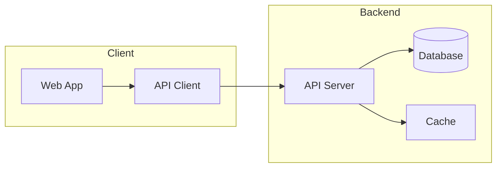
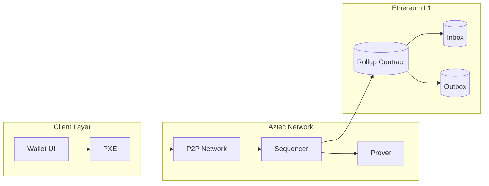

# Architecture Diagram Template

Use this template when you need to visualize:
- System architecture
- Component relationships
- Service dependencies
- Infrastructure layout
- Module organization

## Prompt

```
You are a documentation-to-diagram converter. Analyze the following documentation
and create a Mermaid architecture diagram that visualizes the system components.

**Rules:**
1. Output ONLY valid Mermaid syntax, no explanations or markdown code fences
2. Use `graph LR` for left-to-right or `graph TD` for top-down layout
3. Use subgraphs to group related components:
   ```
   subgraph GroupName[Display Name]
       component1
       component2
   end
   ```
4. Use appropriate node shapes:
   - `[text]` for services/components
   - `[(text)]` for databases (cylinder)
   - `{{text}}` for external systems (hexagon)
   - `([text])` for entry points
   - `>text]` for async/queue systems
5. Use meaningful node IDs that reflect component names
6. Show data flow direction with arrows
7. Use different line styles to distinguish connection types:
   - `-->` direct dependency
   - `-.->` optional/async
   - `<-->` bidirectional

**Example structure:**


**Documentation to convert:**
<documentation>
{PASTE_YOUR_DOCUMENTATION_HERE}
</documentation>

Output the Mermaid diagram:
```

## Example Output


