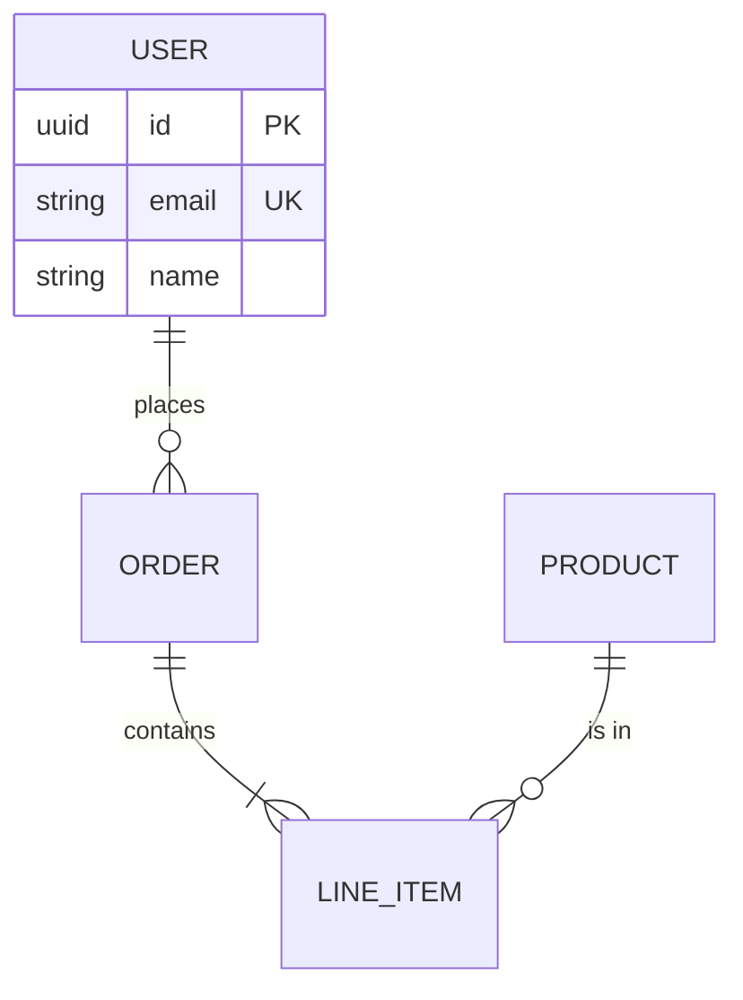
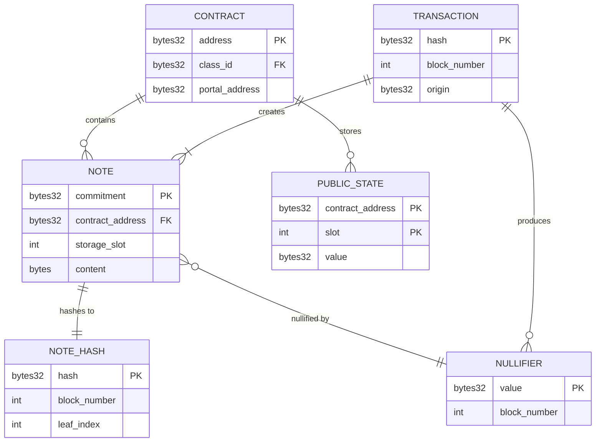

# Entity-Relationship Diagram Template

Use this template when you need to visualize:
- Data models
- Database schemas
- Entity relationships
- Domain models
- Data structures

## Prompt

```
You are a documentation-to-diagram converter. Analyze the following documentation
and create a Mermaid ER diagram that visualizes the data relationships.

**Rules:**
1. Output ONLY valid Mermaid syntax, no explanations or markdown code fences
2. Use `erDiagram` as the diagram type
3. Define entities in UPPERCASE or PascalCase
4. Use proper cardinality notation:
   - `||--||` one to one
   - `||--o{` one to zero or more
   - `||--|{` one to one or more
   - `o{--o{` zero or more to zero or more
5. Add attributes to entities when relevant:
   ```
   ENTITY {
       type attribute_name PK "comment"
       type attribute_name FK
       type attribute_name
   }
   ```
6. Label relationships with descriptive verbs
7. Group related entities logically

**Attribute types:** string, int, bool, date, timestamp, uuid, etc.
**Key indicators:** PK (primary key), FK (foreign key), UK (unique key)

**Example structure:**


**Documentation to convert:**
<documentation>
{PASTE_YOUR_DOCUMENTATION_HERE}
</documentation>

Output the Mermaid diagram:
```

## Example Output


