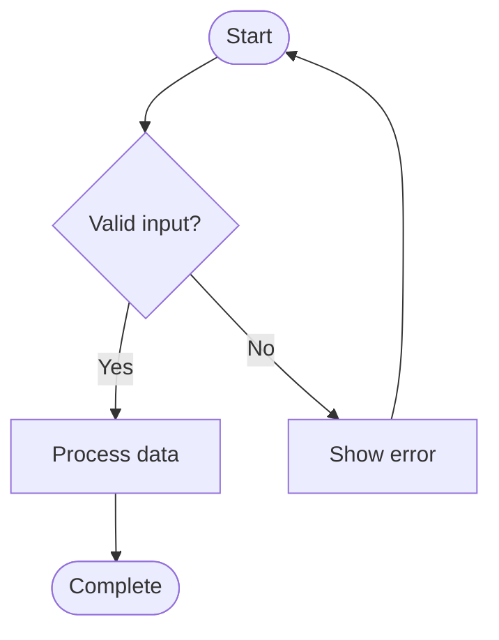
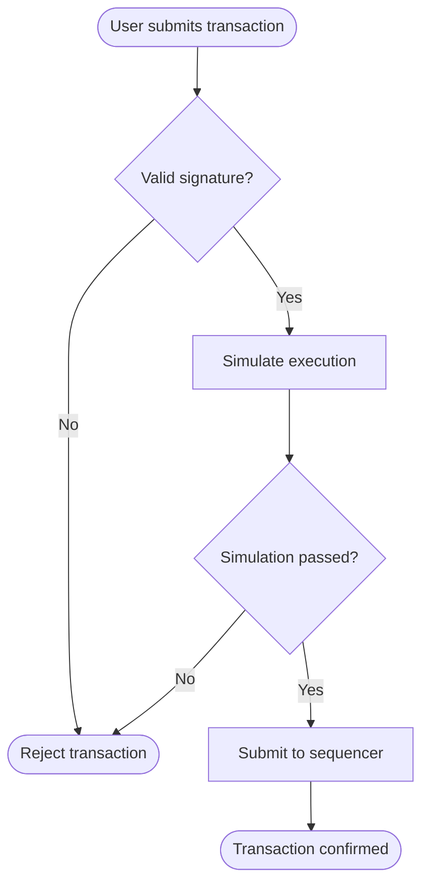

# Flowchart Diagram Template

Use this template when you need to visualize:
- Process flows and workflows
- Decision trees
- Algorithms
- Step-by-step procedures

## Prompt

```
You are a documentation-to-diagram converter. Analyze the following documentation
and create a Mermaid flowchart that visualizes the described process.

**Rules:**
1. Output ONLY valid Mermaid syntax, no explanations or markdown code fences
2. Use `flowchart TD` for top-down flow or `flowchart LR` for left-right flow
3. Use these node shapes appropriately:
   - `[text]` for regular steps/actions
   - `{text}` for decisions (yes/no, if/else)
   - `([text])` for start/end points (stadium shape)
   - `[[text]]` for subroutines/subprocess
   - `[(text)]` for database operations
4. Use meaningful node IDs (e.g., `validateInput` not `A`)
5. Use descriptive labels on arrows for decision branches
6. Group related steps with subgraphs where appropriate

**Arrow styles:**
- `-->` normal flow
- `-->|label|` flow with label
- `-.->` optional/conditional
- `==>` important/highlighted

**Example structure:**


**Documentation to convert:**
<documentation>
{PASTE_YOUR_DOCUMENTATION_HERE}
</documentation>

Output the Mermaid diagram:
```

## Example Output


