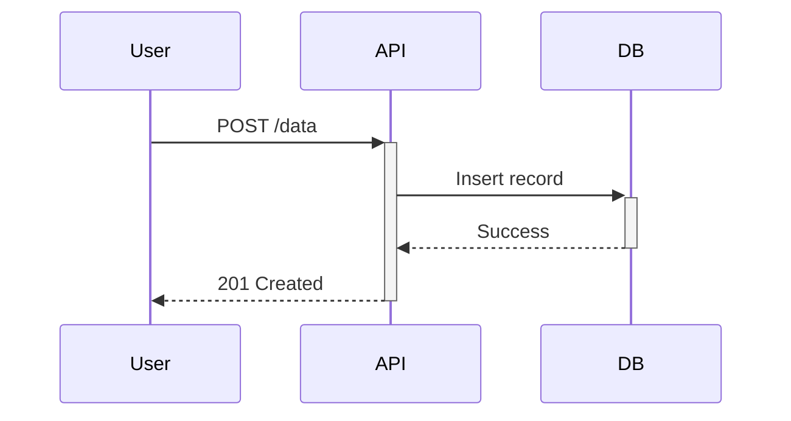
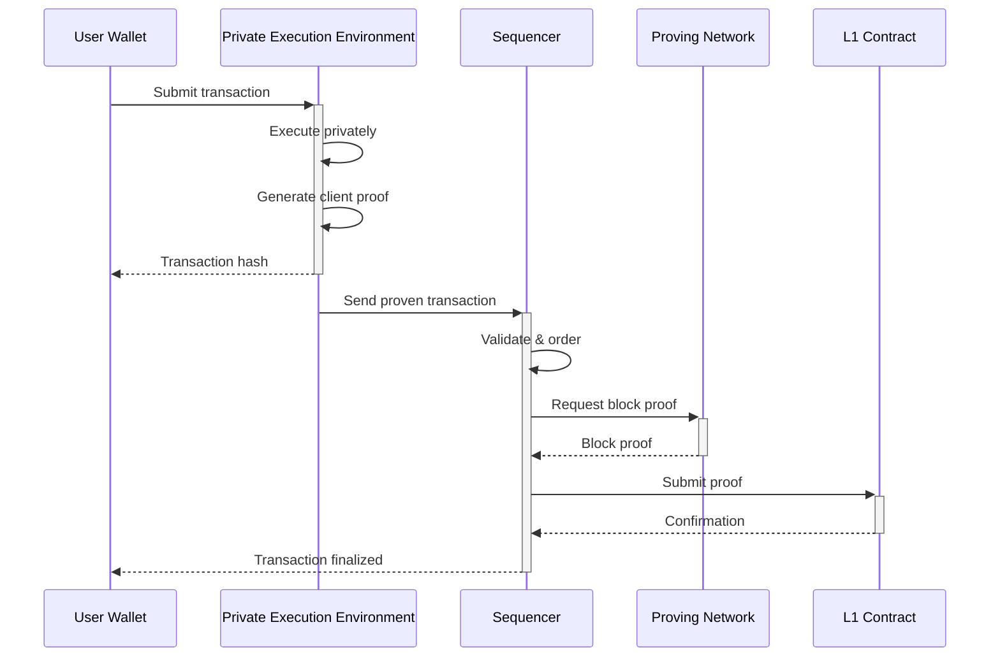

# Sequence Diagram Template

Use this template when you need to visualize:
- Interactions between components over time
- API call flows
- Message passing between services
- Protocol flows
- Request/response patterns

## Prompt

```
You are a documentation-to-diagram converter. Analyze the following documentation
and create a Mermaid sequence diagram that visualizes the interactions.

**Rules:**
1. Output ONLY valid Mermaid syntax, no explanations or markdown code fences
2. Use `sequenceDiagram` as the diagram type
3. Define participants at the top with descriptive names
4. Use appropriate arrow types:
   - `->>` synchronous message (solid line, filled arrow)
   - `-->>` response/return (dashed line, filled arrow)
   - `--)` asynchronous message (solid line, open arrow)
   - `--)`  async response (dashed line, open arrow)
5. Use `activate`/`deactivate` or `+`/`-` to show when participants are active
6. Add notes with `Note over` or `Note right of` for important details
7. Use `loop`, `alt`, `opt`, `par` blocks for control flow
8. Keep message labels concise but descriptive

**Example structure:**


**Documentation to convert:**
<documentation>
{PASTE_YOUR_DOCUMENTATION_HERE}
</documentation>

Output the Mermaid diagram:
```

## Example Output


