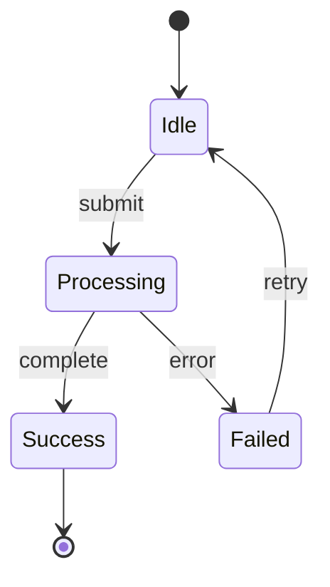
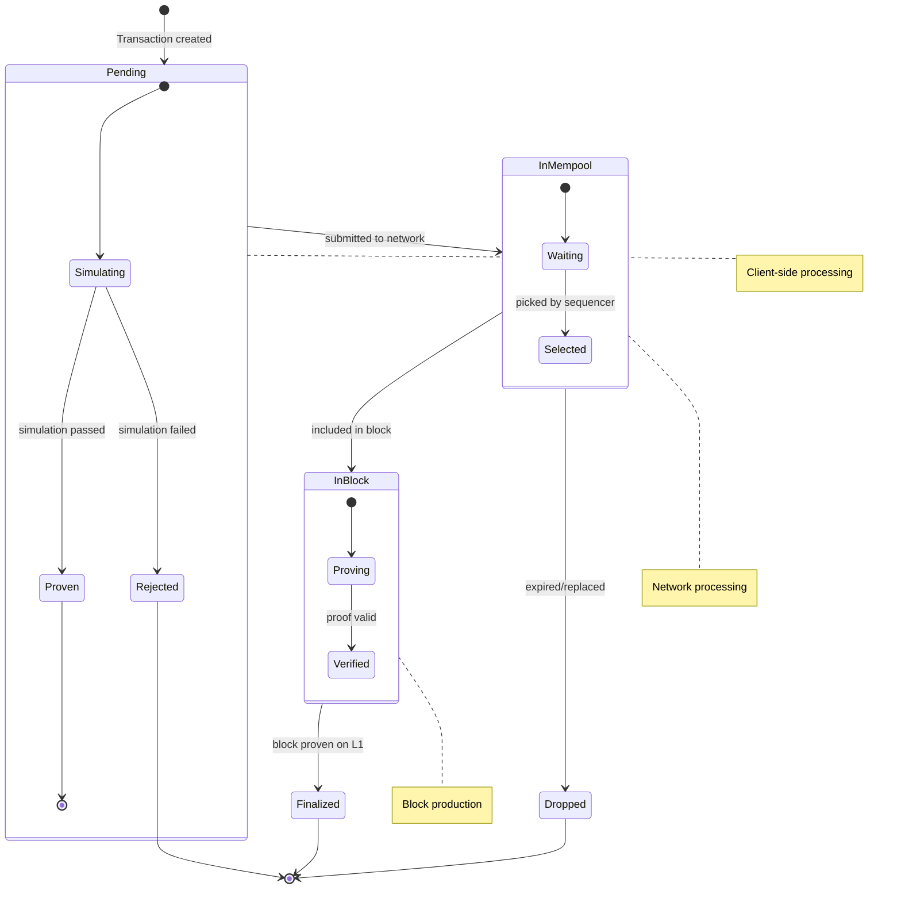

# State Diagram Template

Use this template when you need to visualize:
- State machines
- Object lifecycle
- Status transitions
- Workflow states
- Protocol states

## Prompt

```
You are a documentation-to-diagram converter. Analyze the following documentation
and create a Mermaid state diagram that visualizes the states and transitions.

**Rules:**
1. Output ONLY valid Mermaid syntax, no explanations or markdown code fences
2. Use `stateDiagram-v2` as the diagram type
3. Define states with meaningful names
4. Use `[*]` for start and end states
5. Label transitions with the triggering event/action
6. Use composite states for nested state machines
7. Use `note` to add important context
8. Use `<<choice>>` for decision points
9. Use `<<fork>>` and `<<join>>` for parallel states

**Example structure:**


**Documentation to convert:**
<documentation>
{PASTE_YOUR_DOCUMENTATION_HERE}
</documentation>

Output the Mermaid diagram:
```

## Example Output


