# AVM Instruction Set

This document provides a comprehensive reference for all Aztec Virtual Machine (AVM) instructions.

**Total Opcodes**: 46

## Table of Contents

- [Misc](#misc) (46 opcodes)

## Misc

### ADD

<div className="opcode-card">

Addition (a + b)

#### Quick Reference

| Property | Value |
|----------|-------|
| **Opcode(s)** | 0x00-0x01 |
| **Description** | Adds two field elements |

#### Expression

```javascript
M[dstOffset] = M[aOffset] + M[bOffset]
```

#### Details

Performs field addition modulo p. Both operands must have the same type tag. The result inherits the tag from the operands.

#### Gas Costs

| Component | Value |
|-----------|-------|
| L2 Base | 12 |
| DA Base | 0 |

#### Wire Formats

**ADD_8** (Opcode 0x00):

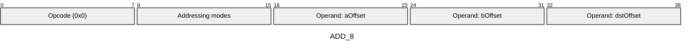

**ADD_16** (Opcode 0x01):

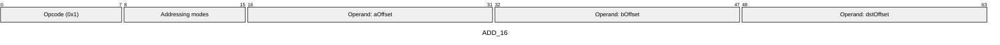

#### Operands

| Name | Type | Description |
|------|------|-------------|
| `aOffset` | Memory offset | Memory offset of the first operand |
| `bOffset` | Memory offset | Memory offset of the second operand |
| `dstOffset` | Memory offset | Memory offset specifying where to store the result |

#### Addressing Modes
Instructions of this type include a bitmask that defines the addressing mode for each memory-offset operand. Every memory-offset operand is associated with two bits in this bitmask. These bits specify whether the operand should be treated as indirect (M[M[x]]) and/or relative (M[x] + M[0]). By default, operands use direct addressing (M[x]). If both bits for an operand are 0, direct addressing is used; otherwise, the operand applies indirect and/or relative addressing as indicated by the bitmask.

- **Encoding**: Single 8-bit bitmask: 2 bits per memory offset operand (indirect flag + relative flag)
- **Bitmask**: 8 bits
- **Memory offset operands**: `aOffset`, `bOffset`, `dstOffset`

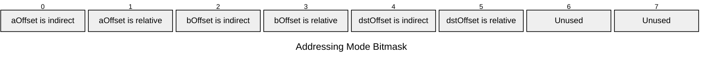

#### Tag Checks

- T[aOffset] == T[bOffset]

#### Tag Updates

- T[dstOffset] = T[aOffset]

#### Error Conditions

- **TAG_MISMATCH**: Operands have different type tags

</div>

---

### AND

<div className="opcode-card">

Bitwise AND (a &amp; b)

#### Quick Reference

| Property | Value |
|----------|-------|
| **Opcode(s)** | 0x10-0x11 |
| **Description** | Bitwise AND of two integer values |

#### Expression

```javascript
M[dstOffset] = M[aOffset] & M[bOffset]
```

#### Details

Performs bitwise AND operation. Both operands must have the same integral type tag. The result inherits the tag from the operands.

#### Gas Costs

| Component | Value |
|-----------|-------|
| L2 Base | 12 |
| DA Base | 0 |
| L2 Dynamic | 3 |

#### Wire Formats

**AND_8** (Opcode 0x10):

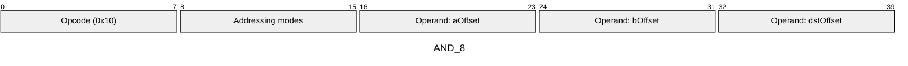

**AND_16** (Opcode 0x11):

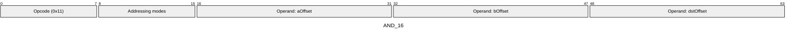

#### Operands

| Name | Type | Description |
|------|------|-------------|
| `aOffset` | Memory offset | Memory offset of the first operand |
| `bOffset` | Memory offset | Memory offset of the second operand |
| `dstOffset` | Memory offset | Memory offset specifying where to store the result |

#### Addressing Modes
Instructions of this type include a bitmask that defines the addressing mode for each memory-offset operand. Every memory-offset operand is associated with two bits in this bitmask. These bits specify whether the operand should be treated as indirect (M[M[x]]) and/or relative (M[x] + M[0]). By default, operands use direct addressing (M[x]). If both bits for an operand are 0, direct addressing is used; otherwise, the operand applies indirect and/or relative addressing as indicated by the bitmask.

- **Encoding**: Single 8-bit bitmask: 2 bits per memory offset operand (indirect flag + relative flag)
- **Bitmask**: 8 bits
- **Memory offset operands**: `aOffset`, `bOffset`, `dstOffset`


#### Tag Checks

- T[aOffset] == T[bOffset]
- T[aOffset] is integral

#### Tag Updates

- T[dstOffset] = T[aOffset]

#### Error Conditions

- **TAG_MISMATCH**: Operands have different type tags
- **INVALID_TAG_TYPE**: Operands are not integral types

</div>

---

### CALL

<div className="opcode-card">

External contract call

#### Quick Reference

| Property | Value |
|----------|-------|
| **Opcode(s)** | 0x39 |
| **Description** | Performs an external contract call |

#### Expression

```javascript
nestedCallResult = executeContract(M[addrOffset], M[argsOffset:argsOffset+M[argsSizeOffset]], {l2Gas: M[l2GasOffset], daGas: M[daGasOffset]})
```

#### Details

Calls another contract with the specified calldata and gas allocation. Can modify state. The call consumes the allocated gas and refunds unused gas. Updates nestedCallSuccess and nestedReturndata.

#### Gas Costs

| Component | Value |
|-----------|-------|
| L2 Base | 3312 |
| DA Base | 0 |

#### Wire Formats

**CALL** (Opcode 0x39):

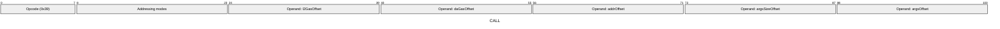

#### Operands

| Name | Type | Description |
|------|------|-------------|
| `l2GasOffset` | Memory offset | Memory offset of the L2 gas to allocate to the nested call |
| `daGasOffset` | Memory offset | Memory offset of the DA gas to allocate to the nested call |
| `addrOffset` | Memory offset | Memory offset of the target contract address |
| `argsSizeOffset` | Memory offset | Memory offset of the calldata size |
| `argsOffset` | Memory offset | Memory offset of the start of the calldata |

#### Addressing Modes
Instructions of this type include a bitmask that defines the addressing mode for each memory-offset operand. Every memory-offset operand is associated with two bits in this bitmask. These bits specify whether the operand should be treated as indirect (M[M[x]]) and/or relative (M[x] + M[0]). By default, operands use direct addressing (M[x]). If both bits for an operand are 0, direct addressing is used; otherwise, the operand applies indirect and/or relative addressing as indicated by the bitmask.

- **Encoding**: Single 16-bit bitmask: 2 bits per memory offset operand (indirect flag + relative flag)
- **Bitmask**: 16 bits
- **Memory offset operands**: `l2GasOffset`, `daGasOffset`, `addrOffset`, `argsSizeOffset`, `argsOffset`

```mermaid
---
title: "Addressing Mode Bitmask"
config:
  packet:
    bitWidth: 128
    bitsPerRow: 16
---
packet-beta
  0: "l2GasOffset is indirect"
  1: "l2GasOffset is relative"
  2: "daGasOffset is indirect"
  3: "daGasOffset is relative"
  4: "addrOffset is indirect"
  5: "addrOffset is relative"
  6: "argsSizeOffset is indirect"
  7: "argsSizeOffset is relative"
  8: "argsOffset is indirect"
  9: "argsOffset is relative"
  10: "Unused"
  11: "Unused"
  12: "Unused"
  13: "Unused"
  14: "Unused"
  15: "Unused"
```

#### Tag Checks

- T[l2GasOffset] == UINT32
- T[daGasOffset] == UINT32
- T[addrOffset] == FIELD
- T[argsSizeOffset] == UINT32

#### Tag Updates

- T[successOffset] = UINT1

#### Error Conditions

- **INVALID_TAG**: Gas, address, or size operands have incorrect tags
- **OUT_OF_GAS**: Insufficient gas for the nested call

</div>

---

### CALLDATACOPY

<div className="opcode-card">

Copy calldata to memory

#### Quick Reference

| Property | Value |
|----------|-------|
| **Opcode(s)** | 0x1F |
| **Description** | Copies calldata into memory |

#### Expression

```javascript
M[dstOffset:dstOffset+copySize] = calldata[cdOffset:cdOffset+copySize]
```

#### Details

Copies a slice of the current call's calldata into memory at the specified offset.

#### Gas Costs

| Component | Value |
|-----------|-------|
| L2 Base | 18 |
| DA Base | 0 |
| L2 Dynamic | 3 |

#### Wire Formats

**CALLDATACOPY** (Opcode 0x1F):

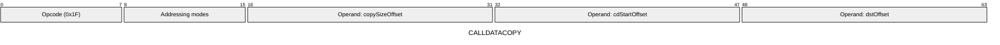

#### Operands

| Name | Type | Description |
|------|------|-------------|
| `copySizeOffset` | Memory offset | Memory offset |
| `cdStartOffset` | Memory offset | Memory offset |
| `dstOffset` | Memory offset | Memory offset specifying where to start writing calldata |

#### Addressing Modes
Instructions of this type include a bitmask that defines the addressing mode for each memory-offset operand. Every memory-offset operand is associated with two bits in this bitmask. These bits specify whether the operand should be treated as indirect (M[M[x]]) and/or relative (M[x] + M[0]). By default, operands use direct addressing (M[x]). If both bits for an operand are 0, direct addressing is used; otherwise, the operand applies indirect and/or relative addressing as indicated by the bitmask.

- **Encoding**: Single 8-bit bitmask: 2 bits per memory offset operand (indirect flag + relative flag)
- **Bitmask**: 8 bits
- **Memory offset operands**: `copySizeOffset`, `cdStartOffset`, `dstOffset`

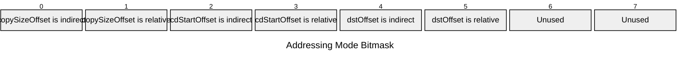

#### Tag Checks

- T[copySize] == UINT32

#### Tag Updates

- T[dstOffset:dstOffset+copySize] = FIELD

#### Error Conditions

- **INVALID_TAG**: Size operand is not Uint32

</div>

---

### CAST

<div className="opcode-card">

Type cast

#### Quick Reference

| Property | Value |
|----------|-------|
| **Opcode(s)** | 0x1C-0x1D |
| **Description** | Casts a value to a different type tag |

#### Expression

```javascript
M[dstOffset] = M[srcOffset] as tag
```

#### Details

Changes the type tag of a value. The value itself is preserved, only its type interpretation changes.

#### Gas Costs

| Component | Value |
|-----------|-------|
| L2 Base | 27 |
| DA Base | 0 |

#### Wire Formats

**CAST_8** (Opcode 0x1C):

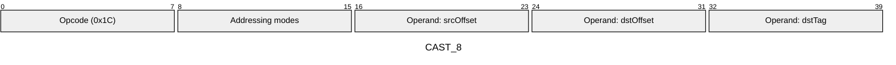

**CAST_16** (Opcode 0x1D):

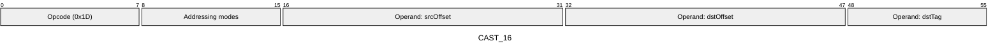

#### Operands

| Name | Type | Description |
|------|------|-------------|
| `srcOffset` | Memory offset | Memory offset of the value to cast |
| `dstOffset` | Memory offset | Memory offset specifying where to store the casted value |
| `dstTag` | Type tag | Type tag to cast the value to |

#### Addressing Modes
Instructions of this type include a bitmask that defines the addressing mode for each memory-offset operand. Every memory-offset operand is associated with two bits in this bitmask. These bits specify whether the operand should be treated as indirect (M[M[x]]) and/or relative (M[x] + M[0]). By default, operands use direct addressing (M[x]). If both bits for an operand are 0, direct addressing is used; otherwise, the operand applies indirect and/or relative addressing as indicated by the bitmask.

- **Encoding**: Single 8-bit bitmask: 2 bits per memory offset operand (indirect flag + relative flag)
- **Bitmask**: 8 bits
- **Memory offset operands**: `srcOffset`, `dstOffset`

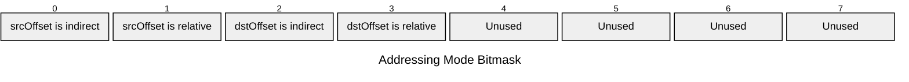

#### Tag Updates

- T[dstOffset] = dstTag

#### Error Conditions

- **INVALID_TAG**: Destination tag is not a valid TypeTag

</div>

---

### DEBUGLOG

<div className="opcode-card">

Debug logging

#### Quick Reference

| Property | Value |
|----------|-------|
| **Opcode(s)** | 0x3E |
| **Description** | Logs debug information during execution |

#### Expression

```javascript
debugLog(level, message, M[fieldsOffset:fieldsOffset+M[fieldsSizeOffset]])
```

#### Details

Emits a debug log with a message string and field values. Only executed if debug logging is enabled. Level must be Uint8, fields must be FIELD, message size and fields size are immediate. Counts against max debug memory reads limit.

#### Gas Costs

| Component | Value |
|-----------|-------|
| L2 Base | 9 |
| DA Base | 0 |

#### Wire Formats

**DEBUGLOG** (Opcode 0x3E):

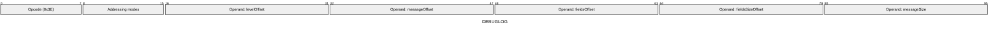

#### Operands

| Name | Type | Description |
|------|------|-------------|
| `levelOffset` | Memory offset | Memory offset |
| `messageOffset` | Memory offset | Memory offset of the message string |
| `fieldsOffset` | Memory offset | Memory offset of the start of field values to log |
| `fieldsSizeOffset` | Memory offset | Memory offset of the number of fields to log |
| `messageSize` | Memory offset | Immediate value specifying message string length |

#### Addressing Modes
Instructions of this type include a bitmask that defines the addressing mode for each memory-offset operand. Every memory-offset operand is associated with two bits in this bitmask. These bits specify whether the operand should be treated as indirect (M[M[x]]) and/or relative (M[x] + M[0]). By default, operands use direct addressing (M[x]). If both bits for an operand are 0, direct addressing is used; otherwise, the operand applies indirect and/or relative addressing as indicated by the bitmask.

- **Encoding**: Single 8-bit bitmask: 2 bits per memory offset operand (indirect flag + relative flag)
- **Bitmask**: 8 bits
- **Memory offset operands**: `levelOffset`, `messageOffset`, `fieldsOffset`, `fieldsSizeOffset`

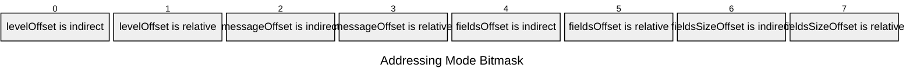

#### Tag Checks

- T[fieldsSizeOffset] == UINT32

#### Error Conditions

- **INVALID_TAG**: Level is not Uint8, fields size is not Uint32, or message/fields have incorrect tags
- **INVALID_LOG_LEVEL**: Log level is not a valid LogLevel enum value
- **DEBUG_MEMORY_LIMIT_EXCEEDED**: Exceeded maximum debug log memory reads

</div>

---

### DIV

<div className="opcode-card">

Integer division (a / b)

#### Quick Reference

| Property | Value |
|----------|-------|
| **Opcode(s)** | 0x06-0x07 |
| **Description** | Divides two integer values |

#### Expression

```javascript
M[dstOffset] = M[aOffset] / M[bOffset]
```

#### Details

Performs integer division. Both operands must have the same integral type tag (not FIELD). The result inherits the tag from the operands.

#### Gas Costs

| Component | Value |
|-----------|-------|
| L2 Base | 27 |
| DA Base | 0 |

#### Wire Formats

**DIV_8** (Opcode 0x06):

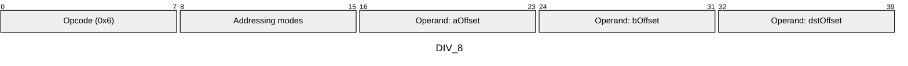

**DIV_16** (Opcode 0x07):

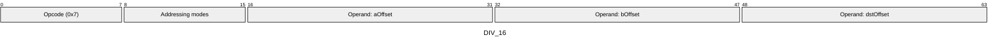

#### Operands

| Name | Type | Description |
|------|------|-------------|
| `aOffset` | Memory offset | Memory offset of the dividend |
| `bOffset` | Memory offset | Memory offset of the divisor |
| `dstOffset` | Memory offset | Memory offset specifying where to store the quotient |

#### Addressing Modes
Instructions of this type include a bitmask that defines the addressing mode for each memory-offset operand. Every memory-offset operand is associated with two bits in this bitmask. These bits specify whether the operand should be treated as indirect (M[M[x]]) and/or relative (M[x] + M[0]). By default, operands use direct addressing (M[x]). If both bits for an operand are 0, direct addressing is used; otherwise, the operand applies indirect and/or relative addressing as indicated by the bitmask.

- **Encoding**: Single 8-bit bitmask: 2 bits per memory offset operand (indirect flag + relative flag)
- **Bitmask**: 8 bits
- **Memory offset operands**: `aOffset`, `bOffset`, `dstOffset`


#### Tag Checks

- T[aOffset] == T[bOffset]
- T[aOffset] is integral

#### Tag Updates

- T[dstOffset] = T[aOffset]

#### Error Conditions

- **TAG_MISMATCH**: Operands have different type tags
- **INVALID_TAG_TYPE**: Operands are not integral types
- **DIVISION_BY_ZERO**: Second operand (divisor) is zero

</div>

---

### ECADD

<div className="opcode-card">

Elliptic curve addition

#### Quick Reference

| Property | Value |
|----------|-------|
| **Opcode(s)** | 0x42 |
| **Description** | Adds two Grumpkin elliptic curve points |

#### Expression

```javascript
M[dstOffset:dstOffset+3] = grumpkinAdd(point1, point2)
```

#### Details

Performs elliptic curve point addition on the Grumpkin curve. Each point is represented as (x: FIELD, y: FIELD, isInfinite: Uint1). Returns result point in same format.

#### Gas Costs

| Component | Value |
|-----------|-------|
| L2 Base | 27 |
| DA Base | 0 |

#### Wire Formats

**ECADD** (Opcode 0x42):

```mermaid
---
title: "ECADD"
config:
  packet:
    bitsPerRow: 136
---
packet-beta
0-7: "Opcode (0x42)"
8-23: "Addressing modes"
24-39: "Operand: p1XOffset"
40-55: "Operand: p1YOffset"
56-71: "Operand: p1IsInfiniteOffset"
72-87: "Operand: p2XOffset"
88-103: "Operand: p2YOffset"
104-119: "Operand: p2IsInfiniteOffset"
120-135: "Operand: dstOffset"
```

#### Operands

| Name | Type | Description |
|------|------|-------------|
| `p1XOffset` | Memory offset | Memory offset of the first point's x-coordinate |
| `p1YOffset` | Memory offset | Memory offset of the first point's y-coordinate |
| `p1IsInfiniteOffset` | Memory offset | Memory offset of the first point's infinity flag |
| `p2XOffset` | Memory offset | Memory offset of the second point's x-coordinate |
| `p2YOffset` | Memory offset | Memory offset of the second point's y-coordinate |
| `p2IsInfiniteOffset` | Memory offset | Memory offset of the second point's infinity flag |
| `dstOffset` | Memory offset | Memory offset where the result point will be written (3 values) |

#### Addressing Modes
Instructions of this type include a bitmask that defines the addressing mode for each memory-offset operand. Every memory-offset operand is associated with two bits in this bitmask. These bits specify whether the operand should be treated as indirect (M[M[x]]) and/or relative (M[x] + M[0]). By default, operands use direct addressing (M[x]). If both bits for an operand are 0, direct addressing is used; otherwise, the operand applies indirect and/or relative addressing as indicated by the bitmask.

- **Encoding**: Single 16-bit bitmask: 2 bits per memory offset operand (indirect flag + relative flag)
- **Bitmask**: 16 bits
- **Memory offset operands**: `p1XOffset`, `p1YOffset`, `p1IsInfiniteOffset`, `p2XOffset`, `p2YOffset`, `p2IsInfiniteOffset`, `dstOffset`

```mermaid
---
title: "Addressing Mode Bitmask"
config:
  packet:
    bitWidth: 128
    bitsPerRow: 16
---
packet-beta
  0: "p1XOffset is indirect"
  1: "p1XOffset is relative"
  2: "p1YOffset is indirect"
  3: "p1YOffset is relative"
  4: "p1IsInfiniteOffset is indirect"
  5: "p1IsInfiniteOffset is relative"
  6: "p2XOffset is indirect"
  7: "p2XOffset is relative"
  8: "p2YOffset is indirect"
  9: "p2YOffset is relative"
  10: "p2IsInfiniteOffset is indirect"
  11: "p2IsInfiniteOffset is relative"
  12: "dstOffset is indirect"
  13: "dstOffset is relative"
  14: "Unused"
  15: "Unused"
```

#### Tag Checks

- T[p1XOffset] == FIELD
- T[p1YOffset] == FIELD
- T[p1IsInfiniteOffset] == UINT1
- T[p2XOffset] == FIELD
- T[p2YOffset] == FIELD
- T[p2IsInfiniteOffset] == UINT1

#### Tag Updates

- T[dstOffset] = FIELD
- T[dstOffset+1] = FIELD
- T[dstOffset+2] = UINT1

#### Error Conditions

- **INVALID_TAG**: Point coordinates are not FIELD or infinity flags are not Uint1
- **POINT_NOT_ON_CURVE**: One or both points are not on the Grumpkin curve

</div>

---

### EMITNOTEHASH

<div className="opcode-card">

Emit note hash

#### Quick Reference

| Property | Value |
|----------|-------|
| **Opcode(s)** | 0x32 |
| **Description** | Emits a note hash to the output |

#### Expression

```javascript
noteHashes.append(M[noteHashOffset])
```

#### Details

Adds a note hash to the current call's accumulated note hashes. Note hash must have type tag FIELD. Reverts in static calls.

#### Gas Costs

| Component | Value |
|-----------|-------|
| L2 Base | 1285 |
| DA Base | 512 |

#### Wire Formats

**EMITNOTEHASH** (Opcode 0x32):

```mermaid
---
title: "EMITNOTEHASH"
config:
  packet:
    bitsPerRow: 32
---
packet-beta
0-7: "Opcode (0x32)"
8-15: "Addressing modes"
16-31: "Operand: noteHashOffset"
```

#### Operands

| Name | Type | Description |
|------|------|-------------|
| `noteHashOffset` | Memory offset | Memory offset of the note hash to emit |

#### Addressing Modes
Instructions of this type include a bitmask that defines the addressing mode for each memory-offset operand. Every memory-offset operand is associated with two bits in this bitmask. These bits specify whether the operand should be treated as indirect (M[M[x]]) and/or relative (M[x] + M[0]). By default, operands use direct addressing (M[x]). If both bits for an operand are 0, direct addressing is used; otherwise, the operand applies indirect and/or relative addressing as indicated by the bitmask.

- **Encoding**: Single 8-bit bitmask: 2 bits per memory offset operand (indirect flag + relative flag)
- **Bitmask**: 8 bits
- **Memory offset operands**: `noteHashOffset`

```mermaid
---
title: "Addressing Mode Bitmask"
config:
  packet:
    bitWidth: 128
    bitsPerRow: 8
---
packet-beta
  0: "noteHashOffset is indirect"
  1: "noteHashOffset is relative"
  2: "Unused"
  3: "Unused"
  4: "Unused"
  5: "Unused"
  6: "Unused"
  7: "Unused"
```

#### Tag Checks

- T[noteHashOffset] == FIELD

#### Error Conditions

- **INVALID_TAG**: Note hash operand is not FIELD
- **STATIC_CALL_ALTERATION**: Attempted note hash emission in static call context

</div>

---

### EMITNULLIFIER

<div className="opcode-card">

Emit nullifier

#### Quick Reference

| Property | Value |
|----------|-------|
| **Opcode(s)** | 0x34 |
| **Description** | Emits a nullifier to the output |

#### Expression

```javascript
nullifiers.append(M[nullifierOffset])
```

#### Details

Adds a nullifier to the current call's accumulated nullifiers. Nullifier must have type tag FIELD. Reverts in static calls or if nullifier already exists.

#### Gas Costs

| Component | Value |
|-----------|-------|
| L2 Base | 1540 |
| DA Base | 512 |

#### Wire Formats

**EMITNULLIFIER** (Opcode 0x34):

```mermaid
---
title: "EMITNULLIFIER"
config:
  packet:
    bitsPerRow: 32
---
packet-beta
0-7: "Opcode (0x34)"
8-15: "Addressing modes"
16-31: "Operand: nullifierOffset"
```

#### Operands

| Name | Type | Description |
|------|------|-------------|
| `nullifierOffset` | Memory offset | Memory offset of the nullifier to emit |

#### Addressing Modes
Instructions of this type include a bitmask that defines the addressing mode for each memory-offset operand. Every memory-offset operand is associated with two bits in this bitmask. These bits specify whether the operand should be treated as indirect (M[M[x]]) and/or relative (M[x] + M[0]). By default, operands use direct addressing (M[x]). If both bits for an operand are 0, direct addressing is used; otherwise, the operand applies indirect and/or relative addressing as indicated by the bitmask.

- **Encoding**: Single 8-bit bitmask: 2 bits per memory offset operand (indirect flag + relative flag)
- **Bitmask**: 8 bits
- **Memory offset operands**: `nullifierOffset`

```mermaid
---
title: "Addressing Mode Bitmask"
config:
  packet:
    bitWidth: 128
    bitsPerRow: 8
---
packet-beta
  0: "nullifierOffset is indirect"
  1: "nullifierOffset is relative"
  2: "Unused"
  3: "Unused"
  4: "Unused"
  5: "Unused"
  6: "Unused"
  7: "Unused"
```

#### Tag Checks

- T[nullifierOffset] == FIELD

#### Error Conditions

- **INVALID_TAG**: Nullifier operand is not FIELD
- **STATIC_CALL_ALTERATION**: Attempted nullifier emission in static call context
- **NULLIFIER_COLLISION**: Nullifier already exists

</div>

---

### EMITUNENCRYPTEDLOG

<div className="opcode-card">

Emit unencrypted log

#### Quick Reference

| Property | Value |
|----------|-------|
| **Opcode(s)** | 0x37 |
| **Description** | Emits an unencrypted log |

#### Expression

```javascript
unencryptedLogs.append(M[logOffset:logOffset+M[logSizeOffset]])
```

#### Details

Appends an unencrypted (public) log to the current call's accumulated logs. Log size must be Uint32, log data must be FIELD elements. Reverts in static calls.

#### Gas Costs

| Component | Value |
|-----------|-------|
| L2 Base | 15 |
| DA Base | 1024 |
| L2 Dynamic | 3 |
| DA Dynamic | 512 |

#### Wire Formats

**EMITUNENCRYPTEDLOG** (Opcode 0x37):

```mermaid
---
title: "EMITUNENCRYPTEDLOG"
config:
  packet:
    bitsPerRow: 48
---
packet-beta
0-7: "Opcode (0x37)"
8-15: "Addressing modes"
16-31: "Operand: logSizeOffset"
32-47: "Operand: logOffset"
```

#### Operands

| Name | Type | Description |
|------|------|-------------|
| `logSizeOffset` | Memory offset | Memory offset of the log size (number of fields) |
| `logOffset` | Memory offset | Memory offset of the start of the log data |

#### Addressing Modes
Instructions of this type include a bitmask that defines the addressing mode for each memory-offset operand. Every memory-offset operand is associated with two bits in this bitmask. These bits specify whether the operand should be treated as indirect (M[M[x]]) and/or relative (M[x] + M[0]). By default, operands use direct addressing (M[x]). If both bits for an operand are 0, direct addressing is used; otherwise, the operand applies indirect and/or relative addressing as indicated by the bitmask.

- **Encoding**: Single 8-bit bitmask: 2 bits per memory offset operand (indirect flag + relative flag)
- **Bitmask**: 8 bits
- **Memory offset operands**: `logSizeOffset`, `logOffset`

```mermaid
---
title: "Addressing Mode Bitmask"
config:
  packet:
    bitWidth: 128
    bitsPerRow: 8
---
packet-beta
  0: "logSizeOffset is indirect"
  1: "logSizeOffset is relative"
  2: "logOffset is indirect"
  3: "logOffset is relative"
  4: "Unused"
  5: "Unused"
  6: "Unused"
  7: "Unused"
```

#### Tag Checks

- T[logSizeOffset] == UINT32
- T[logOffset:logOffset+M[logSizeOffset]] == FIELD

#### Error Conditions

- **INVALID_TAG**: Log size is not Uint32 or log data is not FIELD
- **STATIC_CALL_ALTERATION**: Attempted log emission in static call context

</div>

---

### EQ

<div className="opcode-card">

Equality check (a == b)

#### Quick Reference

| Property | Value |
|----------|-------|
| **Opcode(s)** | 0x0A-0x0B |
| **Description** | Tests equality of two values |

#### Expression

```javascript
M[dstOffset] = (M[aOffset] == M[bOffset]) ? 1 : 0
```

#### Details

Compares two values for equality. Both operands must have the same type tag. The result is a Uint1 (0 or 1).

#### Gas Costs

| Component | Value |
|-----------|-------|
| L2 Base | 12 |
| DA Base | 0 |

#### Wire Formats

**EQ_8** (Opcode 0x0A):

```mermaid
---
title: "EQ_8"
config:
  packet:
    bitsPerRow: 40
---
packet-beta
0-7: "Opcode (0xA)"
8-15: "Addressing modes"
16-23: "Operand: aOffset"
24-31: "Operand: bOffset"
32-39: "Operand: dstOffset"
```

**EQ_16** (Opcode 0x0B):

```mermaid
---
title: "EQ_16"
config:
  packet:
    bitsPerRow: 64
---
packet-beta
0-7: "Opcode (0xB)"
8-15: "Addressing modes"
16-31: "Operand: aOffset"
32-47: "Operand: bOffset"
48-63: "Operand: dstOffset"
```

#### Operands

| Name | Type | Description |
|------|------|-------------|
| `aOffset` | Memory offset | Memory offset of the first value to compare |
| `bOffset` | Memory offset | Memory offset of the second value to compare |
| `dstOffset` | Memory offset | Memory offset specifying where to store the result (0 or 1) |

#### Addressing Modes
Instructions of this type include a bitmask that defines the addressing mode for each memory-offset operand. Every memory-offset operand is associated with two bits in this bitmask. These bits specify whether the operand should be treated as indirect (M[M[x]]) and/or relative (M[x] + M[0]). By default, operands use direct addressing (M[x]). If both bits for an operand are 0, direct addressing is used; otherwise, the operand applies indirect and/or relative addressing as indicated by the bitmask.

- **Encoding**: Single 8-bit bitmask: 2 bits per memory offset operand (indirect flag + relative flag)
- **Bitmask**: 8 bits
- **Memory offset operands**: `aOffset`, `bOffset`, `dstOffset`

```mermaid
---
title: "Addressing Mode Bitmask"
config:
  packet:
    bitWidth: 128
    bitsPerRow: 8
---
packet-beta
  0: "aOffset is indirect"
  1: "aOffset is relative"
  2: "bOffset is indirect"
  3: "bOffset is relative"
  4: "dstOffset is indirect"
  5: "dstOffset is relative"
  6: "Unused"
  7: "Unused"
```

#### Tag Checks

- T[aOffset] == T[bOffset]

#### Tag Updates

- T[dstOffset] = UINT1

#### Error Conditions

- **TAG_MISMATCH**: Operands have different type tags

</div>

---

### FDIV

<div className="opcode-card">

Field division (a / b)

#### Quick Reference

| Property | Value |
|----------|-------|
| **Opcode(s)** | 0x08-0x09 |
| **Description** | Performs field division (multiplicative inverse) |

#### Expression

```javascript
M[dstOffset] = M[aOffset] / M[bOffset]
```

#### Details

Performs field division by computing the multiplicative inverse modulo p. Both operands must have FIELD type tag.

#### Gas Costs

| Component | Value |
|-----------|-------|
| L2 Base | 9 |
| DA Base | 0 |

#### Wire Formats

**FDIV_8** (Opcode 0x08):

```mermaid
---
title: "FDIV_8"
config:
  packet:
    bitsPerRow: 40
---
packet-beta
0-7: "Opcode (0x8)"
8-15: "Addressing modes"
16-23: "Operand: aOffset"
24-31: "Operand: bOffset"
32-39: "Operand: dstOffset"
```

**FDIV_16** (Opcode 0x09):

```mermaid
---
title: "FDIV_16"
config:
  packet:
    bitsPerRow: 64
---
packet-beta
0-7: "Opcode (0x9)"
8-15: "Addressing modes"
16-31: "Operand: aOffset"
32-47: "Operand: bOffset"
48-63: "Operand: dstOffset"
```

#### Operands

| Name | Type | Description |
|------|------|-------------|
| `aOffset` | Memory offset | Memory offset of the dividend |
| `bOffset` | Memory offset | Memory offset of the divisor |
| `dstOffset` | Memory offset | Memory offset specifying where to store the result |

#### Addressing Modes
Instructions of this type include a bitmask that defines the addressing mode for each memory-offset operand. Every memory-offset operand is associated with two bits in this bitmask. These bits specify whether the operand should be treated as indirect (M[M[x]]) and/or relative (M[x] + M[0]). By default, operands use direct addressing (M[x]). If both bits for an operand are 0, direct addressing is used; otherwise, the operand applies indirect and/or relative addressing as indicated by the bitmask.

- **Encoding**: Single 8-bit bitmask: 2 bits per memory offset operand (indirect flag + relative flag)
- **Bitmask**: 8 bits
- **Memory offset operands**: `aOffset`, `bOffset`, `dstOffset`

```mermaid
---
title: "Addressing Mode Bitmask"
config:
  packet:
    bitWidth: 128
    bitsPerRow: 8
---
packet-beta
  0: "aOffset is indirect"
  1: "aOffset is relative"
  2: "bOffset is indirect"
  3: "bOffset is relative"
  4: "dstOffset is indirect"
  5: "dstOffset is relative"
  6: "Unused"
  7: "Unused"
```

#### Tag Checks

- T[aOffset] == T[bOffset]
- T[aOffset] == FIELD

#### Tag Updates

- T[dstOffset] = FIELD

#### Error Conditions

- **TAG_MISMATCH**: Operands have different type tags
- **INVALID_TAG_TYPE**: Operands do not have FIELD type tag
- **DIVISION_BY_ZERO**: Second operand (divisor) is zero

</div>

---

### GETCONTRACTINSTANCE

<div className="opcode-card">

Get contract instance info

#### Quick Reference

| Property | Value |
|----------|-------|
| **Opcode(s)** | 0x36 |
| **Description** | Retrieves contract instance information |

#### Expression

```javascript
M[dstOffset] = contractInstance.exists ? 1 : 0; M[dstOffset+1] = contractInstance[memberEnum]
```

#### Details

Looks up contract instance by address and retrieves the specified member (deployer, classId, or initHash). Returns existence flag (Uint1) and member value (FIELD).

#### Gas Costs

| Component | Value |
|-----------|-------|
| L2 Base | 1527 |
| DA Base | 0 |

#### Wire Formats

**GETCONTRACTINSTANCE** (Opcode 0x36):

```mermaid
---
title: "GETCONTRACTINSTANCE"
config:
  packet:
    bitsPerRow: 56
---
packet-beta
0-7: "Opcode (0x36)"
8-15: "Addressing modes"
16-31: "Operand: addressOffset"
32-47: "Operand: dstOffset"
48-55: "Operand: memberEnum"
```

#### Operands

| Name | Type | Description |
|------|------|-------------|
| `addressOffset` | Memory offset | Memory offset |
| `dstOffset` | Memory offset | Memory offset |
| `memberEnum` | Memory offset | Immediate value specifying which contract instance member to retrieve |

#### Addressing Modes
Instructions of this type include a bitmask that defines the addressing mode for each memory-offset operand. Every memory-offset operand is associated with two bits in this bitmask. These bits specify whether the operand should be treated as indirect (M[M[x]]) and/or relative (M[x] + M[0]). By default, operands use direct addressing (M[x]). If both bits for an operand are 0, direct addressing is used; otherwise, the operand applies indirect and/or relative addressing as indicated by the bitmask.

- **Encoding**: Single 8-bit bitmask: 2 bits per memory offset operand (indirect flag + relative flag)
- **Bitmask**: 8 bits
- **Memory offset operands**: `addressOffset`, `dstOffset`

```mermaid
---
title: "Addressing Mode Bitmask"
config:
  packet:
    bitWidth: 128
    bitsPerRow: 8
---
packet-beta
  0: "addressOffset is indirect"
  1: "addressOffset is relative"
  2: "dstOffset is indirect"
  3: "dstOffset is relative"
  4: "Unused"
  5: "Unused"
  6: "Unused"
  7: "Unused"
```

#### Tag Updates

- T[dstOffset] = UINT1
- T[dstOffset+1] = FIELD

#### Error Conditions

- **INVALID_TAG**: Address operand is not FIELD
- **INVALID_MEMBER_ENUM**: Member enum is not a valid ContractInstanceMember

</div>

---

### GETENVVAR

<div className="opcode-card">

Get environment variable

#### Quick Reference

| Property | Value |
|----------|-------|
| **Opcode(s)** | 0x1E |
| **Description** | Reads an environment variable into memory |

#### Expression

```javascript
M[dstOffset] = environmentVariable[varEnum]
```

#### Details

Retrieves environment variables like address, sender, chainId, timestamp, gas left, etc. The variable is specified by an immediate enum value.

#### Gas Costs

| Component | Value |
|-----------|-------|
| L2 Base | 12 |
| DA Base | 0 |

#### Wire Formats

**GETENVVAR_16** (Opcode 0x1E):

```mermaid
---
title: "GETENVVAR_16"
config:
  packet:
    bitsPerRow: 40
---
packet-beta
0-7: "Opcode (0x1E)"
8-15: "Addressing modes"
16-31: "Operand: dstOffset"
32-39: "Operand: varEnum"
```

#### Operands

| Name | Type | Description |
|------|------|-------------|
| `dstOffset` | Memory offset | Memory offset |
| `varEnum` | Memory offset | Immediate value specifying which environment variable to read |

#### Addressing Modes
Instructions of this type include a bitmask that defines the addressing mode for each memory-offset operand. Every memory-offset operand is associated with two bits in this bitmask. These bits specify whether the operand should be treated as indirect (M[M[x]]) and/or relative (M[x] + M[0]). By default, operands use direct addressing (M[x]). If both bits for an operand are 0, direct addressing is used; otherwise, the operand applies indirect and/or relative addressing as indicated by the bitmask.

- **Encoding**: Single 8-bit bitmask: 2 bits per memory offset operand (indirect flag + relative flag)
- **Bitmask**: 8 bits
- **Memory offset operands**: `dstOffset`

```mermaid
---
title: "Addressing Mode Bitmask"
config:
  packet:
    bitWidth: 128
    bitsPerRow: 8
---
packet-beta
  0: "dstOffset is indirect"
  1: "dstOffset is relative"
  2: "Unused"
  3: "Unused"
  4: "Unused"
  5: "Unused"
  6: "Unused"
  7: "Unused"
```

#### Tag Updates

- T[dstOffset] = FIELD

#### Error Conditions

- **INVALID_ENV_VAR**: Variable enum is not a valid EnvironmentVariable

</div>

---

### INTERNALCALL

<div className="opcode-card">

Internal function call

#### Quick Reference

| Property | Value |
|----------|-------|
| **Opcode(s)** | 0x25 |
| **Description** | Calls an internal function at specified bytecode offset |

#### Expression

```javascript
internalCallStack.push({callPc: PC, returnPc: PC + instructionSize}); PC = loc
```

#### Details

Pushes current PC and return address onto internal call stack, then jumps to the target location.

#### Gas Costs

| Component | Value |
|-----------|-------|
| L2 Base | 9 |
| DA Base | 0 |

#### Wire Formats

**INTERNALCALL** (Opcode 0x25):

```mermaid
---
title: "INTERNALCALL"
config:
  packet:
    bitsPerRow: 40
---
packet-beta
0-7: "Opcode (0x25)"
8-39: "Operand: loc"
```

#### Operands

| Name | Type | Description |
|------|------|-------------|
| `loc` | Memory offset | Immediate bytecode offset of the function to call |

#### Error Conditions

- **INVALID_PROGRAM_COUNTER**: Call location is outside valid bytecode range
- **CALL_STACK_OVERFLOW**: Internal call stack is full

</div>

---

### INTERNALRETURN

<div className="opcode-card">

Return from internal call

#### Quick Reference

| Property | Value |
|----------|-------|
| **Opcode(s)** | 0x26 |
| **Description** | Returns from an internal function call |

#### Expression

```javascript
PC = internalCallStack.pop().returnPc
```

#### Details

Pops return address from internal call stack and sets PC to that address.

#### Gas Costs

| Component | Value |
|-----------|-------|
| L2 Base | 9 |
| DA Base | 0 |

#### Wire Formats

**INTERNALRETURN** (Opcode 0x26):

```mermaid
---
title: "INTERNALRETURN"
config:
  packet:
    bitsPerRow: 8
---
packet-beta
0-7: "Opcode (0x26)"
```

#### Error Conditions

- **CALL_STACK_UNDERFLOW**: Internal call stack is empty

</div>

---

### JUMP

<div className="opcode-card">

Unconditional jump

#### Quick Reference

| Property | Value |
|----------|-------|
| **Opcode(s)** | 0x23 |
| **Description** | Unconditional jump to a bytecode offset |

#### Expression

```javascript
PC = jumpOffset
```

#### Details

Sets the program counter to the specified offset. The offset is an immediate value (not from memory).

#### Gas Costs

| Component | Value |
|-----------|-------|
| L2 Base | 9 |
| DA Base | 0 |

#### Wire Formats

**JUMP** (Opcode 0x23):

```mermaid
---
title: "JUMP"
config:
  packet:
    bitsPerRow: 40
---
packet-beta
0-7: "Opcode (0x23)"
8-39: "Operand: jumpOffset"
```

#### Operands

| Name | Type | Description |
|------|------|-------------|
| `jumpOffset` | Memory offset | Immediate bytecode offset to jump to |

#### Addressing Modes
Instructions of this type include a bitmask that defines the addressing mode for each memory-offset operand. Every memory-offset operand is associated with two bits in this bitmask. These bits specify whether the operand should be treated as indirect (M[M[x]]) and/or relative (M[x] + M[0]). By default, operands use direct addressing (M[x]). If both bits for an operand are 0, direct addressing is used; otherwise, the operand applies indirect and/or relative addressing as indicated by the bitmask.

- **Encoding**: undefined
- **Bitmask**: undefined bits
- **Memory offset operands**: `jumpOffset`

#### Error Conditions

- **INVALID_PROGRAM_COUNTER**: Jump offset is outside valid bytecode range

</div>

---

### JUMPI

<div className="opcode-card">

Conditional jump

#### Quick Reference

| Property | Value |
|----------|-------|
| **Opcode(s)** | 0x24 |
| **Description** | Conditional jump based on a condition value |

#### Expression

```javascript
if M[condOffset] != 0 then PC = loc else PC = PC + instructionSize
```

#### Details

Jumps to the specified location if the condition is non-zero (true). The condition must have type tag Uint1.

#### Gas Costs

| Component | Value |
|-----------|-------|
| L2 Base | 9 |
| DA Base | 0 |

#### Wire Formats

**JUMPI** (Opcode 0x24):

```mermaid
---
title: "JUMPI"
config:
  packet:
    bitsPerRow: 64
---
packet-beta
0-7: "Opcode (0x24)"
8-15: "Addressing modes"
16-31: "Operand: condOffset"
32-63: "Operand: loc"
```

#### Operands

| Name | Type | Description |
|------|------|-------------|
| `condOffset` | Memory offset | Memory offset of the condition value (Uint1) |
| `loc` | Memory offset | Immediate bytecode offset to jump to if condition is true |

#### Addressing Modes
Instructions of this type include a bitmask that defines the addressing mode for each memory-offset operand. Every memory-offset operand is associated with two bits in this bitmask. These bits specify whether the operand should be treated as indirect (M[M[x]]) and/or relative (M[x] + M[0]). By default, operands use direct addressing (M[x]). If both bits for an operand are 0, direct addressing is used; otherwise, the operand applies indirect and/or relative addressing as indicated by the bitmask.

- **Encoding**: Single 8-bit bitmask: 2 bits per memory offset operand (indirect flag + relative flag)
- **Bitmask**: 8 bits
- **Memory offset operands**: `condOffset`

```mermaid
---
title: "Addressing Mode Bitmask"
config:
  packet:
    bitWidth: 128
    bitsPerRow: 8
---
packet-beta
  0: "condOffset is indirect"
  1: "condOffset is relative"
  2: "Unused"
  3: "Unused"
  4: "Unused"
  5: "Unused"
  6: "Unused"
  7: "Unused"
```

#### Tag Checks

- T[condOffset] == UINT1

#### Error Conditions

- **INVALID_TAG**: Condition operand is not Uint1
- **INVALID_PROGRAM_COUNTER**: Jump location is outside valid bytecode range

</div>

---

### KECCAKF1600

<div className="opcode-card">

Keccak-f[1600] permutation

#### Quick Reference

| Property | Value |
|----------|-------|
| **Opcode(s)** | 0x41 |
| **Description** | Applies Keccak-f[1600] permutation |

#### Expression

```javascript
M[dstOffset:dstOffset+25] = keccakf1600(M[inputOffset:inputOffset+25])
```

#### Details

Computes the Keccak-f[1600] permutation on a state of 25 Uint64 elements. Input and output must have type tag Uint64.

#### Gas Costs

| Component | Value |
|-----------|-------|
| L2 Base | 58176 |
| DA Base | 0 |

#### Wire Formats

**KECCAKF1600** (Opcode 0x41):

```mermaid
---
title: "KECCAKF1600"
config:
  packet:
    bitsPerRow: 48
---
packet-beta
0-7: "Opcode (0x41)"
8-15: "Addressing modes"
16-31: "Operand: dstOffset"
32-47: "Operand: inputOffset"
```

#### Operands

| Name | Type | Description |
|------|------|-------------|
| `dstOffset` | Memory offset | Memory offset where the output state will be written |
| `inputOffset` | Memory offset | Memory offset of the input state (25 Uint64 elements) |

#### Addressing Modes
Instructions of this type include a bitmask that defines the addressing mode for each memory-offset operand. Every memory-offset operand is associated with two bits in this bitmask. These bits specify whether the operand should be treated as indirect (M[M[x]]) and/or relative (M[x] + M[0]). By default, operands use direct addressing (M[x]). If both bits for an operand are 0, direct addressing is used; otherwise, the operand applies indirect and/or relative addressing as indicated by the bitmask.

- **Encoding**: Single 8-bit bitmask: 2 bits per memory offset operand (indirect flag + relative flag)
- **Bitmask**: 8 bits
- **Memory offset operands**: `dstOffset`, `inputOffset`

```mermaid
---
title: "Addressing Mode Bitmask"
config:
  packet:
    bitWidth: 128
    bitsPerRow: 8
---
packet-beta
  0: "dstOffset is indirect"
  1: "dstOffset is relative"
  2: "inputOffset is indirect"
  3: "inputOffset is relative"
  4: "Unused"
  5: "Unused"
  6: "Unused"
  7: "Unused"
```

#### Tag Checks

- T[inputOffset:inputOffset+25] == UINT64

#### Tag Updates

- T[dstOffset:dstOffset+25] = UINT64

#### Error Conditions

- **INVALID_TAG**: Input state elements are not Uint64

</div>

---

### L1TOL2MSGEXISTS

<div className="opcode-card">

Check L1-to-L2 message

#### Quick Reference

| Property | Value |
|----------|-------|
| **Opcode(s)** | 0x35 |
| **Description** | Checks if an L1-to-L2 message exists |

#### Expression

```javascript
M[existsOffset] = l1ToL2Messages.exists(M[msgHashOffset], M[msgLeafIndexOffset]) ? 1 : 0
```

#### Details

Queries whether the specified L1-to-L2 message hash exists at the given leaf index. Message hash must be FIELD, leaf index must be Uint64. Result is Uint1.

#### Gas Costs

| Component | Value |
|-----------|-------|
| L2 Base | 108 |
| DA Base | 0 |

#### Wire Formats

**L1TOL2MSGEXISTS** (Opcode 0x35):

```mermaid
---
title: "L1TOL2MSGEXISTS"
config:
  packet:
    bitsPerRow: 64
---
packet-beta
0-7: "Opcode (0x35)"
8-15: "Addressing modes"
16-31: "Operand: msgHashOffset"
32-47: "Operand: msgLeafIndexOffset"
48-63: "Operand: existsOffset"
```

#### Operands

| Name | Type | Description |
|------|------|-------------|
| `msgHashOffset` | Memory offset | Memory offset of the L1-to-L2 message hash |
| `msgLeafIndexOffset` | Memory offset | Memory offset of the leaf index in the message tree |
| `existsOffset` | Memory offset | Memory offset where the result (0 or 1) will be written |

#### Addressing Modes
Instructions of this type include a bitmask that defines the addressing mode for each memory-offset operand. Every memory-offset operand is associated with two bits in this bitmask. These bits specify whether the operand should be treated as indirect (M[M[x]]) and/or relative (M[x] + M[0]). By default, operands use direct addressing (M[x]). If both bits for an operand are 0, direct addressing is used; otherwise, the operand applies indirect and/or relative addressing as indicated by the bitmask.

- **Encoding**: Single 8-bit bitmask: 2 bits per memory offset operand (indirect flag + relative flag)
- **Bitmask**: 8 bits
- **Memory offset operands**: `msgHashOffset`, `msgLeafIndexOffset`, `existsOffset`

```mermaid
---
title: "Addressing Mode Bitmask"
config:
  packet:
    bitWidth: 128
    bitsPerRow: 8
---
packet-beta
  0: "msgHashOffset is indirect"
  1: "msgHashOffset is relative"
  2: "msgLeafIndexOffset is indirect"
  3: "msgLeafIndexOffset is relative"
  4: "existsOffset is indirect"
  5: "existsOffset is relative"
  6: "Unused"
  7: "Unused"
```

#### Tag Checks

- T[msgHashOffset] == FIELD
- T[msgLeafIndexOffset] == UINT64

#### Tag Updates

- T[existsOffset] = UINT1

#### Error Conditions

- **INVALID_TAG**: Message hash is not FIELD or leaf index is not Uint64

</div>

---

### LT

<div className="opcode-card">

Less than (a &lt; b)

#### Quick Reference

| Property | Value |
|----------|-------|
| **Opcode(s)** | 0x0C-0x0D |
| **Description** | Tests if first value is less than second |

#### Expression

```javascript
M[dstOffset] = (M[aOffset] < M[bOffset]) ? 1 : 0
```

#### Details

Compares two values. Both operands must have the same type tag. The result is a Uint1 (0 or 1).

#### Gas Costs

| Component | Value |
|-----------|-------|
| L2 Base | 42 |
| DA Base | 0 |

#### Wire Formats

**LT_8** (Opcode 0x0C):

```mermaid
---
title: "LT_8"
config:
  packet:
    bitsPerRow: 40
---
packet-beta
0-7: "Opcode (0xC)"
8-15: "Addressing modes"
16-23: "Operand: aOffset"
24-31: "Operand: bOffset"
32-39: "Operand: dstOffset"
```

**LT_16** (Opcode 0x0D):

```mermaid
---
title: "LT_16"
config:
  packet:
    bitsPerRow: 64
---
packet-beta
0-7: "Opcode (0xD)"
8-15: "Addressing modes"
16-31: "Operand: aOffset"
32-47: "Operand: bOffset"
48-63: "Operand: dstOffset"
```

#### Operands

| Name | Type | Description |
|------|------|-------------|
| `aOffset` | Memory offset | Memory offset of the first value to compare |
| `bOffset` | Memory offset | Memory offset of the second value to compare |
| `dstOffset` | Memory offset | Memory offset specifying where to store the result (0 or 1) |

#### Addressing Modes
Instructions of this type include a bitmask that defines the addressing mode for each memory-offset operand. Every memory-offset operand is associated with two bits in this bitmask. These bits specify whether the operand should be treated as indirect (M[M[x]]) and/or relative (M[x] + M[0]). By default, operands use direct addressing (M[x]). If both bits for an operand are 0, direct addressing is used; otherwise, the operand applies indirect and/or relative addressing as indicated by the bitmask.

- **Encoding**: Single 8-bit bitmask: 2 bits per memory offset operand (indirect flag + relative flag)
- **Bitmask**: 8 bits
- **Memory offset operands**: `aOffset`, `bOffset`, `dstOffset`

```mermaid
---
title: "Addressing Mode Bitmask"
config:
  packet:
    bitWidth: 128
    bitsPerRow: 8
---
packet-beta
  0: "aOffset is indirect"
  1: "aOffset is relative"
  2: "bOffset is indirect"
  3: "bOffset is relative"
  4: "dstOffset is indirect"
  5: "dstOffset is relative"
  6: "Unused"
  7: "Unused"
```

#### Tag Checks

- T[aOffset] == T[bOffset]

#### Tag Updates

- T[dstOffset] = UINT1

#### Error Conditions

- **TAG_MISMATCH**: Operands have different type tags

</div>

---

### LTE

<div className="opcode-card">

Less than or equal (a &lt;= b)

#### Quick Reference

| Property | Value |
|----------|-------|
| **Opcode(s)** | 0x0E-0x0F |
| **Description** | Tests if first value is less than or equal to second |

#### Expression

```javascript
M[dstOffset] = (M[aOffset] <= M[bOffset]) ? 1 : 0
```

#### Details

Compares two values. Both operands must have the same type tag. The result is a Uint1 (0 or 1).

#### Gas Costs

| Component | Value |
|-----------|-------|
| L2 Base | 42 |
| DA Base | 0 |

#### Wire Formats

**LTE_8** (Opcode 0x0E):

```mermaid
---
title: "LTE_8"
config:
  packet:
    bitsPerRow: 40
---
packet-beta
0-7: "Opcode (0xE)"
8-15: "Addressing modes"
16-23: "Operand: aOffset"
24-31: "Operand: bOffset"
32-39: "Operand: dstOffset"
```

**LTE_16** (Opcode 0x0F):

```mermaid
---
title: "LTE_16"
config:
  packet:
    bitsPerRow: 64
---
packet-beta
0-7: "Opcode (0xF)"
8-15: "Addressing modes"
16-31: "Operand: aOffset"
32-47: "Operand: bOffset"
48-63: "Operand: dstOffset"
```

#### Operands

| Name | Type | Description |
|------|------|-------------|
| `aOffset` | Memory offset | Memory offset of the first value to compare |
| `bOffset` | Memory offset | Memory offset of the second value to compare |
| `dstOffset` | Memory offset | Memory offset specifying where to store the result (0 or 1) |

#### Addressing Modes
Instructions of this type include a bitmask that defines the addressing mode for each memory-offset operand. Every memory-offset operand is associated with two bits in this bitmask. These bits specify whether the operand should be treated as indirect (M[M[x]]) and/or relative (M[x] + M[0]). By default, operands use direct addressing (M[x]). If both bits for an operand are 0, direct addressing is used; otherwise, the operand applies indirect and/or relative addressing as indicated by the bitmask.

- **Encoding**: Single 8-bit bitmask: 2 bits per memory offset operand (indirect flag + relative flag)
- **Bitmask**: 8 bits
- **Memory offset operands**: `aOffset`, `bOffset`, `dstOffset`

```mermaid
---
title: "Addressing Mode Bitmask"
config:
  packet:
    bitWidth: 128
    bitsPerRow: 8
---
packet-beta
  0: "aOffset is indirect"
  1: "aOffset is relative"
  2: "bOffset is indirect"
  3: "bOffset is relative"
  4: "dstOffset is indirect"
  5: "dstOffset is relative"
  6: "Unused"
  7: "Unused"
```

#### Tag Checks

- T[aOffset] == T[bOffset]

#### Tag Updates

- T[dstOffset] = UINT1

#### Error Conditions

- **TAG_MISMATCH**: Operands have different type tags

</div>

---

### MOV

<div className="opcode-card">

Move value between memory locations

#### Quick Reference

| Property | Value |
|----------|-------|
| **Opcode(s)** | 0x2D-0x2E |
| **Description** | Copies a value from one memory location to another |

#### Expression

```javascript
M[dstOffset] = M[srcOffset]
```

#### Details

Copies a value and its type tag from the source memory offset to the destination offset.

#### Gas Costs

| Component | Value |
|-----------|-------|
| L2 Base | 12 |
| DA Base | 0 |

#### Wire Formats

**MOV_8** (Opcode 0x2D):

```mermaid
---
title: "MOV_8"
config:
  packet:
    bitsPerRow: 32
---
packet-beta
0-7: "Opcode (0x2D)"
8-15: "Addressing modes"
16-23: "Operand: srcOffset"
24-31: "Operand: dstOffset"
```

**MOV_16** (Opcode 0x2E):

```mermaid
---
title: "MOV_16"
config:
  packet:
    bitsPerRow: 48
---
packet-beta
0-7: "Opcode (0x2E)"
8-15: "Addressing modes"
16-31: "Operand: srcOffset"
32-47: "Operand: dstOffset"
```

#### Operands

| Name | Type | Description |
|------|------|-------------|
| `srcOffset` | Memory offset | Memory offset to read from |
| `dstOffset` | Memory offset | Memory offset to write to |

#### Addressing Modes
Instructions of this type include a bitmask that defines the addressing mode for each memory-offset operand. Every memory-offset operand is associated with two bits in this bitmask. These bits specify whether the operand should be treated as indirect (M[M[x]]) and/or relative (M[x] + M[0]). By default, operands use direct addressing (M[x]). If both bits for an operand are 0, direct addressing is used; otherwise, the operand applies indirect and/or relative addressing as indicated by the bitmask.

- **Encoding**: Single 8-bit bitmask: 2 bits per memory offset operand (indirect flag + relative flag)
- **Bitmask**: 8 bits
- **Memory offset operands**: `srcOffset`, `dstOffset`

```mermaid
---
title: "Addressing Mode Bitmask"
config:
  packet:
    bitWidth: 128
    bitsPerRow: 8
---
packet-beta
  0: "srcOffset is indirect"
  1: "srcOffset is relative"
  2: "dstOffset is indirect"
  3: "dstOffset is relative"
  4: "Unused"
  5: "Unused"
  6: "Unused"
  7: "Unused"
```

#### Tag Updates

- T[dstOffset] = T[srcOffset]

</div>

---

### MUL

<div className="opcode-card">

Multiplication (a * b)

#### Quick Reference

| Property | Value |
|----------|-------|
| **Opcode(s)** | 0x04-0x05 |
| **Description** | Multiplies two field elements |

#### Expression

```javascript
M[dstOffset] = M[aOffset] * M[bOffset]
```

#### Details

Performs field multiplication modulo p. Both operands must have the same type tag. The result inherits the tag from the operands.

#### Gas Costs

| Component | Value |
|-----------|-------|
| L2 Base | 27 |
| DA Base | 0 |

#### Wire Formats

**MUL_8** (Opcode 0x04):

```mermaid
---
title: "MUL_8"
config:
  packet:
    bitsPerRow: 40
---
packet-beta
0-7: "Opcode (0x4)"
8-15: "Addressing modes"
16-23: "Operand: aOffset"
24-31: "Operand: bOffset"
32-39: "Operand: dstOffset"
```

**MUL_16** (Opcode 0x05):

```mermaid
---
title: "MUL_16"
config:
  packet:
    bitsPerRow: 64
---
packet-beta
0-7: "Opcode (0x5)"
8-15: "Addressing modes"
16-31: "Operand: aOffset"
32-47: "Operand: bOffset"
48-63: "Operand: dstOffset"
```

#### Operands

| Name | Type | Description |
|------|------|-------------|
| `aOffset` | Memory offset | Memory offset of the first factor |
| `bOffset` | Memory offset | Memory offset of the second factor |
| `dstOffset` | Memory offset | Memory offset specifying where to store the result |

#### Addressing Modes
Instructions of this type include a bitmask that defines the addressing mode for each memory-offset operand. Every memory-offset operand is associated with two bits in this bitmask. These bits specify whether the operand should be treated as indirect (M[M[x]]) and/or relative (M[x] + M[0]). By default, operands use direct addressing (M[x]). If both bits for an operand are 0, direct addressing is used; otherwise, the operand applies indirect and/or relative addressing as indicated by the bitmask.

- **Encoding**: Single 8-bit bitmask: 2 bits per memory offset operand (indirect flag + relative flag)
- **Bitmask**: 8 bits
- **Memory offset operands**: `aOffset`, `bOffset`, `dstOffset`

```mermaid
---
title: "Addressing Mode Bitmask"
config:
  packet:
    bitWidth: 128
    bitsPerRow: 8
---
packet-beta
  0: "aOffset is indirect"
  1: "aOffset is relative"
  2: "bOffset is indirect"
  3: "bOffset is relative"
  4: "dstOffset is indirect"
  5: "dstOffset is relative"
  6: "Unused"
  7: "Unused"
```

#### Tag Checks

- T[aOffset] == T[bOffset]

#### Tag Updates

- T[dstOffset] = T[aOffset]

#### Error Conditions

- **TAG_MISMATCH**: Operands have different type tags

</div>

---

### NOT

<div className="opcode-card">

Bitwise NOT (~a)

#### Quick Reference

| Property | Value |
|----------|-------|
| **Opcode(s)** | 0x16-0x17 |
| **Description** | Bitwise NOT of an integer value |

#### Expression

```javascript
M[dstOffset] = ~M[srcOffset]
```

#### Details

Performs bitwise NOT operation (one's complement). The operand must have an integral type tag. The result inherits the tag from the operand.

#### Gas Costs

| Component | Value |
|-----------|-------|
| L2 Base | 12 |
| DA Base | 0 |

#### Wire Formats

**NOT_8** (Opcode 0x16):

```mermaid
---
title: "NOT_8"
config:
  packet:
    bitsPerRow: 32
---
packet-beta
0-7: "Opcode (0x16)"
8-15: "Addressing modes"
16-23: "Operand: srcOffset"
24-31: "Operand: dstOffset"
```

**NOT_16** (Opcode 0x17):

```mermaid
---
title: "NOT_16"
config:
  packet:
    bitsPerRow: 48
---
packet-beta
0-7: "Opcode (0x17)"
8-15: "Addressing modes"
16-31: "Operand: srcOffset"
32-47: "Operand: dstOffset"
```

#### Operands

| Name | Type | Description |
|------|------|-------------|
| `srcOffset` | Memory offset | Memory offset of the value to negate |
| `dstOffset` | Memory offset | Memory offset specifying where to store the result |

#### Addressing Modes
Instructions of this type include a bitmask that defines the addressing mode for each memory-offset operand. Every memory-offset operand is associated with two bits in this bitmask. These bits specify whether the operand should be treated as indirect (M[M[x]]) and/or relative (M[x] + M[0]). By default, operands use direct addressing (M[x]). If both bits for an operand are 0, direct addressing is used; otherwise, the operand applies indirect and/or relative addressing as indicated by the bitmask.

- **Encoding**: Single 8-bit bitmask: 2 bits per memory offset operand (indirect flag + relative flag)
- **Bitmask**: 8 bits
- **Memory offset operands**: `srcOffset`, `dstOffset`

```mermaid
---
title: "Addressing Mode Bitmask"
config:
  packet:
    bitWidth: 128
    bitsPerRow: 8
---
packet-beta
  0: "srcOffset is indirect"
  1: "srcOffset is relative"
  2: "dstOffset is indirect"
  3: "dstOffset is relative"
  4: "Unused"
  5: "Unused"
  6: "Unused"
  7: "Unused"
```

#### Tag Checks

- T[srcOffset] is integral

#### Tag Updates

- T[dstOffset] = T[srcOffset]

#### Error Conditions

- **INVALID_TAG_TYPE**: Operand is not an integral type

</div>

---

### NOTEHASHEXISTS

<div className="opcode-card">

Check note hash existence

#### Quick Reference

| Property | Value |
|----------|-------|
| **Opcode(s)** | 0x31 |
| **Description** | Checks if a note hash exists in the tree |

#### Expression

```javascript
M[existsOffset] = noteHashTree.exists(M[noteHashOffset], M[leafIndexOffset]) ? 1 : 0
```

#### Details

Queries whether the specified note hash exists at the given leaf index. Note hash must be FIELD, leaf index must be Uint64. Result is Uint1.

#### Gas Costs

| Component | Value |
|-----------|-------|
| L2 Base | 126 |
| DA Base | 0 |

#### Wire Formats

**NOTEHASHEXISTS** (Opcode 0x31):

```mermaid
---
title: "NOTEHASHEXISTS"
config:
  packet:
    bitsPerRow: 64
---
packet-beta
0-7: "Opcode (0x31)"
8-15: "Addressing modes"
16-31: "Operand: noteHashOffset"
32-47: "Operand: leafIndexOffset"
48-63: "Operand: existsOffset"
```

#### Operands

| Name | Type | Description |
|------|------|-------------|
| `noteHashOffset` | Memory offset | Memory offset of the note hash to check |
| `leafIndexOffset` | Memory offset | Memory offset of the leaf index in the note hash tree |
| `existsOffset` | Memory offset | Memory offset where the result (0 or 1) will be written |

#### Addressing Modes
Instructions of this type include a bitmask that defines the addressing mode for each memory-offset operand. Every memory-offset operand is associated with two bits in this bitmask. These bits specify whether the operand should be treated as indirect (M[M[x]]) and/or relative (M[x] + M[0]). By default, operands use direct addressing (M[x]). If both bits for an operand are 0, direct addressing is used; otherwise, the operand applies indirect and/or relative addressing as indicated by the bitmask.

- **Encoding**: Single 8-bit bitmask: 2 bits per memory offset operand (indirect flag + relative flag)
- **Bitmask**: 8 bits
- **Memory offset operands**: `noteHashOffset`, `leafIndexOffset`, `existsOffset`

```mermaid
---
title: "Addressing Mode Bitmask"
config:
  packet:
    bitWidth: 128
    bitsPerRow: 8
---
packet-beta
  0: "noteHashOffset is indirect"
  1: "noteHashOffset is relative"
  2: "leafIndexOffset is indirect"
  3: "leafIndexOffset is relative"
  4: "existsOffset is indirect"
  5: "existsOffset is relative"
  6: "Unused"
  7: "Unused"
```

#### Tag Checks

- T[noteHashOffset] == FIELD
- T[leafIndexOffset] == UINT64

#### Tag Updates

- T[existsOffset] = UINT1

#### Error Conditions

- **INVALID_TAG**: Note hash is not FIELD or leaf index is not Uint64

</div>

---

### NULLIFIEREXISTS

<div className="opcode-card">

Check nullifier existence

#### Quick Reference

| Property | Value |
|----------|-------|
| **Opcode(s)** | 0x33 |
| **Description** | Checks if a nullifier exists for a given address |

#### Expression

```javascript
M[existsOffset] = nullifierTree.exists(M[addressOffset], M[nullifierOffset]) ? 1 : 0
```

#### Details

Queries whether the specified nullifier exists for the given contract address. Both address and nullifier must be FIELD. Result is Uint1.

#### Gas Costs

| Component | Value |
|-----------|-------|
| L2 Base | 132 |
| DA Base | 0 |

#### Wire Formats

**NULLIFIEREXISTS** (Opcode 0x33):

```mermaid
---
title: "NULLIFIEREXISTS"
config:
  packet:
    bitsPerRow: 64
---
packet-beta
0-7: "Opcode (0x33)"
8-15: "Addressing modes"
16-31: "Operand: nullifierOffset"
32-47: "Operand: addressOffset"
48-63: "Operand: existsOffset"
```

#### Operands

| Name | Type | Description |
|------|------|-------------|
| `nullifierOffset` | Memory offset | Memory offset of the nullifier to check |
| `addressOffset` | Memory offset | Memory offset of the contract address |
| `existsOffset` | Memory offset | Memory offset where the result (0 or 1) will be written |

#### Addressing Modes
Instructions of this type include a bitmask that defines the addressing mode for each memory-offset operand. Every memory-offset operand is associated with two bits in this bitmask. These bits specify whether the operand should be treated as indirect (M[M[x]]) and/or relative (M[x] + M[0]). By default, operands use direct addressing (M[x]). If both bits for an operand are 0, direct addressing is used; otherwise, the operand applies indirect and/or relative addressing as indicated by the bitmask.

- **Encoding**: Single 8-bit bitmask: 2 bits per memory offset operand (indirect flag + relative flag)
- **Bitmask**: 8 bits
- **Memory offset operands**: `nullifierOffset`, `addressOffset`, `existsOffset`

```mermaid
---
title: "Addressing Mode Bitmask"
config:
  packet:
    bitWidth: 128
    bitsPerRow: 8
---
packet-beta
  0: "nullifierOffset is indirect"
  1: "nullifierOffset is relative"
  2: "addressOffset is indirect"
  3: "addressOffset is relative"
  4: "existsOffset is indirect"
  5: "existsOffset is relative"
  6: "Unused"
  7: "Unused"
```

#### Tag Checks

- T[addressOffset] == FIELD
- T[nullifierOffset] == FIELD

#### Tag Updates

- T[existsOffset] = UINT1

#### Error Conditions

- **INVALID_TAG**: Address or nullifier is not FIELD

</div>

---

### OR

<div className="opcode-card">

Bitwise OR (a | b)

#### Quick Reference

| Property | Value |
|----------|-------|
| **Opcode(s)** | 0x12-0x13 |
| **Description** | Bitwise OR of two integer values |

#### Expression

```javascript
M[dstOffset] = M[aOffset] | M[bOffset]
```

#### Details

Performs bitwise OR operation. Both operands must have the same integral type tag. The result inherits the tag from the operands.

#### Gas Costs

| Component | Value |
|-----------|-------|
| L2 Base | 12 |
| DA Base | 0 |
| L2 Dynamic | 3 |

#### Wire Formats

**OR_8** (Opcode 0x12):

```mermaid
---
title: "OR_8"
config:
  packet:
    bitsPerRow: 40
---
packet-beta
0-7: "Opcode (0x12)"
8-15: "Addressing modes"
16-23: "Operand: aOffset"
24-31: "Operand: bOffset"
32-39: "Operand: dstOffset"
```

**OR_16** (Opcode 0x13):

```mermaid
---
title: "OR_16"
config:
  packet:
    bitsPerRow: 64
---
packet-beta
0-7: "Opcode (0x13)"
8-15: "Addressing modes"
16-31: "Operand: aOffset"
32-47: "Operand: bOffset"
48-63: "Operand: dstOffset"
```

#### Operands

| Name | Type | Description |
|------|------|-------------|
| `aOffset` | Memory offset | Memory offset of the first operand |
| `bOffset` | Memory offset | Memory offset of the second operand |
| `dstOffset` | Memory offset | Memory offset specifying where to store the result |

#### Addressing Modes
Instructions of this type include a bitmask that defines the addressing mode for each memory-offset operand. Every memory-offset operand is associated with two bits in this bitmask. These bits specify whether the operand should be treated as indirect (M[M[x]]) and/or relative (M[x] + M[0]). By default, operands use direct addressing (M[x]). If both bits for an operand are 0, direct addressing is used; otherwise, the operand applies indirect and/or relative addressing as indicated by the bitmask.

- **Encoding**: Single 8-bit bitmask: 2 bits per memory offset operand (indirect flag + relative flag)
- **Bitmask**: 8 bits
- **Memory offset operands**: `aOffset`, `bOffset`, `dstOffset`

```mermaid
---
title: "Addressing Mode Bitmask"
config:
  packet:
    bitWidth: 128
    bitsPerRow: 8
---
packet-beta
  0: "aOffset is indirect"
  1: "aOffset is relative"
  2: "bOffset is indirect"
  3: "bOffset is relative"
  4: "dstOffset is indirect"
  5: "dstOffset is relative"
  6: "Unused"
  7: "Unused"
```

#### Tag Checks

- T[aOffset] == T[bOffset]
- T[aOffset] is integral

#### Tag Updates

- T[dstOffset] = T[aOffset]

#### Error Conditions

- **TAG_MISMATCH**: Operands have different type tags
- **INVALID_TAG_TYPE**: Operands are not integral types

</div>

---

### POSEIDON2

<div className="opcode-card">

Poseidon2 permutation

#### Quick Reference

| Property | Value |
|----------|-------|
| **Opcode(s)** | 0x3F |
| **Description** | Applies Poseidon2 permutation to a 4-element state |

#### Expression

```javascript
M[outputStateOffset:outputStateOffset+4] = poseidon2(M[inputStateOffset:inputStateOffset+4])
```

#### Details

Computes the Poseidon2 permutation on a state of 4 field elements. Input and output states must have type tag FIELD.

#### Gas Costs

| Component | Value |
|-----------|-------|
| L2 Base | 24 |
| DA Base | 0 |

#### Wire Formats

**POSEIDON2** (Opcode 0x3F):

```mermaid
---
title: "POSEIDON2"
config:
  packet:
    bitsPerRow: 48
---
packet-beta
0-7: "Opcode (0x3F)"
8-15: "Addressing modes"
16-31: "Operand: inputStateOffset"
32-47: "Operand: outputStateOffset"
```

#### Operands

| Name | Type | Description |
|------|------|-------------|
| `inputStateOffset` | Memory offset | Memory offset of the input state (4 field elements) |
| `outputStateOffset` | Memory offset | Memory offset where the output state will be written |

#### Addressing Modes
Instructions of this type include a bitmask that defines the addressing mode for each memory-offset operand. Every memory-offset operand is associated with two bits in this bitmask. These bits specify whether the operand should be treated as indirect (M[M[x]]) and/or relative (M[x] + M[0]). By default, operands use direct addressing (M[x]). If both bits for an operand are 0, direct addressing is used; otherwise, the operand applies indirect and/or relative addressing as indicated by the bitmask.

- **Encoding**: Single 8-bit bitmask: 2 bits per memory offset operand (indirect flag + relative flag)
- **Bitmask**: 8 bits
- **Memory offset operands**: `inputStateOffset`, `outputStateOffset`

```mermaid
---
title: "Addressing Mode Bitmask"
config:
  packet:
    bitWidth: 128
    bitsPerRow: 8
---
packet-beta
  0: "inputStateOffset is indirect"
  1: "inputStateOffset is relative"
  2: "outputStateOffset is indirect"
  3: "outputStateOffset is relative"
  4: "Unused"
  5: "Unused"
  6: "Unused"
  7: "Unused"
```

#### Tag Checks

- T[inputStateOffset:inputStateOffset+4] == FIELD

#### Tag Updates

- T[outputStateOffset:outputStateOffset+4] = FIELD

#### Error Conditions

- **INVALID_TAG**: Input state elements are not FIELD

</div>

---

### RETURN

<div className="opcode-card">

Return from call

#### Quick Reference

| Property | Value |
|----------|-------|
| **Opcode(s)** | 0x3B |
| **Description** | Returns from current call with data |

#### Expression

```javascript
return M[returnOffset:returnOffset+M[returnSizeOffset]]; halt
```

#### Details

Halts execution and returns data to the caller. Return size must be Uint32. Sets success flag.

#### Gas Costs

| Component | Value |
|-----------|-------|
| L2 Base | 9 |
| DA Base | 0 |

#### Wire Formats

**RETURN** (Opcode 0x3B):

```mermaid
---
title: "RETURN"
config:
  packet:
    bitsPerRow: 48
---
packet-beta
0-7: "Opcode (0x3B)"
8-15: "Addressing modes"
16-31: "Operand: returnSizeOffset"
32-47: "Operand: returnOffset"
```

#### Operands

| Name | Type | Description |
|------|------|-------------|
| `returnSizeOffset` | Memory offset | Memory offset of the return data size |
| `returnOffset` | Memory offset | Memory offset of the start of the return data |

#### Addressing Modes
Instructions of this type include a bitmask that defines the addressing mode for each memory-offset operand. Every memory-offset operand is associated with two bits in this bitmask. These bits specify whether the operand should be treated as indirect (M[M[x]]) and/or relative (M[x] + M[0]). By default, operands use direct addressing (M[x]). If both bits for an operand are 0, direct addressing is used; otherwise, the operand applies indirect and/or relative addressing as indicated by the bitmask.

- **Encoding**: Single 8-bit bitmask: 2 bits per memory offset operand (indirect flag + relative flag)
- **Bitmask**: 8 bits
- **Memory offset operands**: `returnSizeOffset`, `returnOffset`

```mermaid
---
title: "Addressing Mode Bitmask"
config:
  packet:
    bitWidth: 128
    bitsPerRow: 8
---
packet-beta
  0: "returnSizeOffset is indirect"
  1: "returnSizeOffset is relative"
  2: "returnOffset is indirect"
  3: "returnOffset is relative"
  4: "Unused"
  5: "Unused"
  6: "Unused"
  7: "Unused"
```

#### Tag Checks

- T[returnSizeOffset] == UINT32

#### Error Conditions

- **INVALID_TAG**: Return size operand is not Uint32

</div>

---

### RETURNDATACOPY

<div className="opcode-card">

Copy return data to memory

#### Quick Reference

| Property | Value |
|----------|-------|
| **Opcode(s)** | 0x22 |
| **Description** | Copies return data from last nested call into memory |

#### Expression

```javascript
M[dstOffset:dstOffset+copySize] = nestedReturndata[rdOffset:rdOffset+copySize]
```

#### Details

Copies a slice of the return data from the most recent nested contract call into memory.

#### Gas Costs

| Component | Value |
|-----------|-------|
| L2 Base | 18 |
| DA Base | 0 |
| L2 Dynamic | 3 |

#### Wire Formats

**RETURNDATACOPY** (Opcode 0x22):

```mermaid
---
title: "RETURNDATACOPY"
config:
  packet:
    bitsPerRow: 64
---
packet-beta
0-7: "Opcode (0x22)"
8-15: "Addressing modes"
16-31: "Operand: copySizeOffset"
32-47: "Operand: rdStartOffset"
48-63: "Operand: dstOffset"
```

#### Operands

| Name | Type | Description |
|------|------|-------------|
| `copySizeOffset` | Memory offset | Memory offset |
| `rdStartOffset` | Memory offset | Memory offset |
| `dstOffset` | Memory offset | Memory offset specifying where to start writing return data |

#### Addressing Modes
Instructions of this type include a bitmask that defines the addressing mode for each memory-offset operand. Every memory-offset operand is associated with two bits in this bitmask. These bits specify whether the operand should be treated as indirect (M[M[x]]) and/or relative (M[x] + M[0]). By default, operands use direct addressing (M[x]). If both bits for an operand are 0, direct addressing is used; otherwise, the operand applies indirect and/or relative addressing as indicated by the bitmask.

- **Encoding**: Single 8-bit bitmask: 2 bits per memory offset operand (indirect flag + relative flag)
- **Bitmask**: 8 bits
- **Memory offset operands**: `copySizeOffset`, `rdStartOffset`, `dstOffset`

```mermaid
---
title: "Addressing Mode Bitmask"
config:
  packet:
    bitWidth: 128
    bitsPerRow: 8
---
packet-beta
  0: "copySizeOffset is indirect"
  1: "copySizeOffset is relative"
  2: "rdStartOffset is indirect"
  3: "rdStartOffset is relative"
  4: "dstOffset is indirect"
  5: "dstOffset is relative"
  6: "Unused"
  7: "Unused"
```

#### Tag Checks

- T[copySize] == UINT32

#### Tag Updates

- T[dstOffset:dstOffset+copySize] = FIELD

#### Error Conditions

- **INVALID_TAG**: Size operand is not Uint32

</div>

---

### RETURNDATASIZE

<div className="opcode-card">

Get return data size

#### Quick Reference

| Property | Value |
|----------|-------|
| **Opcode(s)** | 0x21 |
| **Description** | Gets the size of return data from last nested call |

#### Expression

```javascript
M[dstOffset] = nestedReturndata.length
```

#### Details

Returns the size of the return data from the most recent nested contract call. Result is Uint32.

#### Gas Costs

| Component | Value |
|-----------|-------|
| L2 Base | 12 |
| DA Base | 0 |

#### Wire Formats

**RETURNDATASIZE** (Opcode 0x21):

```mermaid
---
title: "RETURNDATASIZE"
config:
  packet:
    bitsPerRow: 32
---
packet-beta
0-7: "Opcode (0x21)"
8-15: "Addressing modes"
16-31: "Operand: dstOffset"
```

#### Operands

| Name | Type | Description |
|------|------|-------------|
| `dstOffset` | Memory offset | Memory offset where the size will be written |

#### Addressing Modes
Instructions of this type include a bitmask that defines the addressing mode for each memory-offset operand. Every memory-offset operand is associated with two bits in this bitmask. These bits specify whether the operand should be treated as indirect (M[M[x]]) and/or relative (M[x] + M[0]). By default, operands use direct addressing (M[x]). If both bits for an operand are 0, direct addressing is used; otherwise, the operand applies indirect and/or relative addressing as indicated by the bitmask.

- **Encoding**: Single 8-bit bitmask: 2 bits per memory offset operand (indirect flag + relative flag)
- **Bitmask**: 8 bits
- **Memory offset operands**: `dstOffset`

```mermaid
---
title: "Addressing Mode Bitmask"
config:
  packet:
    bitWidth: 128
    bitsPerRow: 8
---
packet-beta
  0: "dstOffset is indirect"
  1: "dstOffset is relative"
  2: "Unused"
  3: "Unused"
  4: "Unused"
  5: "Unused"
  6: "Unused"
  7: "Unused"
```

#### Tag Updates

- T[dstOffset] = UINT32

</div>

---

### REVERT

<div className="opcode-card">

Revert execution

#### Quick Reference

| Property | Value |
|----------|-------|
| **Opcode(s)** | 0x3C-0x3D |
| **Description** | Reverts current call with error data |

#### Expression

```javascript
revert M[returnOffset:returnOffset+M[retSizeOffset]]; halt
```

#### Details

Halts execution with revert status and returns error data to the caller. Revert size must be Uint32. Undoes state changes.

#### Gas Costs

| Component | Value |
|-----------|-------|
| L2 Base | 9 |
| DA Base | 0 |

#### Wire Formats

**REVERT_8** (Opcode 0x3C):

```mermaid
---
title: "REVERT_8"
config:
  packet:
    bitsPerRow: 32
---
packet-beta
0-7: "Opcode (0x3C)"
8-15: "Addressing modes"
16-23: "Operand: retSizeOffset"
24-31: "Operand: returnOffset"
```

**REVERT_16** (Opcode 0x3D):

```mermaid
---
title: "REVERT_16"
config:
  packet:
    bitsPerRow: 48
---
packet-beta
0-7: "Opcode (0x3D)"
8-15: "Addressing modes"
16-31: "Operand: retSizeOffset"
32-47: "Operand: returnOffset"
```

#### Operands

| Name | Type | Description |
|------|------|-------------|
| `retSizeOffset` | Memory offset | Memory offset of the revert data size |
| `returnOffset` | Memory offset | Memory offset of the start of the revert data |

#### Addressing Modes
Instructions of this type include a bitmask that defines the addressing mode for each memory-offset operand. Every memory-offset operand is associated with two bits in this bitmask. These bits specify whether the operand should be treated as indirect (M[M[x]]) and/or relative (M[x] + M[0]). By default, operands use direct addressing (M[x]). If both bits for an operand are 0, direct addressing is used; otherwise, the operand applies indirect and/or relative addressing as indicated by the bitmask.

- **Encoding**: Single 8-bit bitmask: 2 bits per memory offset operand (indirect flag + relative flag)
- **Bitmask**: 8 bits
- **Memory offset operands**: `retSizeOffset`, `returnOffset`

```mermaid
---
title: "Addressing Mode Bitmask"
config:
  packet:
    bitWidth: 128
    bitsPerRow: 8
---
packet-beta
  0: "retSizeOffset is indirect"
  1: "retSizeOffset is relative"
  2: "returnOffset is indirect"
  3: "returnOffset is relative"
  4: "Unused"
  5: "Unused"
  6: "Unused"
  7: "Unused"
```

#### Tag Checks

- T[retSizeOffset] == UINT32

#### Error Conditions

- **INVALID_TAG**: Revert size operand is not Uint32

</div>

---

### SENDL2TOL1MSG

<div className="opcode-card">

Send L2-to-L1 message

#### Quick Reference

| Property | Value |
|----------|-------|
| **Opcode(s)** | 0x38 |
| **Description** | Sends a message from L2 to L1 |

#### Expression

```javascript
l2ToL1Messages.append({recipient: M[recipientOffset], content: M[contentOffset]})
```

#### Details

Queues a message to be sent to L1. Both recipient and content must have type tag FIELD. Reverts in static calls.

#### Gas Costs

| Component | Value |
|-----------|-------|
| L2 Base | 209 |
| DA Base | 512 |

#### Wire Formats

**SENDL2TOL1MSG** (Opcode 0x38):

```mermaid
---
title: "SENDL2TOL1MSG"
config:
  packet:
    bitsPerRow: 48
---
packet-beta
0-7: "Opcode (0x38)"
8-15: "Addressing modes"
16-31: "Operand: recipientOffset"
32-47: "Operand: contentOffset"
```

#### Operands

| Name | Type | Description |
|------|------|-------------|
| `recipientOffset` | Memory offset | Memory offset of the L1 recipient address |
| `contentOffset` | Memory offset | Memory offset of the message content |

#### Addressing Modes
Instructions of this type include a bitmask that defines the addressing mode for each memory-offset operand. Every memory-offset operand is associated with two bits in this bitmask. These bits specify whether the operand should be treated as indirect (M[M[x]]) and/or relative (M[x] + M[0]). By default, operands use direct addressing (M[x]). If both bits for an operand are 0, direct addressing is used; otherwise, the operand applies indirect and/or relative addressing as indicated by the bitmask.

- **Encoding**: Single 8-bit bitmask: 2 bits per memory offset operand (indirect flag + relative flag)
- **Bitmask**: 8 bits
- **Memory offset operands**: `recipientOffset`, `contentOffset`

```mermaid
---
title: "Addressing Mode Bitmask"
config:
  packet:
    bitWidth: 128
    bitsPerRow: 8
---
packet-beta
  0: "recipientOffset is indirect"
  1: "recipientOffset is relative"
  2: "contentOffset is indirect"
  3: "contentOffset is relative"
  4: "Unused"
  5: "Unused"
  6: "Unused"
  7: "Unused"
```

#### Tag Checks

- T[recipientOffset] == FIELD
- T[contentOffset] == FIELD

#### Error Conditions

- **INVALID_TAG**: Recipient or content is not FIELD
- **STATIC_CALL_ALTERATION**: Attempted L2-to-L1 message send in static call context

</div>

---

### SET

<div className="opcode-card">

Set memory to immediate value

#### Quick Reference

| Property | Value |
|----------|-------|
| **Opcode(s)** | 0x27-0x2C |
| **Description** | Sets a memory location to an immediate value with specified tag |

#### Expression

```javascript
M[dstOffset] = value
```

#### Details

Stores an immediate value at the specified memory offset with the given type tag. Multiple wire formats support different value sizes.

#### Gas Costs

| Component | Value |
|-----------|-------|
| L2 Base | 27 |
| DA Base | 0 |

#### Wire Formats

**SET_8** (Opcode 0x27):

```mermaid
---
title: "SET_8"
config:
  packet:
    bitsPerRow: 40
---
packet-beta
0-7: "Opcode (0x27)"
8-15: "Addressing modes"
16-23: "Operand: dstOffset"
24-31: "Operand: inTag"
32-39: "Operand: value"
```

**SET_16** (Opcode 0x28):

```mermaid
---
title: "SET_16"
config:
  packet:
    bitsPerRow: 56
---
packet-beta
0-7: "Opcode (0x28)"
8-15: "Addressing modes"
16-31: "Operand: dstOffset"
32-39: "Operand: inTag"
40-55: "Operand: value"
```

**SET_32** (Opcode 0x29):

```mermaid
---
title: "SET_32"
config:
  packet:
    bitsPerRow: 72
---
packet-beta
0-7: "Opcode (0x29)"
8-15: "Addressing modes"
16-31: "Operand: dstOffset"
32-39: "Operand: inTag"
40-71: "Operand: value"
```

**SET_64** (Opcode 0x2A):

```mermaid
---
title: "SET_64"
config:
  packet:
    bitsPerRow: 104
---
packet-beta
0-7: "Opcode (0x2A)"
8-15: "Addressing modes"
16-31: "Operand: dstOffset"
32-39: "Operand: inTag"
40-103: "Operand: value"
```

**SET_128** (Opcode 0x2B):

```mermaid
---
title: "SET_128"
config:
  packet:
    bitsPerRow: 168
---
packet-beta
0-7: "Opcode (0x2B)"
8-15: "Addressing modes"
16-31: "Operand: dstOffset"
32-39: "Operand: inTag"
40-167: "Operand: value"
```

**SET_FF** (Opcode 0x2C):

```mermaid
---
title: "SET_FF"
config:
  packet:
    bitsPerRow: 296
---
packet-beta
0-7: "Opcode (0x2C)"
8-15: "Addressing modes"
16-31: "Operand: dstOffset"
32-39: "Operand: inTag"
40-295: "Operand: value"
```

#### Operands

| Name | Type | Description |
|------|------|-------------|
| `dstOffset` | Memory offset | Memory offset where the value will be stored |
| `inTag` | Type tag | Type tag |
| `value` | Immediate value | Immediate value to store |

#### Addressing Modes
Instructions of this type include a bitmask that defines the addressing mode for each memory-offset operand. Every memory-offset operand is associated with two bits in this bitmask. These bits specify whether the operand should be treated as indirect (M[M[x]]) and/or relative (M[x] + M[0]). By default, operands use direct addressing (M[x]). If both bits for an operand are 0, direct addressing is used; otherwise, the operand applies indirect and/or relative addressing as indicated by the bitmask.

- **Encoding**: Single 8-bit bitmask: 2 bits per memory offset operand (indirect flag + relative flag)
- **Bitmask**: 8 bits
- **Memory offset operands**: `dstOffset`

```mermaid
---
title: "Addressing Mode Bitmask"
config:
  packet:
    bitWidth: 128
    bitsPerRow: 8
---
packet-beta
  0: "dstOffset is indirect"
  1: "dstOffset is relative"
  2: "Unused"
  3: "Unused"
  4: "Unused"
  5: "Unused"
  6: "Unused"
  7: "Unused"
```

#### Tag Updates

- T[dstOffset] = tag

#### Error Conditions

- **INVALID_TAG**: Specified tag is not a valid TypeTag

</div>

---

### SHA256COMPRESSION

<div className="opcode-card">

SHA-256 compression

#### Quick Reference

| Property | Value |
|----------|-------|
| **Opcode(s)** | 0x40 |
| **Description** | Applies SHA-256 compression function |

#### Expression

```javascript
M[outputOffset:outputOffset+8] = sha256compress(M[stateOffset:stateOffset+8], M[inputsOffset:inputsOffset+16])
```

#### Details

Computes the SHA-256 compression function on an 8-word state and 16-word input block. State and inputs must be Uint32. Outputs 8 Uint32 words.

#### Gas Costs

| Component | Value |
|-----------|-------|
| L2 Base | 12288 |
| DA Base | 0 |

#### Wire Formats

**SHA256COMPRESSION** (Opcode 0x40):

```mermaid
---
title: "SHA256COMPRESSION"
config:
  packet:
    bitsPerRow: 64
---
packet-beta
0-7: "Opcode (0x40)"
8-15: "Addressing modes"
16-31: "Operand: outputOffset"
32-47: "Operand: stateOffset"
48-63: "Operand: inputsOffset"
```

#### Operands

| Name | Type | Description |
|------|------|-------------|
| `outputOffset` | Memory offset | Memory offset where the 8-word output state will be written |
| `stateOffset` | Memory offset | Memory offset of the 8-word SHA-256 state |
| `inputsOffset` | Memory offset | Memory offset of the 16-word input block |

#### Addressing Modes
Instructions of this type include a bitmask that defines the addressing mode for each memory-offset operand. Every memory-offset operand is associated with two bits in this bitmask. These bits specify whether the operand should be treated as indirect (M[M[x]]) and/or relative (M[x] + M[0]). By default, operands use direct addressing (M[x]). If both bits for an operand are 0, direct addressing is used; otherwise, the operand applies indirect and/or relative addressing as indicated by the bitmask.

- **Encoding**: Single 8-bit bitmask: 2 bits per memory offset operand (indirect flag + relative flag)
- **Bitmask**: 8 bits
- **Memory offset operands**: `outputOffset`, `stateOffset`, `inputsOffset`

```mermaid
---
title: "Addressing Mode Bitmask"
config:
  packet:
    bitWidth: 128
    bitsPerRow: 8
---
packet-beta
  0: "outputOffset is indirect"
  1: "outputOffset is relative"
  2: "stateOffset is indirect"
  3: "stateOffset is relative"
  4: "inputsOffset is indirect"
  5: "inputsOffset is relative"
  6: "Unused"
  7: "Unused"
```

#### Tag Checks

- T[stateOffset:stateOffset+8] == UINT32
- T[inputsOffset:inputsOffset+16] == UINT32

#### Tag Updates

- T[outputOffset:outputOffset+8] = UINT32

#### Error Conditions

- **INVALID_TAG**: State or inputs are not Uint32

</div>

---

### SHL

<div className="opcode-card">

Shift left (a &lt;&lt; b)

#### Quick Reference

| Property | Value |
|----------|-------|
| **Opcode(s)** | 0x18-0x19 |
| **Description** | Shifts an integer value left by specified bits |

#### Expression

```javascript
M[dstOffset] = M[aOffset] << M[bOffset]
```

#### Details

Performs left bit shift. Both operands must have the same integral type tag. The result inherits the tag from the operands.

#### Gas Costs

| Component | Value |
|-----------|-------|
| L2 Base | 18 |
| DA Base | 0 |

#### Wire Formats

**SHL_8** (Opcode 0x18):

```mermaid
---
title: "SHL_8"
config:
  packet:
    bitsPerRow: 40
---
packet-beta
0-7: "Opcode (0x18)"
8-15: "Addressing modes"
16-23: "Operand: aOffset"
24-31: "Operand: bOffset"
32-39: "Operand: dstOffset"
```

**SHL_16** (Opcode 0x19):

```mermaid
---
title: "SHL_16"
config:
  packet:
    bitsPerRow: 64
---
packet-beta
0-7: "Opcode (0x19)"
8-15: "Addressing modes"
16-31: "Operand: aOffset"
32-47: "Operand: bOffset"
48-63: "Operand: dstOffset"
```

#### Operands

| Name | Type | Description |
|------|------|-------------|
| `aOffset` | Memory offset | Memory offset of the value to shift |
| `bOffset` | Memory offset | Memory offset of the shift amount |
| `dstOffset` | Memory offset | Memory offset specifying where to store the result |

#### Addressing Modes
Instructions of this type include a bitmask that defines the addressing mode for each memory-offset operand. Every memory-offset operand is associated with two bits in this bitmask. These bits specify whether the operand should be treated as indirect (M[M[x]]) and/or relative (M[x] + M[0]). By default, operands use direct addressing (M[x]). If both bits for an operand are 0, direct addressing is used; otherwise, the operand applies indirect and/or relative addressing as indicated by the bitmask.

- **Encoding**: Single 8-bit bitmask: 2 bits per memory offset operand (indirect flag + relative flag)
- **Bitmask**: 8 bits
- **Memory offset operands**: `aOffset`, `bOffset`, `dstOffset`

```mermaid
---
title: "Addressing Mode Bitmask"
config:
  packet:
    bitWidth: 128
    bitsPerRow: 8
---
packet-beta
  0: "aOffset is indirect"
  1: "aOffset is relative"
  2: "bOffset is indirect"
  3: "bOffset is relative"
  4: "dstOffset is indirect"
  5: "dstOffset is relative"
  6: "Unused"
  7: "Unused"
```

#### Tag Checks

- T[aOffset] == T[bOffset]

#### Tag Updates

- T[dstOffset] = T[aOffset]

#### Error Conditions

- **TAG_MISMATCH**: Operands have different type tags

</div>

---

### SHR

<div className="opcode-card">

Shift right (a &gt;&gt; b)

#### Quick Reference

| Property | Value |
|----------|-------|
| **Opcode(s)** | 0x1A-0x1B |
| **Description** | Shifts an integer value right by specified bits |

#### Expression

```javascript
M[dstOffset] = M[aOffset] >> M[bOffset]
```

#### Details

Performs right bit shift. Both operands must have the same integral type tag. The result inherits the tag from the operands.

#### Gas Costs

| Component | Value |
|-----------|-------|
| L2 Base | 18 |
| DA Base | 0 |

#### Wire Formats

**SHR_8** (Opcode 0x1A):

```mermaid
---
title: "SHR_8"
config:
  packet:
    bitsPerRow: 40
---
packet-beta
0-7: "Opcode (0x1A)"
8-15: "Addressing modes"
16-23: "Operand: aOffset"
24-31: "Operand: bOffset"
32-39: "Operand: dstOffset"
```

**SHR_16** (Opcode 0x1B):

```mermaid
---
title: "SHR_16"
config:
  packet:
    bitsPerRow: 64
---
packet-beta
0-7: "Opcode (0x1B)"
8-15: "Addressing modes"
16-31: "Operand: aOffset"
32-47: "Operand: bOffset"
48-63: "Operand: dstOffset"
```

#### Operands

| Name | Type | Description |
|------|------|-------------|
| `aOffset` | Memory offset | Memory offset of the value to shift |
| `bOffset` | Memory offset | Memory offset of the shift amount |
| `dstOffset` | Memory offset | Memory offset specifying where to store the result |

#### Addressing Modes
Instructions of this type include a bitmask that defines the addressing mode for each memory-offset operand. Every memory-offset operand is associated with two bits in this bitmask. These bits specify whether the operand should be treated as indirect (M[M[x]]) and/or relative (M[x] + M[0]). By default, operands use direct addressing (M[x]). If both bits for an operand are 0, direct addressing is used; otherwise, the operand applies indirect and/or relative addressing as indicated by the bitmask.

- **Encoding**: Single 8-bit bitmask: 2 bits per memory offset operand (indirect flag + relative flag)
- **Bitmask**: 8 bits
- **Memory offset operands**: `aOffset`, `bOffset`, `dstOffset`

```mermaid
---
title: "Addressing Mode Bitmask"
config:
  packet:
    bitWidth: 128
    bitsPerRow: 8
---
packet-beta
  0: "aOffset is indirect"
  1: "aOffset is relative"
  2: "bOffset is indirect"
  3: "bOffset is relative"
  4: "dstOffset is indirect"
  5: "dstOffset is relative"
  6: "Unused"
  7: "Unused"
```

#### Tag Checks

- T[aOffset] == T[bOffset]

#### Tag Updates

- T[dstOffset] = T[aOffset]

#### Error Conditions

- **TAG_MISMATCH**: Operands have different type tags

</div>

---

### SLOAD

<div className="opcode-card">

Load from storage

#### Quick Reference

| Property | Value |
|----------|-------|
| **Opcode(s)** | 0x2F |
| **Description** | Loads a value from contract storage |

#### Expression

```javascript
M[dstOffset] = storage[contractAddress][M[slotOffset]]
```

#### Details

Reads from public storage at the specified slot. Both slot and result have type tag FIELD. Gas cost varies based on whether the slot is warm or cold.

#### Gas Costs

| Component | Value |
|-----------|-------|
| L2 Base | 129 |
| DA Base | 0 |

#### Wire Formats

**SLOAD** (Opcode 0x2F):

```mermaid
---
title: "SLOAD"
config:
  packet:
    bitsPerRow: 48
---
packet-beta
0-7: "Opcode (0x2F)"
8-15: "Addressing modes"
16-31: "Operand: slotOffset"
32-47: "Operand: dstOffset"
```

#### Operands

| Name | Type | Description |
|------|------|-------------|
| `slotOffset` | Memory offset | Memory offset of the storage slot to read from |
| `dstOffset` | Memory offset | Memory offset where the loaded value will be written |

#### Addressing Modes
Instructions of this type include a bitmask that defines the addressing mode for each memory-offset operand. Every memory-offset operand is associated with two bits in this bitmask. These bits specify whether the operand should be treated as indirect (M[M[x]]) and/or relative (M[x] + M[0]). By default, operands use direct addressing (M[x]). If both bits for an operand are 0, direct addressing is used; otherwise, the operand applies indirect and/or relative addressing as indicated by the bitmask.

- **Encoding**: Single 8-bit bitmask: 2 bits per memory offset operand (indirect flag + relative flag)
- **Bitmask**: 8 bits
- **Memory offset operands**: `slotOffset`, `dstOffset`

```mermaid
---
title: "Addressing Mode Bitmask"
config:
  packet:
    bitWidth: 128
    bitsPerRow: 8
---
packet-beta
  0: "slotOffset is indirect"
  1: "slotOffset is relative"
  2: "dstOffset is indirect"
  3: "dstOffset is relative"
  4: "Unused"
  5: "Unused"
  6: "Unused"
  7: "Unused"
```

#### Tag Checks

- T[slotOffset] == FIELD

#### Tag Updates

- T[dstOffset] = FIELD

#### Error Conditions

- **INVALID_TAG**: Slot operand is not FIELD

</div>

---

### SSTORE

<div className="opcode-card">

Store to storage

#### Quick Reference

| Property | Value |
|----------|-------|
| **Opcode(s)** | 0x30 |
| **Description** | Stores a value to contract storage |

#### Expression

```javascript
storage[contractAddress][M[slotOffset]] = M[srcOffset]
```

#### Details

Writes to public storage at the specified slot. Both slot and value must have type tag FIELD. Gas cost varies based on whether the slot is warm or cold. Reverts in static calls.

#### Gas Costs

| Component | Value |
|-----------|-------|
| L2 Base | 1657 |
| DA Base | 0 |
| DA Dynamic | 1024 |

#### Wire Formats

**SSTORE** (Opcode 0x30):

```mermaid
---
title: "SSTORE"
config:
  packet:
    bitsPerRow: 48
---
packet-beta
0-7: "Opcode (0x30)"
8-15: "Addressing modes"
16-31: "Operand: srcOffset"
32-47: "Operand: slotOffset"
```

#### Operands

| Name | Type | Description |
|------|------|-------------|
| `srcOffset` | Memory offset | Memory offset of the value to store |
| `slotOffset` | Memory offset | Memory offset of the storage slot to write to |

#### Addressing Modes
Instructions of this type include a bitmask that defines the addressing mode for each memory-offset operand. Every memory-offset operand is associated with two bits in this bitmask. These bits specify whether the operand should be treated as indirect (M[M[x]]) and/or relative (M[x] + M[0]). By default, operands use direct addressing (M[x]). If both bits for an operand are 0, direct addressing is used; otherwise, the operand applies indirect and/or relative addressing as indicated by the bitmask.

- **Encoding**: Single 8-bit bitmask: 2 bits per memory offset operand (indirect flag + relative flag)
- **Bitmask**: 8 bits
- **Memory offset operands**: `srcOffset`, `slotOffset`

```mermaid
---
title: "Addressing Mode Bitmask"
config:
  packet:
    bitWidth: 128
    bitsPerRow: 8
---
packet-beta
  0: "srcOffset is indirect"
  1: "srcOffset is relative"
  2: "slotOffset is indirect"
  3: "slotOffset is relative"
  4: "Unused"
  5: "Unused"
  6: "Unused"
  7: "Unused"
```

#### Tag Checks

- T[slotOffset] == FIELD
- T[srcOffset] == FIELD

#### Error Conditions

- **INVALID_TAG**: Slot or value operand is not FIELD
- **STATIC_CALL_ALTERATION**: Attempted storage write in static call context

</div>

---

### STATICCALL

<div className="opcode-card">

Static external call

#### Quick Reference

| Property | Value |
|----------|-------|
| **Opcode(s)** | 0x3A |
| **Description** | Performs a static external contract call |

#### Expression

```javascript
nestedCallResult = executeContractStatic(M[addrOffset], M[argsOffset:argsOffset+M[argsSizeOffset]], {l2Gas: M[l2GasOffset], daGas: M[daGasOffset]})
```

#### Details

Calls another contract in static mode (read-only). Any state modifications in the nested call will cause it to revert. Updates nestedCallSuccess and nestedReturndata.

#### Gas Costs

| Component | Value |
|-----------|-------|
| L2 Base | 3312 |
| DA Base | 0 |

#### Wire Formats

**STATICCALL** (Opcode 0x3A):

```mermaid
---
title: "STATICCALL"
config:
  packet:
    bitsPerRow: 104
---
packet-beta
0-7: "Opcode (0x3A)"
8-23: "Addressing modes"
24-39: "Operand: l2GasOffset"
40-55: "Operand: daGasOffset"
56-71: "Operand: addrOffset"
72-87: "Operand: argsSizeOffset"
88-103: "Operand: argsOffset"
```

#### Operands

| Name | Type | Description |
|------|------|-------------|
| `l2GasOffset` | Memory offset | Memory offset of the L2 gas to allocate to the nested call |
| `daGasOffset` | Memory offset | Memory offset of the DA gas to allocate to the nested call |
| `addrOffset` | Memory offset | Memory offset of the target contract address |
| `argsSizeOffset` | Memory offset | Memory offset of the calldata size |
| `argsOffset` | Memory offset | Memory offset of the start of the calldata |

#### Addressing Modes
Instructions of this type include a bitmask that defines the addressing mode for each memory-offset operand. Every memory-offset operand is associated with two bits in this bitmask. These bits specify whether the operand should be treated as indirect (M[M[x]]) and/or relative (M[x] + M[0]). By default, operands use direct addressing (M[x]). If both bits for an operand are 0, direct addressing is used; otherwise, the operand applies indirect and/or relative addressing as indicated by the bitmask.

- **Encoding**: Single 16-bit bitmask: 2 bits per memory offset operand (indirect flag + relative flag)
- **Bitmask**: 16 bits
- **Memory offset operands**: `l2GasOffset`, `daGasOffset`, `addrOffset`, `argsSizeOffset`, `argsOffset`

```mermaid
---
title: "Addressing Mode Bitmask"
config:
  packet:
    bitWidth: 128
    bitsPerRow: 16
---
packet-beta
  0: "l2GasOffset is indirect"
  1: "l2GasOffset is relative"
  2: "daGasOffset is indirect"
  3: "daGasOffset is relative"
  4: "addrOffset is indirect"
  5: "addrOffset is relative"
  6: "argsSizeOffset is indirect"
  7: "argsSizeOffset is relative"
  8: "argsOffset is indirect"
  9: "argsOffset is relative"
  10: "Unused"
  11: "Unused"
  12: "Unused"
  13: "Unused"
  14: "Unused"
  15: "Unused"
```

#### Tag Checks

- T[l2GasOffset] == UINT32
- T[daGasOffset] == UINT32
- T[addrOffset] == FIELD
- T[argsSizeOffset] == UINT32

#### Tag Updates

- T[successOffset] = UINT1

#### Error Conditions

- **INVALID_TAG**: Gas, address, or size operands have incorrect tags
- **OUT_OF_GAS**: Insufficient gas for the nested call

</div>

---

### SUB

<div className="opcode-card">

Subtraction (a - b)

#### Quick Reference

| Property | Value |
|----------|-------|
| **Opcode(s)** | 0x02-0x03 |
| **Description** | Subtracts two field elements |

#### Expression

```javascript
M[dstOffset] = M[aOffset] - M[bOffset]
```

#### Details

Performs field subtraction modulo p. Both operands must have the same type tag. The result inherits the tag from the operands.

#### Gas Costs

| Component | Value |
|-----------|-------|
| L2 Base | 12 |
| DA Base | 0 |

#### Wire Formats

**SUB_8** (Opcode 0x02):

```mermaid
---
title: "SUB_8"
config:
  packet:
    bitsPerRow: 40
---
packet-beta
0-7: "Opcode (0x2)"
8-15: "Addressing modes"
16-23: "Operand: aOffset"
24-31: "Operand: bOffset"
32-39: "Operand: dstOffset"
```

**SUB_16** (Opcode 0x03):

```mermaid
---
title: "SUB_16"
config:
  packet:
    bitsPerRow: 64
---
packet-beta
0-7: "Opcode (0x3)"
8-15: "Addressing modes"
16-31: "Operand: aOffset"
32-47: "Operand: bOffset"
48-63: "Operand: dstOffset"
```

#### Operands

| Name | Type | Description |
|------|------|-------------|
| `aOffset` | Memory offset | Memory offset of the minuend |
| `bOffset` | Memory offset | Memory offset of the subtrahend |
| `dstOffset` | Memory offset | Memory offset specifying where to store the result |

#### Addressing Modes
Instructions of this type include a bitmask that defines the addressing mode for each memory-offset operand. Every memory-offset operand is associated with two bits in this bitmask. These bits specify whether the operand should be treated as indirect (M[M[x]]) and/or relative (M[x] + M[0]). By default, operands use direct addressing (M[x]). If both bits for an operand are 0, direct addressing is used; otherwise, the operand applies indirect and/or relative addressing as indicated by the bitmask.

- **Encoding**: Single 8-bit bitmask: 2 bits per memory offset operand (indirect flag + relative flag)
- **Bitmask**: 8 bits
- **Memory offset operands**: `aOffset`, `bOffset`, `dstOffset`

```mermaid
---
title: "Addressing Mode Bitmask"
config:
  packet:
    bitWidth: 128
    bitsPerRow: 8
---
packet-beta
  0: "aOffset is indirect"
  1: "aOffset is relative"
  2: "bOffset is indirect"
  3: "bOffset is relative"
  4: "dstOffset is indirect"
  5: "dstOffset is relative"
  6: "Unused"
  7: "Unused"
```

#### Tag Checks

- T[aOffset] == T[bOffset]

#### Tag Updates

- T[dstOffset] = T[aOffset]

#### Error Conditions

- **TAG_MISMATCH**: Operands have different type tags

</div>

---

### SUCCESSCOPY

<div className="opcode-card">

Get call success status

#### Quick Reference

| Property | Value |
|----------|-------|
| **Opcode(s)** | 0x20 |
| **Description** | Gets the success status from last nested call |

#### Expression

```javascript
M[dstOffset] = nestedCallSuccess ? 1 : 0
```

#### Details

Returns 1 if the most recent nested call succeeded, 0 if it reverted. Result is Uint1.

#### Gas Costs

| Component | Value |
|-----------|-------|
| L2 Base | 12 |
| DA Base | 0 |

#### Wire Formats

**SUCCESSCOPY** (Opcode 0x20):

```mermaid
---
title: "SUCCESSCOPY"
config:
  packet:
    bitsPerRow: 32
---
packet-beta
0-7: "Opcode (0x20)"
8-15: "Addressing modes"
16-31: "Operand: dstOffset"
```

#### Operands

| Name | Type | Description |
|------|------|-------------|
| `dstOffset` | Memory offset | Memory offset where the success status (0 or 1) will be written |

#### Addressing Modes
Instructions of this type include a bitmask that defines the addressing mode for each memory-offset operand. Every memory-offset operand is associated with two bits in this bitmask. These bits specify whether the operand should be treated as indirect (M[M[x]]) and/or relative (M[x] + M[0]). By default, operands use direct addressing (M[x]). If both bits for an operand are 0, direct addressing is used; otherwise, the operand applies indirect and/or relative addressing as indicated by the bitmask.

- **Encoding**: Single 8-bit bitmask: 2 bits per memory offset operand (indirect flag + relative flag)
- **Bitmask**: 8 bits
- **Memory offset operands**: `dstOffset`

```mermaid
---
title: "Addressing Mode Bitmask"
config:
  packet:
    bitWidth: 128
    bitsPerRow: 8
---
packet-beta
  0: "dstOffset is indirect"
  1: "dstOffset is relative"
  2: "Unused"
  3: "Unused"
  4: "Unused"
  5: "Unused"
  6: "Unused"
  7: "Unused"
```

#### Tag Updates

- T[dstOffset] = UINT1

</div>

---

### TORADIXBE

<div className="opcode-card">

Convert to radix (big-endian)

#### Quick Reference

| Property | Value |
|----------|-------|
| **Opcode(s)** | 0x43 |
| **Description** | Converts a field element to radix representation (big-endian) |

#### Expression

```javascript
M[dstOffset:dstOffset+M[numLimbsOffset]] = toRadixBE(M[srcOffset], M[radixOffset], M[numLimbsOffset], M[outputBitsOffset])
```

#### Details

Decomposes a field element into limbs in the specified radix (2-256). If outputBits is true (Uint1), outputs Uint1 array; otherwise outputs Uint8 array. Source must be FIELD, radix and numLimbs must be Uint32.

#### Gas Costs

| Component | Value |
|-----------|-------|
| L2 Base | 24 |
| DA Base | 0 |
| L2 Dynamic | 3 |

#### Wire Formats

**TORADIXBE** (Opcode 0x43):

```mermaid
---
title: "TORADIXBE"
config:
  packet:
    bitsPerRow: 104
---
packet-beta
0-7: "Opcode (0x43)"
8-23: "Addressing modes"
24-39: "Operand: srcOffset"
40-55: "Operand: radixOffset"
56-71: "Operand: numLimbsOffset"
72-87: "Operand: outputBitsOffset"
88-103: "Operand: dstOffset"
```

#### Operands

| Name | Type | Description |
|------|------|-------------|
| `srcOffset` | Memory offset | Memory offset of the field element to decompose |
| `radixOffset` | Memory offset | Memory offset of the radix (base) for decomposition |
| `numLimbsOffset` | Memory offset | Memory offset of the number of limbs to generate |
| `outputBitsOffset` | Memory offset | Memory offset of the output mode flag (1 for bits, 0 for bytes) |
| `dstOffset` | Memory offset | Memory offset where the limb array will be written |

#### Addressing Modes
Instructions of this type include a bitmask that defines the addressing mode for each memory-offset operand. Every memory-offset operand is associated with two bits in this bitmask. These bits specify whether the operand should be treated as indirect (M[M[x]]) and/or relative (M[x] + M[0]). By default, operands use direct addressing (M[x]). If both bits for an operand are 0, direct addressing is used; otherwise, the operand applies indirect and/or relative addressing as indicated by the bitmask.

- **Encoding**: Single 16-bit bitmask: 2 bits per memory offset operand (indirect flag + relative flag)
- **Bitmask**: 16 bits
- **Memory offset operands**: `srcOffset`, `radixOffset`, `numLimbsOffset`, `outputBitsOffset`, `dstOffset`

```mermaid
---
title: "Addressing Mode Bitmask"
config:
  packet:
    bitWidth: 128
    bitsPerRow: 16
---
packet-beta
  0: "srcOffset is indirect"
  1: "srcOffset is relative"
  2: "radixOffset is indirect"
  3: "radixOffset is relative"
  4: "numLimbsOffset is indirect"
  5: "numLimbsOffset is relative"
  6: "outputBitsOffset is indirect"
  7: "outputBitsOffset is relative"
  8: "dstOffset is indirect"
  9: "dstOffset is relative"
  10: "Unused"
  11: "Unused"
  12: "Unused"
  13: "Unused"
  14: "Unused"
  15: "Unused"
```

#### Tag Checks

- T[srcOffset] == FIELD
- T[radixOffset] == UINT32
- T[numLimbsOffset] == UINT32
- T[outputBitsOffset] == UINT1

#### Tag Updates

- T[dstOffset:dstOffset+M[numLimbsOffset]] = M[outputBitsOffset] ? UINT1 : UINT8

#### Error Conditions

- **INVALID_TAG**: Operands have incorrect type tags
- **INVALID_RADIX**: Radix is not in range [2, 256]
- **INVALID_NUM_LIMBS**: Number of limbs is zero but value is non-zero
- **INVALID_DECOMPOSITION**: Value cannot be decomposed in the specified number of limbs
- **INVALID_BIT_MODE**: Bit mode is enabled but radix is not 2

</div>

---

### XOR

<div className="opcode-card">

Bitwise XOR (a ^ b)

#### Quick Reference

| Property | Value |
|----------|-------|
| **Opcode(s)** | 0x14-0x15 |
| **Description** | Bitwise XOR of two integer values |

#### Expression

```javascript
M[dstOffset] = M[aOffset] ^ M[bOffset]
```

#### Details

Performs bitwise XOR operation. Both operands must have the same integral type tag. The result inherits the tag from the operands.

#### Gas Costs

| Component | Value |
|-----------|-------|
| L2 Base | 12 |
| DA Base | 0 |
| L2 Dynamic | 3 |

#### Wire Formats

**XOR_8** (Opcode 0x14):

```mermaid
---
title: "XOR_8"
config:
  packet:
    bitsPerRow: 40
---
packet-beta
0-7: "Opcode (0x14)"
8-15: "Addressing modes"
16-23: "Operand: aOffset"
24-31: "Operand: bOffset"
32-39: "Operand: dstOffset"
```

**XOR_16** (Opcode 0x15):

```mermaid
---
title: "XOR_16"
config:
  packet:
    bitsPerRow: 64
---
packet-beta
0-7: "Opcode (0x15)"
8-15: "Addressing modes"
16-31: "Operand: aOffset"
32-47: "Operand: bOffset"
48-63: "Operand: dstOffset"
```

#### Operands

| Name | Type | Description |
|------|------|-------------|
| `aOffset` | Memory offset | Memory offset of the first operand |
| `bOffset` | Memory offset | Memory offset of the second operand |
| `dstOffset` | Memory offset | Memory offset specifying where to store the result |

#### Addressing Modes
Instructions of this type include a bitmask that defines the addressing mode for each memory-offset operand. Every memory-offset operand is associated with two bits in this bitmask. These bits specify whether the operand should be treated as indirect (M[M[x]]) and/or relative (M[x] + M[0]). By default, operands use direct addressing (M[x]). If both bits for an operand are 0, direct addressing is used; otherwise, the operand applies indirect and/or relative addressing as indicated by the bitmask.

- **Encoding**: Single 8-bit bitmask: 2 bits per memory offset operand (indirect flag + relative flag)
- **Bitmask**: 8 bits
- **Memory offset operands**: `aOffset`, `bOffset`, `dstOffset`

```mermaid
---
title: "Addressing Mode Bitmask"
config:
  packet:
    bitWidth: 128
    bitsPerRow: 8
---
packet-beta
  0: "aOffset is indirect"
  1: "aOffset is relative"
  2: "bOffset is indirect"
  3: "bOffset is relative"
  4: "dstOffset is indirect"
  5: "dstOffset is relative"
  6: "Unused"
  7: "Unused"
```

#### Tag Checks

- T[aOffset] == T[bOffset]
- T[aOffset] is integral

#### Tag Updates

- T[dstOffset] = T[aOffset]

#### Error Conditions

- **TAG_MISMATCH**: Operands have different type tags
- **INVALID_TAG_TYPE**: Operands are not integral types

</div>

---

## Notes

- **M[x]** denotes memory at offset x
- **Addressing modes** allow operands to use direct, indirect, or relative addressing
- Gas costs may include dynamic components based on operand values or state access patterns
