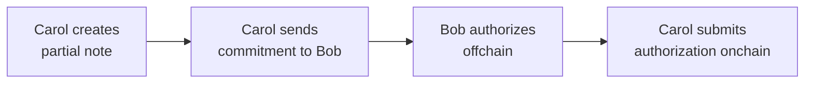
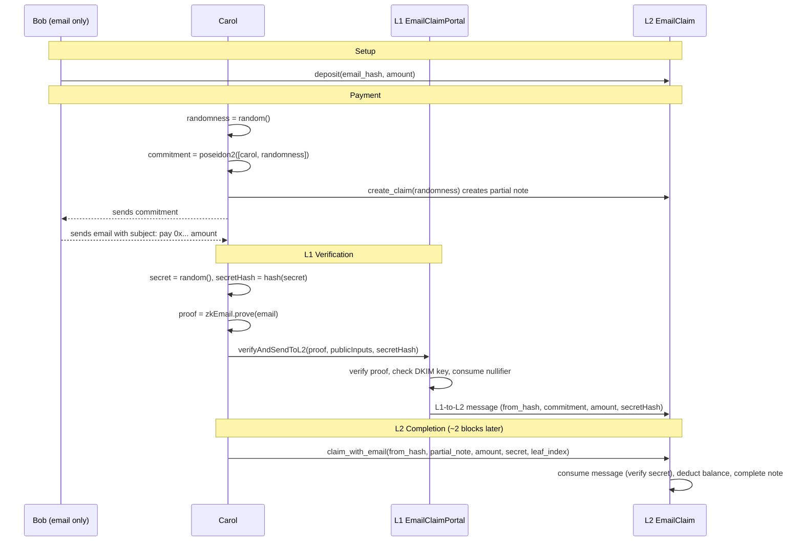

## Overview

In this tutorial, you will build a system where a sender (Bob) deposits tokens once and then authorizes payments entirely offchain. Recipients create partial notes for themselves, get Bob's offchain authorization, and submit it to claim their tokens. Bob never touches the network after the initial deposit. You will build two contracts that implement this pattern with different authorization mechanisms: Schnorr signatures (Part 2) and DKIM-signed emails via zkEmail (Part 4).

:::tip Full Working Example
The complete code for this tutorial is available in the [docs/examples](https://github.com/AztecProtocol/aztec-packages/tree/#include_aztec_version/docs/examples) directory. Clone it to follow along or use it as a reference.
:::

## Prerequisites

Before starting, ensure you have the following:

- Completed the [Private Token Contract tutorial](./token_contract.md)
- Understanding of partial notes and the public/private execution split
- Aztec toolchain installed
- For Part 4: familiarity with [L1-to-L2 messaging](../../foundational-topics/ethereum-aztec-messaging/inbox.md) and Solidity basics

## Part 1: Understanding the Architecture

### The Core Problem

Authorization witnesses (authwits) are the standard way to authorize actions on behalf of a user in Aztec. But they have a fundamental limitation for offchain workflows: a private authwit requires the signer's Private eXecution Environment (PXE) to be online at execution time, and a public authwit requires the signer to submit a transaction to the onchain registry. Neither lets a sender "pre-sign" an authorization and hand it to someone else while staying offline.

This tutorial solves that problem using **partial notes** combined with offchain signatures.

### Roles

This tutorial uses two participants throughout:

- **Bob (the sender)** holds tokens and authorizes payments. He deposits tokens into a contract once, then operates entirely offchain -- signing messages or sending emails. He never touches the network again after the initial deposit.

- **Carol (the recipient)** wants to receive tokens from Bob. She creates a partial note for herself, contacts Bob offchain to request authorization, and submits the final transaction to claim her tokens. Bob's participation requires no wallet, no PXE, and no network connection.

Carol never reveals her Aztec address to Bob. The commitment she sends him is `poseidon2([her_address, randomness])` -- a hash that Bob cannot invert. Bob authorizes a payment to whoever created that commitment, without learning who they are.

### Data Flow

Both contracts follow the same four-step flow:



1. **Carol creates a partial note** (private transaction on L2). This commits to her address and randomness, but leaves the amount unset.
2. **Carol sends the commitment to Bob** through any offchain channel (message, QR code, etc.).
3. **Bob authorizes offchain** -- either by signing with a Schnorr key (Part 2) or sending a DKIM-signed email (Part 4).
4. **Carol submits the authorization onchain** to complete the note and receive her tokens.

### How Partial Notes Enable This

The key mechanism is `UintNote::partial_with_randomness`. Carol provides the `randomness` as an explicit parameter rather than letting the contract sample it from the oracle. This makes the commitment **deterministic** from Carol's inputs. She can compute it offchain and send it to Bob for signing -- without waiting for the transaction to land or querying the PXE for return values.

The alternative -- atomically creating and completing the note in a single transaction -- would mean Bob has to sign before Carol's partial note exists. By splitting the flow, Bob signs a specific commitment that already exists onchain. The tradeoff is that Carol pays for two transactions, but the second one is purely public and cheap.

### Two Approaches

This tutorial builds two contracts that implement this pattern in different ways:

| | Part 2: Schnorr Signatures | Part 4: Email via zkEmail |
|---|---|---|
| **How Bob authorizes** | Signs with a dedicated Schnorr key | Sends a plain email (DKIM-signed by his mail server) |
| **Where verification happens** | Private function on L2 | Solidity contract on L1, bridged to L2 via cross-chain messaging |
| **Key management** | Bob manages a Schnorr private key | Bob uses his existing email account |
| **Latency** | Immediate (single L2 transaction) | ~2 L2 blocks (L1-to-L2 message delay) |
| **Cost** | One L2 transaction | L1 transaction + L2 transaction |

Both share the same balance model: Bob deposits tokens, the contract tracks his balance, and claims deduct from it.

### Why a Balance Model?

Bob deposits tokens into the contract, and the contract tracks a simple per-depositor balance. This is straightforward, but it means Bob can over-sign: he can produce more signed authorizations than he has funds for, since signatures are created offline and the contract cannot prevent this. Later claims will fail if Bob's balance runs out -- like a bounced check. See [Further Reading: Voucher Pattern](#further-reading-voucher-pattern) for an alternative design that provides structural protection against over-authorization.

### Privacy Tradeoffs

Both approaches share the same privacy profile:

- **Bob's deposit is public.** Observers can see how much Bob deposited and when funds are consumed.
- **Carol's identity is hidden.** The partial note commitment hides her address. Only Carol (and Bob, who knows the commitment) can link the payment to her.
- **The amount is public.** It must be, since the partial note is completed in public.

The email approach has one additional consideration: the email proof reveals the `from_address_hash` on L1, which is visible to Ethereum observers. In the Schnorr version, Bob's identity is only linked to his signing key on L2.

**Why can't this be fully private?** The claim is partially public by necessity. Bob is offline -- he cannot participate in private execution. So his balance must be public state that Carol can modify on his behalf by presenting a valid authorization. Any modification to public state is observable. Making Bob's balance private would require Carol to nullify Bob's private notes, which requires Bob's nullifier secret key -- something Carol doesn't have. Full privacy would require **contract-owned private notes**, where the contract itself holds a nullifier key and can spend escrowed notes. This is not currently supported by the Aztec protocol.

With this foundation in mind, let's build the Schnorr signature version first.

## Part 2: Writing the Schnorr Contract

The contract tracks deposits, signing keys, and private balances. Schnorr signature verification happens in private (because the `noir-lang/schnorr` library uses Blake2s, which is not AVM-compatible), and balance deduction happens in public.

### Storage

The contract needs public state to track deposits and signing keys, plus private state to store recipients' notes.

#include_code storage /docs/examples/contracts/offchain_transfer_contract/src/main.nr rust

Key fields:

- `deposits`: a per-depositor balance tracking how many tokens Bob has available for claims
- `signing_keys_x` / `signing_keys_y`: Schnorr public keys per depositor
- `balances`: private notes for recipients, using the standard `BalanceSet`

### Constructor

The contract is bound to a single token:

#include_code constructor /docs/examples/contracts/offchain_transfer_contract/src/main.nr rust

### Depositing

Bob calls `deposit` to load the contract with tokens. The function pulls tokens from Bob's public balance (via a pre-authorized public authwit on the token contract) and credits his deposit balance.

#include_code deposit /docs/examples/contracts/offchain_transfer_contract/src/main.nr rust

:::info Why no withdrawal?
There is no `withdraw` function. This is intentional. If Bob could withdraw, he could pull his balance out after signing authorizations, causing claims to fail. By making deposits irreversible, we guarantee that any signed authorization can be honored as long as Bob's balance hasn't been fully claimed.
:::

### Registering a Signing Key

Bob registers the Schnorr public key he'll use to sign authorizations. This key is separate from his Aztec account key, so the private key can live on any offline device.

#include_code register_signing_key /docs/examples/contracts/offchain_transfer_contract/src/main.nr rust

### Creating a Claim

Carol creates a partial note owned by herself, which will be funded later by Bob's signature.

#include_code create_claim /docs/examples/contracts/offchain_transfer_contract/src/main.nr rust

### Completing the Claim

Once Carol has Bob's signature, anyone can submit this function to verify the signature and complete the partial note. It is split into two phases: a private function that verifies the Schnorr signature, and a public continuation that deducts from Bob's balance and completes the partial note.

#include_code claim_with_signature /docs/examples/contracts/offchain_transfer_contract/src/main.nr rust

:::info Why verify the signature in private?
You might expect Schnorr verification to work in public: it decomposes to `ECADD` and `MSM`, which the AVM supports. Unfortunately, the `noir-lang/schnorr` library uses Blake2s internally for challenge generation, and Blake2s is **not** supported by the AVM transpiler. Schnorr verification therefore has to happen in the private phase.

To prevent a malicious caller from passing an arbitrary public key that matches their own signature, the public phase re-checks that the key matches what the depositor registered. If the keys don't match, the transaction reverts.
:::

### Function Breakdown: Chain of Trust

The two-phase split creates a chain of trust between private and public execution:

1. **Private phase:** verifies `schnorr::verify_signature(pub_key, sig, message_hash)` passes for the caller-provided `pub_key`.
2. **Public phase:** looks up the depositor, reads their registered key, and asserts it equals the `pub_key` that was used in private. If it doesn't match, we know the private verification used the wrong key and the tx reverts.
3. **Public phase:** checks the depositor's balance, deducts the amount, and completes the partial note.

The message hash is `poseidon2_hash_with_separator([contract_address, depositor, commitment, amount], 2)`. This binds the signature to the specific contract, depositor, partial note, and amount -- preventing replay, redirection, and amount manipulation.

## Part 3: TypeScript -- The Full Schnorr Flow

The following TypeScript example ties the full flow together: deploying contracts, depositing tokens, creating a claim, signing offchain, and completing the claim.

### Setup

#include_code setup /docs/examples/ts/offchain_transfer/index.ts typescript

### Bob Registers a Signing Key

Bob generates a Schnorr keypair and registers the public key with the contract. This is a **different** key from his Aztec account key -- it exists solely for offchain signing.

#include_code bob_signing_key /docs/examples/ts/offchain_transfer/index.ts typescript

### Bob Deposits

Bob deposits 500 tokens. He first sets up a public authwit authorizing the transfer contract to pull his tokens.

#include_code bob_deposit /docs/examples/ts/offchain_transfer/index.ts typescript

### Carol Creates a Claim

Carol generates fresh randomness, computes the partial note commitment offchain, then submits the private transaction that creates the partial note. She does not need to query the PXE for the transaction's return values, because the commitment is deterministic from her inputs.

#include_code carol_creates_claim /docs/examples/ts/offchain_transfer/index.ts typescript

:::warning Transaction ordering
Carol's `create_claim` transaction must be finalized before she submits `claim_with_signature`. The partial note creation pushes a validity commitment into the nullifier tree, and the completion step checks for its existence. If the first transaction has not yet been included in a block, the completion will fail.
:::

### Bob Signs Offchain

Carol sends Bob the commitment and the amount she wants. Bob constructs the message hash and signs it. This is the only step where Bob is involved after the initial setup, and it happens **entirely offline**.

#include_code bob_signs_offchain /docs/examples/ts/offchain_transfer/index.ts typescript

### Carol Completes the Claim

Carol submits a transaction with Bob's signature that verifies it in private and completes the note in public.

#include_code carol_completes /docs/examples/ts/offchain_transfer/index.ts typescript

### Verification

Carol should now see a private balance equal to the claim amount, and Bob's deposit balance should have decreased.

#include_code verify /docs/examples/ts/offchain_transfer/index.ts typescript

## Part 4: Email Authorization with zkEmail

### Design: Email as a Signing Oracle

The Schnorr approach requires Bob to manage a dedicated signing key. But every email Bob sends is already DKIM-signed by his mail server -- a cryptographic signature produced without any special software. [zkEmail](https://prove.email/) is a protocol that verifies DKIM signatures inside a zero-knowledge circuit, turning a plain email into a ZK proof.

By combining zkEmail with partial notes, we replace the Schnorr signing step with a regular email. Bob's mail server becomes the signing oracle.

### Architecture

Where the Schnorr version lives entirely on L2, the email version spans both layers:



1. **Setup:** Bob deposits tokens into the L2 contract and maps them to his email address hash.
2. **Carol creates a claim:** Same as Part 2 -- Carol creates a partial note, computes the commitment, and waits for the transaction to finalize.
3. **Bob sends an email:** Carol sends Bob the commitment. Bob replies with an email whose subject line encodes the commitment and amount:
   ```
   pay 0x<commitment> <amount>
   ```
   The `Subject` header is included in the DKIM `h=` field by default, so the mail server's DKIM signature covers it. Bob can compose this email from any standard email client.
4. **Carol submits the proof to L1:** Carol feeds the raw email into a zkEmail circuit and generates a ZK proof. She also generates a `secret` and computes its hash (`secretHash`). She submits the proof and `secretHash` to the L1 portal contract. The portal verifies the proof, checks the DKIM key is trusted, consumes the email's nullifier, and sends an L1-to-L2 message. The `secretHash` ensures only Carol (who knows the preimage) can consume the message on L2.
5. **Carol completes the claim on L2:** After ~2 L2 blocks (the minimum delay for L1-to-L2 messages), Carol provides her `secret` (the preimage of the `secretHash` she submitted to L1) along with the message leaf index. The L2 contract verifies the secret, consumes the message, deducts from Bob's balance, and completes her partial note.

:::warning Transaction ordering
As with Part 2, Carol's `create_claim` transaction must finalize before she submits `claim_with_email`. The L1-to-L2 message delay (~2 L2 blocks) typically provides more than enough time, but Carol should not submit the L1 proof before her `create_claim` has been included in a block.
:::

### The Email Proof

The ZK proof of the email produces six public outputs that the L1 portal and L2 contract consume:

| Output | Description |
|---|---|
| `pubkey_hash[0..1]` | Hash of the mail server's RSA public key (two fields, since RSA keys are large). The L1 portal checks this against a set of trusted DKIM keys. |
| `from_address_hash` | Hash of the sender's email address. The L2 contract uses this to look up the depositor's balance. |
| `commitment` | The partial note commitment, parsed from the email subject line. |
| `amount` | The token amount, parsed from the email subject line. |
| `nullifier` | Hash of the DKIM signature itself. This is deliberately **unblinded** (unlike zkEmail's built-in `blinded_nullifier`) so the L1 portal can detect and reject reuse of the same email. |

The proof can be generated using zkEmail's existing TypeScript toolchain and verified by their Solidity verifier on L1. The prover never needs to interact with Aztec directly.

## Part 5: The L1 Portal Contract

The Solidity portal sits on Ethereum and bridges email verification results to Aztec via L1-to-L2 messaging. It references a zkEmail proof verifier interface:

#include_code verifier_interface /docs/examples/solidity/email_claim/EmailClaimPortal.sol solidity

The portal maintains a set of trusted DKIM public key hashes (an allowlist of mail server keys) and a nullifier registry (to prevent the same email from being claimed twice):

#include_code portal_contract /docs/examples/solidity/email_claim/EmailClaimPortal.sol solidity

The core function verifies the proof, checks the DKIM key, consumes the nullifier, and sends the cross-chain message:

#include_code verify_and_send /docs/examples/solidity/email_claim/EmailClaimPortal.sol solidity

The content hash `sha256ToField(abi.encode(fromAddressHash, commitment, amount))` is the critical link between L1 and L2: the L2 contract must reconstruct this exact hash to consume the message.

## Part 6: The L2 Email Claim Contract

The Aztec contract follows the same balance model as Part 2. Bob deposits tokens mapped to his email address hash, and the L1-to-L2 message serves as the authorization instead of a Schnorr signature.

### Storage

#include_code storage /docs/examples/contracts/email_claim_contract/src/main.nr rust

The storage mirrors Part 2's structure: a `deposits` map tracks a balance (here keyed by email address hash instead of Aztec address), and `balances` stores recipients' private notes. The `portal` field holds the L1 contract address for message verification.

### Deposit

#include_code deposit /docs/examples/contracts/email_claim_contract/src/main.nr rust

As with Part 2, Bob can over-authorize: he can send emails totaling more than his deposited balance, and later claims will fail with "Insufficient depositor balance."

### Creating a Claim

Identical to Part 2. Carol provides randomness so the commitment is deterministic.

#include_code create_claim /docs/examples/contracts/email_claim_contract/src/main.nr rust

### Claiming with an Email Proof

This is the core function. It consumes the L1-to-L2 message, deducts from Bob's balance, and completes Carol's partial note:

#include_code claim_with_email /docs/examples/contracts/email_claim_contract/src/main.nr rust

The content hash computation inside this function reconstructs the exact encoding the L1 portal used when calling `inbox.sendL2Message`. If even one byte differs, `consume_l1_to_l2_message` will fail -- this is the cryptographic handshake between the two layers.

### TypeScript Integration (Exercise)

A full end-to-end TypeScript example for the email flow is left as an exercise. The key steps are:

1. **Deploy the L1 portal.** Deploy `EmailClaimPortal` to an Ethereum network (or a local Anvil fork). Call `initialize` with the Aztec registry address, the L2 `EmailClaim` contract address, and a zkEmail verifier address. Register at least one trusted DKIM public key hash via `registerDkimKeyHash`.

2. **Deploy the L2 contract.** Deploy `EmailClaim` on Aztec, passing the token address. Call `set_portal` with the L1 portal's Ethereum address.

3. **Bob deposits.** Same pattern as Part 2: set up a public authwit on the token contract, then call `deposit` with Bob's email address hash and amount.

4. **Carol creates a claim.** Identical to Part 2: generate randomness, compute the commitment offchain, call `create_claim`, and wait for finalization.

5. **Bob sends the email.** Bob sends an email with the subject line `pay 0x<commitment> <amount>`. The commitment and amount are encoded as hex strings. This step happens entirely outside the Aztec/Ethereum stack.

6. **Carol generates the zkEmail proof.** Use the [zkEmail SDK](https://prove.email/) to parse the raw email (including DKIM headers) and generate a ZK proof. The proof's public inputs are: the DKIM public key hash (two fields), the sender's email address hash, the commitment, the amount, and the email nullifier.

7. **Carol submits the proof to L1.** Generate a random `secret` and compute `secretHash = hash(secret)`. Call `verifyAndSendToL2` on the portal with the proof, public inputs, and `secretHash`. This sends an L1-to-L2 message.

8. **Carol completes the claim on L2.** After ~2 L2 blocks, call `claim_with_email` with the `from_address_hash`, `partial_note`, `amount`, `secret` (the preimage), and the `message_leaf_index` returned by the L1 transaction.

The main additional dependencies compared to Part 2 are: a zkEmail prover (for step 6), Solidity deployment tooling such as Foundry or Hardhat (for steps 1 and 7), and access to raw email data including DKIM headers (for step 5).

## Part 7: Security and Design Considerations

### Security Notes

**Shared across both approaches:**
- **Randomness must be fresh.** Carol should never reuse randomness across claims. Reusing randomness links partial notes together and reveals her identity as the common owner.
- **Front-running is bounded.** An attacker who sees a pending claim transaction cannot redirect it: the authorization (signature or email proof) binds to a specific commitment, and only Carol's partial note has that commitment.
- **Over-authorization is possible.** Both approaches use a simple balance model. Bob can sign authorizations (or send emails) totaling more than his deposit; excess claims fail at the balance check. This is a social problem, not a cryptographic one -- like writing checks that exceed your bank balance.

**Schnorr-specific:**
- **Key management matters.** If Bob's signing key leaks, anyone with the key can sign authorizations in his name until his deposited balance is fully claimed.

**Email-specific:**
- **Double-emailing is possible but cannot be double-claimed.** Each email produces a unique nullifier (hash of the DKIM signature). The L1 portal rejects any nullifier it has seen before.
- **DKIM key rotation.** If a mail server rotates its DKIM key, the portal's trusted key set must be updated. Emails signed with an old key will be rejected unless the old key hash is still trusted.

### When to Use Which

**Use the Schnorr signature approach when:**
- You need immediate settlement (no L1 round-trip)
- The sender can manage a dedicated signing key
- You want the simplest possible implementation

**Use the email approach when:**
- The sender cannot or will not install any special software
- You want the lowest possible barrier to entry for the sender
- You are comfortable with L1 transaction costs and the ~2 block message delay
- The sender is willing to use a structured email subject format

**Neither approach is a good fit when:**
- The sender also needs balance privacy (both approaches make the deposit public)
- The sender can run a PXE and submit transactions normally (use standard [authwits](../../foundational-topics/advanced/authwit.md) instead)

### Further Reading: Voucher Pattern

The balance model used in this tutorial is simple but allows over-authorization: Bob can sign more authorizations than his balance can cover. An alternative design provides **structural protection** against this by replacing the open-ended balance with fixed-denomination **vouchers**.

In the voucher pattern, Bob's deposit creates exactly N vouchers, each worth a fixed amount (e.g. 5 vouchers of 100 tokens). Each voucher has a unique ID and can only be consumed once. Bob signs authorizations against specific voucher IDs rather than an open balance, so the total number of valid authorizations is bounded by N -- over-signing beyond the deposit is structurally impossible.

The tradeoff is real complexity: the contract needs per-voucher storage (validity flags, denomination, owner), voucher ID computation, and a maximum-per-deposit iteration loop. Fixed denominations also create fragmentation -- you cannot pay 150 tokens with 100-token vouchers without consuming two and dealing with change. For most use cases, the balance model's simplicity outweighs the voucher model's structural guarantee, but the voucher pattern is worth considering when Bob is authorizing payments to many unknown recipients and you want to bound the number of people who can be left holding worthless authorizations.

## Next Steps

- **[L1-to-L2 Messaging](../../foundational-topics/ethereum-aztec-messaging/inbox.md):** Understand how cross-chain messages flow between Ethereum and Aztec, which underpins the email authorization pattern in Part 4.
- **[Bridge Your NFT to Aztec](../js_tutorials/token_bridge.md):** A full end-to-end tutorial on building an L1 portal contract and L2 bridge, including deployment and TypeScript testing.
- **[Verify Noir Proofs in Aztec Contracts](./recursive_verification.md):** Learn how to generate offchain ZK proofs and verify them inside Aztec private functions -- a complementary pattern to the L1 verification used in Part 4.
