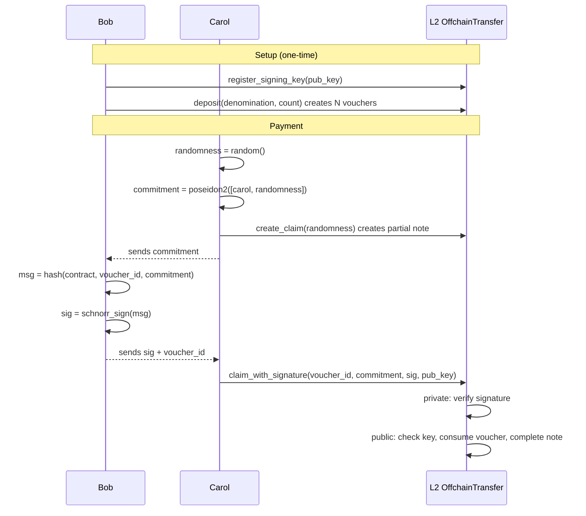
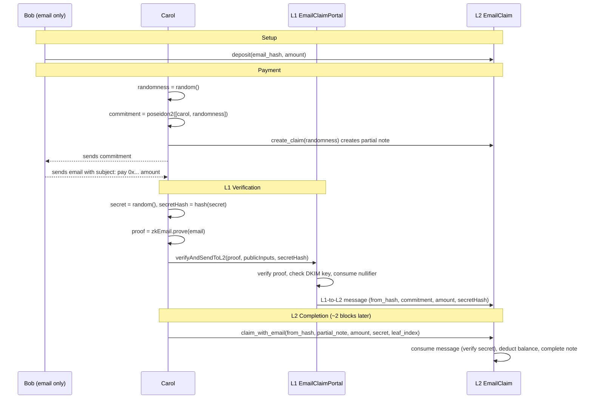

## The Problem

Imagine Bob wants to pay people without ever connecting to the network. He deposits tokens once, and from that point on he authorizes payments offchain. Anyone holding Bob's authorization can submit it to claim the tokens. Bob's device never touches the network after the initial deposit.

This pattern sidesteps a fundamental limitation of authorization witnesses: a private authwit requires the signer's Private eXecution Environment (PXE) to be online at execution time, and a public authwit requires the signer to submit a transaction to the onchain registry. Neither lets Bob "pre-sign" an authorization and hand it to someone else.

This tutorial builds **two contracts** that solve this problem in different ways:

| | Part 1: Schnorr Vouchers | Part 2: Email via zkEmail |
|---|---|---|
| **How Bob authorizes** | Signs with a dedicated Schnorr key | Sends a plain email (DKIM-signed by his mail server) |
| **Where verification happens** | Private function on L2 | Solidity contract on L1, bridged to L2 via cross-chain messaging |
| **Key management** | Bob manages a Schnorr private key | Bob uses his existing email account |
| **Latency** | Immediate (single L2 transaction) | ~2 L2 blocks (L1-to-L2 message delay) |
| **Cost** | One L2 transaction | L1 transaction + L2 transaction |

Both approaches share the same core mechanism: **partial notes**. Bob's authorization (whether a signature or an email) funds a partial note that the recipient created for herself.

## Prerequisites

- Completed the [Private Token Contract tutorial](./token_contract.md)
- Understanding of partial notes and the public/private execution split
- Aztec toolchain installed
- For Part 2: familiarity with [L1-to-L2 messaging](../../foundational-topics/ethereum-aztec-messaging/inbox.md) and Solidity basics

## How Partial Notes Enable Offchain Authorization

Both contracts in this tutorial follow the same two-transaction flow:

1. **Carol creates a partial note.** This is a private transaction that commits to Carol's address and some randomness, but leaves the amount and storage slot unset. The result is a `PartialUintNote` containing a single field: the **commitment**.

2. **Someone completes the partial note.** A second transaction provides the missing fields (amount and storage slot) and inserts the completed note hash into the note hash tree. This can happen in public — the commitment hides Carol's identity.

The key property: Carol provides the `randomness` as an explicit parameter (via `UintNote::partial_with_randomness`) rather than letting the contract sample it from the oracle. This makes the commitment **deterministic** from Carol's inputs. She can compute it offchain and send it to Bob for signing — without waiting for the transaction to land or querying the PXE for return values.

### Why a two-transaction flow?

The alternative — atomically creating and completing the note in a single transaction — is possible, but it means Bob has to sign before Carol's partial note exists. Bob would be signing a "promise" that isn't yet bound to any specific note.

By splitting the flow, Bob signs a specific partial note commitment that already exists onchain. The tradeoff is that Carol pays for two transactions, but the second one is purely public and cheap.

## Part 1: Schnorr Vouchers

### Design: Why Vouchers?

If Bob just deposited a raw balance, he could sign more authorizations than he has funds for. The contract has no way to prevent offchain over-signing, because signatures are produced offline. Later claims would fail when Bob's balance runs out — like bouncing a check.

Fixed-denomination vouchers solve this: Bob gets exactly N vouchers, each worth a fixed amount. He can sign at most N authorizations, and each voucher can only be consumed once. Over-signing is mathematically impossible.

### The Flow



1. **Setup (one-time):** Bob deposits tokens into the contract as N vouchers of a fixed denomination, and registers a Schnorr signing key.
2. **Carol creates a claim:** Carol generates randomness, computes the commitment locally, then submits a private transaction that creates the partial note. She must wait for this transaction to finalize before proceeding.
3. **Bob signs offchain:** Carol sends Bob the commitment. Bob signs `hash(contract, voucher_id, commitment)` using his offchain signing key.
4. **Carol completes the claim:** Carol submits a transaction that verifies Bob's signature, consumes the voucher, and funds the partial note.

After step 1, Bob never touches the network again. He only signs messages offchain.

:::warning Transaction ordering
Carol's `create_claim` transaction must be finalized before she submits `claim_with_signature`. The partial note creation pushes a validity commitment into the nullifier tree, and the completion step checks for its existence. If the first transaction has not yet been included in a block, the completion will fail.
:::

### Contract Structure

#### Storage

The contract needs public state to track vouchers and signing keys, plus private state to store recipients' notes.

#include_code storage /docs/examples/contracts/offchain_transfer_contract/src/main.nr rust

Key fields:

- `vouchers`: a map from voucher ID to "is this voucher still valid?"
- `voucher_denominations` and `voucher_owners`: metadata keyed by voucher ID
- `signing_keys_x` / `signing_keys_y`: Schnorr public keys per depositor
- `balances`: private notes for recipients, using the standard `BalanceSet`

#### Constructor

The contract is bound to a single token:

#include_code constructor /docs/examples/contracts/offchain_transfer_contract/src/main.nr rust

#### Depositing Vouchers

Bob calls `deposit` to load the contract. The function pulls tokens from Bob's public balance (via a pre-authorized public authwit on the token contract) and creates `count` vouchers of the specified `denomination`.

#include_code deposit /docs/examples/contracts/offchain_transfer_contract/src/main.nr rust

Each voucher ID is computed as `hash(depositor, denomination, index)`, which ensures uniqueness across depositors and multiple deposits.

:::info Why no withdrawal?
There is no `withdraw` function. This is intentional. If Bob could withdraw, he could pull his balance out after signing vouchers, causing claims to fail. By making deposits irreversible, we guarantee that any voucher Bob signs can be claimed as long as it hasn't been used.
:::

#### Registering a Signing Key

Bob registers the Schnorr public key he'll use to sign vouchers. This key is separate from his Aztec account key, so the private key can live on any offline device.

#include_code register_signing_key /docs/examples/contracts/offchain_transfer_contract/src/main.nr rust

#### Creating a Claim

Carol creates a partial note owned by herself, which will be funded later by Bob's signature.

#include_code create_claim /docs/examples/contracts/offchain_transfer_contract/src/main.nr rust

#### Completing the Claim

Once Carol has Bob's signature, anyone can submit this function to verify the signature and complete the partial note. It is split into two phases: a private function that verifies the Schnorr signature, and a public continuation that consumes the voucher and completes the partial note.

#include_code claim_with_signature /docs/examples/contracts/offchain_transfer_contract/src/main.nr rust

:::info Why verify the signature in private?
You might expect Schnorr verification to work in public: it decomposes to `ECADD` and `MSM`, which the AVM supports. Unfortunately, the `noir-lang/schnorr` library uses Blake2s internally for challenge generation, and Blake2s is **not** supported by the AVM transpiler. Schnorr verification therefore has to happen in the private phase.

To prevent a malicious caller from passing an arbitrary public key that matches their own signature, the public phase re-checks that the key matches what the voucher owner registered. If the keys don't match, the transaction reverts.
:::

The chain of trust is:

1. **Private phase:** verifies `schnorr::verify_signature(pub_key, sig, message_hash)` passes for the caller-provided `pub_key`.
2. **Public phase:** looks up the voucher's owner, reads their registered key, and asserts it equals the `pub_key` that was used in private. If it doesn't match, we know the private verification used the wrong key and the tx reverts.
3. **Public phase:** checks voucher validity, consumes it, and completes the partial note.

### TypeScript: The Full Flow

The following TypeScript example ties the full flow together.

#### Setup

#include_code setup /docs/examples/ts/offchain_transfer/index.ts typescript

#### Bob Registers a Signing Key

Bob generates a Schnorr keypair and registers the public key with the contract.

#include_code bob_signing_key /docs/examples/ts/offchain_transfer/index.ts typescript

#### Bob Deposits

Bob creates 5 vouchers of 100 tokens each. He first sets up a public authwit authorizing the transfer contract to pull his tokens.

#include_code bob_deposit /docs/examples/ts/offchain_transfer/index.ts typescript

#### Carol Creates a Claim

Carol generates fresh randomness, computes the partial note commitment offchain, then submits the private transaction that creates the partial note.

#include_code carol_creates_claim /docs/examples/ts/offchain_transfer/index.ts typescript

She computes the commitment locally. She does not need to query the PXE for the transaction's return values, because the commitment is deterministic from her inputs.

#### Bob Signs Offchain

Carol sends Bob the commitment. Bob picks a voucher, constructs the message hash, and signs it. This is the only step where Bob is involved after the initial setup, and it happens **entirely offline**.

#include_code bob_signs_offchain /docs/examples/ts/offchain_transfer/index.ts typescript

#### Carol Completes the Claim

Carol submits a purely public transaction with Bob's signature.

#include_code carol_completes /docs/examples/ts/offchain_transfer/index.ts typescript

#### Verification

Carol should now see a private balance equal to the voucher's denomination, and the voucher should be consumed.

#include_code verify /docs/examples/ts/offchain_transfer/index.ts typescript

## Part 2: Email Authorization with zkEmail

### Design: Email as a Signing Oracle

The Schnorr approach requires Bob to manage a dedicated signing key. But every email Bob sends is already DKIM-signed by his mail server — a cryptographic signature produced without any special software. [zkEmail](https://prove.email/) is a protocol that verifies DKIM signatures inside a zero-knowledge circuit, turning a plain email into a ZK proof.

By combining zkEmail with partial notes, we replace the Schnorr signing step with a regular email. Bob's mail server becomes the signing oracle.

### Architecture

Where the Schnorr version lives entirely on L2, the email version spans both layers:



1. **Setup:** Bob deposits tokens into the L2 contract and maps them to his email address hash.
2. **Carol creates a claim:** Same as Part 1 — Carol creates a partial note, computes the commitment, and waits for the transaction to finalize.
3. **Bob sends an email:** Carol sends Bob the commitment. Bob replies with an email whose subject line encodes the commitment and amount:
   ```
   pay 0x<commitment> <amount>
   ```
   The `Subject` header is included in the DKIM `h=` field by default, so the mail server's DKIM signature covers it. Bob can compose this email from any standard email client.
4. **Carol submits the proof to L1:** Carol feeds the raw email into a zkEmail circuit and generates a ZK proof. She also generates a `secret` and computes its hash (`secretHash`). She submits the proof and `secretHash` to the L1 portal contract. The portal verifies the proof, checks the DKIM key is trusted, consumes the email's nullifier, and sends an L1-to-L2 message. The `secretHash` ensures only Carol (who knows the preimage) can consume the message on L2.
5. **Carol completes the claim on L2:** After ~2 L2 blocks (the minimum delay for L1-to-L2 messages), Carol provides her `secret` (the preimage of the `secretHash` she submitted to L1) along with the message leaf index. The L2 contract verifies the secret, consumes the message, deducts from Bob's balance, and completes her partial note.

:::warning Transaction ordering
As with Part 1, Carol's `create_claim` transaction must finalize before she submits `claim_with_email`. The L1-to-L2 message delay (~2 L2 blocks) typically provides more than enough time, but Carol should not submit the L1 proof before her `create_claim` has been included in a block.
:::

### The Email Proof

The ZK proof of the email produces six public outputs that the L1 portal and L2 contract consume:

| Output | Description |
|---|---|
| `pubkey_hash[0..1]` | Hash of the mail server's RSA public key (two fields, since RSA keys are large). The L1 portal checks this against a set of trusted DKIM keys. |
| `from_address_hash` | Hash of the sender's email address. The L2 contract uses this to look up the depositor's balance. |
| `commitment` | The partial note commitment, parsed from the email subject line. |
| `amount` | The token amount, parsed from the email subject line. |
| `nullifier` | Hash of the DKIM signature itself. This is deliberately **unblinded** (unlike zkEmail's built-in `blinded_nullifier`) so the L1 portal can detect and reject reuse of the same email. |

The proof can be generated using zkEmail's existing TypeScript toolchain and verified by their Solidity verifier on L1. The prover never needs to interact with Aztec directly.

### The L1 Portal Contract

The Solidity portal sits on Ethereum and bridges email verification results to Aztec via L1-to-L2 messaging. It references a zkEmail proof verifier interface:

#include_code verifier_interface /docs/examples/solidity/email_claim/EmailClaimPortal.sol solidity

The portal maintains a set of trusted DKIM public key hashes (an allowlist of mail server keys) and a nullifier registry (to prevent the same email from being claimed twice):

#include_code portal_contract /docs/examples/solidity/email_claim/EmailClaimPortal.sol solidity

The core function verifies the proof, checks the DKIM key, consumes the nullifier, and sends the cross-chain message:

#include_code verify_and_send /docs/examples/solidity/email_claim/EmailClaimPortal.sol solidity

The content hash `sha256ToField(abi.encode(fromAddressHash, commitment, amount))` is the critical link between L1 and L2: the L2 contract must reconstruct this exact hash to consume the message.

### The L2 Contract

The Aztec contract is simpler than the Schnorr version. There is no signature verification and no voucher system. Bob deposits tokens mapped to his email address hash, and the L1-to-L2 message serves as the authorization.

#### Storage

#include_code storage /docs/examples/contracts/email_claim_contract/src/main.nr rust

Compared to Part 1, the storage is smaller: no voucher maps or signing key maps. The `deposits` map tracks a simple balance per email address hash, and the `portal` field holds the L1 contract address for message verification.

#### Deposit

#include_code deposit /docs/examples/contracts/email_claim_contract/src/main.nr rust

Unlike the voucher model, there is no over-signing protection here. Bob can send emails totaling more than his deposited balance; later claims will fail with "Insufficient depositor balance." This is the "bouncing check" tradeoff — simpler design, but less structural guarantee.

#### Creating a Claim

Identical to Part 1. Carol provides randomness so the commitment is deterministic.

#include_code create_claim /docs/examples/contracts/email_claim_contract/src/main.nr rust

#### Claiming with an Email Proof

This is the core function. It consumes the L1-to-L2 message, deducts from Bob's balance, and completes Carol's partial note:

#include_code claim_with_email /docs/examples/contracts/email_claim_contract/src/main.nr rust

The content hash computation inside this function reconstructs the exact encoding the L1 portal used when calling `inbox.sendL2Message`. If even one byte differs, `consume_l1_to_l2_message` will fail — this is the cryptographic handshake between the two layers.

## Privacy Tradeoffs

Both approaches share the same privacy profile:

- **Bob's deposit is public.** Observers can see how much Bob deposited and when funds are consumed.
- **Carol's identity is hidden.** The partial note commitment hides her address. Only Carol (and Bob, who knows the commitment) can link the payment to her.
- **The amount is public.** It must be, since the partial note is completed in public.

The email approach has one additional consideration: the email proof reveals the `from_address_hash` on L1, which is visible to Ethereum observers. In the Schnorr version, Bob's identity is only linked to his signing key on L2.

## Security Notes

**Shared across both approaches:**
- **Randomness must be fresh.** Carol should never reuse randomness across claims. Reusing randomness links partial notes together and reveals her identity as the common owner.
- **Front-running is bounded.** An attacker who sees a pending claim transaction cannot redirect it: the authorization (signature or email proof) binds to a specific commitment, and only Carol's partial note has that commitment.

**Schnorr-specific:**
- **Double-signing is possible but cannot be double-spent.** If Bob signs the same voucher to two people, only the first claim succeeds. This is equivalent to handing the same physical bill to two people — a social problem, not a cryptographic one.
- **Key management matters.** If Bob's signing key leaks, anyone with the key can sign vouchers in his name until all vouchers are consumed.

**Email-specific:**
- **Double-emailing is possible but cannot be double-claimed.** Each email produces a unique nullifier (hash of the DKIM signature). The L1 portal rejects any nullifier it has seen before.
- **Over-authorization is possible.** Unlike vouchers, the email approach uses a simple balance. Bob can send emails totaling more than his deposit; excess claims fail at the L2 balance check.
- **DKIM key rotation.** If a mail server rotates its DKIM key, the portal's trusted key set must be updated. Emails signed with an old key will be rejected unless the old key hash is still trusted.

## When to Use Which

**Use the Schnorr voucher approach when:**
- You need immediate settlement (no L1 round-trip)
- You want structural over-signing protection (vouchers cap total authorizations)
- The sender can manage a dedicated signing key

**Use the email approach when:**
- The sender cannot or will not install any special software
- You want the lowest possible barrier to entry for the sender
- You are comfortable with L1 transaction costs and the ~2 block message delay
- The sender is willing to use a structured email subject format

**Neither approach is a good fit when:**
- The sender also needs balance privacy (both approaches make the deposit public)
- The sender can run a PXE and submit transactions normally (use standard [authwits](../../foundational-topics/advanced/authwit.md) instead)

## Next Steps

- **[L1-to-L2 Messaging](../../foundational-topics/ethereum-aztec-messaging/inbox.md):** Understand how cross-chain messages flow between Ethereum and Aztec, which underpins the email authorization pattern in Part 2.
- **[Bridge Your NFT to Aztec](../js_tutorials/token_bridge.md):** A full end-to-end tutorial on building an L1 portal contract and L2 bridge, including deployment and TypeScript testing.
- **[Verify Noir Proofs in Aztec Contracts](./recursive_verification.md):** Learn how to generate offchain ZK proofs and verify them inside Aztec private functions — a complementary pattern to the L1 verification used in Part 2.
