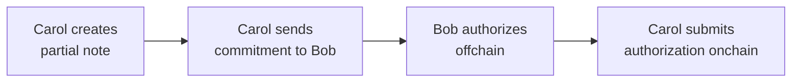

## Overview

In this tutorial, you will build a contract where a sender (Bob) deposits tokens once and then authorizes payments entirely offchain using Schnorr signatures. Recipients create partial notes for themselves, get Bob's offchain authorization, and submit it to claim their tokens. Bob never touches the network after the initial deposit.

:::tip Full Working Example
The complete code for this tutorial is available in the [docs/examples](https://github.com/AztecProtocol/aztec-packages/tree/#include_aztec_version/docs/examples) directory. Clone it to follow along or use it as a reference.
:::

## Prerequisites

Before starting, ensure you have the following:

- Completed the [Private Token Contract tutorial](./token_contract.md)
- Understanding of partial notes and the public/private execution split
- Aztec toolchain installed

## Part 1: Understanding the Architecture

### The Core Problem

Authorization witnesses (authwits) are the standard way to authorize actions on behalf of a user in Aztec. But they have a fundamental limitation for offchain workflows: a private authwit requires the signer's Private eXecution Environment (PXE) to be online at execution time, and a public authwit requires the signer to submit a transaction to the onchain registry. Neither lets a sender "pre-sign" an authorization and hand it to someone else while staying offline.

This tutorial solves that problem using **partial notes** combined with offchain signatures.

### Roles

This tutorial uses two participants throughout:

- **Bob (the sender)** holds tokens and authorizes payments. He deposits tokens into a contract once, then operates entirely offchain -- signing messages with a dedicated Schnorr key. He never touches the network again after the initial deposit.

- **Carol (the recipient)** wants to receive tokens from Bob. She creates a partial note for herself, contacts Bob offchain to request authorization, and submits the final transaction to claim her tokens. Bob's participation requires no wallet, no PXE, and no network connection.

Carol never reveals her Aztec address to Bob. The commitment she sends him is `poseidon2([her_address, randomness])` -- a hash that Bob cannot invert. Bob authorizes a payment to whoever created that commitment, without learning who they are.

### Data Flow

The contract follows a four-step flow:

1. **Carol creates a partial note** (private transaction on L2). This commits to her address and randomness, but leaves the amount unset.
2. **Carol sends the commitment to Bob** through any offchain channel (message, QR code, etc.).
3. **Bob authorizes offchain** by signing with a Schnorr key.
4. **Carol submits the authorization onchain** to complete the note and receive her tokens.

### How Partial Notes Enable This

The key mechanism is `UintNote::partial_with_randomness`. Carol provides the `randomness` as an explicit parameter rather than letting the contract sample it from the oracle. This makes the commitment **deterministic** from Carol's inputs. She can compute it offchain and send it to Bob for signing -- without waiting for the transaction to land or querying the PXE for return values.

The alternative -- atomically creating and completing the note in a single transaction -- would mean Bob has to sign before Carol's partial note exists. By splitting the flow, Bob signs a specific commitment that already exists onchain. The tradeoff is that Carol pays for two transactions, but the second one is purely public and cheap.

The contract uses Schnorr signatures for authorization. Bob registers a dedicated signing key, then signs messages offchain. Verification happens in a private function on L2, and balance deduction happens in public.

### Why a Balance Model?

Bob deposits tokens into the contract, and the contract tracks a simple per-depositor balance. This is straightforward, but it means Bob can over-sign: he can produce more signed authorizations than he has funds for, since signatures are created offline and the contract cannot prevent this. Later claims will fail if Bob's balance runs out -- like a bounced check. See [Further Reading: Voucher Pattern](#further-reading-voucher-pattern) for an alternative design that provides structural protection against over-authorization.

### Privacy Tradeoffs

- **Bob's deposit is public.** Observers can see how much Bob deposited and when funds are consumed.
- **Carol's identity is hidden.** The partial note commitment hides her address. Only Carol (and Bob, who knows the commitment) can link the payment to her.
- **The amount is public.** It must be, since the partial note is completed in public.

**Why can't this be fully private?** The claim is partially public by necessity. Bob is offline -- he cannot participate in private execution. So his balance must be public state that Carol can modify on his behalf by presenting a valid authorization. Any modification to public state is observable. Making Bob's balance private would require Carol to nullify Bob's private notes, which requires Bob's nullifier secret key -- something Carol doesn't have. Full privacy would require **contract-owned private notes**, where the contract itself holds a nullifier key and can spend escrowed notes. This is not currently supported by the Aztec protocol.

## Part 2: Writing the Schnorr Contract

The contract tracks deposits, signing keys, and private balances. Schnorr signature verification happens in private (because the `noir-lang/schnorr` library uses Blake2s, which is not AVM-compatible), and balance deduction happens in public.

### Storage

The contract needs public state to track deposits and signing keys, plus private state to store recipients' notes.

#include_code storage /docs/examples/contracts/offchain_transfer_contract/src/main.nr rust

Key fields:

- `deposits`: a per-depositor balance tracking how many tokens Bob has available for claims
- `signing_keys_x` / `signing_keys_y`: Schnorr public keys per depositor
- `balances`: private notes for recipients, using the standard `BalanceSet`

### Constructor

The contract is bound to a single token:

#include_code constructor /docs/examples/contracts/offchain_transfer_contract/src/main.nr rust

### Depositing

Bob calls `deposit` to load the contract with tokens. The function pulls tokens from Bob's public balance (via a pre-authorized public authwit on the token contract) and credits his deposit balance.

#include_code deposit /docs/examples/contracts/offchain_transfer_contract/src/main.nr rust

:::info Why no withdrawal?
There is no `withdraw` function. This is intentional. If Bob could withdraw, he could pull his balance out after signing authorizations, causing claims to fail. By making deposits irreversible, we guarantee that any signed authorization can be honored as long as Bob's balance hasn't been fully claimed.
:::

### Registering a Signing Key

Bob registers the Schnorr public key he'll use to sign authorizations. This key is separate from his Aztec account key, so the private key can live on any offline device.

#include_code register_signing_key /docs/examples/contracts/offchain_transfer_contract/src/main.nr rust

### Creating a Claim

Carol creates a partial note owned by herself, which will be funded later by Bob's signature.

#include_code create_claim /docs/examples/contracts/offchain_transfer_contract/src/main.nr rust

### Completing the Claim

Once Carol has Bob's signature, anyone can submit this function to verify the signature and complete the partial note. It is split into two phases: a private function that verifies the Schnorr signature, and a public continuation that deducts from Bob's balance and completes the partial note.

#include_code claim_with_signature /docs/examples/contracts/offchain_transfer_contract/src/main.nr rust

:::info Why verify the signature in private?
You might expect Schnorr verification to work in public: it decomposes to `ECADD` and `MSM`, which the AVM supports. Unfortunately, the `noir-lang/schnorr` library uses Blake2s internally for challenge generation, and Blake2s is **not** supported by the AVM transpiler. Schnorr verification therefore has to happen in the private phase.

To prevent a malicious caller from passing an arbitrary public key that matches their own signature, the public phase re-checks that the key matches what the depositor registered. If the keys don't match, the transaction reverts.
:::

### Function Breakdown: Chain of Trust

The two-phase split creates a chain of trust between private and public execution:

1. **Private phase:** verifies `schnorr::verify_signature(pub_key, sig, message_hash)` passes for the caller-provided `pub_key`.
2. **Public phase:** looks up the depositor, reads their registered key, and asserts it equals the `pub_key` that was used in private. If it doesn't match, we know the private verification used the wrong key and the tx reverts.
3. **Public phase:** checks the depositor's balance, deducts the amount, and completes the partial note.

The message hash is `poseidon2_hash_with_separator([contract_address, depositor, commitment, amount], 2)`. This binds the signature to the specific contract, depositor, partial note, and amount -- preventing replay, redirection, and amount manipulation.

## Part 3: TypeScript -- The Full Schnorr Flow

The following TypeScript example ties the full flow together: deploying contracts, depositing tokens, creating a claim, signing offchain, and completing the claim.

### Setup

#include_code setup /docs/examples/ts/offchain_transfer/index.ts typescript

### Bob Registers a Signing Key

Bob generates a Schnorr keypair and registers the public key with the contract. This is a **different** key from his Aztec account key -- it exists solely for offchain signing.

#include_code bob_signing_key /docs/examples/ts/offchain_transfer/index.ts typescript

### Bob Deposits

Bob deposits 500 tokens. He first sets up a public authwit authorizing the transfer contract to pull his tokens.

#include_code bob_deposit /docs/examples/ts/offchain_transfer/index.ts typescript

### Carol Creates a Claim

Carol generates fresh randomness, computes the partial note commitment offchain, then submits the private transaction that creates the partial note. She does not need to query the PXE for the transaction's return values, because the commitment is deterministic from her inputs.

#include_code carol_creates_claim /docs/examples/ts/offchain_transfer/index.ts typescript

:::warning Transaction ordering
Carol's `create_claim` transaction must be finalized before she submits `claim_with_signature`. The partial note creation pushes a validity commitment into the nullifier tree, and the completion step checks for its existence. If the first transaction has not yet been included in a block, the completion will fail.
:::

### Bob Signs Offchain

Carol sends Bob the commitment and the amount she wants. Bob constructs the message hash and signs it. This is the only step where Bob is involved after the initial setup, and it happens **entirely offline**.

#include_code bob_signs_offchain /docs/examples/ts/offchain_transfer/index.ts typescript

### Carol Completes the Claim

Carol submits a transaction with Bob's signature that verifies it in private and completes the note in public.

#include_code carol_completes /docs/examples/ts/offchain_transfer/index.ts typescript

### Verification

Carol should now see a private balance equal to the claim amount, and Bob's deposit balance should have decreased.

#include_code verify /docs/examples/ts/offchain_transfer/index.ts typescript

## Security and Design Considerations

### Security Notes

- **Randomness must be fresh.** Carol should never reuse randomness across claims. Reusing randomness links partial notes together and reveals her identity as the common owner.
- **Front-running is bounded.** An attacker who sees a pending claim transaction cannot redirect it: the signature binds to a specific commitment, and only Carol's partial note has that commitment.
- **Over-authorization is possible.** The contract uses a simple balance model. Bob can sign authorizations totaling more than his deposit; excess claims fail at the balance check. This is a social problem, not a cryptographic one -- like writing checks that exceed your bank balance.
- **Key management matters.** If Bob's signing key leaks, anyone with the key can sign authorizations in his name until his deposited balance is fully claimed. The signing key is separate from Bob's Aztec account key, so a compromise does not affect Bob's account directly.

:::tip When to use this pattern
This pattern is useful when the sender can manage a dedicated signing key and wants immediate settlement with minimal complexity. If the sender can run a PXE and submit transactions normally, use standard [authwits](../../foundational-topics/advanced/authwit.md) instead.
:::

### Further Reading: Voucher Pattern

The balance model used in this tutorial is simple but allows over-authorization: Bob can sign more authorizations than his balance can cover. An alternative design provides **structural protection** against this by replacing the open-ended balance with fixed-denomination **vouchers**.

In the voucher pattern, Bob's deposit creates exactly N vouchers, each worth a fixed amount (e.g. 5 vouchers of 100 tokens). Each voucher has a unique ID and can only be consumed once. Bob signs authorizations against specific voucher IDs rather than an open balance, so the total number of valid authorizations is bounded by N -- over-signing beyond the deposit is structurally impossible.

The tradeoff is real complexity: the contract needs per-voucher storage (validity flags, denomination, owner), voucher ID computation, and a maximum-per-deposit iteration loop. Fixed denominations also create fragmentation -- you cannot pay 150 tokens with 100-token vouchers without consuming two and dealing with change. For most use cases, the balance model's simplicity outweighs the voucher model's structural guarantee, but the voucher pattern is worth considering when Bob is authorizing payments to many unknown recipients and you want to bound the number of people who can be left holding worthless authorizations.

### Alternative Authorization Mechanisms

This tutorial uses Schnorr signatures because they are simple and self-contained, but the same partial note pattern works with any authorization mechanism that can be verified in a Noir circuit. For example:

- **zkEmail:** Replace the Schnorr signing step with a regular email. Bob's mail server DKIM-signs every email he sends, and a ZK circuit can verify that signature without revealing the email contents. The [zkemail verification example](https://github.com/AztecProtocol/aztec-examples/tree/main/zkemail_verification) demonstrates this approach with recursive proof verification on L2.
- **ECDSA signatures:** Use an existing Ethereum key to sign authorizations, bridging Web3 wallet UX to Aztec.
- **WebAuthn / passkeys:** Use hardware-backed credentials for authorization, enabling mobile-friendly flows.

The key architectural insight is that the partial note and balance model are independent of the authorization mechanism. You can swap the signature verification in `claim_with_signature` for any proof that convinces the contract the depositor authorized the payment.

## Next Steps

- **[Verify Noir Proofs in Aztec Contracts](./recursive_verification.md):** Learn how to verify arbitrary Noir proofs inside Aztec contracts. This is the foundation for alternative authorization mechanisms like zkEmail.
- **[L1-to-L2 Messaging](../../foundational-topics/ethereum-aztec-messaging/inbox.md):** Understand how cross-chain messages flow between Ethereum and Aztec, useful for bridge patterns.
- **[Bridge Your NFT to Aztec](../js_tutorials/token_bridge.md):** A full end-to-end tutorial on building an L1 portal contract and L2 bridge, including deployment and TypeScript testing.
