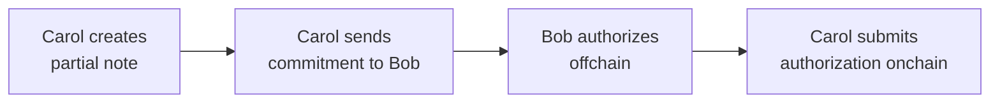
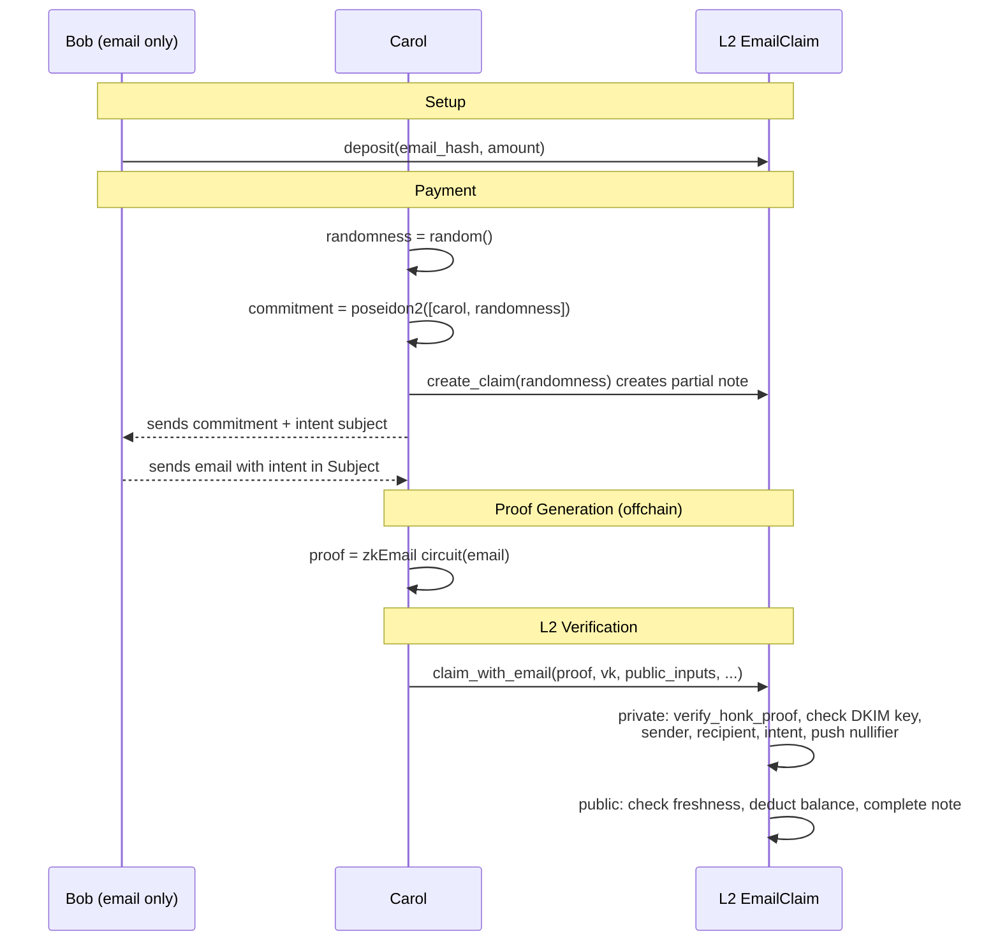

## Overview

In this tutorial, you will build a system where a sender (Bob) deposits tokens once and then authorizes payments entirely offchain. Recipients create partial notes for themselves, get Bob's offchain authorization, and submit it to claim their tokens. Bob never touches the network after the initial deposit. You will build two contracts that implement this pattern with different authorization mechanisms: Schnorr signatures (Part 2) and DKIM-signed emails via zkEmail (Part 4).

:::tip Full Working Example
The complete code for this tutorial is available in the [docs/examples](https://github.com/AztecProtocol/aztec-packages/tree/#include_aztec_version/docs/examples) directory. Clone it to follow along or use it as a reference.
:::

## Prerequisites

Before starting, ensure you have the following:

- Completed the [Private Token Contract tutorial](./token_contract.md)
- Understanding of partial notes and the public/private execution split
- Aztec toolchain installed
- For Part 4: familiarity with [L1-to-L2 messaging](../../foundational-topics/ethereum-aztec-messaging/inbox.md) and Solidity basics

## Part 1: Understanding the Architecture

### The Core Problem

Authorization witnesses (authwits) are the standard way to authorize actions on behalf of a user in Aztec. But they have a fundamental limitation for offchain workflows: a private authwit requires the signer's Private eXecution Environment (PXE) to be online at execution time, and a public authwit requires the signer to submit a transaction to the onchain registry. Neither lets a sender "pre-sign" an authorization and hand it to someone else while staying offline.

This tutorial solves that problem using **partial notes** combined with offchain signatures.

### Roles

This tutorial uses two participants throughout:

- **Bob (the sender)** holds tokens and authorizes payments. He deposits tokens into a contract once, then operates entirely offchain -- signing messages or sending emails. He never touches the network again after the initial deposit.

- **Carol (the recipient)** wants to receive tokens from Bob. She creates a partial note for herself, contacts Bob offchain to request authorization, and submits the final transaction to claim her tokens. Bob's participation requires no wallet, no PXE, and no network connection.

Carol never reveals her Aztec address to Bob. The commitment she sends him is `poseidon2([her_address, randomness])` -- a hash that Bob cannot invert. Bob authorizes a payment to whoever created that commitment, without learning who they are.

### Data Flow

Both contracts follow the same four-step flow:

1. **Carol creates a partial note** (private transaction on L2). This commits to her address and randomness, but leaves the amount unset.
2. **Carol sends the commitment to Bob** through any offchain channel (message, QR code, etc.).
3. **Bob authorizes offchain** -- either by signing with a Schnorr key (Part 2) or sending a DKIM-signed email (Part 4).
4. **Carol submits the authorization onchain** to complete the note and receive her tokens.

### How Partial Notes Enable This

The key mechanism is `UintNote::partial_with_randomness`. Carol provides the `randomness` as an explicit parameter rather than letting the contract sample it from the oracle. This makes the commitment **deterministic** from Carol's inputs. She can compute it offchain and send it to Bob for signing -- without waiting for the transaction to land or querying the PXE for return values.

The alternative -- atomically creating and completing the note in a single transaction -- would mean Bob has to sign before Carol's partial note exists. By splitting the flow, Bob signs a specific commitment that already exists onchain. The tradeoff is that Carol pays for two transactions, but the second one is purely public and cheap.

### Two Approaches

This tutorial builds two contracts that implement this pattern in different ways:

| | Part 2: Schnorr Signatures | Part 4: Email via zkEmail |
|---|---|---|
| **How Bob authorizes** | Signs with a dedicated Schnorr key | Sends a plain email (DKIM-signed by his mail server) |
| **Where verification happens** | Private function on L2 | Recursive proof verification on L2 |
| **Key management** | Bob manages a Schnorr private key | Bob uses his existing email account |
| **Latency** | Immediate (single L2 transaction) | Immediate (single L2 transaction, after offchain proof generation) |
| **Cost** | One L2 transaction | One L2 transaction |

Both share the same balance model: Bob deposits tokens, the contract tracks his balance, and claims deduct from it.

### Why a Balance Model?

Bob deposits tokens into the contract, and the contract tracks a simple per-depositor balance. This is straightforward, but it means Bob can over-sign: he can produce more signed authorizations than he has funds for, since signatures are created offline and the contract cannot prevent this. Later claims will fail if Bob's balance runs out -- like a bounced check. See [Further Reading: Voucher Pattern](#further-reading-voucher-pattern) for an alternative design that provides structural protection against over-authorization.

### Privacy Tradeoffs

Both approaches share the same privacy profile:

- **Bob's deposit is public.** Observers can see how much Bob deposited and when funds are consumed.
- **Carol's identity is hidden.** The partial note commitment hides her address. Only Carol (and Bob, who knows the commitment) can link the payment to her.
- **The amount is public.** It must be, since the partial note is completed in public.

The email approach stays entirely on L2, so no email-related data is ever exposed on Ethereum. Both approaches have the same privacy profile for onchain observers.

**Why can't this be fully private?** The claim is partially public by necessity. Bob is offline -- he cannot participate in private execution. So his balance must be public state that Carol can modify on his behalf by presenting a valid authorization. Any modification to public state is observable. Making Bob's balance private would require Carol to nullify Bob's private notes, which requires Bob's nullifier secret key -- something Carol doesn't have. Full privacy would require **contract-owned private notes**, where the contract itself holds a nullifier key and can spend escrowed notes. This is not currently supported by the Aztec protocol.

With this foundation in mind, let's build the Schnorr signature version first.

## Part 2: Writing the Schnorr Contract

The contract tracks deposits, signing keys, and private balances. Schnorr signature verification happens in private (because the `noir-lang/schnorr` library uses Blake2s, which is not AVM-compatible), and balance deduction happens in public.

### Storage

The contract needs public state to track deposits and signing keys, plus private state to store recipients' notes.

#include_code storage /docs/examples/contracts/offchain_transfer_contract/src/main.nr rust

Key fields:

- `deposits`: a per-depositor balance tracking how many tokens Bob has available for claims
- `signing_keys_x` / `signing_keys_y`: Schnorr public keys per depositor
- `balances`: private notes for recipients, using the standard `BalanceSet`

### Constructor

The contract is bound to a single token:

#include_code constructor /docs/examples/contracts/offchain_transfer_contract/src/main.nr rust

### Depositing

Bob calls `deposit` to load the contract with tokens. The function pulls tokens from Bob's public balance (via a pre-authorized public authwit on the token contract) and credits his deposit balance.

#include_code deposit /docs/examples/contracts/offchain_transfer_contract/src/main.nr rust

:::info Why no withdrawal?
There is no `withdraw` function. This is intentional. If Bob could withdraw, he could pull his balance out after signing authorizations, causing claims to fail. By making deposits irreversible, we guarantee that any signed authorization can be honored as long as Bob's balance hasn't been fully claimed.
:::

### Registering a Signing Key

Bob registers the Schnorr public key he'll use to sign authorizations. This key is separate from his Aztec account key, so the private key can live on any offline device.

#include_code register_signing_key /docs/examples/contracts/offchain_transfer_contract/src/main.nr rust

### Creating a Claim

Carol creates a partial note owned by herself, which will be funded later by Bob's signature.

#include_code create_claim /docs/examples/contracts/offchain_transfer_contract/src/main.nr rust

### Completing the Claim

Once Carol has Bob's signature, anyone can submit this function to verify the signature and complete the partial note. It is split into two phases: a private function that verifies the Schnorr signature, and a public continuation that deducts from Bob's balance and completes the partial note.

#include_code claim_with_signature /docs/examples/contracts/offchain_transfer_contract/src/main.nr rust

:::info Why verify the signature in private?
You might expect Schnorr verification to work in public: it decomposes to `ECADD` and `MSM`, which the AVM supports. Unfortunately, the `noir-lang/schnorr` library uses Blake2s internally for challenge generation, and Blake2s is **not** supported by the AVM transpiler. Schnorr verification therefore has to happen in the private phase.

To prevent a malicious caller from passing an arbitrary public key that matches their own signature, the public phase re-checks that the key matches what the depositor registered. If the keys don't match, the transaction reverts.
:::

### Function Breakdown: Chain of Trust

The two-phase split creates a chain of trust between private and public execution:

1. **Private phase:** verifies `schnorr::verify_signature(pub_key, sig, message_hash)` passes for the caller-provided `pub_key`.
2. **Public phase:** looks up the depositor, reads their registered key, and asserts it equals the `pub_key` that was used in private. If it doesn't match, we know the private verification used the wrong key and the tx reverts.
3. **Public phase:** checks the depositor's balance, deducts the amount, and completes the partial note.

The message hash is `poseidon2_hash_with_separator([contract_address, depositor, commitment, amount], 2)`. This binds the signature to the specific contract, depositor, partial note, and amount -- preventing replay, redirection, and amount manipulation.

## Part 3: TypeScript -- The Full Schnorr Flow

The following TypeScript example ties the full flow together: deploying contracts, depositing tokens, creating a claim, signing offchain, and completing the claim.

### Setup

#include_code setup /docs/examples/ts/offchain_transfer/index.ts typescript

### Bob Registers a Signing Key

Bob generates a Schnorr keypair and registers the public key with the contract. This is a **different** key from his Aztec account key -- it exists solely for offchain signing.

#include_code bob_signing_key /docs/examples/ts/offchain_transfer/index.ts typescript

### Bob Deposits

Bob deposits 500 tokens. He first sets up a public authwit authorizing the transfer contract to pull his tokens.

#include_code bob_deposit /docs/examples/ts/offchain_transfer/index.ts typescript

### Carol Creates a Claim

Carol generates fresh randomness, computes the partial note commitment offchain, then submits the private transaction that creates the partial note. She does not need to query the PXE for the transaction's return values, because the commitment is deterministic from her inputs.

#include_code carol_creates_claim /docs/examples/ts/offchain_transfer/index.ts typescript

:::warning Transaction ordering
Carol's `create_claim` transaction must be finalized before she submits `claim_with_signature`. The partial note creation pushes a validity commitment into the nullifier tree, and the completion step checks for its existence. If the first transaction has not yet been included in a block, the completion will fail.
:::

### Bob Signs Offchain

Carol sends Bob the commitment and the amount she wants. Bob constructs the message hash and signs it. This is the only step where Bob is involved after the initial setup, and it happens **entirely offline**.

#include_code bob_signs_offchain /docs/examples/ts/offchain_transfer/index.ts typescript

### Carol Completes the Claim

Carol submits a transaction with Bob's signature that verifies it in private and completes the note in public.

#include_code carol_completes /docs/examples/ts/offchain_transfer/index.ts typescript

### Verification

Carol should now see a private balance equal to the claim amount, and Bob's deposit balance should have decreased.

#include_code verify /docs/examples/ts/offchain_transfer/index.ts typescript

## Part 4: Email Authorization with zkEmail

### Design: Email as a Signing Oracle

The Schnorr approach requires Bob to manage a dedicated signing key. But every email Bob sends is already DKIM-signed by his mail server -- a cryptographic signature produced without any special software. [zkEmail](https://prove.email/) is a protocol that verifies DKIM signatures inside a zero-knowledge circuit, turning a plain email into a ZK proof.

By combining zkEmail with partial notes, we replace the Schnorr signing step with a regular email. Bob's mail server becomes the signing oracle.

### Architecture

The email flow uses **recursive proof verification** to stay entirely on L2. Carol generates a zkEmail proof offchain using a standalone Noir circuit, then submits the proof to an Aztec contract that verifies it privately using `verify_honk_proof`. No L1 contracts, no cross-chain messaging.

This follows the same pattern as the [Verify Noir Proofs in Aztec Contracts](./recursive_verification.md) tutorial: a computation-heavy Noir circuit runs offchain, and only the fixed-size proof is verified onchain.

1. **Setup:** Bob deposits tokens into the L2 contract and maps them to his email address hash.
2. **Carol creates a claim:** Same as Part 2 -- Carol creates a partial note, computes the commitment, and waits for the transaction to finalize.
3. **Bob sends an email:** Carol tells Bob the intended action (e.g. "pay 100 to commitment 0xabc...") and asks him to include it in the email subject. Bob sends an email from his verified domain (e.g. iCloud). The `Subject` header is included in the DKIM `h=` field by default, so the mail server's DKIM signature covers it. Bob can compose this email from any standard email client.
4. **Carol generates a proof offchain:** Carol feeds the raw email into a Noir circuit built with [zkemail.nr](https://github.com/zkemail/zkemail.nr) and generates an UltraHonk proof. The circuit verifies the DKIM signature, extracts the sender domain, recipient address, subject, and signing timestamp, and outputs hashes for onchain verification. This happens entirely on Carol's machine -- no network interaction.
5. **Carol submits the proof to L2:** Carol submits the proof, verification key, and public inputs to the `claim_with_email` function. The contract enforces a 6-point security model in private (DKIM key binding, sender identification, recipient binding, intent binding, nullifier) and in public (freshness check), then deducts from Bob's balance and completes Carol's partial note.

:::warning Transaction ordering
As with Part 2, Carol's `create_claim` transaction must finalize before she submits `claim_with_email`. The proof generation step typically provides more than enough time, but Carol should not submit the claim before her `create_claim` has been included in a block.
:::

## Part 5: The Email Verification Circuit

The email verification circuit is a standalone Noir binary (not an Aztec contract) that verifies a DKIM-signed email and outputs public values for the contract to consume. It uses the [zkemail.nr](https://github.com/zkemail/zkemail.nr) library for DKIM signature verification and email header parsing.

### Circuit Code

#include_code circuit /docs/examples/circuits/email_verifier/src/main.nr rust

The circuit produces seven public outputs:

| Output | Description |
|---|---|
| `pubkey_hash[0]` | Poseidon hash of the DKIM RSA public key modulus. The contract checks this against the trusted key to prevent self-signed forgeries. |
| `pubkey_hash[1]` | Poseidon hash of the DKIM RSA public key redc parameter. Checked alongside `pubkey_hash[0]`. |
| `email_nullifier` | Poseidon2 hash of the DKIM signature. Prevents the same email from being claimed twice -- pushed into Aztec's nullifier tree. |
| `from_address_hash` | Poseidon2 hash of the sender (from) email address. Identifies the depositor -- the contract uses this to look up whose balance to deduct. The circuit also verifies the sender's domain is `icloud.com`. |
| `to_address_hash` | Poseidon2 hash of the recipient (to) email address. The contract uses this for recipient binding -- ensuring the email was sent to the expected address. |
| `intent_hash` | Poseidon2 hash of the email subject. Binds the email to a specific action -- the contract asserts this matches the caller's expected intent. The subject should encode the claim details (amount, commitment, etc.) in a canonical format agreed upon offchain. |
| `dkim_timestamp` | The DKIM signing timestamp (`t=` tag) in seconds since epoch. Used for freshness checks -- the contract rejects emails that are too old. |

### What the Circuit Proves

The circuit establishes six properties of the email:

1. **Authentic signature.** The DKIM RSA-2048 signature over the email header is valid for the given public key.
2. **Verified sender domain.** The `From` address belongs to the expected domain (e.g. `icloud.com`), preventing emails from arbitrary senders.
3. **Sender identity.** The full `From` address is hashed, allowing the contract to identify the specific sender (e.g. `bob@icloud.com` vs `alice@icloud.com`) for deposit lookup.
4. **Recipient identity.** The `To` address is extracted and hashed, allowing the contract to verify the email was sent to the right person.
5. **Intent encoding.** The `Subject` header value is extracted and hashed, allowing the contract to bind the email to a specific authorized action.
6. **Timestamp.** The DKIM `t=` tag is parsed from the DKIM-Signature header, allowing the contract to enforce freshness.

:::warning DKIM header coverage
The security of recipient binding and intent binding depends on the `To` and `Subject` headers being covered by the DKIM signature. Most mail servers include these in the DKIM `h=` signed-header set by default, but this is not guaranteed by the DKIM specification. The `zkemail.nr` library verifies that extracted header fields fall within the signed header region, but you should verify your target mail server's DKIM configuration includes these fields.
:::

:::info Why no body verification?
The previous version of this circuit verified the email body using SHA256 (~114,000 constraints). The updated circuit omits body verification entirely because all authentication-relevant data (sender, recipient, subject, timestamp) is in the DKIM-signed headers. This significantly reduces the constraint count and proof generation time.
:::

### Constraint Breakdown

The circuit costs approximately 108,000 constraints:

- DKIM RSA-2048 signature verification: ~86,500
- Email address extraction (from + to): ~16,000
- Subject extraction and hashing: ~2,000
- Key + nullifier + address hashing: ~3,500

This is too expensive for a single Aztec private function, which is why the circuit runs offchain and only the proof is verified onchain. The proof verification itself is fixed-size (~624 field elements) regardless of circuit complexity.

### Proof Generation

The proof is generated offchain using Barretenberg's UltraHonk backend. The key requirement is using `verifierTarget: "noir-recursive"` so the proof format is compatible with `verify_honk_proof` inside the Aztec contract.

For a complete working example of proof generation, compilation, and deployment, see the [zkemail verification example](https://github.com/AztecProtocol/aztec-examples/tree/main/zkemail_verification) in the aztec-examples repository.

## Part 6: The L2 Email Claim Contract

The Aztec contract follows the same balance model as Part 2, but replaces Schnorr signature verification with recursive proof verification via `verify_honk_proof`. It enforces a **6-point security model** to prevent forgery, misdirection, replay, and stale email attacks.

### Storage

#include_code storage /docs/examples/contracts/email_claim_contract/src/main.nr rust

The storage extends Part 2's structure with:
- `vk_hash` stores the email circuit's verification key hash (set at deployment)
- `trusted_dkim_key_hash_0` and `trusted_dkim_key_hash_1` store the Poseidon hashes of the trusted mail server's DKIM RSA public key components. Without this, an attacker could forge emails using their own RSA keypair.
- `max_email_age` sets the maximum allowed age of an email in seconds, enforced via the DKIM signing timestamp

### Constructor

The constructor initializes the token address, verification key hash, trusted DKIM key hashes, and the maximum email age:

#include_code constructor /docs/examples/contracts/email_claim_contract/src/main.nr rust

### Deposit

#include_code deposit /docs/examples/contracts/email_claim_contract/src/main.nr rust

As with Part 2, Bob can over-authorize: he can send emails totaling more than his deposited balance, and later claims will fail with "Insufficient depositor balance."

### Creating a Claim

Identical to Part 2. Carol provides randomness so the commitment is deterministic.

#include_code create_claim /docs/examples/contracts/email_claim_contract/src/main.nr rust

### Claiming with an Email Proof

This is the core function. It enforces the 6-point security model: DKIM key binding, sender identification, recipient binding, intent binding, single-use enforcement, and freshness checking.

#include_code claim_with_email /docs/examples/contracts/email_claim_contract/src/main.nr rust

#### Security Model Breakdown

The private phase performs five checks before enqueuing the public completion:

1. **DKIM key binding.** The proof's public key hash (`public_inputs[0]` and `public_inputs[1]`) must match the trusted DKIM key hashes stored at deployment. This prevents an attacker from generating their own RSA keypair, forging a DKIM signature, and producing a valid proof.

2. **Sender identification.** The sender's full email address hash (`public_inputs[3]`) identifies the depositor. The contract passes this to the public completion step to look up the correct deposit balance. The circuit's domain verification ensures the sender is from the trusted domain.

3. **Recipient binding.** The email's `to` address hash (`public_inputs[4]`) must match the `expected_recipient_hash` provided by the caller. This ensures the email was sent to the right address, preventing an attacker from using an email sent to someone else.

4. **Intent binding.** The email's subject hash (`public_inputs[5]`) must match the `expected_intent_hash` provided by the caller. This binds the email to a specific action, preventing an attacker from reusing an email sent for a different purpose (e.g. using a "pay 50" email to claim 100).

5. **Single-use enforcement.** The email nullifier (`public_inputs[2]`) is pushed into Aztec's native nullifier tree via `push_nullifier`. If the same email has already been used to claim, the protocol rejects the transaction -- no custom nullifier tracking needed.

The public phase performs the sixth check and completes the claim:

6. **Freshness.** The DKIM signing timestamp (`public_inputs[6]`) is checked against the current block timestamp. Emails older than `max_email_age` are rejected. This must happen in public because `block.timestamp` is only available in the public context.

## Part 7: Security and Design Considerations

### Security Notes

**Shared across both approaches:**
- **Randomness must be fresh.** Carol should never reuse randomness across claims. Reusing randomness links partial notes together and reveals her identity as the common owner.
- **Front-running is bounded.** An attacker who sees a pending claim transaction cannot redirect it: the authorization (signature or email proof) binds to a specific commitment, and only Carol's partial note has that commitment.
- **Over-authorization is possible.** Both approaches use a simple balance model. Bob can sign authorizations (or send emails) totaling more than his deposit; excess claims fail at the balance check. This is a social problem, not a cryptographic one -- like writing checks that exceed your bank balance.

**Schnorr-specific:**
- **Key management matters.** If Bob's signing key leaks, anyone with the key can sign authorizations in his name until his deposited balance is fully claimed.

**Email-specific:**
- **DKIM key binding prevents forgery.** The contract checks the proof's public key hash against a trusted key stored at deployment. Without this, an attacker could generate their own RSA keypair, forge a DKIM signature, and produce a valid proof. This is the most critical security check.
- **Recipient binding prevents misdirection.** The circuit extracts the `To` address and the contract checks it matches the depositor, preventing an attacker from using an email sent to someone else.
- **Intent binding prevents replay across actions.** The email subject is hashed by the circuit and the contract asserts it matches the caller's expected intent. This prevents reusing an email sent for a different purpose (e.g. using a "pay 50" email to claim 100). The subject format (what to encode and how) is an offchain convention -- the circuit hashes whatever is in the subject field, and the contract checks the hash matches. A production deployment should define a canonical subject format that includes the amount, commitment, and contract address.
- **Double-emailing is possible but cannot be double-claimed.** Each email produces a unique nullifier (Poseidon2 hash of the DKIM signature). The nullifier is pushed into Aztec's nullifier tree, so the protocol itself rejects duplicate claims.
- **Freshness prevents stale email attacks.** The contract rejects emails whose DKIM signing timestamp is older than `max_email_age`. This limits the window in which a compromised email can be used.
- **DKIM key rotation.** If a mail server rotates its DKIM key, the contract must be redeployed with the new key hashes (or upgraded if the contract supports it). Emails signed with an old key will be rejected.

### When to Use Which

**Use the Schnorr signature approach when:**
- You need immediate settlement (no L1 round-trip)
- The sender can manage a dedicated signing key
- You want the simplest possible implementation

**Use the email approach when:**
- The sender cannot or will not install any special software
- You want the lowest possible barrier to entry for the sender
- The sender is willing to use a structured email subject format

**Neither approach is a good fit when:**
- The sender also needs balance privacy (both approaches make the deposit public)
- The sender can run a PXE and submit transactions normally (use standard [authwits](../../foundational-topics/advanced/authwit.md) instead)

### Further Reading: Voucher Pattern

The balance model used in this tutorial is simple but allows over-authorization: Bob can sign more authorizations than his balance can cover. An alternative design provides **structural protection** against this by replacing the open-ended balance with fixed-denomination **vouchers**.

In the voucher pattern, Bob's deposit creates exactly N vouchers, each worth a fixed amount (e.g. 5 vouchers of 100 tokens). Each voucher has a unique ID and can only be consumed once. Bob signs authorizations against specific voucher IDs rather than an open balance, so the total number of valid authorizations is bounded by N -- over-signing beyond the deposit is structurally impossible.

The tradeoff is real complexity: the contract needs per-voucher storage (validity flags, denomination, owner), voucher ID computation, and a maximum-per-deposit iteration loop. Fixed denominations also create fragmentation -- you cannot pay 150 tokens with 100-token vouchers without consuming two and dealing with change. For most use cases, the balance model's simplicity outweighs the voucher model's structural guarantee, but the voucher pattern is worth considering when Bob is authorizing payments to many unknown recipients and you want to bound the number of people who can be left holding worthless authorizations.

## Next Steps

- **[zkEmail Verification Example](https://github.com/AztecProtocol/aztec-examples/tree/main/zkemail_verification):** A complete working implementation of the email verification pattern, including proof generation scripts, integration tests, and testnet deployment.
- **[Verify Noir Proofs in Aztec Contracts](./recursive_verification.md):** A deeper dive into the recursive proof verification pattern used in Part 4. Covers circuit compilation, proof generation, and onchain verification from scratch.
- **[L1-to-L2 Messaging](../../foundational-topics/ethereum-aztec-messaging/inbox.md):** Understand how cross-chain messages flow between Ethereum and Aztec. While Part 4 uses L2-only verification, L1-to-L2 messaging is useful for other bridge patterns.
- **[Bridge Your NFT to Aztec](../js_tutorials/token_bridge.md):** A full end-to-end tutorial on building an L1 portal contract and L2 bridge, including deployment and TypeScript testing.
