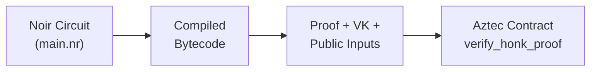

## Overview

In this tutorial, you will build a system that generates zero-knowledge proofs offchain using a Noir circuit and verifies them onchain within an Aztec Protocol smart contract. You will create a simple circuit that proves two values are not equal, generate an UltraHonk proof, deploy an Aztec contract that stores a verification key hash, and submit the proof for onchain verification. This pattern enables trustless computation where anyone can verify that a computation was performed correctly without revealing the private inputs.

:::note Why "Recursive" Verification?
This is called "recursive" verification because the proof is verified inside an Aztec private function, which itself gets compiled into a ZK circuit. The result is a proof being verified inside another proof. The Noir circuit you write is not recursive; the recursion happens at the Aztec protocol level when the private function execution (including the `verify_honk_proof` call) is proven.
:::

:::tip Full Working Example
The complete code for this tutorial is available in the [docs/examples](https://github.com/AztecProtocol/aztec-packages/tree/#include_aztec_version/docs/examples) directory. Clone it to follow along or use it as a reference.
:::

## Prerequisites

Before starting, ensure you have the following installed and configured:

- Node.js (v22 or later)
- yarn package manager
- Aztec CLI (version #include_aztec_version)
- Nargo
- Familiarity with [Noir syntax](https://noir-lang.org/docs) and [Aztec contract basics](../../aztec-nr/index.md)

Install the required tools:

```bash
# Install Aztec CLI
VERSION=#include_version_without_prefix bash -i <(curl -sL https://install.aztec.network/#include_version_without_prefix)
```

## Part 1: Understanding the Architecture

### The Core Problem

Aztec contracts have inherent [limits on function inputs and transaction complexity](../../resources/considerations/limitations.md#circuit-limitations). These constraints stem from the circuit-based nature of private execution. When your computation requires more inputs than these limits allow, or when the computation itself is too complex to fit in a single function, **recursive proof verification** provides an escape hatch.

For example, consider a machine learning inference that needs 10,000 input features, or a Merkle tree verification with 1,000 leaves. These cannot fit within a single Aztec function's input constraints. Instead, you can:

1. Perform the computation offchain in a vanilla Noir circuit with no input limits
2. Generate a proof of correct execution
3. Verify only the proof onchain (115 fields for VK + 457-508 fields for proof + N public inputs)

This pattern transforms arbitrarily large computations into fixed-size proof verification.

### Data Flow

The recursive verification pattern follows this data flow:

1. **Circuit Definition**: Write a Noir circuit that defines the computation you want to prove
2. **Compilation**: Compile the circuit with `aztec-nargo compile` (or your own `nargo compile` install) to produce bytecode
3. **Proof Generation**: Execute the circuit offchain and generate an UltraHonk proof using [Barretenberg](https://github.com/AztecProtocol/barretenberg)
4. **Onchain Verification**: Submit the proof to an Aztec contract that verifies it using the stored [verification key](../../resources/glossary.md#verification-key) hash



**Why this separation matters**: The circuit defines _what_ you're proving. The proof is _evidence_ that you executed the circuit correctly with valid inputs. The onchain verifier checks the evidence without re-running the computation. This is what makes ZK proofs powerful: verification is orders of magnitude cheaper than computation.

### Why Verify Proofs in Aztec Contracts?

Proof verification enables several patterns:

- **Bypassing Input Limits**: Aztec private functions have strict input constraints. A proof verification call uses ~624 fields (115 VK + 508 proof + 1 public input), but can attest to computations with arbitrarily many inputs. For example, proving membership in a set of 10,000 elements becomes a fixed-size verification.

- **Cross-System Verification**: Verify proofs generated by external Noir circuits within your Aztec application. This enables composability: your contract can trust computations performed by other systems without those systems needing to be Aztec-native.

- **Batching Operations**: Aggregate multiple operations into a single proof. Instead of making N separate contract calls, prove all N operations were done correctly and verify once.

### Why Use Aztec for Proof Verification?

Aztec provides a unique advantage: **private function execution**. When you verify a proof in an Aztec private function:

1. The proof verification happens inside a zero-knowledge circuit
2. The inputs to verification (the proof itself) can remain private
3. You can compose proof verification with other private operations

This enables patterns impossible on transparent blockchains, like proving you have a valid credential without revealing which credential or when you obtained it.

### UX Considerations: Multiple Proof Generation

When using [recursive verification](https://noir-lang.org/docs/noir/standard_library/recursion) in Aztec, users experience **two distinct proof generation phases**:

1. **Noir Proof Generation** (application-specific):
   - Happens before interacting with the Aztec contract
   - Proves the computation (e.g., "I know values x and y where x ≠ y")
   - Time depends on circuit complexity (seconds to minutes)
   - Produces the proof and verification key that will be verified

2. **Aztec Transaction Proof** (protocol-level):
   - Generated by the [PXE](../../foundational-topics/pxe/index.md) when calling the private function
   - Proves correct execution of the Aztec contract (including the `verify_honk_proof` call)

With this foundation in mind, let's build a complete example. You'll create a Noir circuit, generate a proof, and verify it inside an Aztec contract.

## Part 2: Writing the Noir Circuit

Start by writing a simple circuit that proves two field values are not equal. This minimal example demonstrates the core pattern—you can extend it for more complex computations like Merkle proofs, credential verification, or something else entirely.

### Create the Circuit Project

Use `aztec-nargo new` to generate the project structure (the Aztec installer ships `nargo` as `aztec-nargo`; substitute your own `nargo` if its version matches `aztec-nargo --version`):

```bash
aztec-nargo new circuit
```

This creates the following structure:

```tree
circuit/
├── src/
│   └── main.nr      # Circuit code
└── Nargo.toml       # Circuit configuration
```

### Circuit Code

Replace the contents of `circuit/src/main.nr` with:

#include_code circuit /docs/examples/circuits/hello_circuit/src/main.nr rust

This is intentionally minimal to focus on the verification pattern. In production, you would replace `assert(x != y)` with meaningful computations like:

- Merkle tree membership proofs
- Hash preimage verification
- Range proofs (proving a value is within bounds)
- Credential verification
- Email verification (proving you received an email from a domain without revealing its contents, like [zkEmail](https://www.prove.email/))

### Understanding Private vs Public Inputs

The circuit has two inputs with different visibility:

- `x: Field` - A **private input** known only to the prover. This value is never revealed onchain or included in the proof data. The verifier cannot determine what value was used—only that _some_ valid value exists.

- `y: pub Field` - A **public input** that is visible to the verifier. This value is included in the proof data, but since proof verification happens within a private function, it isn't exposed onchain unless you explicitly reveal it.

**Why this distinction matters**: The circuit asserts that `x != y`. The prover demonstrates they know a secret value `x` that differs from the public value `y`.

Public inputs don't have to come from the caller. During verification, the Aztec contract can read values from its own storage and use them as public inputs. This pattern ties the proof to contract state—the prover must generate a proof against the _current_ stored value and cannot substitute a different public input.

To make the "public input" truly public, the contract developer can enqueue a public function call from the private function that verifies the proof, passing the public input to a public function to be logged or verified against public state.

For example, you could create a zkpassport proof demonstrating that you are over a certain age. The proof is verified in a private function, then the age (the public input) is passed to a public function where it's compared against a mutable threshold in public storage.

### Circuit Configuration

Update `circuit/Nargo.toml` (see [Noir crates and packages](https://noir-lang.org/docs/noir/modules_packages_crates/crates_and_packages) for more details):

#include_code circuit_nargo_toml /docs/examples/circuits/hello_circuit/Nargo.toml toml

**Note**: This is a vanilla Noir circuit, not an Aztec contract. It has `type = "bin"` (binary) and no Aztec dependencies. The circuit is compiled with `nargo`, not `aztec compile`. This distinction is important—you can verify proofs from _any_ Noir circuit inside Aztec contracts.

### Compile the Circuit

```bash
cd circuit
aztec-nargo compile
```

This generates `target/hello_circuit.json` containing:

- **Bytecode**: The compiled circuit representation
- **ABI (Application Binary Interface)**: Describes the circuit's inputs and outputs, including which are public

The TypeScript code uses the ABI to correctly format inputs during witness generation.

### Test the Circuit

```bash
aztec-nargo test
```

Expected output:

```text
[hello_circuit] Running 1 test function
[hello_circuit] Testing test_main ... ok
[hello_circuit] 1 test passed
```

**Tip**: Circuit tests run without generating proofs, making them fast for development. Use them to verify your circuit logic before the more expensive proof generation step.

## Part 3: Writing the Aztec Contract

The Aztec contract stores the verification key hash and verifies proofs submitted by users. When a valid proof is submitted, it increments a counter for the caller.

### Why This Contract Design?

The contract demonstrates several important patterns:

1. **VK Hash Storage**: Instead of storing the full 115-field verification key onchain (expensive), we store only its hash (1 field). The prover submits the full VK with each proof, and the contract verifies it matches the stored hash.

2. **Private-to-Public Flow**: Proof verification happens in a [private function](../../aztec-nr/framework-description/functions/visibility.md) (generating a ZK proof of the verification), but the counter update happens in a public function (visible state change). This separation is fundamental to Aztec's architecture.

3. **Self-Only Public Functions**: The `_increment_public` function can only be called by the contract itself, not external accounts (similar to `internal` functions in Solidity). This ensures the counter can only be modified after successful proof verification.

### Create the Contract Project

Use `aztec new` to generate the workspace:

```bash
aztec new ValueNotEqual
```

This creates a two-crate workspace under `ValueNotEqual/`: the contract crate is named `ValueNotEqual_contract` and the test crate is named `ValueNotEqual_test`, both derived from the positional argument. The Noir `contract` identifier declared inside `main.nr` is independent of the crate name and determines the compiled artifact filename.

```tree
ValueNotEqual/
├── Nargo.toml                       # [workspace] members
├── ValueNotEqual_contract/
│   ├── src/
│   │   └── main.nr                  # Contract code
│   └── Nargo.toml                   # Contract package (type = "contract")
└── ValueNotEqual_test/
    ├── src/
    │   └── lib.nr                   # Noir tests
    └── Nargo.toml                   # Test package (type = "lib")
```

### Contract Configuration

Update `ValueNotEqual/ValueNotEqual_contract/Nargo.toml` with the required dependencies:

```toml
[package]
name = "ValueNotEqual_contract"
type = "contract"
authors = ["[YOUR_NAME]"]

[dependencies]
aztec = { git = "https://github.com/AztecProtocol/aztec-nr/", tag = "#include_aztec_version", directory = "aztec" }
bb_proof_verification = { git = "https://github.com/AztecProtocol/aztec-packages/", tag = "#include_aztec_version", directory = "barretenberg/noir/bb_proof_verification" }
```

**Key differences from the circuit's Nargo.toml** (in `ValueNotEqual/ValueNotEqual_contract/Nargo.toml`):

- `type = "contract"` (not `"bin"`)
- Depends on `aztec` for Aztec-specific features
- Depends on `bb_proof_verification` for `verify_honk_proof`

### Contract Structure

Replace the contents of `ValueNotEqual/ValueNotEqual_contract/src/main.nr` with:

#include_code full_contract /docs/examples/contracts/recursive_verification_contract/src/main.nr rust

:::note Clear the scaffold's placeholder test
The scaffolded `ValueNotEqual/ValueNotEqual_test/src/lib.nr` imports the default contract name (`Main`) we just replaced above, so it now fails to compile. Tests aren't used in this tutorial — replace its contents with a single-line stub so `aztec compile` stays clean:

```rust
// Tests are out of scope for this tutorial. See https://docs.aztec.network/aztec-nr/testing_contracts for examples.
```
:::

### Storage Variables Explained

The contract uses two [storage types](../../aztec-nr/framework-description/state_variables.md) with different characteristics:

**`vk_hash: PublicImmutable<Field>`**

`PublicImmutable` is perfect for values that:

- Are set once during contract initialization
- Never change after deployment
- Need to be readable from both public and private contexts

The VK hash fits all these criteria. Once you deploy a contract to verify proofs from a specific circuit, the circuit (and thus its VK) shouldn't change.

**Why store the hash instead of the full VK?**

- Storage costs: 1 field vs 115 fields
- The prover already has the full VK (needed to generate the proof)
- Hash verification is cheap compared to storing/loading 115 fields

**`counters: Map<AztecAddress, PublicMutable<Field>>`**

`PublicMutable` is used for values that:

- Change over time
- Are updated by public functions
- Need to be visible onchain

The counter must be `PublicMutable` because it's modified by `_increment_public`, a public function. Private functions cannot directly write to public state; they can only enqueue public function calls.

### Function Breakdown

**1. `constructor` (public initializer)**

```rust
#[initializer]
#[external("public")]
fn constructor(headstart: Field, owner: AztecAddress, vk_hash: Field) {
    self.storage.counters.at(owner).write(headstart);
    self.storage.vk_hash.initialize(vk_hash);
}
```

- `#[initializer]`: Marks this as the constructor, called once during deployment
- `#[external("public")]`: Executes publicly (visible onchain)
- Sets the initial counter value for the owner
- Stores the VK hash using `initialize()` (required for `PublicImmutable`)

**2. `increment` (private function)**

```rust
#[external("private")]
fn increment(
    owner: AztecAddress,
    verification_key: UltraHonkVerificationKey,
    proof: UltraHonkZKProof,
    public_inputs: [Field; 1],
) {
    let vk_hash = self.storage.vk_hash.read();
    verify_honk_proof(verification_key, proof, public_inputs, vk_hash);
    self.enqueue_self._increment_public(owner);
}
```

- `#[external("private")]`: Executes privately (generates a ZK proof of execution in the PXE)
- Reads VK hash from storage (allowed because `PublicImmutable` is readable in private context)
- Calls `verify_honk_proof()` which:
  - Computes the hash of the provided verification key
  - Checks it matches the stored `vk_hash`
  - Verifies the proof against the VK and public inputs
  - Fails (reverts) if any check fails
- Uses `enqueue_self._increment_public(owner)` to schedule a public function call

**Why `enqueue_self` instead of a direct call?**

In Aztec, private functions cannot directly modify public state. Instead, they enqueue public function calls that execute after the private phase completes. This ensures:

- Private execution remains private (no public state reads during private execution)
- State updates are atomic (all enqueued calls execute or none do)
- The execution order is deterministic

**3. `_increment_public` (public, self-only)**

```rust
#[only_self]
#[external("public")]
fn _increment_public(owner: AztecAddress) {
    let current = self.storage.counters.at(owner).read();
    self.storage.counters.at(owner).write(current + 1);
}
```

- `#[only_self]`: Only callable by the contract itself (via `enqueue_self`)
- `#[external("public")]`: Executes publicly
- Reads the current counter and increments it

**Why `#[only_self]`?**

Without this modifier, anyone could call `_increment_public` directly, bypassing proof verification. The `#[only_self]` modifier ensures the function is only reachable through the private `increment` function, which requires a valid proof.

**4. `get_counter` (public view)**

```rust
#[view]
#[external("public")]
fn get_counter(owner: AztecAddress) -> Field {
    self.storage.counters.at(owner).read()
}
```

- `#[view]`: Read-only function, doesn't modify state
- Returns the counter value for any address

## Part 4: TypeScript Setup and Proof Generation

Before compiling the contract or running any TypeScript scripts, set up the project with the necessary configuration files and dependencies.

### Project Setup

Create the following files in your project root directory.

**Create `package.json`:**

```json
{
  "name": "recursive-verification-tutorial",
  "type": "module",
  "scripts": {
    "ccc": "cd ValueNotEqual && aztec compile && aztec codegen target -o ../artifacts",
    "data": "tsx scripts/generate_data.ts",
    "recursion": "tsx index.ts"
  },
  "dependencies": {
    "@aztec/accounts": "#include_version_without_prefix",
    "@aztec/aztec.js": "#include_version_without_prefix",
    "@aztec/bb.js": "#include_version_without_prefix",
    "@aztec/kv-store": "#include_version_without_prefix",
    "@aztec/noir-contracts.js": "#include_version_without_prefix",
    "@aztec/noir-noir_js": "#include_version_without_prefix",
    "@aztec/pxe": "#include_version_without_prefix",
    "@aztec/wallets": "#include_version_without_prefix",
    "tsx": "^4.20.6"
  },
  "devDependencies": {
    "@types/node": "^22.0.0"
  },
  "peerDependencies": {
    "typescript": "^5.0.0"
  }
}
```

**Create `tsconfig.json`:**

```json
{
  "compilerOptions": {
    "lib": ["ESNext"],
    "target": "ESNext",
    "module": "ESNext",
    "moduleDetection": "force",
    "moduleResolution": "bundler",
    "allowImportingTsExtensions": true,
    "resolveJsonModule": true,
    "verbatimModuleSyntax": true,
    "noEmit": true,
    "strict": true,
    "skipLibCheck": true,
    "noFallthroughCasesInSwitch": true,
    "esModuleInterop": true,
    "forceConsistentCasingInFileNames": true
  }
}
```

**Install dependencies:**

```bash
yarn install
```

This installs all the Aztec packages needed for proof generation and contract interaction. The installation may take a few minutes due to the size of the cryptographic libraries.

### Compile the Contract

Now compile the Aztec contract and generate TypeScript bindings:

```bash
yarn ccc
```

**What this command does** (see [How to Compile a Contract](../../aztec-nr/compiling_contracts.md) for details):

1. `aztec compile`: Compiles the Noir contract and post-processes it for Aztec (different from `nargo compile`)
2. `aztec codegen`: Generates TypeScript bindings from the contract artifact, enabling type-safe contract interaction

This generates:

- `ValueNotEqual/target/ValueNotEqual_contract-ValueNotEqual.json` - Contract artifact (bytecode, ABI, etc.)
- `artifacts/ValueNotEqual.ts` - TypeScript class for deploying and interacting with the contract

### Proof Generation Script

The proof generation script executes the circuit offchain and produces the proof data needed for onchain verification.

Create `scripts/generate_data.ts`:

```js
import circuitJson from "../circuit/target/hello_circuit.json" with { type: "json" };
#include_code generate_data /docs/examples/ts/recursive_verification/scripts/generate_data.ts raw
```

### Understanding the Proof Generation Pipeline

#### Setup

- Initialize Barretenberg (the cryptographic backend)
- Load the compiled circuit

#### Witness Generation

```typescript
const { witness: mainWitness } = await helloWorld.execute({ x: 1, y: 2 });
```

The witness contains all values computed during circuit execution, not just inputs and outputs, but every intermediate value. The prover needs the witness to construct the proof. The verifier never sees the witness (that's the point of ZK proofs).

#### Proof Generation

```typescript
const mainProofData = await mainBackend.generateProof(mainWitness, {
  verifierTarget: "noir-recursive",
});
```

**Why `verifierTarget: 'noir-recursive'`?** There are different proof formats optimized for different verifiers:

- Native verifiers (standalone programs)
- Smart contract verifiers (Solidity)
- Recursive verifiers (inside other ZK circuits)

Aztec contracts are compiled to ZK circuits, so `verify_honk_proof` runs inside a circuit. We need the recursive-friendly proof format.

#### Local Verification

```typescript
const isValid = await mainBackend.verifyProof(mainProofData, {
  verifierTarget: "noir-recursive",
});
```

Always verify locally before submitting onchain. Onchain verification costs gas/fees and takes time. Local verification is free and instant.

#### Field Element Conversion

ZK proofs are arrays of bytes, but Aztec contracts work with field elements. We convert the proof and VK to arrays of 115 and 508 field elements respectively.

```typescript
let proofAsFields = recursiveArtifacts.proofAsFields;
if (proofAsFields.length === 0) {
  console.log("Using deflattenFields to convert proof...");
  proofAsFields = deflattenFields(mainProofData.proof).map((f) => f.toString());
}

const vkAsFields = recursiveArtifacts.vkAsFields;
```

Some versions of the library return an empty `proofAsFields` array, requiring manual conversion via `deflattenFields`.

#### Saving Data for Contract Interaction

```typescript
const data = {
  vkAsFields: vkAsFields,
  vkHash: recursiveArtifacts.vkHash,
  proofAsFields: proofAsFields,
  publicInputs: mainProofData.publicInputs.map((p: string) => p.toString()),
};

fs.writeFileSync("data.json", JSON.stringify(data, null, 2));
await barretenbergAPI.destroy();
```

The data is saved as JSON so the deployment script can load it. We call `barretenbergAPI.destroy()` to clean up the WebAssembly resources used by Barretenberg. This is important because Barretenberg allocates significant memory for cryptographic operations, and not destroying it can cause memory leaks in long-running processes.

### Run Proof Generation

```bash
yarn data
```

Expected output:

```text
Proof verification: SUCCESS
Using deflattenFields to convert proof...
VK size: 115
Proof size: 500
Public inputs: 1
Done
```

### Output Format

The generated `data.json` contains:

```json
{
  "vkAsFields": ["0x...", "0x...", ...],   // 115 field elements
  "vkHash": "0x...",                        // Single field element
  "proofAsFields": ["0x...", "0x...", ...], // 508 field elements
  "publicInputs": ["2"]                     // The public input y=2
}
```

**What each field is used for**:

- `vkHash`: Passed to the contract constructor, stored permanently
- `vkAsFields`: Passed to `increment()`, verified against stored hash
- `proofAsFields`: Passed to `increment()`, verified by `verify_honk_proof`
- `publicInputs`: Passed to `increment()`, must match what was used during proof generation

## Part 5: Deploying and Verifying

The deployment script connects to the Aztec network, creates an account, deploys the contract, and submits a proof for verification.

### Deployment Script

Create `index.ts`:

#include_code run_recursion /docs/examples/ts/recursive_verification/index.ts typescript

### Understanding the Deployment Script

#### Sponsored Fee Payment

Aztec transactions require fees. For testing, we use a Sponsored Fee Payment Contract (FPC) that pays fees on behalf of users:

```typescript
const sponsoredFPC = await getSponsoredFPCInstance();
const sponsoredPaymentMethod = new SponsoredFeePaymentMethod(
  sponsoredFPC.address,
);
```

In production, you would use real [fee payment methods](../../aztec-js/how_to_pay_fees.md) (native tokens, ERC20, etc.).

#### What Happens During `increment().send().wait()`

This single line triggers a complex flow:

1. **Private Execution** (client-side, in PXE):
   - Execute `increment()` with provided arguments
   - Read `vk_hash` from contract storage
   - Execute `verify_honk_proof()` inside the private function
   - Generate the `enqueue_self._increment_public(owner)` call

2. **Proof Generation** (client-side, in PXE):
   - Generate a ZK proof that the private execution was correct
   - This proof doesn't reveal inputs (including the 508-field proof!)

3. **Transaction Submission**:
   - Send the proof + encrypted logs + public function calls to the network

4. **Verification & Public Execution** (onchain):
   - Network verifies the private execution proof
   - Execute `_increment_public(owner)` publicly
   - Update the counter in storage

### Supporting Utility

Create `scripts/sponsored_fpc.ts`:

#include_code sponsored_fpc /docs/examples/ts/recursive_verification/scripts/sponsored_fpc.ts typescript

This utility computes the address of the pre-deployed sponsored FPC contract. The salt ensures we get the same address every time. For more information about fee payment options, see [Paying Fees](../../aztec-js/how_to_pay_fees.md).

### Start the Local Network

In a separate terminal, start the [Aztec local network](../../../getting_started_on_local_network.md):

```bash
aztec start --local-network
```

**What this starts**:

- **Anvil**: A local Ethereum node (L1)
- **Aztec Node**: The L2 rollup node
- **PXE**: Private eXecution Environment (embedded in node for local development)

Wait for the network to fully initialize. You should see logs indicating readiness. The PXE will be available at `http://localhost:8080`.

### Deploy and Verify

Run the deployment script:

```bash
yarn recursion
```

Expected output:

```text
Contract deployed at: 0x...
Counter value: 10
Counter value: 11
```

The counter starts at 10 (set during deployment), and after successful proof verification, it increments to 11. This confirms that the Noir proof was verified inside the Aztec contract.

## Quick Reference

If you want to run all commands at once, or if you're starting fresh, here's the complete workflow. You can also reference the [full working example](https://github.com/AztecProtocol/aztec-packages/tree/#include_aztec_version/docs/examples) in the main repository.

```bash
# Install dependencies (after creating package.json and tsconfig.json)
yarn install

# Compile the Noir circuit
cd circuit && aztec-nargo compile && cd ..

# Compile the Aztec contract and generate TypeScript bindings
yarn ccc

# Generate proof data
yarn data

# Start the local network (in a separate terminal)
aztec start --local-network

# Deploy and verify
yarn recursion
```

## Next Steps

Now that you understand the basics of proof verification in Aztec contracts, explore these topics:

- **Simpler Contract Examples**: If you're new to Aztec contracts, the [Counter Tutorial](./counter_contract.md) provides a gentler introduction to contract development patterns.
- **Multiple Public Inputs**: Extend the circuit to have multiple public inputs. Update `public_inputs: [Field; 1]` in the contract to match.
- **Noir Language Reference**: Explore advanced Noir features like loops, arrays, and standard library functions at [noir-lang.org](https://noir-lang.org/docs).
