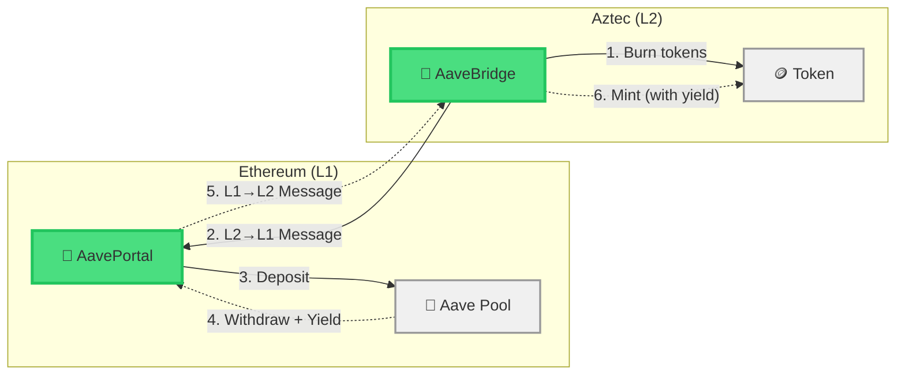
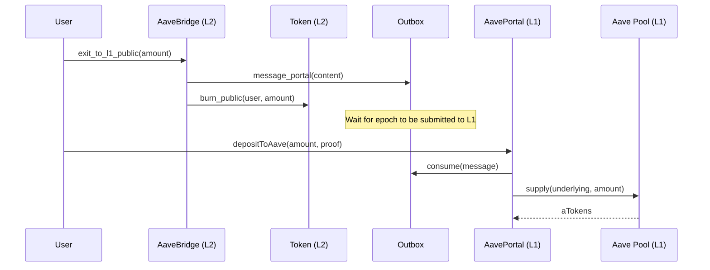
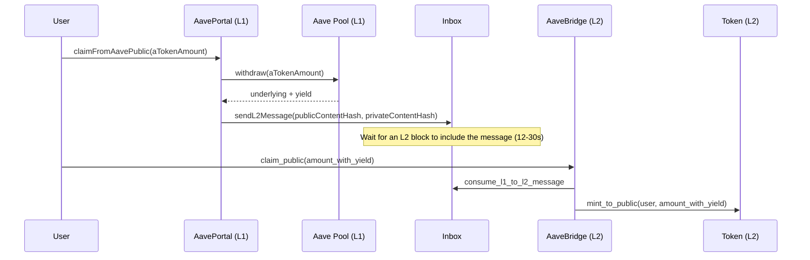

## Why DeFi from Aztec?

Imagine you hold DAI on Aztec L2. Gas is cheap, transactions are private, but your tokens are just sitting there. What if you could deposit them into Aave on Ethereum, earn yield, and then bring those yield-bearing tokens back to Aztec?

In this tutorial, you'll build exactly that: a **cross-chain DeFi bridge** that moves tokens between Aztec and Aave's lending pool on Ethereum. By the end, you'll understand how to compose L1 DeFi protocols with Aztec's cross-chain messaging system.

## What You'll Build

The diagram below shows the full round-trip, starting from tokens the user already holds on L2:



You'll create:

- **AaveBridge (L2)** — A Noir contract that burns/mints tokens and sends/consumes cross-chain messages
- **AavePortal (L1)** — A Solidity contract that interacts with Aave and handles L1↔L2 messaging
- **Mock Aave contracts** — Simplified mocks of Aave's lending pool for local testing
- **Integration script** — A TypeScript script that deploys everything and runs the full flow

## Prerequisites

- [Aztec local network running at version #include_aztec_version](../../../getting_started_on_local_network.md) (includes Aztec CLI and Node.js v24+)
- [Hardhat](https://hardhat.org/getting-started) installed for Solidity compilation and deployment
- Familiarity with the [Token Bridge tutorial](./token_bridge.md) (recommended)
- Basic understanding of [cross-chain messaging](../../foundational-topics/ethereum-aztec-messaging/index.md)

## Understanding the Flow

The bridge has two directions: **depositing** tokens from L2 into Aave on L1, and **claiming** them back (with yield) on L2.

### Deposit Flow (L2 → Aave)



### Claim Flow (Aave → L2)



## Project Setup

Start with the Hardhat + Aztec template. This provides a pre-configured Hardhat project with Aztec dependencies and Solidity compilation settings:

:::note

This template is a community-maintained starter. If the repository is unavailable, you can set up a Hardhat project manually and add the `@aztec/*` Solidity remappings from the [cross-chain messaging docs](../../foundational-topics/ethereum-aztec-messaging/index.md).

You may need to replace the `@aztec/l1-contracts` dependency in `package.json` with the `@aztec/l1-artifacts` npm package at the version matching your Aztec version, e.g.:

```json
"@aztec/l1-artifacts": "#include_version_without_prefix"
```

The package ships the L1 contract sources under `@aztec/l1-artifacts/l1-contracts/src`; update any `@aztec/*` Solidity remappings or aliases in the project to point at `node_modules/@aztec/l1-artifacts/l1-contracts/src`.

:::

```bash
git clone https://github.com/critesjosh/hardhat-aztec-example
cd hardhat-aztec-example
```

When complete, your project will have this structure:

```
hardhat-aztec-example/
  contracts/                     # Solidity contracts (Hardhat default)
    MockERC20.sol
    MockAToken.sol
    MockAavePool.sol
    AavePortal.sol
  contracts/aztec/               # Noir contracts
    aave_bridge/
      contract/src/main.nr
      contract/src/config.nr
      contract/Nargo.toml
    aave_bridge_test/
      src/Nargo.toml
      src/lib.nr
  scripts/
    index.ts                     # Integration script
  artifacts/                     # Generated by aztec codegen
```

Add the Aztec dependencies:

```bash
yarn add @aztec/aztec.js@#include_version_without_prefix @aztec/accounts@#include_version_without_prefix @aztec/wallets@#include_version_without_prefix @aztec/stdlib@#include_version_without_prefix @aztec/foundation@#include_version_without_prefix @aztec/ethereum@#include_version_without_prefix @aztec/noir-contracts.js@#include_version_without_prefix @aztec/viem@2.38.2 tsx
```

Start the local network in another terminal:

```bash
aztec start --local-network
```

## Part 1: The L2 Bridge Contract

The L2 bridge is the simpler side. It doesn't know anything about Aave — it just burns/mints tokens and passes messages. All the Aave-specific logic lives on L1.

:::note
The L2 bridge is intentionally protocol-agnostic — it just burns/mints tokens and relays messages. All Aave-specific logic lives on L1. This means you can compose with any L1 protocol without changing your L2 contract. If you've completed the [Token Bridge tutorial](./token_bridge.md), you'll recognize the pattern and can skim to [Part 2](#part-2-the-ethereum-side).
:::

Create the bridge contract:

```bash
aztec new contracts/aztec/aave_bridge
cd contracts/aztec/aave_bridge
```

The `aztec new` command creates a workspace with a `contract` crate and a `test` crate. Replace the generated test file at `test/src/lib.nr` with a basic constructor test:

```rust
use aztec::protocol::address::{AztecAddress, EthAddress};
use aztec::protocol::traits::FromField;
use aztec::test::helpers::test_environment::TestEnvironment;
use aave_bridge::AaveBridge;

#[test]
unconstrained fn test_constructor() {
    let mut env = TestEnvironment::new();
    let deployer = env.create_light_account();

    let token = AztecAddress::from_field(1);
    let portal = EthAddress::from_field(2);

    let initializer = AaveBridge::interface().constructor(token, portal);
    let _contract_address =
        env.deploy("@aave_bridge/AaveBridge").with_public_initializer(deployer, initializer);
}
```

The bridge reuses the existing `Token` contract and the `token_portal_content_hash_lib` for content hash functions. Add these dependencies to `contracts/aztec/aave_bridge/aave_bridge_contract/Nargo.toml`:

```toml
[dependencies]
aztec = { git="https://github.com/AztecProtocol/aztec-packages", tag = "#include_aztec_version", directory = "noir-projects/labs/aztec-nr/aztec" }
token_portal_content_hash_lib = { git="https://github.com/AztecProtocol/aztec-packages", tag = "#include_aztec_version", directory = "noir-projects/labs/noir-contracts/contracts/libs/token_portal_content_hash_lib" }
token = { git="https://github.com/AztecProtocol/aztec-packages", tag = "#include_aztec_version", directory = "noir-projects/labs/noir-contracts/contracts/app/token_contract" }
```

### Bridge Storage

The bridge stores two things: the L2 token address and the L1 portal address. First, create the config module at `contracts/aztec/aave_bridge/aave_bridge_contract/src/config.nr`:

#include_code config /docs/examples/contracts/aave_bridge/src/config.nr rust

Then replace `contracts/aztec/aave_bridge/aave_bridge_contract/src/main.nr`:

<!-- wrapped in a code block to add a "}" at the end -->

```rust
#include_code bridge_setup /docs/examples/contracts/aave_bridge/src/main.nr raw
}
```

:::warning Assembling the Contract
The code above shows the contract opening — imports, storage, constructor, and a getter — followed by a closing `}`. In the sections below, you'll add more functions **inside** this contract body. Place them before the final `}` so they are part of `pub contract AaveBridge { ... }`.
:::

### Public Claim and Exit

Add the following functions inside the `AaveBridge` contract body (before the closing `}`). `claim_public` consumes an L1→L2 message and mints tokens. `exit_to_l1_public` burns tokens and sends an L2→L1 message:

#include_code claim_public /docs/examples/contracts/aave_bridge/src/main.nr rust

#include_code exit_to_l1_public /docs/examples/contracts/aave_bridge/src/main.nr rust

The `authwit_nonce` parameter supports [authentication witnesses](../../aztec-js/how_to_use_authwit.md). When the caller is the token owner (`msg.sender`), pass `0` — no authorization witness is needed. If a third party calls this function on behalf of the owner, they must provide a valid nonce from an authwit the owner previously created.

### Private Claim and Exit

Still inside the contract body, add the private variants. They work the same way but use private token operations. The recipient's address is hidden when claiming privately:

#include_code claim_private /docs/examples/contracts/aave_bridge/src/main.nr rust

#include_code exit_to_l1_private /docs/examples/contracts/aave_bridge/src/main.nr rust

:::info Content Hash Matching

The content hash is the critical link between L1 and L2. Both sides must produce the exact same hash for a message to be consumed. The `token_portal_content_hash_lib` handles this by encoding parameters identically to the Solidity side's `abi.encodeWithSignature`. For example, `get_mint_to_public_content_hash(to, amount)` on L2 matches `Hash.sha256ToField(abi.encodeWithSignature("mint_to_public(bytes32,uint256)", to, amount))` on L1.

:::

### Compile

```bash
aztec compile
```

Generate TypeScript bindings:

```bash
aztec codegen target --outdir ../artifacts
```

:::note Token Contract
The integration script imports `TokenContract` from `@aztec/noir-contracts.js`, which provides pre-built bindings for the standard Token contract. Only the custom `AaveBridge` contract needs codegen.
:::

## Part 2: The Ethereum Side

### Mock Aave Contracts

For local testing, you'll use simplified mocks of Aave's lending pool. The mock pool accepts deposits and returns them with a configurable yield — 10% in this tutorial (1000 basis points, where 10000 bps = 100%).

:::tip Mock vs Real Aave

In production, replace `MockAavePool` with Aave V3's `IPool` interface at `0x87870Bca3F3fD6335C3F4ce8392D69350B4fA4E2` (Ethereum mainnet). The portal contract's `IAavePool` interface already matches Aave V3's function signatures. For realistic testing, fork mainnet with `aztec-anvil --fork-url <your-rpc-url>` (the Aztec installer ships Foundry's `anvil` as `aztec-anvil`; substitute your own `anvil` if its version matches `aztec-anvil --version`).

:::

Create the following mock contracts in `contracts/`.

`contracts/MockERC20.sol` — a minimal ERC20 with public minting:

```solidity
import {ERC20} from "@openzeppelin/contracts/token/ERC20/ERC20.sol";

#include_code mock_erc20 /docs/examples/solidity/aave_bridge/MockERC20.sol raw
```

`contracts/MockAToken.sol` — Aave's yield-bearing token mock:

```solidity
import {ERC20} from "@openzeppelin/contracts/token/ERC20/ERC20.sol";

#include_code mock_atoken /docs/examples/solidity/aave_bridge/MockAToken.sol raw
```

`contracts/MockAavePool.sol` — simplified Aave lending pool that returns a configurable yield:

```solidity
import {IERC20} from "@openzeppelin/contracts/token/ERC20/IERC20.sol";
import {MockERC20} from "./MockERC20.sol";
import {MockAToken} from "./MockAToken.sol";

#include_code mock_aave_pool /docs/examples/solidity/aave_bridge/MockAavePool.sol raw
```

### AavePortal Contract

The portal is where the magic happens. It bridges Aztec's cross-chain messages with Aave's lending pool. Create `contracts/AavePortal.sol`:

<!-- wrapped in a code block to add a "}" at the end -->

```solidity
import {IERC20} from "@openzeppelin/contracts/token/ERC20/IERC20.sol";
import {SafeERC20} from "@openzeppelin/contracts/token/ERC20/utils/SafeERC20.sol";

import {IRegistry} from "@aztec/l1-artifacts/l1-contracts/src/governance/interfaces/IRegistry.sol";
import {IInbox} from "@aztec/l1-artifacts/l1-contracts/src/core/interfaces/messagebridge/IInbox.sol";
import {IOutbox} from "@aztec/l1-artifacts/l1-contracts/src/core/interfaces/messagebridge/IOutbox.sol";
import {IRollup} from "@aztec/l1-artifacts/l1-contracts/src/core/interfaces/IRollup.sol";
import {DataStructures} from "@aztec/l1-artifacts/l1-contracts/src/core/libraries/DataStructures.sol";
import {Hash} from "@aztec/l1-artifacts/l1-contracts/src/core/libraries/crypto/Hash.sol";
import {Epoch} from "@aztec/l1-artifacts/l1-contracts/src/core/libraries/TimeLib.sol";

#include_code portal_setup /docs/examples/solidity/aave_bridge/AavePortal.sol raw
}
```

:::warning Assembling the Contract
Like the L2 contract, the code above shows the contract opening — imports, state variables, and `initialize()`. The subsequent function snippets go **inside** this contract body, before the closing `}`.
:::

The portal has three key functions. First, `depositToAave` consumes an L2→L1 message (proving the user burned tokens on L2) and deposits the underlying tokens into Aave:

#include_code portal_deposit_to_aave /docs/examples/solidity/aave_bridge/AavePortal.sol solidity

Then, `claimFromAavePublic` withdraws from Aave (including any yield earned) and sends an L1→L2 message so the user can mint tokens on L2:

#include_code portal_claim_public /docs/examples/solidity/aave_bridge/AavePortal.sol solidity

There's also a private variant that lets the user claim without revealing their L2 address:

#include_code portal_claim_private /docs/examples/solidity/aave_bridge/AavePortal.sol solidity

### Compile

```bash
npx hardhat compile
```

:::note Solidity Artifact Paths
Hardhat compiles Solidity contracts to `artifacts/contracts/` by default. The integration script imports ABIs from this location (e.g., `../artifacts/contracts/AavePortal.sol/AavePortal.json`).
:::

## Part 3: Deploying and Testing

Create `scripts/index.ts` to run the full flow. This script deploys all contracts, initializes them, deposits tokens into Aave from L2, and claims them back with yield.

### Setup

```typescript
import { getInitialTestAccountsData } from "@aztec/accounts/testing";
import { AztecAddress, EthAddress } from "@aztec/aztec.js/addresses";
import { SetPublicAuthwitContractInteraction } from "@aztec/aztec.js/authorization";
import { Fr } from "@aztec/aztec.js/fields";
import { createAztecNodeClient, waitForNode } from "@aztec/aztec.js/node";
import { createExtendedL1Client } from "@aztec/ethereum/client";
import { deployL1Contract } from "@aztec/ethereum/deploy-l1-contract";
import { sha256ToField } from "@aztec/foundation/crypto/sha256";
import {
  computeL2ToL1MessageHash,
  computePrivateContentHash,
} from "@aztec/stdlib/hash";
import { EmbeddedWallet } from "@aztec/wallets/embedded";
import { decodeEventLog, pad, toFunctionSelector } from "@aztec/viem";
import { foundry } from "@aztec/viem/chains";
import AavePortal from "../artifacts/contracts/AavePortal.sol/AavePortal.json" with { type: "json" };
import MockERC20 from "../artifacts/contracts/MockERC20.sol/MockERC20.json" with { type: "json" };
import MockAToken from "../artifacts/contracts/MockAToken.sol/MockAToken.json" with { type: "json" };
import MockAavePool from "../artifacts/contracts/MockAavePool.sol/MockAavePool.json" with { type: "json" };
import { TokenContract } from "@aztec/noir-contracts.js/Token";
import { AaveBridgeContract } from "../contracts/aztec/artifacts/AaveBridge.js";

#include_code setup /docs/examples/ts/aave_bridge/index.ts raw
```

:::note About EmbeddedWallet
`EmbeddedWallet` is a simplified wallet for local development. It handles key management, transaction signing, and proof generation in-process. Code written against `EmbeddedWallet` works with any `Wallet` implementation, so your application logic transfers directly to production.
:::

### Deploy L1 Contracts

#include_code deploy_l1 /docs/examples/ts/aave_bridge/index.ts typescript

### Deploy L2 Contracts

#include_code deploy_l2 /docs/examples/ts/aave_bridge/index.ts typescript

### Initialize

#include_code initialize /docs/examples/ts/aave_bridge/index.ts typescript

### Fund the User

For this tutorial, you need tokens in two places:

- **L2 tokens for the user** — The user needs tokens on L2 to burn and bridge to L1. In production, these would come from a prior bridge operation.
- **L1 underlying tokens at the portal** — When the portal calls `depositToAave`, it transfers underlying tokens to Aave. The portal must already hold these tokens. In production, the tokens would arrive via a separate bridging mechanism.

For simplicity, mint directly to both:

#include_code fund_user /docs/examples/ts/aave_bridge/index.ts typescript

### Deposit to Aave (L2 → L1)

Now for the main flow. Burn tokens on L2 and send a message to L1.

:::info Why is the portal the recipient?
The `recipient` in `exit_to_l1_public` is the L1 address that receives the withdrawal message. Since the AavePortal contract needs to deposit the tokens into Aave, the portal itself is the recipient. Setting `caller_on_l1` to `EthAddress.ZERO` means anyone can relay the message on L1 — there's no access restriction on who calls `depositToAave`.
:::

#include_code deposit_to_aave /docs/examples/ts/aave_bridge/index.ts typescript

Compute the membership witness to prove the message on L1:

#include_code get_deposit_witness /docs/examples/ts/aave_bridge/index.ts typescript

Execute the deposit on L1:

#include_code execute_deposit_l1 /docs/examples/ts/aave_bridge/index.ts typescript

### Claim from Aave with Yield (L1 → L2)

Before withdrawing from Aave, generate a random claim secret. The secret forms the private content of the L1-to-L2 message: the message carries only its hash (the private content hash), and only someone who knows the secret can consume the message on L2. This prevents front-running: without the secret, no one else can claim your tokens.

Withdraw from Aave on L1 and send the message to L2. The mock pool returns 10% yield:

#include_code claim_from_aave_l1 /docs/examples/ts/aave_bridge/index.ts typescript

Extract the message leaf index:

#include_code get_claim_leaf_index /docs/examples/ts/aave_bridge/index.ts typescript

On the local network, L2 blocks are only produced when transactions are submitted. An L1-to-L2 message can only be consumed once an L2 block includes it, and the network waits until the message is at least 12 seconds old before including it. This utility deploys two dummy contracts (with random salts for unique addresses) to force block production. On devnet or testnet, blocks are produced continuously and this step is unnecessary:

#include_code mine_blocks /docs/examples/ts/aave_bridge/index.ts typescript

Claim the tokens (with yield) on L2:

#include_code claim_on_l2 /docs/examples/ts/aave_bridge/index.ts typescript

### Verify

#include_code verify /docs/examples/ts/aave_bridge/index.ts typescript

Run the full flow:

```bash
npx hardhat run scripts/index.ts --network localhost
```

You should see the user start with 1000 tokens, deposit 500 to Aave, and end up with 1050 tokens (500 remaining + 550 from Aave with 10% yield).

## What You Built

A complete cross-chain DeFi integration with:

1. **L2 Bridge** (Noir) — Burns/mints tokens and handles cross-chain messages. Supports both public and private operations.
2. **L1 Portal** (Solidity) — Deposits into Aave and withdraws with yield. Handles message consumption and creation.
3. **Mock Aave** (Solidity) — Simulates yield generation for local testing.
4. **Full Flow** — Deposit tokens from L2 into Aave, earn yield, and claim back on L2.

:::warning Production Considerations

This tutorial uses mock contracts for simplicity. In production:

- Replace `MockAavePool` with a real Aave V3 pool address
- Handle Aave's variable interest rates (the withdrawn amount may differ from expectations)
- Add slippage protection and error handling for failed messages
- Consider that funds are "in flight" between chains — implement recovery mechanisms
- Add proper access controls to the portal contract

:::

## Troubleshooting

### Script hangs waiting for block to be published

The deposit flow waits for the L2 block containing your exit transaction to be included in an epoch that is submitted to L1. On the local network, this typically takes 30–60 seconds. If it takes longer, check that your local network is running and producing blocks.

### Content hash mismatch — L1 message consumption reverts

This is the most common cross-chain debugging issue. The content hash computed on L2 (via `get_withdraw_content_hash`) must exactly match what the L1 portal reconstructs via `abi.encodeWithSignature`. Double-check that:
- The function signature string matches on both sides (e.g., `"withdraw(address,uint256,address)"`)
- Parameters are in the same order and encoded as the same types
- The `caller_on_l1` value matches: `EthAddress.ZERO` on L2 corresponds to `address(0)` on L1

### "Minter not set" — L2 claim fails

If `claim_public` reverts, ensure you called `set_minter(l2Bridge.address, true)` on the Token contract **after** deploying the bridge. The bridge must be authorized as a minter before it can mint tokens on claim.

### L1→L2 message not found — claim reverts after mining blocks

An L1-to-L2 message becomes consumable once an L2 block includes it, which takes 12 to 30 seconds after the L1 transaction. Make sure `mine2Blocks` runs before the claim. If the issue persists, verify the `messageLeafIndex` extracted from the `MessageSent` event is correct.

## Next Steps

- **Test with a mainnet fork**: Use `aztec-anvil --fork-url` (or your own `anvil` install) to test against real Aave
- **Add private deposits**: Use the `claim_private` and `exit_to_l1_private` functions for privacy-preserving DeFi
- **Build a frontend**: Add a web UI for easy depositing and claiming
- **Compose with other protocols**: The same pattern works for Uniswap, Compound, or any L1 DeFi protocol

:::tip Learn More

- [Cross-chain messaging](../../foundational-topics/ethereum-aztec-messaging/index.md)
- [Token Bridge Tutorial](./token_bridge.md)
- [State management](../../foundational-topics/state_management.md)

:::
