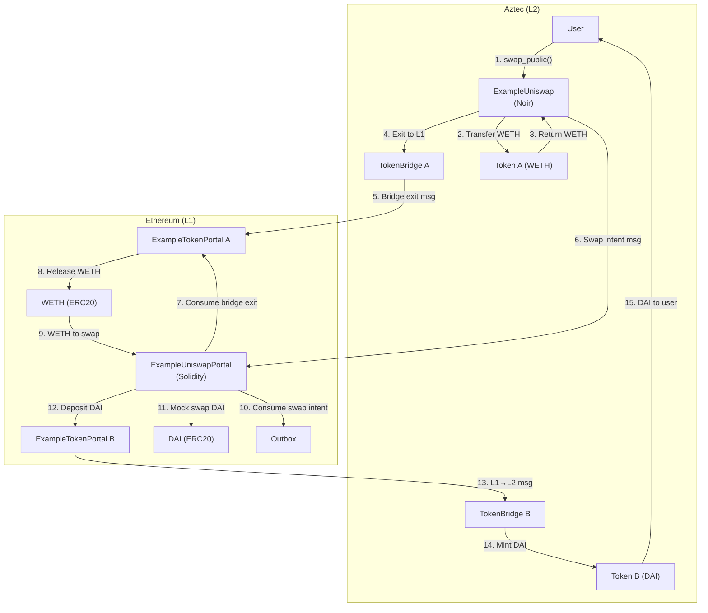

## Why Build a Cross-Chain Swap?

DeFi liquidity lives on Ethereum L1. Users with tokens on Aztec L2 need a way to access L1 DEXs like Uniswap without manually bridging tokens back and forth. A cross-chain swap automates this: the user initiates the swap on L2, and the protocol handles exiting to L1, performing the swap, and depositing the output back to L2.

This tutorial walks you through building a version of this flow. You will learn how [**L2-to-L1 messages**](../../aztec-nr/framework-description/ethereum_aztec_messaging.md) work and how multiple contracts across two chains coordinate to execute a single user action.

## Prerequisites

Before starting this tutorial, you need:

1. **Aztec local network** running at version #include_aztec_version -- see [the local network guide](../../../getting_started_on_local_network.md) for setup instructions
2. **Node.js** (v24+) and a package manager (yarn or npm)
3. **Familiarity with the token bridge tutorial** -- this tutorial builds on concepts from [Bridge Your NFT to Aztec](./token_bridge.md), especially portal contracts and cross-chain messaging

:::tip Background Knowledge
If you are new to Aztec's cross-chain architecture, review [Ethereum-Aztec Messaging](../../aztec-nr/framework-description/ethereum_aztec_messaging.md) first. Key concepts used throughout this tutorial:

- **Portals** -- L1 contracts that communicate with L2 contracts via the Aztec messaging protocol
- **L2-to-L1 messages** -- messages sent from Aztec to Ethereum, stored in a Merkle tree and consumed on L1
- **Authorization witnesses (authwit)** -- Aztec's alternative to ERC20 approve/transferFrom ([learn more](../../aztec-nr/framework-description/authentication_witnesses.md))
- **Content hashes** -- cryptographic digests that uniquely identify cross-chain messages, ensuring L1 and L2 agree on message parameters
:::

## Project Setup

This tutorial walks you through three types of contracts (Solidity, Noir, TypeScript) that work together. You will clone the example project and build it as you follow along.

### Clone the Example Code

The example code lives in the Aztec packages repository:

```bash
git clone --depth 1 --branch #include_aztec_version https://github.com/AztecProtocol/aztec-packages.git
cd aztec-packages/docs/examples
```

### Project Structure

The relevant files are spread across three directories:

```
examples/
├── contracts/
│   └── example_uniswap/
│       ├── Nargo.toml                  # Noir package config
│       └── src/
│           ├── main.nr                 # L2 uniswap contract
│           └── util.nr                 # Content hash helpers
├── solidity/
│   ├── foundry.toml                    # Solidity compiler config
│   └── example_swap/
│       ├── ExampleERC20.sol            # Minimal ERC20 tokens (WETH, DAI)
│       ├── ExampleTokenPortal.sol      # L1 token bridge portal
│       └── ExampleUniswapPortal.sol    # L1 swap orchestrator
└── ts/
    └── example_swap/
        ├── index.ts                    # TypeScript orchestration script
        └── config.yaml                 # Build configuration
```

### Dependencies

**Solidity** (via Foundry import mappings in `foundry.toml`):
- OpenZeppelin ERC20 (`@oz/token/ERC20/`)
- Aztec L1 contracts (`@aztec/core`, `@aztec/governance`)

**Noir** (in `Nargo.toml`):
- `aztec` -- the Aztec Noir framework
- `token` -- the standard Token contract
- `token_bridge` -- the standard TokenBridge contract
- `keccak256` -- for computing Solidity-compatible function selectors

**TypeScript**:
- `@aztec/aztec.js`, `@aztec/accounts`, `@aztec/wallets`, `@aztec/stdlib`
- `@aztec/ethereum`, `@aztec/noir-contracts.js`, `@aztec/foundation`

:::note
The TypeScript script imports compiled Solidity artifacts and a generated Noir artifact (`ExampleUniswapContract`). You will compile both before running the script.
:::

## What You'll Build



Each swap generates **two L2-to-L1 messages**, both of which must be consumed on L1 before the swap executes:

1. **Token bridge exit** - Authorizes releasing input tokens from the token portal to the uniswap portal
2. **Swap intent** - Proves the user authorized *this specific swap* with *these exact parameters*

Neither message alone is sufficient. If only the token exit existed, anyone observing it could potentially redirect the swap. If only the swap intent existed, there would be no proof that tokens were actually withdrawn. Together, they create a cryptographic chain of authorization. This two-message pattern is common in Aztec cross-chain applications where multiple independent systems must coordinate.

## Part 1: Token Portal (Solidity)

The token portal handles depositing tokens from L1 to L2 and withdrawing from L2 to L1. This is a simplified version for tutorial purposes -- for a deeper look at how portals work, see the [token bridge tutorial](./token_bridge.md).

#include_code example_token_portal /docs/examples/solidity/example_swap/ExampleTokenPortal.sol solidity

Key functions:

- `depositToAztecPublic` - Locks ERC20 tokens and sends an L1→L2 message for public minting
- `depositToAztecPrivate` - Same but for private minting
- `withdraw` - Consumes an L2→L1 message and releases tokens

The [registry](../../aztec-nr/framework-description/ethereum_aztec_messaging.md) provides governance-updateable addresses for core Aztec contracts. Rather than hardcoding rollup addresses, portals query the registry, allowing the protocol to upgrade without redeploying all portals.

Each cross-chain message includes a **content hash** -- a `sha256` digest of the function selector and its parameters that uniquely identifies the message. The content hash is computed with `Hash.sha256ToField(abi.encodeWithSignature(...))`, where `abi.encodeWithSignature` prepends a 4-byte function selector (keccak256 of the function signature, per Solidity convention). This makes each message type unique, preventing a deposit message from being confused with a withdrawal message.

#include_code deposit_to_aztec_public /docs/examples/solidity/example_swap/ExampleTokenPortal.sol solidity

#include_code withdraw /docs/examples/solidity/example_swap/ExampleTokenPortal.sol solidity

## Part 2: Uniswap Portal (Solidity)

The uniswap portal orchestrates the swap on L1. It consumes two L2→L1 messages, performs the swap, and deposits the output back to L2.

:::note Mock Swap
This tutorial uses a mock 1:1 swap instead of a real Uniswap V3 router. The portal must be pre-funded with output tokens. The important part is the **message-passing pattern**, not the swap itself.
:::

#include_code example_uniswap_portal /docs/examples/solidity/example_swap/ExampleUniswapPortal.sol solidity

The public swap function consumes two messages and deposits the output:

#include_code swap_public /docs/examples/solidity/example_swap/ExampleUniswapPortal.sol solidity

The private swap follows the same pattern but deposits output tokens privately:

#include_code swap_private /docs/examples/solidity/example_swap/ExampleUniswapPortal.sol solidity

### Compile Solidity Contracts

With all Solidity contracts from Part 1 and Part 2 ready, compile them using Foundry. From the `examples/solidity` directory:

```bash
cd solidity
forge build
```

This produces JSON artifacts containing the ABI and bytecode. The TypeScript script imports these artifacts to deploy contracts on L1.

## Part 3: Uniswap Contract (Noir)

The L2 contract handles the user-facing logic: transferring input tokens, calling the bridge to exit to L1, and creating the swap intent message.

### Setup

The contract stores the portal address and imports the `Token` and `TokenBridge` contracts:

#include_code example_uniswap_setup /docs/examples/contracts/example_uniswap/src/main.nr rust

### Public Swap

The public swap transfers tokens from the sender to the contract, exits them to L1 via the bridge, and sends a swap intent message:

:::note Authorization Witnesses
Aztec uses [**authorization witnesses** (authwit)](../../aztec-nr/framework-description/authentication_witnesses.md) instead of the ERC20 approve/transferFrom pattern. The contract computes the hash of the exact action it wants to perform, sets that hash as authorized, then immediately performs the action. This gives fine-grained control - the authorization is for a specific action, not a blanket approval. Since we authorize and spend in the same transaction, replay attacks are impossible.
:::

#include_code swap_public /docs/examples/contracts/example_uniswap/src/main.nr rust

### Private Swap

The private swap is similar but uses `transfer_to_public` (private to public transfer) and [`enqueue_self`](../../aztec-nr/framework-description/calling_contracts.md) instead of `call_self`. Because `swap_private` is a private function and `_approve_bridge_and_exit_input_asset_to_L1` is public, it cannot be called synchronously -- private functions execute before public functions in a transaction. `enqueue_self` schedules the public call to run in the public phase of the same transaction:

#include_code swap_private /docs/examples/contracts/example_uniswap/src/main.nr rust

:::note Why no recipient parameter?
In `swap_private`, the recipient is the person that provides the secret used to generate the hash for the L1 to L2 message. This preserves privacy: revealing a recipient address to L1 would compromise the caller's identity. The output tokens are deposited privately to L2, where only the secret holder can claim them.
:::

### Bridge Helper

Both flows share this internal function that approves the bridge to burn tokens and exits them to L1:

#include_code approve_bridge_and_exit /docs/examples/contracts/example_uniswap/src/main.nr rust

:::note Portal Address Validation
The portal address checks are a **safety mechanism**. If either portal is zero (not configured), the funds would be permanently lost. Always validate external addresses before sending irreversible messages.
:::

:::note Fixed nonce safety
The fixed nonce `0xdeadbeef` used throughout this contract is safe because authorization and token spending occur in the same transaction. There's no opportunity for replay attacks since the authorization is set and consumed atomically.
:::

### Content Hash Helpers

These content hashes form the **cross-chain contract interface**. The L2 contract computes a hash of all swap parameters, and the L1 portal reconstructs the same hash from the parameters it receives. If they don't match exactly, the message consumption fails.

This is how L1 verifies that L2 actually authorized the swap - not by trusting a signature, but by independently computing what the message should contain. The hashes must match exactly between L2 (Noir) and L1 (Solidity):

#include_code swap_public_content_hash /docs/examples/contracts/example_uniswap/src/util.nr rust

#include_code swap_private_content_hash /docs/examples/contracts/example_uniswap/src/util.nr rust

### Compile and Generate Bindings

From the `examples/contracts/example_uniswap` directory, compile the Noir contract and generate TypeScript bindings:

```bash
cd ../contracts/example_uniswap
aztec compile
aztec codegen target -o ../../ts/example_swap/artifacts
```

The `aztec compile` command compiles the Noir contract. The `aztec codegen` command generates a TypeScript class (`ExampleUniswapContract`) from the compiled artifact, which you will use in the deployment script.

:::note
Before proceeding, make sure you have compiled both the Solidity contracts (Part 1-2) and the Noir contract (Part 3). The TypeScript script below imports compiled artifacts from both.
:::

## Install TypeScript Dependencies

From the `examples/ts/example_swap` directory, initialize a project and install the required packages:

```bash
cd ../../ts/example_swap
npm init -y
npm install \
  @aztec/aztec.js@#include_aztec_version \
  @aztec/accounts@#include_aztec_version \
  @aztec/wallets@#include_aztec_version \
  @aztec/stdlib@#include_aztec_version \
  @aztec/ethereum@#include_aztec_version \
  @aztec/noir-contracts.js@#include_aztec_version \
  @aztec/foundation@#include_aztec_version \
  npm:@aztec/viem@2.38.2 \
  tsx
```

## Part 4: Public Swap Flow (TypeScript)

Now you can tie everything together in a TypeScript script. Start by setting up clients and deploying all contracts:

#include_code setup /docs/examples/ts/example_swap/index.ts typescript

### Deploy L1 Contracts

Deploy two ERC20 tokens, two token portals, and the uniswap portal:

#include_code deploy_l1 /docs/examples/ts/example_swap/index.ts typescript

### Deploy L2 Contracts

Deploy L2 tokens (using `TokenContract` from `@aztec/noir-contracts.js`), bridges, and the uniswap contract:

#include_code deploy_l2 /docs/examples/ts/example_swap/index.ts typescript

### Initialize and Fund

Initialize all portals and mint tokens:

#include_code initialize /docs/examples/ts/example_swap/index.ts typescript

Fund the user with input tokens and pre-fund the uniswap portal with output tokens:

#include_code fund /docs/examples/ts/example_swap/index.ts typescript

### Deposit to L2

Bridge WETH from L1 to L2:

#include_code deposit_to_l2 /docs/examples/ts/example_swap/index.ts typescript

:::tip Why use a secret hash?
When depositing from L1 to L2, we use a secret/secret-hash pattern: generate a random secret on the client, send only the hash to L1 (in the deposit transaction), then later reveal the secret on L2 to claim the tokens. This prevents **front-running attacks**: a malicious sequencer (the node that orders and processes L2 transactions) cannot observe the L1 deposit and claim the tokens themselves because they don't know the secret. Only someone who knows the preimage can claim.
:::

Before claiming, we need to mine 2 L2 blocks. L1-to-L2 messages are not available in the same block they are sent -- the rollup must first include them in an L2 block, and then one more block must pass before the message can be consumed. We use a helper that deploys throwaway contracts to force these blocks:

#include_code mine_blocks /docs/examples/ts/example_swap/index.ts typescript

Claim the deposited tokens on L2:

#include_code claim_on_l2 /docs/examples/ts/example_swap/index.ts typescript

### Execute the Swap

Initiate the swap on L2:

#include_code public_swap /docs/examples/ts/example_swap/index.ts typescript

### Waiting for Block Proofs

L2→L1 messages can only be consumed on L1 after the L2 block containing them has been **proven**. Aztec batches blocks into [**epochs**](../../aztec-nr/framework-description/ethereum_aztec_messaging.md) and generates ZK proofs for each epoch. The proof confirms that the L2 state transition (including our swap messages) actually happened according to the protocol rules. Until the proof is submitted to L1, the messages exist but cannot be trusted.

#include_code wait_for_proof /docs/examples/ts/example_swap/index.ts typescript

The [outbox](../../aztec-nr/framework-description/ethereum_aztec_messaging.md) stores L2→L1 messages in a Merkle tree. To consume a message, you must provide the **epoch** (which proof batch contains the message), the **leaf index** (position in the message tree), and the **sibling path** (Merkle proof showing the message is in the tree). These parameters are computed offchain by observing L2 blocks.

First, read the rollup version from the portal and compute the content hash and message leaf for the token bridge exit message:

#include_code consume_l1_messages_setup /docs/examples/ts/example_swap/index.ts typescript

Next, compute Merkle membership witnesses for both L2→L1 messages -- the sibling path (proof of inclusion) for each. We also compute the swap intent message leaf using the same encoding as the Solidity portal:

#include_code consume_l1_messages_witnesses /docs/examples/ts/example_swap/index.ts typescript

Next, call `swapPublic` on the L1 uniswap portal, passing both message proofs. The portal verifies both messages against the outbox, performs the mock swap, and deposits the output tokens back to L2:

#include_code consume_l1_messages_execute /docs/examples/ts/example_swap/index.ts typescript

Finally, claim the output DAI on L2:

#include_code claim_output /docs/examples/ts/example_swap/index.ts typescript

### Run It

Start a local Aztec network in one terminal, then execute the script in another. Make sure you are in the `examples/ts/example_swap` directory:

```bash
# Terminal 1: Start a local network
aztec start --local-network

# Terminal 2: From examples/ts/example_swap, run the swap script
npx tsx index.ts
```

You should see console output tracing each step: deploying contracts, depositing to L2, initiating the swap, waiting for the proof, consuming messages on L1, and claiming the output DAI on L2.

## Public vs Private Comparison

| Aspect | Public Swap | Private Swap |
|--------|------------|-------------|
| **L2 function** | `swap_public()` | `swap_private()` |
| **Token transfer** | `transfer_in_public` (public→public) | `transfer_to_public` (private→public) |
| **Bridge call** | `call_self` (immediate) | `enqueue_self` (deferred) |
| **L1 deposit** | `depositToAztecPublic` | `depositToAztecPrivate` |
| **L2 claim** | `claim_public` | `claim_private` |
| **Visibility** | Swap amount and recipient visible | Swap amount visible, recipient hidden |

The private flow hides *who* is swapping, but the amounts are visible on L1 because the token bridge exit is a public operation. The output deposit can be claimed privately, so the final recipient is hidden.

## What You Built

A complete cross-chain token swap system with:

1. **L1 Contracts** (Solidity)
   - `ExampleERC20`: Minimal ERC20 tokens for testing
   - `ExampleTokenPortal`: Handles L1↔L2 token deposits and withdrawals
   - `ExampleUniswapPortal`: Orchestrates the swap by consuming two L2→L1 messages

2. **L2 Contract** (Noir)
   - `ExampleUniswap`: User-facing contract that initiates the swap, exits tokens to L1, and sends the swap intent message

3. **Message Flow**
   - User calls `swap_public` on L2
   - Two L2→L1 messages are created (bridge exit + swap intent)
   - L1 portal consumes both messages, swaps, and deposits output back to L2
   - User claims output tokens on L2

## Next Steps

- Extend with a real Uniswap V3 integration instead of the mock swap
- Add slippage protection with meaningful `minimum_output_amount` values
- Implement the private swap flow end-to-end in the TypeScript script
- Explore [cross-chain messaging](../../aztec-nr/framework-description/ethereum_aztec_messaging.md) in depth

:::tip Learn More
- [Token bridge tutorial](./token_bridge.md) - NFT bridge example
- [Cross-chain messaging reference](../../aztec-nr/framework-description/ethereum_aztec_messaging.md)
:::
