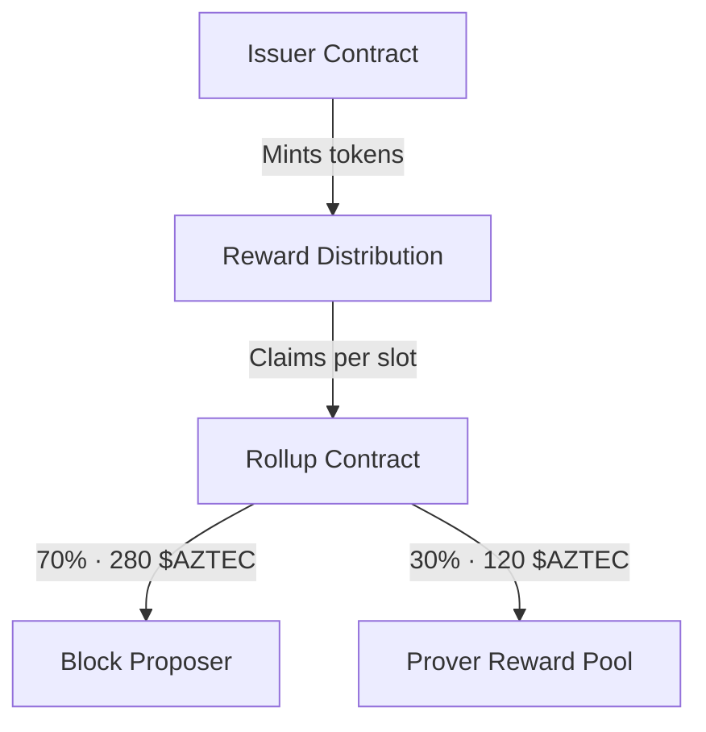

# Economics & Rewards

The Aztec network uses economic incentives to encourage honest participation and consistent operation. This page explains how rewards are distributed and what factors influence earnings.

## Reward Sources

Network participants earn rewards from two sources:

1. **Slot Rewards**: Protocol-funded rewards distributed each slot (inflationary)
2. **Transaction Fees**: Fees paid by users for transaction processing

## Slot Rewards

The protocol mints new tokens each slot as rewards. The current slot reward is **400 $AZTEC**, split between sequencers and provers:

| Recipient | Share | Amount Per Slot |
|-----------|-------|-----------------|
| **Sequencers** | 70% | 280 $AZTEC |
| **Provers** | 30% | 120 $AZTEC |

This value can be adjusted through governance.

### How Slot Rewards Flow



## Sequencer Rewards

Sequencers earn rewards for successfully proposing and finalizing blocks:

- **Slot share**: 70% of each slot reward (280 $AZTEC) goes to the block proposer, paid when the block is finalized on L1
- **Transaction fees**: Sequencers collect fees from users; a portion is burned via the base fee mechanism, and the remainder is split between sequencer and prover

## Prover Rewards

Provers earn rewards for generating validity proofs that finalize blocks:

- **Slot share**: 30% of each slot reward (120 $AZTEC), distributed among provers who participated in the epoch
- **Transaction prover fees**: Provers receive a portion of transaction fees, with the rate set by protocol parameters

### Activity Score and Reward Distribution

Prover slot rewards are not split equally. They are distributed based on each prover's **activity score**, which measures consistency of participation. The score:

- **Increases** by 125,000 per epoch of active proving
- **Decreases** by 100,000 per epoch of inactivity
- **Maximum**: 15,000,000 points

A prover's share of the reward pool is determined by a quadratic penalty formula:

```
shares = k - (a × (maxScore - score)²) / 1e10
```

Where `k = 1,000,000`, `a = 1,000`, and the minimum share is `100,000`.

At maximum activity score, a prover receives the full `k` shares. As the score drops, the quadratic term reduces shares increasingly aggressively, meaning small drops have minimal impact but extended inactivity significantly reduces earnings.

This design rewards long-term, consistent provers and discourages sporadic participation.

---

:::tip Learn More
- [Proof of Stake](../proof-of-stake/index.md) - How staking and validation work
- [Governance](../governance/index.md) - How protocol parameters (including rewards) can change
- [Running a Prover](../../operators/setup/running-a-prover.md) - Technical setup for provers
:::
