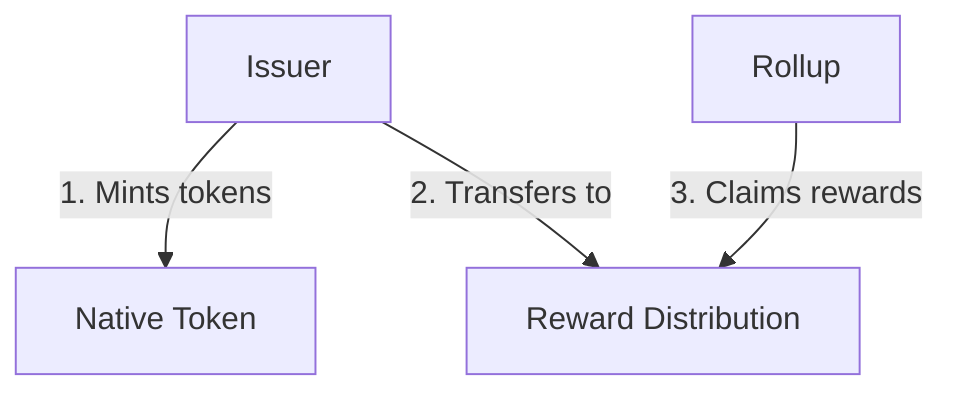

# Proof of Stake

The Aztec network uses a proof of stake consensus mechanism to secure the network and coordinate block production.

## Overview

In a proof of stake system:
- **Validators stake tokens** as collateral to participate in consensus
- **Block producers are selected** based on stake and randomness
- **Honest behavior is rewarded** with block rewards
- **Malicious behavior is punished** through slashing

## Staking

Validators must stake tokens on L1 to join the sequencer set. The staked tokens serve as:
- **Economic security**: Validators have financial incentive to behave honestly
- **Sybil resistance**: Prevents attackers from creating unlimited validator identities
- **Governance weight**: Stake can influence governance decisions

### Staking Requirements

**Activation Threshold**: To become an active validator, sequencers must stake at least the minimum activation threshold. This ensures validators have sufficient stake to be economically incentivized to behave honestly.

**Activation Delay**: After staking, a sequencer needs to wait for an activation period before they can start proposing new blocks. This delay provides time for the network to recognize the new validator.

**Unstaking Delay**: Unstaking requires a delay to allow for slashing of dishonest behavior that may have occurred while the validator was active. See [Unstaking](#unstaking) for details on the specific delay periods.

### Stake Delegation

Token holders who don't want to run their own infrastructure can delegate their stake to professional operators. See the [Delegating Stake](../users/delegation) guide for details.

### Key Registration

When staking, each sequencer registers a public key that will be used for:
- VRF submissions for sequencer selection
- Attestation signatures
- Block proposal authentication

## Sequencer Selection

Each slot, a sequencer is selected to propose a block using a verifiable random function (VRF). The selection process ensures:
- **Randomness**: Proposer selection is unpredictable
- **Fairness**: All staked validators have a chance to propose
- **Verifiability**: Anyone can verify the selection was legitimate

## Rewards

The Aztec network distributes rewards to participants who contribute to network security and operation. Rewards are funded through protocol inflation and distributed to sequencers and provers.

### Reward Distribution

The Reward Distribution contract distributes tokens only to the canonical rollup instance (as indicated by the Registry contract). This ensures that only the legitimate chain receives rewards.

Each epoch, the Rollup contract can claim `BLOCK_REWARD` tokens from the Distribution contract. The Rollup smart contract implements custom logic for how to split rewards among:
- Block proposers
- Committee members (attesters)
- Provers

### Inflation Rate

The protocol inflation rate is defined in the Issuer smart contract as the constant `RATE`. Key points:
- The inflation rate cannot be changed once the Issuer contract is deployed
- Aztec Governance can vote to deploy a new Issuer contract with a different `RATE`
- The Governance periodically calls `mint()` on the Issuer to fund the Distribution contract

### Reward Flow



The canonical Rollup contract calls `claim()` on the Distribution contract to receive rewards, which are then distributed to network participants.

## Slashing

Slashing is the mechanism by which validators lose a portion of their staked tokens for misbehavior.

### Why Slashing Exists

The chain must always (eventually) finalize new blocks. This requires:
1. More than 2/3 of the committee making attestations
2. Provers producing proofs

### Slashable Offenses

**Insufficient Quorum**: If a significant portion of the sequencer set goes offline and proposers cannot get enough attestations, the rollup cannot finalize new blocks. In prolonged cases, the network may enter [Based Fallback mode](https://forum.aztec.network/t/request-for-comments-aztecs-block-production-system/6155), where anyone can propose blocks if they supply proofs.

**Data Withholding**: A malicious committee may not gossip transaction data or proofs to the rest of the network. Without this data, provers cannot produce proofs and the epoch will reorg.

**Invalid State Roots**: Committee members who attest to invalid state transitions (either through negligence or malice) cause epochs to fail proving and reorg.

### Slashing Mechanism

Because transaction data and attestations are not posted onchain, automatic slashing is difficult to implement. Instead, the sequencer set votes to slash dishonest sequencers based on evidence collected both onchain and offchain, discussed and analyzed in community forums.

A sequencer must aggregate BLS signatures on slashing proposals and post them to L1 for slash execution. When a sequencer's balance is slashed below `MINIMUM_STAKING_BALANCE` (e.g., 50%), they are removed from the sequencer set.

## Unstaking

Unstaking is the process of withdrawing your staked tokens from the network. When you initiate a withdrawal, two delays start **in parallel**:

1. **Staking exit delay** — enforced by the Rollup contract
2. **Governance withdrawal delay** — enforced by the Governance contract (since staked tokens also carry voting power)

You must wait for **both** to pass before finalizing your withdrawal. The effective exit delay is whichever is longer.

### Staking Exit Delay

The Rollup contract enforces an exit delay to allow time for pending slashing conditions to be detected, and to prevent validators from quickly exiting after misbehaving.

#if(testnet)
**Testnet staking exit delay:** 172,800 seconds = **2 days**
#else
**Mainnet staking exit delay:** 345,600 seconds = **4 days**
#endif

### Governance Withdrawal Delay

Because staked tokens carry voting power via the GSE (Governance Staking Escrow), the Governance contract also enforces a withdrawal delay. This prevents governance attacks where someone could vote on a malicious proposal and immediately exit before it executes.

The governance withdrawal delay is calculated as:

```
withdrawalDelay = (votingDelay / 5) + votingDuration + executionDelay
```

#if(testnet)
**Testnet governance values:**

| Component | Value |
|-----------|-------|
| Voting Delay | 43,200s (12 hours) |
| Voting Duration | 86,400s (1 day) |
| Execution Delay | 43,200s (12 hours) |
| **Calculation** | **(43,200 / 5) + 86,400 + 43,200 = 138,240s** |
| **Governance Withdrawal Delay** | **~1.6 days** |
#else
**Mainnet governance values:**

| Component | Value |
|-----------|-------|
| Voting Delay | 259,200s (3 days) |
| Voting Duration | 604,800s (7 days) |
| Execution Delay | 604,800s (7 days) |
| **Calculation** | **(259,200 / 5) + 604,800 + 604,800 = 1,261,440s** |
| **Governance Withdrawal Delay** | **~14.6 days** |
#endif

### Effective Exit Delay

Since both delays start at the same time, the effective wait is whichever is longer:

#if(testnet)
| Delay | Duration |
|-------|----------|
| Staking exit delay | 2 days |
| Governance withdrawal delay | ~1.6 days |
| **Effective exit delay** | **2 days** |
#else
| Delay | Duration |
|-------|----------|
| Staking exit delay | 4 days |
| Governance withdrawal delay | ~14.6 days |
| **Effective exit delay** | **14.6 days** |
#endif

### Unstaking Process

1. **Initiate withdrawal**: Begin the exit process via the [Staking Dashboard](https://stake.aztec.network/)
2. **Wait for the exit delay**: Your tokens remain locked during this period
3. **Finalize withdrawal**: After the delay, complete the withdrawal to receive your tokens

For step-by-step instructions, see the [Unstaking Guide](../../users/staking.md#unstaking).

---

:::tip Ready to participate?
- **Token holders**: See [Staking Tokens](../users/staking) to stake your tokens
- **Operators**: See [Sequencer Setup](../operators/setup/sequencer_management) to run a validator
:::
