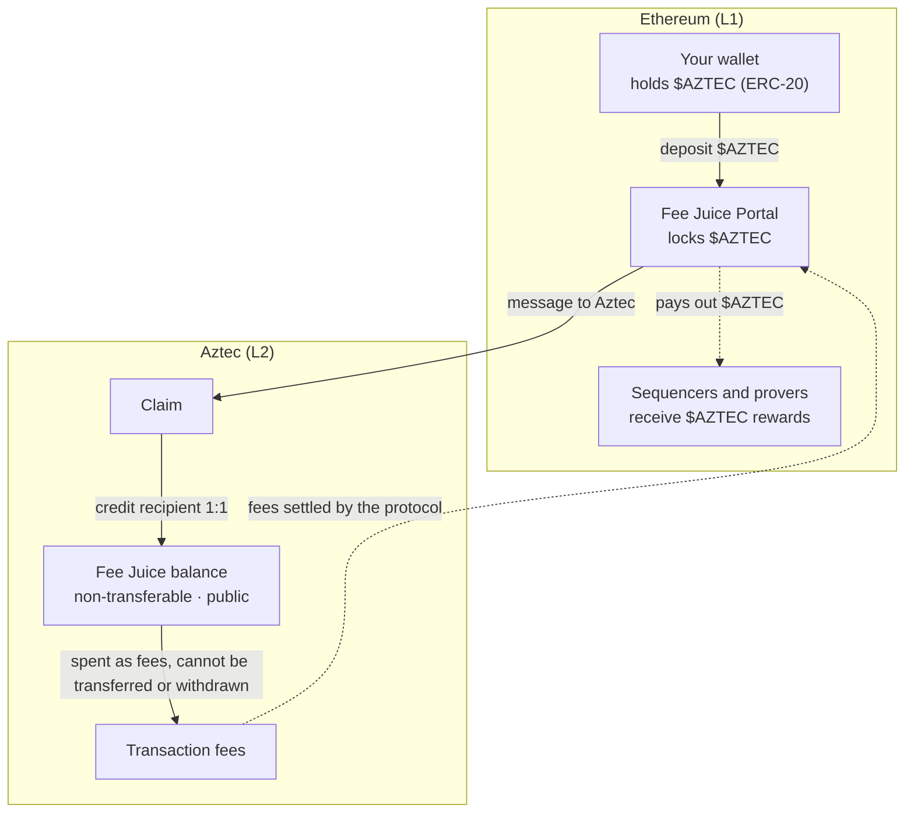

# Fees on Aztec

Every transaction on Aztec pays a fee. Fees are paid in **Fee Juice**, the network's dedicated fee asset. You get Fee Juice by bridging $AZTEC tokens from Ethereum into Aztec.

This page explains what Fee Juice is, how $AZTEC becomes Fee Juice, and how to get some so you can transact.

## What is Fee Juice?

Think of Fee Juice as a **prepaid balance for using the network**, a bit like postage credit or a prepaid gas card:

- **$AZTEC** is an ERC-20 token that lives on Ethereum. You can hold it, transfer it, and trade it like any other token.
- **Fee Juice** is what $AZTEC becomes once you deposit it into Aztec's Fee Juice Portal. It exists only on Aztec, and it has exactly one job: paying transaction fees.
- **The conversion rate is 1:1.** Deposit 1 $AZTEC into the portal and you get exactly 1 Fee Juice on Aztec. There is no exchange rate, price, or slippage involved in the conversion itself.

Fee Juice deliberately does **not** behave like a normal token:

- **It is non-transferable.** You cannot send Fee Juice to another Aztec account. It stays with the account it was claimed to until it is spent on fees.
- **It cannot be withdrawn.** The conversion is one-way: once $AZTEC becomes Fee Juice, it cannot be bridged back to Ethereum by the user. Only bridge what you expect to spend on fees.
- **Its balance is public.** Fee Juice balances are public state, because the network must be able to check that a transaction can pay for itself before executing it. Your transactions stay private; your Fee Juice balance is not. If you want fee payment itself to be private, see [paying privately](#do-you-always-need-fee-juice) below.

## How $AZTEC becomes Fee Juice

The conversion happens through the **Fee Juice Portal**, a smart contract on Ethereum:

1. **Deposit on Ethereum.** You (or a bridge app acting for you) call the Fee Juice Portal with an amount of \$AZTEC and the Aztec address that should receive the Fee Juice. The portal locks the \$AZTEC and sends a message to Aztec.
2. **Claim on Aztec.** Once the message is available on Aztec, the Fee Juice is claimed and credited to the recipient address, 1:1 with the deposited $AZTEC. The claim can even pay for itself: a brand-new account with no funds can claim bridged Fee Juice and use part of it to pay for that very claim transaction.
3. **Spend on fees.** From then on, every transaction the account sends draws its fee from that Fee Juice balance.

The $AZTEC locked in the portal does not sit idle forever: it backs the fees collected by the network and is ultimately paid out on Ethereum to the sequencers and provers who operate Aztec.

## How to get Fee Juice

Right now you need two things: an Aztec wallet, and a bridge app that deposits $AZTEC into the Fee Juice Portal for you.

### 1. Install an Aztec wallet: Azguard

[Azguard](https://azguardwallet.io/) is currently the available Aztec wallet. It is a browser extension wallet that connects to Aztec applications the same way MetaMask connects to Ethereum applications: an app requests a connection, and you approve it in the extension.

1. Install the Azguard extension from [azguardwallet.io](https://azguardwallet.io/).
2. Create an Aztec account and back up your recovery information.
3. Your account has an Aztec address that can receive Fee Juice.

See [Wallets](/participate/basics/wallets) for more on what Aztec wallets do.

### 2. Bridge $AZTEC with Shield

[Shield](https://shield.human.tech/) is a bridge for moving \$AZTEC from Ethereum into Aztec, with bridge-plus-swap functionality (start from another token, swap to \$AZTEC, and bridge in one flow) rolling out as well.

1. Go to [shield.human.tech](https://shield.human.tech/) and connect your Ethereum wallet (holding the $AZTEC to bridge) and your Azguard wallet.
2. Choose the amount of $AZTEC to convert to Fee Juice.
3. Confirm the deposit on Ethereum. Shield deposits into the Fee Juice Portal for you.
4. Once the deposit message reaches Aztec (after the Ethereum transaction is processed by the rollup), the Fee Juice is claimed to your Aztec address.

Remember: this conversion is one-way. Bridge amounts sized for fee spending, not for holding.

### On testnet

If you are using the Aztec testnet rather than mainnet, you can skip the bridge entirely: the [Aztec Fee Juice Faucet](https://aztec-faucet.nethermind.io/) dispenses testnet Fee Juice directly to your Aztec account. The faucet dispenses Fee Juice only, not AZTEC tokens. If you want to try the full bridging flow instead, you will also need Sepolia ETH, available from [Sepolia faucets](https://sepoliafaucet.com/).

## Do you always need Fee Juice?

No. Every fee is ultimately settled in Fee Juice, but someone else can supply it for you. There are three ways to pay:

1. **Pay directly (the default).** If your account holds Fee Juice, your wallet pays fees from it. This is the simplest path, and it is what the steps above set you up for.

2. **Let an app pay for you.** A fee-paying contract (FPC) pays the Fee Juice on your behalf, typically in exchange for another token. Apps use FPCs to accept fees in tokens you already hold, and to let brand-new accounts transact without first acquiring Fee Juice.
   - **Sponsored FPC**: covers transaction costs for free on testnet, devnet, and local networks. Useful for development and onboarding.
   - **Third-party FPCs**: deployed by ecosystem teams for testnet and mainnet, accepting various tokens. One example is Nethermind's [Private Multi Asset FPC](https://github.com/NethermindEth/aztec-fpc), which supports multiple tokens with private fee transfers.

3. **Pay privately.** Some apps route fees through a fully private FPC, so the fee payment itself leaks no information about who you are. The more apps that share the *same* private FPC address, the stronger the privacy: every payment joins one large anonymity set instead of many small ones. The [private-fee-juice](https://github.com/alejoamiras/ecosystem-tooling/tree/main/packages/private-fee-juice) package provides an implementation where every app derives the same contract address from a common deployment salt. The derived address depends on the compiled contract bytecode, which changes between Aztec versions, so always verify the address matches the network you are using.

## How the fee amount is calculated

### Mana: Aztec's unit of work

On Ethereum, you pay for computation using "gas." On Aztec, the unit is "mana." Mana measures the computational effort required to process your transaction, and your fee is the mana used multiplied by the current mana price, paid in Fee Juice.

| Ethereum | Aztec | Description |
|----------|-------|-------------|
| Gas | Mana | Unit of computational work |
| ETH per gas | Fee Juice per mana | Price per unit |
| Gas fee (in ETH) | Fee (in Fee Juice) | Total cost |

### What fees cover

Aztec is a Layer 2 rollup on Ethereum, so fees account for costs on both layers:

1. **L1 costs**: publishing blocks and data to Ethereum
2. **L2 costs**: operating the Aztec network, including proving

### Fee components

- **Base fee**: minimum cost that adjusts based on network demand
- **Priority fee**: optional tip to prioritize your transaction
- **Congestion pricing**: fees increase when the network is busy (similar to Ethereum's EIP-1559)

## Tips for lower fees

- **Time your transactions**: fees may be lower during off-peak times
- **Check fee estimates**: wallets show estimated fees before you confirm
- **Let apps handle it**: apps using an FPC can absorb or convert fees for you

## Next steps

- [Wallets](/participate/basics/wallets): what Aztec wallets do and which are available
- [Bridging](/participate/basics/bridging): how assets move between Ethereum and Aztec
- [Transactions](/participate/basics/transactions): the transaction lifecycle and client-side proving
- [$AZTEC token overview](/participate/token): utility, staking, and governance

---

:::tip For developers
Learn how fees work under the hood in the [Fees documentation](/developers/docs/foundational-topics/fees), and how to implement fee payment in the [paying fees guide](/developers/docs/aztec-js/how_to_pay_fees).
:::
