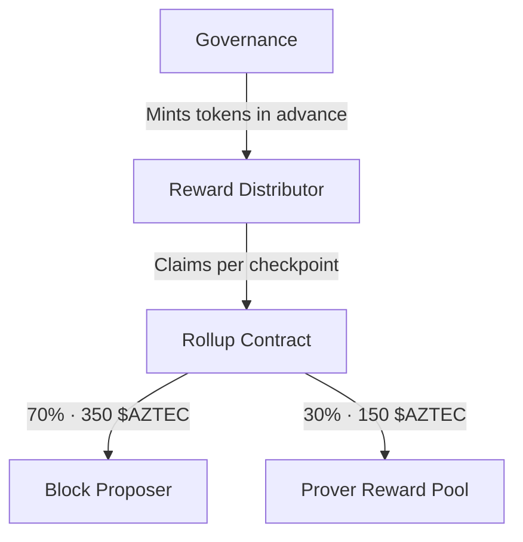

# Economics & Rewards

The Aztec network uses economic incentives to encourage honest participation and consistent operation. This page explains how rewards are distributed and what factors influence earnings.

## Reward sources

Network participants earn rewards from two sources:

1. **Checkpoint Rewards**: Protocol-funded rewards accruing for each proven checkpoint
2. **Transaction Fees**: Fees paid by users for transaction processing

## Checkpoint rewards

Tokens are minted in advance to the RewardDistributor contract. The Rollup contract then claims from the RewardDistributor and distributes them as checkpoint rewards: these are not net new inflation, but they are net new circulating tokens. The current checkpoint reward is **500 $AZTEC** per proven checkpoint, split between sequencers and provers:

| Recipient | Share | Amount per checkpoint |
|-----------|-------|-----------------------|
| **Sequencers** | 70% | 350 $AZTEC |
| **Provers** | 30% | 150 $AZTEC |

:::note Live values
These values are read from the mainnet Rollup contract (`getCheckpointReward()` and `getRewardConfig()`) and can be adjusted through governance.
:::

### How checkpoint rewards flow



## Sequencer rewards

Sequencers earn rewards for successfully proposing and finalizing blocks:

- **Checkpoint share**: 70% of each checkpoint reward (350 $AZTEC) goes to the block proposer, paid when the block is finalized on L1
- **Transaction fees**: Sequencers collect fees from users; a portion (the congestion cost) is burned, and 70% of the remainder is awarded to the sequencer

## Prover rewards

Provers earn rewards for generating validity proofs that finalize blocks:

- **Checkpoint share**: 30% of each checkpoint reward (150 $AZTEC), distributed among provers who participated in the epoch
- **Transaction fees**: Provers receive 30% of the unburnt transaction fees

### Activity score and reward distribution

Prover checkpoint rewards are not split equally. They are distributed based on each prover's **activity score**, which measures consistency of participation. The score:

- **Increases** by 101,400 per epoch of active proving
- **Decreases** by 100,000 per epoch of inactivity
- **Maximum**: 367,500 points

A prover's share of the reward pool is determined by a quadratic penalty formula:

```
shares = k - (a × (maxScore - score)²) / 1e10
```

Where `k = 1,000,000`, `a = 250,000`, and the minimum share is `10,000`.

At or above the maximum activity score, a prover receives the full `k` shares, and shares never drop below the minimum. As the score drops, the quadratic term reduces shares increasingly aggressively, meaning small drops have minimal impact but extended inactivity significantly reduces earnings.

:::note Live values
These constants were set by [AZIP-5](https://github.com/AztecProtocol/governance/pull/14) and are read from the mainnet RewardBooster contract (`getConfig()`). They can change through governance.
:::

This design rewards long-term, consistent provers and discourages sporadic participation.

---

:::tip Learn More
- [Staking Tokens](/participate/token/staking) - How to stake and earn rewards
- [Governance](/participate/governance) - How protocol parameters (including rewards) can change
- [Running a Prover](/operate/operators/setup/running_a_prover) - Technical setup for provers
:::
