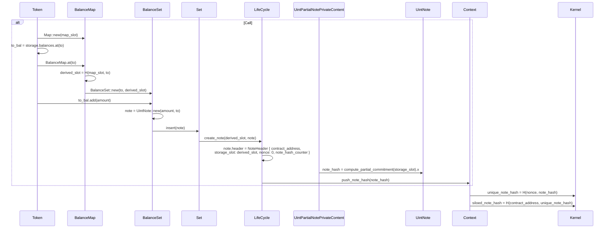

## Public State Slots

As mentioned in [State Model](../../storage/state_model.md), Aztec public state behaves similarly to public state on Ethereum from the point of view of the developer. Behind the scenes however, the storage is managed differently. As mentioned, public state has just one large sparse tree in Aztec - so we silo slots of public data by hashing it together with its contract address.

The mental model is that we have a key-value store, where the siloed slot is the key, and the value is the data stored in that slot. You can think of the `real_storage_slot` identifying its position in the tree, and the `logical_storage_slot` identifying the position in the contract storage.

```rust
real_storage_slot = H(contract_address, logical_storage_slot)
```

The siloing is performed by the [Kernel circuits](../circuits/kernels/private_kernel.md).

For structs and arrays, we are logically using a similar storage slot computation to ethereum, e.g., as a struct with 3 fields would be stored in 3 consecutive slots. However, because the "actual" storage slot is computed as a hash of the contract address and the logical storage slot, the actual storage slot is not consecutive.

## Private State Slots

Private storage is a different beast. As you might remember from [Hybrid State Model](../../storage/state_model.md), private state is stored in encrypted logs and the corresponding private state commitments in append-only tree, called the note hash tree where each leaf is a commitment. Append-only means that leaves are never updated or deleted; instead a nullifier is emitted to signify that some note is no longer valid. A major reason we used this tree, is that updates at a specific storage slot would leak information in the context of private state, even if the value is encrypted. That is not good privacy.

Following this, the storage slot as we know it doesn't really exist. The leaves of the note hashes tree are just commitments to content (think of it as a hash of its content).

Nevertheless, the concept of a storage slot is very useful when writing applications, since it allows us to reason about distinct and disjoint pieces of data. For example we can say that the balance of an account is stored in a specific slot and that the balance of another account is stored in another slot with the total supply stored in some third slot. By making sure that these slots are disjoint, we can be sure that the balances are not mixed up and that someone cannot use the total supply as their balance.

### Implementation

If we include the storage slot, as part of the note whose commitment is stored in the note hashes tree, we can _logically link_ all the notes that make up the storage slot. For the case of a balance, we can say that the balance is the sum of all the notes that have the same storage slot - in the same way that your physical wallet balance is the sum of all the physical notes in your wallet.

Similarly to how we siloed the public storage slots, we can silo our private storage by hashing the packed note together with the logical storage slot.

```rust
note_hash = H([...packed_note, logical_storage_slot]);
```

Note hash siloing is done in the application circuit, since it is not necessary for security of the network (but only the application).
:::info
The private variable wrappers `PrivateSet` and `PrivateMutable` in Aztec.nr include the `logical_storage_slot` in the commitments they compute, to make it easier for developers to write contracts without having to think about how to correctly handle storage slots.
:::

When reading the values for these notes, the application circuit can then constrain the values to only read notes with a specific logical storage slot.

To ensure that contracts can only modify their own logical storage, we do a second siloing by hashing the `commitment` with the contract address.

```rust
siloed_note_hash = H(contract_address, note_hash);
```

By doing this address-siloing at the kernel circuit we _force_ the inserted commitments to include and not lie about the `contract_address`.

:::info
To ensure that nullifiers don't collide across contracts we also force this contract siloing at the kernel level.
:::

## Example

In this section we will go into more detail and walk through an entire example of how storage slots are computed for private state to improve our storage slot intuition. Recall, that storage slots in the private domain is just a logical construct, and are not "actually" used for lookups, but rather just as a value to constrain against.

For the case of the example, we will look at what is inserted into the note hashes tree when adding a note in the Token contract. Specifically, we are looking at the last part of the `transfer` function:

#include_code increase_private_balance noir-projects/noir-contracts/contracts/app/token_contract/src/main.nr rust

This function is creating a new note and inserting it into the balance set of the recipient `to`. Recall that to ensure privacy, only the note hash is really inserted into the note hashes tree. To share the contents of the note with `to` the contract can emit an encrypted log (which this one does), or it can require an out-of-band data transfer sharing the information. Below, we will walk through the steps of how the note hash is computed and inserted into the tree. For this, we don't care about the encrypted log, so we are going to ignore that part of the function call for now.

Outlining it in more detail below as a sequence diagram, we can see how the calls make their way down the stack.
In the end a siloed note hash is computed in the kernel.

:::info
Some of the syntax below is a little butchered to make it easier to follow variables without the full code.
:::



Notice the `siloed_note_hash` at the very end. It's a hash that will be inserted into the note hashes tree. To clarify what this really is, we "unroll" the values to their simplest components. This gives us a better idea around what is actually inserted into the tree.

```rust
siloed_note_hash = H(contract_address, unique_note_hash)
siloed_note_hash = H(contract_address, H(nonce, note_hash))
siloed_note_hash = H(contract_address, H(H(tx_hash, note_index_in_tx), note_hash))
siloed_note_hash = H(contract_address, H(H(tx_hash, note_index_in_tx), MSM([G_amt, G_to, G_rand, G_slot], [amount, to, randomness, derived_slot]).x))
```

MSM is a multi scalar multiplication on a grumpkin curve and G\_\* values are generators.

And `to` is the actor who receives the note, `amount` of the note and `randomness` is the randomness used to make the note hiding. Without the `randomness` the note could just as well be plaintext (computational cost of a preimage attack would be trivial in such a case).

:::info
Beware that this hash computation is what the aztec.nr library is doing, and not strictly required by the network (only the kernel computation is).
:::

With this note structure, the contract can require that only notes sitting at specific storage slots can be used by specific operations, e.g., if transferring funds from `from` to `to`, the notes to destroy should be linked to `H(map_slot, from)` and the new notes (except the change-note) should be linked to `H(map_slot, to)`.

That way, we can have logical storage slots, without them really existing. This means that knowing the storage slot for a note is not enough to actually figure out what is in there (whereas it would be for looking up public state).
