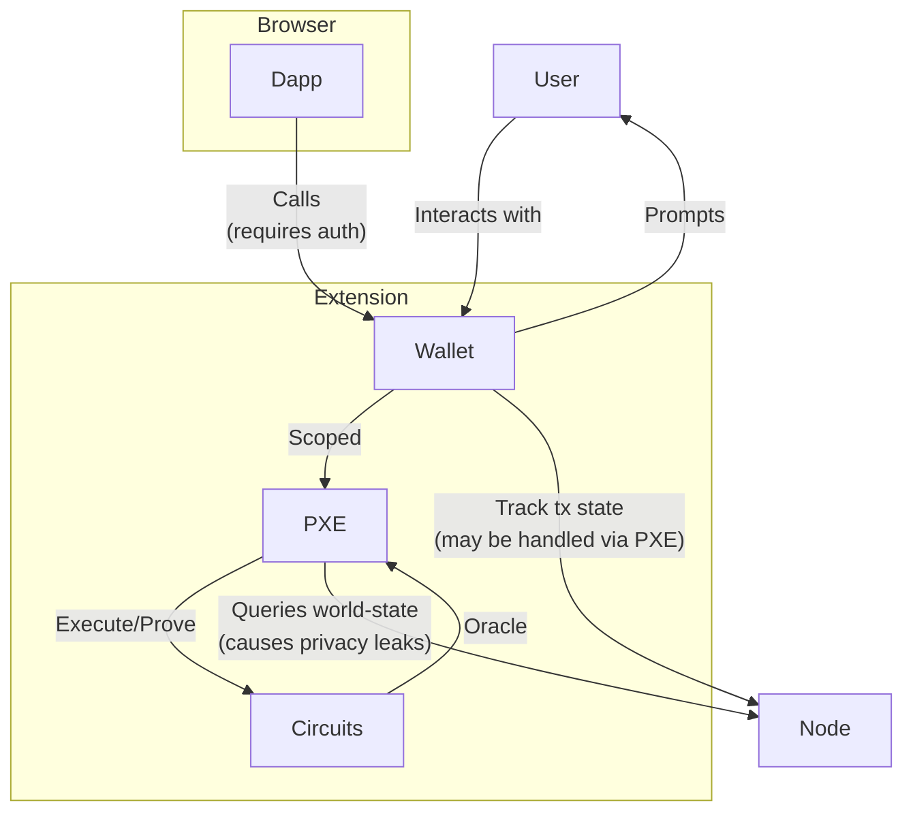

import Image from "@theme/IdealImage";

This page describes the Private Execution Environment (PXE), a client-side library for the execution of private operations.

The Private Execution Environment (or PXE, pronounced 'pixie') is a client-side library for the execution of private operations. It is a TypeScript library that can be run within Node.js, inside wallet software or a browser.

The PXE is a client-side interface of the PXE Service, which is a set of server-side APIs for interacting with the network. The PXE generates proofs of private function execution, and sends these proofs along with public function requests to the sequencer. Private inputs never leave the client-side PXE.

The PXE is responsible for:

- storing secrets (e.g. encryption keys, notes, tagging secrets for note discovery) and exposing an interface for safely accessing them
- orchestrating private function (circuit) execution and proof generation, including implementing [oracles](../../smart_contracts/oracles/index.md) needed for transaction execution
- syncing relevant network state, obtained from an Aztec node
- safely handling multiple accounts with siloed data and permissions

One PXE can handle data and secrets for multiple accounts.

## System architecture

## Components

### Transaction execution

An application will prompt the users PXE to execute a transaction (e.g. execute X function, with Y arguments, from Z account). The application or the wallet may handle gas estimation.

The ACIR (Abstract Circuit Intermediate Representation) simulator handles the execution of smart contract functions by simulating transactions. It generates the required data and inputs for these functions. You can find more details about how it works [here](./acir_simulator.md).

After simulation, the wallet calls `proveTx` on the PXE with all of the data generated during simulation and any authentication witnesses (for allowing contracts to act on behalf of the users' account contract).

Once proven, the wallet sends the transaction to the network and send the transaction hash back to the application.

### Database

The database stores transactional data and notes within the user's PXE.

The database stores various types of data, including:

- **Notes**: Encrypted representations of assets.
- **Deferred Notes**: Notes that are intended for a user but cannot yet be decoded due to the associated contract not being present in the database. When new contracts are deployed, there may be some time before it is accessible from the PXE database. When the PXE database is updated, deferred note are decoded.
- **Authentication Witnesses**: Data used to approve others for executing transactions on your behalf.
- **Capsules**: External data or data injected into the system via [oracles](#oracles).
- **Address Book**: A list of expected addresses that a PXE may encrypt notes for, or received encrypted notes from. This list helps the PXE reduce the amount of work required to find notes relevant to it's registered accounts.

### Note discovery

Note discovery helps solve the problem of a user discover which encrypted notes being created on-chain are for them.

There is a note tagging scheme that allows users to register an expected note sender in their PXE, which tells the PXE to expect notes coming from that expected sender. This helps the PXE more efficiently discover the encrypted notes being created for it's registered accounts.

If communication between transacting parties is not possible before transacting, users can still use a brute force method of trial decrypting all created notes in order to determine which notes are intended for them.

### Authorization

The PXE handles access rights by action, domain, contract and account.

For example, uniswap.com (**domain**) can query (**action**, involves execution that has access to private state) on these five token contracts (which **contracts**) for these two accounts (the notes loaded are scoped by either of these **accounts**) of mine.

Available actions include:

- Seeing that the accounts exist in the PXE
- Running queries, simulations, accessing logs, registering contracts, etc at a given a contract address
- Manually adding notes

Providing an application with no scopes to the PXE means that no information can be accessed.

### Contract management

Applications can add contract code required for a user to interact with the application to the users PXE. The PXE will check whether the required contracts have already been registered in users PXE. There are no getters to check whether the contract has been registered, as this could leak privacy (e.g. a dapp could check whether specific contracts have been registered in a users PXE and infer information about their interaction history).

### Keystore

The keystore is a secure storage for private and public keys.

### Oracles

Oracles are pieces of data that are injected into a smart contract function from the client side. You can read more about why and how they work in the [smart contracts section](../../smart_contracts/oracles/index.md).

## For developers

To learn how to develop on top of the PXE, refer to these guides:

- [Run more than one PXE on your local machine](../../../guides/developer_guides/local_env/run_more_than_one_pxe_sandbox.md)
- [Use in-built oracles including oracles for arbitrary data](../../../guides/developer_guides/smart_contracts/writing_contracts/how_to_pop_capsules.md)
