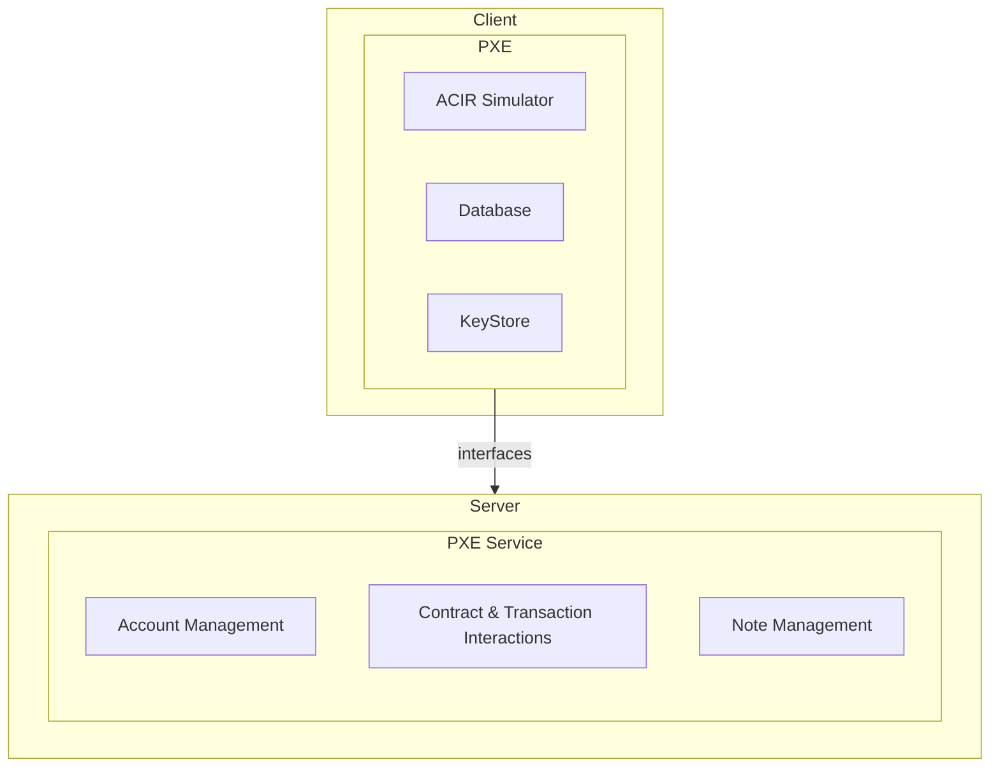

The Private Execution Environment (or PXE, pronounced 'pixie') is a client-side library for the execution of private operations. It is a TypeScript library and can be run within Node, such as when you run the sandbox, within the browser, or any other environment in which TypeScript can run. For example, in future it could be run inside wallet software.

The PXE generates proofs of private function execution, and sends these proofs along with public function requests to the sequencer. Private inputs never leave the client-side PXE.

## PXE Service 

The PXE is a client-side interface of the PXE Service, which is a set of server-side APIs for interacting with the network. It provides functions for account management, contract and transaction interactions, note management, and more. For a more extensive list of operations, refer to the [PXE reference](../../apis/pxe/index.md).

## Components

### ACIR simulator

### Database

### Note discovery

### Key store

## Oracles

