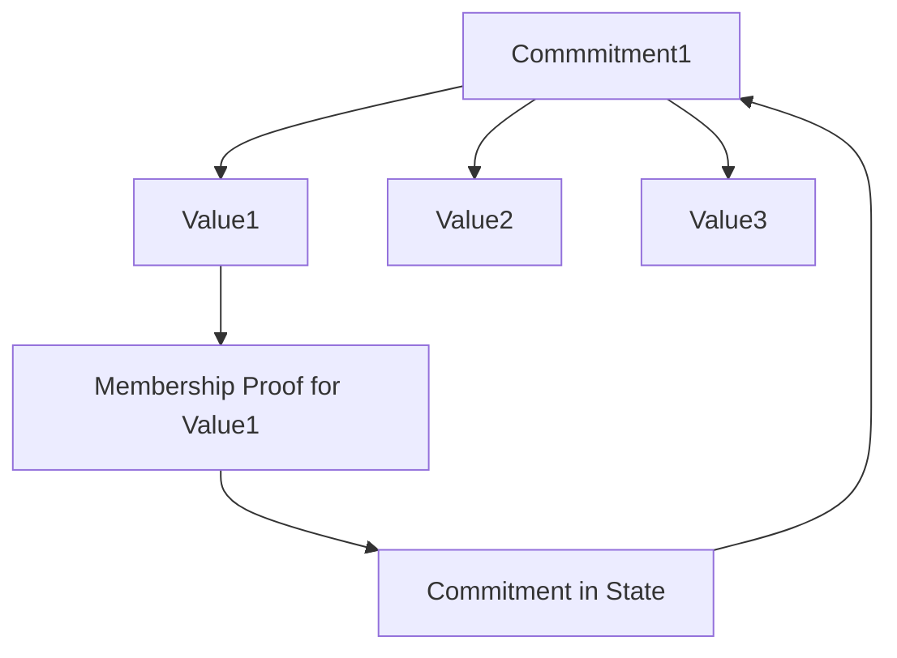
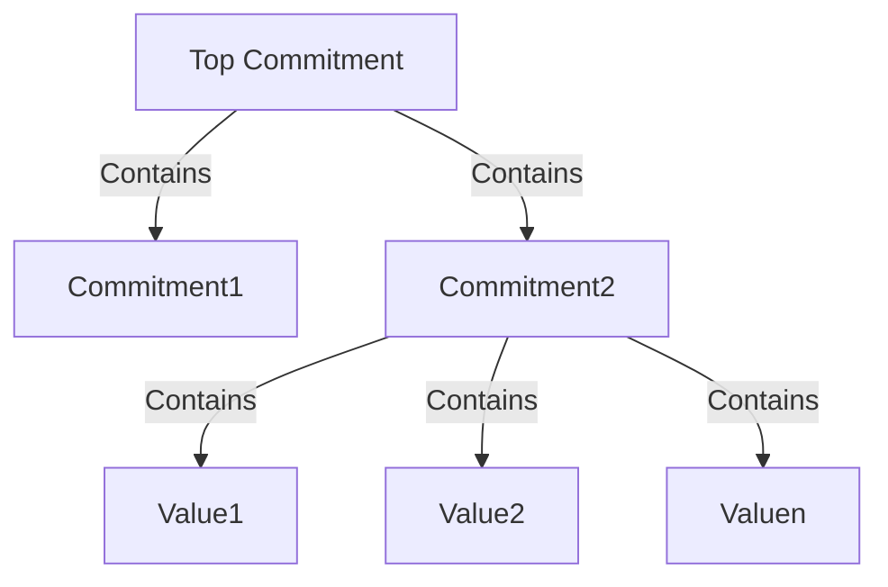
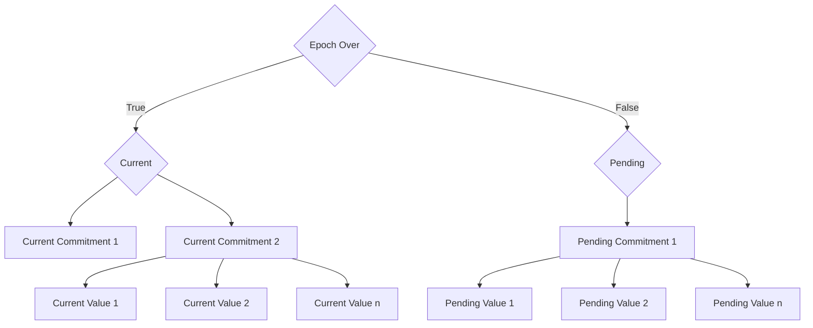

In Aztec, private and public execution environments are completely separate and operate with distinct state management. It is not possible for private functions to reliably access the most recent public data public state - only sequencers can do that.

But, what about historical public data (or public data that changes infrequently)? Through a **slow updates tree**, private functions can access historical public state. Please note that we are still experimenting with this feature.

On this page you will learn:

1. Why a slow updates tree exists & use cases
2. How it works
3. How it can be used to access historical public data
4. Limitations

## The need for a slow updates tree

This structure was created specifically to privately & publicly access historical public data. It should be used to store public data that doesn't change often.

- Access historical public data from a private function
- Access historical public data from a public function
- Update public data (that does not need updated often) from public and private functions 

This data structure is ideal for these use cases:

- Address Registry: Enabling contracts to interact with other contracts more easily requires address storage accessible in both public and private executions. This can be particularly helpful in things such as proxy contracts.
- Access Control: Managing privileges in contracts, such as a token contract owner’s ability to mint new tokens, is streamlined when control information is shared between public and private executions. This might include things like blacklists and whitelists.

## How it works

We developed the Slow Updates Tree to help balance public and private execution in a blockchain context. Earlier systems typically used either fully public or entirely private state trees.

**First iteration: Shared State Tree** 

Using a shared state tree, it is possible to privately access historical public data by providing a membership proof to show that a value is indeed part of a commitment, and then check that the commitment matches the one stored in the state, as shown below.

Note: a *commitment* refers to a cryptographic assurance that a specific set of data is included in the tree. In the current design, we are using Merkle trees to commit to the values.

However, these would be contract-specific trees, so we will be leaking the contract address of the contract doing a lookup. 

**Second iteration: Multi-level Shared State Tree**

This privacy issue can be solved by organizing data into layers, with each contract having its own commitment within a larger tree. Only the top-level commitment is revealed.

However, this means that any canges in any contract's data will change the top-level commitment and invalidate the proofs for all other contracts.

**Third iteration: Slow Updates Tree**

To solve this, the Slow Updates Tree is a dual-tree structure - a current tree and a pending tree. Any updates are added to the pending tree, which then becomes the current tree at the end of an epoch. The pending tree is replicated from the current tree, and the cycle begins again.

This way, we can ensure that the values are stable throughout the epoch, and that the membership proofs are not invalidated by changes in other contracts more than once every epoch.

## Reads and Writes

### Accessing Data

*From public state:* Accessed directly from the state
*From private state:* Performs a membership proof for the values in the tree, ensuring that they are part of the commitment.

### Updating Data

Updates are made to the pending tree. Then at the end of each epoch, the updates in the pending tree are committed and it becomes the current tree.

## Limitations

### Delayed State Finality

Updates in the Slow Updates Tree are only finalized at the end of an epoch.

Developers are used to instant state updates, so the Slow Updates Tree might take some getting used to. But we believe this won't take long!

## Dive into the code

For a code walkthrough of how a token blacklist contract can use a slow updates tree, read [this](../../../../dev_docs/contracts/syntax/slow_updates_tree.md).