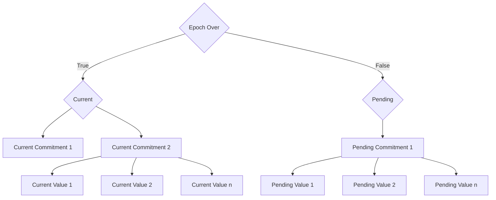

n Aztec, private and public execution environments are completely separate and operate with distinct state management. In the previous section we learned that functions can call private functions, and public functions can save messages to a merkle tree to then be read by a private function.

It is also possible to access persistent data across both private and public state using a **slow updates tree**, which we will talk about on this page. Please note that we are still experimenting with this feature and it is not something that has ever been achieved before.

On this page you will learn:

1. Why a slow updates tree exists & use cases
2. How it works
3. How it can be used to access data in public & private domains
4. Limitations

## The need for a slow updates tree

This structure was created specifically to privately & publicly access data that is not updated often. It should be used to store data that is non-sensitive yet crucial for private smart contracts to access. Using a slow updates tree, it is possible to:

- Update public data from public and private functions
- Access public data from a public function
- Access public data from a private function _without revealing which contract we're executing_

This data structure is ideal for these use cases:

- Address Registry: Enabling contracts to interact with other contracts more easily requires address storage accessible in both public and private executions. This can be particularly helpful in things such as proxy contracts.
- Access Control: Managing privileges in contracts, such as a token contract owner’s ability to mint new tokens, is streamlined when control information is shared between public and private executions. This might include things like blacklists and whitelists.

## How it works

We developed the Slow Update Tree in response to help balance public and private execution in a blockchain context.

Earlier systems typically used either fully public or entirely private state trees, which led to privacy leaks if reading public data from private state.

Using a shared state tree, it is possible to privately access public data by providing a membership proof to show that a value is indeed part of a commitment, and then check that the commitment matches the one stored in the state, as shown below.

However this means that any changes to the commitment will invalidate our membership proof, and make our read fail.

To solve this, the Slow Update Tree is a dual-tree structure - using a current and pending tree - that updates at the end of an epoch. This way, we can ensure that the values are stable throughout the epoch, and that the membership proofs are not invalidated by changes in other contracts more than once every epoch.

### Dual Tree Structure

The Slow Update Tree operates on a dual-tree mechanism - a _current_ tree and a _pending_ tree. These trees manage the state data that needs to be shared between public and private executions.

This _slow update_ mechanism minimizes the invalidation of reads and writes due to concurrent updates.

### Epoch-Based Updates

The current tree is replaced with the pending tree at the end of each epoch. Then a new pending tree is created, the epoch restarts, and the cycle begins again.

### Accessing Data

*From public state* Directly from the state
*From private state:* Performs a membership proof for the values in the tree, ensuring that they are part of the commitment.

### Updating Values

Updates are made to the pending tree. Then at the end of each epoch, the updates in the pending tree are committed and it becomes the current tree.

## Limitations

### Delayed State Finality

Updates in the Slow Update Tree are only finalized at the end of an epoch.

This could potentially lead to delays in state changes - for example an address may be added to a blacklist but this will not be reflected in the state until the end of the current epoch.

### Complexity in State Management

Developers are used to instant state updates, so the Slow Update Tree might take some getting used to. This should not be too much of an issue. 