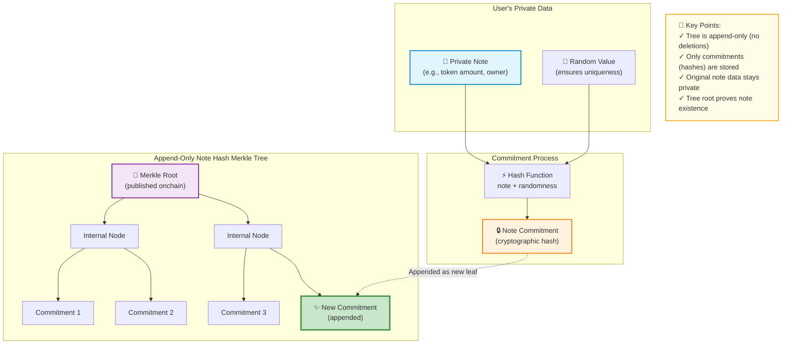

import Image from "@theme/IdealImage";

Welcome! In this lesson, we're going to explore one of Aztec's most important concepts: how private state actually works. Don't worry if this seems complex at first - we'll build your understanding step by step. By the end, you'll understand notes, commitments, nullifiers, and how Aztec's state trees keep everything secure and private.

## What you’ll learn

- What a note is and why we use them
- How notes relate to UTXOs (cash-like state)
- What a commitment is and why it preserves privacy
- What a nullifier is and how it prevents double spending
- The five state Merkle trees in Aztec and their roles

## Prerequisites

- You’ve seen account-based blockchains (like Ethereum).
- You’ve heard of Merkle trees at a high level.

For deeper technical references, see:

- [State model](../../developers/docs/concepts/storage/state_model)
- [Notes](../../developers/docs/concepts/storage/notes)

## Public and Private State

Aztec has _two_ types of state: public and private state. This enables **programmable privacy** so you can build applications with selective transparency to keep sensitive data private while maintaining public verifiability where needed.

These two types of state are managed by **two different state models**

### Public state: Account based

**Public state** can be directly updated and read by everyone. It works similarly to state on Ethereum. It is transparent. On Aztec, this public state is managed by smart contracts and stored and updated by the sequencers using an account-based model.

Whenever data, for example, an accounts balance, is stored, a `key: value` pair is created. For example:

```
0x123...abc_balance: 1
```

When the data is modified, the `value` corresponding to the `key` is updated. Account state is updated directly when transactions are executed. It can then be read by anyone.

This is how **public state** works on Aztec. This public data, which follows this account model, is stored in a **public state Merkle tree**, one of Aztec's 5 Merkle trees!

### Private state: UTXO based

Now, **private state** works differently, and there's a really good reason for this! Let's explore why. Imagine we're still using an account-based model, but now we encrypt the data:

```
0x$$$_$$$_balance: $
```

When we send a transaction, it will modify this specific slot directly. So, even if the key and value themselves are encrypted, the data location is leaked. Using correlation techniques, this would expose information about the contract and variable being updated and break the privacy assumption.

Therefore, we use a different model that breaks the link between the user and their balance. This means balances can be updated while keeping the account and their associated data separate and private.

Enter UTXO-based private state using **notes**! We'll dive deep into what notes are shortly. For now, just think of them as a sealed envelope that contains data (like a balance) sealed inside, and only you have the key to open it.

You might remember UTXO-based state models from our previous lesson, but let's do a quick recap to refresh your memory.

Think of the UTXO model like physical cash. When you have cash in your wallet, you don't have "a balance", you have individual bills: a \$20 bill, two \$10 bills, and some $5 bills.

**Cash:**

```
Alice has a $20 bill and a $10 bill (total: $30).
She wants to pay Bob $25.
Alice gives Bob both bills ($30 total)
Bob gives Alice back a $5 bill as change.
Result: Bob has $25, Alice has $5.
```

**UTXO Transaction:**

```
Alice has a 20-token note and a 10-token note (total: 30 tokens).
She wants to pay Bob 25 tokens.
Alice consumes (this is called nullifying) both her existing notes and creates two new notes: a 25-token note for Bob and a 5-token note for herself as change.
Result: Bob has a 25-token note, Alice has a 5-token note.
```

Only the people involved in the transaction know their respective amounts and identities (Alice knows how much she sent to Bob and her remaining balance and Bob only knows that he received 25 tokens _not_ Alice's remaining balance). Everyone else just sees "some transaction happened" without knowing who, what, or how much. There's no "Alice has 30 tokens" stored anywhere, only individual hashed notes that _only she can knows the preimage for_. Each note is committed to (hashed) and stored separately, rather than the balance being stored in a single note. This allows the connection between a user and their total balance to be broken.

But what actually is a note? Great question! Let's dive in.

<Image img={require("@site/static/img/public-and-private-state-diagram.png")} />

## Notes

Here's where things get interesting! A note is a piece of private data that can optionally be encrypted and shared with other users. Think of notes as the fundamental building blocks of private state - they're what make privacy possible on Aztec.

When you create a note, it gets hashed to create a commitment which is then stored in a Merkle tree. The note itself may be posted onchain to make the data easily retrievable by its intended owner, but this isn't required - you can also share notes directly offchain!

Think of a note as an envelope or sealed box that contains tokens inside, and only the note owner has the key to open:

- Ownership: Only the owner with the key (called the nullification key) can spend the note.
- Location: In order to maintain privacy, notes aren't tied to a fixed storage slot like an Ethereum account balance. Instead they are appended to the note hash Merkle tree.
- UTXO-like: To "spend" or "update", you consume old notes and create new ones.

But what actually is a note in code? Don't worry - it's simpler than you might think! A note is just a `struct` (a data structure) written in Noir, along with some methods that specify how to handle the note. Let's look at an example:

```rust
#[note]
pub struct ValueNote {
    value: Field,
    owner: AztecAddress,
    randomness: Field,
}
```

Pretty straightforward, right? This simple structure contains everything needed for a private token: the amount (value), who owns it (owner), and some randomness to keep it private.

## Commitments

Now, here's an important detail about how notes work: raw notes are never stored directly onchain. Instead, we store a **commitment** to the note.

Think of a commitment like a sealed envelope with a unique stamp. A commitment is just a **hash** of the note content plus some randomness. This randomness is crucial - it ensures that observers can't link the commitment back to the original note or brute-force guess what's inside. It's like adding a secret ingredient to your recipe that makes it impossible for others to reverse-engineer!

Note commitments are stored in an _append-only_ **Note hash Merkle tree** (one of Aztec's 5 Merkle trees). To spend a note, the owner proves knowledge of the note by providing the associated commitment's "preimage".

Let's visualize how a private note becomes a commitment in Aztec's append-only tree:



Commitments have **two key properties**:

- **Hiding**: The commitment reveals nothing about the note contents or owner.
- **Binding**: The data (the note) cannot be modified once it has been committed to.

Note commitments let users prove note ownership, and the protocol check that a note exists without revealing its data.

## Nullifiers

Now you might be wondering: "If notes are private, how do we prevent someone from spending the same note twice?" Excellent question! This is where nullifiers come in.

To prevent double-spends, we need a public record saying "this specific note has been used" without revealing which note it was or who spent it. That's exactly what a nullifier does:

- A nullifier is a unique value derived from the note and the owner's secrets
- It's cleverly designed so outsiders can't link it back to a specific commitment (maintaining privacy!)
- Nullifiers live in one of Aztec's five state trees: **the Nullifier Tree**
- No transaction can emit a nullifier that already exists in the tree - this is enforced by the protocol

Think of it this way: commitments say "a note was created somewhere by someone", and nullifiers say "a note was consumed once—and only once". Together, they create a complete system of private, double-spend-proof transactions!

## Summary

**Public data** is stored in a Merkle tree using an **account-based model** with key-value pairs, in the same way that Ethereum manages state.

**Private data** is stored in a **note**, which is a UTXO-like envelope that contains the private data. These notes are hashed to produce a **commitment** and stored in an **append-only** note hash Merkle tree.

To "spend" a note, the user must prove that they know the **preimage** to the commitment without revealing it (this is done using zero-knowledge proofs, which will be explained in the next lesson). Then, a **nullifier** is created and stored in the nullifier Merkle tree to mark it as used.

## Five State Trees

Let's talk about how Aztec organizes all this data. Aztec uses five specialized Merkle trees, each with a specific purpose:

1. **Note hash Merkle tree**: Holds commitments (hashes) of private notes. It's append-only and used for membership proofs when you're spending a note.
2. **Nullifier tree**: Holds nullifiers (those unique "spent" markers we just learned about) to prevent anyone from reusing the same note.
3. **Public data tree**: Holds public contract storage (keyed by contract and slot, like `contract_address: slot_1`). It's transparent just like traditional blockchains.
4. **L1-to-L2 Message tree**: Holds messages sent from Ethereum L1 to Aztec L2, enabling cross-chain communication.
5. **Archive Tree**: Tracks historical state roots, enabling proofs against past states (e.g., "as of block N, this was true").

:::note
Why append‑only for private data?
Updating a specific slot would leak that "something changed here". Append‑only commits avoid that leak. Nullifiers carry the "delete" semantics without linking to a specific note.
:::

## Check your understanding

- Which structure holds private notes?
  Answer: The note hash Merkle tree stores commitments to notes.

- What prevents a note from being spent twice?
  Answer: A nullifier is emitted when a note is spent to mark is as "used". The nullifier Merkle tree stores the used nullifiers.

- Why not update a private value in a fixed slot?
  Answer: Slot updates leak that a specific value changed. Append-only commitments avoid this.

## More Information

If you'd like to learn about notes in more depth:

- Concept deep dive on notes: [Notes](../../developers/docs/concepts/storage/notes)
- Hybrid state model details: [State model](../../developers/docs/concepts/storage/state_model)
- How users receive notes (discovery): [Note discovery](../../developers/docs/concepts/advanced/storage/note_discovery)
