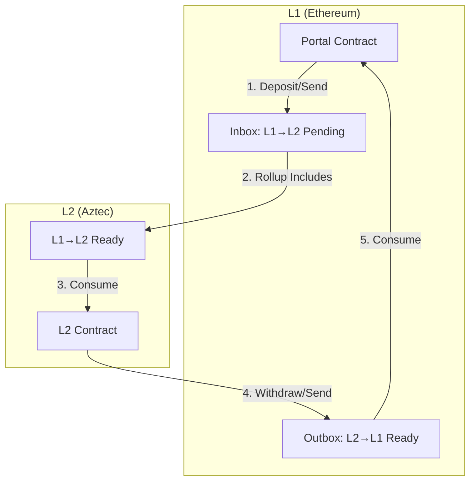

Aztec's portal contracts enable seamless communication between Ethereum (L1) and the Aztec network (L2). Aztec's privacy-first architecture requires a unique approach to cross-chain messaging. Let's explore how portals work and how messages flow between the two layers.

## What are Portals?

A **portal** is the L1 component of a cross-chain application that bridges communication between Ethereum and Aztec. Think of it as an embassy on Ethereum that represents and communicates with your Aztec contract.

Every portal contract on L1 specifies which L2 contract it communicates with. When consuming L2 to L1 messages, the Outbox (protocol) contract automatically enforces that only the designated portal address can consume messages intended for it, preventing unauthorized message consumption. Portal developers must store their paired L2 contract address and use it when constructing messages.

Common uses for portals include:

- **Token bridges** - Moving assets between L1 and L2
- **Oracle systems** - Bringing offchain data to Aztec
- **Governance bridges** - Coordinating cross-chain DAOs
- **DeFi integrations** - Connecting Aztec privacy to L1 or other L2 liquidity

## Why Portals are Necessary

You might be wondering: why can't Aztec contracts just call Ethereum contracts directly? The answer lies in how Aztec achieves privacy.

In traditional L2s, transactions execute synchronously with L1 state. But in Aztec:

1. **Private functions execute locally** - Users generate proofs on their own devices using historical data
2. **Public functions execute on the sequencer** - Only the sequencer knows the current state
3. **Transactions prove validity against the past** - Kernel proofs are built on state roots from previous blocks

This means direct synchronous calls would either:

- **Break privacy** - by exposing private inputs as L1 calldata
- **Break correctness** - by executing against stale state

Portals solve this by using **asynchronous message passing**. Instead of direct calls, contracts send messages that are consumed later, maintaining both privacy and correctness.

## The Message Flow Architecture

Cross-chain communication in Aztec uses two message boxes - one for each direction:



The key insight is that messages are **pulled** by the recipient rather than **pushed** by the sender. This pull-based model is crucial for privacy - it allows the message content to be a hash or commitment, keeping actual private inputs hidden.

### L1 to L2 Messages: Depositing to Aztec

Let's walk through what happens when you send a message from Ethereum to Aztec. We'll use a token deposit as our example.

#### Step 1: Create and Send the Message (L1)

On Ethereum, your portal contract prepares a message and sends it to Aztec's Inbox contract:

#include_code deposit_public l1-contracts/test/portals/TokenPortal.sol solidity

Here's what happens in the function logic:

1. **Lock funds** - The portal receives and locks your tokens on L1
2. **Create message content** - Encodes the recipient and amount
3. **Hash to field element** - Since Aztec uses ~254-bit field elements, larger messages are hashed
4. **Generate secret hash** - For private consumption, a secret is hashed to prevent frontrunning
5. **Send to Inbox** - The message is added to Aztec's pending message tree

The message structure includes:

- **Sender** - Your L1 portal contract address
- **Recipient** - The L2 contract address that will consume this message
- **Content hash** - The hashed mint instructions
- **Secret hash** - For private consumption (can be empty for public)

#### Step 2: Message Inclusion in Rollup

When the Aztec sequencer builds the next rollup block:

1. It fetches pending L1→L2 messages from the Inbox
2. It adds them to the L1→L2 message tree in the block
3. The rollup proof verifies that sender/recipient pairs exist in the contracts tree
4. Messages become available for consumption in the **next block** (there's a 1-block delay)

This delay exists because messages included in block N are added to the message tree, which gets committed as part of block N's state root. That message tree is then available as historical data in block N+1.

#### Step 3: Consume and Process (L2)

On Aztec, your L2 contract consumes the message and executes the intended action:

#include_code claim_public /noir-projects/noir-contracts/contracts/app/token_bridge_contract/src/main.nr rust

The consumption process:

1. **Recreate content hash** - Must match exactly what was sent from L1
2. **Provide the secret** - The preimage of the secret hash (proves you know it)
3. **Consume the message** - Creates a nullifier to prevent double-spending
4. **Execute logic** - Mint tokens, update state, etc.

The `context.consume_l1_to_l2_message()` function verifies:

- The content hash matches
- The secret hash matches
- The sender (L1 portal) is correct
- The message hasn't been consumed before

If verification fails, the transaction reverts. On success, a nullifier is added to prevent anyone from consuming the same message again.

### L2 to L1 Messages: Withdrawing to Ethereum

The return journey - sending messages from Aztec to Ethereum - works differently because L2 state transitions are proven on L1. This means we can add messages directly to the "ready" state.

#### Step 1: Emit Message (L2)

From your Aztec contract, you emit a message to L1:

#include_code exit_to_l1_public /noir-projects/noir-contracts/contracts/app/token_bridge_contract/src/main.nr rust

This function:

1. **Burns the tokens** - Removes them from L2 circulation
2. **Creates message content** - Encodes the withdrawal details
3. **Calls message_portal** - Adds the message to the kernel's output

The message includes the amount, recipient address, and optionally a "designated caller" - an address that must execute the withdrawal (or address(0) for anyone).

#### Step 2: Message Availability (L2→L1)

When the sequencer processes your transaction:

1. The kernel circuit validates your message
2. It verifies the sender/recipient pair exists in the contracts tree
3. The message is included in the rollup's public inputs
4. When the rollup is proven on L1, messages become available in the Outbox

There's no "pending" state for L2→L1 messages - they go straight to "ready" because the L1 state transition that makes them available is the same transaction that proves the L2 state transition that created them.

#### Step 3: Consume and Execute (L1)

Finally, the message is consumed on Ethereum:

#include_code token_portal_withdraw /l1-contracts/test/portals/TokenPortal.sol solidity

The portal:

1. **Reconstructs the message** - Must match exactly what was sent from L2
2. **Provides merkle proof** - Proves the message exists in the rollup's message tree
3. **Consumes from Outbox** - Marks the message as consumed
4. **Executes the withdrawal** - Transfers tokens to the recipient

The merkle proof parameters (`_l2BlockNumber`, `_leafIndex`, `_path`) prove that your message exists in a finalized rollup block. You can get these using Aztec.js:

```typescript
import { computeL2ToL1MembershipWitness } from "@aztec/stdlib/messaging";

// Compute the message hash
const l2ToL1Message = await l1TokenPortalManager.getL2ToL1MessageLeaf(
  withdrawAmount,
  EthAddress.fromString(ownerEthAddress), // recipient on L1
  l2BridgeContract.address,
  EthAddress.ZERO // caller on L1 (0x0 if anyone can call)
);

// Get the merkle proof
const [leafIndex, siblingPath] = await computeL2ToL1MessageMembershipWitness(
  node,
  await node.getBlockNumber(),
  l2ToL1Message
);
```

## Privacy Considerations

One of Aztec's key innovations is enabling private cross-chain messages. Let's understand how this works.

### Public Messages

When you deposit publicly, everything is visible:

- The L1 transaction shows who deposited, how much, and to whom
- The L2 transaction shows who claimed and how much was minted
- The linkage between L1 and L2 actions is clear

This is fine for public use cases, but what about privacy?

### Private Messages with Secrets

For private deposits, Aztec uses a clever trick with **secret hashes**:

#include_code deposit_private l1-contracts/test/portals/TokenPortal.sol solidity

The secret hash serves two purposes:

1. **Prevents frontrunning** - Without knowing the secret, others can't consume your message
2. **Hides consumption timing** - The nullifier includes the secret, so observers can't tell when your message was consumed

On L1, everyone can see:

- A deposit was made
- The amount
- The destination L2 contract

But they **cannot** see:

- Who will claim it on L2 (the recipient is hashed into the content)
- When it will be claimed (the secret hides the nullifier)
- Who the new token owner will be

The recipient privately provides the secret when consuming the message on L2. The nullifier that's published is:

```
nullifier = hash(messageHash, messageIndex, secret)
```

Without knowing the secret, no one can link the nullifier back to the original L1 deposit. This breaks the link between the public deposit and the private mint!

## Security Model

### Message Verification

Every message is cryptographically verified at multiple levels:

1. **L1-to-L2 Message tree verification** - The rollup circuits check that sender/recipient pairs exist in the L1-to-L2 Message tree
2. **Content hash matching** - Consumers must recreate the exact content hash
3. **Nullifier uniqueness** - Each message can only be consumed once
4. **Merkle proof verification** - L2→L1 messages include proofs of inclusion

### Designed Callers

The "designated caller" pattern in withdrawals adds an extra security layer:

```solidity
bytes32 contentHash = Hash.sha256ToField(
    abi.encodeWithSignature(
        "withdraw(uint256,address,address)",
        amount,
        recipient,
        withCaller ? msg.sender : address(0)
    )
);
```

If `withCaller` is true, only the specified address can execute the withdrawal. This prevents:

- MEV extraction by front-runners
- Unwanted third-party interference
- Griefing attacks

If `withCaller` is false, anyone can execute (useful for allowing relayers to help users).

### Atomicity and Failure Handling

Since cross-chain calls are **asynchronous and unilateral**, you must handle failures explicitly:

- **Locking without minting** - Funds could be locked on L1 but never minted on L2
- **Burning without unlocking** - Tokens could be burned on L2 but never withdrawn on L1
- **Message expiry** - Messages could become invalid due to state changes

Best practices include:

- Implementing cancellation mechanisms for stuck messages
- Using time-locks for reclaiming failed transfers
- Testing failure scenarios thoroughly
- Providing clear user feedback about message status

## Message Boxes: The Technical Foundation

At the protocol level, Aztec uses **message boxes** as the primitive for cross-chain communication. These are append-only, multi-sets that store message commitments.

### L1→L2 Flow

1. **Pending** (L1) - Portal calls Inbox, message stored in L1 contract
2. **Rollup inclusion** - Sequencer reads pending messages, includes in block
3. **Ready** (L2) - Message added to L1→L2 message tree after 1 block delay
4. **Consumed** (L2) - Recipient creates nullifier, message deleted logically

### L2→L1 Flow

1. **Emission** (L2) - Contract calls `message_portal`, added to kernel output
2. **Ready** (L1) - Rollup proof includes message, stored in Outbox
3. **Consumed** (L1) - Portal provides proof, message marked as consumed

The asymmetry exists because:

- **L1→L2** needs a pending state (L1 contracts can't directly modify L2 trees)
- **L2→L1** skips pending (the rollup proof is the state transition that adds messages)

### Message Structure

Messages are designed to be compact (single field element when possible):

```solidity
struct L1ToL2Msg {
    L1Actor sender;      // Portal address + chainId
    L2Actor recipient;   // L2 contract + version
    bytes32 content;     // ~254 bits of data
    bytes32 secretHash;  // For private consumption
}

struct L2ToL1Msg {
    L2Actor sender;      // L2 contract + version
    L1Actor recipient;   // Portal address + chainId
    bytes32 content;     // ~254 bits of data
}
```

If your message data exceeds ~254 bits, hash it with `sha256ToField()` and emit the full content as an event or store it with the sender.

## Best Practices for Building with Portals

### 1. Structure Messages with Function Signatures

Always use function signatures to prevent message misinterpretation:

```solidity
// ❌ Ambiguous - could be interpreted different ways
bytes memory message = abi.encode(amount, recipient);

// ✅ Clear - includes function context
bytes memory message = abi.encodeWithSignature(
    "mint(uint256,address)",
    amount,
    recipient
);
```

### 2. Match Content Hashing on Both Sides

Your L1 and L2 contracts must hash content identically:

```solidity
// L1 Portal
bytes32 contentHash = Hash.sha256ToField(
    abi.encodeWithSignature("mint(uint256)", amount)
);
```

```rust
// L2 Contract
let content_hash = compute_sha256_to_field([amount.to_be_bytes()]);
```

Mismatches will cause consumption to fail silently.

### 3. Authorize Bridge Contracts

Don't forget to authorize your bridge contracts:

```typescript
// L2 bridge must be authorized to mint tokens
await token.methods.set_minter(bridgeContract.address, true).send().wait();
```

### 4. Handle the 1-Block Delay

When sending L1→L2 messages, remember the consumption delay:

```typescript
// Send message from L1
await portal.depositToAztecPublic(...);

// Wait for message to be included and available (2 blocks)
await sendDummyTransactions(pxe, 2);

// Now can consume on L2
await bridge.methods.claim_public(...).send().wait();
```

### 5. Provide Excellent UX for Async Messages

Since messages aren't instant:

- Show pending states in your UI
- Provide transaction tracking
- Allow users to query message status
- Implement notifications when messages are ready

## Real-World Example: Token Bridge

Let's see how all these concepts come together in a production token bridge. The full tutorial is available [here](../../developers/docs/tutorials/js_tutorials/token_bridge.md), but here's the essence:

**L1 Portal Contract** ([TokenPortal.sol](https://github.com/AztecProtocol/aztec-packages/blob/#include_aztec_version/l1-contracts/test/portals/TokenPortal.sol)):

- Locks ERC20 tokens
- Sends mint messages to L2
- Consumes burn messages from L2
- Unlocks tokens to recipients

**L2 Bridge Contract** ([main.nr](https://github.com/AztecProtocol/aztec-packages/blob/#include_aztec_version/noir-projects/noir-contracts/contracts/app/token_bridge_contract/src/main.nr)):

- Consumes mint messages from L1
- Mints corresponding L2 tokens
- Burns L2 tokens for withdrawals
- Sends unlock messages to L1

This architecture enables:

- **Private deposits** - Using secret hashes
- **Public deposits** - For transparent use cases
- **Private withdrawals** - Amounts visible, owners hidden
- **Public withdrawals** - Fully transparent

The token bridge pattern is reusable for any asset bridge, oracle, or cross-chain application.

## Next Steps

Now that you understand how portals enable cross-chain communication, you can:

- For a complete working example of deposits and withdrawals, see the [token bridge tutorial](../../developers/docs/tutorials/js_tutorials/token_bridge.md).
- Build your own token bridge following the [tutorial](../../developers/docs/tutorials/js_tutorials/token_bridge.md)
- Explore the [cross-chain messaging guide](../../developers/docs/guides/smart_contracts/how_to_communicate_cross_chain.md) for implementation details
- Study the [portal contracts source code](https://github.com/AztecProtocol/aztec-packages/tree/#include_aztec_version/l1-contracts/test/portals)
- Experiment with private cross-chain messages in your applications

Cross-chain communication is a powerful primitive - use it to bring Aztec's privacy to the broader Ethereum ecosystem!
