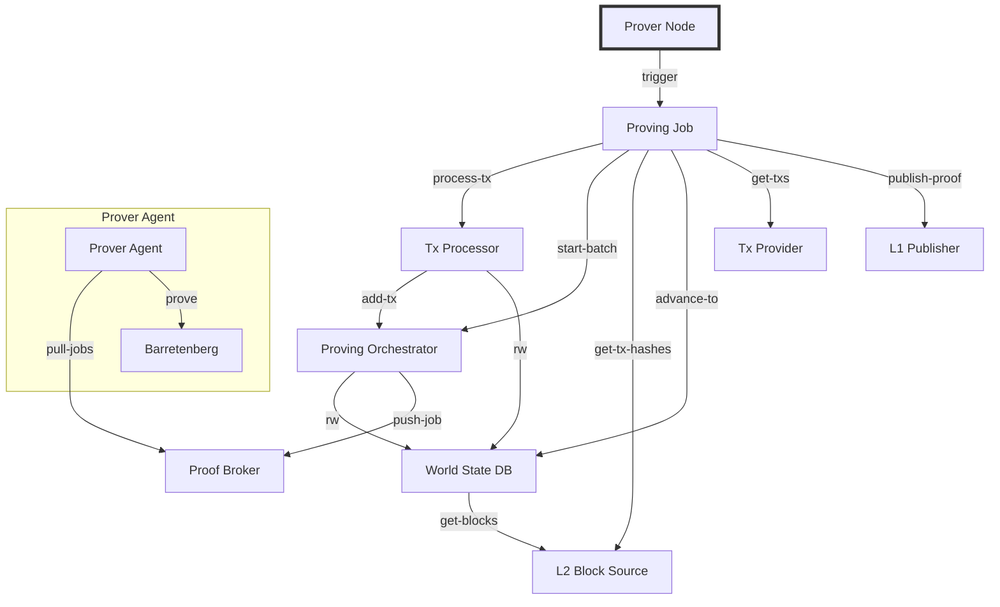

Prover nodes are core to the Aztec network. They orchestrate proving processes that verify every single public transaction and roll them up to a root proof that is then published to L1. Aztec utilizes advanced cryptography and mathematics to ensure security and privacy.

Running a prover means having deep understanding of blockchain technology, crypto economics, devops and hardware. It is an expensive endeavour that is often run by highly skilled engineers or teams.

## Prerequisites

Before following this guide, make sure you:

- Have the `aztec` tool [installed](../../../developers/getting_started.md#install-the-sandbox) and updated to the latest version
- Fully understand the [concepts](../../concepts/provers-and-sequencers/) on proving and sequencing
- Have sufficient hardware resources for proving operations
- Your confidence level is expected to be around "I'd be able to run a Prover _without_ this guide"

## Understanding Prover Architecture

Running an Aztec Prover node means that the client will automatically monitor L1 for unclaimed epochs and propose bids for proving them. The prover node watches the L1 to see when a bid they submitted has been accepted by a sequencer, and will then kick off an epoch proving job which performs the following tasks:

- Downloads the transaction hashes in the epoch and all L1 to L2 messages from L1
- Downloads the transaction objects with their ClientIVC proofs from a remote node (to be replaced by loading them from the P2P pool)
- Executes transactions in the epoch in order, generating proving jobs for each of them
- Generates the inputs for each circuit and kicks off individual proving jobs to prover agents, recursively proving until it gets to the root rollup proof
- Submits the root rollup proof to L1 to advance the proven chain



## Setting Up Your Prover Node

Thanks to the modular nature of the `aztec start` command, running a prover is fairly straightforward despite its complexity. You'll need to provide several key flags:

| Flag                                             | Description                                                                             |
| ------------------------------------------------ | --------------------------------------------------------------------------------------- |
| `--network <network>`                            | Selects the Docker image for the target network (e.g., `alpha-testnet`)                 |
| `--l1-rpc-urls <execution-node>`                 | The URL of your L1 execution node                                                       |
| `--archiver`                                     | Starts the archiver service to store synced data                                        |
| `--prover-node`                                  | The node that connects to both networks to fetch jobs and transactions                  |
| `--prover-broker`                                | Talks with the node and the prover agents to assign jobs                                |
| `--prover-agent`                                 | The actual prover that will fetch jobs from the broker and prove them with Barretenberg |
| `--p2p.p2pIp <your-ip>`                          | Your node's public IP so other nodes can connect                                        |
| `--proverNode.publisherPrivateKey <private-key>` | Your private key for submitting proofs to L1                                            |

You can run all components on the same machine. However, you can tweak the environment in many ways to achieve multi-machine proving clusters (ex. running just with `--prover-agent` and setting `--proverAgent.proverBrokerUrl` to a central broker).

### Example Command

Here's an example of a complete command to start a prover node:

```bash
aztec start \
  --network alpha-testnet \
  --l1-rpc-urls https://eth-sepolia.g.alchemy.com/v2/your-key \
  --prover-node \
  --prover-broker \
  --prover-agent \
  --archiver \
  --p2p.p2pIp your-ip \
  --proverNode.publisherPrivateKey 0xyour-private-key
```

:::tip
For production environments, consider distributing your prover agents across multiple machines to improve throughput and reliability.
:::

## Advanced Configuration

### Using Environment Variables

Each flag in the `aztec start` command corresponds to an environment variable. You can see their names by running `aztec start --help`. For example:

- `--l1-rpc-urls` maps to `ETHEREUM_HOSTS`
- `--proverNode.publisherPrivateKey` maps to `L1_PRIVATE_KEY`

You can create a `.env` file with these variables:

```bash
ETHEREUM_HOSTS=https://eth-sepolia.g.alchemy.com/v2/your-key
L1_PRIVATE_KEY=0xyour-private-key
# Add other configuration variables as needed
```

Then source this file before running your command:

```bash
source .env
aztec start --network alpha-testnet --prover-node --prover-broker --prover-agent --archiver
```

### Customization Options

Using environment variables or command flags, you can customize:

- Hardware resource allocation for proving operations
- Network ports and connection settings
- Storage paths and database configurations
- Proving parallelism and optimization levels
- And many more options

Run `aztec start --help` for a complete list of available options.

## Monitoring and Maintenance

For optimal operation:

- Monitor your prover node's performance and resource usage
- Regularly check logs for errors or inefficiencies
- Keep your system updated with the latest patches
- Set up alerts for any downtime or performance degradation

## Troubleshooting

:::tip
Please make sure you are in the Discord server and that you have been assigned one of the testnet roles. Turn on notifications for the announcements channel.
:::

If you encounter any errors or bugs, please try basic troubleshooting steps like restarting your node, checking ports and configs.

If issues persist, please share on the discord channel you've been assigned to.

Some issues are fairly light, the group and ourselves can help you within 60 minutes. If the issue isn't resolved, please send more information:

- **Error Logs**: Attach any relevant error logs. If possible, note the timestamp when the issue began.
- **Error Description**: Briefly describe the issue. Include details like what you were doing when it started, and any unusual behaviors observed.
- **Steps to Reproduce (if known)**: If there's a clear way to reproduce the error, please describe it.
- **System Information**: Share details like your system's operating system, hardware specs, and any other relevant environment information.

That way we can dedicate more time to troubleshoot and open Github issues if no known fix is available.
