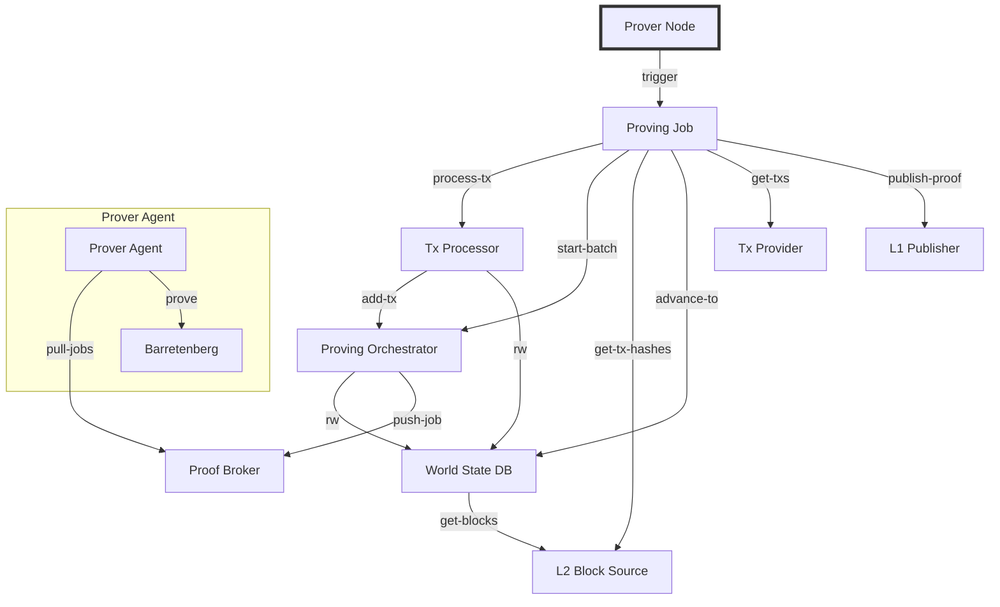

Prover nodes are core for the Aztec network. They orchestrate different prover nodes that prove every single public transaction and roll them up to a root proof that is then published to L1. Aztec is mathematics.

Running a prover means having deep understanding of blockchain technology, crypto economics, devops and hardware. It is an expensive endeavour that is often run by highly skilled engineers or teams.

## Prerequisites

- You need to fully understand the [concepts](../../concepts/provers-and-sequencers/) on proving and sequencing.
- Your confidence level is expected to be around "I'd be able to run a Prover _without_ this guide"

## Getting started

Running an Aztec Prover node means that the client will automatically monitor L1 for unclaimed epochs and propose bids (i.e. EpochProofQuote) for proving them. The prover node watches the L1 to see when a bid they submitted has been accepted by a sequencer, and will then kick off an epoch proving job which performs the following tasks:

- Downloads the transaction hashes in the epoch and all L1 to L2 messages from L1.
- Downloads the transaction objects with their ClientIVC proofs from a remote node (to be replaced by loading them from the P2P pool).
- Executes transactions in the epoch in order, generating proving jobs for each of them.
- Generates the inputs for each circuit and kicks off individual proving jobs to prover agents, recursively proving until it gets to the root rollup proof.
- Submits the root rollup proof to L1 to advance the proven chain.



As complex as it is, the command is actually fairly straightforward thanks to the modular nature of the `aztec start` command. There are still some flags you need to provide that are common to the [sequencers](./how_to_run_sequencer.md):

- `--archiver` - Just like with the sequencer, you need to run an archiver to store the L2 data
- `--prover-node` - The node that connects to both networks to fetch jobs and transactions
- `--prover-broker` - Talks with the node and the prover agents to assign jobs. This is useful if you intend to run provers in different machines
- `--prover-agent` - The actual prover that will fetch jobs from the broker and prove them with Barretenberg
- `--proverNode.p2pIp` - Same as for the sequencer, you need to prove an IP for your agents to find you
- `--proverNode.publisherPrivateKey` - You'll want to set this one too, so you can submit your proofs for L1

You can run them on the same machine. However, you can tweak the environment in many ways to achieve multi-machine proving clusters (ex. running just with `--prover-agent` and setting `--proverAgent.proverBrokerUrl` to a central broker).

For example:

```bash
aztec start --network alpha-testnet --l1-rpc-urls https://eth-sepolia.g.alchemy.com/v2/key --prover-node --prover-broker --prover-agent --archiver --proverNode.p2pIp \<ip\> --proverNode.publisherPrivateKey 0xkey
```

## Troubleshooting

:::tip
Please make sure you are in the Discord server and that you have been assigned one of the testnet roles. Turn on notifications for the announcements channel.
:::

If you encounter any errors or bugs, please try basic troubleshooting steps like restarting your node, checking ports and configs.

If issue persists, please share on the discord channel you've been assigned to.

Some issues are fairly light, the group and ourselves can help you within 60 minutes. If the issue isn't resolved, please send more information:

**Error Logs**: Attach any relevant error logs. If possible, note the timestamp when the issue began.
**Error Description**: Briefly describe the issue. Include details like what you were doing when it started, and any unusual behaviors observed.
**Steps to Reproduce (if known)**: If there’s a clear way to reproduce the error, please describe it.
**System Information**: Share details like your system’s operating system, hardware specs, and any other relevant environment information.

That way we can dedicate more time to troubleshoot and open Github issues if no known fix.
