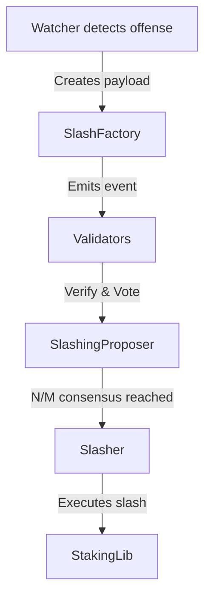
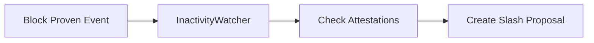

Slashing is a mechanism that penalizes validators who fail to participate properly in consensus or violate protocol rules. The Aztec protocol implements automatic slashing to maintain network security and validator accountability.

## Slashing Components

The slashing system consists of the following components:

| Component        | Type        | Purpose                                                    |
| ---------------- | ----------- | ---------------------------------------------------------- |
| StakingLib       | L1 Contract | Designates a slasher address that can slash validators     |
| Slasher          | L1 Contract | Executes slashing directives from the SlashingProposer     |
| SlashingProposer | L1 Contract | Coordinates voting on slash proposals (instance of Empire) |
| SlashFactory     | L1 Contract | Creates slash payloads for specific offenses               |
| SlasherClient    | Node        | Manages slash detection and voting in the node             |
| Watchers         | Node        | Monitor for specific slashable offenses                    |

## How Slashing Works

The slashing process requires consensus among validators before any stake is slashed. A slash occurs when at least N out of M validators vote for a specific slashing payload within a voting round.



## Slashable Offenses

The protocol automatically slashes validators for three types of offenses:

### 1. Liveness Failure

A validator failed to attest to a proven block. This ensures validators actively participate in consensus.

### 2. Data Availability/Finality Failure

An epoch was not proven and either:

- The data is unavailable, or
- The data is available and the epoch was valid

Each validator in the epoch's committee is slashed.

### 3. Safety Violation

A validator proposed an invalid block, threatening the integrity of the chain.

## SlashFactory Contract

The SlashFactory creates standardized slash payloads that specify which validators to slash, how much, and for what offense.

```solidity
interface ISlashFactory {
  event SlashPayloadCreated(
    address payloadAddress,
    address[] validators,
    uint256[] amounts,
    uint256[] offences
  );

  function createSlashPayload(
    address[] memory _validators,
    uint256[] memory _amounts,
    uint256[] memory _offences
  ) external returns (IPayload);
}
```

### Offense Types

Offenses are represented as integers:

- `0`: Unknown
- `1`: Proven block not attested to
- `2`: Unproven valid epoch
- `3`: Invalid block proposed

## Node Components

### SlasherClient

The SlasherClient serves as the interface between the node and the slashing system. It manages watchers and determines which slash payloads to support.

Key responsibilities:

- Instantiate and manage Watchers
- Listen for slash payload creation events
- Prioritize payloads by total slash amount
- Return the highest priority payload for voting

### Payload Priority System

Payloads are prioritized to ensure the most critical slashes are processed first:

1. Calculate total slash amount for each payload
2. Filter payloads to include only those verified by Watchers
3. Sort by total slash amount (largest first)
4. Apply TTL filtering when retrieving payloads
5. Support manual override for coordinated responses

## Watchers

Watchers monitor the network for specific types of violations and create slash proposals when detected.

### InactivityWatcher

Monitors validator participation in consensus:



Configuration parameters:

- `SLASH_INACTIVITY_CREATE_TARGET`: Threshold for creating a slash proposal
- `SLASH_INACTIVITY_SIGNAL_TARGET`: Threshold for supporting a slash proposal
- `SLASH_INACTIVITY_CREATE_PENALTY`: Amount to slash for inactivity
- `SLASH_INACTIVITY_MAX_PENALTY`: Maximum acceptable slash amount

### InvalidBlockWatcher

Detects when validators propose invalid blocks:

- Monitors block execution results
- Maintains cache of invalid blocks
- Creates slash proposals for block proposers
- Verifies slash proposals against cached invalid blocks

### ValidEpochUnprovenWatcher

Handles cases where valid epochs fail to be proven:

- Listens for chain pruning events
- Verifies no invalid blocks in the pruned epoch
- Slashes all validators in the epoch committee
- Ensures honest validators aren't penalized for invalid predecessors

## Configuration

Node operators can configure slashing behavior through various parameters:

### General Settings

- `SLASH_PAYLOAD_TTL`: Maximum age of payloads to vote for
- `SLASH_OVERRIDE_PAYLOAD`: Manual override for emergency coordination

### Per-Offense Settings

Each offense type has its own configuration:

**Inactivity**

- `SLASH_INACTIVITY_ENABLED`: Enable/disable inactivity slashing
- `SLASH_INACTIVITY_CREATE_TARGET`: Missed attestation % to create proposal
- `SLASH_INACTIVITY_SIGNAL_TARGET`: Missed attestation % to support proposal
- `SLASH_INACTIVITY_CREATE_PENALTY`: Slash amount for inactivity

**Invalid Blocks**

- `SLASH_INVALID_BLOCK_ENABLED`: Enable/disable invalid block slashing
- `SLASH_INVALID_BLOCK_PENALTY`: Slash amount for proposing invalid blocks
- `SLASH_INVALID_BLOCK_MAX_PENALTY`: Maximum acceptable slash amount

**Epoch Pruning**

- `SLASH_PRUNE_ENABLED`: Enable/disable pruning slashing
- `SLASH_PRUNE_PENALTY`: Slash amount for validators in pruned epochs
- `SLASH_PRUNE_MAX_PENALTY`: Maximum acceptable slash amount

## Block Re-execution

To accurately detect invalid blocks and avoid false positives, nodes must be able to re-execute blocks. This happens at two critical points:

1. **During P2P propagation**: When blocks are proposed and gathering attestations
2. **After L1 submission**: When blocks become part of the pending chain

The BlockBuilder interface enables this functionality:

```typescript
interface BlockBuilder {
  gatherTransactions(txHashes: TxHash[]): Promise<Tx[]>;
  executeTransactions(
    txs: Tx[],
    globals: GlobalContext,
    options: ExecutionOptions
  ): Promise<BuiltBlockResult>;
}
```

This ensures:

- Malicious validators are identified and slashed
- Honest validators who built on invalid blocks aren't penalized
- The network maintains consensus on block validity

## Security Considerations

The slashing system balances several important security properties:

- **No single point of failure**: Requires N/M validator consensus
- **Automatic detection**: Reduces reliance on manual intervention
- **Configurable thresholds**: Allows adaptation to network conditions
- **Override capability**: Enables emergency response coordination
- **False positive protection**: Re-execution prevents incorrect slashing

The threshold N/M for slashing consensus matches the general governance threshold, ensuring consistent security assumptions across the protocol.
