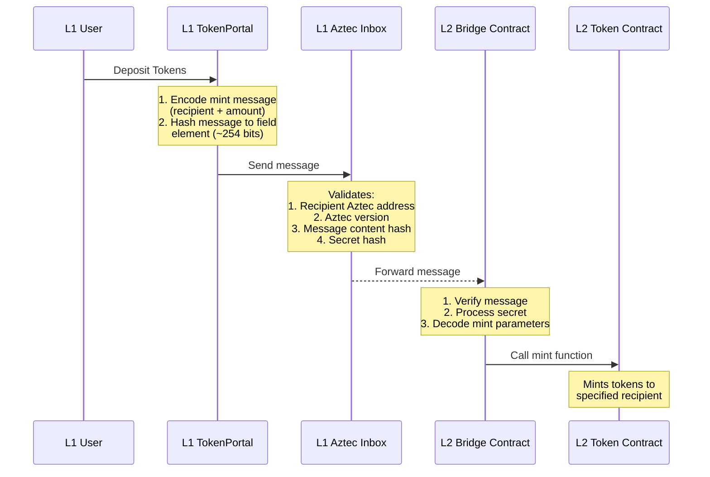

This tutorial goes over how to create the contracts necessary to create a portal (aka token bridge) and how a developer can use it.

In this tutorial, we will go over the components of a token bridge and how to deploy them, as well as show how to bridge tokens publicly from L1 to L2 and back, using aztec.js.

:::note
The JavaScript in this tutorial is for the sandbox and will need adjustments if deploying to testnet. Install the sandbox [here](../../../getting_started.md).
:::

The first half of this page reviews the process and contracts for bridging token from Ethereum (L1) to Aztec (L2). The second half the page (starting with [Running with Aztec.js](#running-with-aztecjs)) goes over writing your own Typescript script for:

- deploying and initializing contracts to L1 and L2
- minting tokens on L1
- sending tokens into the portal on L1
- minting tokens on L2
- sending tokens from L2 back to L1
- withdrawing tokens from the L1 portal

This tutorial is compatible with the Aztec version `v0.87.9`. Install the correct version with `aztec-up -v 0.87.9`. Or if you'd like to use a different version, you can find the relevant tutorial by clicking the version dropdown at the top of the page.

## Components

Bridges in Aztec involve several components across L1 and L2:

- L1 contracts:
  - `ERC20.sol`: An ERC20 contract that represents assets on L1
  - `TokenPortal.sol`: Manages the passing of messages from L1 to L2. It is deployed on L1, is linked to a specific token on L1 and a corresponding contract on L2. The `registry` is used to find the rollup and the corresponding `inbox` and `outbox` contracts.
- L2 contracts:
  - `Token`: Manages the tokens on L2
  - `TokenBridge`: Manages the bridging of tokens between L2 and L1

`TokenPortal.sol` is the contract that manages the passing of messages from L1 to L2. It is deployed on L1, is linked to a specific token on L1 and a corresponding contract on L2. The `registry` is used to find the rollup and the corresponding `inbox` and `outbox` contracts.

## How it works

### Deposit to Aztec

`TokenPortal.sol` passes messages to Aztec both publicly and privately.

This diagram shows the logical flow of information among components involved in depositing to Aztec.



Message content that is passed to Aztec is limited to a single field element (~254 bits), so if the message content is larger than that, it is hashed, and the message hash is passed and verified on the receiving contract. There is a utility function in the `Hash` library to hash messages (using `sha256`) to field elements.

The Aztec message Inbox expects a recipient Aztec address that can consume the message (the corresponding L2 bridge contract), the Aztec version (similar to Ethereum's `chainId`), the message content hash (which includes the token recipient and amount in this case), and a `secretHash`, where the corresponding `secret` is used to consume the message on the receiving contract.

So in summary, it deposits tokens to the portal, encodes a mint message, hashes it, and sends it to the Aztec rollup via the Inbox. The L2 token contract can then mint the tokens when the corresponding L2 bridge contract processes the message.

Note that because L1 is public, everyone can inspect and figure out the contentHash and the recipient contract address.

#### `depositToAztecPublic` (TokenPortal.sol)

```solidity title="deposit_public" showLineNumbers 
/**
 * @notice Deposit funds into the portal and adds an L2 message which can only be consumed publicly on Aztec
 * @param _to - The aztec address of the recipient
 * @param _amount - The amount to deposit
 * @param _secretHash - The hash of the secret consumable message. The hash should be 254 bits (so it can fit in a Field element)
 * @return The key of the entry in the Inbox and its leaf index
 */
function depositToAztecPublic(bytes32 _to, uint256 _amount, bytes32 _secretHash)
  external
  returns (bytes32, uint256)
```
> <sup><sub><a href="https://github.com/AztecProtocol/aztec-packages/blob/v0.87.9/l1-contracts/test/portals/TokenPortal.sol#L55-L66" target="_blank" rel="noopener noreferrer">Source code: l1-contracts/test/portals/TokenPortal.sol#L55-L66</a></sub></sup>


#### `depositToAztecPrivate` (TokenPortal.sol)

```solidity title="deposit_private" showLineNumbers 
/**
 * @notice Deposit funds into the portal and adds an L2 message which can only be consumed privately on Aztec
 * @param _amount - The amount to deposit
 * @param _secretHashForL2MessageConsumption - The hash of the secret consumable L1 to L2 message. The hash should be 254 bits (so it can fit in a Field element)
 * @return The key of the entry in the Inbox and its leaf index
 */
function depositToAztecPrivate(uint256 _amount, bytes32 _secretHashForL2MessageConsumption)
  external
  returns (bytes32, uint256)
```
> <sup><sub><a href="https://github.com/AztecProtocol/aztec-packages/blob/v0.87.9/l1-contracts/test/portals/TokenPortal.sol#L89-L99" target="_blank" rel="noopener noreferrer">Source code: l1-contracts/test/portals/TokenPortal.sol#L89-L99</a></sub></sup>


**So how do we privately consume the message on Aztec?**

On Aztec, anytime something is consumed (i.e. deleted), we emit a nullifier hash and add it to the nullifier tree. This prevents double-spends. The nullifier hash is a hash of the message that is consumed. So without the secret, one could reverse engineer the expected nullifier hash that might be emitted on L2 upon message consumption. To consume the message on L2, the user provides a secret to the private function, which computes the hash and asserts that it matches to what was provided in the L1->L2 message. This secret is included in the nullifier hash computation and the nullifier is added to the nullifier tree. Anyone inspecting the blockchain won’t know which nullifier hash corresponds to the L1->L2 message consumption.

### Minting on Aztec

The previous code snippets moved funds to the bridge and created a L1->L2 message. Upon building the next rollup block, the sequencer asks the L1 inbox contract for any incoming messages and adds them to the Aztec block's L1->L2 message tree, so an application on L2 can prove that the message exists and can consume it.

This happens inside the `TokenBridge` contract on Aztec.

```rust title="claim_public" showLineNumbers 
// Consumes a L1->L2 message and calls the token contract to mint the appropriate amount publicly
#[public]
fn claim_public(to: AztecAddress, amount: u128, secret: Field, message_leaf_index: Field) {
    let content_hash = get_mint_to_public_content_hash(to, amount);

    let config = storage.config.read();

    // Consume message and emit nullifier
    context.consume_l1_to_l2_message(content_hash, secret, config.portal, message_leaf_index);

    // Mint tokens
    Token::at(config.token).mint_to_public(to, amount).call(&mut context);
}
```
> <sup><sub><a href="https://github.com/AztecProtocol/aztec-packages/blob/v0.87.9/noir-projects/noir-contracts/contracts/app/token_bridge_contract/src/main.nr#L57-L71" target="_blank" rel="noopener noreferrer">Source code: noir-projects/noir-contracts/contracts/app/token_bridge_contract/src/main.nr#L57-L71</a></sub></sup>


What's happening here?

1. compute the content hash of the message
2. consume the message
3. mint the tokens

:::note

The Aztec `TokenBridge` contract should be an authorized minter in the corresponding Aztec `Token` contract so that it is able to complete mints to the intended recipient.

:::

The token bridge also allows tokens to be withdrawn back to L1 from L2. You can withdraw part of a public or private balance to L1, but the amount and the recipient on L1 will be public.

Sending tokens to L1 involves burning the tokens on L2 and creating a L2->L1 message. The message content is the `amount` to burn, the recipient address, and who can execute the withdraw on the L1 portal on behalf of the user. It can be `0x0` for anyone, or a specified address.

For both the public and private flow, we use the same mechanism to determine the content hash. This is because on L1, things are public anyway. The only difference between the two functions is that in the private domain we have to nullify user’s notes whereas in the public domain we subtract the balance from the user.

#### `exit_to_L1_public` (TokenBridge.nr)

```rust title="exit_to_l1_public" showLineNumbers 
// Burns the appropriate amount of tokens and creates a L2 to L1 withdraw message publicly
// Requires `msg.sender` to give approval to the bridge to burn tokens on their behalf using witness signatures
#[public]
fn exit_to_l1_public(
    recipient: EthAddress, // ethereum address to withdraw to
    amount: u128,
    caller_on_l1: EthAddress, // ethereum address that can call this function on the L1 portal (0x0 if anyone can call)
    nonce: Field, // nonce used in the approval message by `msg.sender` to let bridge burn their tokens on L2
) {
    let config = storage.config.read();

    // Send an L2 to L1 message
    let content = get_withdraw_content_hash(recipient, amount, caller_on_l1);
    context.message_portal(config.portal, content);

    // Burn tokens
    Token::at(config.token).burn_public(context.msg_sender(), amount, nonce).call(&mut context);
}
```
> <sup><sub><a href="https://github.com/AztecProtocol/aztec-packages/blob/v0.87.9/noir-projects/noir-contracts/contracts/app/token_bridge_contract/src/main.nr#L73-L92" target="_blank" rel="noopener noreferrer">Source code: noir-projects/noir-contracts/contracts/app/token_bridge_contract/src/main.nr#L73-L92</a></sub></sup>


#### `exit_to_L1_private` (TokenBridge.nr)

This function works very similarly to the public version, except here we burn user’s private notes.

```rust title="exit_to_l1_private" showLineNumbers 
// Burns the appropriate amount of tokens and creates a L2 to L1 withdraw message privately
// Requires `msg.sender` (caller of the method) to give approval to the bridge to burn tokens on their behalf using witness signatures
#[private]
fn exit_to_l1_private(
    token: AztecAddress,
    recipient: EthAddress, // ethereum address to withdraw to
    amount: u128,
    caller_on_l1: EthAddress, // ethereum address that can call this function on the L1 portal (0x0 if anyone can call)
    nonce: Field, // nonce used in the approval message by `msg.sender` to let bridge burn their tokens on L2
) {
    let config = storage.config.read();

    // Assert that user provided token address is same as seen in storage.
    assert_eq(config.token, token, "Token address is not the same as seen in storage");

    // Send an L2 to L1 message
    let content = get_withdraw_content_hash(recipient, amount, caller_on_l1);
    context.message_portal(config.portal, content);

    // Burn tokens
    Token::at(token).burn_private(context.msg_sender(), amount, nonce).call(&mut context);
}
```
> <sup><sub><a href="https://github.com/AztecProtocol/aztec-packages/blob/v0.87.9/noir-projects/noir-contracts/contracts/app/token_bridge_contract/src/main.nr#L125-L150" target="_blank" rel="noopener noreferrer">Source code: noir-projects/noir-contracts/contracts/app/token_bridge_contract/src/main.nr#L125-L150</a></sub></sup>


Since this is a private method, it can't read what token is publicly stored. So instead the user passes a token address, and `_assert_token_is_same()` checks that this user provided address is same as the one in storage.

Because public functions are executed by the sequencer while private methods are executed locally, all public calls are always done _after_ all private calls are completed. So first the burn would happen and only later the sequencer asserts that the token is same. The sequencer just sees a request to `execute_assert_token_is_same` and therefore has no context on what the appropriate private method was. If the assertion fails, then the kernel circuit will fail to create a proof and hence the transaction will be dropped.

A user must sign an approval message to let the contract burn tokens on their behalf. The nonce refers to this approval message.

### Claiming on L1

After the transaction is completed on L2, the portal must call the outbox to successfully transfer funds to the user on L1. Like with deposits, things can be complex here. For example, what happens if the transaction was done on L2 to burn tokens but can’t be withdrawn to L1? Then the funds are lost forever! How do we prevent this?

```solidity title="token_portal_withdraw" showLineNumbers 
/**
 * @notice Withdraw funds from the portal
 * @dev Second part of withdraw, must be initiated from L2 first as it will consume a message from outbox
 * @param _recipient - The address to send the funds to
 * @param _amount - The amount to withdraw
 * @param _withCaller - Flag to use `msg.sender` as caller, otherwise address(0)
 * @param _l2BlockNumber - The address to send the funds to
 * @param _leafIndex - The amount to withdraw
 * @param _path - Flag to use `msg.sender` as caller, otherwise address(0)
 * Must match the caller of the message (specified from L2) to consume it.
 */
function withdraw(
  address _recipient,
  uint256 _amount,
  bool _withCaller,
  uint256 _l2BlockNumber,
  uint256 _leafIndex,
  bytes32[] calldata _path
) external {
  // The purpose of including the function selector is to make the message unique to that specific call. Note that
  // it has nothing to do with calling the function.
  DataStructures.L2ToL1Msg memory message = DataStructures.L2ToL1Msg({
    sender: DataStructures.L2Actor(l2Bridge, rollupVersion),
    recipient: DataStructures.L1Actor(address(this), block.chainid),
    content: Hash.sha256ToField(
      abi.encodeWithSignature(
        "withdraw(address,uint256,address)",
        _recipient,
        _amount,
        _withCaller ? msg.sender : address(0)
      )
    )
  });

  outbox.consume(message, _l2BlockNumber, _leafIndex, _path);

  underlying.transfer(_recipient, _amount);
}
```
> <sup><sub><a href="https://github.com/AztecProtocol/aztec-packages/blob/v0.87.9/l1-contracts/test/portals/TokenPortal.sol#L122-L161" target="_blank" rel="noopener noreferrer">Source code: l1-contracts/test/portals/TokenPortal.sol#L122-L161</a></sub></sup>


#### `token_portal_withdraw` (TokenPortal.sol)

Here we reconstruct the L2 to L1 message and check that this message exists on the outbox. If so, we consume it and transfer the funds to the recipient. As part of the reconstruction, the content hash looks similar to what we did in our bridge contract on Aztec where we pass the amount and recipient to the hash. This way a malicious actor can’t change the recipient parameter to the address and withdraw funds to themselves.

We also use a `_withCaller` parameter to determine the appropriate party that can execute this function on behalf of the recipient. If `withCaller` is false, then anyone can call the method and hence we use address(0), otherwise only msg.sender should be able to execute. This address should match the `callerOnL1` address we passed in aztec when withdrawing from L2.

We call this pattern _designed caller_ which enables a new paradigm **where we can construct other such portals that talk to the token portal and therefore create more seamless crosschain legos** between L1 and L2.

## Running with Aztec.js

Let's run through the entire process of depositing, minting and withdrawing tokens in Typescript, so you can see how it works in practice.

Make sure you are using version v0.87.9 of the sandbox. Install with `aztec-up 0.87.9`.

### Prerequisites

Same prerequisites as the [getting started guide](../../../../developers/getting_started.md#prerequisites) and the sandbox.

### ProjectSetup

Create a new directory for the tutorial and install the dependencies:

```bash
mkdir token-bridge-tutorial
cd token-bridge-tutorial
yarn init -y
echo "nodeLinker: node-modules" > .yarnrc.yml
yarn add @aztec/aztec.js@0.87.9 @aztec/noir-contracts.js@0.87.9 @aztec/l1-artifacts@0.87.9 @aztec/accounts@0.87.9 @aztec/ethereum@0.87.9 @types/node typescript@^5.0.4 viem@^2.22.8 tsx
touch tsconfig.json
touch index.ts
```

Add this to your `tsconfig.json`:

```json
{
  "compilerOptions": {
    "rootDir": ".",
    "outDir": "./dest",
    "target": "es2020",
    "lib": ["dom", "esnext", "es2017.object"],
    "module": "NodeNext",
    "moduleResolution": "NodeNext",
    "strict": true,
    "declaration": true,
    "allowSyntheticDefaultImports": true,
    "esModuleInterop": true,
    "downlevelIteration": true,
    "inlineSourceMap": true,
    "declarationMap": true,
    "importHelpers": true,
    "resolveJsonModule": true,
    "composite": true,
    "skipLibCheck": true
  }
}
```

and add this to your `package.json`:

```json
  // ...
  "type": "module",
  "scripts": {
    "start": "node --import tsx index.ts"
  },
  // ...
```

You can run the script we will build in `index.ts` at any point with `yarn start`.

### Imports

Add the following imports to your `index.ts`:

```typescript title="imports" showLineNumbers 
import { getInitialTestAccountsWallets } from '@aztec/accounts/testing';
import {
  EthAddress,
  Fr,
  L1TokenManager,
  L1TokenPortalManager,
  createLogger,
  createPXEClient,
  waitForPXE,
} from '@aztec/aztec.js';
import { createExtendedL1Client, deployL1Contract } from '@aztec/ethereum';
import {
  FeeAssetHandlerAbi,
  FeeAssetHandlerBytecode,
  TestERC20Abi,
  TestERC20Bytecode,
  TokenPortalAbi,
  TokenPortalBytecode,
} from '@aztec/l1-artifacts';
import { TokenContract } from '@aztec/noir-contracts.js/Token';
import { TokenBridgeContract } from '@aztec/noir-contracts.js/TokenBridge';

import { getContract } from 'viem';
```
> <sup><sub><a href="https://github.com/AztecProtocol/aztec-packages/blob/v0.87.9/yarn-project/end-to-end/src/composed/e2e_token_bridge_tutorial_test.test.ts#L2-L27" target="_blank" rel="noopener noreferrer">Source code: yarn-project/end-to-end/src/composed/e2e_token_bridge_tutorial_test.test.ts#L2-L27</a></sub></sup>


### Utility functions

Add the following utility functions to your `index.ts` below the imports:

```typescript title="utils" showLineNumbers 
const MNEMONIC = 'test test test test test test test test test test test junk';
const { ETHEREUM_HOSTS = 'http://localhost:8545' } = process.env;

const l1Client = createExtendedL1Client(ETHEREUM_HOSTS.split(','), MNEMONIC);
const ownerEthAddress = l1Client.account.address;

const MINT_AMOUNT = BigInt(1e15);

const setupSandbox = async () => {
  const { PXE_URL = 'http://localhost:8080' } = process.env;
  // eslint-disable-next-line @typescript-eslint/await-thenable
  const pxe = await createPXEClient(PXE_URL);
  await waitForPXE(pxe);
  return pxe;
};

async function deployTestERC20(): Promise<EthAddress> {
  const constructorArgs = ['Test Token', 'TEST', l1Client.account.address];

  return await deployL1Contract(l1Client, TestERC20Abi, TestERC20Bytecode, constructorArgs).then(
    ({ address }) => address,
  );
}

async function deployFeeAssetHandler(l1TokenContract: EthAddress): Promise<EthAddress> {
  const constructorArgs = [l1Client.account.address, l1TokenContract.toString(), MINT_AMOUNT];
  return await deployL1Contract(l1Client, FeeAssetHandlerAbi, FeeAssetHandlerBytecode, constructorArgs).then(
    ({ address }) => address,
  );
}

async function deployTokenPortal(): Promise<EthAddress> {
  return await deployL1Contract(l1Client, TokenPortalAbi, TokenPortalBytecode, []).then(({ address }) => address);
}

async function addMinter(l1TokenContract: EthAddress, l1TokenHandler: EthAddress) {
  const contract = getContract({
    address: l1TokenContract.toString(),
    abi: TestERC20Abi,
    client: l1Client,
  });
  await contract.write.addMinter([l1TokenHandler.toString()]);
}
```
> <sup><sub><a href="https://github.com/AztecProtocol/aztec-packages/blob/v0.87.9/yarn-project/end-to-end/src/composed/e2e_token_bridge_tutorial_test.test.ts#L28-L72" target="_blank" rel="noopener noreferrer">Source code: yarn-project/end-to-end/src/composed/e2e_token_bridge_tutorial_test.test.ts#L28-L72</a></sub></sup>


### Sandbox Setup

Start the sandbox with:

```bash
aztec start --sandbox
```

And add the following code to your `index.ts`:

```ts
async function main() {
const logger = createLogger('aztec:token-bridge-tutorial');
const pxe = await setupSandbox();
const wallets = await getInitialTestAccountsWallets(pxe);
const ownerWallet = wallets[0];
const ownerAztecAddress = wallets[0].getAddress();
const l1ContractAddresses = (await pxe.getNodeInfo()).l1ContractAddresses;
logger.info('L1 Contract Addresses:');
logger.info(`Registry Address: ${l1ContractAddresses.registryAddress}`);
logger.info(`Inbox Address: ${l1ContractAddresses.inboxAddress}`);
logger.info(`Outbox Address: ${l1ContractAddresses.outboxAddress}`);
logger.info(`Rollup Address: ${l1ContractAddresses.rollupAddress}`);
}

main();
```

The rest of the code in the tutorial will go inside the `main()` function.

Run the script with `yarn start` and you should see the L1 contract addresses printed out.

### Deploying the contracts

Add the following code to `index.ts` to deploy the L2 token contract:

```typescript title="deploy-l2-token" showLineNumbers 
const l2TokenContract = await TokenContract.deploy(ownerWallet, ownerAztecAddress, 'L2 Token', 'L2', 18)
  .send()
  .deployed();
logger.info(`L2 token contract deployed at ${l2TokenContract.address}`);
```
> <sup><sub><a href="https://github.com/AztecProtocol/aztec-packages/blob/v0.87.9/yarn-project/end-to-end/src/composed/e2e_token_bridge_tutorial_test.test.ts#L91-L96" target="_blank" rel="noopener noreferrer">Source code: yarn-project/end-to-end/src/composed/e2e_token_bridge_tutorial_test.test.ts#L91-L96</a></sub></sup>


Add the following code to `index.ts` to deploy the L1 token contract and set up the `L1TokenManager` (a utility class to interact with the L1 token contract):

```typescript title="deploy-l1-token" showLineNumbers 
const l1TokenContract = await deployTestERC20();
logger.info('erc20 contract deployed');

const feeAssetHandler = await deployFeeAssetHandler(l1TokenContract);
await addMinter(l1TokenContract, feeAssetHandler);

const l1TokenManager = new L1TokenManager(l1TokenContract, feeAssetHandler, l1Client, logger);
```
> <sup><sub><a href="https://github.com/AztecProtocol/aztec-packages/blob/v0.87.9/yarn-project/end-to-end/src/composed/e2e_token_bridge_tutorial_test.test.ts#L99-L107" target="_blank" rel="noopener noreferrer">Source code: yarn-project/end-to-end/src/composed/e2e_token_bridge_tutorial_test.test.ts#L99-L107</a></sub></sup>


Add the following code to `index.ts` to deploy the L1 portal contract:

```typescript title="deploy-portal" showLineNumbers 
const l1PortalContractAddress = await deployTokenPortal();
logger.info('L1 portal contract deployed');

const l1Portal = getContract({
  address: l1PortalContractAddress.toString(),
  abi: TokenPortalAbi,
  client: l1Client,
});
```
> <sup><sub><a href="https://github.com/AztecProtocol/aztec-packages/blob/v0.87.9/yarn-project/end-to-end/src/composed/e2e_token_bridge_tutorial_test.test.ts#L110-L119" target="_blank" rel="noopener noreferrer">Source code: yarn-project/end-to-end/src/composed/e2e_token_bridge_tutorial_test.test.ts#L110-L119</a></sub></sup>


Add the following code to `index.ts` to deploy the L2 bridge contract:

```typescript title="deploy-l2-bridge" showLineNumbers 
const l2BridgeContract = await TokenBridgeContract.deploy(
  ownerWallet,
  l2TokenContract.address,
  l1PortalContractAddress,
)
  .send()
  .deployed();
logger.info(`L2 token bridge contract deployed at ${l2BridgeContract.address}`);
```
> <sup><sub><a href="https://github.com/AztecProtocol/aztec-packages/blob/v0.87.9/yarn-project/end-to-end/src/composed/e2e_token_bridge_tutorial_test.test.ts#L121-L130" target="_blank" rel="noopener noreferrer">Source code: yarn-project/end-to-end/src/composed/e2e_token_bridge_tutorial_test.test.ts#L121-L130</a></sub></sup>


Run `yarn start` to confirm that all of the contracts are deployed.

### Setup contracts

Add the following code to `index.ts` to authorize the L2 bridge contract to mint tokens on the L2 token contract:

```typescript title="authorize-l2-bridge" showLineNumbers 
await l2TokenContract.methods.set_minter(l2BridgeContract.address, true).send().wait();
```
> <sup><sub><a href="https://github.com/AztecProtocol/aztec-packages/blob/v0.87.9/yarn-project/end-to-end/src/composed/e2e_token_bridge_tutorial_test.test.ts#L133-L135" target="_blank" rel="noopener noreferrer">Source code: yarn-project/end-to-end/src/composed/e2e_token_bridge_tutorial_test.test.ts#L133-L135</a></sub></sup>


Add the following code to `index.ts` to set up the L1 portal contract and `L1TokenPortalManager` (a utility class to interact with the L1 portal contract):

```typescript title="setup-portal" showLineNumbers 
await l1Portal.write.initialize(
  [l1ContractAddresses.registryAddress.toString(), l1TokenContract.toString(), l2BridgeContract.address.toString()],
  {},
);
logger.info('L1 portal contract initialized');

const l1PortalManager = new L1TokenPortalManager(
  l1PortalContractAddress,
  l1TokenContract,
  feeAssetHandler,
  l1ContractAddresses.outboxAddress,
  l1Client,
  logger,
);
```
> <sup><sub><a href="https://github.com/AztecProtocol/aztec-packages/blob/v0.87.9/yarn-project/end-to-end/src/composed/e2e_token_bridge_tutorial_test.test.ts#L138-L153" target="_blank" rel="noopener noreferrer">Source code: yarn-project/end-to-end/src/composed/e2e_token_bridge_tutorial_test.test.ts#L138-L153</a></sub></sup>


### Bridge tokens

Add the following code to `index.ts` to bridge tokens from L1 to L2:

```typescript title="l1-bridge-public" showLineNumbers 
const claim = await l1PortalManager.bridgeTokensPublic(ownerAztecAddress, MINT_AMOUNT, true);

// Do 2 unrleated actions because
// https://github.com/AztecProtocol/aztec-packages/blob/7e9e2681e314145237f95f79ffdc95ad25a0e319/yarn-project/end-to-end/src/shared/cross_chain_test_harness.ts#L354-L355
await l2TokenContract.methods.mint_to_public(ownerAztecAddress, 0n).send().wait();
await l2TokenContract.methods.mint_to_public(ownerAztecAddress, 0n).send().wait();
```
> <sup><sub><a href="https://github.com/AztecProtocol/aztec-packages/blob/v0.87.9/yarn-project/end-to-end/src/composed/e2e_token_bridge_tutorial_test.test.ts#L155-L162" target="_blank" rel="noopener noreferrer">Source code: yarn-project/end-to-end/src/composed/e2e_token_bridge_tutorial_test.test.ts#L155-L162</a></sub></sup>


We have to send two additional transactions because the network must process 2 blocks for the message to be processed by the archiver. We need to progress by 2 because there is a 1 block lag between when the message is sent to Inbox and when the subtree containing the message is included in the block. Then when it's included it becomes available for consumption in the next block.

### Claim on Aztec

Add the following code to `index.ts` to claim the tokens publicly on Aztec:

```typescript title="claim" showLineNumbers 
await l2BridgeContract.methods
  .claim_public(ownerAztecAddress, MINT_AMOUNT, claim.claimSecret, claim.messageLeafIndex)
  .send()
  .wait();
const balance = await l2TokenContract.methods.balance_of_public(ownerAztecAddress).simulate();
logger.info(`Public L2 balance of ${ownerAztecAddress} is ${balance}`);
```
> <sup><sub><a href="https://github.com/AztecProtocol/aztec-packages/blob/v0.87.9/yarn-project/end-to-end/src/composed/e2e_token_bridge_tutorial_test.test.ts#L165-L172" target="_blank" rel="noopener noreferrer">Source code: yarn-project/end-to-end/src/composed/e2e_token_bridge_tutorial_test.test.ts#L165-L172</a></sub></sup>


Run `yarn start` to confirm that tokens are claimed on Aztec.

### Withdraw

Add the following code to `index.ts` to start the withdraw the tokens to L1:

```typescript title="setup-withdrawal" showLineNumbers 
const withdrawAmount = 9n;
const nonce = Fr.random();

// Give approval to bridge to burn owner's funds:
const authwit = await ownerWallet.setPublicAuthWit(
  {
    caller: l2BridgeContract.address,
    action: l2TokenContract.methods.burn_public(ownerAztecAddress, withdrawAmount, nonce),
  },
  true,
);
await authwit.send().wait();
```
> <sup><sub><a href="https://github.com/AztecProtocol/aztec-packages/blob/v0.87.9/yarn-project/end-to-end/src/composed/e2e_token_bridge_tutorial_test.test.ts#L176-L189" target="_blank" rel="noopener noreferrer">Source code: yarn-project/end-to-end/src/composed/e2e_token_bridge_tutorial_test.test.ts#L176-L189</a></sub></sup>


We have to send a public authwit to allow the bridge contract to burn tokens on behalf of the user.

Add the following code to `index.ts` to start the withdraw process on Aztec:

```typescript title="l2-withdraw" showLineNumbers 
const l2ToL1Message = await l1PortalManager.getL2ToL1MessageLeaf(
  withdrawAmount,
  EthAddress.fromString(ownerEthAddress),
  l2BridgeContract.address,
  EthAddress.ZERO,
);
const l2TxReceipt = await l2BridgeContract.methods
  .exit_to_l1_public(EthAddress.fromString(ownerEthAddress), withdrawAmount, EthAddress.ZERO, nonce)
  .send()
  .wait();

const newL2Balance = await l2TokenContract.methods.balance_of_public(ownerAztecAddress).simulate();
logger.info(`New L2 balance of ${ownerAztecAddress} is ${newL2Balance}`);
```
> <sup><sub><a href="https://github.com/AztecProtocol/aztec-packages/blob/v0.87.9/yarn-project/end-to-end/src/composed/e2e_token_bridge_tutorial_test.test.ts#L191-L205" target="_blank" rel="noopener noreferrer">Source code: yarn-project/end-to-end/src/composed/e2e_token_bridge_tutorial_test.test.ts#L191-L205</a></sub></sup>


Add the following code to `index.ts` to complete the withdraw process on L1:

```typescript title="l1-withdraw" showLineNumbers 
const [l2ToL1MessageIndex, siblingPath] = await pxe.getL2ToL1MembershipWitness(
  await pxe.getBlockNumber(),
  l2ToL1Message,
);
await l1PortalManager.withdrawFunds(
  withdrawAmount,
  EthAddress.fromString(ownerEthAddress),
  BigInt(l2TxReceipt.blockNumber!),
  l2ToL1MessageIndex,
  siblingPath,
);
const newL1Balance = await l1TokenManager.getL1TokenBalance(ownerEthAddress);
logger.info(`New L1 balance of ${ownerEthAddress} is ${newL1Balance}`);
```
> <sup><sub><a href="https://github.com/AztecProtocol/aztec-packages/blob/v0.87.9/yarn-project/end-to-end/src/composed/e2e_token_bridge_tutorial_test.test.ts#L207-L221" target="_blank" rel="noopener noreferrer">Source code: yarn-project/end-to-end/src/composed/e2e_token_bridge_tutorial_test.test.ts#L207-L221</a></sub></sup>


Run `yarn start` to run the script and see the entire process in action.
