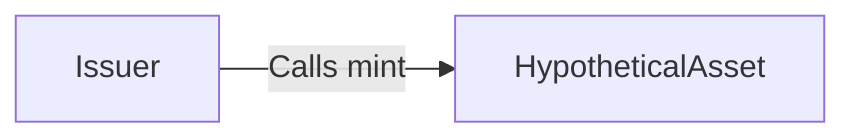
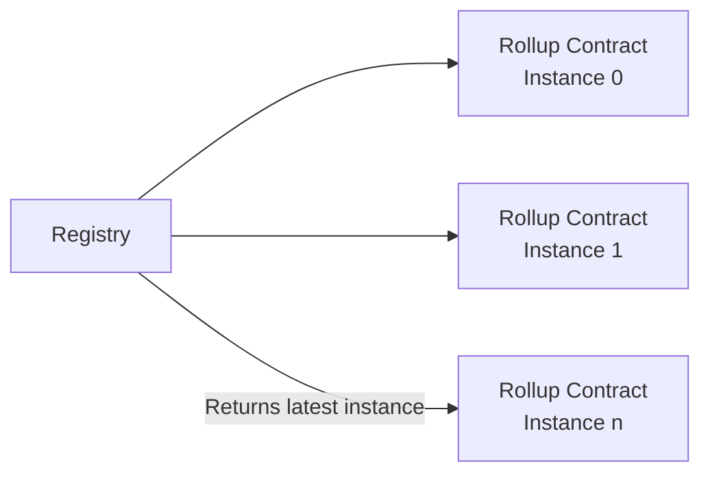
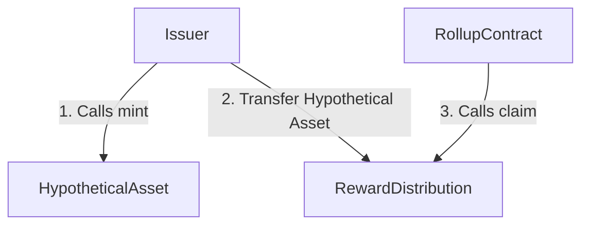
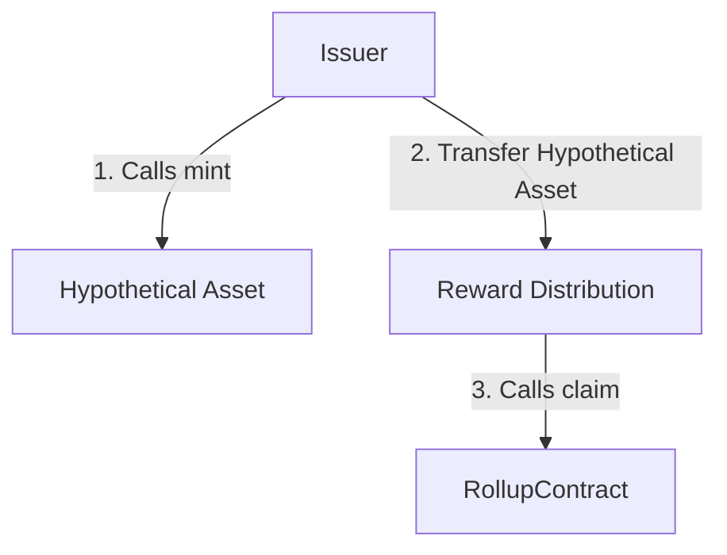

An Aztec deployment is a set of the following contracts:

| Smart Contract              | Immutability |
| --------------------------- | ------------ |
| Hypothetical Asset          | Immutable    |
| Issuer Contract             | Immutable    |
| Registry Contract           | Immutable    |
| RewardDistributor Contract  | Mutable      |
| GovernanceProposer Contract | Mutable      |
| Governance Contract         | Immutable    |
| Rollup Contract             | Immutable    |

## Hypothetical Asset Contract

Hypothetical Asset would live on Ethereum L1. It may have a minter which would be the only actor capable of calling the `mint` function on the Hypothetical Asset contract.

This is brought up to the community for discussion purposes only to illustrate how proposed governance mechanisms could work with a Hypothetical Asset.

- **Validators** must stake the Hypothetical Asset within the instance's contract to join that instance's validator set.
- **Holders** must lock Hypothetical Asset with the Governance contract to be able to vote on proposals.
- **Provers** must deposit Hypothetical Asset in the escrow contract in order to bid for the right to create a proof for an epoch.

## Issuer Contract

This contract will be the sole minter of Hypothetical Asset. It will itself have an owner, which is the only actor capable of calling the `mint` function on the Hypothetical Asset ERC20 contract.

The `mint` function will limit the amount of Hypothetical Assets that could be minted in a given time period. The reasoning behind this limit is that it makes supply expansions more predictable since "infinite mints" cannot be made.



```solidity
contract Issuer is Ownable {
    ERC20 immutable public ASSET; // Hypothetical Asset
    uint256 immutable public RATE;
    uint256 public timeOfLastMint;

    constructor(ERC20 _asset, uint256 _rate, address _owner) Ownable(_owner) {
        ASSET = _asset;
        RATE = _rate;
        timeOfLastMint = block.timestamp;
    }

    function mint(address _to, uint256 _amount) external onlyOwner {
        uint256 maxMint = RATE * (block.timestamp - timeOfLastMint);
        require(_amount <= maxMint, 'Insufficient mint available');

        timeOfLastMint = block.timestamp;
        ASSET.mint(_to, _amount);
    }
}
```

## Registry Contract

The governance of Aztec will be community driven - the Aztec community will be able to decide whether to upgrade or migrate to a new rollup instance. Portals / apps donʼt need to follow along with the Aztec governance and can specify the specific instance (i.e. “versionˮ) of the rollup that they view as canonical.

Therefore it will be necessary to keep track onchain of what versions of the rollup have existed as well as what version the Aztec governance views as the current canonical rollup. Only the current canonical rollup from the perspective of Aztec governance will be eligible to claim any further Hypothetical Asset rewards.



In practice, the Registry is an array of rollup instances that can only be inserted into by the Registryʼs owner - the Governance contract.

```solidity
contract Registry is IRegistry, Ownable {
    struct Instance {
        address rollup;
        uint96 blockNumber;
    }

    Instance[] public instances;

    constructor(address _gov) Ownable(_gov) {
        instances.push(
            Instance({address: address(0), blockNumber: block.number})
        );
    }

    function addInstance(address _rollup) external onlyOwner {
        instances.push(
            Instance({address: _rollup, blockNumber: block.number})
        );
    }

    function getRollup() external view returns (address) {
        return instances[instances.length - 1].rollup;
    }

    function getInstancesLength() external view returns (uint256) {
        return instances.length;
    }
}
```

## Reward Distribution Contract

This contract distributes ERC20 rewards only to the instance the Registry contract says is canonical. This is separated from the Registry and the Issuer so that the distribution logic can be changed without replacing the Registry.

In practice, the following flow is expected. Infrequently, the Aztec Governance votes for the Issuer smart contract to mint a quantity of Hypothetical Asset and send them to the Distribution contract. The rollup contract will call `claim(_to)` on the Distribution contract. This checks that the calling Rollup is the current canonical Rollup before releasing a Hypothetical Asset to the rollup.

The Rollup smart contract implements custom logic for how to split `BLOCK_REWARDS` amongst the proposers/committee/provers who provide real work in the form of electricity and hardware intensive computational resources to the Rollup smart contract.



```solidity
contract RewardDistribution is Ownable {
    uint256 public constant BLOCK_REWARD = xxx;

    IERC20 public immutable ASSET;
    IRegistry public registry;

    // constructor etc

    function claim(address _to) external returns (uint256) {
        address canonical = registry.getRollup();
        require(msg.sender == canonical);
        ASSET.safeTransfer(_to, BLOCK_REWARD);
        return BLOCK_REWARD;
    }

    function updateRegistry(IRegistry _registry) external onlyOwner {
        // ...
    }
}
```

Rollup contacts implementations should not revert if the `claim()` call reverts because the rollup is no longer canonical. Otherwise, no one could sequence the rollup anymore.

The separation of Distribution and Issuer is primarily for code hygiene purposes.

The protocol inflation rate is defined in the Issuer smart contract as the constant `RATE`. It is not possible to change this inflation rate once the Issuer smart contract has been deployed. Aztec Governance can vote on a proposal to deploy a new Issuer smart contract that contains a new `RATE`

The Aztec Governance will choose how often to call `mint()` on the Issuer smart contract which will send any Hypothetical Assets to the Distribution smart contract. The Distribution smart contract defines a `BLOCK_REWARD` constant value (again cannot be changed). Every epoch, the Rollup contract can call the Distribution smart contract to claim `BLOCK_REWARD` of Hypothetical Assets from the Distribution contract.

Both `RATE` and `BLOCK_REWARD` will be set upon deployment of the Aztec Rollup by the Aztec Governance. Both values are immutable and cannot be changed without re-deploying a new smart contract and a successful vote by Aztec Governance to switch to the new smart contracts.

## Proposals contract

This is the only smart contract that is able to submit proposals to the Governance contract.

The Proposals Contract will accept proposals only from sequencers of the current canonical instance, as indicated by the Registry.

```solidity
contract Proposals is IProposals {

    // ... imports

    IGovernance public immutable GOVERNANCE;
    IRegistry public immutable REGISTRY;
    uint256 public immutable N;
    uint256 public immutable M;

    constructor(IGovernance _governane, IRegistry _registry, uint256 _n, uint256 _m) {
        // ...

        require(N > M / 2);
        require(N <= M);
    }

    function vote(address _proposal) external override(IProposals) returns (bool) {
        require(_proposal.code.length > 0);
        // ...

        Rollup instance = Rollup(REGISTRY.getRollup());
        address proposer = instance.getCurrentProposer();
        require(msg.sender == proposer);
    }
    // ...
}
```

To vote to table a proposal, the current sequencer of the canonical rollup must deploy the contracts being proposed to upgrade / migrate to, to the L1. Then the current sequencer deploys the upgrade logic i.e. `_proposal`, then call `Proposals.vote(_proposal)`.

The Proposals contract will then count votes specifying that same `_proposal`. For a proposal to be nominated for voting, it must garner at least N votes in a single round, where a round is defined as a M consecutive L2 slots. Round 1 is L2 slots 0 - M - 1, while Round 2 is L2 slots M - 2M - 1 and so on.

Note that a sequencer’s ability to vote is not affected by the rollupʼs availability since voting happens on the L1.



If the quorum has been reahed, anyone can call `pushProposal(uint256 _roundNumber)` on the Proposals contract to send the proposal to the Governance contract for voting. As a result, only one proposal can be nominated for voting at any given round.

## Governance contract

This contract is the “assembly of Aztec citizensˮ that is the final arbiter of whether to enact the proposals from the Proposals Contract or not.

This contract decides what is the canonical instance which gets block rewards.

The Proposals contract tables proposals for voting, Holders who lock their Hypothetical Assets with the Governance contract may vote once for each Hypothetical Asset locked. They can vote either Yea or Nea.

Once a proposal garners the minimum number of votes, and the Yay votes exceed Nay by at least the `quorum%` , the proposal can be executed by the Governance contract.

```solidity
contract Governance is IGovernance {     // ... imports
    IERC20 public immutable ASSET;     address public proposalsContract;     // ...
    constructor(IERC20 _asset, address _proposalsContract, ui nt256 _votingDelay, uint256 _votingDuration,                    uint256 _gracePeriod, uint256 _quorum, uin t256 _voteDifferential, uint256 _minimumVotes) {         // ...
        configuration = DataStructures.Configuration({             votingDelay: Timestamp.wrap(_votingDelay), // Min time between proposal creation and when voting starts             votingDuration: Timestamp.wrap(_votingDuration), // Max duration of voting period
            executionDelay: Timestamp.wrap(_executionDelay), // Min time between voting passing and proposal execution             gracePeriod: Timestamp.wrap(_gracePeriod), // max time between proposal creation and proposal execution.
            quorum: _quorum, // % of deposited ASSET that mus t participate in a vote (could be Yes or No)             voteDifferential: _voteDifferential, // Yea must outweight Nea by this % to pass vote             minimumVotes: _minimumVotes, // users with this much cummulative deposited ASSET must participate in the vote         })
    }
// ...
function deposit(address _onBehalfOf, uint256 _amount) external override(IGovernance) {
    // deposits are allowed on behalf of other addresses
    users[_onBehalfOf].add(_amount);
    // ...
}

function initiateWithdraw(address _to, uint256 _amount) external override(IGovernance) returns (uint256) {
    // ...
    // No one can withdraw on behalf of someone else
    users[msg.sender].sub(_amount);
    // ...
}

function propose(address _payload) external override(IGovernance) returns (bool) {
    require(msg.sender == proposalsContract);
    // ...
}

function vote(uint256 _proposalId, uint256 _amount, bool _support) external override(IGovernance) returns (bool) {}

function execute(uint256 _proposalId) external override(IGovernance) returns (bool) {
    // execute proposal via `call()`
}
```
