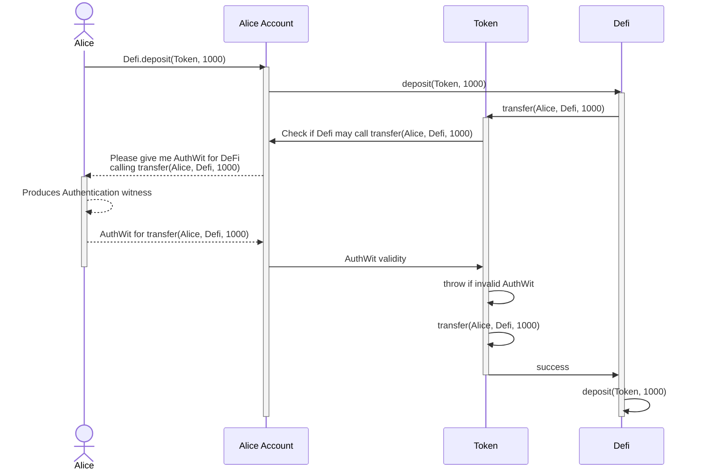
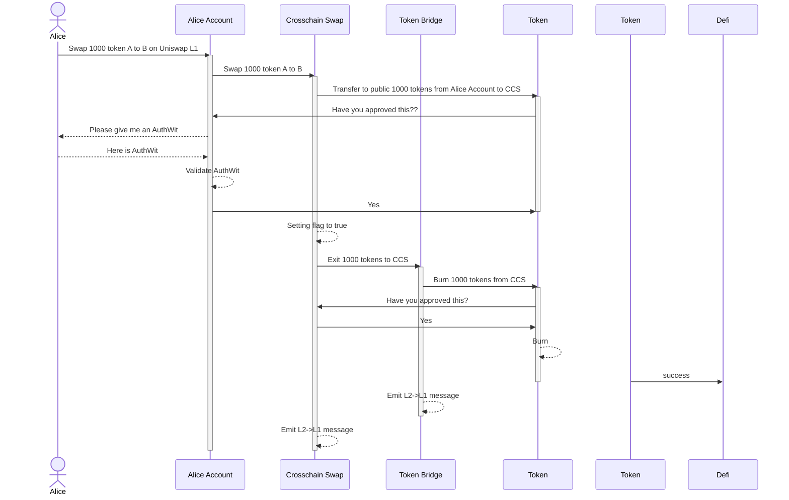

This page introduces the authwit library and how you can use it in your Aztec.nr smart contracts. [Skip to the usage](#usage).

For a guide on using authwit in Aztec.js, [read this](../../js_apps/authwit.md).

## Prerequisite reading

- [Authwit](../../../../aztec/concepts/advanced/authwit.md)

## Introduction

Authentication Witness (authwit) is a scheme for authentication actions on Aztec, so users can allow third-parties (eg other contracts) to execute an action on their behalf. Authwits can only authorize actions for contracts that your account is calling, they cannot be used to permit other users to take actions on your behalf.

How it works logically is explained in the [concepts](../../../../aztec/concepts/advanced/authwit.md) but we will do a short recap here.

An authentication witness is defined for a specific action, such as allowing a Defi protocol to transfer funds on behalf of the user. An action is here something that could be explained as `A is allowed to perform X operation on behalf of B` and we define it as a hash computed as such:

```rust
authentication_witness_action = H(
    caller: AztecAddress,
    contract: AztecAddress,
    selector: Field,
    argsHash: Field
);

// Example action that authenticates:
// defi contract to transfer 1000 tokens to itself on behalf of alice_account
authentication_witness_action = H(
  defi,
  token,
  transfer_selector,
  H(alice_account, defi, 1000)
);
```

Given the action, the developer can ask the `on_behalf_of` account contract if the action is authenticated or not.



:::info
Note in particular that the request for a witness is done by the token contract, and the user will have to provide it to the contract before it can continue execution. Since the request is made all the way into the contract where it is to be used, we don't need to pass it along as an extra input to the functions before it which gives us a cleaner interface.
:::

As part of `AuthWit` we are assuming that the `on_behalf_of` implements the private function:

```rust
#[private]
fn verify_private_authwit(inner_hash: Field) -> Field;
```

For public authwit, we have a shared registry that is used, there we are using a `consume` function.

Both return the value `0xabf64ad4` (`IS_VALID` selector) for a successful authentication, and `0x00000000` for a failed authentication. You might be wondering why we are expecting the return value to be a selector instead of a boolean. This is mainly to account for a case of selector collisions where the same selector is used for different functions, and we don't want an account to mistakenly allow a different function to be called on its behalf - it is hard to return the selector by mistake, but you might have other functions returning a bool.

## The `AuthWit` library.

As part of Aztec.nr, we are providing a library that can be used to implement authentication witness for your contracts.

This library also provides a basis for account implementations such that these can more easily implement authentication witness.

For our purposes here (not building a wallet), the most important part of the library is the `auth` utility which exposes a couple of helper methods for computing the action hash, retrieving witnesses, validating them and emitting the nullifier.

### General utilities

The primary general utility is the `compute_authwit_message_hash_from_call` function which computes the action hash from its components. This is useful for when you need to generate a hash that is not for the current call, such as when you want to update a public approval state value that is later used for [authentication in public](#updating-approval-state-in-noir). You can view the implementation of this function [here (GitHub link)](https://github.com/AztecProtocol/aztec-packages/blob/master/noir-projects/aztec-nr/authwit/src/auth.nr).

#### TypeScript utilities

To make it convenient to compute the message hashes in TypeScript, the `aztec.js` package includes a `computeAuthWitMessageHash` function that you can use. Implementation [here (GitHub link)](https://github.com/AztecProtocol/aztec-packages/blob/master/yarn-project/aztec.js/src/utils/authwit.ts).

### Utilities for private calls

For private calls where we allow execution on behalf of others, we generally want to check if the current call is authenticated by `on_behalf_of`. To easily do so, we can use the `assert_current_call_valid_authwit` which fetches information from the current context without us needing to provide much beyond the `on_behalf_of`.

This function will then make a call to `on_behalf_of` to execute the `verify_private_authwit` function which validates that the call is authenticated.
The `on_behalf_of` should assert that we are indeed authenticated and then return the `IS_VALID` selector. If the return value is not as expected, we throw an error. This is to cover the case where the `on_behalf_of` might implemented some function with the same selector as the `verify_private_authwit` that could be used to authenticate unintentionally.

#### Example

```rust title="assert_current_call_valid_authwit" showLineNumbers 
if (!from.eq(context.msg_sender())) {
    assert_current_call_valid_authwit(&mut context, from);
} else {
    assert(authwit_nonce == 0, "invalid authwit nonce");
}
```
> <sup><sub><a href="https://github.com/AztecProtocol/aztec-packages/blob/v0.88.0/noir-projects/noir-contracts/contracts/app/token_contract/src/main.nr#L416-L422" target="_blank" rel="noopener noreferrer">Source code: noir-projects/noir-contracts/contracts/app/token_contract/src/main.nr#L416-L422</a></sub></sup>


### Utilities for public calls

Very similar to the above, we have variations that work in the public domain (`assert_current_call_valid_authwit_public`). These functions are wrapped to give a similar flow for both cases, but behind the scenes the logic is slightly different since the public goes to the auth registry, while the private flow calls the account contract.

#### Example

```rust title="assert_current_call_valid_authwit_public" showLineNumbers 
if (!from.eq(context.msg_sender())) {
    assert_current_call_valid_authwit_public(&mut context, from);
} else {
    assert(authwit_nonce == 0, "invalid authwit nonce");
}
```
> <sup><sub><a href="https://github.com/AztecProtocol/aztec-packages/blob/v0.88.0/noir-projects/noir-contracts/contracts/app/token_contract/src/main.nr#L226-L232" target="_blank" rel="noopener noreferrer">Source code: noir-projects/noir-contracts/contracts/app/token_contract/src/main.nr#L226-L232</a></sub></sup>


## Usage

Ok, enough talking, how do we use this?

### Importing it

To add it to your project, add the `authwit` library to your `Nargo.toml` file.

```toml
[dependencies]
aztec = { git="https://github.com/AztecProtocol/aztec-packages/", tag="v0.88.0", directory="noir-projects/aztec-nr/aztec" }
authwit = { git="https://github.com/AztecProtocol/aztec-packages/", tag="v0.88.0", directory="noir-projects/aztec-nr/authwit"}
```

Then you will be able to import it into your contracts as follows.

```rust title="import_authwit" showLineNumbers 
use dep::authwit::auth::{
    assert_current_call_valid_authwit, assert_current_call_valid_authwit_public,
    compute_authwit_nullifier,
};
```
> <sup><sub><a href="https://github.com/AztecProtocol/aztec-packages/blob/v0.88.0/noir-projects/noir-contracts/contracts/app/token_contract/src/main.nr#L36-L41" target="_blank" rel="noopener noreferrer">Source code: noir-projects/noir-contracts/contracts/app/token_contract/src/main.nr#L36-L41</a></sub></sup>


### Private Functions

#### Checking if the current call is authenticated

Based on the diagram earlier on this page let's take a look at how we can implement the `transfer` function such that it checks if the tokens are to be transferred `from` the caller or needs to be authenticated with an authentication witness.

```rust title="transfer_in_private" showLineNumbers 
#[private]
fn transfer_in_private(
    from: AztecAddress,
    to: AztecAddress,
    amount: u128,
    authwit_nonce: Field,
) {
    if (!from.eq(context.msg_sender())) {
        assert_current_call_valid_authwit(&mut context, from);
    } else {
        assert(authwit_nonce == 0, "invalid authwit nonce");
    }

    storage.balances.at(from).sub(from, amount).emit(encode_and_encrypt_note(
        &mut context,
        from,
        from,
    ));
    storage.balances.at(to).add(to, amount).emit(encode_and_encrypt_note(&mut context, to, from));
}
```
> <sup><sub><a href="https://github.com/AztecProtocol/aztec-packages/blob/v0.88.0/noir-projects/noir-contracts/contracts/app/token_contract/src/main.nr#L408-L433" target="_blank" rel="noopener noreferrer">Source code: noir-projects/noir-contracts/contracts/app/token_contract/src/main.nr#L408-L433</a></sub></sup>


The first thing we see in the snippet above, is that if `from` is not the call we are calling the `assert_current_call_valid_authwit` function from [earlier](#private-functions). If the call is not throwing, we are all good and can continue with the transfer.

In the snippet we are constraining the `else` case such that only `nonce = 0` is supported. This is not strictly necessary, but because I can't stand dangling useless values. By making it constrained, we can limit what people guess it does, I hope.

#### Authenticating an action in TypeScript

Cool, so we have a function that checks if the current call is authenticated, but how do we actually authenticate it? Well, assuming that we use a wallet that is following the spec, we import `computeAuthWitMessageHash` from `aztec.js` to help us compute the hash, and then we simply `addAuthWitness` to the wallet. Behind the scenes this will make the witness available to the oracle.

```typescript title="authwit_transfer_example" showLineNumbers 
const action = asset
  .withWallet(wallets[1])
  .methods.transfer_in_private(accounts[0].address, accounts[1].address, amount, authwitNonce);

const witness = await wallets[0].createAuthWit({ caller: accounts[1].address, action });
expect(
  await wallets[0].lookupValidity(wallets[0].getAddress(), { caller: accounts[1].address, action }, witness),
).toEqual({
  isValidInPrivate: true,
  isValidInPublic: false,
});
```
> <sup><sub><a href="https://github.com/AztecProtocol/aztec-packages/blob/v0.88.0/yarn-project/end-to-end/src/e2e_token_contract/transfer_in_private.test.ts#L32-L44" target="_blank" rel="noopener noreferrer">Source code: yarn-project/end-to-end/src/e2e_token_contract/transfer_in_private.test.ts#L32-L44</a></sub></sup>


Learn more about authwits in Aztec.js by [following this guide](../../js_apps/authwit.md).

### Public Functions

With private functions covered, how can we use this in a public function? Well, the answer is that we simply change one name of a function and then we are good to go :eyes: (almost).

#### Checking if the current call is authenticated

```rust title="transfer_in_public" showLineNumbers 
#[public]
fn transfer_in_public(
    from: AztecAddress,
    to: AztecAddress,
    amount: u128,
    authwit_nonce: Field,
) {
    if (!from.eq(context.msg_sender())) {
        assert_current_call_valid_authwit_public(&mut context, from);
    } else {
        assert(authwit_nonce == 0, "invalid authwit nonce");
    }
    let from_balance = storage.public_balances.at(from).read().sub(amount);
    storage.public_balances.at(from).write(from_balance);
    let to_balance = storage.public_balances.at(to).read().add(amount);
    storage.public_balances.at(to).write(to_balance);
}
```
> <sup><sub><a href="https://github.com/AztecProtocol/aztec-packages/blob/v0.88.0/noir-projects/noir-contracts/contracts/app/token_contract/src/main.nr#L203-L221" target="_blank" rel="noopener noreferrer">Source code: noir-projects/noir-contracts/contracts/app/token_contract/src/main.nr#L203-L221</a></sub></sup>


#### Authenticating an action in TypeScript

Authenticating an action in the public domain is slightly different from the private domain, since we are executing a function on the auth registry contract to add the witness flag. As you might recall, this was to ensure that we don't need to call into the account contract from public, which is a potential DOS vector.

In the snippet below, this is done as a separate contract call, but can also be done as part of a batch as mentioned in the [Accounts concepts](../../../../aztec/concepts/advanced/authwit.md#what-about-public).

```typescript title="authwit_public_transfer_example" showLineNumbers 
const action = asset
  .withWallet(wallets[1])
  .methods.transfer_in_public(accounts[0].address, accounts[1].address, amount, authwitNonce);

const validateActionInteraction = await wallets[0].setPublicAuthWit({ caller: accounts[1].address, action }, true);
await validateActionInteraction.send().wait();
```
> <sup><sub><a href="https://github.com/AztecProtocol/aztec-packages/blob/v0.88.0/yarn-project/end-to-end/src/e2e_token_contract/transfer_in_public.test.ts#L69-L76" target="_blank" rel="noopener noreferrer">Source code: yarn-project/end-to-end/src/e2e_token_contract/transfer_in_public.test.ts#L69-L76</a></sub></sup>


#### Updating approval state in Noir

We have cases where we need a non-wallet contract to approve an action to be executed by another contract. One of the cases could be when making more complex defi where funds are passed along. When doing so, we need the intermediate contracts to support approving of actions on their behalf.

This is fairly straight forward to do using the `auth` library which includes logic for updating values in the public auth registry. Namely, you can prepare the `message_hash` using `compute_authwit_message_hash_from_call` and then simply feed it into the `set_authorized` function (both are in `auth` library) to update the value.

When another contract later is consuming the authwit using `assert_current_call_valid_authwit_public` it will be calling the registry, and spend that authwit.

An example of this would be our Uniswap example which performs a cross chain swap on L1. In here, we both do private and public auth witnesses, where the public is set by the uniswap L2 contract itself. In the below snippet, you can see that we compute the action hash and update the value in the registry. When we then call the `token_bridge` to execute afterwards, it reads this value, burns the tokens, and consumes the authentication.

```rust title="authwit_uniswap_set" showLineNumbers 
// This helper method approves the bridge to burn this contract's funds and exits the input asset to L1
// Assumes contract already has funds.
// Assume `token` relates to `token_bridge` (ie token_bridge.token == token)
// Note that private can't read public return values so created an internal public that handles everything
// this method is used for both private and public swaps.
#[public]
#[internal]
fn _approve_bridge_and_exit_input_asset_to_L1(
    token: AztecAddress,
    token_bridge: AztecAddress,
    amount: u128,
) {
    // Since we will authorize and instantly spend the funds, all in public, we can use the same nonce
    // every interaction. In practice, the authwit should be squashed, so this is also cheap!
    let authwit_nonce = 0xdeadbeef;

    let selector = FunctionSelector::from_signature("burn_public((Field),u128,Field)");
    let message_hash = compute_authwit_message_hash_from_call(
        token_bridge,
        token,
        context.chain_id(),
        context.version(),
        selector,
        [context.this_address().to_field(), amount as Field, authwit_nonce],
    );

    // We need to make a call to update it.
    set_authorized(&mut context, message_hash, true);

    let this_portal_address = storage.portal_address.read();
    // Exit to L1 Uniswap Portal !
    TokenBridge::at(token_bridge)
        .exit_to_l1_public(this_portal_address, amount, this_portal_address, authwit_nonce)
        .call(&mut context)
}
```
> <sup><sub><a href="https://github.com/AztecProtocol/aztec-packages/blob/v0.88.0/noir-projects/noir-contracts/contracts/app/uniswap_contract/src/main.nr#L185-L221" target="_blank" rel="noopener noreferrer">Source code: noir-projects/noir-contracts/contracts/app/uniswap_contract/src/main.nr#L185-L221</a></sub></sup>


Outlining more of the `swap` flow: this simplified diagram shows how it will look for contracts that are not wallets but also need to support authentication witnesses.



:::info **TODO**
Add a link to the blog-posts.
:::
