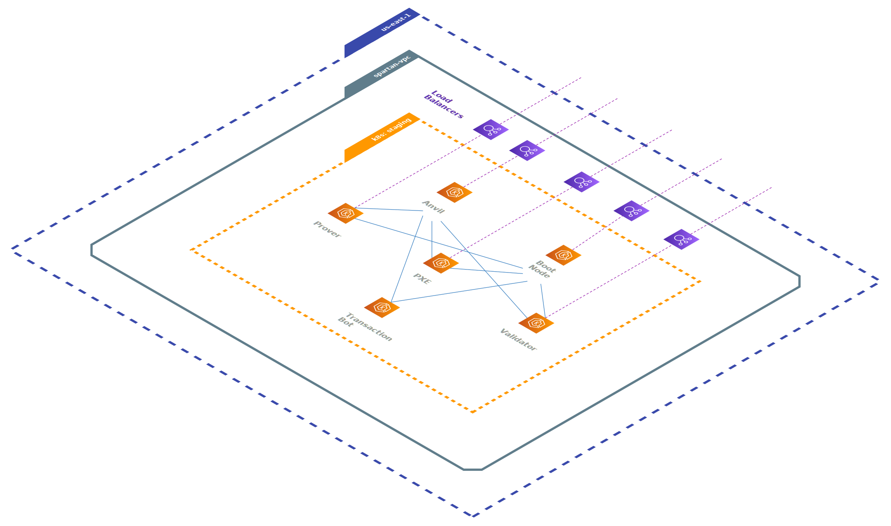

# Spartan Kubernetes Cluster

The Spartan Kubernetes cluster is used to run Aztec's public-facing node infrastructure. This README explains the Spartan cluster and its `staging` and `production` environments.

# Table of Contents

- [Prerequisites](#prerequisites)
- [Kubernetes Primer](#kubernetes-primer)
- [Aztec Staging and Production Environments](#aztec-staging-and-production-environments)
  - [Helm and KIND Compatibility](#helm-and-kind-compatibility)
- [Connecting to the Cluster](#connecting-to-the-cluster)
  - [Connecting to Spartan using the CLI](#connecting-to-spartan-using-the-cli)
  - [Connecting to Spartan using k8Lens](#connecting-to-spartan-using-k8lens)
- [Auxiliary Services](#auxiliary-services)
  - [Prometheus and Grafana](#prometheus-and-grafana)

## Prerequisites

Before connecting to the Spartan cluster, you will need to complete the following items:

- [Install AWS CLI Tools](https://docs.aws.amazon.com/cli/latest/userguide/getting-started-install.html)
- [Configure CLI Authentication](https://docs.aws.amazon.com/cli/latest/userguide/cli-authentication-user.html)
- [Install kubectl and ekcl](https://docs.aws.amazon.com/eks/latest/userguide/install-kubectl.html)

## Kubernetes Primer

If you are new to Kubernetes, the following resources may also be helpful:

- [kubectl Quick Reference](https://kubernetes.io/docs/reference/kubectl/quick-reference/)
- [Overview of Kubernetes Workloads](https://kubernetes.io/docs/concepts/workloads/)

## Aztec Staging and Production Environments

Aztec has two permanent network deployments: `staging` and `production`. These networks are intended to be long running and are not tied to activities and testing happening within CI.

Aztec's `staging` and `production` networks rely on a continuous delivery workflow (CD) and are configured to automatically refresh when node container images are released to the general public ([Github Action](https://github.com/AztecProtocol/aztec-packages/blob/master/.github/workflows/network-deploy.yml)). The following diagram shows a high-level topology of the two environments. Note that number of each node type may be changed over time. All nodes, with the exception of the transaction bot, are exposed to the public internet using a Kubernetes load balancer.



### Helm and KIND Compatibility

Deploying networks to the Spartan kubernetes cluster is done using the `aztec-network` Helm package. Helm is the package manager for Kubernetes (similar to NPM for Javascript). Packaging deployments using Helm allows them to be portable between Kubernetes distributions (different cloud providers), as well as compatible with Kubernetes-in-Docker (KIND) running on a local machine and in CI. Note that certain features of cloud hosted Kubernetes (such as load balancers) are not available in KIND. For this reason, all changes to the `aztec-network` Helm chart should be tested against a KIND environment to avoid breaking cross-compatibility. Features that are not available in KIND can be toggled during install using `if` statements inside of the Helm chart (`{{if .Values.network.public }}` for example).

## Connecting to the cluster

Accessing the Spartan cluster and nodes within the cluster can be done using either CLI or a GUI.

### Connecting to Spartan using the CLI

After all prerequisites are in place, your kubectl CLI can be authenticated to the Spartan cluster using the following commands to create a local `kubeconfig` file [[*](https://docs.aws.amazon.com/eks/latest/userguide/create-kubeconfig.html)]:

```
aws eks update-kubeconfig --region us-east-1 --name spartan
```

After the `kubeconfig` file is created, access to the Spartan cluster can be verified using command:

```
kubectl get svc
```

A valid response will show a list of cluster services and their corresponding IPs:

```
NAME              TYPE        CLUSTER-IP   EXTERNAL-IP   PORT(S)   AGE
example-service   ClusterIP   10.0.0.1     <none>        80/TCP    15m
```

With working connectivity in place, `kubectl` commands issued on your local machine will resolve to the Spartan kubernetes cluster. For example `kubectl get pods -n staging`.

#### NOTE: Switching between Spartan and KIND clusters

If KIND is installed to your local dev environment, it will create a new "kubernetes context" or cluster connection on your local machine. If you are not seeing the Kubernetes resources that are expected, confirm that your Kubernetes context is pointed to the desired cluster using command:

```
kubectl config get-contexts
```

An asterisk will note the active cluster connection. Cluster connections can be switched using command:

```
kubectl config use-context <context-name>
```

### Connecting to Spartan using k8Lens

A popular GUI that can be used to connect to the Spartan cluster is the free version of k8Lens. ([Download Link](https://k8slens.dev/))

As long as all CLI tools have been configured, k8Lens will automatically read your local `kubeconfig` file to provide cluster access. The Spartan cluster can then be located by navigating the k8Lens "catalog" as shown below.


Inside of the cluster, k8Lens can be used to visually browse workloads, as well as cluster configurations, networking, and storage.


Selecting individual pods provides options to open a console session as well as browse logs.

**NOTE**: Editing pod configurations directly is not recommended. Any direct edits will be lost during the next pod deployment and replaced by the corresponding IaC configuration stored in git.


## Auxiliary Services

Outside of Aztec network deployments, the Spartan cluster has a few additional services installed to support cluster operations.

### Prometheus and Grafana

_(coming soon...)_
